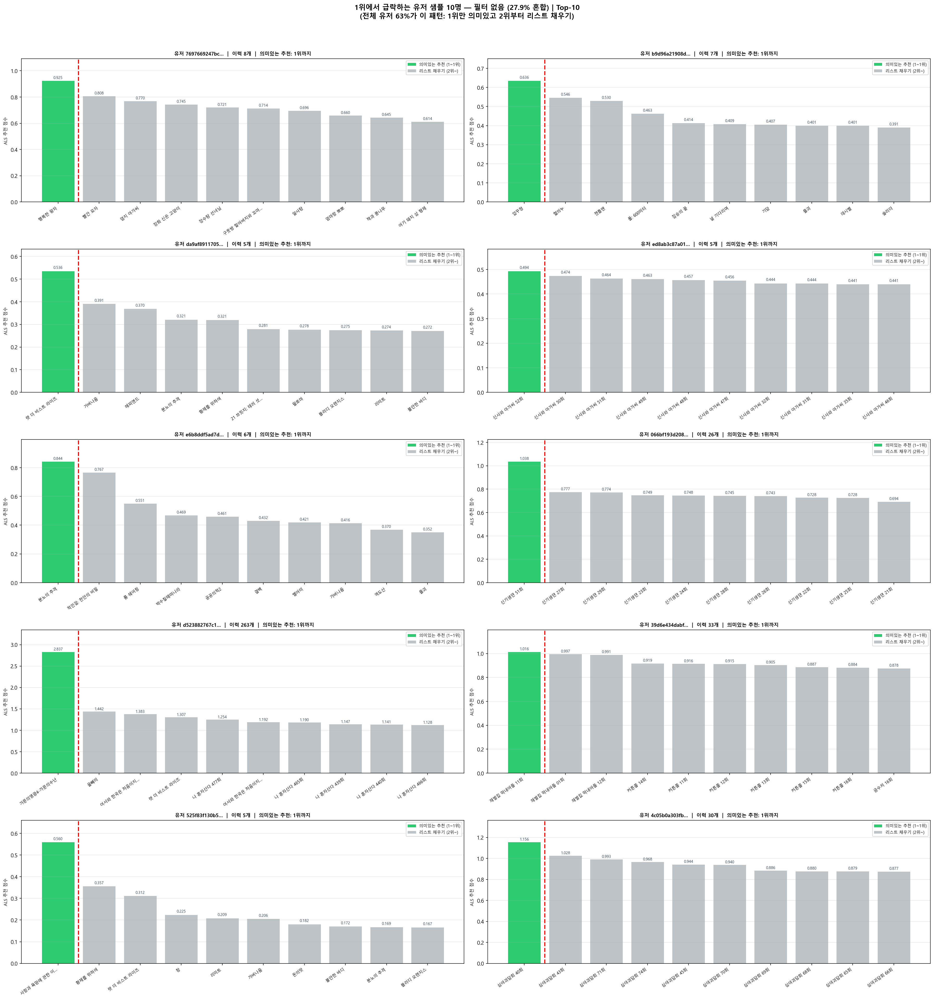

# 파일럿: 유저별 추천 리스트 급락 지점 분석

- 일시: 2026-03-17 17:35:24
- 샘플 유저: 10명 | Top-K: 10 | 품질 필터: OFF (27.9% 혼합)

## 그래프

> 🟢 초록 막대: 의미있는 추천 (급락 이전) | ⬜ 회색 막대: 리스트 채우기 (급락 이후) | 빨간 점선: 급락 지점

---

## 유저별 결과 요약

| 유저 ID (앞 16자) | 시청 이력 | 의미있는 추천 수 | 급락 지점 점수 | 마지막 의미있는 VOD |
|-----------------|---------|--------------|-------------|-------------------|
| 7697669247bc20db | 8개 | **1개** | 0.9251 | 행복한 왕자 |
| b9d96a21908d5ca3 | 7개 | **1개** | 0.6357 | 압꾸정 |
| da9af89117053923 | 5개 | **1개** | 0.5361 | 렛 더 비스트 라이즈 |
| ed8ab3c87a01c2d3 | 5개 | **1개** | 0.4941 | 신사와 아가씨 52회 |
| e6b8ddf5ad7d880e | 6개 | **1개** | 0.8440 | 분노의 추격 |
| 066bf193d208cd21 | 26개 | **1개** | 1.0376 | 신기생뎐 51회 |
| d523882767c144ac | 263개 | **1개** | 2.8369 | 가문의영광4-가문의수난 |
| 39d6e434dabf7707 | 33개 | **1개** | 1.0158 | 재벌집 막내아들 11회 |
| 525f83f130b53c16 | 5개 | **1개** | 0.5599 | 사랑과 욕망에 관한 이야기 |
| 4c05b0a303fb8c8a | 30개 | **1개** | 1.1563 | 심야괴담회 40회 |

---

## 유저별 전체 추천 리스트

### 유저 `7697669247bc20dbfc2d…`

- 시청 이력: 8개
- **의미있는 추천: 1~1위** / 리스트 채우기: 2~10위

| 순위 | VOD 이름 | 점수 | 구분 |
|------|---------|------|------|
| 1위 | 행복한 왕자 | 0.9251 | 🟢 의미있는 추천 **◀ 급락** |
| 2위 | 빨간 모자 | 0.8080 | ⬜ 리스트 채우기 |
| 3위 | 엄지 아가씨 | 0.7697 | ⬜ 리스트 채우기 |
| 4위 | 장화 신은 고양이 | 0.7452 | ⬜ 리스트 채우기 |
| 5위 | 장수탕 선녀님 | 0.7214 | ⬜ 리스트 채우기 |
| 6위 | 구둣방 할아버지와 꼬마 요정 | 0.7140 | ⬜ 리스트 채우기 |
| 7위 | 알사탕 | 0.6961 | ⬜ 리스트 채우기 |
| 8위 | 엄마랑 뽀뽀 | 0.6598 | ⬜ 리스트 채우기 |
| 9위 | 잭과 콩나무 | 0.6451 | ⬜ 리스트 채우기 |
| 10위 | 아기 돼지 삼 형제 | 0.6135 | ⬜ 리스트 채우기 |

### 유저 `b9d96a21908d5ca3965f…`

- 시청 이력: 7개
- **의미있는 추천: 1~1위** / 리스트 채우기: 2~10위

| 순위 | VOD 이름 | 점수 | 구분 |
|------|---------|------|------|
| 1위 | 압꾸정 | 0.6357 | 🟢 의미있는 추천 **◀ 급락** |
| 2위 | 혈의누 | 0.5465 | ⬜ 리스트 채우기 |
| 3위 | 젠틀맨 | 0.5300 | ⬜ 리스트 채우기 |
| 4위 | 폴: 600미터 | 0.4633 | ⬜ 리스트 채우기 |
| 5위 | 짐승의 끝 | 0.4138 | ⬜ 리스트 채우기 |
| 6위 | 널 기다리며 | 0.4091 | ⬜ 리스트 채우기 |
| 7위 | 기담 | 0.4069 | ⬜ 리스트 채우기 |
| 8위 | 물괴 | 0.4013 | ⬜ 리스트 채우기 |
| 9위 | 데시벨 | 0.4007 | ⬜ 리스트 채우기 |
| 10위 | 슬리더 | 0.3909 | ⬜ 리스트 채우기 |

### 유저 `da9af89117053923596b…`

- 시청 이력: 5개
- **의미있는 추천: 1~1위** / 리스트 채우기: 2~10위

| 순위 | VOD 이름 | 점수 | 구분 |
|------|---------|------|------|
| 1위 | 렛 더 비스트 라이즈 | 0.5361 | 🟢 의미있는 추천 **◀ 급락** |
| 2위 | 가버나움 | 0.3913 | ⬜ 리스트 채우기 |
| 3위 | 해피엔드 | 0.3696 | ⬜ 리스트 채우기 |
| 4위 | 분노의 추격 | 0.3215 | ⬜ 리스트 채우기 |
| 5위 | 황제를 위하여 | 0.3207 | ⬜ 리스트 채우기 |
| 6위 | 21 브릿지: 테러 셧다운 | 0.2806 | ⬜ 리스트 채우기 |
| 7위 | 팔로마 | 0.2779 | ⬜ 리스트 채우기 |
| 8위 | 블러디 오렌지스 | 0.2755 | ⬜ 리스트 채우기 |
| 9위 | 리미트 | 0.2739 | ⬜ 리스트 채우기 |
| 10위 | 불안한 바디 | 0.2725 | ⬜ 리스트 채우기 |

### 유저 `ed8ab3c87a01c2d34d21…`

- 시청 이력: 5개
- **의미있는 추천: 1~1위** / 리스트 채우기: 2~10위

| 순위 | VOD 이름 | 점수 | 구분 |
|------|---------|------|------|
| 1위 | 신사와 아가씨 52회 | 0.4941 | 🟢 의미있는 추천 **◀ 급락** |
| 2위 | 신사와 아가씨 50회 | 0.4744 | ⬜ 리스트 채우기 |
| 3위 | 신사와 아가씨 51회 | 0.4638 | ⬜ 리스트 채우기 |
| 4위 | 신사와 아가씨 49회 | 0.4625 | ⬜ 리스트 채우기 |
| 5위 | 신사와 아가씨 48회 | 0.4574 | ⬜ 리스트 채우기 |
| 6위 | 신사와 아가씨 47회 | 0.4558 | ⬜ 리스트 채우기 |
| 7위 | 신사와 아가씨 32회 | 0.4445 | ⬜ 리스트 채우기 |
| 8위 | 신사와 아가씨 31회 | 0.4444 | ⬜ 리스트 채우기 |
| 9위 | 신사와 아가씨 35회 | 0.4413 | ⬜ 리스트 채우기 |
| 10위 | 신사와 아가씨 46회 | 0.4412 | ⬜ 리스트 채우기 |

### 유저 `e6b8ddf5ad7d880ed621…`

- 시청 이력: 6개
- **의미있는 추천: 1~1위** / 리스트 채우기: 2~10위

| 순위 | VOD 이름 | 점수 | 구분 |
|------|---------|------|------|
| 1위 | 분노의 추격 | 0.8440 | 🟢 의미있는 추천 **◀ 급락** |
| 2위 | 적인걸: 천안의 비밀 | 0.7670 | ⬜ 리스트 채우기 |
| 3위 | 룸 쉐어링 | 0.5514 | ⬜ 리스트 채우기 |
| 4위 | 박수칠때떠나라 | 0.4692 | ⬜ 리스트 채우기 |
| 5위 | 공공의적2 | 0.4609 | ⬜ 리스트 채우기 |
| 6위 | 결백 | 0.4315 | ⬜ 리스트 채우기 |
| 7위 | 벨아미 | 0.4213 | ⬜ 리스트 채우기 |
| 8위 | 가버나움 | 0.4160 | ⬜ 리스트 채우기 |
| 9위 | 역도산 | 0.3704 | ⬜ 리스트 채우기 |
| 10위 | 물괴 | 0.3519 | ⬜ 리스트 채우기 |

### 유저 `066bf193d208cd219fde…`

- 시청 이력: 26개
- **의미있는 추천: 1~1위** / 리스트 채우기: 2~10위

| 순위 | VOD 이름 | 점수 | 구분 |
|------|---------|------|------|
| 1위 | 신기생뎐 51회 | 1.0376 | 🟢 의미있는 추천 **◀ 급락** |
| 2위 | 신기생뎐 27회 | 0.7769 | ⬜ 리스트 채우기 |
| 3위 | 신기생뎐 29회 | 0.7736 | ⬜ 리스트 채우기 |
| 4위 | 신기생뎐 23회 | 0.7486 | ⬜ 리스트 채우기 |
| 5위 | 신기생뎐 24회 | 0.7478 | ⬜ 리스트 채우기 |
| 6위 | 신기생뎐 28회 | 0.7451 | ⬜ 리스트 채우기 |
| 7위 | 신기생뎐 26회 | 0.7428 | ⬜ 리스트 채우기 |
| 8위 | 신기생뎐 22회 | 0.7281 | ⬜ 리스트 채우기 |
| 9위 | 신기생뎐 25회 | 0.7276 | ⬜ 리스트 채우기 |
| 10위 | 신기생뎐 21회 | 0.6936 | ⬜ 리스트 채우기 |

### 유저 `d523882767c144ac8e59…`

- 시청 이력: 263개
- **의미있는 추천: 1~1위** / 리스트 채우기: 2~10위

| 순위 | VOD 이름 | 점수 | 구분 |
|------|---------|------|------|
| 1위 | 가문의영광4-가문의수난 | 2.8369 | 🟢 의미있는 추천 **◀ 급락** |
| 2위 | 올빼미 | 1.4419 | ⬜ 리스트 채우기 |
| 3위 | 어서와 한국은 처음이지? 280회 | 1.3833 | ⬜ 리스트 채우기 |
| 4위 | 렛 더 비스트 라이즈 | 1.3073 | ⬜ 리스트 채우기 |
| 5위 | 나 혼자산다 477회 | 1.2538 | ⬜ 리스트 채우기 |
| 6위 | 어서와 한국은 처음이지? 279회 | 1.1915 | ⬜ 리스트 채우기 |
| 7위 | 나 혼자산다 465회 | 1.1899 | ⬜ 리스트 채우기 |
| 8위 | 나 혼자산다 439회 | 1.1471 | ⬜ 리스트 채우기 |
| 9위 | 나 혼자산다 440회 | 1.1410 | ⬜ 리스트 채우기 |
| 10위 | 나 혼자산다 466회 | 1.1277 | ⬜ 리스트 채우기 |

### 유저 `39d6e434dabf7707dbbd…`

- 시청 이력: 33개
- **의미있는 추천: 1~1위** / 리스트 채우기: 2~10위

| 순위 | VOD 이름 | 점수 | 구분 |
|------|---------|------|------|
| 1위 | 재벌집 막내아들 11회 | 1.0158 | 🟢 의미있는 추천 **◀ 급락** |
| 2위 | 재벌집 막내아들 01회 | 0.9968 | ⬜ 리스트 채우기 |
| 3위 | 재벌집 막내아들 12회 | 0.9906 | ⬜ 리스트 채우기 |
| 4위 | 커튼콜 14회 | 0.9192 | ⬜ 리스트 채우기 |
| 5위 | 커튼콜 11회 | 0.9159 | ⬜ 리스트 채우기 |
| 6위 | 커튼콜 12회 | 0.9149 | ⬜ 리스트 채우기 |
| 7위 | 커튼콜 13회 | 0.9052 | ⬜ 리스트 채우기 |
| 8위 | 커튼콜 15회 | 0.8871 | ⬜ 리스트 채우기 |
| 9위 | 커튼콜 16회 | 0.8844 | ⬜ 리스트 채우기 |
| 10위 | 금수저 16회 | 0.8783 | ⬜ 리스트 채우기 |

### 유저 `525f83f130b53c1685bd…`

- 시청 이력: 5개
- **의미있는 추천: 1~1위** / 리스트 채우기: 2~10위

| 순위 | VOD 이름 | 점수 | 구분 |
|------|---------|------|------|
| 1위 | 사랑과 욕망에 관한 이야기 | 0.5599 | 🟢 의미있는 추천 **◀ 급락** |
| 2위 | 황제를 위하여 | 0.3565 | ⬜ 리스트 채우기 |
| 3위 | 렛 더 비스트 라이즈 | 0.3124 | ⬜ 리스트 채우기 |
| 4위 | 창 | 0.2251 | ⬜ 리스트 채우기 |
| 5위 | 리미트 | 0.2094 | ⬜ 리스트 채우기 |
| 6위 | 가버나움 | 0.2064 | ⬜ 리스트 채우기 |
| 7위 | 돈의맛 | 0.1818 | ⬜ 리스트 채우기 |
| 8위 | 불안한 바디 | 0.1715 | ⬜ 리스트 채우기 |
| 9위 | 분노의 추격 | 0.1686 | ⬜ 리스트 채우기 |
| 10위 | 블러디 오렌지스 | 0.1675 | ⬜ 리스트 채우기 |

### 유저 `4c05b0a303fb8c8a2a2c…`

- 시청 이력: 30개
- **의미있는 추천: 1~1위** / 리스트 채우기: 2~10위

| 순위 | VOD 이름 | 점수 | 구분 |
|------|---------|------|------|
| 1위 | 심야괴담회 40회 | 1.1563 | 🟢 의미있는 추천 **◀ 급락** |
| 2위 | 심야괴담회 43회 | 1.0280 | ⬜ 리스트 채우기 |
| 3위 | 심야괴담회 71회 | 0.9932 | ⬜ 리스트 채우기 |
| 4위 | 심야괴담회 74회 | 0.9679 | ⬜ 리스트 채우기 |
| 5위 | 심야괴담회 45회 | 0.9444 | ⬜ 리스트 채우기 |
| 6위 | 심야괴담회 70회 | 0.9401 | ⬜ 리스트 채우기 |
| 7위 | 심야괴담회 69회 | 0.8861 | ⬜ 리스트 채우기 |
| 8위 | 심야괴담회 68회 | 0.8801 | ⬜ 리스트 채우기 |
| 9위 | 심야괴담회 65회 | 0.8794 | ⬜ 리스트 채우기 |
| 10위 | 심야괴담회 66회 | 0.8772 | ⬜ 리스트 채우기 |

