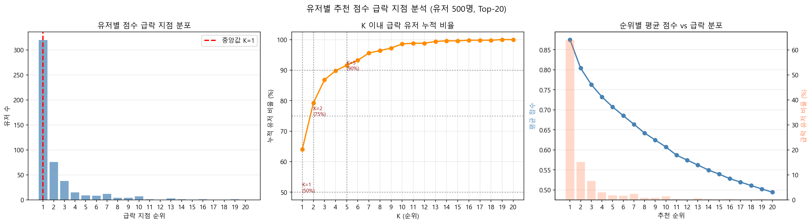

# 추천 점수 급락 지점 분석 리포트

- 일시: 2026-03-17 17:12:11
- 샘플 유저: 500명 | Top-K: 20 | 품질 필터: OFF

## 급락 지점 분포

| 순위 | 급락 유저 수 | 누적 비율 |
|------|------------|----------|
| 1위 | 315명 | 63.0% |
| 2위 | 80명 | 79.0% |
| 3위 | 32명 | 85.4% |
| 4위 | 22명 | 89.8% |
| 5위 | 10명 | 91.8% |
| 6위 | 11명 | 94.0% |
| 7위 | 7명 | 95.4% |
| 8위 | 4명 | 96.2% |
| 9위 | 8명 | 97.8% |
| 10위 | 2명 | 98.2% |
| 11위 | 4명 | 99.0% |
| 12위 | 0명 | 99.0% |
| 13위 | 3명 | 99.6% |
| 14위 | 0명 | 99.6% |
| 15위 | 2명 | 100.0% |
| 16위 | 0명 | 100.0% |
| 17위 | 0명 | 100.0% |
| 18위 | 0명 | 100.0% |
| 19위 | 0명 | 100.0% |
| 20위 | 0명 | 100.0% |

## 핵심 지표

| 항목 | 값 |
|------|----|
| 급락 지점 중앙값 | 1위 |
| 50% 유저 커버 K | 1 |
| 75% 유저 커버 K | 2 |
| 90% 유저 커버 K | 5 |
| 급락 지점 평균 점수 | 0.8444 |
| Top-20 끝 평균 점수 | 0.4837 |

## 유저별 급락 지점 상세

> 급락 순위 = 마지막으로 의미있는 추천을 받은 순위. 이후는 리스트 채우기 구간.

| 유저 ID | 급락 순위 | 점수 | 마지막 의미있는 추천 VOD | VOD ID |
|---------|----------|------|------------------------|--------|
| 235b436512c9f20cdc60e530c212df778a0e4225d7cb543e89b58f4e553fb670 | 11위 | 0.6285 | 소방서 옆 경찰서 05회 | cjc|M5127576LFOK77307001 |
| ce25da3a49df810ace71e6763ff6269453b807b3da7052ee7bfe6bca3118e975 | 1위 | 0.8699 | 폴: 600미터 | cjc|M5137534LSGL16322101 |
| 97b6090622817b8e5db14f7af0c93c84c0424e813644fec11eee35a9d4fa0ccc | 1위 | 0.7136 | 리미트 | cjc|M5083191LFOL10618801 |
| a0f0e62b467d17850b0fe34214b4e8b7f3a1dc620ae0543bb4f3fa92bb754ce0 | 10위 | 0.6024 | 한문철의 블랙박스 리뷰 13회 | cjc|M5139495LFOL00173201 |
| 4a505e5d51c691547fa69ecbdf281af915a1f45634dd0dd650d4fca0ddf4a016 | 13위 | 0.7345 | 재벌집 막내아들 15회 | cjc|M5128570LFOK81319801 |
| c35c026604b400e077381498a4b2c47921937a5019382f6c63531e6492b96abd | 1위 | 0.6143 | 완전한 사육: 욕망의 시작 | cjc|M4996864LFOL10619201 |
| f615a136d50935f48b9cb9aa5db6c2ee1a23457ed637277b2095e26ca6cefd42 | 2위 | 0.9760 | 심야괴담회 73회 | cjc|M5055648LFOJ63118601 |
| 01af5866787db0a64571dee3ba2ae6649a38154768e8cc52c5485f8801a93b24 | 2위 | 0.5486 | 사랑과 욕망에 관한 이야기 | cjc|M5143630LFOL23040601 |
| 43a8d36344ef2e2b45950ff32b58cfd682f91ef9bbc15a0b13c9edc159eb28b7 | 2위 | 1.0397 | 렛 더 비스트 라이즈 | cjc|M5143646LFOL23039601 |
| d6dd5ac8f373056ff020a4b93aa407ca968c47b2a2e9193b45520db80f8ca708 | 1위 | 0.2113 | 알쏭달쏭 캐치! 티니핑 01회 | cjc|M5133975LFOK84912101 |
| 8aec79b99b4738124d55e90196edc583acf4bda4afb5a1057ae771c5d831d637 | 2위 | 0.5845 | 꼬리에꼬리를무는그날이야기 60회 | cjc|M5092606LSGL16385501 |
| 8c8072197cdc7a7b2964b2043d36a29a7b6cdc2a638baae2958168c3b4179ca3 | 3위 | 0.8551 | 런닝맨 633회 | cjc|M5042783LFOJ31763801 |
| ef899c82f9efebed5c1c35ae64dd1957bbe70fa527c93b8ff06afbecf441f148 | 1위 | 0.9470 | 21 브릿지: 테러 셧다운 | cjc|M4796440LFOL10618301 |
| 1ba6d46f57fea481d30a7f3f0346c96ee322bbb5197cf89cf9946e657934dc26 | 1위 | 0.2888 | 늑대사냥 | cjc|M5148196LSVL25611801 |
| 80306c07e2aea1518e13b4906f5fc9e0da09d28ff6598a55dbee6cbedbfab8ab | 11위 | 0.8286 | 삼시세끼 어촌편 5 04회 | cjc|M4833700LSGJ58354401 |
| 8d5f5a6b356c7cc6f974619f20b34f387c0c10d81d925fa0f4375b8b806625dd | 1위 | 1.1045 | 짱구는 못말려 22기 01회 | cjc|M5087335LFOK45468501 |
| 7e316be664315817a9a9d0aa8bbf9dcb4d005926ceb9114b5431f06dbf56a23c | 1위 | 1.1607 | 선생김봉두 | cjc|M4458453LFOL14165901 |
| d3e9447486ac69a7b0f1691f34ac7657a7085742acf4181103f20c7aa79d6202 | 1위 | 0.9092 | 신비아파트 고스트볼Z:귀도퇴마사 01회 | cjc|M5045131LFOJ37770001 |
| 2dee0268b53129e64fba4ca08b846858f62e7096c6adcec9bfcdad3340e7b15f | 1위 | 0.5542 | 룸 쉐어링 | cjc|M5063448LFOL10618701 |
| 8f5363e77898fc0abc5a852773213c70bd25ffc571f7592669a4d490dd4797f9 | 1위 | 0.5950 | 적인걸: 천안의 비밀 | cjc|M5068719LFOL10619401 |
| 05c2c23047aeecfc55edc731de5f277b889ade1ecea77922e628825abb429bb1 | 1위 | 1.0091 | 런닝맨 635회 | cjc|M5042785LSGL14645701 |
| 29f29e456ea598fa9d220e9f662f181144d9f7e2408305f2e9e862afe81fbf1e | 9위 | 0.6981 | 나의 해방일지 14회 | cjc|M5038894LFOJ24817501 |
| d960769d6bd9d3af7f2f051610658d173136a3d73901ebe322c4d2629a6cafe6 | 3위 | 0.8915 | 미운우리새끼 328회 | cjc|M5063881LSGL32572201 |
| a8a10fc050f0f8f014df4811bd089eb8051c9b5c65803478778810bb277d2c6a | 4위 | 0.9719 | 신비한TV서프라이즈 1044회 | cjc|M5017555LFOI77363801 |
| 248d22a0f30101558473456fee16371c9ee54bd3229024b346173964d6147758 | 2위 | 0.8002 | 실화탐사대 197회 | cjc|M4981285LFOI39579901 |
| 329ae074a3ababee0a52cac3c214c92c91ee560e62084c5d20f58e15404e2954 | 1위 | 0.8464 | 신기한 놀이터 | cjc|I0001588LFO108264401 |
| c67642938397ce7eace896105ae52723230a16798f197fa81812af8b18521bf6 | 1위 | 1.0452 | 인간극장 3185회 | cjc|M5092691LFOK59465601 |
| c151685a139d13d29699116a14bf48bfe711dc9254098d42743f7388b428c92f | 1위 | 0.6864 | 결백 | cjc|M4855310LFOL10618601 |
| ba942bd939d1cadc9a2c0f7c54a19f3f14d2eea2c148be2e593e299386a35b79 | 1위 | 0.9275 | 나 혼자산다 480회 | cjc|M4955647LSGL32566101 |
| 7d7a3bb30786733b97493f90091120cc76be8e4566245dd5c5a96b74d346b350 | 1위 | 1.2401 | 리미트 | cjc|M5083191LFOL10618801 |
| ff3a2d69a69907fdf82010348ece40e25fcb6a09b7660f3cb56e4e2a80205b90 | 1위 | 0.8408 | 신비아파트 고스트볼Z:귀도퇴마사 01회 | cjc|M5045131LFOJ37770001 |
| e340836d8618d074ef089e20122c2454e31805e559a3a4ff14466cc6c4bb0e7c | 1위 | 0.6853 | 완전한 사육: 욕망의 시작 | cjc|M4996864LFOL10619201 |
| 89c02d37a2413cfaf3562a61396bc4cada84897dc0b756d033e6f3193308baa5 | 2위 | 0.9010 | 런닝맨 636회 | cjc|M5042786LFOJ31766401 |
| bba6176452a89be0bec463e444fee0c009af9dd804c15dcf4c4fb98c7391624e | 7위 | 0.9036 | 재벌집 막내아들 15회 | cjc|M5128570LFOK81319801 |
| 500334cdd67286fe81f02a2b4ee0e517ed552d72f0d908497c5b3ebbd0c936ad | 1위 | 0.4154 | 완전한 사육: 욕망의 시작 | cjc|M4996864LFOL10619201 |
| 7779595e8da4ed526b9d1acdfe05172b3ede17f3c1435ae8c5ebb326192e7d26 | 1위 | 1.0732 | 심야괴담회 73회 | cjc|M5055648LFOJ63118601 |
| 6e9d2c18488d27197e561ad1104b88250cc3e74e8bb587ece8fefe9d75a783a2 | 1위 | 0.9879 | 미스터트롯2 02회 | cjc|M5139553LSGL11587601 |
| 55bba2e24ed1b9cc2f27f82426e7f5cb9de4f828bcaad347b50aef29cdab3076 | 4위 | 0.6519 | 미쓰GO | cjc|M4887781LFOK41638001 |
| 8157497acf9700278e33f031550c4cfa9f31da7355c62f7a333cfe969525059f | 1위 | 1.0793 | 아바타 | cjc|M4333181LSGJ90329301 |
| 7e22eef5f9af400d83077f4ff19fda91c6c325ee08d55629921ab89b06eb4134 | 1위 | 0.7227 | 순정파이터 01회 | cjc|M5140916LFOL06067301 |
| be6149eddaf635a90b7238c5f55ad8363ede940e6620aecad635825f7b9d102d | 1위 | 0.6247 | 압꾸정 | cjc|M5140475LSGL08601501 |
| 20eb736d936a43c26323d3914f7c3fda2d0ef09f1e54942bedf9776906433116 | 13위 | 0.7756 | 악의 마음을 읽는 자들 08회 | cjc|M5016561LFOI75301801 |
| cf6adafa77001be0d4268ebbb225d48a1402e9154bfe3a40229ae5657effd0c0 | 1위 | 0.8196 | 꼬마버스타요 시즌4 03회 | cjc|M4309618LFOI51991401 |
| 71a98b3307ae815614ee5e9370303632f9dd4be61ef3bd9b78f52c29e805bf55 | 1위 | 0.4551 | 인간극장 3150회 | cjc|M5095997LFOJ59154201 |
| 9fa683b84e3cb676963b8d882892412b5814f502cfb32753dac5ad6650e8835f | 1위 | 0.8347 | 뽀로로와 노래해요 NEW 2 13회 | cjc|M4701118LFOK00397801 |
| c885ee189b28e20e43b1dedc098b6ab7ac374535cbc30b93c5aa4c764efe8b57 | 1위 | 0.3934 | 2022 WWE 스맥다운 53회 | cjc|M5146733LFOL21785201 |
| 6f13cb62903715229859242ef0f617d9c7ee1d9db87a1f7dc68d6195eac3892d | 1위 | 0.2303 | 가요무대 1787회 | cjc|M4974917LFOI39635101 |
| 2892a99002dae5a408e7722ab473b400e515c742d51451b87ad532fe3b6121d8 | 1위 | 0.9365 | 리미트 | cjc|M5083191LFOL10618801 |
| 75b0d8555b4cc5c8ec932e7ce248f1d08d6a424206bad9943010443808abc7eb | 2위 | 1.4451 | 적인걸: 천안의 비밀 | cjc|M5068719LFOL10619401 |
| a158a05e488424fc2ac991df94160f968f3cc47c5ce012860733db0e31d57fa8 | 1위 | 1.0029 | 골 때리는 그녀들 73회 | cjc|M5066105LFOJ84980401 |
| 4758c61f868bef6f70c7e7daafb367b8a881914776a977bee39653d51712cdee | 1위 | 1.1096 | 한산 리덕스 | cjc|M5137232LSGK92936701 |
| 4c588920be556ba115f5dc04fb4eeaa75bb2acf6f47526964cb7efe3a5b78d2d | 2위 | 0.8395 | 태풍의 신부 054회 | cjc|M5089918LFOK51974901 |
| 93a2ba3291010dbe03de24a9007b7f413b1a85f27c4acdb87ed96d0aeb5098dc | 1위 | 0.9585 | 안싸우면 다행이야 104회 | cjc|M5094879LFOK65020801 |
| 26e2843a886afb3f73af4bb33a80e1ec2c38e77ee41506852115c45633a23253 | 2위 | 0.9877 | 런닝맨 633회 | cjc|M5042783LFOJ31763801 |
| 747471cb511733571c3929451d00510b24aacdf8e36b37c29be106b7bdd6d92f | 1위 | 0.7215 | 흥미 백배 요즘 뜨는 태국 04회 | cjc|M5147899LFOL24318401 |
| b784786e5b1ccd483aef2a00e47b3504077fb6b2d24cf0458a5cb96cad8cff2f | 1위 | 0.7876 | 21 브릿지: 테러 셧다운 | cjc|M4796440LFOL10618301 |
| b8f25e8a9034682672e62a19691067aadd721970905daf8b60a520173b696772 | 1위 | 0.8286 | 슈퍼맨이돌아왔다 470회 | cjc|M5070402LFOJ94652601 |
| 76fd7f500256ba085a1415fe9682e7e49482e7977e74a3a9d137576591d9b8e9 | 1위 | 0.4136 | 닌자고 어둠의 크리스털. 30회 | cjc|M5053386LFOL05773201 |
| e9d9550263a6ffc51f10e32b965789bb8c1d42cccd873ca602b5940d7cc2205d | 1위 | 0.9339 | 완전한 사육: 욕망의 시작 | cjc|M4996864LFOL10619201 |
| ae240898a7fcb54c54db7111f29f55c8c23174716daafb7eecc25c570ccea4d9 | 4위 | 0.9440 | 태풍의 신부 065회 | cjc|M5089931LSGL24562601 |
| 7c5f5d953f109eef03e832941bfc2c4f534e3b11986fad38d78e660e4375c301 | 1위 | 0.7786 | 사랑과 욕망에 관한 이야기 | cjc|M5143630LFOL23040601 |
| 514f59f97b86b176baa7f40297bd2dc3345c937507866855d22e921982c8620e | 11위 | 0.9431 | 내 눈에 콩깍지 82회 | cjc|M5087992LSGL32554301 |
| b84fbd0256acd41879c9fc4cfd33a0044b6fa0f5523c2a1a7f9ba3370729f8f4 | 1위 | 0.9074 | 런닝맨 631회 | cjc|M5042781LFOJ31762201 |
| 8dd90e12e45c53a8ec17eaf12bccb04baa6ae7a5689cb308ad1f24c3f20de075 | 6위 | 0.7787 | 적인걸: 천안의 비밀 | cjc|M5068719LFOL10619401 |
| bd2327fa8d2ea2213435e7368627f6cc73ca72235c5fef1f42ca19089ca019cf | 2위 | 0.9151 | 금혼령, 조선 혼인 금지령 11회 | cjc|M5138221LSGL28310001 |
| 708f3ced1b221e191bfa9bac30af96457af47488b5b4084bd9f12a2ad9fc1d81 | 1위 | 0.5708 | 해피엔드 | cjc|M0411018LFOK51676601 |
| efc88026cfd457e44b1c104bad309efa7d3a744374afee570a9afc5ac95c8b9c | 1위 | 0.8459 | 욕망의 그늘 | cjc|M5068430LFOL10619301 |
| 20679f0c5c3991d6def45e22dd0eed3ed89dc7214a07a959f85263829f97d252 | 1위 | 0.7639 | 주몽 71회 | cjc|M0431257LSGK66132701 |
| abdaeacc40d0621891820c3619a336815632abcc92a07b7bab7d694da65989d9 | 2위 | 0.6739 | 아는 형님 363회 | cjc|M5084548LFOK26398501 |
| d29ebdcace0a7d5c57f5b361b5ff14503a79217955afe3acee51cf3c8238a132 | 1위 | 0.8920 | 런닝맨 626회 | cjc|M5128360LFOK81278901 |
| 05e85a32c5adfbf4c8e4794fd325b3f7f167a3507a18e51903e741078b26749c | 1위 | 0.5254 | 지니와 직업탐험 바쁘다바빠 02회 | cjc|M4791967LFOI83833301 |
| 461ed88498ef070e181f85dfdbd1a041ebb90bbf35021cf43e462e04718751ad | 1위 | 1.0558 | 가문의영광4-가문의수난 | cjc|M4887806LFOL10618401 |
| 2474ba1ab5a22255ab314640e767a0acbcd324d18af1c94eed7f7ba6a66396ea | 3위 | 0.9624 | 그것이알고싶다 1334회 | cjc|M5037355LFOJ22195701 |
| 45e721ee58d6ec4edd4f76e9ebc0d7a5ec05addf4ce21e5ff147437858327c65 | 1위 | 0.8195 | 늑대사냥 | cjc|M5148196LSVL25611801 |
| ef2f31c44cc3994108dd858f4955c0130aba5ec06e229684e9db3a2533cbef35 | 1위 | 0.6657 | 완전한 사육: 욕망의 시작 | cjc|M4996864LFOL10619201 |
| f7bcdb00ea847fb565aaf78e5becdb937c95852f05d5978a5c9a41467e478bca | 1위 | 0.3822 | 미쓰GO | cjc|M4887781LFOK41638001 |
| 5064fe22e57e804faaf6e05675c3655fd8cda3a117b7d1c7c3b410a74c54edcb | 1위 | 0.8066 | 백앤아 게임튜브 01회 | cjc|M5142705LFOL16390301 |
| c06e63f14ba6bf3496053f9981029d30a73e78be88ccd5abe2bc8c85381948a8 | 1위 | 0.8503 | 꼬리에꼬리를무는그날이야기 60회 | cjc|M5092606LFOK59334201 |
| d3dafe6a5a1975286c51201c13d1fada679c9da2a512ae2714835788f259eef5 | 1위 | 0.5425 | 가버나움 | cjc|M4690115LFOL10618501 |
| a158311d84d1f9eabd2df9c1516d44bebd5ce8f41c7fa00e5cba1464e3acc97d | 1위 | 0.7970 | 잠자는 숲속의 공주 | cjc|I1074651LFO108169801 |
| 75f4d4f69e8fc7e6271001ac4dad373496607280715a30ddddecbc4404dd9ffd | 1위 | 0.7244 | 불릿 투 더 헤드 | cjc|M4865809LFOK70916001 |
| 9159848c10cd0009541d18c120dd8d988335e1608ef1a97f1461118dcfb44737 | 1위 | 1.1127 | 놀면 뭐하니? 173회 | cjc|M5144755LSGL28311901 |
| 524ad2875c22cc8404ec870cb00d3ec01cdceda4733f18b5cfda8fe0efbb858a | 4위 | 1.0253 | 궁금한이야기Y 620회 | cjc|M5071560LSGL22948001 |
| f7351a4861a76048f903a96dbf0396ffa2b38f27f4937b61e11acf00c13aa70c | 1위 | 0.6743 | 나 혼자산다 476회 | cjc|M4955643LFOI39640001 |
| 26cab521b23db412e790620f3518b7de0f3f125fbd6443daab7ac0f5b3521d49 | 1위 | 0.9856 | 나 혼자산다 476회 | cjc|M4955643LFOI39640001 |
| d8cb5d118f3d3833cd2bb77213c528da79118063f6ffbcef7fc9358359108a41 | 6위 | 0.8074 | 런닝맨 634회 | cjc|M5042784LFOJ31764601 |
| 3c970099079327d1eff28bf861c7610b5bbebc96ccde870c529f286818a3fc20 | 6위 | 0.9385 | 꼬리에꼬리를무는그날이야기 53회 | cjc|M5092599LFOK59331401 |
| 76a99a1922e2df6ccdacdc438780e180b3b68c6139e1fb39b88f056f911388dc | 1위 | 1.0093 | 욕망의 그늘 | cjc|M5068430LFOL10619301 |
| a7ea0ef1a23ca454a540c35800f2bb66921bc5bd3027c563a273be2c12675641 | 1위 | 0.7228 | 넛잡-땅콩도둑들 | cjc|M4755128LFOL10618001 |
| ac3241dff682ec7e534fae9bb54dfb8e75321f041ae9c49f1fa133f3bb743b78 | 1위 | 1.1986 | 결백 | cjc|M4855310LFOL10618601 |
| d3feac6ba8091a5c60113a565c01915a48ec0480b715048e439ef6aa37535015 | 2위 | 0.7847 | 인간극장 3195회 | cjc|M5092701LFOK59469601 |
| e1ea8a1ca7aa21c5000fff2fd54c1b84470dbfcd972001265b74d8ca07f56124 | 1위 | 0.8748 | 분노의 추격 | cjc|M5086583LFOL10619101 |
| 687ed2c04d2b5041f74d58081683184f0f0cda6a114ad9466f8afcc6bb6bd2db | 1위 | 0.8515 | 완전한 사육: 욕망의 시작 | cjc|M4996864LFOL10619201 |
| 9a4edc3ff7bb5d9fc001557912e812c3b74e5482a25f57f2a7ce302dfb75f285 | 2위 | 0.6735 | 인간극장 3190회 | cjc|M5092696LFOK59467401 |
| 5dbc46083ab6f564041be40205d4f6ba4fb5f32be91da9f553bb88d73b2023f6 | 1위 | 0.7658 | 미스터트롯2 02회 | cjc|M5139553LFOL28424601 |
| 1ee88be660f0da422ddcd1a94424e949011bea741a87936209eb3cd76f57b68a | 1위 | 0.8678 | 법쩐 05회 | cjc|M5144833LSGL28315801 |
| 7f0afd95efa7c5dbd0922d3a3a4707c2fa42f5e448865ce1762018dc795c1496 | 3위 | 0.9817 | 금혼령, 조선 혼인 금지령 11회 | cjc|M5138221LSGL28310001 |
| fa9fe78f4a42be7073259160adbe758dfc93d02822699af3cf3e56f58f22a2d0 | 2위 | 1.0646 | 런닝맨 634회 | cjc|M5042784LFOJ31764601 |
| 71b6df71b0ebda7a4791e936479f02f9b3f07742d2a278bb15c1a01ab5330925 | 1위 | 0.6987 | 코리아 | cjc|M0170712LFOL14186601 |
| 484224951461f19c6879b9d8b95637836c9e3bca292d2b4aaf374dfb33d7e09b | 1위 | 0.5710 | 출근길에 만난 유부녀와 불륜 섹스 | cjc|M4974980LSVL24636401 |
| b0d07b0e56d73aec257d39cbb50edbf4fc939c9be01160774b3f8acb812419f7 | 2위 | 1.0003 | 사랑과 욕망에 관한 이야기 | cjc|M5143630LFOL23040601 |
| 0676e18778ca6095494ec1f9829aa3f3addcdfc461df6b8b7b817289aa2d792b | 1위 | 0.4121 | 바다의 점령자 01회 | cjc|M5140519LFOL04824601 |
| 7f693e9a3959935e33115071f34be7d0bd0e8f3f1eb3de16c50ab5cf3256b455 | 1위 | 0.9895 | 법쩐 03회 | cjc|M5144830LSGL22947701 |
| 2360e9e4ea253708d793e548fc148419d9146f3d16c4ab14fa3f16053ced754f | 1위 | 0.6406 | 빨간 풍선 03회 | cjc|M5138775LFOK97398101 |
| 684264ad2d1ea0812d9b4716fe63b144661a9273172bab09714e5ad63c7b8ad5 | 4위 | 0.8834 | 런닝맨 635회 | cjc|M5042785LFOJ31765301 |
| 8d2213c51d5a745dde9386b8108d562b71541d68ba1caf71bdc661306d2658da | 5위 | 0.8808 | 21 브릿지: 테러 셧다운 | cjc|M4796440LFOL10618301 |
| 6a36c3f5bcc4b7c81e6973429527a54707f7045857d363a953ff6e669fed7b4f | 1위 | 1.0858 | 적인걸: 천안의 비밀 | cjc|M5068719LFOL10619401 |
| 6ca18a1427f183be499c8e7f2eb17e577dbe619fa16fc207468a1c8503537aac | 2위 | 0.8228 | 법쩐 08회 | cjc|M5144826LSGL32571001 |
| 1f6297138e39fa250854a4772a5fb5b2ee783a10afc6580d4108afbc21c33cd4 | 1위 | 0.3130 | 옷소매 붉은 끝동 16회 | cjc|M4998790LFOI38700901 |
| 4b2f9842be445d1ccfd85422e786206acd9977c3b95d0797d02ab82d734eda83 | 1위 | 0.6999 | 룸 쉐어링 | cjc|M5063448LFOL10618701 |
| bed5b0baf6334c19374aaa14e6ee862e76c5ef7a031452977a8f98eae0f5095c | 9위 | 0.8903 | 재벌집 막내아들 15회 | cjc|M5128570LFOK81319801 |
| 704faf07107ac70bb86689f6ed3f9e51c0ea6595be0d97dc6eaa4b0caf4846a1 | 1위 | 0.9414 | 분노의 추격 | cjc|M5086583LFOL10619101 |
| 2198de1604dd4d7191be971431415f6bd3b99a007217ac326bb76aec20445e5d | 2위 | 0.8266 | 태어난 김에 세계일주 01회 | cjc|M5138230LFOK96106901 |
| 7235ab4b2010d4e4c03ba9da8f14fcb13736e1d0b6f4a39932ebab67cab9366e | 1위 | 0.8678 | 치얼업 16회 | cjc|M5089172LFOK50592001 |
| 9f9c4d9b87aa4a631be0623d292b86ea8833b1d58aca67f2c786e6eba36d981c | 1위 | 0.4100 | 늑대사냥 | cjc|M5148196LSVL25611801 |
| ca69a2b276856d6aa33c8be55725b71892ac2cb9211281fe33beaa1ec78de970 | 1위 | 0.9458 | 심야괴담회 71회 | cjc|M5139745LFOJ63117601 |
| d5986a859645122f95c126347ddfb22bff6bba7680141c74148133029dd59559 | 1위 | 1.0456 | 나 혼자산다 478회 | cjc|M4955645LSGL22945901 |
| 5c00176645af05a346cd20419b2485b8ed4e2b24b00f83aa21fafb1e26b8621f | 5위 | 0.7657 | 트롤리 10회 | cjc|M5139626LSGL24572701 |
| 32770f997d815450f0a224994e5a02a3728ed553cb0e20ee36cee4a7936eeffc | 1위 | 1.0115 | 리미트 | cjc|M5083191LFOL10618801 |
| 8545473345e545ea8eae666d1161b16bce72758a88d040f9ab3e31ffaf9dbd04 | 3위 | 0.7684 | 런닝맨 633회 | cjc|M5042783LFOJ31763801 |
| f393978175e2c9120f415f758b4f89e23aff2ca294ac79c3b9bf8240b7270da5 | 1위 | 0.9652 | 짐승의 끝 | cjc|M4655263LFOK45283701 |
| 1e2016582ec302436d34cbd864ba1c8ab6cb932b76d277a538fd04969b0fd1ac | 1위 | 0.6740 | 가버나움 | cjc|M4690115LFOL10618501 |
| f74962c2f7c426f1b477009255c1661fe7333d5c8877cfad898a9c5f261f5ff1 | 2위 | 0.2565 | 넛잡-땅콩도둑들 | cjc|M4755128LFOL10618001 |
| eeca7227753e5427a3ba92c9263c62fa9d4bc6282e14d0d1c6bdbc3590934a7e | 1위 | 0.9498 | 꼬리에꼬리를무는그날이야기 58회 | cjc|M5092604LFOK59333301 |
| e798626caba5b7738dc73ad551cec71050932bbe8d6b6a6583dbcb3183406985 | 2위 | 0.9056 | 놀면 뭐하니? 168회 | cjc|M5141535LFOI52466301 |
| 997f8e2715d13dea3e8fb50cfb199dd9ea1639b5f44c845d97b02fd0aa525716 | 1위 | 1.2287 | 창 | cjc|M4682529LFOI60316001 |
| b0f9acdf2ab0ba29cbbaf8ce87b97ab174b63fe28b796fbbabe61d951366cc26 | 3위 | 0.9986 | 런닝맨 623회 | cjc|M5042773LFOJ31757601 |
| b5eafadbfb9e6c72d31fc7f041164bf561b5629a3da8956873f6f7530f8a317b | 2위 | 1.0129 | 궁금한이야기Y 615회 | cjc|M5140859LFOL03132901 |
| 7a960087e76da312364e892d05fbae67f45f8909cf3751af296b529ed0ce0aff | 1위 | 0.8782 | 시간을 달리는 소녀 | cjc|M4651908LFOL10618201 |
| ad38695b8fb689f1bb8ba4557b3009c44b13f1150051a08531cb7d1561c10ab8 | 1위 | 0.5338 | 라바 시즌1 01회 | cjc|M4184886LFOH97103701 |
| 05a3ce6085b699cea165b62e5bb8b9baca8923e5175c30fbe1417c61ced8ee88 | 3위 | 0.8803 | 꼬리에꼬리를무는그날이야기 49회 | cjc|M5034371LFOJ15449301 |
| bcbd7624515777de3224e769f392f5d3d80aaff96cd585497c7662d4e5e0cdbd | 1위 | 0.6181 | 욕망의 그늘 | cjc|M5068430LFOL10619301 |
| 7504a2ec1913f32b6451c493e0e25acda4588acd8e495d0d40eaf2d4b7732c04 | 1위 | 1.0386 | 늑대사냥 | cjc|M5148196LSVL25611801 |
| 0b59e3f5a46a7455fc8ac2e127e37519c7d34b6289f805a5fedcbba85059987a | 1위 | 0.9103 | 런닝맨 636회 | cjc|M5042786LFOJ31766401 |
| df79753528bc3e683a2b21c3630fb66eea583bbd47b6ba85b4b5c3d68e21ffd6 | 4위 | 0.7515 | 미씽: 그들이 있었다 2 13회 | cjc|M5140668LSGL05059101 |
| 847c1266f1e4a09bb543315d42e0a9cd7a894a136e2d88c2078ce06a7d9851e0 | 5위 | 0.7617 | 클레이 쏭쏭1 05회 | cjc|M4791918LFOI83845801 |
| f5a8dd89c555da5ad0e6dc6871adec91219ed89410e6f5d91022fb76034c5783 | 1위 | 1.0927 | 압꾸정 | cjc|M5140475LSGL08601501 |
| 81ebcab578415173fec754b77a4815333a7936d30692d1167c9a40cd24322fe3 | 1위 | 0.5718 | 사랑과 욕망에 관한 이야기 | cjc|M5143630LFOL23040601 |
| 2d3eafa60ace390a05eae39091224d4e8399f79e8203ca792d8e9b87583809fb | 3위 | 0.9377 | 법쩐 03회 | cjc|M5144830LSGL22947701 |
| 5367e64b7361cb49d27a68589053951a5824dd6c21b22e41b74be7d0be27761d | 6위 | 0.7668 | 사내맞선 02회 | cjc|M5028724LFOJ04817701 |
| 9b63db3f0517b76087a14bb2750abdeb74f5322f4f8f9ba3d36af61e06696f02 | 3위 | 0.5742 | 런닝맨 633회 | cjc|M5042783LFOJ31763801 |
| 04be44d8b75dbadb58d4eb3b0fafa9017828ee9e58945063574c5a94847618ac | 1위 | 0.9656 | 재벌집 막내아들 11회 | cjc|M5141892LFOK81316401 |
| 4bbb19233299e91be01c20a32df3977d7a87586ae98fbd60e36fbd89c4d0d596 | 1위 | 0.8743 | 런닝맨 636회 | cjc|M5042786LFOJ31766401 |
| fe125a8cbfb417b021d408599d6126dc89e25800afcb13fa9fc39c438337c07d | 1위 | 0.4219 | 압꾸정 | cjc|M5140475LSGL08601501 |
| 77668fa2a3ce235f7ea80143f1a98349e1aa2719e6611edf0a26a257d5af73a4 | 1위 | 1.0711 | 나 혼자산다 475회 | cjc|M4955642LFOI39627901 |
| 9f3bd5a53c650efd125c29d18856b380d19e3a365b851ecd5207f0e605d6eda1 | 7위 | 0.9161 | 재벌집 막내아들 15회 | cjc|M5128570LFOK81319801 |
| 0fffc0080b1613079665fddf4ab8c2fb213ee755ae751531db907b2fc3d76ad7 | 3위 | 0.9536 | 재벌집 막내아들 15회 | cjc|M5128570LFOK81319801 |
| 4f8bc0c7eb1094e4244b06fbcfc8d596247d0146499f9a64a394846f11166f12 | 2위 | 0.8366 | 런닝맨 614회 | cjc|M5042764LFOJ31754201 |
| 4aaac99ab65c39c24a82d31ed3e61c11848dccb3505029e80414750116435f93 | 1위 | 0.7962 | 적인걸: 천안의 비밀 | cjc|M5068719LFOL10619401 |
| 7cade5af74082b5e6f16c1bdbff9f9504ab253ff9a0a063887bb5d9a9eb27c71 | 1위 | 0.9402 | 심야괴담회 71회 | cjc|M5139745LFOJ63117601 |
| 04b1d78ca8bc4c849b4b48a73655aa3fa01963bd68c471614c25ef684b41dd02 | 2위 | 0.6709 | 포켓몬스터W Part2 01회 | cjc|M4879516LFOF46614201 |
| d9b9d58a9618c708567add87d6efd48e3c53184e3fbabbd634243082c7ba24d4 | 1위 | 0.9959 | 완전한 사육: 욕망의 시작 | cjc|M4996864LFOL10619201 |
| ca4d9f72d1db9529b4450f63bdf0fd1358a57db4ecf46362e70079ca18db126b | 2위 | 0.9158 | 지니와 직업탐험 바쁘다바빠2 02회 | cjc|M4910380LFOI83455901 |
| 1f26e99253cbbda1a89c6b31ea9d9c32dc94febce189dc654d73fd030c56fdc7 | 1위 | 0.9054 | 21 브릿지: 테러 셧다운 | cjc|M4796440LFOL10618301 |
| c452b0f81d8497788efc7df694d54ea10c5f185398ce986447868577fa23c607 | 4위 | 1.0474 | 태풍의 신부 073회 | cjc|M5089909LSGL32554901 |
| 168f63cb9fda29f0389865d8ca849df94441c616bc4a7c16644baa55ec8c40ae | 1위 | 0.9870 | 런닝맨 634회 | cjc|M5042784LFOJ31764601 |
| da539baef99308f5881d0b276c6f756c7add51e8f76ce3d5884ad0aa55554b68 | 4위 | 0.8491 | 나 혼자산다 474회 | cjc|M4955641LFOI39615401 |
| ec715d292ba10ea851ad1c4d79d6e2e0a53dbf17626be48b1d5ec1409df1a711 | 2위 | 0.9880 | 심야괴담회 72회 | cjc|M5055647LFOJ63118101 |
| cad53aacc4a95529d5142941a144de443e2dfaa7b571c635f79ce4b2d7ca0c30 | 1위 | 0.6482 | 핑크퐁 인체송 01회 | cjc|M4497474LFOK48718401 |
| 71246f0aad33fb89a250e534a91f04197a1427d7fd4b13adb02cf8238aaf938d | 1위 | 0.9224 | 빨간 풍선 04회 | cjc|M5138783LFOK97399201 |
| 10540178e1b3d7276530f36209f326e2e462a4882772c6416225d8bcc8bae329 | 1위 | 0.5444 | 뭉쳐야 찬다 2 070회 | cjc|M5066252LFOJ90642501 |
| f55f2bc5873ee33538ec627f87bfb8ec7d25c317cb512dc9bd81bda911a754ec | 4위 | 0.6010 | 내 눈에 콩깍지 61회 | cjc|M5087967LFOK45066401 |
| 7f136992cf5e5c1e74235276689b2c59cadab7b31ab476b3d5849fab2e3acb66 | 2위 | 0.4122 | 시크릿가든 08회 | cjc|M0199429LSGJ70823901 |
| 4e11f474060022bc329c4f80e0d47802b95d8ec4e7fd0d2384788b63c0301396 | 3위 | 0.7535 | 한글이 팡팡 복습편 2 | cjc|I0065711LFO108294601 |
| 2055da42a7fd7c8b787dc8de77b518911b3b746a7d2733b434782e749efa51dc | 4위 | 0.8953 | 궁금한이야기Y 615회 | cjc|M5140859LFOL03132901 |
| 366208f5a511e5d18d477d791254ec4cd246b70bb63af434fbc1992039044c5d | 3위 | 1.1284 | 뭉쳐야 찬다 2 072회 | cjc|M5066254LFOJ90643901 |
| b643456637d29f2f92219d86191b3d721d64f67b6d23895e80bc890d725b97d6 | 4위 | 0.7748 | 그것이알고싶다 1335회 | cjc|M5148117LFOJ22196301 |
| 5351c02666f4b9e55cf5b2ba4078f6e96fd95727c783277c3ef80561f92de277 | 2위 | 0.8408 | 나 혼자산다 475회 | cjc|M4955642LFOI39627901 |
| 46e9af8f28b6b2136587b960ea5e9be5e4cbabfb22d6b3f5fd971daeba01b08b | 7위 | 0.6103 | 금혼령, 조선 혼인 금지령 08회 | cjc|M5138222LSGL11582001 |
| c0a51f3e1b66f4ee7ecedd286c764a2cdcb94e7eb67d16fd59f392cbe5b60046 | 1위 | 0.6843 | 흔한남매의 안흔한일기 3 01회 | cjc|M4937201LFOG74048601 |
| 6e9fab75aeec070b1405f3754e5168b8aa33e3d1baf9f6b1fa6341fecb89df6d | 1위 | 1.0381 | 환혼: 빛과 그림자 09회 | cjc|M5138488LSGK96412701 |
| d15a0152bf491e7583a583743a4dd125458e15e7f707abdaa4282a07067c5335 | 1위 | 0.8663 | 태풍의 신부 007회 | cjc|M5089950LFOK51956201 |
| a815051c1dd2cfa4086d1d78781c360bd9f52dad1a13cbf1c02fc94f7c84ec9b | 2위 | 0.4236 | 불릿 투 더 헤드 | cjc|M4865809LFOK70916001 |
| 3e02d40902efc5879b67bc600917b681f638567c074431e24e104a4fb29531a6 | 2위 | 0.7498 | 한산 리덕스 | cjc|M5137232LSGK92936701 |
| d2e548ed8bb972c416e2a8401b789ce13f25c9b85fdb0fa8a8a948272f17d75f | 9위 | 0.8878 | 재벌집 막내아들 15회 | cjc|M5128570LFOK81319801 |
| b2d961c74084b3ec7f51eb1389d584e483c0497c81fd63f44bdb6690d2fba038 | 1위 | 0.8378 | 이세계 유유자적 농가 01회 | cjc|M5145354LFOL20463201 |
| b754d2dce610e38e04fb26a3e9ac075e1455673a7ac8d862064b4ddbab79539a | 1위 | 1.0284 | 그것이알고싶다 1335회 | cjc|M5148117LFOJ22196301 |
| 49d1355e18197449e7fb7b5c8c2f2efa6f32bcd1463a9fd993e7fe5e578daaa2 | 1위 | 0.5566 | 나 혼자산다 476회 | cjc|M4955643LFOI39640001 |
| 1cfbeeefe3008c81140885ad3b80a83a92fd728f1917308ba940c45bac6ec275 | 1위 | 1.0878 | 룸 쉐어링 | cjc|M5063448LFOL10618701 |
| 6df8ceca9ee602f0c0a439642d0fe4d01104eb0a8537b6d0b486adb952e6e141 | 4위 | 0.9749 | 일타스캔들 05회 | cjc|M5147242LSGL21937801 |
| f743c266b4058b10b7a1ef03cc408ed1b8df0be7a7c861c1adcb3e5335df8e2e | 9위 | 0.9260 | 재벌집 막내아들 15회 | cjc|M5128570LFOK81319801 |
| a98b4dca3ab920cf5c9722097d327786b680a01bc08b07654b1c6fe8412ae3b6 | 4위 | 0.2820 | 알사탕 | cjc|I0003099LFO108234001 |
| 148b8d250052dd9890f9d22865a1d99b86aea7e87eebc069b59288a096c80285 | 1위 | 1.0617 | 법쩐 08회 | cjc|M5144826LSGL32571001 |
| b0c9942a4d490889abf6ad70e97acff5c0070d6c8190ec1b4fa8d3c89079e354 | 4위 | 0.8415 | 법쩐 04회 | cjc|M5144832LSGL22947801 |
| 6e786e5868ab0152690f805726377dc075b2fb75cea3cc0b3b1b6a7e8a2fcadc | 1위 | 1.0262 | 런닝맨 610회 | cjc|M5042760LFOJ31752601 |
| 162feb45129cf0d4a0bf2acea28ea2ba18ff4af148c26cf5672adfdb7b9818d5 | 1위 | 0.8569 | 리미트 | cjc|M5083191LFOL10618801 |
| a7b9d6dbd2ae28db0ac0737410fbfd50eaad230c7050dae21a566ea1f8f92b0d | 1위 | 0.7404 | 최강야구 27회 | cjc|M5116514LFOK67741901 |
| 91d81a9995a2fde2585449b8b82300f56c145b8dc686f5237921f4fa9280ac9e | 1위 | 1.0730 | 압꾸정 | cjc|M5140475LSGL08601501 |
| 54d2cf513b4e87cd0fc2d76b10df38101678aa6bd9c6837551627dc86f05789f | 1위 | 1.1044 | 분노의 추격자. | cjc|M5126510LSVK71694001 |
| 32c94ff5fe1c246ded925586e17db577eec8b8fa54ffdcdb50c0be4aeb649756 | 1위 | 1.1604 | 그것이알고싶다 1337회 | cjc|M5037358LSGL28316701 |
| adabfdf875d468638fbfe2c83580a6460e48d191f8577ccc869154309744a034 | 2위 | 0.8962 | 골 때리는 그녀들 71회 | cjc|M5066103LFOJ84979701 |
| 787cd8a937bfce9380469e496821262470015b49cbb2889b79b190817b427b7a | 7위 | 0.8494 | 신발 벗고 돌싱포맨 070회 | cjc|M5068938LSGL15806801 |
| 69b75f2f9baedad7a728ae5c815b1d4f71185da4c9c479160dba5123700b45da | 1위 | 1.0743 | 포켓몬스터 XY 메가에볼루션 04회 | cjc|M4302105LFOI52334501 |
| c82379865dc00f80cd750f046a0f4ad20fb5365c11c46239111db8ad454901b6 | 1위 | 0.7368 | 나 혼자산다 475회 | cjc|M4955642LFOI39627901 |
| e9cde0f6a55bcbe5a25d6f0207c0932ab1029e37c3f9aa614e6bb9265a1f88d2 | 1위 | 0.8901 | 돼지저금통TV 로블록스월드 시즌8 01회 | cjc|M5088611LFOL10439901 |
| fd27bdfdf5cce4fdfd0a9de2bad42cc824f600b3caab401a4c70c5f6c5971f3c | 9위 | 0.6839 | 궁금한이야기Y 614회 | cjc|M5071554LFOJ98537701 |
| e3d6b72c51b328ae944b3f6391337163d650f0908d905cff19c9b289930d6150 | 1위 | 0.1471 | 2022 WWE 스맥다운 53회 | cjc|M5146733LFOL21785201 |
| f24c6732e316b7105b0ab54ec8c4a4cde309f6836c85771bd4a17d6b54c51152 | 1위 | 0.9455 | 런닝맨 633회 | cjc|M5042783LFOJ31763801 |
| 742e0772d3277360dea6677b1843f28b324b38507c59713ce2d3d63e667afe54 | 1위 | 0.7443 | 나 혼자산다 473회 | cjc|M4955640LFOI39602401 |
| 421189d1353205fc9bbaefd20525bad884d571fb4073a3ef71f6b7f6a12dcc5d | 1위 | 0.8977 | 빨간 모자 | cjc|I1074550LFO108159801 |
| 4345726e51c4503b426e219dbe4a580e3a7ad287743210b699d88bf594761264 | 1위 | 0.7770 | 놀면 뭐하니? 169회 | cjc|M5007197LFOI52466801 |
| f671588d02d9a593768e5345c7f2aa451b0fcf7a9237c5631d9b70fe2c3ab2fa | 1위 | 0.9449 | 불릿 투 더 헤드 | cjc|M4865809LFOK70916001 |
| 18098ff3bbf4e83cce5c319523cfed1b1ec138d496b20c2005a159876041a6b3 | 1위 | 0.9346 | TV동물농장 1098회 | cjc|M4961430LFOI39632101 |
| 2c2eebe6423cf87f4b75b884b4a3945b582455a9895601d1e08ecafc7b72e092 | 1위 | 0.7615 | 그것이알고싶다 1334회 | cjc|M5037355LFOJ22195701 |
| a8c9f825a890ef8df65fcbf15315fd111b62e4029d22c0147ba023f69fc26144 | 3위 | 0.9515 | 삼남매가 용감하게 01회 | cjc|M5085614LFOK30427301 |
| c328cd00e3df5c2c0c96172b75d83c9ab0001fcf31eede365d8e4d1c53ce7e4f | 9위 | 0.7459 | 왜 오수재인가 09회 | cjc|M5053596LFOJ57460201 |
| 1b0d99c81ff35764dfb0f22b06174e1bf7f3899ab569467c2b7ccb6fa43d26f5 | 1위 | 1.1221 | 리미트 | cjc|M5083191LFOL10618801 |
| d9f47ecbfc5b9ecb45bb39d0c97eb35909370f56c28b28ee19d34ced953ae9a2 | 1위 | 0.8156 | 몰래 맛 본 엄마 친구 | cjc|M4974981LSVL24636201 |
| 331f3a1887a670547493e1dcd5edf6d4115a21f11b393b50bcc1bff5c4fc6e76 | 1위 | 1.1083 | 법쩐 01회 | cjc|M5144834LSGL18677401 |
| 7ebec07957c9be6fdc725e075b9c573509f4897b92ae855eeaa603146454e589 | 1위 | 1.0263 | 런닝맨 634회 | cjc|M5042784LFOJ31764601 |
| 53e5ca80bc682da7c0d65cfa2d9941e3ca915a2ec6c7ad5a39c52b9cd0f77a62 | 1위 | 0.5245 | 벌거벗은 세계사 83회 | cjc|M5056665LSGJ64484201 |
| 90391ba2a2fe6e6f877e584ef9753489a131148f541086857567c362432591d2 | 1위 | 0.7145 | 심야괴담회 68회 | cjc|M5055643LFOJ63116601 |
| 08d20048314be4221b90b0a48625dcd4c1e5cfd46c8025b15ee159fb9131c526 | 1위 | 0.8108 | 지니와 직업탐험 바쁘다바빠 32회 | cjc|M4791969LFOI83836301 |
| 15b1072bbe700ac27c6aa015acbd9855ce054ffc30e36ba6fd873e2017a29ab0 | 1위 | 0.4687 | 벨아미 | cjc|M0181517LFOL10619001 |
| 5ee4a02e7fb57f4c2032a4fa2f7f29ffb85cc301e4c2a47e9344a1405fae7ab8 | 1위 | 0.6672 | 벨아미 | cjc|M0181517LFOL10619001 |
| 01e9f035e0c01d1387c3eb5ccdabea14d533129ed80a07e1023fe4198e4096cc | 1위 | 1.9075 | 가버나움 | cjc|M4690115LFOL10618501 |
| d7e2787c40ea19ccfea3dba1f0cff8147982ce540ee0232a49635e6c8f6ec420 | 1위 | 0.5359 | 핑크퐁 인체송 01회 | cjc|M4497474LFOK48718401 |
| b2ce688a99fa8d96a7422c0a4230a01a47a01410789327f450f2501d23b8b2c8 | 4위 | 0.8385 | 사내맞선 11회 | cjc|M5028716LFOJ04821301 |
| aa797ce6f49539b6295d1e15b2df7d9f89ad00ca2fd71057ca75769ea6ea09a4 | 1위 | 1.1488 | 사랑과 욕망에 관한 이야기 | cjc|M5143630LFOL23040601 |
| 2b1e225b54719b93f0d2420a77b29d6da99f769b80d880cb30ff83af70e66aeb | 1위 | 1.0065 | 신비아파트 고스트볼의 비밀 01회 | cjc|M4285579LFOK92472001 |
| f47e9573fa6833d0c59d136c4adedcc01de8812c1dec623c8d72ebdcd2502622 | 1위 | 0.5910 | 금혼령, 조선 혼인 금지령 07회 | cjc|M5138224LFOK96103501 |
| f374cb67eea7990646469e356f344da4a38328e0dbf927b862373dbe57ca7c11 | 10위 | 0.5867 | 금수저 05회 | cjc|M5085638LFOK56467601 |
| 65efd75adb5b82484f38200608c465f271362e046206379140d0a3842f8ddff4 | 1위 | 1.0450 | 치얼업 02회 | cjc|M5089162LFOK50586301 |
| e49d9f49a54573f118af515c517e9a777519465b63db7ab35274885d2a23615d | 1위 | 0.9533 | 욕망의 그늘 | cjc|M5068430LFOL10619301 |
| bb63f82a040fb0b821c782b9c050de0a2436b656ab8ffd644d8cad66583a7476 | 1위 | 0.7016 | 욕망의 그늘 | cjc|M5068430LFOL10619301 |
| 40d5ffca088c19aa480c48a8632bdf239239016e59522ca77769398f8706b707 | 1위 | 0.7410 | 공공의적2 | cjc|M4457931LFOL14172301 |
| 67e6c20e24df8a613e32ab0e2a5acf61d6ba2dc91f71ceb42c0319ae0d9a09ea | 1위 | 0.8900 | 인간극장 3190회 | cjc|M5092696LFOK59467401 |
| c495404b6cb276c99ba642ccb45fc72bc103b15f7c7697cb458d71b7557cd689 | 6위 | 0.8118 | 사내맞선 02회 | cjc|M5028724LFOJ04817701 |
| 6e080a0db3f0b44a1a9c891cb0bc2f8e90fd5046c233b6e6c00a8c22bcea9f60 | 1위 | 0.8773 | 주몽 78회 | cjc|M0431343LSGK66133401 |
| 110ccddb1b76940b56cb5fe03d1fe9ec41bcd9e4f0cfcf275bcad9886c1b4fed | 1위 | 1.0499 | 욕망의 그늘 | cjc|M5068430LFOL10619301 |
| 18af919ff24d9e6cb2379b21c4a42f890b2425192ce36102d0f02711550c5a59 | 1위 | 1.1070 | 나 혼자산다 475회 | cjc|M4955642LFOI39627901 |
| fda3cac3eebe196ceb7cbd719747d2dc5579a7a1e3af116539ce503db881b81c | 2위 | 0.3888 | 사랑과 욕망에 관한 이야기 | cjc|M5143630LFOL23040601 |
| c6955786368ae9016eb76c8b52c9f94b0a5d7710fac1ee8d6ad4fcdef66c3466 | 2위 | 0.7193 | 나는자연인이다 534회 | cjc|M5048518LFOJ45320401 |
| 67afec72dcae7253cc3c3cc328057a3fa4983f4654ddfa542fb20a65b6498dc9 | 1위 | 0.8747 | 넛잡-땅콩도둑들 | cjc|M4755128LFOL10618001 |
| 3a4a98706e5a4204e582be67dd5a30104c346a1c720c17a4dd82213c12b72686 | 1위 | 0.9406 | 런닝맨 632회 | cjc|M5042782LFOJ31762901 |
| e4206919e84b8f202bab430cd26f92de1999d3a97340e0312fdb9c545208141b | 1위 | 0.6133 | 범죄도시2 | cjc|M5067182LSVJ86304101 |
| c376e89ea181cff87622082d537f95702a7e64d2c26f616c94a22338da33b220 | 1위 | 0.6000 | 핑크퐁 동물 동요 01회 | cjc|M4552324LFOB11826601 |
| 4d6399ede5dc359acd8860692ac96928f65eac97fcdcbdbc898586ebed2ab417 | 2위 | 1.0408 | 내 눈에 콩깍지 50회 | cjc|M5087945LFOK45052201 |
| 05f1790ae7ec5a050c76b849709b4cbbface79fc272563333b7daf38bf12b41e | 2위 | 1.0135 | 꼬리에꼬리를무는그날이야기 62회 | cjc|M5092608LSGL26689401 |
| ed1dd4c25ed48369668495dd8a2b23e8789f9443c0fc5f4037d4d1e4b6704050 | 1위 | 1.1143 | 룸 쉐어링 | cjc|M5063448LFOL10618701 |
| 754a99d7f2f8d94d59c59c0c237d4a53784e79360933ab99648f4f0a49f64e6b | 1위 | 0.2851 | 사랑과 욕망에 관한 이야기 | cjc|M5143630LFOL23040601 |
| 7240bd7261b2a862f556cd1b6c848164f3395cb2119a31b0d41d5606d3ea6e98 | 1위 | 0.8742 | 욕망의 그늘 | cjc|M5068430LFOL10619301 |
| 622119c95a541901a75fe6f9310edb551a4ab2370b3898c1884b25c4e02deb13 | 1위 | 0.5829 | 슬리더 | cjc|M4751479LFOJ77508101 |
| 7f26718254b13c1c51c800631ca586060fc33f6a903fa14dfdf1afc3904c1856 | 2위 | 0.8974 | 늑대사냥 | cjc|M5148196LSVL25611801 |
| 38a4b6cb84cc2742f7f4726522f193c7166c6950ce46af3c80a3884f5ec79f4a | 1위 | 1.1523 | 분노의 추격 | cjc|M5086583LFOL10619101 |
| 98dba1c8accb41f75a35d9c88874b694c8087f0525c628503883019ddeffa3c2 | 1위 | 0.6163 | 룸 쉐어링 | cjc|M5063448LFOL10618701 |
| c3eb42ae4ec0e0e2dd317890f74a7fd18eb379a5801607d1aa5a41e53cb2f3e6 | 6위 | 0.5719 | 놀면 뭐하니? 173회 | cjc|M5144755LSGL28311901 |
| f7e8ccda6487da2553c44984b35a65d35c43685c9465aeeb2af44755d3f20b91 | 1위 | 0.3901 | 젠틀맨 | cjc|M5147189LSGL22900201 |
| da538972526018cfee25d0087e489e7c1da2e0e9850f265ca27dd3a84fb478c6 | 1위 | 0.9391 | 완전한 사육: 욕망의 시작 | cjc|M4996864LFOL10619201 |
| 23838236da9c6e02361b9fb2648af01db913238742200b1b70a1307ab33c44f2 | 1위 | 1.0447 | 골 때리는 그녀들 75회 | cjc|M5066107LSGL21151001 |
| 80be60d1317602a38868d5079a471b511dadee45934fd7f651a8243fe4ce9d9d | 3위 | 0.7847 | 꼬리에꼬리를무는그날이야기 63회 | cjc|M5092609LSGL32571701 |
| 8f16ee6bf6e730744408f6c2208efbf120a1f0bf7217a27bdd3d55d0e0fa20fa | 1위 | 0.8112 | 올빼미 | cjc|M5147205LSGL24628201 |
| 905d6337923bc0331e67930b8147f8c2bec16ddd8c9e7e626f082fc939ee6128 | 5위 | 0.9667 | 나 혼자산다 472회 | cjc|M4955639LFOI39589001 |
| 4c899104ae5a34c55d8d32c7eae4e4e61d0f8b12232cb8b97434b32bdcd64e60 | 1위 | 0.8187 | 넛잡-땅콩도둑들 | cjc|M4755128LFOL10618001 |
| d63b5e7de2c36d3dcd4b1b0ede99d1dd74ab71caae2690cf6d05eff7125fde64 | 7위 | 1.0075 | 조선 정신과 의사 유세풍 2 02회 | cjc|M5147248LSGL21938701 |
| b1b80a53e92bee2118d6698f4b26a403b7a3ad86b820e751549693186eb04f2b | 1위 | 0.7219 | 중세의 성 외 | cjc|I0002056LFO108310601 |
| 76fe25c61f5daec0ba1c93875b206e8398d3c249f9332bcc06ca967dd28f84ca | 1위 | 0.9425 | 궁금한이야기Y 618회 | cjc|M5071558LFOJ98539301 |
| 6eebd24d7a0a74bf074b9288baa6751702f643215027001a394b732ad1d34f26 | 1위 | 1.0951 | 두뇌공조 01회 | cjc|M5144682LSGL18677101 |
| f4be02da3ecc08b75579b4ceb152dba833ca94484e23ea9c85ba7543aee690dd | 2위 | 0.8939 | 꼬리에꼬리를무는그날이야기 62회 | cjc|M5092608LSGL26689401 |
| c908c4206e8cea48ae45f95e7d985a0d4813adb8163d71e2e009eb735156065c | 2위 | 1.0348 | 꼬리에꼬리를무는그날이야기 62회 | cjc|M5092608LSGL26689401 |
| 1e2c4efa7f4edaad114aa746ad7d8fe0eab4d37fe43eb52d4dae178473db4841 | 2위 | 1.0991 | 놀면 뭐하니? 169회 | cjc|M5007197LFOI52466801 |
| 5b9bc79b8296a17f087ee0aaede69e94c5a634acaf0623e3c095c77fc77e11bb | 15위 | 0.9581 | 재벌집 막내아들 15회 | cjc|M5128570LFOK81319801 |
| e2590842422c979b99831819dfc32e5f20e3eb404d4e44a8e39a0e8d8da0fcde | 5위 | 0.9394 | 재벌집 막내아들 15회 | cjc|M5128570LFOK81319801 |
| 9a0c77bcf836855d859687ea107de2dcc8a2a68fc46edb42711d71fe2321c37b | 1위 | 0.6840 | 욕망의 그늘 | cjc|M5068430LFOL10619301 |
| 28bbe7675d9617ee3803b7e163a2b32cbc84ec04f9f67d214e2505b7ae81838a | 3위 | 0.7953 | 인간극장 3195회 | cjc|M5092701LFOK59469601 |
| 0b040a9fcd72fae474afeecb7790ff0c51808e58aacb445a3f2dbc38680b36de | 2위 | 1.2915 | 가버나움 | cjc|M4690115LFOL10618501 |
| c281bfe243b3fe5ac11b33d240de5e49144a73cb3e97a284674d6823c9944e6d | 1위 | 1.0630 | 환혼: 빛과 그림자 10회 | cjc|M5138486LSGK96412801 |
| 081fcaaf555ede9da69f8c6fea906cd7eebdcdbcb21b2b91866473da79e1f6a3 | 1위 | 1.0214 | 삼남매가 용감하게 35회 | cjc|M5085589LSGL28299401 |
| 8cfb6dcab96cc9a8bd68caf22399f011b3bcc8ac5a96b7a71ac6a9c4dae8e6c9 | 1위 | 0.9453 | 욕망의 그늘 | cjc|M5068430LFOL10619301 |
| 7833d411dcde930d63feff60bd39031eb170755a2da34f9529dfb6314c88ac18 | 1위 | 0.7152 | 렛 더 비스트 라이즈 | cjc|M5143646LFOL23039601 |
| 0299228dfbb44eda2db1ee049efc0f852d92beb2675d7c9f5697c169d6188f68 | 15위 | 0.5929 | 미스터 션샤인 20회 | cjc|M4960073LSGK22286501 |
| 3b1c1837bfcaf4fc7f2fa2e67eb3b43c328b9b73c004873355c5e100e375b108 | 1위 | 1.0474 | 포켓몬스터 XY and Z 2기 25회 | cjc|M4580574LFOI52334101 |
| ef7512add8ec4ace36fea7ab1e9c2bff3d062f3aef2793f933fc8663941171e4 | 2위 | 0.5828 | 연풍연가 | cjc|M5074027LFOK45477901 |
| 1de3b2e1b367e58119395cb3578b2241456e9695feff05face144fb55b68f5fc | 2위 | 1.2768 | 공조2: 인터내셔날 | cjc|M5092260LSGL00532501 |
| 3f9fec222f95285cc1bc2cc353a307647583ddb4fc15e4c81401da7e38b833a4 | 2위 | 0.6312 | 연풍연가 | cjc|M5074027LFOK45477901 |
| 14247589224e8ee4cc7d0b1df0e2a0a01e5f5b2c7218c6191cfd9b0e47678b11 | 1위 | 0.8511 | 심야괴담회 71회 | cjc|M5139745LFOJ63117601 |
| 8c98fb3fe967eb09df9ec8d0e8bcd1dbc35a92a5be106c40c98bb83290314198 | 2위 | 0.8554 | 실화탐사대 195회 | cjc|M5139280LFOI39555201 |
| f893bf29b4ab23afe2925a1661af0b006833fce3081cf67223c5fcb079a7e0c2 | 1위 | 0.7605 | 역도산 | cjc|M0135036LFOL10614701 |
| 954666087584373c33d28d34657ae165ec7cd81f175e85a0aee8bed89a407ed1 | 2위 | 0.9018 | TV동물농장 1099회 | cjc|M4961431LFOI39644001 |
| 8426a733313f741efc4348b82c3ce9ae7915d31be3b226e6d05b30e963dc07d4 | 1위 | 0.6281 | 심야괴담회 40회 | cjc|M4969843LFOI38644101 |
| 1b74ed824420e095d1f344da7f8e140ef5320f5e7378e876f2c60245a26747a5 | 1위 | 0.0026 | 리멤버 | cjc|M5133950LSGL20899001 |
| 83d31a15f38c0212d1d5231b5c236a3df9f8e1c75466f67757a29dee8aec11a7 | 3위 | 0.8046 | 룸 쉐어링 | cjc|M5063448LFOL10618701 |
| 7756bf5e74678ad1cc2e07e26a51bbed0ae639e2390d9675b6b70eb4261dd456 | 1위 | 1.1754 | 나 혼자산다 477회 | cjc|M4955644LSGL16382801 |
| a177034a3fd4bbc6baaf2bc31a02f06611098a3465e740f3d4a1b7f91bbba4f5 | 1위 | 0.7811 | 21 브릿지: 테러 셧다운 | cjc|M4796440LFOL10618301 |
| 2da897edc66fbd28b5ef7a394f4ab588515c247058eb862f6067481a11a73589 | 1위 | 0.7397 | 건축탐구-집 181회 | cjc|M5053290LFOJ57242401 |
| 82d93c4cc690a37af8d7ad1072f40592c05335f2b8b05bc6af114e5641d60ed9 | 1위 | 0.3697 | 리미트 | cjc|M5083191LFOL10618801 |
| b9cfa4c523729d5e9ed38d722ae28c602e9f044a7636007f54f3871e08e2294d | 1위 | 1.1863 | 민쩌미2 01회 | cjc|M5055205LFOJ60874101 |
| c650efdb05c831cdd40049bab2134efd771ed714e3a3639f818d721df924bf4e | 1위 | 0.6850 | 포켓몬스터DP 5기 01회 | cjc|M4329814LFOI59002701 |
| c87d1464b9a24feb9dc7b6321fba4c00b964eacaa6190c1af72baa7ca76b153a | 3위 | 0.6204 | 런닝맨 632회 | cjc|M5042782LFOJ31762901 |
| 56a14dd01de5ee654597a8ae7267ea842f6e802dcb0ae82421d6d4ce27eb7608 | 3위 | 1.0290 | 적인걸: 천안의 비밀 | cjc|M5068719LFOL10619401 |
| 550aba7706d196f494dc0b7a070a5b712164d4c8c96d11d037aeb5d9c2c7bc46 | 2위 | 0.7479 | 사랑과 욕망에 관한 이야기 | cjc|M5143630LFOL23040601 |
| aad79be36d038590751bdc62aa774d3a0e25c3efe1da9762d7313bcec1db4126 | 1위 | 0.9823 | 환혼: 빛과 그림자 05회 | cjc|M5138484LSGK96412301 |
| 2a1bfccff760ba39d3e2ae58fab812181434d89dabdafe3b4db96a32214b4881 | 1위 | 0.9950 | 올빼미 | cjc|M5147205LSGL24628201 |
| a5cfdf4940af463ccdb04b9a1e5f6ef734332728de01de91e63050a8a9f0cbe2 | 1위 | 0.4325 | 런닝맨 592회 | cjc|M4954657LFOI38911301 |
| 514e1a67dc7db7a3643925f23ed613d3f5e5aca189f3d1aec55a56719a745787 | 4위 | 0.8035 | 어게인 마이 라이프 03회 | cjc|M5038975LFOJ24999001 |
| 45f9551c8ead3ee27cb651192e5527792b517a939670da41240aef6395c3a642 | 1위 | 0.8949 | 완전한 사육: 욕망의 시작 | cjc|M4996864LFOL10619201 |
| c11c7aa858697c744e2654a16492c0d13b049b9066532ff36c1fd55eab787c2f | 4위 | 0.7233 | 상상 놀이 외 | cjc|I0002058LFO108310801 |
| c5cfcc97329b4f6c9f7e3a5e125139fadadd0ba2c5c7c8ba59dcf00adb8af80d | 9위 | 0.8354 | 소방서 옆 경찰서 02회 | cjc|M5127570LFOK77305701 |
| 7dc6fa1447e058e832d9654f6e136501ba2e55647956249471390f49008aa3b5 | 2위 | 0.9636 | 런닝맨 635회 | cjc|M5042785LFOJ31765301 |
| 1ff2f129b45dec228b962c8689514698614e6af14723ed5c59f36c9500512cb3 | 1위 | 1.2009 | 황제를 위하여 | cjc|M0468468LFOK45478201 |
| 8a3e170e0bdf886dc9adb27d6a310aa7c4c5818720573b9a55aa3c252e3b815a | 1위 | 0.7584 | 가문의영광4-가문의수난 | cjc|M4887806LFOL10618401 |
| c7ad842d0f377dd1b70f087b334d3e43a4e115fa74482ad3804d82f95fc1b1a9 | 5위 | 0.7442 | 미씽: 그들이 있었다 2 05회 | cjc|M5140661LSGL05058301 |
| 068483c5390a003eab7658f5cb8829dc32879d05e5bde6f7d7804d4021418c98 | 4위 | 1.0039 | 런닝맨 635회 | cjc|M5042785LFOJ31765301 |
| e61b221ba0e78fa9958d1197b0f5614098e77f63c64a20415c3857a989886686 | 1위 | 1.0151 | 성적 환상에 빠진 금발 미녀들 | cjc|M4975339LSVL24636501 |
| 2de76e8fe89292359d5a9c1a6cb3c5ad60ca51e7fd20e466e8c56260c6532d0c | 1위 | 1.0094 | 최고 사냥꾼, 티라노사우루스 | cjc|I0002334LFO108280401 |
| 9c0017b86b222885807cd6b73e43f5f9fb0c1673713bf5a05d136d43953b074b | 1위 | 0.9126 | 꼬리에꼬리를무는그날이야기 59회 | cjc|M5092605LFOK59333601 |
| ce0554687e234bc8e21dafc51b58fe0e22c5fa781c646375478f993f3824178c | 2위 | 0.9787 | 벨아미 | cjc|M0181517LFOL10619001 |
| 4e77910ac7213923575032df18783d71ea790e89770ff9a884b5cce6645c86bc | 1위 | 0.6696 | 짤툰 짐승친구들 01회 | cjc|M5042489LFOJ35516901 |
| 156396c6a6f0ddb308173ddb00ea0f927d148ce6247a172d169451ba5bb4544a | 11위 | 0.8725 | 재벌집 막내아들 15회 | cjc|M5128570LFOK81319801 |
| 4fe5ac544ac24a8026af9a99c6df3856c8078759166f7d41f8616a284f966772 | 1위 | 1.0176 | 금혼령, 조선 혼인 금지령 01회 | cjc|M5138219LFOK96101301 |
| a51c6fb034cd7765e4d20e7062df5d1c0ea681dfbf154f9738971f6591030ee7 | 2위 | 0.6435 | 나 혼자산다 474회 | cjc|M4955641LFOI39615401 |
| 57ce5e7f62b29a5ffa7e1b927334c420f358e770418a325d8d0fc7aca7d320a9 | 1위 | 0.9820 | 욕망의 그늘 | cjc|M5068430LFOL10619301 |
| 716a7b11aecb12d15b78218933141f58a02914d6a37e36b2735a9e6c8337e606 | 8위 | 0.9097 | 재벌집 막내아들 06회 | cjc|M5128578LFOK81312601 |
| d8806cf642fba8415a0fced65cd77d22e6c8719b3aa5b0e039b7c066d2400824 | 3위 | 0.5732 | 꼬리에꼬리를무는그날이야기 61회 | cjc|M5092607LSGL21150801 |
| c664482ad777b532be0953bd8b639eea56c0cbdfa8c58dd6c4510c5c231bd9d0 | 1위 | 0.3476 | 포켓몬스터 썬 앤 문 01회 | cjc|M4654684LFOK87654001 |
| 0156dbef866d08b029598ffa42471ffc8a13d9aa1f4a97cbbff695d871bcf7c1 | 1위 | 0.6067 | 법쩐 08회 | cjc|M5144826LSGL32571001 |
| e4a82557b3ea8466d253e5c02f8c39ff30d36383f58c81dbd16ab2bba0642740 | 6위 | 0.8309 | 법쩐 07회 | cjc|M5144831LSGL32570901 |
| 5e1b4fcac27d5dc9c1ccedff4f7668798eb5ed38274c6ba75c07b73d88f3767c | 1위 | 0.6325 | 경경일상 03회. | cjc|M5145965LSVL26639701 |
| 8b0aaeb5f5ff5ba2d8670970cf0e37e05dccee2005e348cb93f411594533838f | 1위 | 0.9858 | 늑대사냥 | cjc|M5148196LSVL25611801 |
| da5ef9a61e701771fa5e6b17b9e687707acc2de87f1b449446ab83379e299b78 | 1위 | 0.5318 | 사랑과 욕망에 관한 이야기 | cjc|M5143630LFOL23040601 |
| 5c3774ea55928c35f56d46474be613ce8291d84798a6f6acaabadbd63b32decc | 2위 | 0.9984 | 욕망의 그늘 | cjc|M5068430LFOL10619301 |
| d3b6ad6ec5fb2256c7c5f4eccf484b593b06b972966678f3b1eba468ca777aa2 | 1위 | 0.9506 | 심야괴담회 74회 | cjc|M5055649LFOJ63118901 |
| d1564dd3cf2c3ec31d89dd718903d5c00b3eb7b5510a6730058f97422ee8b43a | 1위 | 1.1314 | 아는 형님 360회 | cjc|M5084545LFOK26396301 |
| 3c70c524081147e7d8da050f019e57f204d8901db0129076fad703eb99a8afe0 | 1위 | 0.8696 | 난니친구엄마야2 | cjc|M4974530LSVL00541401 |
| b6dd20f9ff38310e59d6af521914371a8af865079bec6c3227f19240ea660ee7 | 2위 | 0.4818 | 슬램덩크 01회 | cjc|M4546122LFOF84129301 |
| 1715157e673112bc57d7e513d0c66031455ff7bfdd122cd73a139687eed67f57 | 1위 | 0.5225 | 나를 잊지 말아요 | cjc|M4202050LFOK45477801 |
| 39738ea96591142745b92806703f07f5eabeab1fae8e141607af4039fdffd092 | 3위 | 0.9174 | 짱구는못말려 10기 01회 | cjc|M4488504LFOE73483601 |
| 42ae27a19c2afa8b87a7bf8639eb3d973a7796414f3b4ab613034227863c3083 | 2위 | 1.0141 | 놀면 뭐하니? 173회 | cjc|M5144755LSGL28311901 |
| 93e7ec5474bb761313d283d4456017da1f7aaf4a6d7638c52a5b0b6a3a902a49 | 1위 | 0.8624 | 가버나움 | cjc|M4690115LFOL10618501 |
| 514ff2b8344177f27654d4f969ac3cfe99bf2eafe0365171b7eb452b7f2d118e | 1위 | 0.7673 | 결백 | cjc|M4855310LFOL10618601 |
| 5992415d5df0f07eab878dd6b8cd3b258c7b38098c197d3d447dc6cd2eccbe60 | 1위 | 0.3530 | 사랑과 욕망에 관한 이야기 | cjc|M5143630LFOL23040601 |
| e3b2cf73268830cffb6a1950cd581aa04d87dbec283d3a4b09bad8f2b0ea5bc9 | 1위 | 0.9182 | 골 때리는 그녀들 77회 | cjc|M5066109LSGL32572301 |
| 48c71e640a7f3f1c56b07df1513e1624998a35dc28836727c1656183ca36ce68 | 2위 | 0.6816 | 미운우리새끼 323회 | cjc|M5063876LFOJ80027201 |
| ac83ac23f3a4d2b9bf2306062cef2d51c32949b205505f68dd136b5b0af4ae0f | 1위 | 0.4483 | 사랑과 욕망에 관한 이야기 | cjc|M5143630LFOL23040601 |
| 05122706f1d5a8c930649a4ad635b8ab67c0836be61f3ad1bdc4e8ff7c4d3976 | 3위 | 0.7622 | 꼬리에꼬리를무는그날이야기 60회 | cjc|M5092606LSGL16385501 |
| 5ccd9005fa7ef94a774ac7860fe597aee9ec65892c87af09a7a5f2712cd66f9e | 2위 | 0.8552 | 내 눈에 콩깍지 55회 | cjc|M5088036LFOK45058401 |
| 6e4f617a16d7eae6c68bb623500105ea5863c5ab6e506f2924fd83235f73874e | 1위 | 1.0549 | 신발 벗고 돌싱포맨 069회 | cjc|M5068937LFOJ91133301 |
| f85f5605b90fbe984bc8ab042066fa00c7e72488e8af199578fb59a18279301d | 2위 | 1.0381 | 내 눈에 콩깍지 85회 | cjc|M5088032LSGL33531101 |
| 23a1fc290afa791f9f948e20024b5d6b51bf50090d91a5b8d3b5b794c480e526 | 1위 | 0.9965 | 꼬리에꼬리를무는그날이야기 59회 | cjc|M5092605LFOK59333601 |
| ead61233c68999564621739e0422cc3bcd86028e03c5cb6c4ba4da986db0141c | 1위 | 1.0390 | 분노의 추격 | cjc|M5086583LFOL10619101 |
| bc578b619f39e88fc927077ca201cef89b327ebfc1528e0e5c5f4ce1e947ebe6 | 1위 | 0.8252 | 사랑과 욕망에 관한 이야기 | cjc|M5143630LFOL23040601 |
| 97f104402dd9c89f7e9c42d55ea1e10814bda30a5eb1d4c459399e41eaa507a1 | 1위 | 1.3559 | 미스터트롯2 01회 | cjc|M5139547LFOL22949301 |
| 188525647c6e327ae9de072c8d0f77a8ea4394bd1a6243704c13dfe848a83a5b | 1위 | 0.7906 | 21 브릿지: 테러 셧다운 | cjc|M4796440LFOL10618301 |
| ec09d5bfe0b28fa7b0f6db07e08f5ff05ea08f11444b6a6cad8e7495c9f79ebc | 7위 | 0.7636 | 사내맞선 02회 | cjc|M5028724LFOJ04817701 |
| b0e1649863f85f5402ff62abb2b504c3a683db35ad3c4eb3aed0de227aa07e40 | 1위 | 1.0014 | 벌거벗은 세계사 83회 | cjc|M5056665LSGJ64484201 |
| 9ffd5a553ad30bc69908bcf3cef3fc4721f5f875080b7b3406ee3be4a9e72b92 | 1위 | 0.4267 | 낭만비박 집단가출 06회 | cjc|M5127364LFOK73736801 |
| 14f888c257a8563686afc9bd66f3639fbb5eec897c089a4349704c1362225c1a | 1위 | 1.1581 | 리미트 | cjc|M5083191LFOL10618801 |
| a907398ed61a944028b5cb294a8a066916bba58e80e680e9f4c0daea976a6b37 | 6위 | 0.7514 | 천원짜리 변호사 08회 | cjc|M5093778LFOK37206101 |
| f8fe26724673b3fe517f7c4204ea3dbd96aa3211b56522ad98f0ebb1edc1bbf1 | 1위 | 1.0861 | 알사탕 | cjc|I0003099LFO108234001 |
| 2660a25af77fc629c7e3d1067c7d0934d1d03fd68f00643c2faf118efd954cab | 3위 | 0.7197 | 적인걸: 천안의 비밀 | cjc|M5068719LFOL10619401 |
| 6fbdc98df1fc3a8cfc7a7de2e0c7ad52648f93a24caac5819ffbb16d6a3f5632 | 1위 | 0.9615 | 21 브릿지: 테러 셧다운 | cjc|M4796440LFOL10618301 |
| 334800b5d3a469e6ba970fc7ac393b3bdb0e27cef9d0eaf29472f44472783c9b | 1위 | 1.1424 | 꼭두의 계절 프리미어 | cjc|M5148471LFOL28310201 |
| 4c41529792c7631f8a077ab4f431d2e555d1e7b4e62d6c0cf7144f47ed2ae39b | 3위 | 0.2400 | 친구 아들 몰래 덮치는 욕구불만 이모 | cjc|M4936256LSVL21183501 |
| 6721b2763e2b277a2a269cdbe12dc113dfe25b7be68a7ae3177edbc167f976d0 | 1위 | 1.0004 | 나 혼자산다 473회 | cjc|M4955640LFOI39602401 |
| eee29feb3934f496438c5a1183836712f3eb759d41a7c5e155f263fc7b22e475 | 2위 | 0.8662 | 천원짜리 변호사 06회 | cjc|M5086214LFOK37205501 |
| 6a4f2664e19e27eba24aa1c56b67b5dd652885dd00118f7903e18ca02a04a1ba | 1위 | 0.7549 | 귀멸의 칼날: 환락의 거리편 10회 | cjc|M5044099LSGJ60190101 |
| 5f33b8a4a89ee661f24e3c6a749963cd58f5cd3dd8488667f9d1ef0f3efd5212 | 1위 | 0.8865 | 21 브릿지: 테러 셧다운 | cjc|M4796440LFOL10618301 |
| 238de0ae914164ee0d001a9430d1515c05e19df3bc16612aa20a33b69e623a8e | 1위 | 0.7140 | 가버나움 | cjc|M4690115LFOL10618501 |
| 03b259e058a2969a289364e2636c7f234499b826c65a6fde7fa4356d370b129a | 5위 | 0.7808 | 놀라운 토요일 246회 | cjc|M5027155LSGI99667701 |
| 94597fa150a3719fe93c40d6d956c39d0d0ce1ebebdd786e641cfcaa1756d580 | 1위 | 0.3917 | 사랑과 욕망에 관한 이야기 | cjc|M5143630LFOL23040601 |
| 9def35075b2edf27b4fc20cb77fa1b2083cbac8dbd0c7f01b51ea4aa8641eb83 | 1위 | 0.8131 | 런닝맨 636회 | cjc|M5042786LSGL20454201 |
| 28b96da94240b648a19b71baa333638c7adfa90b5c512eeee1546a3c7e15cf85 | 1위 | 1.6351 | 리미트 | cjc|M5083191LFOL10618801 |
| cd9021b48c4d10b62d162b67247b4532fa0aecb0f8f50d3b278e958eab820c63 | 1위 | 0.9514 | 대행사 06회 | cjc|M5145194LSGL18481901 |
| b19d80bba7306edd3a60c17fdf29e3e50a7f92943c76383e5e888769c39353ed | 5위 | 0.9244 | TV동물농장 1102회 | cjc|M5144149LSGL20454101 |
| 2d398b300ef4096f5e9674e57545f13da3f46d53c450ff5ec352d92e421260ef | 2위 | 0.7076 | 빨간 풍선 11회 | cjc|M5138777LSGK97405001 |
| e67763bfe59875f7bb7d16170784ad44c61556de42353c38acc1b9a44c8f7f95 | 1위 | 1.0907 | 꼬리에꼬리를무는그날이야기 52회 | cjc|M5092598LFOK59331001 |
| 6f0a1945b626303660b34ce81b5bd1ba0ba2969a7de72786b5327386619f0a7a | 8위 | 0.7679 | 천원짜리 변호사 04회 | cjc|M5086210LFOK37204701 |
| c77a1ab1188bffb91b73acaf4f5a377d1134b8d8c14d3bcd79c91a2b2587b261 | 1위 | 1.0442 | 런닝맨 617회 | cjc|M5042767LFOJ31755401 |
| cd69807b8951a699e70d9f897b88dace0cfbbb76f38d79696aaf3fb06f56584d | 1위 | 1.0682 | 리미트 | cjc|M5083191LFOL10618801 |
| 265088e2eda4cca7aa2e69176811ab885c0452dbab21622e711849e37fc538b1 | 1위 | 0.9795 | 미스터트롯2 03회 | cjc|M5139546LSGL16387301 |
| 692d0fc3b0b54576093fccf9c93d04cd717f1b9af7c003eca75f0b65917a7eb8 | 1위 | 0.9009 | 트롤리 10회 | cjc|M5139626LSGL24572701 |
| 6094a728ef9e7f178685216b67d3ae538b2fb049a0e6cd70d6e5ace72d27ae7c | 4위 | 0.8546 | 런닝맨 635회 | cjc|M5042785LFOJ31765301 |
| 07dc68c19c593740ffa79df41eb474aa0f9a33eb2c0a6c97dd7c254f623547a8 | 1위 | 0.9401 | 21 브릿지: 테러 셧다운 | cjc|M4796440LFOL10618301 |
| 141baf2e30e18ace40a2f7b61b88e1c752e373e7636ddc2d0619972a38e6d502 | 1위 | 1.1204 | 완전한 사육: 욕망의 시작 | cjc|M4996864LFOL10619201 |
| 4ed868b1d01cc0866149889c621ad57278c16f58577ac6181c8047b38eb10aa6 | 1위 | 0.9361 | 골 때리는 그녀들 71회 | cjc|M5066103LFOJ84979701 |
| 93236fc5d71da0b9a4ed8fec6673ef2639fdfd6fa8b4dff00e11a457c6d84158 | 1위 | 0.7890 | 미스터트롯2 01회 | cjc|M5139547LFOL22949301 |
| 8d5e18cd7249b01d32a2c897fbe1b3a36c90e64d425855befb8e16ee9984375c | 1위 | 0.5921 | 분노의 추격 | cjc|M5086583LFOL10619101 |
| 5cbf761d291f9c1dfd61296e8e3a700b7091d6539915cc40290f3a82bad20a09 | 1위 | 1.0206 | 법쩐 01회 | cjc|M5144834LSGL18677401 |
| 2678faf7b0713dcdb5aa9148d9ef1b797ca10b543dfbf076ca995fd838f4f027 | 8위 | 0.8687 | 소방서 옆 경찰서 12회 | cjc|M5127567LFOK77309801 |
| 6a260266a741debb65ec67bcc676fa28bcc008af2f5d2cf6720dde02f28f0546 | 1위 | 0.8453 | 시간을 달리는 소녀 | cjc|M4651908LFOL10618201 |
| 0b52a7efaac564140c66212eae2c2dc193ed7998ffbcb0ce96b684e36da8fa4c | 1위 | 0.8911 | 포켓몬스터 XY and Z 2기 01회 | cjc|M4580563LFOI52331701 |
| ebcbeae944d50d87f4ecca1bac0c704052ee265735f07a70d00fde7f1d59391a | 1위 | 1.4573 | 수박 수영장 | cjc|I0003106LFO108233101 |
| 6eaed9088cefa42d166bd713f0de13b3203c5527a06ad6c747b3636e00d8b3fe | 1위 | 0.4924 | 어서와 한국은 처음이지? 278회 | cjc|M5135297LSGL22946101 |
| 48fb63fed6a045669f9fbbd2c13f134f0d0b06e168f43b7f5fa9cfc74b6d3671 | 1위 | 1.1873 | 안싸우면 다행이야 102회 | cjc|M5094877LFOK65019901 |
| 4e9abdf39f8520e22da6e3425a9ba554cca16387fcc1a81e0c9577bb86914f70 | 2위 | 0.5012 | 해피엔드 | cjc|M0411018LFOK51676601 |
| fcb6d6d4770b5d7fb6684c989a6e31414d2b56f94d7e61439c12af466148f79b | 1위 | 1.0696 | 미운우리새끼 323회 | cjc|M5063876LFOJ80027201 |
| 0eb3ce7cb347ecd78f00d23b207c97dde0395ea78613febfd610f9dae5b9f4f3 | 1위 | 0.2473 | 금혼령, 조선 혼인 금지령 01회 | cjc|M5138219LFOK96101301 |
| 89f6421a751cef04ddf919057bf48c16d52b400ccff290e04cbe4d407b3e6643 | 1위 | 0.7590 | 적인걸: 천안의 비밀 | cjc|M5068719LFOL10619401 |
| ef3b41811070ff0224201e2f3515e0baf9398016415ee6327244a444f653c3bc | 2위 | 0.9160 | 런닝맨 633회 | cjc|M5042783LFOJ31763801 |
| ed15af9e49ecaedcd9512ee606afcd73f33c02e8ee8acf8fc377b7c65a273c02 | 7위 | 0.9493 | 소방서 옆 경찰서 06회 | cjc|M5127573LFOK77307301 |
| ce554c52ed7e3288c6f76b564b4c5c2a6e30b44b37cb7b7a262f965a86552cbc | 2위 | 0.8246 | 완전한 사육: 욕망의 시작 | cjc|M4996864LFOL10619201 |
| 4293226755c5183fe7ebc738be9239b3927812484f54574cfe857e48c3b8dca8 | 1위 | 1.0054 | 천원짜리 변호사 12회 | cjc|M5086218LFOK37207701 |
| 7db159c78bb6f4c268c06e0bbf23a3b032f929087b6fbdbcabd473773a2cee7f | 1위 | 1.0207 | 백설 공주 | cjc|I1074643LFO108169001 |
| c2852b8d47c87151021e4eda486a97ce6775ba212e3da32773574c06d2b71ce8 | 1위 | 0.8346 | 압꾸정 | cjc|M5140475LSGL08601501 |
| 6ac8f993022d6c2b8cb4f07344c1ea03942966f6f22e280b98f47c306374b641 | 2위 | 1.0485 | 1박2일 시즌4 157회 | cjc|M5001462LFOI39666601 |
| 0979b27f41eb4ba05749fead13d13be65ab9abcee776243a477998de45d09c4c | 1위 | 0.6209 | 사랑과 욕망에 관한 이야기 | cjc|M5143630LFOL23040601 |
| bf215bf3964eef2b54f89381616f784267064119712642e33e3acea4b7c86b86 | 3위 | 0.7234 | 신발 벗고 돌싱포맨 069회 | cjc|M5068937LFOJ91133301 |
| 8a8c659d6d3bbdb6cf5897b12b7d167fb3f60f8b2db69b349930bb00f867136a | 1위 | 0.8686 | 놀면 뭐하니? 154회 | cjc|M5007182LFOI52460701 |
| a94f7cda47009745ccd06914e2995465a0ad5992590b2cbd26655e9d25673f4d | 2위 | 0.8856 | 런닝맨 635회 | cjc|M5042785LFOJ31765301 |
| 156bb36f129d95e4e10fcfe8ecb40a7cb6e0577a21e211a61563d606eca178be | 1위 | 0.4525 | 리미트 | cjc|M5083191LFOL10618801 |
| 1a61a0c2672d13666ce151b210fcedfcf117df6563e8e2092a40ef56f49cf551 | 1위 | 0.7110 | 심야괴담회 69회 | cjc|M5130370LFOJ63116801 |
| 2f8b96ce5d03dbde1e5758039b2686bc2016b8f8f51f5d3103151d7cd12f7d9e | 2위 | 0.7012 | 정직한 후보2 | cjc|M5093651LSVK61600201 |
| 3dc364381031088dc93375a44b970d82f42d75b1f7768fbb0c6f05f178bff427 | 1위 | 0.9981 | 법쩐 08회 | cjc|M5144826LSGL32571001 |
| 7d1f064aa0c12dadf84236c1365b7c994568d5a874043bc0b7c50e15dde43a4b | 1위 | 0.5777 | 리미트 | cjc|M5083191LFOL10618801 |
| f927c03efa83610e3b51e99e20f603d6f377e429a3a0ca1145a542f2cc4318df | 2위 | 0.9124 | 그것이알고싶다 1335회 | cjc|M5148117LFOJ22196301 |
| 8f65310a3fdf94085a91538fe5acb9b77fafdf4e32fd6ab7d8b3b9b17fe2a581 | 1위 | 0.5165 | 흥미 백배 요즘 뜨는 태국 04회 | cjc|M5147899LFOL24318401 |
| 4731f2c81ddfcb671b62accfc4d2fd7f8c8b6a1fa1fd4c0f1ac91180c505eaae | 1위 | 2.0715 | 리미트 | cjc|M5083191LFOL10618801 |
| ad20f54396027275c7ef677a87c770dd8a0d6eae06776b8e9217c057e78342e8 | 1위 | 0.7284 | 포켓몬스터 썬 앤 문 01회 | cjc|M4654684LFOK87654001 |
| c4e60f933391929a120f752b30dcb679a18a1e3e05dc3b76f26ad77667b4e947 | 1위 | 1.0303 | 황제를 위하여 | cjc|M0468468LFOK45478201 |
| 23d101d3ce9e0ffb7fc4d65c4162c0c754534f3162f84adf47676f75e063624f | 1위 | 0.8771 | 욕망의 그늘 | cjc|M5068430LFOL10619301 |
| fd61d438ce6cfbb211d059876a361235b9fe19ff52a4b42dc067f06c41a6dbd3 | 1위 | 0.3608 | 포켓몬스터W Part7 01회 | cjc|M5146691LFOL26638601 |
| e734b42cf92ecfb40510313da938333206fb9757ccf983dc41bd2a3976111ecc | 2위 | 0.5421 | 자이언트 펭TV 001회 | cjc|M4765408LFOI18767101 |
| 29a6101031ff7b76a877d2ee1226f8eb71a7c32d84e30ffabc9847582bbb12ba | 1위 | 0.8323 | 핑크퐁 동물 동요 01회 | cjc|M4552324LFOB11826601 |
| 492f4eae3ab8cd4d86b75fc3f6192dceb54eaaab6efb13c7bf809c73f7d3284d | 2위 | 0.6264 | 적인걸: 천안의 비밀 | cjc|M5068719LFOL10619401 |
| 3d27b54f5e3a4f80ec427dc930e4076795d1a7cc7dd31d8c19e5c094a989bbe4 | 1위 | 0.6595 | 벨아미 | cjc|M0181517LFOL10619001 |
| 548b444586f5b1ce305133ac64108d26c5bee6521654aea0d7ab5a247d381017 | 1위 | 0.7918 | 런닝맨 635회 | cjc|M5042785LFOJ31765301 |
| cbb5de704d30d57afa31017f382bf01d7f943821743ae0d6a378bed6d0c8b72b | 1위 | 1.1272 | 가버나움 | cjc|M4690115LFOL10618501 |
| 110ed7595549adb6527054eab8aa4c725c24e67e3d0e28ba2c6bea5de59c7e6c | 1위 | 0.8404 | 뽀로로와 노래해요 NEW 2 01회 | cjc|M4701125LFOK00396601 |
| 29a3f1eac6ddb8b780c5867258a6d7e278a96228a8f4208fd6cc49452e5cac3f | 1위 | 1.0137 | 그것이알고싶다 1331회 | cjc|M5037352LFOJ22193001 |
| a013089ac70c2a415f4d513a6bd49cc3595d937e570885e400afaee3ce0edf25 | 1위 | 0.9292 | 런닝맨 635회 | cjc|M5042785LFOJ31765301 |
| b19a2871986e6261f99b9ba300b5ccb414041d5a4f95d38f66693b10fcefa6f5 | 1위 | 1.0426 | 뽀로로 인기 동요 01회 | cjc|M4330614LFOI51973501 |
| be5c92a2bf196c78b9de7f7019be310a0c391c53f7afedd3684a495466b8d801 | 2위 | 0.9430 | 법쩐 06회 | cjc|M5144829LSGL28315901 |
| 73d05a774e499e2583efecfab21016276b5cc8e7a4e8d555bb85153a293f2ca7 | 2위 | 0.7882 | 시간을 달리는 소녀 | cjc|M4651908LFOL10618201 |
| 5d483494b5c12e0f65a7051eb72dd46196f33757dd7c921f6f42fbcada5ab4ac | 2위 | 0.8638 | 런닝맨 635회 | cjc|M5042785LFOJ31765301 |
| 80221b8370b62e25219149f1327d5ec66b678c1fd1f8c8e6cd50710e5628856e | 1위 | 0.6613 | 심야괴담회 75회 | cjc|M5055650LSGL16383001 |
| 6f661cb8e9622e927c74fc38c22d983ee07f28d861028124187c7ba2b64698fb | 2위 | 1.2366 | 오은영 리포트 결혼 지옥 22회 | cjc|M5146974LSGL24569901 |
| 5dc7aaa20628fa233c3fe0f84f014f57fdc16fbd87f89531af53624828893629 | 1위 | 0.7336 | 벨아미 | cjc|M0181517LFOL10619001 |
| 6fb5448799ddef0db71777ef694fc6cbc38de200a38acb0cf41d0bf91351d5ee | 1위 | 1.2818 | 화요일은 밤이 좋아 53회 | cjc|M5139640LFOL01570901 |
| e57b4ae66c4e71a25dd24661e949e6b966e3306fdf2d4957ee637f95814c3d76 | 1위 | 0.9974 | 미씽: 그들이 있었다 2 06회 | cjc|M5140670LSGL05058401 |
| eeec7823c3047e6219422080b938baed214206e808f95fb1c97e881ad93b3edf | 1위 | 1.0628 | 내 눈에 콩깍지 01회 | cjc|M5087978LFOK44985701 |
| c0e826af2706d2fc7c5c6d058491c7a9adb10f67da2685489d33ca71bd1944ed | 2위 | 0.9013 | 정직한 후보 2 | cjc|M5143150LSVL18834301 |
| c76f3e213401077dd86bc11bafed0e98c4e1e502270bc13810903225aa528c31 | 3위 | 0.2443 | 해피엔드 | cjc|M0411018LFOK51676601 |
| a8a8566bb8da64e6f6feeeb115a8b3c8676df41d1ca69478a7e0f9797db481b0 | 1위 | 1.0170 | 슬리더 | cjc|M4751479LFOJ77508101 |
| a163ba8ecdb036e88a7a2c60b405ba751d002d2a37d6d3840c230f76086419c2 | 1위 | 1.1023 | 황금어장-라디오스타 799회 | cjc|M5013574LSGL26687901 |
| ccd9f8c1477aafc1d60896ef077f22af6b434c1d0ce51c94573d4f8cacdae416 | 1위 | 1.2037 | 가버나움 | cjc|M4690115LFOL10618501 |
| 21b18914b0436acece9228bed48da62d7c88dc65c43aad0d89abc2ee7190515b | 6위 | 0.8838 | 태풍의 신부 067회 | cjc|M5089951LSGL26682301 |
| 258fe7483b4c6b8180788b5e96aa2a3cc2d05ab7ddab0c02348f12d44a50c68b | 1위 | 0.8780 | 결백 | cjc|M4855310LFOL10618601 |
| 44f5d5094f70ec426a52c7b353e687550d20295a0df4afabca7eb17fcc14ec92 | 1위 | 0.9891 | 완전한 사육: 욕망의 시작 | cjc|M4996864LFOL10619201 |
| 7236da951d8adedb11534df296afa45a5cf686df8c816516749c56a79c2f0553 | 2위 | 0.8580 | 런닝맨 633회 | cjc|M5042783LFOJ31763801 |
| a88c8c135fa706e1b73f75ebbb55dd23493c365d4efd5bb09ef253c1e79068a6 | 1위 | 0.9059 | 꼬리에꼬리를무는그날이야기 52회 | cjc|M5092598LFOK59331001 |
| 180213e6c98f875993f22037b988103639961d62246d50c255824351390d2c53 | 2위 | 0.3089 | 퇴근 30분 전 농락하는 여상사 | cjc|M4975011LSVL15826501 |
| 87857b3107b3f31c51855dbf061bfc00b04a1a6467a3e16f4e89553562af8f76 | 1위 | 0.7591 | 해피엔드 | cjc|M0411018LFOK51676601 |
| d436864893c15b2cee11b3c95afc99dc0e506b92f9241439231a7966fd261910 | 1위 | 0.7420 | 흔한남매의 안흔한일기 3 01회 | cjc|M4937201LFOG74048601 |
| 1b122d0349de1422ac9ef79fbecee1d1d4a49b20fe28e84ab25e692cd21d48d9 | 2위 | 0.7401 | 나 혼자산다 476회 | cjc|M4955643LFOI39640001 |
| 49ab9d0f120cbfdce4bdd9d0ac15e07a6c9dd8f0baa06203f7e72fdc02894e76 | 1위 | 1.1277 | Who stole the Cookies from the Cookie Jar? | cjc|I0001187LFO108297301 |
| 653cd1a077a7ff52439f5d7f5ee38b21c4e17d78c3ca72ba995e6e000ce76dbc | 6위 | 0.7948 | 궁금한이야기Y 614회 | cjc|M5071554LFOJ98537701 |
| 45ff8fbd675ae0802ce694a14f913ea34c62c880d9fa19093044e0ddcb2d1431 | 1위 | 0.8166 | 가요무대 1788회 | cjc|M4974918LFOI39647001 |
| a860a661b0b6a7031e9147254f4f561f373d330fb471faad86eed2d113d5a4b4 | 1위 | 1.0310 | 신발 벗고 돌싱포맨 070회 | cjc|M5068938LFOJ91133701 |
| b62c3dce7ab05827637298a81b25ac6a74b8e2f07c6233c39f7a6a6e13a12ff1 | 1위 | 0.8434 | 나 혼자산다 475회 | cjc|M4955642LFOI39627901 |
| e38197f7ea2dd7a6f774e91b98fd002aeaf2a15278d3b1611220b82ebcf54da2 | 1위 | 1.0131 | 욕망의 그늘 | cjc|M5068430LFOL10619301 |
| 8ce5c871453e61ce33bb3ce18a2d1d3eaeaafea05c323e42a4f57b7a18362380 | 1위 | 0.9325 | 21 브릿지: 테러 셧다운 | cjc|M4796440LFOL10618301 |
| c12860e2dcab8a95e133b0ddc560632c06eec3b95ed10070b9962a2860930124 | 13위 | 0.8523 | 사내맞선 04회 | cjc|M5028723LFOJ04818701 |
| 57cade432369427d665723ae3f781da8222f4c04e46ae696106b6de6ec658c4b | 3위 | 0.9636 | 미씽: 그들이 있었다 2 11회 | cjc|M5140662LSGL05058901 |
| f4d1903a53cb4564d5ecf333814522004cdaf1f7ece7e21fa298f61c53a902da | 2위 | 0.9328 | 런닝맨 634회 | cjc|M5042784LFOJ31764601 |
| c699447d3f889078786ddc5d980d14e3fdd9a712ba7e81656267adfe5e6b5c47 | 5위 | 0.8102 | 법쩐 04회 | cjc|M5144832LSGL22947801 |
| 608a6abece35312de5a77881ab06075e20fadfd8943d2eada84886937b3f7523 | 1위 | 1.1252 | 아는 형님 363회 | cjc|M5084548LFOK26398501 |
| a9d25e56fc71fdd84ce739cbc443f2bd58698930b82168596d4b5657825f912a | 3위 | 0.3919 | 금혼령, 조선 혼인 금지령 06회 | cjc|M5138218LFOK96103301 |
| d3c61964c4587773c29421ce30d57f1132e7dc429c3e75175634314539eda9a1 | 1위 | 1.0550 | 정직한 후보 2 | cjc|M5143150LSVL18834301 |
| a326aec8176c037b257d4d876f9a6bb2f68d526ee70785511c7e189effcc7910 | 5위 | 0.8542 | 미씽: 그들이 있었다 2 05회 | cjc|M5140661LSGL05058301 |
| 3bf370e945bd38d8a2af479a18f0d416f0d2f6839a8e243487301f4f523a36d6 | 1위 | 0.9068 | 분노의 추격 | cjc|M5086583LFOL10619101 |
| 17d9c32f99b82c6f2bf51a5b9ba96288f46adb8e44e54ec415dc204e4a21f79a | 1위 | 1.0211 | 꼬리에꼬리를무는그날이야기 52회 | cjc|M5092598LFOK59331001 |
| 0a82a85326f99afa8230feaace335e6fcf29007137156d0285132f790efec92e | 3위 | 0.6253 | 나 혼자산다 472회 | cjc|M4955639LFOI39589001 |
| 764ef648b147b51cc18f4f04dddfc6585efdc848767e56d20da07d6bb1a4bdd7 | 2위 | 1.0275 | 나 혼자산다 474회 | cjc|M4955641LFOI39615401 |
| b6353942a858b8f1023365b0204acbf1075feee8d2d061fb05c40749e14a68a0 | 4위 | 0.9983 | 재벌집 막내아들 04회 | cjc|M5128565LFOK81310901 |
| 2fbd97ce45c96f0d34a72c6d2237cb2ebd6621d534cb82c6339f3198424be14d | 1위 | 0.6783 | 핑크퐁 인체송 01회 | cjc|M4497474LFOK48718401 |
| 96107874e156883348f4b1ea2ee078a09dc3ca92008a7e095c496be1d6cd1c5c | 3위 | 1.0533 | 나 혼자산다 473회 | cjc|M4955640LFOI39602401 |
| ddf6df7b0f122ce00c838ced785e80b770e4158e4f2cb567db78d932fe317da0 | 3위 | 0.8467 | 런닝맨 639회 | cjc|M5042789LSGL32572001 |
| 756df11b7e1a5fa8f014ae8fabf71e215f1bfc80e8c6f39bb981cab917c50ab9 | 1위 | 0.6482 | 21 브릿지: 테러 셧다운 | cjc|M4796440LFOL10618301 |
| 3960a95008feadcd0eb8e795eb4f14dc31c4506b002f1be6c1f0f185af57a505 | 1위 | 0.5852 | 몰래 맛 본 엄마 친구 | cjc|M4974981LSVL24636201 |
| 7bc2f1afa586126e84bccb4f775f94fdc23e4455e65dceb4c8478ada607ad485 | 1위 | 0.3739 | 사랑과 욕망에 관한 이야기 | cjc|M5143630LFOL23040601 |
| 21641623cd0f0c4fd3ec576753163945c7d313558f2497ca28c0d8c117224665 | 1위 | 0.9672 | 법쩐 03회 | cjc|M5144830LSGL22947701 |
| d314e246394ff40bcea74499d1dc08702b58db94bf2499a7bff21ae4af2112e2 | 3위 | 0.8335 | 런닝맨 631회 | cjc|M5042781LFOJ31762201 |
| 134e34f0f2035cd838cf72e07c774519d5e85fe0036579c780b92f5ff3ce06ab | 1위 | 0.9380 | 법쩐 02회 | cjc|M5144824LSGL19851501 |
| ed2f8360f1f9cc874066dece5806c5317802392acd9c8f3c935a1be02ca2767e | 1위 | 0.6580 | 그것이알고싶다 1334회 | cjc|M5037355LFOJ22195701 |
| 3b3182bbb984930ece6ecaf896492281f927c176746f751f864ffb3f40afa19f | 2위 | 0.6355 | 불릿 투 더 헤드 | cjc|M4865809LFOK70916001 |
| 473a69bb090953cfd0704af4332495c08e4da3a55d579d8e7fc3171e75e89ac8 | 1위 | 0.9044 | 태어난 김에 세계일주 01회 | cjc|M5138230LFOK96106901 |
| 987535dc6f333f90ff215375ece309bf22b9c1dfa0afe5d9bdc71ee7888e6058 | 1위 | 1.0765 | 흔한남매 01회 | cjc|M4675906LFOI76236501 |
| ccccee0834201c3f1f064e855d3b2f78e92ae36109a532fa9dcb03eecb599949 | 2위 | 0.5547 | 늑대사냥 | cjc|M5148196LSVL25611801 |
| ca72b2b9f24d40fea866fba0330e2d7456e563f746fcf03d5dc4d8f76b1fc28f | 1위 | 1.2053 | 압꾸정 | cjc|M5140475LSGL08601501 |
| 16d49c9103334fa12967a27e7874da487604401022b30af585f5242662f38012 | 2위 | 0.9460 | 법쩐 03회 | cjc|M5144830LSGL22947701 |
| ef73ae56bbe0fc09fb23ffd1c72e632c8f7bb7369d67e77cdb2ff6834cb01b49 | 1위 | 1.0516 | 보고 또 보고 88회 | cjc|M4945396LSGH23129801 |
| 2c886996d688a85828852ac405e11ea87ac22557901a851a8b09d038392fda1d | 1위 | 1.0303 | 최강야구 27회 | cjc|M5116514LFOK67741901 |
| 17508707ada79f90281ce7c3b7e048624d615aed692511afcea45fa5f81de1ea | 2위 | 0.8983 | 미스터트롯2 03회 | cjc|M5139546LSGL16387301 |
| dce629c22ced6310c79c6c36822c0aaf962364ea5e5043f934629d45dfd9b82e | 1위 | 0.9242 | 법쩐 04회 | cjc|M5144832LSGL22947801 |
| 30fee590882c47479675077fefd8d1391d3a85d2f8a9270f0f351bef8a485f9a | 6위 | 0.8692 | 궁금한이야기Y 616회 | cjc|M5071556LFOJ98538401 |
| 2a08704c7a69507301a2e233051c6dae02d7afd568ebdaa5d7349ef445b64fff | 8위 | 0.8748 | 꼬리에꼬리를무는그날이야기 51회 | cjc|M5092597LFOK59330501 |
| 31ae7131a014cfd96fa46b8dc0e4f54252247811ebc18bf436d49dee9d4a0645 | 1위 | 2.4654 | 룸 쉐어링 | cjc|M5063448LFOL10618701 |
| 2c103f7e5b3a46e9bf9f82c54a34c71edec317d99cc430a494a557be78d9bd8f | 1위 | 0.8517 | 법쩐 07회 | cjc|M5144831LSGL32570901 |
| 1d6c5d37adcfa4617c3d3c696c53a8ff7d94f18e0b591a81aa3ff6aa6263908c | 1위 | 1.0419 | 미씽: 그들이 있었다 2 13회 | cjc|M5140668LSGL05059101 |
| 871aa8346001f1a8fea409a573782746a3716e683084cd1bb9ece2ea040da1ea | 4위 | 0.4834 | 신비한TV서프라이즈 1046회 | cjc|M5147609LFOI77368901 |
| 096f0a8f66078299380659414632afb5fa123f6be57d0fb95dd8e7e3b1147eb0 | 4위 | 0.7833 | 런닝맨 631회 | cjc|M5042781LFOJ31762201 |
| 16f4822ce1e3a56ba925ce7a3bc638fbee0a295ea931fb287913dad6f6eb3050 | 1위 | 1.1052 | 공공의적2 | cjc|M4457931LFOL14172301 |
| a608ecb2e121bc420426712ede85b0a7e1231e3eebc719a353764d796c102399 | 2위 | 0.9399 | 런닝맨 633회 | cjc|M5042783LFOJ31763801 |
| 4bf13c9abedabc57fcb9a6961e9c3ec531f3b73fea9d2654029df4889d50ef3b | 1위 | 1.2341 | 닌자고 어둠의 크리스털. 30회 | cjc|M5053386LFOL05773201 |
| b76e98b27dcdb6069b6b344cf3712930d5b120db9bc1abf64d7c36197569e4cc | 1위 | 0.7246 | 가버나움 | cjc|M4690115LFOL10618501 |
| 4cc7a6988052fd18746be478e32a2c6e5e709ef9c1524169db5e25cd70216fa8 | 1위 | 0.8853 | 꼬리에꼬리를무는그날이야기 59회 | cjc|M5092605LFOK59333601 |
| bc74772beecb8bfa4545eb3b4a1f0b5cb2c1427e44d5ac19cc38eaf708a2ac92 | 9위 | 0.9126 | 재벌집 막내아들 15회 | cjc|M5128570LFOK81319801 |
| 1bd6ba5773c5a629d56a286483b61e4d76ab98807e3db8f7c1cd098064e70b0a | 2위 | 0.8361 | 정직한 후보 2 | cjc|M5143150LSVL18834301 |
| 3a648990b7de3650d62befc95377a620d27f029ccf9958a1c4a2a2e803fbab1e | 1위 | 1.2188 | 소방서 옆 경찰서 12회 | cjc|M5127567LSGL08143901 |
| 8a94a96fcadfccca0d931ba0fbc9ebbd498648ecf8ee430978beb70e1f2d36c9 | 3위 | 0.7988 | 삼남매가 용감하게 35회 | cjc|M5085589LSGL28299401 |

## 유저별 전체 추천 리스트 (급락 지점 표시)

### 유저 235b436512c9f20cdc60e530c212df778a0e4225d7cb543e89b58f4e553fb670 — 급락: 11위

| 순위 | VOD 이름 | 점수 | 비고 |
|------|---------|------|------|
| 1위 | 소방서 옆 경찰서 09회 | 0.6549 |  |
| 2위 | 소방서 옆 경찰서 10회 | 0.6483 |  |
| 3위 | 소방서 옆 경찰서 08회 | 0.6483 |  |
| 4위 | 소방서 옆 경찰서 07회 | 0.6396 |  |
| 5위 | 소방서 옆 경찰서 11회 | 0.6365 |  |
| 6위 | 소방서 옆 경찰서 12회 | 0.6360 |  |
| 7위 | 소방서 옆 경찰서 01회 | 0.6337 |  |
| 8위 | 소방서 옆 경찰서 02회 | 0.6315 |  |
| 9위 | 소방서 옆 경찰서 06회 | 0.6312 |  |
| 10위 | 소방서 옆 경찰서 04회 | 0.6303 |  |
| 11위 | 소방서 옆 경찰서 05회 | 0.6285 | ◀ 급락 지점 (이후 리스트 채우기) |
| 12위 | 소방서 옆 경찰서 11회 | 0.3267 |  |
| 13위 | 소방서 옆 경찰서 10회 | 0.3171 |  |
| 14위 | 법쩐 01회 | 0.2712 |  |
| 15위 | 법쩐 02회 | 0.2283 |  |
| 16위 | 아는 형님 364회 | 0.2180 |  |
| 17위 | 아는 형님 356회 | 0.2144 |  |
| 18위 | 소방서 옆 경찰서 12회 | 0.2142 |  |
| 19위 | 아는 형님 360회 | 0.2001 |  |
| 20위 | 아는 형님 359회 | 0.1757 |  |

### 유저 ce25da3a49df810ace71e6763ff6269453b807b3da7052ee7bfe6bca3118e975 — 급락: 1위

| 순위 | VOD 이름 | 점수 | 비고 |
|------|---------|------|------|
| 1위 | 폴: 600미터 | 0.8699 | ◀ 급락 지점 (이후 리스트 채우기) |
| 2위 | 공조2: 인터내셔날 | 0.8246 |  |
| 3위 | 블랙 아담 | 0.7563 |  |
| 4위 | 늑대사냥 | 0.6729 |  |
| 5위 | 리멤버 | 0.5744 |  |
| 6위 | 룸 쉐어링 | 0.5458 |  |
| 7위 | 한산 리덕스 | 0.5333 |  |
| 8위 | 한산 리덕스 | 0.5130 |  |
| 9위 | 범죄도시2 | 0.4883 |  |
| 10위 | 올빼미 | 0.4416 |  |
| 11위 | 매복 | 0.4415 |  |
| 12위 | 육사오 | 0.4390 |  |
| 13위 | 올빼미 | 0.4213 |  |
| 14위 | 데시벨 | 0.4177 |  |
| 15위 | 육사오 | 0.3969 |  |
| 16위 | 폴: 600미터 | 0.3927 |  |
| 17위 | 강남좀비 | 0.3906 |  |
| 18위 | 헤어질 결심 | 0.3759 |  |
| 19위 | 분노의 추격 | 0.3667 |  |
| 20위 | 자백 | 0.3430 |  |

### 유저 97b6090622817b8e5db14f7af0c93c84c0424e813644fec11eee35a9d4fa0ccc — 급락: 1위

| 순위 | VOD 이름 | 점수 | 비고 |
|------|---------|------|------|
| 1위 | 리미트 | 0.7136 | ◀ 급락 지점 (이후 리스트 채우기) |
| 2위 | 분노의 추격 | 0.5762 |  |
| 3위 | 박수칠때떠나라 | 0.4920 |  |
| 4위 | 가문의영광4-가문의수난 | 0.4679 |  |
| 5위 | 코리아 | 0.4257 |  |
| 6위 | 물괴 | 0.3932 |  |
| 7위 | 공공의적2 | 0.3815 |  |
| 8위 | 선생김봉두 | 0.3583 |  |
| 9위 | 역도산 | 0.3465 |  |
| 10위 | 적인걸: 천안의 비밀 | 0.3381 |  |
| 11위 | 시간을 달리는 소녀 | 0.3017 |  |
| 12위 | 벨아미 | 0.2877 |  |
| 13위 | 시간을 달리는 소녀 | 0.2838 |  |
| 14위 | 넛잡-땅콩도둑들 | 0.2418 |  |
| 15위 | 빅매치 | 0.2257 |  |
| 16위 | 불릿 투 더 헤드 | 0.1821 |  |
| 17위 | 26년 | 0.1718 |  |
| 18위 | 더 킹 | 0.1659 |  |
| 19위 | 루시드 드림 | 0.1650 |  |
| 20위 | 공수도 | 0.1637 |  |

### 유저 a0f0e62b467d17850b0fe34214b4e8b7f3a1dc620ae0543bb4f3fa92bb754ce0 — 급락: 10위

| 순위 | VOD 이름 | 점수 | 비고 |
|------|---------|------|------|
| 1위 | 한문철의 블랙박스 리뷰 01회 | 0.7310 |  |
| 2위 | 한문철의 블랙박스 리뷰 12회 | 0.7126 |  |
| 3위 | 한문철의 블랙박스 리뷰 11회 | 0.6905 |  |
| 4위 | 한문철의 블랙박스 리뷰 10회 | 0.6776 |  |
| 5위 | 한문철의 블랙박스 리뷰 05회 | 0.6638 |  |
| 6위 | 한문철의 블랙박스 리뷰 09회 | 0.6446 |  |
| 7위 | 한문철의 블랙박스 리뷰 06회 | 0.6342 |  |
| 8위 | 한문철의 블랙박스 리뷰 07회 | 0.6228 |  |
| 9위 | 한문철의 블랙박스 리뷰 08회 | 0.6216 |  |
| 10위 | 한문철의 블랙박스 리뷰 13회 | 0.6024 | ◀ 급락 지점 (이후 리스트 채우기) |
| 11위 | 가문의영광4-가문의수난 | 0.4096 |  |
| 12위 | 쉐어TV 어몽어스 넥스트레벨 01회 | 0.3896 |  |
| 13위 | 돼지저금통TV 로블록스월드 시즌8 01회 | 0.3764 |  |
| 14위 | 코아TV 01회 | 0.3712 |  |
| 15위 | 겜꿀TV 시즌2 01회 | 0.3611 |  |
| 16위 | 맨인블랙박스 276회 | 0.3605 |  |
| 17위 | 쉐어TV 01회 | 0.3586 |  |
| 18위 | 쉐어TV 버라이어티 01회 | 0.3411 |  |
| 19위 | 코아TV part 9 01회 | 0.3405 |  |
| 20위 | 야생인 김만덕 2 01회 | 0.3399 |  |

### 유저 4a505e5d51c691547fa69ecbdf281af915a1f45634dd0dd650d4fca0ddf4a016 — 급락: 13위

| 순위 | VOD 이름 | 점수 | 비고 |
|------|---------|------|------|
| 1위 | 재벌집 막내아들 02회 | 0.7742 |  |
| 2위 | 재벌집 막내아들 04회 | 0.7713 |  |
| 3위 | 재벌집 막내아들 05회 | 0.7702 |  |
| 4위 | 재벌집 막내아들 11회 | 0.7701 |  |
| 5위 | 재벌집 막내아들 10회 | 0.7695 |  |
| 6위 | 재벌집 막내아들 07회 | 0.7688 |  |
| 7위 | 재벌집 막내아들 09회 | 0.7681 |  |
| 8위 | 재벌집 막내아들 08회 | 0.7642 |  |
| 9위 | 재벌집 막내아들 06회 | 0.7641 |  |
| 10위 | 재벌집 막내아들 16회 | 0.7495 |  |
| 11위 | 재벌집 막내아들 12회 | 0.7423 |  |
| 12위 | 재벌집 막내아들 13회 | 0.7417 |  |
| 13위 | 재벌집 막내아들 15회 | 0.7345 | ◀ 급락 지점 (이후 리스트 채우기) |
| 14위 | 재벌집 막내아들 16회 | 0.3883 |  |
| 15위 | 재벌집 막내아들 15회 | 0.3634 |  |
| 16위 | 재벌집 막내아들 13회 | 0.2811 |  |
| 17위 | 재벌집 막내아들 14회 | 0.2757 |  |
| 18위 | 재벌집 막내아들 12회 | 0.2662 |  |
| 19위 | 2022 역사저널 그날 47회 | 0.2569 |  |
| 20위 | 2022 역사저널 그날 48회 | 0.2455 |  |

### 유저 c35c026604b400e077381498a4b2c47921937a5019382f6c63531e6492b96abd — 급락: 1위

| 순위 | VOD 이름 | 점수 | 비고 |
|------|---------|------|------|
| 1위 | 완전한 사육: 욕망의 시작 | 0.6143 | ◀ 급락 지점 (이후 리스트 채우기) |
| 2위 | 포켓몬스터 1기 01회 | 0.5312 |  |
| 3위 | 포켓몬스터 1기 02회 | 0.4961 |  |
| 4위 | 포켓몬스터 1기 03회 | 0.4873 |  |
| 5위 | 포켓몬스터 1기 04회 | 0.4741 |  |
| 6위 | 포켓몬스터 1기 05회 | 0.4604 |  |
| 7위 | 포켓몬스터 1기 06회 | 0.4430 |  |
| 8위 | 포켓몬스터 1기 07회 | 0.4338 |  |
| 9위 | 포켓몬스터 1기 08회 | 0.4208 |  |
| 10위 | 포켓몬스터 1기 12회 | 0.3699 |  |
| 11위 | 포켓몬스터 1기 14회 | 0.3405 |  |
| 12위 | 해피엔드 | 0.3398 |  |
| 13위 | 포켓몬스터 1기 16회 | 0.3349 |  |
| 14위 | 포켓몬스터 1기 48회 | 0.3295 |  |
| 15위 | 포켓몬스터 1기 15회 | 0.3278 |  |
| 16위 | 코리아 | 0.3269 |  |
| 17위 | 포켓몬스터 1기 17회 | 0.3166 |  |
| 18위 | 포켓몬스터 1기 22회 | 0.3108 |  |
| 19위 | 포켓몬스터 1기 20회 | 0.3075 |  |
| 20위 | 포켓몬스터 1기 18회 | 0.3060 |  |

### 유저 f615a136d50935f48b9cb9aa5db6c2ee1a23457ed637277b2095e26ca6cefd42 — 급락: 2위

| 순위 | VOD 이름 | 점수 | 비고 |
|------|---------|------|------|
| 1위 | 심야괴담회 71회 | 0.9820 |  |
| 2위 | 심야괴담회 73회 | 0.9760 | ◀ 급락 지점 (이후 리스트 채우기) |
| 3위 | 심야괴담회 74회 | 0.9446 |  |
| 4위 | 심야괴담회 70회 | 0.9412 |  |
| 5위 | 심야괴담회 69회 | 0.9266 |  |
| 6위 | 심야괴담회 68회 | 0.8954 |  |
| 7위 | 심야괴담회 67회 | 0.8764 |  |
| 8위 | 심야괴담회 65회 | 0.8559 |  |
| 9위 | 심야괴담회 64회 | 0.8510 |  |
| 10위 | 심야괴담회 40회 | 0.8486 |  |
| 11위 | 심야괴담회 42회 | 0.8221 |  |
| 12위 | 심야괴담회 63회 | 0.8088 |  |
| 13위 | 심야괴담회 62회 | 0.7941 |  |
| 14위 | 심야괴담회 43회 | 0.7931 |  |
| 15위 | 심야괴담회 44회 | 0.7804 |  |
| 16위 | 심야괴담회 50회 | 0.7726 |  |
| 17위 | 심야괴담회 45회 | 0.7718 |  |
| 18위 | 심야괴담회 60회 | 0.7708 |  |
| 19위 | 심야괴담회 46회 | 0.7604 |  |
| 20위 | 심야괴담회 59회 | 0.7580 |  |

### 유저 01af5866787db0a64571dee3ba2ae6649a38154768e8cc52c5485f8801a93b24 — 급락: 2위

| 순위 | VOD 이름 | 점수 | 비고 |
|------|---------|------|------|
| 1위 | 분노의 추격 | 0.5515 |  |
| 2위 | 사랑과 욕망에 관한 이야기 | 0.5486 | ◀ 급락 지점 (이후 리스트 채우기) |
| 3위 | 리미트 | 0.5099 |  |
| 4위 | 21 브릿지: 테러 셧다운 | 0.4847 |  |
| 5위 | 벨아미 | 0.4620 |  |
| 6위 | 불릿 투 더 헤드 | 0.4520 |  |
| 7위 | 렛 더 비스트 라이즈 | 0.3386 |  |
| 8위 | 창 | 0.3213 |  |
| 9위 | 혈의누 | 0.2408 |  |
| 10위 | 슬리더 | 0.2196 |  |
| 11위 | 차이나타운 | 0.2075 |  |
| 12위 | 머룬 베레: 보이지 않는 전사 | 0.2071 |  |
| 13위 | 내 아내의 은밀한 사생활 | 0.2047 |  |
| 14위 | 가문의영광4-가문의수난 | 0.2044 |  |
| 15위 | 머룬 베레: 이름없는 영웅 | 0.2022 |  |
| 16위 | 뽕 | 0.1980 |  |
| 17위 | 무릎과무릎사이 | 0.1873 |  |
| 18위 | 블러디 오렌지스 | 0.1802 |  |
| 19위 | 익스트림 게임-서울어택 | 0.1735 |  |
| 20위 | 여자의 일생 | 0.1693 |  |

### 유저 43a8d36344ef2e2b45950ff32b58cfd682f91ef9bbc15a0b13c9edc159eb28b7 — 급락: 2위

| 순위 | VOD 이름 | 점수 | 비고 |
|------|---------|------|------|
| 1위 | 사랑과 욕망에 관한 이야기 | 1.0674 |  |
| 2위 | 렛 더 비스트 라이즈 | 1.0397 | ◀ 급락 지점 (이후 리스트 채우기) |
| 3위 | 불안한 바디 | 0.9653 |  |
| 4위 | 우리의 사랑 | 0.8195 |  |
| 5위 | 킹 데이비드 | 0.8176 |  |
| 6위 | 만지지 마세요! | 0.8018 |  |
| 7위 | 마리안 | 0.7694 |  |
| 8위 | 블러디 오렌지스 | 0.7429 |  |
| 9위 | 트럼펫 두 개를 위한 이야기 | 0.7243 |  |
| 10위 | 도쿄의 미완성 이야기 | 0.7052 |  |
| 11위 | 유해동물 | 0.6751 |  |
| 12위 | 우리만의 세상 | 0.6473 |  |
| 13위 | 우리 이후의 세상 | 0.6365 |  |
| 14위 | 소년, 조니 | 0.6260 |  |
| 15위 | 백내장 | 0.6015 |  |
| 16위 | 룸 쉐어링 | 0.5898 |  |
| 17위 | 바이 바이 | 0.5575 |  |
| 18위 | 역도산 | 0.5295 |  |
| 19위 | 내 아내의 은밀한 사생활 | 0.4864 |  |
| 20위 | 시간을 달리는 소녀 | 0.4863 |  |

### 유저 d6dd5ac8f373056ff020a4b93aa407ca968c47b2a2e9193b45520db80f8ca708 — 급락: 1위

| 순위 | VOD 이름 | 점수 | 비고 |
|------|---------|------|------|
| 1위 | 알쏭달쏭 캐치! 티니핑 01회 | 0.2113 | ◀ 급락 지점 (이후 리스트 채우기) |
| 2위 | 신비아파트 고스트볼Z:귀도퇴마사 01회 | 0.1737 |  |
| 3위 | 프리파라 시즌4 01회 | 0.1599 |  |
| 4위 | 신비아파트 고스트볼X의 탄생 01회 | 0.1587 |  |
| 5위 | 마계학교! 이루마군 2기 01회 | 0.1494 |  |
| 6위 | 신도라에몽 14기 01회 | 0.1484 |  |
| 7위 | 신비아파트고스트볼더블X:수상한의뢰 01회 | 0.1479 |  |
| 8위 | 스파이 패밀리 Part2 01회 | 0.1476 |  |
| 9위 | 프리파라 시즌3 01회 | 0.1452 |  |
| 10위 | 짱구는 못말려 22기 01회 | 0.1416 |  |
| 11위 | 신도라에몽 스페셜 2기 01회 | 0.1393 |  |
| 12위 | 짱구는못말려 11기 01회 | 0.1370 |  |
| 13위 | 신비아파트 크리스마스 특별편 | 0.1361 |  |
| 14위 | 적인걸: 천안의 비밀 | 0.1358 |  |
| 15위 | 신비아파트 고스트볼의 비밀 01회 | 0.1344 |  |
| 16위 | 프리파라 시즌2 01회 | 0.1343 |  |
| 17위 | 신비아파트:다시만난철궁이와월정리의전설 | 0.1312 |  |
| 18위 | 짱구는못말려 10기 01회 | 0.1311 |  |
| 19위 | 신도라에몽3기 01회 | 0.1310 |  |
| 20위 | 엉덩이탐정 시즌4 01회 | 0.1297 |  |

### 유저 8aec79b99b4738124d55e90196edc583acf4bda4afb5a1057ae771c5d831d637 — 급락: 2위

| 순위 | VOD 이름 | 점수 | 비고 |
|------|---------|------|------|
| 1위 | 꼬리에꼬리를무는그날이야기 61회 | 0.5882 |  |
| 2위 | 꼬리에꼬리를무는그날이야기 60회 | 0.5845 | ◀ 급락 지점 (이후 리스트 채우기) |
| 3위 | 꼬리에꼬리를무는그날이야기 63회 | 0.5546 |  |
| 4위 | 꼬리에꼬리를무는그날이야기 59회 | 0.5302 |  |
| 5위 | 최강야구 29회 | 0.4124 |  |
| 6위 | 그것이알고싶다 1337회 | 0.4078 |  |
| 7위 | 안싸우면 다행이야 107회 | 0.3932 |  |
| 8위 | 안싸우면 다행이야 106회 | 0.3740 |  |
| 9위 | 최강야구 32회 | 0.3471 |  |
| 10위 | 최강야구 31회 | 0.3465 |  |
| 11위 | 그것이알고싶다 1336회 | 0.3432 |  |
| 12위 | 꼬리에꼬리를무는그날이야기 61회 | 0.3397 |  |
| 13위 | 뭉쳐야 찬다 2 075회 | 0.3271 |  |
| 14위 | 안싸우면 다행이야 102회 | 0.3259 |  |
| 15위 | 뭉쳐야 찬다 2 076회 | 0.3196 |  |
| 16위 | 안싸우면 다행이야 99회 | 0.3168 |  |
| 17위 | 안싸우면 다행이야 101회 | 0.3157 |  |
| 18위 | 최강야구 28회 | 0.3147 |  |
| 19위 | 안싸우면 다행이야 108회 | 0.3073 |  |
| 20위 | 최강야구 27회 | 0.3039 |  |

### 유저 8c8072197cdc7a7b2964b2043d36a29a7b6cdc2a638baae2958168c3b4179ca3 — 급락: 3위

| 순위 | VOD 이름 | 점수 | 비고 |
|------|---------|------|------|
| 1위 | 런닝맨 635회 | 0.8656 |  |
| 2위 | 런닝맨 632회 | 0.8590 |  |
| 3위 | 런닝맨 633회 | 0.8551 | ◀ 급락 지점 (이후 리스트 채우기) |
| 4위 | 런닝맨 631회 | 0.8291 |  |
| 5위 | 런닝맨 636회 | 0.8201 |  |
| 6위 | 런닝맨 630회 | 0.7843 |  |
| 7위 | 런닝맨 629회 | 0.7625 |  |
| 8위 | 런닝맨 610회 | 0.7428 |  |
| 9위 | 런닝맨 592회 | 0.7411 |  |
| 10위 | 런닝맨 588회 | 0.7409 |  |
| 11위 | 런닝맨 617회 | 0.7408 |  |
| 12위 | 런닝맨 599회 | 0.7378 |  |
| 13위 | 런닝맨 613회 | 0.7311 |  |
| 14위 | 런닝맨 598회 | 0.7280 |  |
| 15위 | 런닝맨 614회 | 0.7240 |  |
| 16위 | 런닝맨 618회 | 0.7237 |  |
| 17위 | 런닝맨 589회 | 0.7221 |  |
| 18위 | 런닝맨 609회 | 0.7215 |  |
| 19위 | 런닝맨 600회 | 0.7198 |  |
| 20위 | 런닝맨 624회 | 0.7195 |  |

### 유저 ef899c82f9efebed5c1c35ae64dd1957bbe70fa527c93b8ff06afbecf441f148 — 급락: 1위

| 순위 | VOD 이름 | 점수 | 비고 |
|------|---------|------|------|
| 1위 | 21 브릿지: 테러 셧다운 | 0.9470 | ◀ 급락 지점 (이후 리스트 채우기) |
| 2위 | 리미트 | 0.8712 |  |
| 3위 | 가버나움 | 0.8319 |  |
| 4위 | 슬리더 | 0.7560 |  |
| 5위 | 벨아미 | 0.6978 |  |
| 6위 | 집착 Part 3. 그녀의 마지막 복수 | 0.6959 |  |
| 7위 | 내 아내의 은밀한 사생활 | 0.6880 |  |
| 8위 | 짐승의 끝 | 0.6832 |  |
| 9위 | 위험한 부부클럽 | 0.6609 |  |
| 10위 | 캠핑장의 살인 | 0.6328 |  |
| 11위 | 죽이려는 남편, 죽어야만 사는 아내 | 0.6143 |  |
| 12위 | 혈의누 | 0.6124 |  |
| 13위 | 운명의 숨바꼭질 | 0.6106 |  |
| 14위 | 여의도 | 0.5982 |  |
| 15위 | 블라인드 | 0.5867 |  |
| 16위 | 위험한 가족 | 0.5778 |  |
| 17위 | 해피엔드 | 0.5697 |  |
| 18위 | 텔미썸딩 | 0.5554 |  |
| 19위 | 익스트림 게임-서울어택 | 0.5505 |  |
| 20위 | 머룬 베레: 보이지 않는 전사 | 0.5461 |  |

### 유저 1ba6d46f57fea481d30a7f3f0346c96ee322bbb5197cf89cf9946e657934dc26 — 급락: 1위

| 순위 | VOD 이름 | 점수 | 비고 |
|------|---------|------|------|
| 1위 | 늑대사냥 | 0.2888 | ◀ 급락 지점 (이후 리스트 채우기) |
| 2위 | 정직한 후보 2 | 0.2840 |  |
| 3위 | 물 빼주는 아내의 언니 | 0.2747 |  |
| 4위 | 남편보다 잘하는 시아버지 | 0.2745 |  |
| 5위 | 거울 넘어 들리는 아내의 신음소리 | 0.2632 |  |
| 6위 | 부장 사모님과 원나잇 불륜 | 0.2576 |  |
| 7위 | 더 배트맨 | 0.2560 |  |
| 8위 | 고속도로 가족 | 0.2556 |  |
| 9위 | 신비한 동물들과 덤블도어의 비밀 | 0.2541 |  |
| 10위 | 50대 장모님 3명 사위사랑 노콘삽입 | 0.2480 |  |
| 11위 | 치한전철 - 남편도 같이 마오짱 | 0.2424 |  |
| 12위 | 딥키스로 시작된 새엄마의 입기술 | 0.2390 |  |
| 13위 | 데이 투 다이 | 0.2386 |  |
| 14위 | 솟구친 물건에 흐느낀 장모님 | 0.2378 |  |
| 15위 | 새엄마 카즈하는 F컵 거유녀 | 0.2366 |  |
| 16위 | 20살차 아빠뻘 교수랑 노콘삽입 20살 여대생들 | 0.2340 |  |
| 17위 | 오사카 거폭유 노조미의 새엄마 | 0.2322 |  |
| 18위 | 새엄마와 딥키스는 피했어야했다 | 0.2298 |  |
| 19위 | 에이전트 게임 | 0.2278 |  |
| 20위 | 남자복터진 새엄마 아이짱 | 0.2257 |  |

### 유저 80306c07e2aea1518e13b4906f5fc9e0da09d28ff6598a55dbee6cbedbfab8ab — 급락: 11위

| 순위 | VOD 이름 | 점수 | 비고 |
|------|---------|------|------|
| 1위 | 삼시세끼 어촌편 5 05회 | 0.8914 |  |
| 2위 | 삼시세끼 어촌편 5 07회 | 0.8818 |  |
| 3위 | 삼시세끼 고창편 02회 | 0.8802 |  |
| 4위 | 삼시세끼 어촌편 5 08회 | 0.8792 |  |
| 5위 | 삼시세끼 어촌편 5 06회 | 0.8749 |  |
| 6위 | 삼시세끼 어촌편 5 01회 | 0.8715 |  |
| 7위 | 삼시세끼 어촌편 5 09회 | 0.8638 |  |
| 8위 | 삼시세끼 어촌편 5 02회 | 0.8624 |  |
| 9위 | 삼시세끼 어촌편 5 10회 | 0.8492 |  |
| 10위 | 삼시세끼 고창편 01회 | 0.8385 |  |
| 11위 | 삼시세끼 어촌편 5 04회 | 0.8286 | ◀ 급락 지점 (이후 리스트 채우기) |
| 12위 | 삼시세끼 어촌편 2 10회 | 0.8087 |  |
| 13위 | 삼시세끼 어촌편 5 11회 | 0.7683 |  |
| 14위 | 삼시세끼 고창편 12회 | 0.7651 |  |
| 15위 | 삼시세끼 어촌편 08회 | 0.7578 |  |
| 16위 | 삼시세끼 어촌편 5 03회 | 0.7446 |  |
| 17위 | 삼시세끼 어촌편 09회 | 0.7006 |  |
| 18위 | 스페인 하숙 05회 | 0.6401 |  |
| 19위 | 스페인 하숙 06회 | 0.6350 |  |
| 20위 | 스페인 하숙 07회 | 0.6167 |  |

### 유저 8d5f5a6b356c7cc6f974619f20b34f387c0c10d81d925fa0f4375b8b806625dd — 급락: 1위

| 순위 | VOD 이름 | 점수 | 비고 |
|------|---------|------|------|
| 1위 | 짱구는 못말려 22기 01회 | 1.1045 | ◀ 급락 지점 (이후 리스트 채우기) |
| 2위 | 룸 쉐어링 | 0.9686 |  |
| 3위 | 금혼령, 조선 혼인 금지령 01회 | 0.8216 |  |
| 4위 | 나 혼자산다 476회 | 0.8122 |  |
| 5위 | 물괴 | 0.7530 |  |
| 6위 | 자백 | 0.7503 |  |
| 7위 | 금혼령, 조선 혼인 금지령 02회 | 0.7455 |  |
| 8위 | 서동요 11회 | 0.7224 |  |
| 9위 | 금혼령, 조선 혼인 금지령 03회 | 0.6909 |  |
| 10위 | 서동요 12회 | 0.6872 |  |
| 11위 | 서동요 37회 | 0.6871 |  |
| 12위 | 서동요 32회 | 0.6838 |  |
| 13위 | 신비아파트 고스트볼Z:귀도퇴마사 01회 | 0.6773 |  |
| 14위 | 한산 리덕스 | 0.6743 |  |
| 15위 | 서동요 13회 | 0.6739 |  |
| 16위 | 서동요 33회 | 0.6712 |  |
| 17위 | 금혼령, 조선 혼인 금지령 04회 | 0.6679 |  |
| 18위 | 서동요 35회 | 0.6636 |  |
| 19위 | 육룡이 나르샤 07회 | 0.6600 |  |
| 20위 | 서동요 34회 | 0.6593 |  |

### 유저 7e316be664315817a9a9d0aa8bbf9dcb4d005926ceb9114b5431f06dbf56a23c — 급락: 1위

| 순위 | VOD 이름 | 점수 | 비고 |
|------|---------|------|------|
| 1위 | 선생김봉두 | 1.1607 | ◀ 급락 지점 (이후 리스트 채우기) |
| 2위 | 벨아미 | 0.9905 |  |
| 3위 | 물괴 | 0.9296 |  |
| 4위 | 미스터트롯2 05회 | 0.8801 |  |
| 5위 | 태어난 김에 세계일주 01회 | 0.8097 |  |
| 6위 | 순정파이터 01회 | 0.7896 |  |
| 7위 | 올빼미 | 0.7807 |  |
| 8위 | 역도산 | 0.7794 |  |
| 9위 | 태어난 김에 세계일주 02회 | 0.7486 |  |
| 10위 | 시간을 달리는 소녀 | 0.7468 |  |
| 11위 | 순정파이터 02회 | 0.7418 |  |
| 12위 | 태어난 김에 세계일주 03회 | 0.7331 |  |
| 13위 | 나 혼자산다 430회 | 0.7056 |  |
| 14위 | 유레카 발명왕 허팝 04회 | 0.7051 |  |
| 15위 | 2020 만점왕 수학 5-1 04강 | 0.6936 |  |
| 16위 | 유레카 발명왕 허팝 05회 | 0.6932 |  |
| 17위 | 황금어장-라디오스타 792회 | 0.6900 |  |
| 18위 | 유레카 발명왕 허팝 30회 | 0.6887 |  |
| 19위 | 미스터트롯2 06회 | 0.6881 |  |
| 20위 | 황금어장-라디오스타 793회 | 0.6878 |  |

### 유저 d3e9447486ac69a7b0f1691f34ac7657a7085742acf4181103f20c7aa79d6202 — 급락: 1위

| 순위 | VOD 이름 | 점수 | 비고 |
|------|---------|------|------|
| 1위 | 신비아파트 고스트볼Z:귀도퇴마사 01회 | 0.9092 | ◀ 급락 지점 (이후 리스트 채우기) |
| 2위 | 대행사 06회 | 0.8729 |  |
| 3위 | 공공의적2 | 0.8674 |  |
| 4위 | 아는 형님 361회 | 0.8436 |  |
| 5위 | 대행사 08회 | 0.8335 |  |
| 6위 | 대행사 07회 | 0.8063 |  |
| 7위 | 아는 형님 364회 | 0.7984 |  |
| 8위 | 대행사 05회 | 0.7841 |  |
| 9위 | 아는 형님 358회 | 0.7752 |  |
| 10위 | 미스터트롯2 05회 | 0.7738 |  |
| 11위 | 아는 형님 359회 | 0.7555 |  |
| 12위 | 아는 형님 345회 | 0.7443 |  |
| 13위 | 아는 형님 346회 | 0.7428 |  |
| 14위 | 불릿 투 더 헤드 | 0.7412 |  |
| 15위 | 대행사 04회 | 0.7280 |  |
| 16위 | 1박2일 Classic 60회 | 0.7175 |  |
| 17위 | 아는 형님 363회 | 0.7112 |  |
| 18위 | 아는 형님 364회 | 0.7074 |  |
| 19위 | 아는 형님 353회 | 0.7007 |  |
| 20위 | 올빼미 | 0.6974 |  |

### 유저 2dee0268b53129e64fba4ca08b846858f62e7096c6adcec9bfcdad3340e7b15f — 급락: 1위

| 순위 | VOD 이름 | 점수 | 비고 |
|------|---------|------|------|
| 1위 | 룸 쉐어링 | 0.5542 | ◀ 급락 지점 (이후 리스트 채우기) |
| 2위 | 결백 | 0.4467 |  |
| 3위 | 박수칠때떠나라 | 0.4271 |  |
| 4위 | 공공의적2 | 0.3726 |  |
| 5위 | 분노의 추격 | 0.3572 |  |
| 6위 | 욕망의 그늘 | 0.3558 |  |
| 7위 | 코리아 | 0.3473 |  |
| 8위 | 완전한 사육: 욕망의 시작 | 0.3400 |  |
| 9위 | 적인걸: 천안의 비밀 | 0.3103 |  |
| 10위 | 선생김봉두 | 0.2938 |  |
| 11위 | 물괴 | 0.2686 |  |
| 12위 | 역도산 | 0.2594 |  |
| 13위 | 21 브릿지: 테러 셧다운 | 0.2455 |  |
| 14위 | 가버나움 | 0.2378 |  |
| 15위 | 황제를 위하여 | 0.2041 |  |
| 16위 | 벨아미 | 0.2015 |  |
| 17위 | 미쓰GO | 0.1815 |  |
| 18위 | 러브픽션 | 0.1793 |  |
| 19위 | 가문의영광3-가문의부활 | 0.1669 |  |
| 20위 | 마파도2 | 0.1587 |  |

### 유저 8f5363e77898fc0abc5a852773213c70bd25ffc571f7592669a4d490dd4797f9 — 급락: 1위

| 순위 | VOD 이름 | 점수 | 비고 |
|------|---------|------|------|
| 1위 | 적인걸: 천안의 비밀 | 0.5950 | ◀ 급락 지점 (이후 리스트 채우기) |
| 2위 | 욕망의 그늘 | 0.4438 |  |
| 3위 | 완전한 사육: 욕망의 시작 | 0.4255 |  |
| 4위 | 시간을 달리는 소녀 | 0.4069 |  |
| 5위 | 엉클 09회 | 0.4026 |  |
| 6위 | 엉클 10회 | 0.3991 |  |
| 7위 | 구해줘! 홈즈 184회 | 0.3720 |  |
| 8위 | 구해줘! 홈즈 183회 | 0.3684 |  |
| 9위 | 엉클 07회 | 0.3565 |  |
| 10위 | 악의 마음을 읽는 자들 11회 | 0.3377 |  |
| 11위 | 악의 마음을 읽는 자들 10회 | 0.3375 |  |
| 12위 | 악의 마음을 읽는 자들 12회 | 0.3355 |  |
| 13위 | 악의 마음을 읽는 자들 09회 | 0.3266 |  |
| 14위 | 브레드이발소 시즌3 Part2 01회 | 0.3257 |  |
| 15위 | 구해줘! 홈즈 180회 | 0.3178 |  |
| 16위 | 악의 마음을 읽는 자들 08회 | 0.3177 |  |
| 17위 | 엉클 08회 | 0.3170 |  |
| 18위 | 악의 마음을 읽는 자들 07회 | 0.3060 |  |
| 19위 | 악의 마음을 읽는 자들 04회 | 0.2979 |  |
| 20위 | 엉클 06회 | 0.2961 |  |

### 유저 05c2c23047aeecfc55edc731de5f277b889ade1ecea77922e628825abb429bb1 — 급락: 1위

| 순위 | VOD 이름 | 점수 | 비고 |
|------|---------|------|------|
| 1위 | 런닝맨 635회 | 1.0091 | ◀ 급락 지점 (이후 리스트 채우기) |
| 2위 | 런닝맨 600회 | 0.9913 |  |
| 3위 | 런닝맨 587회 | 0.9884 |  |
| 4위 | 런닝맨 599회 | 0.9874 |  |
| 5위 | 런닝맨 598회 | 0.9722 |  |
| 6위 | 런닝맨 601회 | 0.9678 |  |
| 7위 | 런닝맨 603회 | 0.9615 |  |
| 8위 | 런닝맨 604회 | 0.9594 |  |
| 9위 | 런닝맨 594회 | 0.9524 |  |
| 10위 | 런닝맨 596회 | 0.9485 |  |
| 11위 | 런닝맨 597회 | 0.9457 |  |
| 12위 | 런닝맨 602회 | 0.9400 |  |
| 13위 | 런닝맨 595회 | 0.9351 |  |
| 14위 | 런닝맨 585회 | 0.9318 |  |
| 15위 | 런닝맨 613회 | 0.8957 |  |
| 16위 | 런닝맨 617회 | 0.8928 |  |
| 17위 | 치얼업 04회 | 0.8805 |  |
| 18위 | 런닝맨 614회 | 0.8778 |  |
| 19위 | 런닝맨 634회 | 0.8747 |  |
| 20위 | 치얼업 01회 | 0.8732 |  |

### 유저 29f29e456ea598fa9d220e9f662f181144d9f7e2408305f2e9e862afe81fbf1e — 급락: 9위

| 순위 | VOD 이름 | 점수 | 비고 |
|------|---------|------|------|
| 1위 | 나의 해방일지 07회 | 0.7412 |  |
| 2위 | 나의 해방일지 15회 | 0.7411 |  |
| 3위 | 나의 해방일지 08회 | 0.7355 |  |
| 4위 | 나의 해방일지 10회 | 0.7302 |  |
| 5위 | 나의 해방일지 11회 | 0.7275 |  |
| 6위 | 나의 해방일지 09회 | 0.7227 |  |
| 7위 | 나의 해방일지 12회 | 0.7164 |  |
| 8위 | 나의 해방일지 13회 | 0.7057 |  |
| 9위 | 나의 해방일지 14회 | 0.6981 | ◀ 급락 지점 (이후 리스트 채우기) |
| 10위 | 룸 쉐어링 | 0.3832 |  |
| 11위 | 아바타 | 0.3669 |  |
| 12위 | 육사오 | 0.3355 |  |
| 13위 | 폴: 600미터 | 0.3063 |  |
| 14위 | 사랑의 이해 01회 | 0.3009 |  |
| 15위 | 빨간 풍선 01회 | 0.2887 |  |
| 16위 | 사랑의 이해 02회 | 0.2696 |  |
| 17위 | 사랑의 이해 04회 | 0.2653 |  |
| 18위 | 리미트 | 0.2627 |  |
| 19위 | 사랑의 이해 03회 | 0.2551 |  |
| 20위 | 악의 마음을 읽는 자들 01회 | 0.2524 |  |

### 유저 d960769d6bd9d3af7f2f051610658d173136a3d73901ebe322c4d2629a6cafe6 — 급락: 3위

| 순위 | VOD 이름 | 점수 | 비고 |
|------|---------|------|------|
| 1위 | 미운우리새끼 326회 | 0.9415 |  |
| 2위 | 미운우리새끼 327회 | 0.9203 |  |
| 3위 | 미운우리새끼 328회 | 0.8915 | ◀ 급락 지점 (이후 리스트 채우기) |
| 4위 | 신발 벗고 돌싱포맨 073회 | 0.7599 |  |
| 5위 | 신발 벗고 돌싱포맨 069회 | 0.6734 |  |
| 6위 | 미운우리새끼 323회 | 0.5638 |  |
| 7위 | 황금어장-라디오스타 799회 | 0.5305 |  |
| 8위 | 황금어장-라디오스타 798회 | 0.4647 |  |
| 9위 | 미운우리새끼 323회 | 0.4578 |  |
| 10위 | 미운우리새끼 324회 | 0.4566 |  |
| 11위 | 신발 벗고 돌싱포맨 069회 | 0.4467 |  |
| 12위 | 미운우리새끼 321회 | 0.4315 |  |
| 13위 | 동상이몽 2-너는 내 운명 273회 | 0.4284 |  |
| 14위 | 미운우리새끼 322회 | 0.4276 |  |
| 15위 | 신발 벗고 돌싱포맨 068회 | 0.4249 |  |
| 16위 | 신발 벗고 돌싱포맨 067회 | 0.4219 |  |
| 17위 | 동상이몽 2-너는 내 운명 274회 | 0.4164 |  |
| 18위 | 동상이몽 2-너는 내 운명 276회 | 0.4084 |  |
| 19위 | 황금어장-라디오스타 800회 | 0.4037 |  |
| 20위 | 안싸우면 다행이야 106회 | 0.4014 |  |

### 유저 a8a10fc050f0f8f014df4811bd089eb8051c9b5c65803478778810bb277d2c6a — 급락: 4위

| 순위 | VOD 이름 | 점수 | 비고 |
|------|---------|------|------|
| 1위 | 신비한TV서프라이즈 1045회 | 1.0235 |  |
| 2위 | 신비한TV서프라이즈 1046회 | 1.0022 |  |
| 3위 | 신비한TV서프라이즈 1043회 | 1.0007 |  |
| 4위 | 신비한TV서프라이즈 1044회 | 0.9719 | ◀ 급락 지점 (이후 리스트 채우기) |
| 5위 | 신비한TV서프라이즈 1047회 | 0.8754 |  |
| 6위 | 신비한TV서프라이즈 1042회 | 0.8333 |  |
| 7위 | 세상에이런일이 1211회 | 0.7139 |  |
| 8위 | TV동물농장 1098회 | 0.6474 |  |
| 9위 | TV동물농장 1099회 | 0.6235 |  |
| 10위 | TV동물농장 1100회 | 0.6098 |  |
| 11위 | TV동물농장 1101회 | 0.6095 |  |
| 12위 | TV동물농장 1097회 | 0.6004 |  |
| 13위 | 세상에이런일이 1212회 | 0.5987 |  |
| 14위 | 신비한TV서프라이즈 1037회 | 0.5656 |  |
| 15위 | 세상에이런일이 1207회 | 0.5265 |  |
| 16위 | TV동물농장 1102회 | 0.5260 |  |
| 17위 | 신비한TV서프라이즈 1036회 | 0.5230 |  |
| 18위 | TV동물농장 1096회 | 0.5142 |  |
| 19위 | 신비한TV서프라이즈 1035회 | 0.4888 |  |
| 20위 | TV동물농장 1095회 | 0.4788 |  |

### 유저 248d22a0f30101558473456fee16371c9ee54bd3229024b346173964d6147758 — 급락: 2위

| 순위 | VOD 이름 | 점수 | 비고 |
|------|---------|------|------|
| 1위 | 실화탐사대 198회 | 0.8058 |  |
| 2위 | 실화탐사대 197회 | 0.8002 | ◀ 급락 지점 (이후 리스트 채우기) |
| 3위 | 궁금한이야기Y 618회 | 0.7657 |  |
| 4위 | 궁금한이야기Y 617회 | 0.7476 |  |
| 5위 | 궁금한이야기Y 615회 | 0.7328 |  |
| 6위 | 궁금한이야기Y 619회 | 0.6929 |  |
| 7위 | 궁금한이야기Y 614회 | 0.6783 |  |
| 8위 | 실화탐사대 201회 | 0.6633 |  |
| 9위 | 실화탐사대 199회 | 0.6300 |  |
| 10위 | 실화탐사대 194회 | 0.6156 |  |
| 11위 | 그것이알고싶다 1334회 | 0.5583 |  |
| 12위 | 궁금한이야기Y 621회 | 0.5298 |  |
| 13위 | 그것이알고싶다 1337회 | 0.5295 |  |
| 14위 | 실화탐사대 199회 | 0.5213 |  |
| 15위 | 그것이알고싶다 1335회 | 0.5165 |  |
| 16위 | 그것이알고싶다 1333회 | 0.5111 |  |
| 17위 | 궁금한이야기Y 618회 | 0.5060 |  |
| 18위 | 궁금한이야기Y 620회 | 0.5058 |  |
| 19위 | 실화탐사대 201회 | 0.5044 |  |
| 20위 | 그것이알고싶다 1335회 | 0.5019 |  |

### 유저 329ae074a3ababee0a52cac3c214c92c91ee560e62084c5d20f58e15404e2954 — 급락: 1위

| 순위 | VOD 이름 | 점수 | 비고 |
|------|---------|------|------|
| 1위 | 신기한 놀이터 | 0.8464 | ◀ 급락 지점 (이후 리스트 채우기) |
| 2위 | 가문의영광4-가문의수난 | 0.7174 |  |
| 3위 | 해리가 마법에 걸렸어요 | 0.6203 |  |
| 4위 | 모든게 신기해요 | 0.6129 |  |
| 5위 | 로디의 탄생 | 0.6102 |  |
| 6위 | 마법의 사과 | 0.6080 |  |
| 7위 | 상어소동 | 0.6069 |  |
| 8위 | 장난감 비행기 | 0.6056 |  |
| 9위 | 행복한 로디 | 0.6051 |  |
| 10위 | 슈퍼영웅이 되고싶어 | 0.6033 |  |
| 11위 | 신기한 장난감 | 0.5970 |  |
| 12위 | 뽀뽀와 삐삐 | 0.5868 |  |
| 13위 | 루피 공주님 | 0.5859 |  |
| 14위 | 눈 오는 날 | 0.5710 |  |
| 15위 | 에디가 감기에 걸렸어요 | 0.5581 |  |
| 16위 | 조심해, 에디! | 0.5537 |  |
| 17위 | 이상한 축구 | 0.5507 |  |
| 18위 | 패티의 요리 | 0.5426 |  |
| 19위 | 엉터리 마법사 | 0.5376 |  |
| 20위 | 소풍은 즐거워 | 0.5251 |  |

### 유저 c67642938397ce7eace896105ae52723230a16798f197fa81812af8b18521bf6 — 급락: 1위

| 순위 | VOD 이름 | 점수 | 비고 |
|------|---------|------|------|
| 1위 | 인간극장 3185회 | 1.0452 | ◀ 급락 지점 (이후 리스트 채우기) |
| 2위 | 인간극장 3195회 | 0.9900 |  |
| 3위 | 인간극장 3187회 | 0.9437 |  |
| 4위 | 인간극장 3192회 | 0.9180 |  |
| 5위 | 인간극장 3188회 | 0.9117 |  |
| 6위 | 인간극장 3201회 | 0.9084 |  |
| 7위 | 인간극장 3197회 | 0.8826 |  |
| 8위 | 인간극장 3198회 | 0.8820 |  |
| 9위 | 인간극장 3199회 | 0.8653 |  |
| 10위 | 인간극장 3180회 | 0.8470 |  |
| 11위 | 인간극장 3175회 | 0.8455 |  |
| 12위 | 인간극장 3181회 | 0.7931 |  |
| 13위 | 인간극장 3176회 | 0.7567 |  |
| 14위 | 한국기행 11회 | 0.7515 |  |
| 15위 | 한국기행 12회 | 0.7455 |  |
| 16위 | 인간극장 3205회 | 0.7400 |  |
| 17위 | 한국기행 08회 | 0.7367 |  |
| 18위 | 한국기행 13회 | 0.7339 |  |
| 19위 | 인간극장 3177회 | 0.7228 |  |
| 20위 | 한국기행 07회 | 0.7208 |  |

### 유저 c151685a139d13d29699116a14bf48bfe711dc9254098d42743f7388b428c92f — 급락: 1위

| 순위 | VOD 이름 | 점수 | 비고 |
|------|---------|------|------|
| 1위 | 결백 | 0.6864 | ◀ 급락 지점 (이후 리스트 채우기) |
| 2위 | 적인걸: 천안의 비밀 | 0.5717 |  |
| 3위 | 역도산 | 0.5642 |  |
| 4위 | 코리아 | 0.5626 |  |
| 5위 | 룸 쉐어링 | 0.5396 |  |
| 6위 | 21 브릿지: 테러 셧다운 | 0.5258 |  |
| 7위 | 선생김봉두 | 0.4360 |  |
| 8위 | 가버나움 | 0.2720 |  |
| 9위 | 욕망의 그늘 | 0.2010 |  |
| 10위 | 불릿 투 더 헤드 | 0.1926 |  |
| 11위 | 완전한 사육: 욕망의 시작 | 0.1818 |  |
| 12위 | 더 킹 | 0.1683 |  |
| 13위 | 빅매치 | 0.1669 |  |
| 14위 | 특별수사-사형수의 편지 | 0.1630 |  |
| 15위 | 가문의영광3-가문의부활 | 0.1611 |  |
| 16위 | 벨아미 | 0.1585 |  |
| 17위 | 시간을 달리는 소녀 | 0.1523 |  |
| 18위 | 범죄도시2 | 0.1488 |  |
| 19위 | 시간을 달리는 소녀 | 0.1462 |  |
| 20위 | 마파도2 | 0.1431 |  |

### 유저 ba942bd939d1cadc9a2c0f7c54a19f3f14d2eea2c148be2e593e299386a35b79 — 급락: 1위

| 순위 | VOD 이름 | 점수 | 비고 |
|------|---------|------|------|
| 1위 | 나 혼자산다 480회 | 0.9275 | ◀ 급락 지점 (이후 리스트 채우기) |
| 2위 | 전지적 참견 시점 232회 | 0.9020 |  |
| 3위 | 전지적 참견 시점 230회 | 0.8951 |  |
| 4위 | 나 혼자산다 477회 | 0.8785 |  |
| 5위 | 동상이몽 2-너는 내 운명 274회 | 0.8663 |  |
| 6위 | 동상이몽 2-너는 내 운명 273회 | 0.8456 |  |
| 7위 | 신발 벗고 돌싱포맨 070회 | 0.8393 |  |
| 8위 | 살림하는 남자들 2 282회 | 0.8353 |  |
| 9위 | 동상이몽 2-너는 내 운명 276회 | 0.8153 |  |
| 10위 | 동상이몽 2-너는 내 운명 275회 | 0.8140 |  |
| 11위 | 살림하는 남자들 2 283회 | 0.7951 |  |
| 12위 | 신발 벗고 돌싱포맨 072회 | 0.7731 |  |
| 13위 | 전지적 참견 시점 229회 | 0.7665 |  |
| 14위 | 신발 벗고 돌싱포맨 071회 | 0.7640 |  |
| 15위 | 동상이몽 2-너는 내 운명 277회 | 0.7483 |  |
| 16위 | 신발 벗고 돌싱포맨 073회 | 0.7288 |  |
| 17위 | 걸어서 환장 속으로 01회 | 0.7059 |  |
| 18위 | 살림하는 남자들 2 281회 | 0.6902 |  |
| 19위 | 사장님 귀는 당나귀 귀 191회 | 0.6804 |  |
| 20위 | 사장님 귀는 당나귀 귀 190회 | 0.6600 |  |

### 유저 7d7a3bb30786733b97493f90091120cc76be8e4566245dd5c5a96b74d346b350 — 급락: 1위

| 순위 | VOD 이름 | 점수 | 비고 |
|------|---------|------|------|
| 1위 | 리미트 | 1.2401 | ◀ 급락 지점 (이후 리스트 채우기) |
| 2위 | 소방서 옆 경찰서 01회 | 1.0054 |  |
| 3위 | 소방서 옆 경찰서 08회 | 0.9844 |  |
| 4위 | 소방서 옆 경찰서 09회 | 0.9667 |  |
| 5위 | 낭만닥터 김사부2 15회 | 0.9444 |  |
| 6위 | 낭만닥터 김사부2 04회 | 0.9180 |  |
| 7위 | 낭만닥터 김사부2 16회 | 0.9049 |  |
| 8위 | 낭만닥터 김사부2 13회 | 0.8995 |  |
| 9위 | 낭만닥터 김사부2 07회 | 0.8950 |  |
| 10위 | 낭만닥터 김사부2 12회 | 0.8943 |  |
| 11위 | 낭만닥터 김사부2 14회 | 0.8919 |  |
| 12위 | 소방서 옆 경찰서 10회 | 0.8904 |  |
| 13위 | 낭만닥터 김사부2 10회 | 0.8872 |  |
| 14위 | 낭만닥터 김사부2 05회 | 0.8869 |  |
| 15위 | 낭만닥터 김사부2 06회 | 0.8857 |  |
| 16위 | 낭만닥터 김사부2 08회 | 0.8826 |  |
| 17위 | 낭만닥터 김사부2 11회 | 0.8734 |  |
| 18위 | 낭만닥터 김사부2 09회 | 0.8641 |  |
| 19위 | 낭만닥터 김사부2 03회 | 0.8598 |  |
| 20위 | 소방서 옆 경찰서 12회 | 0.8584 |  |

### 유저 ff3a2d69a69907fdf82010348ece40e25fcb6a09b7660f3cb56e4e2a80205b90 — 급락: 1위

| 순위 | VOD 이름 | 점수 | 비고 |
|------|---------|------|------|
| 1위 | 신비아파트 고스트볼Z:귀도퇴마사 01회 | 0.8408 | ◀ 급락 지점 (이후 리스트 채우기) |
| 2위 | 슬램덩크 01회 | 0.7101 |  |
| 3위 | 원피스 29기 01회 | 0.6781 |  |
| 4위 | 스파이 패밀리 Part2 01회 | 0.6407 |  |
| 5위 | 흔한남매의 안흔한일기 3 01회 | 0.6010 |  |
| 6위 | 마계학교! 이루마군 2기 01회 | 0.5997 |  |
| 7위 | 드래곤볼 슈퍼 01회 | 0.5506 |  |
| 8위 | 짱구는못말려 11기 01회 | 0.5410 |  |
| 9위 | 짱구는못말려 10기 01회 | 0.5017 |  |
| 10위 | 스파이 패밀리 01회 | 0.4899 |  |
| 11위 | 흔한남매와 안 흔한 친구들 01회 | 0.4859 |  |
| 12위 | 가면라이더 빌드 01회 | 0.4692 |  |
| 13위 | 스파이 패밀리 01회 | 0.4644 |  |
| 14위 | 신비아파트 고스트볼의 비밀 01회 | 0.4584 |  |
| 15위 | 시간을 달리는 소녀 | 0.4532 |  |
| 16위 | 흔한남매와 안 흔한 친구들 2 01회 | 0.4496 |  |
| 17위 | 짱구는 못말려 21기 01회 | 0.4458 |  |
| 18위 | 명탐정코난 20기 01회 | 0.4377 |  |
| 19위 | 괴도조커 2기 01회 | 0.4274 |  |
| 20위 | 짱구는못말려 15기 01회 | 0.4250 |  |

### 유저 e340836d8618d074ef089e20122c2454e31805e559a3a4ff14466cc6c4bb0e7c — 급락: 1위

| 순위 | VOD 이름 | 점수 | 비고 |
|------|---------|------|------|
| 1위 | 완전한 사육: 욕망의 시작 | 0.6853 | ◀ 급락 지점 (이후 리스트 채우기) |
| 2위 | 가문의영광4-가문의수난 | 0.4286 |  |
| 3위 | 공공의적2 | 0.2961 |  |
| 4위 | 코리아 | 0.2951 |  |
| 5위 | 박수칠때떠나라 | 0.2843 |  |
| 6위 | 역도산 | 0.2735 |  |
| 7위 | 결백 | 0.2725 |  |
| 8위 | 룸 쉐어링 | 0.2398 |  |
| 9위 | 물괴 | 0.2325 |  |
| 10위 | 적인걸: 천안의 비밀 | 0.2119 |  |
| 11위 | 황제를 위하여 | 0.1484 |  |
| 12위 | 사랑과 욕망에 관한 이야기 | 0.1418 |  |
| 13위 | 마파도2 | 0.1375 |  |
| 14위 | 시간을 달리는 소녀 | 0.1299 |  |
| 15위 | 넛잡-땅콩도둑들 | 0.1216 |  |
| 16위 | 장모학개론 | 0.1203 |  |
| 17위 | 시간을 달리는 소녀 | 0.1167 |  |
| 18위 | 가문의영광3-가문의부활 | 0.1162 |  |
| 19위 | 해피엔드 | 0.1152 |  |
| 20위 | 분노의 추격 | 0.1145 |  |

### 유저 89c02d37a2413cfaf3562a61396bc4cada84897dc0b756d033e6f3193308baa5 — 급락: 2위

| 순위 | VOD 이름 | 점수 | 비고 |
|------|---------|------|------|
| 1위 | 런닝맨 631회 | 0.9040 |  |
| 2위 | 런닝맨 636회 | 0.9010 | ◀ 급락 지점 (이후 리스트 채우기) |
| 3위 | 런닝맨 630회 | 0.8180 |  |
| 4위 | 런닝맨 599회 | 0.7812 |  |
| 5위 | 런닝맨 592회 | 0.7774 |  |
| 6위 | 런닝맨 588회 | 0.7740 |  |
| 7위 | 런닝맨 587회 | 0.7738 |  |
| 8위 | 런닝맨 629회 | 0.7675 |  |
| 9위 | 런닝맨 610회 | 0.7598 |  |
| 10위 | 런닝맨 589회 | 0.7528 |  |
| 11위 | 런닝맨 594회 | 0.7490 |  |
| 12위 | 런닝맨 609회 | 0.7468 |  |
| 13위 | 런닝맨 605회 | 0.7408 |  |
| 14위 | 런닝맨 603회 | 0.7401 |  |
| 15위 | 런닝맨 590회 | 0.7344 |  |
| 16위 | 런닝맨 608회 | 0.7335 |  |
| 17위 | 런닝맨 593회 | 0.7315 |  |
| 18위 | 런닝맨 613회 | 0.7292 |  |
| 19위 | 런닝맨 611회 | 0.7287 |  |
| 20위 | 런닝맨 586회 | 0.7248 |  |

### 유저 bba6176452a89be0bec463e444fee0c009af9dd804c15dcf4c4fb98c7391624e — 급락: 7위

| 순위 | VOD 이름 | 점수 | 비고 |
|------|---------|------|------|
| 1위 | 재벌집 막내아들 11회 | 0.9485 |  |
| 2위 | 재벌집 막내아들 09회 | 0.9386 |  |
| 3위 | 재벌집 막내아들 16회 | 0.9243 |  |
| 4위 | 재벌집 막내아들 01회 | 0.9214 |  |
| 5위 | 재벌집 막내아들 12회 | 0.9109 |  |
| 6위 | 재벌집 막내아들 13회 | 0.9069 |  |
| 7위 | 재벌집 막내아들 15회 | 0.9036 | ◀ 급락 지점 (이후 리스트 채우기) |
| 8위 | 재벌집 막내아들 16회 | 0.4630 |  |
| 9위 | 재벌집 막내아들 15회 | 0.4187 |  |
| 10위 | 재벌집 막내아들 13회 | 0.3316 |  |
| 11위 | 재벌집 막내아들 14회 | 0.3159 |  |
| 12위 | 재벌집 막내아들 12회 | 0.3112 |  |
| 13위 | 룸 쉐어링 | 0.2633 |  |
| 14위 | 벨아미 | 0.1854 |  |
| 15위 | 시간을 달리는 소녀 | 0.1770 |  |
| 16위 | 대행사 02회 | 0.1681 |  |
| 17위 | 대행사 01회 | 0.1665 |  |
| 18위 | 리미트 | 0.1473 |  |
| 19위 | 사랑의 이해 01회 | 0.1451 |  |
| 20위 | 미스터트롯2 01회 | 0.1389 |  |

### 유저 500334cdd67286fe81f02a2b4ee0e517ed552d72f0d908497c5b3ebbd0c936ad — 급락: 1위

| 순위 | VOD 이름 | 점수 | 비고 |
|------|---------|------|------|
| 1위 | 완전한 사육: 욕망의 시작 | 0.4154 | ◀ 급락 지점 (이후 리스트 채우기) |
| 2위 | 벨아미 | 0.2043 |  |
| 3위 | 사랑과 욕망에 관한 이야기 | 0.2032 |  |
| 4위 | 리미트 | 0.1228 |  |
| 5위 | 시간을 달리는 소녀 | 0.1193 |  |
| 6위 | 룸 쉐어링 | 0.1181 |  |
| 7위 | 해피엔드 | 0.1162 |  |
| 8위 | 황제를 위하여 | 0.1107 |  |
| 9위 | 렛 더 비스트 라이즈 | 0.1099 |  |
| 10위 | 말무스크 | 0.0963 |  |
| 11위 | 불안한 바디 | 0.0936 |  |
| 12위 | 팔로마 | 0.0884 |  |
| 13위 | 넛잡-땅콩도둑들 | 0.0881 |  |
| 14위 | 창 | 0.0874 |  |
| 15위 | 21 브릿지: 테러 셧다운 | 0.0837 |  |
| 16위 | 만지지 마세요! | 0.0832 |  |
| 17위 | 결백 | 0.0809 |  |
| 18위 | 분노의 추격 | 0.0764 |  |
| 19위 | 우리의 사랑 | 0.0706 |  |
| 20위 | 코리아 | 0.0703 |  |

### 유저 7779595e8da4ed526b9d1acdfe05172b3ede17f3c1435ae8c5ebb326192e7d26 — 급락: 1위

| 순위 | VOD 이름 | 점수 | 비고 |
|------|---------|------|------|
| 1위 | 심야괴담회 73회 | 1.0732 | ◀ 급락 지점 (이후 리스트 채우기) |
| 2위 | 심야괴담회 72회 | 1.0353 |  |
| 3위 | 심야괴담회 74회 | 0.9722 |  |
| 4위 | 심야괴담회 66회 | 0.7136 |  |
| 5위 | 심야괴담회 65회 | 0.6937 |  |
| 6위 | 심야괴담회 64회 | 0.6713 |  |
| 7위 | 심야괴담회 63회 | 0.6144 |  |
| 8위 | 심야괴담회 62회 | 0.5757 |  |
| 9위 | 심야괴담회 41회 | 0.5621 |  |
| 10위 | 심야괴담회 40회 | 0.5594 |  |
| 11위 | 심야괴담회 61회 | 0.5576 |  |
| 12위 | 심야괴담회 60회 | 0.5381 |  |
| 13위 | 심야괴담회 42회 | 0.5309 |  |
| 14위 | 심야괴담회 59회 | 0.5277 |  |
| 15위 | 심야괴담회 58회 | 0.5269 |  |
| 16위 | 심야괴담회 51회 | 0.5262 |  |
| 17위 | 심야괴담회 43회 | 0.5076 |  |
| 18위 | 심야괴담회 50회 | 0.5008 |  |
| 19위 | 심야괴담회 57회 | 0.4929 |  |
| 20위 | 심야괴담회 44회 | 0.4911 |  |

### 유저 6e9d2c18488d27197e561ad1104b88250cc3e74e8bb587ece8fefe9d75a783a2 — 급락: 1위

| 순위 | VOD 이름 | 점수 | 비고 |
|------|---------|------|------|
| 1위 | 미스터트롯2 02회 | 0.9879 | ◀ 급락 지점 (이후 리스트 채우기) |
| 2위 | 미스터트롯2 03회 | 0.9694 |  |
| 3위 | 미스터트롯2 04회 | 0.9558 |  |
| 4위 | 태풍의 신부 069회 | 0.9004 |  |
| 5위 | 태풍의 신부 074회 | 0.8924 |  |
| 6위 | 불타는 트롯맨 05회 | 0.8824 |  |
| 7위 | 태풍의 신부 058회 | 0.8685 |  |
| 8위 | 태풍의 신부 068회 | 0.8664 |  |
| 9위 | 태풍의 신부 067회 | 0.8651 |  |
| 10위 | 불타는 트롯맨 06회 | 0.8641 |  |
| 11위 | 태풍의 신부 073회 | 0.8583 |  |
| 12위 | 태풍의 신부 056회 | 0.8506 |  |
| 13위 | 불타는 트롯맨 03회 | 0.8474 |  |
| 14위 | 태풍의 신부 062회 | 0.8452 |  |
| 15위 | 미스터트롯2 01회 | 0.8448 |  |
| 16위 | 태풍의 신부 060회 | 0.8390 |  |
| 17위 | 불타는 트롯맨 04회 | 0.8371 |  |
| 18위 | 내 눈에 콩깍지 77회 | 0.8241 |  |
| 19위 | 태풍의 신부 065회 | 0.8200 |  |
| 20위 | 내 눈에 콩깍지 78회 | 0.8122 |  |

### 유저 55bba2e24ed1b9cc2f27f82426e7f5cb9de4f828bcaad347b50aef29cdab3076 — 급락: 4위

| 순위 | VOD 이름 | 점수 | 비고 |
|------|---------|------|------|
| 1위 | 황제를 위하여 | 0.6758 |  |
| 2위 | 가문의영광3-가문의부활 | 0.6699 |  |
| 3위 | 26년 | 0.6599 |  |
| 4위 | 미쓰GO | 0.6519 | ◀ 급락 지점 (이후 리스트 채우기) |
| 5위 | 특별수사-사형수의 편지 | 0.5891 |  |
| 6위 | 더 킹 | 0.5868 |  |
| 7위 | 가문의영광4-가문의수난 | 0.5687 |  |
| 8위 | 공공의적2 | 0.5456 |  |
| 9위 | 태백권 | 0.5386 |  |
| 10위 | 사랑방 선수와 어머니 | 0.5270 |  |
| 11위 | 점쟁이들 | 0.5181 |  |
| 12위 | 산전수전 | 0.5180 |  |
| 13위 | 빅매치 | 0.5174 |  |
| 14위 | 미스터 주: 사라진 VIP | 0.5107 |  |
| 15위 | 코리아 | 0.5003 |  |
| 16위 | 해피엔드 | 0.4800 |  |
| 17위 | 차이나타운 | 0.4794 |  |
| 18위 | 퀵 | 0.4672 |  |
| 19위 | 혈의누 | 0.4640 |  |
| 20위 | 광복절특사 | 0.4627 |  |

### 유저 8157497acf9700278e33f031550c4cfa9f31da7355c62f7a333cfe969525059f — 급락: 1위

| 순위 | VOD 이름 | 점수 | 비고 |
|------|---------|------|------|
| 1위 | 아바타 | 1.0793 | ◀ 급락 지점 (이후 리스트 채우기) |
| 2위 | 적인걸: 천안의 비밀 | 0.9285 |  |
| 3위 | 타이탄 | 0.9237 |  |
| 4위 | 말무스크 | 0.9167 |  |
| 5위 | 바다의 여인 | 0.8845 |  |
| 6위 | 폴: 600미터 | 0.8790 |  |
| 7위 | 팔로마 | 0.8744 |  |
| 8위 | 불안한 바디 | 0.8629 |  |
| 9위 | 사랑과 욕망에 관한 이야기 | 0.8069 |  |
| 10위 | 짱구는 못말려: 수수께끼! 꽃피는… | 0.7645 |  |
| 11위 | 시간을 달리는 소녀 | 0.7562 |  |
| 12위 | 룸 쉐어링 | 0.7500 |  |
| 13위 | 나이트 와치 | 0.6993 |  |
| 14위 | 머룬 베레: 이름없는 영웅 | 0.6838 |  |
| 15위 | 만지지 마세요! | 0.6764 |  |
| 16위 | 머룬 베레: 보이지 않는 전사 | 0.6754 |  |
| 17위 | 킹 데이비드 | 0.6491 |  |
| 18위 | 마리안 | 0.6444 |  |
| 19위 | 로스트 인 베를린 | 0.6421 |  |
| 20위 | 부틀레거 | 0.6220 |  |

### 유저 7e22eef5f9af400d83077f4ff19fda91c6c325ee08d55629921ab89b06eb4134 — 급락: 1위

| 순위 | VOD 이름 | 점수 | 비고 |
|------|---------|------|------|
| 1위 | 순정파이터 01회 | 0.7227 | ◀ 급락 지점 (이후 리스트 채우기) |
| 2위 | 순정파이터 02회 | 0.6947 |  |
| 3위 | 오버 더 톱 02회 | 0.6621 |  |
| 4위 | 오버 더 톱 01회 | 0.6576 |  |
| 5위 | 오버 더 톱 03회 | 0.6321 |  |
| 6위 | 뭉쳐야 찬다 2 072회 | 0.6233 |  |
| 7위 | 오버 더 톱 04회 | 0.6175 |  |
| 8위 | 뭉쳐야 찬다 2 073회 | 0.6056 |  |
| 9위 | 뭉쳐야 찬다 2 070회 | 0.6000 |  |
| 10위 | 오버 더 톱 10회 | 0.5950 |  |
| 11위 | 최강야구 27회 | 0.5903 |  |
| 12위 | 뭉쳐야 찬다 2 071회 | 0.5856 |  |
| 13위 | 최강야구 26회 | 0.5844 |  |
| 14위 | 시간을 달리는 소녀 | 0.5816 |  |
| 15위 | 최강야구 25회 | 0.5591 |  |
| 16위 | 최강야구 28회 | 0.5264 |  |
| 17위 | 미스터트롯2 02회 | 0.5218 |  |
| 18위 | 최강야구 29회 | 0.5215 |  |
| 19위 | 뭉쳐야 찬다 2 074회 | 0.5153 |  |
| 20위 | 미스터트롯2 01회 | 0.5098 |  |

### 유저 be6149eddaf635a90b7238c5f55ad8363ede940e6620aecad635825f7b9d102d — 급락: 1위

| 순위 | VOD 이름 | 점수 | 비고 |
|------|---------|------|------|
| 1위 | 압꾸정 | 0.6247 | ◀ 급락 지점 (이후 리스트 채우기) |
| 2위 | 공조2: 인터내셔날 | 0.5734 |  |
| 3위 | 데시벨 | 0.4989 |  |
| 4위 | 늑대사냥 | 0.4859 |  |
| 5위 | 룸 쉐어링 | 0.4513 |  |
| 6위 | 범죄도시2 | 0.4246 |  |
| 7위 | 한산 리덕스 | 0.4240 |  |
| 8위 | 젠틀맨 | 0.4163 |  |
| 9위 | 한산 리덕스 | 0.4153 |  |
| 10위 | 올빼미 | 0.4030 |  |
| 11위 | 우리들의 블루스 20회 | 0.3731 |  |
| 12위 | 결백 | 0.3651 |  |
| 13위 | 우리들의 블루스 18회 | 0.3642 |  |
| 14위 | 우리들의 블루스 15회 | 0.3556 |  |
| 15위 | 우리들의 블루스 19회 | 0.3517 |  |
| 16위 | 우리들의 블루스 17회 | 0.3475 |  |
| 17위 | 우리들의 블루스 14회 | 0.3452 |  |
| 18위 | 우리들의 블루스 16회 | 0.3411 |  |
| 19위 | 자백 | 0.3385 |  |
| 20위 | 우리들의 블루스 13회 | 0.3377 |  |

### 유저 20eb736d936a43c26323d3914f7c3fda2d0ef09f1e54942bedf9776906433116 — 급락: 13위

| 순위 | VOD 이름 | 점수 | 비고 |
|------|---------|------|------|
| 1위 | 소방서 옆 경찰서 08회 | 0.8770 |  |
| 2위 | 소방서 옆 경찰서 09회 | 0.8744 |  |
| 3위 | 소방서 옆 경찰서 07회 | 0.8689 |  |
| 4위 | 소방서 옆 경찰서 06회 | 0.8665 |  |
| 5위 | 소방서 옆 경찰서 10회 | 0.8610 |  |
| 6위 | 소방서 옆 경찰서 05회 | 0.8600 |  |
| 7위 | 소방서 옆 경찰서 11회 | 0.8421 |  |
| 8위 | 소방서 옆 경찰서 12회 | 0.8214 |  |
| 9위 | 악의 마음을 읽는 자들 02회 | 0.7953 |  |
| 10위 | 악의 마음을 읽는 자들 09회 | 0.7821 |  |
| 11위 | 악의 마음을 읽는 자들 03회 | 0.7804 |  |
| 12위 | 악의 마음을 읽는 자들 10회 | 0.7789 |  |
| 13위 | 악의 마음을 읽는 자들 08회 | 0.7756 | ◀ 급락 지점 (이후 리스트 채우기) |
| 14위 | 소방서 옆 경찰서 11회 | 0.4858 |  |
| 15위 | 올빼미 | 0.4694 |  |
| 16위 | 누가 내머리에 똥쌌어? | 0.4613 |  |
| 17위 | 장수탕 선녀님 | 0.4516 |  |
| 18위 | 소방서 옆 경찰서 10회 | 0.4453 |  |
| 19위 | 엄마랑 뽀뽀 | 0.4393 |  |
| 20위 | 알사탕 | 0.4287 |  |

### 유저 cf6adafa77001be0d4268ebbb225d48a1402e9154bfe3a40229ae5657effd0c0 — 급락: 1위

| 순위 | VOD 이름 | 점수 | 비고 |
|------|---------|------|------|
| 1위 | 꼬마버스타요 시즌4 03회 | 0.8196 | ◀ 급락 지점 (이후 리스트 채우기) |
| 2위 | 꼬마버스타요 시즌4 05회 | 0.7608 |  |
| 3위 | 꼬마버스타요 시즌4 06회 | 0.7492 |  |
| 4위 | 꼬마버스타요 시즌3 01회 | 0.6799 |  |
| 5위 | 꼬마버스타요 시즌3 02회 | 0.6784 |  |
| 6위 | 꼬마버스타요 시즌3 03회 | 0.6661 |  |
| 7위 | 꼬마버스타요 시즌1 01회 | 0.6536 |  |
| 8위 | 꼬마버스타요 시즌3 04회 | 0.6469 |  |
| 9위 | 꼬마버스타요 시즌1 02회 | 0.6423 |  |
| 10위 | 꼬마버스타요 시즌3 06회 | 0.6388 |  |
| 11위 | 꼬마버스타요 시즌3 05회 | 0.6260 |  |
| 12위 | 꼬마버스타요 시즌1 03회 | 0.6231 |  |
| 13위 | 꼬마버스타요 시즌3 07회 | 0.6194 |  |
| 14위 | 꼬마버스타요 시즌4 17회 | 0.6073 |  |
| 15위 | 마법버스 타요 01회 | 0.5996 |  |
| 16위 | 꼬마버스타요 시즌1 04회 | 0.5958 |  |
| 17위 | 꼬마버스타요 시즌4 25회 | 0.5919 |  |
| 18위 | 꼬마버스타요 시즌4 18회 | 0.5911 |  |
| 19위 | 마법버스 타요 02회 | 0.5877 |  |
| 20위 | 꼬마버스타요 시즌3 08회 | 0.5843 |  |

### 유저 71a98b3307ae815614ee5e9370303632f9dd4be61ef3bd9b78f52c29e805bf55 — 급락: 1위

| 순위 | VOD 이름 | 점수 | 비고 |
|------|---------|------|------|
| 1위 | 인간극장 3150회 | 0.4551 | ◀ 급락 지점 (이후 리스트 채우기) |
| 2위 | 인간극장 2940회 | 0.4457 |  |
| 3위 | 인간극장 2941회 | 0.4395 |  |
| 4위 | 인간극장 2945회 | 0.4390 |  |
| 5위 | 인간극장 3151회 | 0.4345 |  |
| 6위 | 인간극장 3153회 | 0.4301 |  |
| 7위 | 인간극장 3175회 | 0.4220 |  |
| 8위 | 인간극장 3200회 | 0.4178 |  |
| 9위 | 인간극장 3152회 | 0.4154 |  |
| 10위 | 인간극장 2946회 | 0.4152 |  |
| 11위 | 인간극장 3196회 | 0.4128 |  |
| 12위 | 인간극장 3160회 | 0.4121 |  |
| 13위 | 인간극장 3155회 | 0.4115 |  |
| 14위 | 인간극장 3154회 | 0.4113 |  |
| 15위 | 인간극장 3145회 | 0.4106 |  |
| 16위 | 인간극장 3176회 | 0.4076 |  |
| 17위 | 인간극장 3186회 | 0.4074 |  |
| 18위 | 인간극장 3170회 | 0.4072 |  |
| 19위 | 인간극장 2950회 | 0.4070 |  |
| 20위 | 인간극장 3185회 | 0.4059 |  |

### 유저 9fa683b84e3cb676963b8d882892412b5814f502cfb32753dac5ad6650e8835f — 급락: 1위

| 순위 | VOD 이름 | 점수 | 비고 |
|------|---------|------|------|
| 1위 | 뽀로로와 노래해요 NEW 2 13회 | 0.8347 | ◀ 급락 지점 (이후 리스트 채우기) |
| 2위 | 뽀로로와 노래해요 NEW 2 10회 | 0.8101 |  |
| 3위 | 뽀로로와 노래해요 NEW 2 12회 | 0.8008 |  |
| 4위 | 뽀로로와 노래해요 NEW 2 11회 | 0.7992 |  |
| 5위 | 뽀로로 동화나라 01회 | 0.6581 |  |
| 6위 | 함께 놀자 뽀로로 01회 | 0.6519 |  |
| 7위 | 뽀로로 동화나라 02회 | 0.6423 |  |
| 8위 | 뽀롱뽀롱 뽀로로 시즌7 01회 | 0.6318 |  |
| 9위 | 뽀로로 동화나라 03회 | 0.6089 |  |
| 10위 | 뽀로로 동화나라 04회 | 0.5910 |  |
| 11위 | 뽀로로와 노래해요 시즌3 01화 | 0.5877 |  |
| 12위 | 뽀로로 동화나라 05회 | 0.5828 |  |
| 13위 | 뽀로로 동화나라 06회 | 0.5706 |  |
| 14위 | 뽀로로 동화나라 08회 | 0.5695 |  |
| 15위 | 뽀로로 동화나라 09회 | 0.5655 |  |
| 16위 | 뽀로로 동화나라 07회 | 0.5620 |  |
| 17위 | 뽀로로 동화나라 10회 | 0.5619 |  |
| 18위 | 뽀로로를 뚫고 나온 영어 01회 | 0.5486 |  |
| 19위 | 뽀롱뽀롱 뽀로로 시즌3 01회 | 0.5389 |  |
| 20위 | 뽀로로와 공룡친구들 01회 | 0.5095 |  |

### 유저 c885ee189b28e20e43b1dedc098b6ab7ac374535cbc30b93c5aa4c764efe8b57 — 급락: 1위

| 순위 | VOD 이름 | 점수 | 비고 |
|------|---------|------|------|
| 1위 | 2022 WWE 스맥다운 53회 | 0.3934 | ◀ 급락 지점 (이후 리스트 채우기) |
| 2위 | 2022 WWE RAW 54회 | 0.3773 |  |
| 3위 | 2022 WWE RAW 55회 | 0.3694 |  |
| 4위 | 2022 WWE 스맥다운 54회 | 0.3549 |  |
| 5위 | 2022 WWE 스맥다운 55회 | 0.3501 |  |
| 6위 | 2022 WWE RAW 56회 | 0.3479 |  |
| 7위 | 아바타 | 0.3278 |  |
| 8위 | 2022 WWE 스맥다운 52회 | 0.3013 |  |
| 9위 | 2022 WWE RAW 52회 | 0.2881 |  |
| 10위 | 2022 WWE RAW 53회 | 0.2650 |  |
| 11위 | 벨아미 | 0.2589 |  |
| 12위 | 미스터트롯2 01회 | 0.2585 |  |
| 13위 | 장군의아들 | 0.2439 |  |
| 14위 | 육사오 | 0.2350 |  |
| 15위 | 장군의아들3 | 0.2293 |  |
| 16위 | 장군의아들2 | 0.2279 |  |
| 17위 | 2022 WWE NXT 54회 | 0.2213 |  |
| 18위 | 슈퍼맨이돌아왔다 467회 | 0.2178 |  |
| 19위 | 2022 WWE RAW 07회 | 0.2114 |  |
| 20위 | 알쏭달쏭 캐치! 티니핑 01회 | 0.2103 |  |

### 유저 6f13cb62903715229859242ef0f617d9c7ee1d9db87a1f7dc68d6195eac3892d — 급락: 1위

| 순위 | VOD 이름 | 점수 | 비고 |
|------|---------|------|------|
| 1위 | 가요무대 1787회 | 0.2303 | ◀ 급락 지점 (이후 리스트 채우기) |
| 2위 | 가요무대 1785회 | 0.2204 |  |
| 3위 | 가요무대 1786회 | 0.2199 |  |
| 4위 | 가요무대 1788회 | 0.2070 |  |
| 5위 | 가요무대 1784회 | 0.1992 |  |
| 6위 | 노래가 좋아 288회 | 0.1966 |  |
| 7위 | 미스터트롯2 01회 | 0.1870 |  |
| 8위 | 미스터트롯2 02회 | 0.1828 |  |
| 9위 | 미스터트롯2 03회 | 0.1817 |  |
| 10위 | 전국 노래 자랑 2135회 | 0.1793 |  |
| 11위 | 가요무대 1783회 | 0.1791 |  |
| 12위 | 가요무대 1789회 | 0.1683 |  |
| 13위 | 전국 노래 자랑 2136회 | 0.1656 |  |
| 14위 | 전국 노래 자랑 2133회 | 0.1624 |  |
| 15위 | 화요일은 밤이 좋아 52회 | 0.1618 |  |
| 16위 | 세상에이런일이 1210회 | 0.1617 |  |
| 17위 | 화요일은 밤이 좋아 51회 | 0.1607 |  |
| 18위 | 노래가 좋아 289회 | 0.1604 |  |
| 19위 | 화요일은 밤이 좋아 53회 | 0.1554 |  |
| 20위 | 가요무대 1782회 | 0.1536 |  |

### 유저 2892a99002dae5a408e7722ab473b400e515c742d51451b87ad532fe3b6121d8 — 급락: 1위

| 순위 | VOD 이름 | 점수 | 비고 |
|------|---------|------|------|
| 1위 | 리미트 | 0.9365 | ◀ 급락 지점 (이후 리스트 채우기) |
| 2위 | 분노의 추격 | 0.6528 |  |
| 3위 | 결백 | 0.6157 |  |
| 4위 | 21 브릿지: 테러 셧다운 | 0.6043 |  |
| 5위 | 박수칠때떠나라 | 0.5627 |  |
| 6위 | 혈의누 | 0.5309 |  |
| 7위 | 가버나움 | 0.5201 |  |
| 8위 | 가문의영광4-가문의수난 | 0.4774 |  |
| 9위 | 공공의적2 | 0.4603 |  |
| 10위 | 코리아 | 0.4470 |  |
| 11위 | 선생김봉두 | 0.4083 |  |
| 12위 | 블라인드 | 0.3754 |  |
| 13위 | 역도산 | 0.3752 |  |
| 14위 | 시간을 달리는 소녀 | 0.3687 |  |
| 15위 | 슬리더 | 0.3663 |  |
| 16위 | 널 기다리며 | 0.3479 |  |
| 17위 | 여의도 | 0.3460 |  |
| 18위 | 텔미썸딩 | 0.3342 |  |
| 19위 | 부산행 | 0.3320 |  |
| 20위 | 집착 Part 3. 그녀의 마지막 복수 | 0.3287 |  |

### 유저 75b0d8555b4cc5c8ec932e7ce248f1d08d6a424206bad9943010443808abc7eb — 급락: 2위

| 순위 | VOD 이름 | 점수 | 비고 |
|------|---------|------|------|
| 1위 | 올빼미 | 1.4530 |  |
| 2위 | 적인걸: 천안의 비밀 | 1.4451 | ◀ 급락 지점 (이후 리스트 채우기) |
| 3위 | 수박 수영장 | 1.0461 |  |
| 4위 | 딩딩코딩 01회 | 1.0419 |  |
| 5위 | 에그박사 3 01회 | 1.0293 |  |
| 6위 | 자이언트 펭TV 001회 | 0.9899 |  |
| 7위 | 딩딩코딩 시즌3 01회 | 0.9632 |  |
| 8위 | 부산행 | 0.9632 |  |
| 9위 | 미스터트롯-영웅들의 탄생 08회 | 0.9278 |  |
| 10위 | 아빠의 이상한 퇴근길 | 0.9100 |  |
| 11위 | 헤이지니 시즌2 01회 | 0.9057 |  |
| 12위 | 헤이지니 럭키강이 시즌13 스페셜. 01회 | 0.8954 |  |
| 13위 | 딩딩코딩 시즌2 01회 | 0.8945 |  |
| 14위 | 캐빈의 호기심 아파트2 01회 | 0.8688 |  |
| 15위 | 포켓몬스터W Part2 01회 | 0.8670 |  |
| 16위 | 엘리가간다 시즌7 01회 | 0.8646 |  |
| 17위 | 장수탕 선녀님 | 0.8545 |  |
| 18위 | 포켓몬스터W 01회 | 0.8149 |  |
| 19위 | 헤이지니 시즌1 01회 | 0.8127 |  |
| 20위 | 지니와 손놀이 시즌5 01회 | 0.8100 |  |

### 유저 a158a05e488424fc2ac991df94160f968f3cc47c5ce012860733db0e31d57fa8 — 급락: 1위

| 순위 | VOD 이름 | 점수 | 비고 |
|------|---------|------|------|
| 1위 | 골 때리는 그녀들 73회 | 1.0029 | ◀ 급락 지점 (이후 리스트 채우기) |
| 2위 | 골 때리는 그녀들 74회 | 0.8749 |  |
| 3위 | 골 때리는 그녀들 59회 | 0.6122 |  |
| 4위 | 골 때리는 그녀들 57회 | 0.5849 |  |
| 5위 | 골 때리는 그녀들 61회 | 0.5819 |  |
| 6위 | 골 때리는 그녀들 62회 | 0.5808 |  |
| 7위 | 골 때리는 그녀들 75회 | 0.5762 |  |
| 8위 | 골 때리는 그녀들 76회 | 0.5721 |  |
| 9위 | 골 때리는 그녀들 60회 | 0.5720 |  |
| 10위 | 골 때리는 그녀들 77회 | 0.5670 |  |
| 11위 | 골 때리는 그녀들 41회 | 0.5654 |  |
| 12위 | 골 때리는 그녀들 47회 | 0.5540 |  |
| 13위 | 골 때리는 그녀들 73회 | 0.5450 |  |
| 14위 | 골 때리는 그녀들 58회 | 0.5405 |  |
| 15위 | 골 때리는 그녀들 49회 | 0.5334 |  |
| 16위 | 골 때리는 그녀들 44회 | 0.5267 |  |
| 17위 | 골 때리는 그녀들 37회 | 0.5088 |  |
| 18위 | 골 때리는 그녀들 29회 | 0.5066 |  |
| 19위 | 골 때리는 그녀들 53회 | 0.5016 |  |
| 20위 | 골 때리는 그녀들 54회 | 0.5012 |  |

### 유저 4758c61f868bef6f70c7e7daafb367b8a881914776a977bee39653d51712cdee — 급락: 1위

| 순위 | VOD 이름 | 점수 | 비고 |
|------|---------|------|------|
| 1위 | 한산 리덕스 | 1.1096 | ◀ 급락 지점 (이후 리스트 채우기) |
| 2위 | 심야괴담회 73회 | 1.0662 |  |
| 3위 | 시간을 달리는 소녀 | 1.0565 |  |
| 4위 | 주몽 78회 | 1.0163 |  |
| 5위 | 주몽 80회 | 1.0100 |  |
| 6위 | 주몽 81회 | 1.0094 |  |
| 7위 | 주몽 71회 | 1.0060 |  |
| 8위 | 주몽 72회 | 0.9937 |  |
| 9위 | 시간을 달리는 소녀 | 0.9928 |  |
| 10위 | 주몽 70회 | 0.9913 |  |
| 11위 | 주몽 73회 | 0.9774 |  |
| 12위 | 주몽 66회 | 0.9738 |  |
| 13위 | 주몽 75회 | 0.9555 |  |
| 14위 | 주몽 74회 | 0.9494 |  |
| 15위 | 주몽 76회 | 0.9475 |  |
| 16위 | 주몽 77회 | 0.9453 |  |
| 17위 | 심야괴담회 72회 | 0.8791 |  |
| 18위 | 주몽 58회 | 0.8708 |  |
| 19위 | 주몽 51회 | 0.8638 |  |
| 20위 | 주몽 56회 | 0.8593 |  |

### 유저 4c588920be556ba115f5dc04fb4eeaa75bb2acf6f47526964cb7efe3a5b78d2d — 급락: 2위

| 순위 | VOD 이름 | 점수 | 비고 |
|------|---------|------|------|
| 1위 | 태풍의 신부 038회 | 0.8438 |  |
| 2위 | 태풍의 신부 054회 | 0.8395 | ◀ 급락 지점 (이후 리스트 채우기) |
| 3위 | 태풍의 신부 037회 | 0.8282 |  |
| 4위 | 태풍의 신부 055회 | 0.8103 |  |
| 5위 | 태풍의 신부 034회 | 0.7900 |  |
| 6위 | 태풍의 신부 056회 | 0.7847 |  |
| 7위 | 태풍의 신부 033회 | 0.7810 |  |
| 8위 | 태풍의 신부 058회 | 0.7716 |  |
| 9위 | 태풍의 신부 032회 | 0.7673 |  |
| 10위 | 태풍의 신부 059회 | 0.7599 |  |
| 11위 | 태풍의 신부 031회 | 0.7565 |  |
| 12위 | 태풍의 신부 030회 | 0.7476 |  |
| 13위 | 태풍의 신부 001회 | 0.7401 |  |
| 14위 | 태풍의 신부 028회 | 0.7385 |  |
| 15위 | 태풍의 신부 057회 | 0.7384 |  |
| 16위 | 태풍의 신부 004회 | 0.7368 |  |
| 17위 | 태풍의 신부 002회 | 0.7358 |  |
| 18위 | 태풍의 신부 029회 | 0.7351 |  |
| 19위 | 태풍의 신부 005회 | 0.7345 |  |
| 20위 | 태풍의 신부 009회 | 0.7334 |  |

### 유저 93a2ba3291010dbe03de24a9007b7f413b1a85f27c4acdb87ed96d0aeb5098dc — 급락: 1위

| 순위 | VOD 이름 | 점수 | 비고 |
|------|---------|------|------|
| 1위 | 안싸우면 다행이야 104회 | 0.9585 | ◀ 급락 지점 (이후 리스트 채우기) |
| 2위 | 안싸우면 다행이야 105회 | 0.8902 |  |
| 3위 | 뭉쳐야 찬다 2 072회 | 0.8598 |  |
| 4위 | 뭉쳐야 찬다 2 073회 | 0.8148 |  |
| 5위 | 안싸우면 다행이야 99회 | 0.7993 |  |
| 6위 | 뭉쳐야 찬다 2 070회 | 0.7895 |  |
| 7위 | 안싸우면 다행이야 101회 | 0.7851 |  |
| 8위 | 뭉쳐야 찬다 2 071회 | 0.7685 |  |
| 9위 | 최강야구 29회 | 0.7677 |  |
| 10위 | 미스터트롯2 03회 | 0.7577 |  |
| 11위 | 골프왕 시즌4 07회 | 0.7409 |  |
| 12위 | 뭉쳐야 찬다 2 074회 | 0.7159 |  |
| 13위 | 안싸우면 다행이야 100회 | 0.7154 |  |
| 14위 | 태어난 김에 세계일주 01회 | 0.6784 |  |
| 15위 | 안싸우면 다행이야 106회 | 0.6780 |  |
| 16위 | 태어난 김에 세계일주 02회 | 0.6740 |  |
| 17위 | 태어난 김에 세계일주 04회 | 0.6561 |  |
| 18위 | 태어난 김에 세계일주 03회 | 0.6549 |  |
| 19위 | 뭉쳐야 찬다 2 069회 | 0.6463 |  |
| 20위 | 태어난 김에 세계일주 05회 | 0.6427 |  |

### 유저 26e2843a886afb3f73af4bb33a80e1ec2c38e77ee41506852115c45633a23253 — 급락: 2위

| 순위 | VOD 이름 | 점수 | 비고 |
|------|---------|------|------|
| 1위 | 런닝맨 632회 | 0.9959 |  |
| 2위 | 런닝맨 633회 | 0.9877 | ◀ 급락 지점 (이후 리스트 채우기) |
| 3위 | 런닝맨 636회 | 0.8894 |  |
| 4위 | 런닝맨 624회 | 0.6213 |  |
| 5위 | 런닝맨 626회 | 0.6174 |  |
| 6위 | 런닝맨 625회 | 0.6102 |  |
| 7위 | 나 혼자산다 475회 | 0.5983 |  |
| 8위 | 나 혼자산다 474회 | 0.5827 |  |
| 9위 | 나 혼자산다 476회 | 0.5809 |  |
| 10위 | 나 혼자산다 473회 | 0.5759 |  |
| 11위 | 나 혼자산다 466회 | 0.5679 |  |
| 12위 | 나 혼자산다 472회 | 0.5655 |  |
| 13위 | 나 혼자산다 465회 | 0.5571 |  |
| 14위 | 런닝맨 623회 | 0.5476 |  |
| 15위 | 나 혼자산다 470회 | 0.5284 |  |
| 16위 | 나 혼자산다 471회 | 0.5262 |  |
| 17위 | 런닝맨 622회 | 0.5229 |  |
| 18위 | 나 혼자산다 477회 | 0.5093 |  |
| 19위 | 나 혼자산다 467회 | 0.5090 |  |
| 20위 | 나 혼자산다 468회 | 0.4986 |  |

### 유저 747471cb511733571c3929451d00510b24aacdf8e36b37c29be106b7bdd6d92f — 급락: 1위

| 순위 | VOD 이름 | 점수 | 비고 |
|------|---------|------|------|
| 1위 | 흥미 백배 요즘 뜨는 태국 04회 | 0.7215 | ◀ 급락 지점 (이후 리스트 채우기) |
| 2위 | 알수록 놀라운, 베트남 남부 04회 | 0.7006 |  |
| 3위 | 흥미 백배 요즘 뜨는 태국 02회 | 0.6916 |  |
| 4위 | 아름다운 시절 네팔 01회 | 0.6500 |  |
| 5위 | 알수록 놀라운, 베트남 남부 01회 | 0.6456 |  |
| 6위 | 맛있는 튀르키예2 01회 | 0.6415 |  |
| 7위 | 지중해 오디세이, 튀니지 01회 | 0.6306 |  |
| 8위 | 맛있는 튀르키예2 04회 | 0.6284 |  |
| 9위 | 로맨틱 홀리데이, 체코 01회 | 0.6250 |  |
| 10위 | 흥미 백배 요즘 뜨는 태국 03회 | 0.6071 |  |
| 11위 | 로맨틱 홀리데이, 체코 04회 | 0.6051 |  |
| 12위 | 알수록 놀라운, 베트남 남부 02회 | 0.6044 |  |
| 13위 | 맛있는 튀르키예2 02회 | 0.6013 |  |
| 14위 | 맛있는 튀르키예2 03회 | 0.6004 |  |
| 15위 | 지중해 오디세이, 튀니지 02회 | 0.5914 |  |
| 16위 | 로맨틱 홀리데이, 체코 02회 | 0.5865 |  |
| 17위 | 아름다운 시절 네팔 02회 | 0.5857 |  |
| 18위 | 흥미 백배 요즘 뜨는 태국 03회 | 0.5818 |  |
| 19위 | 알수록 놀라운, 베트남 남부 03회 | 0.5795 |  |
| 20위 | 로맨틱 홀리데이, 체코 03회 | 0.5766 |  |

### 유저 b784786e5b1ccd483aef2a00e47b3504077fb6b2d24cf0458a5cb96cad8cff2f — 급락: 1위

| 순위 | VOD 이름 | 점수 | 비고 |
|------|---------|------|------|
| 1위 | 21 브릿지: 테러 셧다운 | 0.7876 | ◀ 급락 지점 (이후 리스트 채우기) |
| 2위 | 리미트 | 0.6820 |  |
| 3위 | 벨아미 | 0.4319 |  |
| 4위 | 불릿 투 더 헤드 | 0.3869 |  |
| 5위 | 사랑과 욕망에 관한 이야기 | 0.3025 |  |
| 6위 | 가문의영광4-가문의수난 | 0.2676 |  |
| 7위 | 물괴 | 0.2543 |  |
| 8위 | 룸 쉐어링 | 0.1844 |  |
| 9위 | 역도산 | 0.1785 |  |
| 10위 | 결백 | 0.1729 |  |
| 11위 | 렛 더 비스트 라이즈 | 0.1642 |  |
| 12위 | 박수칠때떠나라 | 0.1638 |  |
| 13위 | 머룬 베레: 보이지 않는 전사 | 0.1380 |  |
| 14위 | 머룬 베레: 이름없는 영웅 | 0.1324 |  |
| 15위 | 황제를 위하여 | 0.1220 |  |
| 16위 | 넛잡-땅콩도둑들 | 0.1129 |  |
| 17위 | 타이탄 | 0.1112 |  |
| 18위 | 익스트림 게임-서울어택 | 0.1109 |  |
| 19위 | 시간을 달리는 소녀 | 0.1046 |  |
| 20위 | 공공의적2 | 0.1041 |  |

### 유저 b8f25e8a9034682672e62a19691067aadd721970905daf8b60a520173b696772 — 급락: 1위

| 순위 | VOD 이름 | 점수 | 비고 |
|------|---------|------|------|
| 1위 | 슈퍼맨이돌아왔다 470회 | 0.8286 | ◀ 급락 지점 (이후 리스트 채우기) |
| 2위 | 슈퍼맨이돌아왔다 466회 | 0.7783 |  |
| 3위 | 박원숙의 같이 삽시다 시즌3 93회 | 0.7677 |  |
| 4위 | 동상이몽 2-너는 내 운명 270회 | 0.7548 |  |
| 5위 | 동상이몽 2-너는 내 운명 273회 | 0.7297 |  |
| 6위 | 슈퍼맨이돌아왔다 465회 | 0.7114 |  |
| 7위 | 박원숙의 같이 삽시다 시즌3 94회 | 0.6708 |  |
| 8위 | 살림하는 남자들 2 279회 | 0.6322 |  |
| 9위 | 전지적 참견 시점 228회 | 0.5510 |  |
| 10위 | 살림하는 남자들 2 281회 | 0.5362 |  |
| 11위 | 슈퍼맨이돌아왔다 461회 | 0.5192 |  |
| 12위 | 살림하는 남자들 2 278회 | 0.5167 |  |
| 13위 | 속풀이쇼 동치미 527회 | 0.5163 |  |
| 14위 | 전지적 참견 시점 227회 | 0.5159 |  |
| 15위 | 속풀이쇼 동치미 525회 | 0.5142 |  |
| 16위 | 박원숙의 같이 삽시다 시즌3 89회 | 0.5113 |  |
| 17위 | 속풀이쇼 동치미 528회 | 0.5060 |  |
| 18위 | 속풀이쇼 동치미 526회 | 0.4941 |  |
| 19위 | 동상이몽 2-너는 내 운명 274회 | 0.4753 |  |
| 20위 | 미운우리새끼 323회 | 0.4600 |  |

### 유저 76fd7f500256ba085a1415fe9682e7e49482e7977e74a3a9d137576591d9b8e9 — 급락: 1위

| 순위 | VOD 이름 | 점수 | 비고 |
|------|---------|------|------|
| 1위 | 닌자고 어둠의 크리스털. 30회 | 0.4136 | ◀ 급락 지점 (이후 리스트 채우기) |
| 2위 | 닌자고 어둠의 크리스털. 29회 | 0.3818 |  |
| 3위 | 닌자고 어둠의 크리스털. 28회 | 0.3730 |  |
| 4위 | 포켓몬스터W Part7 01회 | 0.3600 |  |
| 5위 | 닌자고 어둠의 크리스털. 14회 | 0.3592 |  |
| 6위 | 닌자고 어둠의 크리스털. 19회 | 0.3483 |  |
| 7위 | 닌자고 어둠의 크리스털. 16회 | 0.3482 |  |
| 8위 | 닌자고 어둠의 크리스털. 15회 | 0.3473 |  |
| 9위 | 닌자고 어둠의 크리스털. 20회 | 0.3451 |  |
| 10위 | 닌자고 어둠의 크리스털. 18회 | 0.3439 |  |
| 11위 | 닌자고 어둠의 크리스털. 24회 | 0.3434 |  |
| 12위 | 닌자고 어둠의 크리스털. 22회 | 0.3432 |  |
| 13위 | 닌자고 어둠의 크리스털. 13회 | 0.3432 |  |
| 14위 | 닌자고 어둠의 크리스털. 02회 | 0.3431 |  |
| 15위 | 닌자고 어둠의 크리스털. 01회 | 0.3430 |  |
| 16위 | 닌자고 어둠의 크리스털. 03회 | 0.3430 |  |
| 17위 | 닌자고 어둠의 크리스털. 10회 | 0.3417 |  |
| 18위 | 닌자고 어둠의 크리스털. 23회 | 0.3405 |  |
| 19위 | 닌자고 어둠의 크리스털. 17회 | 0.3399 |  |
| 20위 | 닌자고 어둠의 크리스털. 11회 | 0.3397 |  |

### 유저 e9d9550263a6ffc51f10e32b965789bb8c1d42cccd873ca602b5940d7cc2205d — 급락: 1위

| 순위 | VOD 이름 | 점수 | 비고 |
|------|---------|------|------|
| 1위 | 완전한 사육: 욕망의 시작 | 0.9339 | ◀ 급락 지점 (이후 리스트 채우기) |
| 2위 | 21 브릿지: 테러 셧다운 | 0.8603 |  |
| 3위 | 불릿 투 더 헤드 | 0.7961 |  |
| 4위 | 적인걸: 천안의 비밀 | 0.7391 |  |
| 5위 | 차이나타운 | 0.6565 |  |
| 6위 | 빅매치 | 0.5655 |  |
| 7위 | 머룬 베레: 이름없는 영웅 | 0.5052 |  |
| 8위 | 머룬 베레: 보이지 않는 전사 | 0.4982 |  |
| 9위 | 더 킹 | 0.4965 |  |
| 10위 | 해피엔드 | 0.4446 |  |
| 11위 | 특별수사-사형수의 편지 | 0.4431 |  |
| 12위 | 가문의영광4-가문의수난 | 0.4337 |  |
| 13위 | 블루 | 0.4237 |  |
| 14위 | 26년 | 0.4034 |  |
| 15위 | 벨아미 | 0.3739 |  |
| 16위 | 박수칠때떠나라 | 0.3673 |  |
| 17위 | 로스트 인 베를린 | 0.3624 |  |
| 18위 | 역도산 | 0.3589 |  |
| 19위 | 퀵 | 0.3563 |  |
| 20위 | 루시드 드림 | 0.3539 |  |

### 유저 ae240898a7fcb54c54db7111f29f55c8c23174716daafb7eecc25c570ccea4d9 — 급락: 4위

| 순위 | VOD 이름 | 점수 | 비고 |
|------|---------|------|------|
| 1위 | 태풍의 신부 072회 | 0.9540 |  |
| 2위 | 태풍의 신부 060회 | 0.9509 |  |
| 3위 | 태풍의 신부 056회 | 0.9457 |  |
| 4위 | 태풍의 신부 065회 | 0.9440 | ◀ 급락 지점 (이후 리스트 채우기) |
| 5위 | 태풍의 신부 074회 | 0.9262 |  |
| 6위 | 태풍의 신부 055회 | 0.9242 |  |
| 7위 | 미운우리새끼 327회 | 0.9124 |  |
| 8위 | 태풍의 신부 071회 | 0.9111 |  |
| 9위 | 태풍의 신부 063회 | 0.9023 |  |
| 10위 | 미운우리새끼 325회 | 0.9017 |  |
| 11위 | 태풍의 신부 073회 | 0.8904 |  |
| 12위 | 태풍의 신부 054회 | 0.8669 |  |
| 13위 | 태풍의 신부 057회 | 0.8463 |  |
| 14위 | 내 눈에 콩깍지 80회 | 0.8195 |  |
| 15위 | 내 눈에 콩깍지 85회 | 0.7994 |  |
| 16위 | 내 눈에 콩깍지 77회 | 0.7980 |  |
| 17위 | 내 눈에 콩깍지 83회 | 0.7939 |  |
| 18위 | 태풍의 신부 070회 | 0.7837 |  |
| 19위 | 내 눈에 콩깍지 70회 | 0.7785 |  |
| 20위 | 나 혼자산다 480회 | 0.7765 |  |

### 유저 7c5f5d953f109eef03e832941bfc2c4f534e3b11986fad38d78e660e4375c301 — 급락: 1위

| 순위 | VOD 이름 | 점수 | 비고 |
|------|---------|------|------|
| 1위 | 사랑과 욕망에 관한 이야기 | 0.7786 | ◀ 급락 지점 (이후 리스트 채우기) |
| 2위 | 렛 더 비스트 라이즈 | 0.6249 |  |
| 3위 | 불안한 바디 | 0.6183 |  |
| 4위 | 팔로마 | 0.5903 |  |
| 5위 | 바다의 여인 | 0.5340 |  |
| 6위 | 우리의 사랑 | 0.4714 |  |
| 7위 | 킹 데이비드 | 0.4642 |  |
| 8위 | 벨아미 | 0.4638 |  |
| 9위 | 타이탄 | 0.4297 |  |
| 10위 | 트럼펫 두 개를 위한 이야기 | 0.4276 |  |
| 11위 | 블러디 오렌지스 | 0.4192 |  |
| 12위 | 마리안 | 0.4094 |  |
| 13위 | 부틀레거 | 0.4013 |  |
| 14위 | 시간을 달리는 소녀 | 0.4009 |  |
| 15위 | 유해동물 | 0.3995 |  |
| 16위 | 나이트 와치 | 0.3986 |  |
| 17위 | 제로 퍽스 기븐 | 0.3896 |  |
| 18위 | 도쿄의 미완성 이야기 | 0.3697 |  |
| 19위 | 우리 이후의 세상 | 0.3543 |  |
| 20위 | 우리만의 세상 | 0.3436 |  |

### 유저 514f59f97b86b176baa7f40297bd2dc3345c937507866855d22e921982c8620e — 급락: 11위

| 순위 | VOD 이름 | 점수 | 비고 |
|------|---------|------|------|
| 1위 | 태풍의 신부 058회 | 1.0002 |  |
| 2위 | 태풍의 신부 065회 | 0.9962 |  |
| 3위 | 태풍의 신부 056회 | 0.9961 |  |
| 4위 | 내 눈에 콩깍지 80회 | 0.9896 |  |
| 5위 | 태풍의 신부 067회 | 0.9801 |  |
| 6위 | 내 눈에 콩깍지 77회 | 0.9675 |  |
| 7위 | 태풍의 신부 063회 | 0.9539 |  |
| 8위 | 내 눈에 콩깍지 75회 | 0.9516 |  |
| 9위 | 태풍의 신부 071회 | 0.9490 |  |
| 10위 | 내 눈에 콩깍지 66회 | 0.9485 |  |
| 11위 | 내 눈에 콩깍지 82회 | 0.9431 | ◀ 급락 지점 (이후 리스트 채우기) |
| 12위 | 내 눈에 콩깍지 73회 | 0.9255 |  |
| 13위 | 태풍의 신부 057회 | 0.9169 |  |
| 14위 | 내 눈에 콩깍지 65회 | 0.8996 |  |
| 15위 | 내 눈에 콩깍지 67회 | 0.8895 |  |
| 16위 | 내 눈에 콩깍지 81회 | 0.8318 |  |
| 17위 | 내 눈에 콩깍지 64회 | 0.8132 |  |
| 18위 | 마녀의 게임 064회 | 0.7784 |  |
| 19위 | 마녀의 게임 068회 | 0.7689 |  |
| 20위 | 마녀의 게임 063회 | 0.7582 |  |

### 유저 b84fbd0256acd41879c9fc4cfd33a0044b6fa0f5523c2a1a7f9ba3370729f8f4 — 급락: 1위

| 순위 | VOD 이름 | 점수 | 비고 |
|------|---------|------|------|
| 1위 | 런닝맨 631회 | 0.9074 | ◀ 급락 지점 (이후 리스트 채우기) |
| 2위 | 런닝맨 630회 | 0.7656 |  |
| 3위 | 런닝맨 629회 | 0.6551 |  |
| 4위 | 런닝맨 628회 | 0.4638 |  |
| 5위 | 런닝맨 627회 | 0.3944 |  |
| 6위 | 런닝맨 626회 | 0.2912 |  |
| 7위 | 런닝맨 625회 | 0.2679 |  |
| 8위 | 리미트 | 0.2652 |  |
| 9위 | 런닝맨 624회 | 0.2627 |  |
| 10위 | 분노의 추격 | 0.2524 |  |
| 11위 | 물괴 | 0.2336 |  |
| 12위 | 런닝맨 623회 | 0.2214 |  |
| 13위 | 놀면 뭐하니? 169회 | 0.2210 |  |
| 14위 | 21 브릿지: 테러 셧다운 | 0.2117 |  |
| 15위 | 놀면 뭐하니? 168회 | 0.1983 |  |
| 16위 | 런닝맨 622회 | 0.1900 |  |
| 17위 | 놀면 뭐하니? 170회 | 0.1868 |  |
| 18위 | 놀면 뭐하니? 167회 | 0.1833 |  |
| 19위 | 런닝맨 621회 | 0.1660 |  |
| 20위 | 런닝맨 618회 | 0.1590 |  |

### 유저 8dd90e12e45c53a8ec17eaf12bccb04baa6ae7a5689cb308ad1f24c3f20de075 — 급락: 6위

| 순위 | VOD 이름 | 점수 | 비고 |
|------|---------|------|------|
| 1위 | 박수칠때떠나라 | 0.8560 |  |
| 2위 | 공공의적2 | 0.8430 |  |
| 3위 | 21 브릿지: 테러 셧다운 | 0.8372 |  |
| 4위 | 물괴 | 0.8338 |  |
| 5위 | 코리아 | 0.8091 |  |
| 6위 | 적인걸: 천안의 비밀 | 0.7787 | ◀ 급락 지점 (이후 리스트 채우기) |
| 7위 | 역도산 | 0.7205 |  |
| 8위 | 가버나움 | 0.5731 |  |
| 9위 | 완전한 사육: 욕망의 시작 | 0.5414 |  |
| 10위 | 시간을 달리는 소녀 | 0.4579 |  |
| 11위 | 넛잡-땅콩도둑들 | 0.4534 |  |
| 12위 | 시간을 달리는 소녀 | 0.4282 |  |
| 13위 | 벨아미 | 0.3377 |  |
| 14위 | 마파도2 | 0.2786 |  |
| 15위 | 불릿 투 더 헤드 | 0.2773 |  |
| 16위 | 가문의영광3-가문의부활 | 0.2749 |  |
| 17위 | 더 킹 | 0.2730 |  |
| 18위 | 특별수사-사형수의 편지 | 0.2693 |  |
| 19위 | 공수도 | 0.2404 |  |
| 20위 | 미쓰GO | 0.2353 |  |

### 유저 bd2327fa8d2ea2213435e7368627f6cc73ca72235c5fef1f42ca19089ca019cf — 급락: 2위

| 순위 | VOD 이름 | 점수 | 비고 |
|------|---------|------|------|
| 1위 | 금혼령, 조선 혼인 금지령 10회 | 0.9227 |  |
| 2위 | 금혼령, 조선 혼인 금지령 11회 | 0.9151 | ◀ 급락 지점 (이후 리스트 채우기) |
| 3위 | 환혼: 빛과 그림자 08회 | 0.8648 |  |
| 4위 | 환혼: 빛과 그림자 10회 | 0.8553 |  |
| 5위 | 금혼령, 조선 혼인 금지령 08회 | 0.8251 |  |
| 6위 | 조선 정신과 의사 유세풍 2 03회 | 0.7797 |  |
| 7위 | 꼭두의 계절 02회 | 0.7777 |  |
| 8위 | 조선 정신과 의사 유세풍 2 04회 | 0.7748 |  |
| 9위 | 금혼령, 조선 혼인 금지령 07회 | 0.7624 |  |
| 10위 | 환혼: 빛과 그림자 09회 | 0.7424 |  |
| 11위 | 조선 정신과 의사 유세풍 2 05회 | 0.7361 |  |
| 12위 | 조선 정신과 의사 유세풍 2 06회 | 0.7243 |  |
| 13위 | 금혼령, 조선 혼인 금지령 06회 | 0.6320 |  |
| 14위 | 꼭두의 계절 프리미어 | 0.5975 |  |
| 15위 | 미씽: 그들이 있었다 2 06회 | 0.5834 |  |
| 16위 | 미씽: 그들이 있었다 2 11회 | 0.5786 |  |
| 17위 | 미씽: 그들이 있었다 2 09회 | 0.5779 |  |
| 18위 | 미씽: 그들이 있었다 2 07회 | 0.5730 |  |
| 19위 | 미씽: 그들이 있었다 2 05회 | 0.5687 |  |
| 20위 | 미씽: 그들이 있었다 2 13회 | 0.5669 |  |

### 유저 708f3ced1b221e191bfa9bac30af96457af47488b5b4084bd9f12a2ad9fc1d81 — 급락: 1위

| 순위 | VOD 이름 | 점수 | 비고 |
|------|---------|------|------|
| 1위 | 해피엔드 | 0.5708 | ◀ 급락 지점 (이후 리스트 채우기) |
| 2위 | 사랑과 욕망에 관한 이야기 | 0.4901 |  |
| 3위 | 결백 | 0.4502 |  |
| 4위 | 벨아미 | 0.4239 |  |
| 5위 | 창 | 0.4056 |  |
| 6위 | 돈의맛 | 0.3889 |  |
| 7위 | 코리아 | 0.3712 |  |
| 8위 | 룸 쉐어링 | 0.3697 |  |
| 9위 | 공공의적2 | 0.3692 |  |
| 10위 | 박수칠때떠나라 | 0.3227 |  |
| 11위 | 연풍연가 | 0.3130 |  |
| 12위 | 차이나타운 | 0.2985 |  |
| 13위 | 러브픽션 | 0.2971 |  |
| 14위 | 분노의 추격 | 0.2747 |  |
| 15위 | 적인걸: 천안의 비밀 | 0.2651 |  |
| 16위 | 뽕 | 0.2521 |  |
| 17위 | 공수도 | 0.2508 |  |
| 18위 | 여자의 일생 | 0.2306 |  |
| 19위 | 26년 | 0.2300 |  |
| 20위 | 미쓰GO | 0.2295 |  |

### 유저 efc88026cfd457e44b1c104bad309efa7d3a744374afee570a9afc5ac95c8b9c — 급락: 1위

| 순위 | VOD 이름 | 점수 | 비고 |
|------|---------|------|------|
| 1위 | 욕망의 그늘 | 0.8459 | ◀ 급락 지점 (이후 리스트 채우기) |
| 2위 | 가요무대 1783회 | 0.5860 |  |
| 3위 | 가요무대 1781회 | 0.4963 |  |
| 4위 | 가요무대 1779회 | 0.4860 |  |
| 5위 | 가요무대 1780회 | 0.4647 |  |
| 6위 | 가요무대 1778회 | 0.4618 |  |
| 7위 | 전국 노래 자랑 2135회 | 0.4549 |  |
| 8위 | 가요무대 1742회 | 0.4494 |  |
| 9위 | 전국 노래 자랑 2136회 | 0.4469 |  |
| 10위 | 전국 노래 자랑 2133회 | 0.4381 |  |
| 11위 | 가요무대 1744회 | 0.4292 |  |
| 12위 | 가요무대 1777회 | 0.4276 |  |
| 13위 | 가요무대 1773회 | 0.4274 |  |
| 14위 | 노래가 좋아 287회 | 0.4203 |  |
| 15위 | 가요무대 1743회 | 0.4173 |  |
| 16위 | 전국 노래 자랑 2134회 | 0.4153 |  |
| 17위 | 가요무대 1772회 | 0.4061 |  |
| 18위 | 노래가 좋아 285회 | 0.4050 |  |
| 19위 | 가요무대 1775회 | 0.4050 |  |
| 20위 | 가요무대 1745회 | 0.4022 |  |

### 유저 20679f0c5c3991d6def45e22dd0eed3ed89dc7214a07a959f85263829f97d252 — 급락: 1위

| 순위 | VOD 이름 | 점수 | 비고 |
|------|---------|------|------|
| 1위 | 주몽 71회 | 0.7639 | ◀ 급락 지점 (이후 리스트 채우기) |
| 2위 | 주몽 72회 | 0.7462 |  |
| 3위 | 주몽 70회 | 0.7437 |  |
| 4위 | 주몽 75회 | 0.7280 |  |
| 5위 | 주몽 69회 | 0.7275 |  |
| 6위 | 주몽 73회 | 0.7212 |  |
| 7위 | 주몽 68회 | 0.7159 |  |
| 8위 | 주몽 74회 | 0.7159 |  |
| 9위 | 주몽 66회 | 0.7134 |  |
| 10위 | 주몽 65회 | 0.7002 |  |
| 11위 | 주몽 64회 | 0.6908 |  |
| 12위 | 주몽 60회 | 0.6588 |  |
| 13위 | 주몽 63회 | 0.6543 |  |
| 14위 | 주몽 62회 | 0.6514 |  |
| 15위 | 주몽 56회 | 0.6193 |  |
| 16위 | 주몽 61회 | 0.6166 |  |
| 17위 | 주몽 58회 | 0.6129 |  |
| 18위 | 주몽 59회 | 0.6116 |  |
| 19위 | 주몽 53회 | 0.6023 |  |
| 20위 | 주몽 52회 | 0.5992 |  |

### 유저 abdaeacc40d0621891820c3619a336815632abcc92a07b7bab7d694da65989d9 — 급락: 2위

| 순위 | VOD 이름 | 점수 | 비고 |
|------|---------|------|------|
| 1위 | 아는 형님 360회 | 0.6752 |  |
| 2위 | 아는 형님 363회 | 0.6739 | ◀ 급락 지점 (이후 리스트 채우기) |
| 3위 | 아는 형님 364회 | 0.6175 |  |
| 4위 | 아는 형님 361회 | 0.5721 |  |
| 5위 | 아는 형님 359회 | 0.5489 |  |
| 6위 | 아는 형님 362회 | 0.5379 |  |
| 7위 | 아는 형님 358회 | 0.5291 |  |
| 8위 | 아는 형님 357회 | 0.5281 |  |
| 9위 | 아는 형님 346회 | 0.4634 |  |
| 10위 | 아는 형님 344회 | 0.4565 |  |
| 11위 | 아는 형님 334회 | 0.4551 |  |
| 12위 | 아는 형님 353회 | 0.4531 |  |
| 13위 | 아는 형님 348회 | 0.4390 |  |
| 14위 | 아는 형님 354회 | 0.4256 |  |
| 15위 | 아는 형님 349회 | 0.4098 |  |
| 16위 | 아는 형님 365회 | 0.4087 |  |
| 17위 | 아는 형님 350회 | 0.3972 |  |
| 18위 | 아는 형님 355회 | 0.3750 |  |
| 19위 | 아는 형님 352회 | 0.3679 |  |
| 20위 | 아는 형님 323회 | 0.3630 |  |

### 유저 d29ebdcace0a7d5c57f5b361b5ff14503a79217955afe3acee51cf3c8238a132 — 급락: 1위

| 순위 | VOD 이름 | 점수 | 비고 |
|------|---------|------|------|
| 1위 | 런닝맨 626회 | 0.8920 | ◀ 급락 지점 (이후 리스트 채우기) |
| 2위 | 런닝맨 630회 | 0.8531 |  |
| 3위 | 런닝맨 621회 | 0.8123 |  |
| 4위 | 런닝맨 618회 | 0.8057 |  |
| 5위 | 런닝맨 617회 | 0.8028 |  |
| 6위 | 런닝맨 631회 | 0.7937 |  |
| 7위 | 런닝맨 619회 | 0.7924 |  |
| 8위 | 런닝맨 620회 | 0.7780 |  |
| 9위 | 런닝맨 632회 | 0.7614 |  |
| 10위 | 런닝맨 633회 | 0.7492 |  |
| 11위 | 런닝맨 634회 | 0.7398 |  |
| 12위 | 런닝맨 613회 | 0.7269 |  |
| 13위 | 런닝맨 635회 | 0.7209 |  |
| 14위 | 런닝맨 615회 | 0.7179 |  |
| 15위 | 런닝맨 616회 | 0.7152 |  |
| 16위 | 런닝맨 636회 | 0.7138 |  |
| 17위 | 런닝맨 612회 | 0.6801 |  |
| 18위 | 런닝맨 611회 | 0.6599 |  |
| 19위 | 런닝맨 609회 | 0.6558 |  |
| 20위 | 런닝맨 608회 | 0.6419 |  |

### 유저 05e85a32c5adfbf4c8e4794fd325b3f7f167a3507a18e51903e741078b26749c — 급락: 1위

| 순위 | VOD 이름 | 점수 | 비고 |
|------|---------|------|------|
| 1위 | 지니와 직업탐험 바쁘다바빠 02회 | 0.5254 | ◀ 급락 지점 (이후 리스트 채우기) |
| 2위 | 지니와 직업탐험 바쁘다바빠 03회 | 0.5137 |  |
| 3위 | 지니와 직업탐험 바쁘다바빠 04회 | 0.5071 |  |
| 4위 | 지니와 직업탐험 바쁘다바빠 06회 | 0.5024 |  |
| 5위 | 지니와 직업탐험 바쁘다바빠 07회 | 0.4952 |  |
| 6위 | 지니와 직업탐험 바쁘다바빠 09회 | 0.4729 |  |
| 7위 | 지니와 직업탐험 바쁘다바빠 12회 | 0.4591 |  |
| 8위 | 지니와 직업탐험 바쁘다바빠 10회 | 0.4588 |  |
| 9위 | 지니와 직업탐험 바쁘다바빠 11회 | 0.4367 |  |
| 10위 | 지니와 직업탐험 바쁘다바빠 13회 | 0.4313 |  |
| 11위 | 지니와 직업탐험 바쁘다바빠2 01회 | 0.4293 |  |
| 12위 | 지니와 직업탐험 바쁘다바빠 14회 | 0.4272 |  |
| 13위 | 지니와 직업탐험 바쁘다바빠2 02회 | 0.4189 |  |
| 14위 | 알쏭달쏭 캐치! 티니핑 01회 | 0.4178 |  |
| 15위 | 지니와 직업탐험 바쁘다바빠 15회 | 0.4103 |  |
| 16위 | 지니와 직업탐험 바쁘다바빠 16회 | 0.4015 |  |
| 17위 | 지니와 직업탐험 바쁘다바빠2 03회 | 0.3965 |  |
| 18위 | 지니와 직업탐험 바쁘다바빠 17회 | 0.3928 |  |
| 19위 | 지니와 직업탐험 바쁘다바빠2 04회 | 0.3923 |  |
| 20위 | 지니와 직업탐험 바쁘다바빠 20회 | 0.3913 |  |

### 유저 461ed88498ef070e181f85dfdbd1a041ebb90bbf35021cf43e462e04718751ad — 급락: 1위

| 순위 | VOD 이름 | 점수 | 비고 |
|------|---------|------|------|
| 1위 | 가문의영광4-가문의수난 | 1.0558 | ◀ 급락 지점 (이후 리스트 채우기) |
| 2위 | 코리아 | 0.8482 |  |
| 3위 | 결백 | 0.8428 |  |
| 4위 | 역도산 | 0.7014 |  |
| 5위 | 물괴 | 0.6933 |  |
| 6위 | 올빼미 | 0.6460 |  |
| 7위 | 젠틀맨 | 0.4744 |  |
| 8위 | 가버나움 | 0.4018 |  |
| 9위 | 분노의 추격 | 0.3622 |  |
| 10위 | 마파도2 | 0.3123 |  |
| 11위 | 넛잡-땅콩도둑들 | 0.3053 |  |
| 12위 | 시간을 달리는 소녀 | 0.2994 |  |
| 13위 | 정직한 후보2 | 0.2941 |  |
| 14위 | 가문의영광3-가문의부활 | 0.2802 |  |
| 15위 | 공조2: 인터내셔날 | 0.2717 |  |
| 16위 | 시간을 달리는 소녀 | 0.2628 |  |
| 17위 | 21 브릿지: 테러 셧다운 | 0.2625 |  |
| 18위 | 늑대사냥 | 0.2616 |  |
| 19위 | 특별수사-사형수의 편지 | 0.2602 |  |
| 20위 | 미스터 주: 사라진 VIP | 0.2551 |  |

### 유저 2474ba1ab5a22255ab314640e767a0acbcd324d18af1c94eed7f7ba6a66396ea — 급락: 3위

| 순위 | VOD 이름 | 점수 | 비고 |
|------|---------|------|------|
| 1위 | 그것이알고싶다 1332회 | 0.9790 |  |
| 2위 | 그것이알고싶다 1333회 | 0.9648 |  |
| 3위 | 그것이알고싶다 1334회 | 0.9624 | ◀ 급락 지점 (이후 리스트 채우기) |
| 4위 | 꼬리에꼬리를무는그날이야기 63회 | 0.8250 |  |
| 5위 | 꼬리에꼬리를무는그날이야기 62회 | 0.8213 |  |
| 6위 | 그것이알고싶다 1335회 | 0.8072 |  |
| 7위 | 그것이알고싶다 1336회 | 0.8049 |  |
| 8위 | 그것이알고싶다 1335회 | 0.8039 |  |
| 9위 | 꼬리에꼬리를무는그날이야기 60회 | 0.7863 |  |
| 10위 | 그것이알고싶다 1336회 | 0.7415 |  |
| 11위 | 그것이알고싶다 1330회 | 0.7133 |  |
| 12위 | 그것이알고싶다 1327회 | 0.7039 |  |
| 13위 | 궁금한이야기Y 621회 | 0.6881 |  |
| 14위 | 궁금한이야기Y 620회 | 0.6545 |  |
| 15위 | 그것이알고싶다 1326회 | 0.6424 |  |
| 16위 | 궁금한이야기Y 618회 | 0.6350 |  |
| 17위 | 실화탐사대 199회 | 0.6055 |  |
| 18위 | 실화탐사대 201회 | 0.6018 |  |
| 19위 | 그것이알고싶다 1334회 | 0.5914 |  |
| 20위 | 미운우리새끼 326회 | 0.5855 |  |

### 유저 45e721ee58d6ec4edd4f76e9ebc0d7a5ec05addf4ce21e5ff147437858327c65 — 급락: 1위

| 순위 | VOD 이름 | 점수 | 비고 |
|------|---------|------|------|
| 1위 | 늑대사냥 | 0.8195 | ◀ 급락 지점 (이후 리스트 채우기) |
| 2위 | 정직한 후보 2 | 0.7987 |  |
| 3위 | 물 빼주는 아내의 언니 | 0.7833 |  |
| 4위 | 남편보다 잘하는 시아버지 | 0.7832 |  |
| 5위 | 아저씨 커요? 빨아봐도 돼요? | 0.7591 |  |
| 6위 | 거울 넘어 들리는 아내의 신음소리 | 0.7572 |  |
| 7위 | 부장 사모님과 원나잇 불륜 | 0.7414 |  |
| 8위 | 고속도로 가족 | 0.7259 |  |
| 9위 | 22학번 2명 번갈아가며 삽입 진짜 사정 | 0.7248 |  |
| 10위 | 50대 장모님 3명 사위사랑 노콘삽입 | 0.7186 |  |
| 11위 | 더 배트맨 | 0.7171 |  |
| 12위 | 신비한 동물들과 덤블도어의 비밀 | 0.7145 |  |
| 13위 | 치한전철 - 남편도 같이 마오짱 | 0.7022 |  |
| 14위 | 딥키스로 시작된 새엄마의 입기술 | 0.6938 |  |
| 15위 | 솟구친 물건에 흐느낀 장모님 | 0.6905 |  |
| 16위 | 새엄마 카즈하는 F컵 거유녀 | 0.6884 |  |
| 17위 | 소개받은 H컵 음란한 남의 아내 | 0.6780 |  |
| 18위 | 데이 투 다이 | 0.6764 |  |
| 19위 | 20살차 아빠뻘 교수랑 노콘삽입 20살 여대생들 | 0.6753 |  |
| 20위 | 오사카 거폭유 노조미의 새엄마 | 0.6752 |  |

### 유저 ef2f31c44cc3994108dd858f4955c0130aba5ec06e229684e9db3a2533cbef35 — 급락: 1위

| 순위 | VOD 이름 | 점수 | 비고 |
|------|---------|------|------|
| 1위 | 완전한 사육: 욕망의 시작 | 0.6657 | ◀ 급락 지점 (이후 리스트 채우기) |
| 2위 | 룸 쉐어링 | 0.6012 |  |
| 3위 | 가문의영광4-가문의수난 | 0.5306 |  |
| 4위 | 분노의 추격 | 0.4960 |  |
| 5위 | 코리아 | 0.4946 |  |
| 6위 | 박수칠때떠나라 | 0.4820 |  |
| 7위 | 공공의적2 | 0.4517 |  |
| 8위 | 21 브릿지: 테러 셧다운 | 0.4236 |  |
| 9위 | 적인걸: 천안의 비밀 | 0.4022 |  |
| 10위 | 역도산 | 0.3735 |  |
| 11위 | 물괴 | 0.3594 |  |
| 12위 | 가버나움 | 0.3391 |  |
| 13위 | 선생김봉두 | 0.3223 |  |
| 14위 | 벨아미 | 0.2779 |  |
| 15위 | 시간을 달리는 소녀 | 0.2480 |  |
| 16위 | 대행사 06회 | 0.2219 |  |
| 17위 | 대행사 05회 | 0.2181 |  |
| 18위 | 황제를 위하여 | 0.2102 |  |
| 19위 | 대행사 03회 | 0.2032 |  |
| 20위 | 대행사 07회 | 0.1978 |  |

### 유저 f7bcdb00ea847fb565aaf78e5becdb937c95852f05d5978a5c9a41467e478bca — 급락: 1위

| 순위 | VOD 이름 | 점수 | 비고 |
|------|---------|------|------|
| 1위 | 미쓰GO | 0.3822 | ◀ 급락 지점 (이후 리스트 채우기) |
| 2위 | 황제를 위하여 | 0.3504 |  |
| 3위 | 마파도2 | 0.3413 |  |
| 4위 | 가문의영광4-가문의수난 | 0.3329 |  |
| 5위 | 가문의영광3-가문의부활 | 0.3258 |  |
| 6위 | 사랑방 선수와 어머니 | 0.3021 |  |
| 7위 | 해피엔드 | 0.2833 |  |
| 8위 | 산전수전 | 0.2810 |  |
| 9위 | 미스터 주: 사라진 VIP | 0.2743 |  |
| 10위 | 점쟁이들 | 0.2652 |  |
| 11위 | 룸 쉐어링 | 0.2521 |  |
| 12위 | 공수도 | 0.2491 |  |
| 13위 | 러브픽션 | 0.2480 |  |
| 14위 | 리미트 | 0.2421 |  |
| 15위 | 태백권 | 0.2414 |  |
| 16위 | 연풍연가 | 0.2400 |  |
| 17위 | 힘을 내요, 미스터 리 | 0.2329 |  |
| 18위 | 공공의적2 | 0.2289 |  |
| 19위 | 더 킹 | 0.2269 |  |
| 20위 | 돈의맛 | 0.2261 |  |

### 유저 5064fe22e57e804faaf6e05675c3655fd8cda3a117b7d1c7c3b410a74c54edcb — 급락: 1위

| 순위 | VOD 이름 | 점수 | 비고 |
|------|---------|------|------|
| 1위 | 백앤아 게임튜브 01회 | 0.8066 | ◀ 급락 지점 (이후 리스트 채우기) |
| 2위 | 흔한남매와 안 흔한 친구들 2 01회 | 0.7459 |  |
| 3위 | 백앤아 Part3 01회 | 0.7359 |  |
| 4위 | 겜꿀TV 시즌2 01회 | 0.7188 |  |
| 5위 | 백앤아 Part4 01회 | 0.7015 |  |
| 6위 | 흔한남매와 안 흔한 친구들 01회 | 0.6769 |  |
| 7위 | 백앤아 Part2 01회 | 0.6746 |  |
| 8위 | 쉐어TV 어몽어스 넥스트레벨 01회 | 0.6645 |  |
| 9위 | 방울이의 하루 01회 | 0.6414 |  |
| 10위 | 흔한남매의 안흔한일기 3 01회 | 0.6292 |  |
| 11위 | 백앤아 Part1 01회 | 0.6194 |  |
| 12위 | 겜꿀TV 01회 | 0.5916 |  |
| 13위 | 흔한남매 네버엔딩 시즌8 01회 | 0.5884 |  |
| 14위 | 쉐어TV 버라이어티 01회 | 0.5809 |  |
| 15위 | 겜브링TV 레이싱 챌린지 01회 | 0.5747 |  |
| 16위 | 파뿌리TV Part1 01회 | 0.5630 |  |
| 17위 | 백앤아 메타월드 시즌1 01회 | 0.5555 |  |
| 18위 | 쉐어TV 시즌2 01회 | 0.5489 |  |
| 19위 | 겜브링TV 블록대탐험 01회 | 0.5455 |  |
| 20위 | 백앤아 메타월드 시즌2 01회 | 0.5439 |  |

### 유저 c06e63f14ba6bf3496053f9981029d30a73e78be88ccd5abe2bc8c85381948a8 — 급락: 1위

| 순위 | VOD 이름 | 점수 | 비고 |
|------|---------|------|------|
| 1위 | 꼬리에꼬리를무는그날이야기 60회 | 0.8503 | ◀ 급락 지점 (이후 리스트 채우기) |
| 2위 | 꼬리에꼬리를무는그날이야기 55회 | 0.7540 |  |
| 3위 | 꼬리에꼬리를무는그날이야기 52회 | 0.5472 |  |
| 4위 | 극한직업 02회 | 0.5225 |  |
| 5위 | 꼬리에꼬리를무는그날이야기 54회 | 0.5225 |  |
| 6위 | 극한직업 04회 | 0.4920 |  |
| 7위 | 꼬리에꼬리를무는그날이야기 53회 | 0.4862 |  |
| 8위 | 극한직업 51회 | 0.4775 |  |
| 9위 | 그것이알고싶다 1334회 | 0.4575 |  |
| 10위 | 꼬리에꼬리를무는그날이야기 51회 | 0.4509 |  |
| 11위 | 그것이알고싶다 1335회 | 0.4453 |  |
| 12위 | 극한직업 03회 | 0.4440 |  |
| 13위 | 극한직업 05회 | 0.4098 |  |
| 14위 | 극한직업 03회 | 0.4056 |  |
| 15위 | 꼬리에꼬리를무는그날이야기 49회 | 0.3797 |  |
| 16위 | 명의 02회 | 0.3780 |  |
| 17위 | 생로병사의 비밀 849회 | 0.3763 |  |
| 18위 | 극한직업 50회 | 0.3645 |  |
| 19위 | 극한직업 49회 | 0.3637 |  |
| 20위 | 꼬리에꼬리를무는그날이야기 50회 | 0.3616 |  |

### 유저 d3dafe6a5a1975286c51201c13d1fada679c9da2a512ae2714835788f259eef5 — 급락: 1위

| 순위 | VOD 이름 | 점수 | 비고 |
|------|---------|------|------|
| 1위 | 가버나움 | 0.5425 | ◀ 급락 지점 (이후 리스트 채우기) |
| 2위 | 말무스크 | 0.4605 |  |
| 3위 | 팔로마 | 0.4600 |  |
| 4위 | 불안한 바디 | 0.4478 |  |
| 5위 | 해피엔드 | 0.4437 |  |
| 6위 | 바다의 여인 | 0.4168 |  |
| 7위 | 블러디 오렌지스 | 0.4151 |  |
| 8위 | 우리의 사랑 | 0.3711 |  |
| 9위 | 만지지 마세요! | 0.3708 |  |
| 10위 | 21 브릿지: 테러 셧다운 | 0.3554 |  |
| 11위 | 킹 데이비드 | 0.3509 |  |
| 12위 | 황제를 위하여 | 0.3253 |  |
| 13위 | 분노의 추격 | 0.3226 |  |
| 14위 | 마리안 | 0.3132 |  |
| 15위 | 타이탄 | 0.3128 |  |
| 16위 | 부틀레거 | 0.3097 |  |
| 17위 | 나이트 와치 | 0.3010 |  |
| 18위 | 제로 퍽스 기븐 | 0.2873 |  |
| 19위 | 리미트 | 0.2839 |  |
| 20위 | 창 | 0.2800 |  |

### 유저 a158311d84d1f9eabd2df9c1516d44bebd5ce8f41c7fa00e5cba1464e3acc97d — 급락: 1위

| 순위 | VOD 이름 | 점수 | 비고 |
|------|---------|------|------|
| 1위 | 잠자는 숲속의 공주 | 0.7970 | ◀ 급락 지점 (이후 리스트 채우기) |
| 2위 | 알사탕 | 0.6180 |  |
| 3위 | 신데렐라 | 0.6009 |  |
| 4위 | 장수탕 선녀님 | 0.5988 |  |
| 5위 | 행복한 왕자 | 0.5984 |  |
| 6위 | 엄마랑 뽀뽀 | 0.5652 |  |
| 7위 | Who stole the Cookies from the Cookie Jar? | 0.5314 |  |
| 8위 | 라푼젤 | 0.5259 |  |
| 9위 | 늑대와 일곱 마리 아기 염소 | 0.4881 |  |
| 10위 | 크롱이 커졌어요 | 0.4864 |  |
| 11위 | 아바타 | 0.4633 |  |
| 12위 | 에디 구조 작전 | 0.4571 |  |
| 13위 | 이파라파냐무냐무 | 0.4554 |  |
| 14위 | 위키와 동물 언어-한국어교육 01회 | 0.4441 |  |
| 15위 | 나도 스케이트를 잘 탈 수 있어 | 0.4177 |  |
| 16위 | 애플비 랄랄라 한글동요 01회 | 0.4089 |  |
| 17위 | 핑크퐁 인체송 01회 | 0.4082 |  |
| 18위 | 말썽꾸러기 크롱 | 0.3963 |  |
| 19위 | 걸어보아요 | 0.3913 |  |
| 20위 | 엄지 아가씨 | 0.3900 |  |

### 유저 75f4d4f69e8fc7e6271001ac4dad373496607280715a30ddddecbc4404dd9ffd — 급락: 1위

| 순위 | VOD 이름 | 점수 | 비고 |
|------|---------|------|------|
| 1위 | 불릿 투 더 헤드 | 0.7244 | ◀ 급락 지점 (이후 리스트 채우기) |
| 2위 | 혈의누 | 0.6609 |  |
| 3위 | 빅매치 | 0.5529 |  |
| 4위 | 물괴 | 0.5415 |  |
| 5위 | 차이나타운 | 0.5395 |  |
| 6위 | 26년 | 0.5007 |  |
| 7위 | 공공의적2 | 0.4999 |  |
| 8위 | 부산행 | 0.4688 |  |
| 9위 | 박수칠때떠나라 | 0.4578 |  |
| 10위 | 짐승의 끝 | 0.4259 |  |
| 11위 | 익스트림 게임-서울어택 | 0.4193 |  |
| 12위 | 머룬 베레: 보이지 않는 전사 | 0.4063 |  |
| 13위 | 슬리더 | 0.4031 |  |
| 14위 | 루시드 드림 | 0.3967 |  |
| 15위 | 널 기다리며 | 0.3960 |  |
| 16위 | 퀵 | 0.3868 |  |
| 17위 | 괴물 | 0.3821 |  |
| 18위 | 공수도 | 0.3815 |  |
| 19위 | 블라인드 | 0.3786 |  |
| 20위 | 여의도 | 0.3780 |  |

### 유저 9159848c10cd0009541d18c120dd8d988335e1608ef1a97f1461118dcfb44737 — 급락: 1위

| 순위 | VOD 이름 | 점수 | 비고 |
|------|---------|------|------|
| 1위 | 놀면 뭐하니? 173회 | 1.1127 | ◀ 급락 지점 (이후 리스트 채우기) |
| 2위 | 놀면 뭐하니? 174회 | 1.0770 |  |
| 3위 | 전지적 참견 시점 232회 | 1.0079 |  |
| 4위 | 나 혼자산다 480회 | 0.9751 |  |
| 5위 | 나 혼자산다 477회 | 0.9389 |  |
| 6위 | 안싸우면 다행이야 103회 | 0.9071 |  |
| 7위 | 안싸우면 다행이야 109회 | 0.8899 |  |
| 8위 | 안싸우면 다행이야 102회 | 0.8861 |  |
| 9위 | 런닝맨 635회 | 0.8818 |  |
| 10위 | 런닝맨 637회 | 0.8789 |  |
| 11위 | 미운우리새끼 328회 | 0.8778 |  |
| 12위 | 나 혼자산다 476회 | 0.8746 |  |
| 13위 | 신발 벗고 돌싱포맨 072회 | 0.8651 |  |
| 14위 | 미운우리새끼 324회 | 0.8642 |  |
| 15위 | 신발 벗고 돌싱포맨 071회 | 0.8614 |  |
| 16위 | 안싸우면 다행이야 104회 | 0.8470 |  |
| 17위 | 신발 벗고 돌싱포맨 070회 | 0.8407 |  |
| 18위 | 런닝맨 639회 | 0.8124 |  |
| 19위 | 놀면 뭐하니? 172회 | 0.8097 |  |
| 20위 | 신발 벗고 돌싱포맨 073회 | 0.7956 |  |

### 유저 524ad2875c22cc8404ec870cb00d3ec01cdceda4733f18b5cfda8fe0efbb858a — 급락: 4위

| 순위 | VOD 이름 | 점수 | 비고 |
|------|---------|------|------|
| 1위 | 그것이알고싶다 1336회 | 1.0469 |  |
| 2위 | 꼬리에꼬리를무는그날이야기 61회 | 1.0288 |  |
| 3위 | 꼬리에꼬리를무는그날이야기 62회 | 1.0269 |  |
| 4위 | 궁금한이야기Y 620회 | 1.0253 | ◀ 급락 지점 (이후 리스트 채우기) |
| 5위 | 실화탐사대 200회 | 0.9887 |  |
| 6위 | 미운우리새끼 326회 | 0.9882 |  |
| 7위 | 미운우리새끼 325회 | 0.9828 |  |
| 8위 | 실화탐사대 202회 | 0.9760 |  |
| 9위 | 미운우리새끼 327회 | 0.9469 |  |
| 10위 | 미운우리새끼 324회 | 0.9317 |  |
| 11위 | 미운우리새끼 328회 | 0.9059 |  |
| 12위 | 궁금한이야기Y 619회 | 0.8850 |  |
| 13위 | 심야괴담회 75회 | 0.7917 |  |
| 14위 | 심야괴담회 76회 | 0.7830 |  |
| 15위 | 심야괴담회 74회 | 0.7821 |  |
| 16위 | 심야괴담회 77회 | 0.7684 |  |
| 17위 | 그것이알고싶다 1334회 | 0.7494 |  |
| 18위 | 신비한TV서프라이즈 1046회 | 0.7303 |  |
| 19위 | 신비한TV서프라이즈 1050회 | 0.7258 |  |
| 20위 | 신발 벗고 돌싱포맨 069회 | 0.7254 |  |

### 유저 f7351a4861a76048f903a96dbf0396ffa2b38f27f4937b61e11acf00c13aa70c — 급락: 1위

| 순위 | VOD 이름 | 점수 | 비고 |
|------|---------|------|------|
| 1위 | 나 혼자산다 476회 | 0.6743 | ◀ 급락 지점 (이후 리스트 채우기) |
| 2위 | 나 혼자산다 475회 | 0.6407 |  |
| 3위 | 나 혼자산다 473회 | 0.5800 |  |
| 4위 | 나 혼자산다 477회 | 0.5248 |  |
| 5위 | 전지적 참견 시점 228회 | 0.5169 |  |
| 6위 | 톡파원 25시 43회 | 0.5102 |  |
| 7위 | 톡파원 25시 39회 | 0.4730 |  |
| 8위 | 전지적 참견 시점 226회 | 0.4323 |  |
| 9위 | 태어난 김에 세계일주 01회 | 0.4267 |  |
| 10위 | 태어난 김에 세계일주 02회 | 0.4267 |  |
| 11위 | 태어난 김에 세계일주 03회 | 0.4238 |  |
| 12위 | 태어난 김에 세계일주 04회 | 0.4083 |  |
| 13위 | 나 혼자산다 472회 | 0.4027 |  |
| 14위 | 톡파원 25시 38회 | 0.3744 |  |
| 15위 | 톡파원 25시 44회 | 0.3636 |  |
| 16위 | 황금어장-라디오스타 795회 | 0.3552 |  |
| 17위 | 황금어장-라디오스타 794회 | 0.3474 |  |
| 18위 | 전지적 참견 시점 229회 | 0.3431 |  |
| 19위 | 배틀트립 2 08회 | 0.3412 |  |
| 20위 | 황금어장-라디오스타 796회 | 0.3385 |  |

### 유저 26cab521b23db412e790620f3518b7de0f3f125fbd6443daab7ac0f5b3521d49 — 급락: 1위

| 순위 | VOD 이름 | 점수 | 비고 |
|------|---------|------|------|
| 1위 | 나 혼자산다 476회 | 0.9856 | ◀ 급락 지점 (이후 리스트 채우기) |
| 2위 | 나 혼자산다 474회 | 0.9500 |  |
| 3위 | 1박2일 시즌4 154회 | 0.8624 |  |
| 4위 | 1박2일 시즌4 157회 | 0.8618 |  |
| 5위 | 1박2일 시즌4 156회 | 0.8560 |  |
| 6위 | 나 혼자산다 477회 | 0.8401 |  |
| 7위 | 1박2일 시즌4 155회 | 0.8332 |  |
| 8위 | 나 혼자산다 470회 | 0.8251 |  |
| 9위 | 나 혼자산다 471회 | 0.8197 |  |
| 10위 | 나 혼자산다 467회 | 0.7941 |  |
| 11위 | 1박2일 시즌4 158회 | 0.7823 |  |
| 12위 | 나 혼자산다 459회 | 0.7431 |  |
| 13위 | 나 혼자산다 468회 | 0.7385 |  |
| 14위 | 나 혼자산다 461회 | 0.7181 |  |
| 15위 | 나 혼자산다 462회 | 0.7106 |  |
| 16위 | 1박2일 시즌4 151회 | 0.7091 |  |
| 17위 | 나 혼자산다 454회 | 0.7001 |  |
| 18위 | 나 혼자산다 428회 | 0.6840 |  |
| 19위 | 나 혼자산다 464회 | 0.6775 |  |
| 20위 | 나 혼자산다 442회 | 0.6710 |  |

### 유저 d8cb5d118f3d3833cd2bb77213c528da79118063f6ffbcef7fc9358359108a41 — 급락: 6위

| 순위 | VOD 이름 | 점수 | 비고 |
|------|---------|------|------|
| 1위 | 사내맞선 12회 | 0.8799 |  |
| 2위 | 사내맞선 06회 | 0.8570 |  |
| 3위 | 사내맞선 01회 | 0.8337 |  |
| 4위 | 사내맞선 02회 | 0.8204 |  |
| 5위 | 사내맞선 03회 | 0.8203 |  |
| 6위 | 런닝맨 634회 | 0.8074 | ◀ 급락 지점 (이후 리스트 채우기) |
| 7위 | 런닝맨 635회 | 0.7804 |  |
| 8위 | 런닝맨 632회 | 0.7667 |  |
| 9위 | 아는 형님 364회 | 0.7494 |  |
| 10위 | 아는 형님 356회 | 0.7374 |  |
| 11위 | 런닝맨 631회 | 0.7321 |  |
| 12위 | 런닝맨 636회 | 0.6721 |  |
| 13위 | 아는 형님 361회 | 0.6536 |  |
| 14위 | 아는 형님 347회 | 0.6506 |  |
| 15위 | 아는 형님 362회 | 0.6241 |  |
| 16위 | 아는 형님 357회 | 0.5209 |  |
| 17위 | 아는 형님 358회 | 0.5134 |  |
| 18위 | 런닝맨 629회 | 0.5081 |  |
| 19위 | 아는 형님 345회 | 0.4984 |  |
| 20위 | 황금어장-라디오스타 794회 | 0.4860 |  |

### 유저 3c970099079327d1eff28bf861c7610b5bbebc96ccde870c529f286818a3fc20 — 급락: 6위

| 순위 | VOD 이름 | 점수 | 비고 |
|------|---------|------|------|
| 1위 | 꼬리에꼬리를무는그날이야기 56회 | 0.9750 |  |
| 2위 | 꼬리에꼬리를무는그날이야기 58회 | 0.9576 |  |
| 3위 | 꼬리에꼬리를무는그날이야기 54회 | 0.9514 |  |
| 4위 | 꼬리에꼬리를무는그날이야기 51회 | 0.9514 |  |
| 5위 | 꼬리에꼬리를무는그날이야기 59회 | 0.9500 |  |
| 6위 | 꼬리에꼬리를무는그날이야기 53회 | 0.9385 | ◀ 급락 지점 (이후 리스트 채우기) |
| 7위 | 꼬리에꼬리를무는그날이야기 60회 | 0.8810 |  |
| 8위 | 꼬리에꼬리를무는그날이야기 47회 | 0.8752 |  |
| 9위 | 꼬리에꼬리를무는그날이야기 48회 | 0.8664 |  |
| 10위 | 꼬리에꼬리를무는그날이야기 44회 | 0.8508 |  |
| 11위 | 꼬리에꼬리를무는그날이야기 50회 | 0.8417 |  |
| 12위 | 꼬리에꼬리를무는그날이야기 46회 | 0.8158 |  |
| 13위 | 꼬리에꼬리를무는그날이야기 45회 | 0.8013 |  |
| 14위 | 꼬리에꼬리를무는그날이야기 39회 | 0.7578 |  |
| 15위 | 꼬리에꼬리를무는그날이야기 32회 | 0.7497 |  |
| 16위 | 꼬리에꼬리를무는그날이야기 37회 | 0.7465 |  |
| 17위 | 꼬리에꼬리를무는그날이야기 14회 | 0.7311 |  |
| 18위 | 꼬리에꼬리를무는그날이야기 36회 | 0.7259 |  |
| 19위 | 꼬리에꼬리를무는그날이야기 38회 | 0.7225 |  |
| 20위 | 꼬리에꼬리를무는그날이야기 15회 | 0.6813 |  |

### 유저 76a99a1922e2df6ccdacdc438780e180b3b68c6139e1fb39b88f056f911388dc — 급락: 1위

| 순위 | VOD 이름 | 점수 | 비고 |
|------|---------|------|------|
| 1위 | 욕망의 그늘 | 1.0093 | ◀ 급락 지점 (이후 리스트 채우기) |
| 2위 | 삼남매가 용감하게 35회 | 0.8122 |  |
| 3위 | 삼남매가 용감하게 34회 | 0.7795 |  |
| 4위 | 내 눈에 콩깍지 79회 | 0.7720 |  |
| 5위 | 삼남매가 용감하게 36회 | 0.7662 |  |
| 6위 | 삼남매가 용감하게 37회 | 0.7637 |  |
| 7위 | 내 눈에 콩깍지 80회 | 0.7584 |  |
| 8위 | 내 눈에 콩깍지 78회 | 0.7532 |  |
| 9위 | 내 눈에 콩깍지 74회 | 0.7416 |  |
| 10위 | 내 눈에 콩깍지 85회 | 0.7349 |  |
| 11위 | 내 눈에 콩깍지 77회 | 0.7253 |  |
| 12위 | 내 눈에 콩깍지 83회 | 0.7252 |  |
| 13위 | 내 눈에 콩깍지 66회 | 0.7224 |  |
| 14위 | 삼남매가 용감하게 33회 | 0.7211 |  |
| 15위 | 내 눈에 콩깍지 70회 | 0.7109 |  |
| 16위 | 내 눈에 콩깍지 72회 | 0.7109 |  |
| 17위 | 삼남매가 용감하게 29회 | 0.7054 |  |
| 18위 | 삼남매가 용감하게 31회 | 0.7033 |  |
| 19위 | 내 눈에 콩깍지 75회 | 0.7015 |  |
| 20위 | 내 눈에 콩깍지 82회 | 0.6941 |  |

### 유저 a7ea0ef1a23ca454a540c35800f2bb66921bc5bd3027c563a273be2c12675641 — 급락: 1위

| 순위 | VOD 이름 | 점수 | 비고 |
|------|---------|------|------|
| 1위 | 넛잡-땅콩도둑들 | 0.7228 | ◀ 급락 지점 (이후 리스트 채우기) |
| 2위 | 밀리언 달러 트러블 | 0.6988 |  |
| 3위 | 레고 쥬라기월드: 비밀 전시회 | 0.6479 |  |
| 4위 | 시간을 달리는 소녀 | 0.5678 |  |
| 5위 | 시간을 달리는 소녀 | 0.5577 |  |
| 6위 | 코리아 | 0.5276 |  |
| 7위 | 21 브릿지: 테러 셧다운 | 0.5200 |  |
| 8위 | 레고쥬라기월드:더블트러블 | 0.5133 |  |
| 9위 | 패딩턴 | 0.5121 |  |
| 10위 | 분노의 추격 | 0.5034 |  |
| 11위 | 공공의적2 | 0.4718 |  |
| 12위 | 리미트 | 0.4717 |  |
| 13위 | 가문의영광4-가문의수난 | 0.4580 |  |
| 14위 | 박수칠때떠나라 | 0.4555 |  |
| 15위 | 선생김봉두 | 0.4321 |  |
| 16위 | 부산행 | 0.3897 |  |
| 17위 | 룸 쉐어링 | 0.3868 |  |
| 18위 | 역도산 | 0.3831 |  |
| 19위 | 헬로카봇 시즌10 뱅 01회 | 0.3726 |  |
| 20위 | 곤 01회 | 0.3281 |  |

### 유저 ac3241dff682ec7e534fae9bb54dfb8e75321f041ae9c49f1fa133f3bb743b78 — 급락: 1위

| 순위 | VOD 이름 | 점수 | 비고 |
|------|---------|------|------|
| 1위 | 결백 | 1.1986 | ◀ 급락 지점 (이후 리스트 채우기) |
| 2위 | 가문의영광4-가문의수난 | 1.1834 |  |
| 3위 | 조선 정신과 의사 유세풍 2 04회 | 1.0652 |  |
| 4위 | 조선 정신과 의사 유세풍 2 03회 | 1.0404 |  |
| 5위 | 재벌집 막내아들 01회 | 1.0402 |  |
| 6위 | 조선 정신과 의사 유세풍 2 02회 | 1.0330 |  |
| 7위 | 조선 정신과 의사 유세풍 2 01회 | 1.0164 |  |
| 8위 | 재벌집 막내아들 12회 | 1.0160 |  |
| 9위 | 금혼령, 조선 혼인 금지령 04회 | 1.0135 |  |
| 10위 | 재벌집 막내아들 14회 | 1.0097 |  |
| 11위 | 재벌집 막내아들 13회 | 1.0073 |  |
| 12위 | 금혼령, 조선 혼인 금지령 01회 | 0.9976 |  |
| 13위 | 두뇌공조 01회 | 0.9890 |  |
| 14위 | 재벌집 막내아들 16회 | 0.9860 |  |
| 15위 | 동이 29회 | 0.9835 |  |
| 16위 | 조선 정신과 의사 유세풍 2 05회 | 0.9829 |  |
| 17위 | 재벌집 막내아들 09회 | 0.9772 |  |
| 18위 | 재벌집 막내아들 02회 | 0.9732 |  |
| 19위 | 금혼령, 조선 혼인 금지령 02회 | 0.9711 |  |
| 20위 | 금혼령, 조선 혼인 금지령 03회 | 0.9701 |  |

### 유저 d3feac6ba8091a5c60113a565c01915a48ec0480b715048e439ef6aa37535015 — 급락: 2위

| 순위 | VOD 이름 | 점수 | 비고 |
|------|---------|------|------|
| 1위 | 인간극장 3190회 | 0.7934 |  |
| 2위 | 인간극장 3195회 | 0.7847 | ◀ 급락 지점 (이후 리스트 채우기) |
| 3위 | 인간극장 3191회 | 0.7622 |  |
| 4위 | 인간극장 3200회 | 0.7566 |  |
| 5위 | 인간극장 3196회 | 0.7563 |  |
| 6위 | 인간극장 3192회 | 0.7271 |  |
| 7위 | 인간극장 3201회 | 0.7173 |  |
| 8위 | 인간극장 3197회 | 0.7158 |  |
| 9위 | 인간극장 3198회 | 0.7110 |  |
| 10위 | 인간극장 3203회 | 0.7077 |  |
| 11위 | 인간극장 3193회 | 0.7062 |  |
| 12위 | 인간극장 3204회 | 0.6997 |  |
| 13위 | 인간극장 3199회 | 0.6949 |  |
| 14위 | 인간극장 3202회 | 0.6799 |  |
| 15위 | 인간극장 3194회 | 0.6783 |  |
| 16위 | 인간극장 3180회 | 0.6272 |  |
| 17위 | 인간극장 3176회 | 0.6161 |  |
| 18위 | 인간극장 3177회 | 0.5991 |  |
| 19위 | 인간극장 3181회 | 0.5901 |  |
| 20위 | 인간극장 3179회 | 0.5777 |  |

### 유저 e1ea8a1ca7aa21c5000fff2fd54c1b84470dbfcd972001265b74d8ca07f56124 — 급락: 1위

| 순위 | VOD 이름 | 점수 | 비고 |
|------|---------|------|------|
| 1위 | 분노의 추격 | 0.8748 | ◀ 급락 지점 (이후 리스트 채우기) |
| 2위 | 적인걸: 천안의 비밀 | 0.7081 |  |
| 3위 | 리미트 | 0.6852 |  |
| 4위 | 물괴 | 0.6234 |  |
| 5위 | 박수칠때떠나라 | 0.6119 |  |
| 6위 | 공공의적2 | 0.5998 |  |
| 7위 | 결백 | 0.4773 |  |
| 8위 | 불릿 투 더 헤드 | 0.4736 |  |
| 9위 | 빅매치 | 0.4382 |  |
| 10위 | 더 킹 | 0.3976 |  |
| 11위 | 룸 쉐어링 | 0.3891 |  |
| 12위 | 선생김봉두 | 0.3850 |  |
| 13위 | 코리아 | 0.3825 |  |
| 14위 | 가버나움 | 0.3818 |  |
| 15위 | 차이나타운 | 0.3723 |  |
| 16위 | 역도산 | 0.3666 |  |
| 17위 | 26년 | 0.3592 |  |
| 18위 | 부산행 | 0.3576 |  |
| 19위 | 퀵 | 0.3172 |  |
| 20위 | 공수도 | 0.3163 |  |

### 유저 687ed2c04d2b5041f74d58081683184f0f0cda6a114ad9466f8afcc6bb6bd2db — 급락: 1위

| 순위 | VOD 이름 | 점수 | 비고 |
|------|---------|------|------|
| 1위 | 완전한 사육: 욕망의 시작 | 0.8515 | ◀ 급락 지점 (이후 리스트 채우기) |
| 2위 | 공공의적2 | 0.8041 |  |
| 3위 | 꼬리에꼬리를무는그날이야기 58회 | 0.7647 |  |
| 4위 | 결백 | 0.6603 |  |
| 5위 | 꼬리에꼬리를무는그날이야기 56회 | 0.6510 |  |
| 6위 | 꼬리에꼬리를무는그날이야기 60회 | 0.6168 |  |
| 7위 | 리미트 | 0.6089 |  |
| 8위 | 꼬리에꼬리를무는그날이야기 55회 | 0.5695 |  |
| 9위 | 코리아 | 0.5584 |  |
| 10위 | 박수칠때떠나라 | 0.5321 |  |
| 11위 | 물괴 | 0.5161 |  |
| 12위 | 선생김봉두 | 0.5014 |  |
| 13위 | 황제를 위하여 | 0.4651 |  |
| 14위 | 적인걸: 천안의 비밀 | 0.4368 |  |
| 15위 | 꼬리에꼬리를무는그날이야기 54회 | 0.4126 |  |
| 16위 | 가문의영광3-가문의부활 | 0.4022 |  |
| 17위 | 꼬리에꼬리를무는그날이야기 52회 | 0.4013 |  |
| 18위 | 특별수사-사형수의 편지 | 0.3954 |  |
| 19위 | 26년 | 0.3931 |  |
| 20위 | 역도산 | 0.3738 |  |

### 유저 9a4edc3ff7bb5d9fc001557912e812c3b74e5482a25f57f2a7ce302dfb75f285 — 급락: 2위

| 순위 | VOD 이름 | 점수 | 비고 |
|------|---------|------|------|
| 1위 | 인간극장 3185회 | 0.6779 |  |
| 2위 | 인간극장 3190회 | 0.6735 | ◀ 급락 지점 (이후 리스트 채우기) |
| 3위 | 인간극장 3200회 | 0.6553 |  |
| 4위 | 인간극장 3186회 | 0.6458 |  |
| 5위 | 인간극장 3191회 | 0.6406 |  |
| 6위 | 인간극장 3201회 | 0.6224 |  |
| 7위 | 인간극장 3192회 | 0.6174 |  |
| 8위 | 인간극장 3203회 | 0.6152 |  |
| 9위 | 인간극장 3187회 | 0.6125 |  |
| 10위 | 인간극장 3204회 | 0.6073 |  |
| 11위 | 인간극장 3193회 | 0.5984 |  |
| 12위 | 인간극장 3202회 | 0.5904 |  |
| 13위 | 인간극장 3189회 | 0.5867 |  |
| 14위 | 인간극장 3188회 | 0.5846 |  |
| 15위 | 인간극장 3194회 | 0.5777 |  |
| 16위 | 인간극장 3175회 | 0.5524 |  |
| 17위 | 인간극장 3180회 | 0.5222 |  |
| 18위 | 인간극장 3176회 | 0.5046 |  |
| 19위 | 인간극장 3181회 | 0.4938 |  |
| 20위 | 인간극장 3177회 | 0.4935 |  |

### 유저 5dbc46083ab6f564041be40205d4f6ba4fb5f32be91da9f553bb88d73b2023f6 — 급락: 1위

| 순위 | VOD 이름 | 점수 | 비고 |
|------|---------|------|------|
| 1위 | 미스터트롯2 02회 | 0.7658 | ◀ 급락 지점 (이후 리스트 채우기) |
| 2위 | 미스터트롯2 03회 | 0.6298 |  |
| 3위 | 미스터트롯2 03회 | 0.4913 |  |
| 4위 | 미스터트롯2 04회 | 0.4634 |  |
| 5위 | 미스터트롯2 06회 | 0.4609 |  |
| 6위 | 미스터트롯2 01회 | 0.4505 |  |
| 7위 | 미스터트롯2 05회 | 0.4402 |  |
| 8위 | 미스터트롯2 03회 | 0.4377 |  |
| 9위 | 불타는 트롯맨 01회 | 0.4325 |  |
| 10위 | 불타는 트롯맨 03회 | 0.3883 |  |
| 11위 | 불타는 트롯맨 05회 | 0.3716 |  |
| 12위 | 불타는 트롯맨 04회 | 0.3563 |  |
| 13위 | 불타는 트롯맨 02회 | 0.3521 |  |
| 14위 | 불타는 트롯맨 06회 | 0.3371 |  |
| 15위 | 미스터트롯2-미리보기 | 0.3031 |  |
| 16위 | 화요일은 밤이 좋아 54회 | 0.3030 |  |
| 17위 | 화요일은 밤이 좋아 55회 | 0.3010 |  |
| 18위 | 화요일은 밤이 좋아 52회 | 0.2872 |  |
| 19위 | 복덩이들고 06회 | 0.2849 |  |
| 20위 | 화요일은 밤이 좋아 53회 | 0.2706 |  |

### 유저 1ee88be660f0da422ddcd1a94424e949011bea741a87936209eb3cd76f57b68a — 급락: 1위

| 순위 | VOD 이름 | 점수 | 비고 |
|------|---------|------|------|
| 1위 | 법쩐 05회 | 0.8678 | ◀ 급락 지점 (이후 리스트 채우기) |
| 2위 | 법쩐 04회 | 0.8449 |  |
| 3위 | 법쩐 03회 | 0.8342 |  |
| 4위 | 법쩐 02회 | 0.8087 |  |
| 5위 | 법쩐 01회 | 0.7958 |  |
| 6위 | 법쩐 07회 | 0.7831 |  |
| 7위 | 꼬리에꼬리를무는그날이야기 63회 | 0.7161 |  |
| 8위 | 꼬리에꼬리를무는그날이야기 62회 | 0.7156 |  |
| 9위 | 꼬리에꼬리를무는그날이야기 61회 | 0.7137 |  |
| 10위 | 궁금한이야기Y 621회 | 0.6997 |  |
| 11위 | 꼬리에꼬리를무는그날이야기 60회 | 0.6968 |  |
| 12위 | 그것이알고싶다 1335회 | 0.6880 |  |
| 13위 | 궁금한이야기Y 620회 | 0.6861 |  |
| 14위 | 실화탐사대 200회 | 0.6842 |  |
| 15위 | 궁금한이야기Y 622회 | 0.6780 |  |
| 16위 | 꼬리에꼬리를무는그날이야기 59회 | 0.6755 |  |
| 17위 | 그것이알고싶다 1335회 | 0.6747 |  |
| 18위 | 실화탐사대 201회 | 0.6698 |  |
| 19위 | 궁금한이야기Y 618회 | 0.6534 |  |
| 20위 | 실화탐사대 202회 | 0.6467 |  |

### 유저 7f0afd95efa7c5dbd0922d3a3a4707c2fa42f5e448865ce1762018dc795c1496 — 급락: 3위

| 순위 | VOD 이름 | 점수 | 비고 |
|------|---------|------|------|
| 1위 | 금혼령, 조선 혼인 금지령 12회 | 0.9949 |  |
| 2위 | 금혼령, 조선 혼인 금지령 10회 | 0.9891 |  |
| 3위 | 금혼령, 조선 혼인 금지령 11회 | 0.9817 | ◀ 급락 지점 (이후 리스트 채우기) |
| 4위 | 꼭두의 계절 02회 | 0.8644 |  |
| 5위 | 꼭두의 계절 01회 | 0.8411 |  |
| 6위 | 룸 쉐어링 | 0.8296 |  |
| 7위 | 꼭두의 계절 프리미어 | 0.7170 |  |
| 8위 | 금혼령, 조선 혼인 금지령 06회 | 0.6334 |  |
| 9위 | 금혼령, 조선 혼인 금지령 05회 | 0.5922 |  |
| 10위 | 미스터트롯2 01회 | 0.5728 |  |
| 11위 | 두뇌공조 05회 | 0.5279 |  |
| 12위 | 두뇌공조 06회 | 0.5189 |  |
| 13위 | 미스터트롯2 02회 | 0.5152 |  |
| 14위 | 탑건: 매버릭 | 0.5081 |  |
| 15위 | 두뇌공조 04회 | 0.4965 |  |
| 16위 | 금혼령 프리미어 | 0.4897 |  |
| 17위 | 두뇌공조 02회 | 0.4610 |  |
| 18위 | 두뇌공조 03회 | 0.4525 |  |
| 19위 | 금혼령, 조선 혼인 금지령 04회 | 0.4447 |  |
| 20위 | 두뇌공조 02회 | 0.4201 |  |

### 유저 fa9fe78f4a42be7073259160adbe758dfc93d02822699af3cf3e56f58f22a2d0 — 급락: 2위

| 순위 | VOD 이름 | 점수 | 비고 |
|------|---------|------|------|
| 1위 | 런닝맨 632회 | 1.0679 |  |
| 2위 | 런닝맨 634회 | 1.0646 | ◀ 급락 지점 (이후 리스트 채우기) |
| 3위 | 런닝맨 633회 | 1.0518 |  |
| 4위 | 런닝맨 636회 | 1.0507 |  |
| 5위 | 런닝맨 635회 | 1.0493 |  |
| 6위 | 놀면 뭐하니? 166회 | 0.9707 |  |
| 7위 | 사랑과 욕망에 관한 이야기 | 0.9598 |  |
| 8위 | 놀면 뭐하니? 170회 | 0.9446 |  |
| 9위 | 런닝맨 618회 | 0.8991 |  |
| 10위 | 런닝맨 599회 | 0.8985 |  |
| 11위 | 런닝맨 613회 | 0.8926 |  |
| 12위 | 런닝맨 598회 | 0.8890 |  |
| 13위 | 놀면 뭐하니? 165회 | 0.8879 |  |
| 14위 | 런닝맨 623회 | 0.8841 |  |
| 15위 | 런닝맨 610회 | 0.8827 |  |
| 16위 | 런닝맨 624회 | 0.8827 |  |
| 17위 | 런닝맨 625회 | 0.8798 |  |
| 18위 | 런닝맨 622회 | 0.8741 |  |
| 19위 | 런닝맨 627회 | 0.8735 |  |
| 20위 | 런닝맨 600회 | 0.8720 |  |

### 유저 71b6df71b0ebda7a4791e936479f02f9b3f07742d2a278bb15c1a01ab5330925 — 급락: 1위

| 순위 | VOD 이름 | 점수 | 비고 |
|------|---------|------|------|
| 1위 | 코리아 | 0.6987 | ◀ 급락 지점 (이후 리스트 채우기) |
| 2위 | 그 해 우리는 11회 | 0.6807 |  |
| 3위 | 그 해 우리는 09회 | 0.6511 |  |
| 4위 | 그 해 우리는 10회 | 0.6418 |  |
| 5위 | 천원짜리 변호사 12회 | 0.6287 |  |
| 6위 | 시간을 달리는 소녀 | 0.6105 |  |
| 7위 | 천원짜리 변호사 03회 | 0.6088 |  |
| 8위 | 천원짜리 변호사 01회 | 0.6061 |  |
| 9위 | 공공의적2 | 0.6029 |  |
| 10위 | 천원짜리 변호사 10회 | 0.5993 |  |
| 11위 | 천원짜리 변호사 02회 | 0.5972 |  |
| 12위 | 천원짜리 변호사 11회 | 0.5940 |  |
| 13위 | 천원짜리 변호사 04회 | 0.5928 |  |
| 14위 | 천원짜리 변호사 09회 | 0.5892 |  |
| 15위 | 박수칠때떠나라 | 0.5756 |  |
| 16위 | 천원짜리 변호사 08회 | 0.5670 |  |
| 17위 | 그 해 우리는 07회 | 0.5669 |  |
| 18위 | 그 해 우리는 08회 | 0.5463 |  |
| 19위 | 물괴 | 0.5300 |  |
| 20위 | 옷소매 붉은 끝동 16회 | 0.5298 |  |

### 유저 484224951461f19c6879b9d8b95637836c9e3bca292d2b4aaf374dfb33d7e09b — 급락: 1위

| 순위 | VOD 이름 | 점수 | 비고 |
|------|---------|------|------|
| 1위 | 출근길에 만난 유부녀와 불륜 섹스 | 0.5710 | ◀ 급락 지점 (이후 리스트 채우기) |
| 2위 | 남자는 남편 빼고 다 좋아 | 0.5033 |  |
| 3위 | 성적 환상에 빠진 금발 미녀들 | 0.4967 |  |
| 4위 | 남편상사에게 털린 엉덩이 | 0.4921 |  |
| 5위 | 벗기고싶은빨간원피스아줌마 | 0.4911 |  |
| 6위 | 무턱대고빨기시작하는아줌마 | 0.4640 |  |
| 7위 | 벗어야 산다는 아줌마의 사정 | 0.4538 |  |
| 8위 | 난니친구엄마야2 | 0.4353 |  |
| 9위 | 지방대 처제에게 찾아온 형부-언니의 심부름 | 0.4072 |  |
| 10위 | 허리 돌려 뽑아내는 G컵 댄스걸 | 0.4035 |  |
| 11위 | 먼저하는놈이임자 | 0.3878 |  |
| 12위 | 압도적으로 받아주는 애교많은 모델 숙모님 | 0.3717 |  |
| 13위 | 아바타 | 0.3643 |  |
| 14위 | 남편에겐 말할 수 없는 밀애 | 0.3613 |  |
| 15위 | 노브라 젖폭탄! 형의 아내 | 0.3565 |  |
| 16위 | 음기충만 50대 엄마친구 노콘섹스 | 0.3489 |  |
| 17위 | 굶주려 발정난 H컵 절정녀 | 0.3483 |  |
| 18위 | 독수공방 면해 준 자상한 사위 | 0.3442 |  |
| 19위 | 따뜻한 그녀의 짜릿한 오랄 서비스 | 0.3394 |  |
| 20위 | 난생처음 폭포수 뿜어낸 물많은 스무살 미유 | 0.3322 |  |

### 유저 b0d07b0e56d73aec257d39cbb50edbf4fc939c9be01160774b3f8acb812419f7 — 급락: 2위

| 순위 | VOD 이름 | 점수 | 비고 |
|------|---------|------|------|
| 1위 | 완전한 사육: 욕망의 시작 | 1.0012 |  |
| 2위 | 사랑과 욕망에 관한 이야기 | 1.0003 | ◀ 급락 지점 (이후 리스트 채우기) |
| 3위 | 렛 더 비스트 라이즈 | 0.8245 |  |
| 4위 | 팔로마 | 0.6495 |  |
| 5위 | 우리의 사랑 | 0.5414 |  |
| 6위 | 만지지 마세요! | 0.5358 |  |
| 7위 | 블러디 오렌지스 | 0.5307 |  |
| 8위 | 킹 데이비드 | 0.5184 |  |
| 9위 | 타이탄 | 0.4751 |  |
| 10위 | 나이트 와치 | 0.4566 |  |
| 11위 | 부틀레거 | 0.4545 |  |
| 12위 | 제로 퍽스 기븐 | 0.4437 |  |
| 13위 | 해피엔드 | 0.4349 |  |
| 14위 | 트럼펫 두 개를 위한 이야기 | 0.4325 |  |
| 15위 | 도쿄의 미완성 이야기 | 0.4178 |  |
| 16위 | 유해동물 | 0.4167 |  |
| 17위 | 우리 이후의 세상 | 0.3966 |  |
| 18위 | 우리만의 세상 | 0.3918 |  |
| 19위 | 소년, 조니 | 0.3724 |  |
| 20위 | 창 | 0.3411 |  |

### 유저 0676e18778ca6095494ec1f9829aa3f3addcdfc461df6b8b7b817289aa2d792b — 급락: 1위

| 순위 | VOD 이름 | 점수 | 비고 |
|------|---------|------|------|
| 1위 | 바다의 점령자 01회 | 0.4121 | ◀ 급락 지점 (이후 리스트 채우기) |
| 2위 | 비밀의 땅 파미르 01회 | 0.3734 |  |
| 3위 | 바다의 점령자 02회 | 0.3682 |  |
| 4위 | 비밀의 땅 파미르 03회 | 0.3633 |  |
| 5위 | 비밀의 땅 파미르 02회 | 0.3552 |  |
| 6위 | 녹색동물 01회 | 0.3229 |  |
| 7위 | 녹색동물 03회 | 0.3179 |  |
| 8위 | 녹색동물 02회 | 0.3147 |  |
| 9위 | 생존 03회 | 0.3136 |  |
| 10위 | 생존 02회 | 0.3084 |  |
| 11위 | 생선의 종말 01회 | 0.3024 |  |
| 12위 | 불의 검 01회 | 0.2971 |  |
| 13위 | 생과사의 강 브라마푸트라 01회 | 0.2944 |  |
| 14위 | 위대한 바빌론 01회 | 0.2883 |  |
| 15위 | 생선의 종말 02회 | 0.2860 |  |
| 16위 | 진화의 신비 독 02회 | 0.2854 |  |
| 17위 | 미스터리아일랜드 붉은크리스마스섬 01회 | 0.2803 |  |
| 18위 | 백성의 물고기 01회 | 0.2795 |  |
| 19위 | 생선의 종말 03회 | 0.2777 |  |
| 20위 | 절망을 이기는 철학-제자백가 03회 | 0.2775 |  |

### 유저 7f693e9a3959935e33115071f34be7d0bd0e8f3f1eb3de16c50ab5cf3256b455 — 급락: 1위

| 순위 | VOD 이름 | 점수 | 비고 |
|------|---------|------|------|
| 1위 | 법쩐 03회 | 0.9895 | ◀ 급락 지점 (이후 리스트 채우기) |
| 2위 | 법쩐 07회 | 0.9503 |  |
| 3위 | 금혼령, 조선 혼인 금지령 08회 | 0.8369 |  |
| 4위 | 두뇌공조 01회 | 0.8341 |  |
| 5위 | 김과장 12회 | 0.8327 |  |
| 6위 | 김과장 14회 | 0.8322 |  |
| 7위 | 리미트 | 0.8285 |  |
| 8위 | 두뇌공조 03회 | 0.8066 |  |
| 9위 | 두뇌공조 05회 | 0.8007 |  |
| 10위 | 김과장 11회 | 0.7997 |  |
| 11위 | 두뇌공조 04회 | 0.7916 |  |
| 12위 | 벨아미 | 0.7915 |  |
| 13위 | 금혼령, 조선 혼인 금지령 07회 | 0.7887 |  |
| 14위 | 두뇌공조 06회 | 0.7801 |  |
| 15위 | 열혈사제 06회 | 0.7737 |  |
| 16위 | 열혈사제 01회 | 0.7654 |  |
| 17위 | 탑건: 매버릭 | 0.7652 |  |
| 18위 | 두뇌공조 02회 | 0.7646 |  |
| 19위 | 김과장 09회 | 0.7590 |  |
| 20위 | 열혈사제 04회 | 0.7512 |  |

### 유저 2360e9e4ea253708d793e548fc148419d9146f3d16c4ab14fa3f16053ced754f — 급락: 1위

| 순위 | VOD 이름 | 점수 | 비고 |
|------|---------|------|------|
| 1위 | 빨간 풍선 03회 | 0.6406 | ◀ 급락 지점 (이후 리스트 채우기) |
| 2위 | 빨간 풍선 04회 | 0.6140 |  |
| 3위 | 빨간 풍선 05회 | 0.5578 |  |
| 4위 | 빨간 풍선 06회 | 0.5298 |  |
| 5위 | 빨간 풍선 07회 | 0.4414 |  |
| 6위 | 빨간 풍선 08회 | 0.3755 |  |
| 7위 | 옷소매 붉은 끝동 15회 | 0.3754 |  |
| 8위 | 범죄도시2 | 0.3400 |  |
| 9위 | 빨간 풍선 10회 | 0.3059 |  |
| 10위 | 빨간 풍선 05회 | 0.3043 |  |
| 11위 | 빨간 풍선 09회 | 0.3025 |  |
| 12위 | 옷소매 붉은 끝동 14회 | 0.2956 |  |
| 13위 | 옷소매 붉은 끝동 13회 | 0.2945 |  |
| 14위 | 빨간 풍선 07회 | 0.2925 |  |
| 15위 | 빨간 풍선 11회 | 0.2895 |  |
| 16위 | 빨간 풍선 06회 | 0.2895 |  |
| 17위 | 빨간 풍선 08회 | 0.2871 |  |
| 18위 | 빨간 풍선 12회 | 0.2677 |  |
| 19위 | 금혼령, 조선 혼인 금지령 01회 | 0.2540 |  |
| 20위 | 빨간 풍선 04회 | 0.2466 |  |

### 유저 684264ad2d1ea0812d9b4716fe63b144661a9273172bab09714e5ad63c7b8ad5 — 급락: 4위

| 순위 | VOD 이름 | 점수 | 비고 |
|------|---------|------|------|
| 1위 | 런닝맨 632회 | 0.9283 |  |
| 2위 | 런닝맨 633회 | 0.9093 |  |
| 3위 | 런닝맨 634회 | 0.9078 |  |
| 4위 | 런닝맨 635회 | 0.8834 | ◀ 급락 지점 (이후 리스트 채우기) |
| 5위 | 런닝맨 636회 | 0.8339 |  |
| 6위 | 런닝맨 624회 | 0.8304 |  |
| 7위 | 런닝맨 623회 | 0.7593 |  |
| 8위 | 런닝맨 622회 | 0.7144 |  |
| 9위 | 런닝맨 621회 | 0.6496 |  |
| 10위 | 런닝맨 618회 | 0.6123 |  |
| 11위 | 런닝맨 619회 | 0.6079 |  |
| 12위 | 런닝맨 620회 | 0.6070 |  |
| 13위 | 런닝맨 617회 | 0.5913 |  |
| 14위 | 런닝맨 614회 | 0.5259 |  |
| 15위 | 런닝맨 616회 | 0.5004 |  |
| 16위 | 런닝맨 615회 | 0.4977 |  |
| 17위 | 런닝맨 613회 | 0.4942 |  |
| 18위 | 런닝맨 610회 | 0.4710 |  |
| 19위 | 런닝맨 612회 | 0.4545 |  |
| 20위 | 런닝맨 611회 | 0.4350 |  |

### 유저 8d2213c51d5a745dde9386b8108d562b71541d68ba1caf71bdc661306d2658da — 급락: 5위

| 순위 | VOD 이름 | 점수 | 비고 |
|------|---------|------|------|
| 1위 | 불릿 투 더 헤드 | 0.9451 |  |
| 2위 | 분노의 추격 | 0.9158 |  |
| 3위 | 법쩐 02회 | 0.9113 |  |
| 4위 | 법쩐 01회 | 0.8961 |  |
| 5위 | 21 브릿지: 테러 셧다운 | 0.8808 | ◀ 급락 지점 (이후 리스트 채우기) |
| 6위 | 머룬 베레: 이름없는 영웅 | 0.6393 |  |
| 7위 | 소방서 옆 경찰서 12회 | 0.6068 |  |
| 8위 | 익스트림 게임-서울어택 | 0.4773 |  |
| 9위 | 로스트 인 베를린 | 0.4759 |  |
| 10위 | 공수도 | 0.4732 |  |
| 11위 | 차이나타운 | 0.4617 |  |
| 12위 | 두뇌공조 01회 | 0.4454 |  |
| 13위 | 런닝맨 639회 | 0.4371 |  |
| 14위 | 빅매치 | 0.4297 |  |
| 15위 | 런닝맨 637회 | 0.4295 |  |
| 16위 | 런닝맨 638회 | 0.4185 |  |
| 17위 | 런닝맨 636회 | 0.4140 |  |
| 18위 | 런닝맨 635회 | 0.4127 |  |
| 19위 | 두뇌공조 02회 | 0.3796 |  |
| 20위 | 더 킹 | 0.3752 |  |

### 유저 6a36c3f5bcc4b7c81e6973429527a54707f7045857d363a953ff6e669fed7b4f — 급락: 1위

| 순위 | VOD 이름 | 점수 | 비고 |
|------|---------|------|------|
| 1위 | 적인걸: 천안의 비밀 | 1.0858 | ◀ 급락 지점 (이후 리스트 채우기) |
| 2위 | 가면의 여자 05회 | 1.0701 |  |
| 3위 | 룸 쉐어링 | 1.0618 |  |
| 4위 | 비호외전 20회 | 1.0530 |  |
| 5위 | 비호외전 17회 | 1.0465 |  |
| 6위 | 비호외전 24회 | 1.0452 |  |
| 7위 | 비호외전 18회 | 1.0390 |  |
| 8위 | 비호외전 30회 | 1.0357 |  |
| 9위 | 비호외전 26회 | 1.0330 |  |
| 10위 | 비호외전 25회 | 1.0292 |  |
| 11위 | 비호외전 29회 | 1.0215 |  |
| 12위 | 폴: 600미터 | 1.0210 |  |
| 13위 | 비호외전 35회 | 1.0200 |  |
| 14위 | 비호외전 23회 | 1.0115 |  |
| 15위 | 비호외전 37회 | 0.9958 |  |
| 16위 | 비호외전 34회 | 0.9936 |  |
| 17위 | 비호외전 16회 | 0.9930 |  |
| 18위 | 비호외전 22회 | 0.9918 |  |
| 19위 | 비호외전 27회 | 0.9878 |  |
| 20위 | 비호외전 32회 | 0.9857 |  |

### 유저 6ca18a1427f183be499c8e7f2eb17e577dbe619fa16fc207468a1c8503537aac — 급락: 2위

| 순위 | VOD 이름 | 점수 | 비고 |
|------|---------|------|------|
| 1위 | 법쩐 05회 | 0.8247 |  |
| 2위 | 법쩐 08회 | 0.8228 | ◀ 급락 지점 (이후 리스트 채우기) |
| 3위 | 법쩐 06회 | 0.8092 |  |
| 4위 | 법쩐 03회 | 0.8005 |  |
| 5위 | 법쩐 01회 | 0.7778 |  |
| 6위 | 법쩐 02회 | 0.7726 |  |
| 7위 | 나 혼자산다 479회 | 0.7446 |  |
| 8위 | 나 혼자산다 478회 | 0.7370 |  |
| 9위 | 법쩐 07회 | 0.7154 |  |
| 10위 | 나 혼자산다 476회 | 0.6806 |  |
| 11위 | 소방서 옆 경찰서 12회 | 0.6773 |  |
| 12위 | 두뇌공조 01회 | 0.6568 |  |
| 13위 | 태어난 김에 세계일주 07회 | 0.6419 |  |
| 14위 | 나 혼자산다 480회 | 0.6361 |  |
| 15위 | 전지적 참견 시점 231회 | 0.6339 |  |
| 16위 | 나 혼자산다 477회 | 0.6238 |  |
| 17위 | 태어난 김에 세계일주 06회 | 0.6173 |  |
| 18위 | 전지적 참견 시점 232회 | 0.6096 |  |
| 19위 | 두뇌공조 02회 | 0.6070 |  |
| 20위 | 전지적 참견 시점 229회 | 0.6048 |  |

### 유저 1f6297138e39fa250854a4772a5fb5b2ee783a10afc6580d4108afbc21c33cd4 — 급락: 1위

| 순위 | VOD 이름 | 점수 | 비고 |
|------|---------|------|------|
| 1위 | 옷소매 붉은 끝동 16회 | 0.3130 | ◀ 급락 지점 (이후 리스트 채우기) |
| 2위 | 그 해 우리는 12회 | 0.2777 |  |
| 3위 | 천원짜리 변호사 01회 | 0.2694 |  |
| 4위 | 공조2: 인터내셔날 | 0.2650 |  |
| 5위 | 천원짜리 변호사 03회 | 0.2629 |  |
| 6위 | 그 해 우리는 11회 | 0.2622 |  |
| 7위 | 천원짜리 변호사 04회 | 0.2610 |  |
| 8위 | 천원짜리 변호사 02회 | 0.2559 |  |
| 9위 | 삼남매가 용감하게 35회 | 0.2501 |  |
| 10위 | 삼남매가 용감하게 34회 | 0.2491 |  |
| 11위 | 천원짜리 변호사 06회 | 0.2485 |  |
| 12위 | 그 해 우리는 16회 | 0.2481 |  |
| 13위 | 천원짜리 변호사 10회 | 0.2468 |  |
| 14위 | 천원짜리 변호사 05회 | 0.2460 |  |
| 15위 | 옷소매 붉은 끝동 17회 | 0.2457 |  |
| 16위 | 육사오 | 0.2437 |  |
| 17위 | 벨아미 | 0.2430 |  |
| 18위 | 헤어질 결심 | 0.2421 |  |
| 19위 | 그 해 우리는 13회 | 0.2406 |  |
| 20위 | 신사와 아가씨 52회 | 0.2405 |  |

### 유저 4b2f9842be445d1ccfd85422e786206acd9977c3b95d0797d02ab82d734eda83 — 급락: 1위

| 순위 | VOD 이름 | 점수 | 비고 |
|------|---------|------|------|
| 1위 | 룸 쉐어링 | 0.6999 | ◀ 급락 지점 (이후 리스트 채우기) |
| 2위 | 시간을 달리는 소녀 | 0.5476 |  |
| 3위 | 사랑과 욕망에 관한 이야기 | 0.4919 |  |
| 4위 | 결백 | 0.4608 |  |
| 5위 | 넛잡-땅콩도둑들 | 0.4272 |  |
| 6위 | 가문의영광4-가문의수난 | 0.4195 |  |
| 7위 | 불릿 투 더 헤드 | 0.3208 |  |
| 8위 | 렛 더 비스트 라이즈 | 0.3166 |  |
| 9위 | 박수칠때떠나라 | 0.3010 |  |
| 10위 | 역도산 | 0.2670 |  |
| 11위 | 코리아 | 0.2552 |  |
| 12위 | 말무스크 | 0.2433 |  |
| 13위 | 팔로마 | 0.2222 |  |
| 14위 | 선생김봉두 | 0.2051 |  |
| 15위 | 바다의 여인 | 0.1889 |  |
| 16위 | 불안한 바디 | 0.1886 |  |
| 17위 | 공공의적2 | 0.1719 |  |
| 18위 | 만지지 마세요! | 0.1681 |  |
| 19위 | 타이탄 | 0.1654 |  |
| 20위 | 부틀레거 | 0.1632 |  |

### 유저 bed5b0baf6334c19374aaa14e6ee862e76c5ef7a031452977a8f98eae0f5095c — 급락: 9위

| 순위 | VOD 이름 | 점수 | 비고 |
|------|---------|------|------|
| 1위 | 재벌집 막내아들 10회 | 0.9368 |  |
| 2위 | 재벌집 막내아들 02회 | 0.9354 |  |
| 3위 | 재벌집 막내아들 11회 | 0.9331 |  |
| 4위 | 재벌집 막내아들 07회 | 0.9301 |  |
| 5위 | 재벌집 막내아들 09회 | 0.9299 |  |
| 6위 | 재벌집 막내아들 01회 | 0.9239 |  |
| 7위 | 재벌집 막내아들 16회 | 0.9159 |  |
| 8위 | 재벌집 막내아들 12회 | 0.8985 |  |
| 9위 | 재벌집 막내아들 15회 | 0.8903 | ◀ 급락 지점 (이후 리스트 채우기) |
| 10위 | 21 브릿지: 테러 셧다운 | 0.7594 |  |
| 11위 | 분노의 추격 | 0.7368 |  |
| 12위 | 리미트 | 0.5896 |  |
| 13위 | 압꾸정 | 0.5743 |  |
| 14위 | 올빼미 | 0.5731 |  |
| 15위 | 룸 쉐어링 | 0.5191 |  |
| 16위 | 젠틀맨 | 0.4657 |  |
| 17위 | 불릿 투 더 헤드 | 0.4485 |  |
| 18위 | 육사오 | 0.4403 |  |
| 19위 | 블랙 아담 | 0.4390 |  |
| 20위 | 가버나움 | 0.4225 |  |

### 유저 704faf07107ac70bb86689f6ed3f9e51c0ea6595be0d97dc6eaa4b0caf4846a1 — 급락: 1위

| 순위 | VOD 이름 | 점수 | 비고 |
|------|---------|------|------|
| 1위 | 분노의 추격 | 0.9414 | ◀ 급락 지점 (이후 리스트 채우기) |
| 2위 | 욕망의 그늘 | 0.6388 |  |
| 3위 | 가버나움 | 0.4051 |  |
| 4위 | 벨아미 | 0.3840 |  |
| 5위 | 불릿 투 더 헤드 | 0.3812 |  |
| 6위 | 룸 쉐어링 | 0.3488 |  |
| 7위 | 가문의영광4-가문의수난 | 0.2920 |  |
| 8위 | 물괴 | 0.2918 |  |
| 9위 | 결백 | 0.2490 |  |
| 10위 | 박수칠때떠나라 | 0.2202 |  |
| 11위 | 넛잡-땅콩도둑들 | 0.2106 |  |
| 12위 | 시간을 달리는 소녀 | 0.1813 |  |
| 13위 | 역도산 | 0.1803 |  |
| 14위 | 사랑과 욕망에 관한 이야기 | 0.1648 |  |
| 15위 | 블랙 아담 | 0.1290 |  |
| 16위 | 익스트림 게임-서울어택 | 0.1230 |  |
| 17위 | 공공의적2 | 0.1174 |  |
| 18위 | 머룬 베레: 보이지 않는 전사 | 0.1156 |  |
| 19위 | 머룬 베레: 이름없는 영웅 | 0.1131 |  |
| 20위 | 렛 더 비스트 라이즈 | 0.1071 |  |

### 유저 2198de1604dd4d7191be971431415f6bd3b99a007217ac326bb76aec20445e5d — 급락: 2위

| 순위 | VOD 이름 | 점수 | 비고 |
|------|---------|------|------|
| 1위 | 가버나움 | 0.8320 |  |
| 2위 | 태어난 김에 세계일주 01회 | 0.8266 | ◀ 급락 지점 (이후 리스트 채우기) |
| 3위 | 태어난 김에 세계일주 02회 | 0.8050 |  |
| 4위 | 컴어웨이 | 0.7909 |  |
| 5위 | 맨 온 엣지 | 0.7849 |  |
| 6위 | 킹덤2: 아득한 대지로 | 0.7756 |  |
| 7위 | 킹스 도터 | 0.7689 |  |
| 8위 | 태어난 김에 세계일주 03회 | 0.7667 |  |
| 9위 | 인데버 8 01회. | 0.7427 |  |
| 10위 | 앵커 | 0.7366 |  |
| 11위 | 라이프 | 0.7261 |  |
| 12위 | 검은 사기 09회. | 0.7187 |  |
| 13위 | 헤어질 결심 | 0.7177 |  |
| 14위 | 통천탑 : 심연 속 용의자 01회. | 0.7073 |  |
| 15위 | 금의위: 14검의 비밀 | 0.7022 |  |
| 16위 | 통천탑 : 심연 속 용의자 02회. | 0.7009 |  |
| 17위 | 태어난 김에 세계일주 04회 | 0.6985 |  |
| 18위 | 더 문폴: 두번째 대충돌 | 0.6956 |  |
| 19위 | 영매탐정 조즈카 히스이 01회. | 0.6882 |  |
| 20위 | 파이어버드 | 0.6879 |  |

### 유저 7235ab4b2010d4e4c03ba9da8f14fcb13736e1d0b6f4a39932ebab67cab9366e — 급락: 1위

| 순위 | VOD 이름 | 점수 | 비고 |
|------|---------|------|------|
| 1위 | 치얼업 16회 | 0.8678 | ◀ 급락 지점 (이후 리스트 채우기) |
| 2위 | 안싸우면 다행이야 102회 | 0.8305 |  |
| 3위 | 안싸우면 다행이야 103회 | 0.8283 |  |
| 4위 | 안싸우면 다행이야 104회 | 0.7753 |  |
| 5위 | 안싸우면 다행이야 99회 | 0.7649 |  |
| 6위 | 치얼업 12회 | 0.7614 |  |
| 7위 | 꼬리에꼬리를무는그날이야기 55회 | 0.7528 |  |
| 8위 | 치얼업 09회 | 0.7188 |  |
| 9위 | 안싸우면 다행이야 105회 | 0.7175 |  |
| 10위 | 치얼업 03회 | 0.7157 |  |
| 11위 | 치얼업 10회 | 0.7153 |  |
| 12위 | 치얼업 11회 | 0.7149 |  |
| 13위 | 안싸우면 다행이야 98회 | 0.7096 |  |
| 14위 | 치얼업 05회 | 0.7058 |  |
| 15위 | 치얼업 04회 | 0.7024 |  |
| 16위 | 치얼업 06회 | 0.6972 |  |
| 17위 | 꼬리에꼬리를무는그날이야기 56회 | 0.6952 |  |
| 18위 | 치얼업 08회 | 0.6849 |  |
| 19위 | 꼬리에꼬리를무는그날이야기 57회 | 0.6817 |  |
| 20위 | 치얼업 07회 | 0.6796 |  |

### 유저 9f9c4d9b87aa4a631be0623d292b86ea8833b1d58aca67f2c786e6eba36d981c — 급락: 1위

| 순위 | VOD 이름 | 점수 | 비고 |
|------|---------|------|------|
| 1위 | 늑대사냥 | 0.4100 | ◀ 급락 지점 (이후 리스트 채우기) |
| 2위 | 정직한 후보 2 | 0.4005 |  |
| 3위 | 물 빼주는 아내의 언니 | 0.3896 |  |
| 4위 | 아저씨 커요? 빨아봐도 돼요? | 0.3765 |  |
| 5위 | 부장 사모님과 원나잇 불륜 | 0.3667 |  |
| 6위 | 고속도로 가족 | 0.3593 |  |
| 7위 | 더 배트맨 | 0.3578 |  |
| 8위 | 22학번 2명 번갈아가며 삽입 진짜 사정 | 0.3577 |  |
| 9위 | 신비한 동물들과 덤블도어의 비밀 | 0.3557 |  |
| 10위 | 50대 장모님 3명 사위사랑 노콘삽입 | 0.3528 |  |
| 11위 | 치한전철 - 남편도 같이 마오짱 | 0.3450 |  |
| 12위 | 딥키스로 시작된 새엄마의 입기술 | 0.3402 |  |
| 13위 | 솟구친 물건에 흐느낀 장모님 | 0.3390 |  |
| 14위 | 새엄마 카즈하는 F컵 거유녀 | 0.3366 |  |
| 15위 | 데이 투 다이 | 0.3343 |  |
| 16위 | 20살차 아빠뻘 교수랑 노콘삽입 20살 여대생들 | 0.3325 |  |
| 17위 | 오사카 거폭유 노조미의 새엄마 | 0.3303 |  |
| 18위 | 새엄마와 딥키스는 피했어야했다 | 0.3276 |  |
| 19위 | 친구엄마의 XX를 훔쳐본 날 | 0.3222 |  |
| 20위 | 남자복터진 새엄마 아이짱 | 0.3217 |  |

### 유저 ca69a2b276856d6aa33c8be55725b71892ac2cb9211281fe33beaa1ec78de970 — 급락: 1위

| 순위 | VOD 이름 | 점수 | 비고 |
|------|---------|------|------|
| 1위 | 심야괴담회 71회 | 0.9458 | ◀ 급락 지점 (이후 리스트 채우기) |
| 2위 | 심야괴담회 70회 | 0.8296 |  |
| 3위 | 심야괴담회 69회 | 0.7734 |  |
| 4위 | 심야괴담회 68회 | 0.7322 |  |
| 5위 | 심야괴담회 67회 | 0.6980 |  |
| 6위 | 심야괴담회 41회 | 0.6718 |  |
| 7위 | 심야괴담회 66회 | 0.6676 |  |
| 8위 | 심야괴담회 65회 | 0.6582 |  |
| 9위 | 심야괴담회 64회 | 0.6475 |  |
| 10위 | 심야괴담회 42회 | 0.6300 |  |
| 11위 | 심야괴담회 43회 | 0.5987 |  |
| 12위 | 심야괴담회 62회 | 0.5818 |  |
| 13위 | 심야괴담회 44회 | 0.5766 |  |
| 14위 | 심야괴담회 51회 | 0.5766 |  |
| 15위 | 심야괴담회 61회 | 0.5690 |  |
| 16위 | 심야괴담회 45회 | 0.5672 |  |
| 17위 | 심야괴담회 60회 | 0.5584 |  |
| 18위 | 심야괴담회 50회 | 0.5573 |  |
| 19위 | 심야괴담회 46회 | 0.5551 |  |
| 20위 | 심야괴담회 58회 | 0.5513 |  |

### 유저 d5986a859645122f95c126347ddfb22bff6bba7680141c74148133029dd59559 — 급락: 1위

| 순위 | VOD 이름 | 점수 | 비고 |
|------|---------|------|------|
| 1위 | 나 혼자산다 478회 | 1.0456 | ◀ 급락 지점 (이후 리스트 채우기) |
| 2위 | 전지적 참견 시점 231회 | 0.9755 |  |
| 3위 | 놀면 뭐하니? 173회 | 0.9720 |  |
| 4위 | 런닝맨 635회 | 0.9694 |  |
| 5위 | 전지적 참견 시점 232회 | 0.9437 |  |
| 6위 | 놀면 뭐하니? 172회 | 0.9410 |  |
| 7위 | 놀면 뭐하니? 174회 | 0.9383 |  |
| 8위 | 놀면 뭐하니? 170회 | 0.9241 |  |
| 9위 | 미운우리새끼 327회 | 0.8748 |  |
| 10위 | 미운우리새끼 326회 | 0.8594 |  |
| 11위 | 미운우리새끼 324회 | 0.8515 |  |
| 12위 | 두뇌공조 02회 | 0.8340 |  |
| 13위 | 미운우리새끼 325회 | 0.8295 |  |
| 14위 | 미운우리새끼 328회 | 0.8115 |  |
| 15위 | 두뇌공조 03회 | 0.8017 |  |
| 16위 | 나 혼자산다 477회 | 0.7924 |  |
| 17위 | 두뇌공조 05회 | 0.7861 |  |
| 18위 | 신발 벗고 돌싱포맨 070회 | 0.7621 |  |
| 19위 | 두뇌공조 04회 | 0.7588 |  |
| 20위 | 나 혼자산다 475회 | 0.7414 |  |

### 유저 5c00176645af05a346cd20419b2485b8ed4e2b24b00f83aa21fafb1e26b8621f — 급락: 5위

| 순위 | VOD 이름 | 점수 | 비고 |
|------|---------|------|------|
| 1위 | 트롤리 06회 | 0.8110 |  |
| 2위 | 트롤리 05회 | 0.8031 |  |
| 3위 | 트롤리 08회 | 0.7797 |  |
| 4위 | 트롤리 09회 | 0.7691 |  |
| 5위 | 트롤리 10회 | 0.7657 | ◀ 급락 지점 (이후 리스트 채우기) |
| 6위 | 트롤리 01회 | 0.6355 |  |
| 7위 | 트롤리 11회 | 0.6209 |  |
| 8위 | 트롤리 02회 | 0.6018 |  |
| 9위 | 트롤리 03회 | 0.5334 |  |
| 10위 | 트롤리 04회 | 0.5198 |  |
| 11위 | 법쩐 02회 | 0.4707 |  |
| 12위 | 법쩐 01회 | 0.4661 |  |
| 13위 | 법쩐 03회 | 0.4628 |  |
| 14위 | 법쩐 06회 | 0.4543 |  |
| 15위 | 법쩐 04회 | 0.4525 |  |
| 16위 | 법쩐 05회 | 0.4518 |  |
| 17위 | 법쩐 07회 | 0.4468 |  |
| 18위 | 법쩐 08회 | 0.4416 |  |
| 19위 | 두뇌공조 01회 | 0.4369 |  |
| 20위 | 두뇌공조 02회 | 0.4084 |  |

### 유저 32770f997d815450f0a224994e5a02a3728ed553cb0e20ee36cee4a7936eeffc — 급락: 1위

| 순위 | VOD 이름 | 점수 | 비고 |
|------|---------|------|------|
| 1위 | 리미트 | 1.0115 | ◀ 급락 지점 (이후 리스트 채우기) |
| 2위 | 욕망의 그늘 | 0.9136 |  |
| 3위 | 분노의 추격 | 0.8094 |  |
| 4위 | 21 브릿지: 테러 셧다운 | 0.7708 |  |
| 5위 | 가버나움 | 0.7163 |  |
| 6위 | 해피엔드 | 0.6560 |  |
| 7위 | 짐승의 끝 | 0.5860 |  |
| 8위 | 황제를 위하여 | 0.5587 |  |
| 9위 | 혈의누 | 0.5504 |  |
| 10위 | 적인걸: 천안의 비밀 | 0.5206 |  |
| 11위 | 여의도 | 0.4854 |  |
| 12위 | 내 아내의 은밀한 사생활 | 0.4760 |  |
| 13위 | 집착 Part 3. 그녀의 마지막 복수 | 0.4635 |  |
| 14위 | 사랑과 욕망에 관한 이야기 | 0.4593 |  |
| 15위 | 위험한 부부클럽 | 0.4510 |  |
| 16위 | 텔미썸딩 | 0.4377 |  |
| 17위 | 차이나타운 | 0.4375 |  |
| 18위 | 캠핑장의 살인 | 0.4360 |  |
| 19위 | 집착 Part 1. 내 남자의 스토킹 | 0.4136 |  |
| 20위 | 결백 | 0.4126 |  |

### 유저 8545473345e545ea8eae666d1161b16bce72758a88d040f9ab3e31ffaf9dbd04 — 급락: 3위

| 순위 | VOD 이름 | 점수 | 비고 |
|------|---------|------|------|
| 1위 | 런닝맨 635회 | 0.8065 |  |
| 2위 | 런닝맨 632회 | 0.7917 |  |
| 3위 | 런닝맨 633회 | 0.7684 | ◀ 급락 지점 (이후 리스트 채우기) |
| 4위 | 안싸우면 다행이야 104회 | 0.7236 |  |
| 5위 | 런닝맨 636회 | 0.7193 |  |
| 6위 | 런닝맨 630회 | 0.6721 |  |
| 7위 | 안싸우면 다행이야 105회 | 0.6481 |  |
| 8위 | 안싸우면 다행이야 101회 | 0.6424 |  |
| 9위 | 런닝맨 629회 | 0.6141 |  |
| 10위 | 안싸우면 다행이야 100회 | 0.6051 |  |
| 11위 | 런닝맨 628회 | 0.4930 |  |
| 12위 | 런닝맨 627회 | 0.4481 |  |
| 13위 | 안싸우면 다행이야 107회 | 0.4267 |  |
| 14위 | 안싸우면 다행이야 106회 | 0.4244 |  |
| 15위 | 안싸우면 다행이야 106회 | 0.4205 |  |
| 16위 | 안싸우면 다행이야 93회 | 0.3967 |  |
| 17위 | 런닝맨 626회 | 0.3943 |  |
| 18위 | 안싸우면 다행이야 105회 | 0.3667 |  |
| 19위 | 런닝맨 625회 | 0.3660 |  |
| 20위 | 런닝맨 624회 | 0.3628 |  |

### 유저 f393978175e2c9120f415f758b4f89e23aff2ca294ac79c3b9bf8240b7270da5 — 급락: 1위

| 순위 | VOD 이름 | 점수 | 비고 |
|------|---------|------|------|
| 1위 | 짐승의 끝 | 0.9652 | ◀ 급락 지점 (이후 리스트 채우기) |
| 2위 | 해피엔드 | 0.8700 |  |
| 3위 | 슬리더 | 0.8693 |  |
| 4위 | 여의도 | 0.8380 |  |
| 5위 | 환혼: 빛과 그림자 10회 | 0.8111 |  |
| 6위 | 완전한 사육: 욕망의 시작 | 0.7969 |  |
| 7위 | 블랙 아담 | 0.7707 |  |
| 8위 | 26년 | 0.7632 |  |
| 9위 | 어린 의뢰인 | 0.7132 |  |
| 10위 | 홀리데이 | 0.7085 |  |
| 11위 | 유령 15회 | 0.7074 |  |
| 12위 | 황제를 위하여 | 0.7024 |  |
| 13위 | 창 | 0.6926 |  |
| 14위 | 유령 14회 | 0.6904 |  |
| 15위 | 환혼: 빛과 그림자 09회 | 0.6646 |  |
| 16위 | 유령 20회 | 0.6642 |  |
| 17위 | 유령 18회 | 0.6633 |  |
| 18위 | 유령 16회 | 0.6632 |  |
| 19위 | 널 기다리며 | 0.6569 |  |
| 20위 | 유령 17회 | 0.6519 |  |

### 유저 1e2016582ec302436d34cbd864ba1c8ab6cb932b76d277a538fd04969b0fd1ac — 급락: 1위

| 순위 | VOD 이름 | 점수 | 비고 |
|------|---------|------|------|
| 1위 | 가버나움 | 0.6740 | ◀ 급락 지점 (이후 리스트 채우기) |
| 2위 | 사랑과 욕망에 관한 이야기 | 0.6419 |  |
| 3위 | 렛 더 비스트 라이즈 | 0.4783 |  |
| 4위 | 불릿 투 더 헤드 | 0.4061 |  |
| 5위 | 룸 쉐어링 | 0.3805 |  |
| 6위 | 결백 | 0.3366 |  |
| 7위 | 가문의영광4-가문의수난 | 0.3315 |  |
| 8위 | 팔로마 | 0.2864 |  |
| 9위 | 말무스크 | 0.2782 |  |
| 10위 | 바다의 여인 | 0.2658 |  |
| 11위 | 타이탄 | 0.2613 |  |
| 12위 | 블러디 오렌지스 | 0.2585 |  |
| 13위 | 불안한 바디 | 0.2445 |  |
| 14위 | 물괴 | 0.2382 |  |
| 15위 | 박수칠때떠나라 | 0.2327 |  |
| 16위 | 황제를 위하여 | 0.2305 |  |
| 17위 | 해피엔드 | 0.2287 |  |
| 18위 | 우리의 사랑 | 0.2265 |  |
| 19위 | 킹 데이비드 | 0.2171 |  |
| 20위 | 부틀레거 | 0.2171 |  |

### 유저 f74962c2f7c426f1b477009255c1661fe7333d5c8877cfad898a9c5f261f5ff1 — 급락: 2위

| 순위 | VOD 이름 | 점수 | 비고 |
|------|---------|------|------|
| 1위 | 밀리언 달러 트러블 | 0.2595 |  |
| 2위 | 넛잡-땅콩도둑들 | 0.2565 | ◀ 급락 지점 (이후 리스트 채우기) |
| 3위 | 레고 쥬라기 월드: 인도미누스 대탈주 | 0.2465 |  |
| 4위 | 패딩턴 | 0.2391 |  |
| 5위 | 괴물 | 0.2366 |  |
| 6위 | 시간을 달리는 소녀 | 0.2019 |  |
| 7위 | 검은 사제들 | 0.1939 |  |
| 8위 | 시간을 달리는 소녀 | 0.1920 |  |
| 9위 | 힘을 내요, 미스터 리 | 0.1908 |  |
| 10위 | 더 킹 | 0.1740 |  |
| 11위 | 미스터 주: 사라진 VIP | 0.1730 |  |
| 12위 | 패딩턴 | 0.1640 |  |
| 13위 | 안시성 | 0.1605 |  |
| 14위 | 물괴 | 0.1598 |  |
| 15위 | 전설의고향 | 0.1591 |  |
| 16위 | 7번방의선물 | 0.1563 |  |
| 17위 | 판도라 | 0.1562 |  |
| 18위 | 광복절특사 | 0.1556 |  |
| 19위 | 혈의누 | 0.1463 |  |
| 20위 | 점쟁이들 | 0.1448 |  |

### 유저 eeca7227753e5427a3ba92c9263c62fa9d4bc6282e14d0d1c6bdbc3590934a7e — 급락: 1위

| 순위 | VOD 이름 | 점수 | 비고 |
|------|---------|------|------|
| 1위 | 꼬리에꼬리를무는그날이야기 58회 | 0.9498 | ◀ 급락 지점 (이후 리스트 채우기) |
| 2위 | 꼬리에꼬리를무는그날이야기 55회 | 0.9199 |  |
| 3위 | 꼬리에꼬리를무는그날이야기 56회 | 0.9131 |  |
| 4위 | 꼬리에꼬리를무는그날이야기 52회 | 0.8417 |  |
| 5위 | 꼬리에꼬리를무는그날이야기 60회 | 0.8338 |  |
| 6위 | 꼬리에꼬리를무는그날이야기 54회 | 0.8102 |  |
| 7위 | 꼬리에꼬리를무는그날이야기 53회 | 0.7812 |  |
| 8위 | 꼬리에꼬리를무는그날이야기 51회 | 0.7722 |  |
| 9위 | 꼬리에꼬리를무는그날이야기 49회 | 0.7074 |  |
| 10위 | 꼬리에꼬리를무는그날이야기 47회 | 0.6792 |  |
| 11위 | 꼬리에꼬리를무는그날이야기 48회 | 0.6682 |  |
| 12위 | 꼬리에꼬리를무는그날이야기 50회 | 0.6641 |  |
| 13위 | 꼬리에꼬리를무는그날이야기 40회 | 0.5596 |  |
| 14위 | 꼬리에꼬리를무는그날이야기 39회 | 0.5471 |  |
| 15위 | 꼬리에꼬리를무는그날이야기 32회 | 0.5434 |  |
| 16위 | 꼬리에꼬리를무는그날이야기 14회 | 0.5377 |  |
| 17위 | 꼬리에꼬리를무는그날이야기 41회 | 0.5336 |  |
| 18위 | 꼬리에꼬리를무는그날이야기 37회 | 0.5330 |  |
| 19위 | 꼬리에꼬리를무는그날이야기 42회 | 0.5261 |  |
| 20위 | 꼬리에꼬리를무는그날이야기 59회 | 0.5237 |  |

### 유저 e798626caba5b7738dc73ad551cec71050932bbe8d6b6a6583dbcb3183406985 — 급락: 2위

| 순위 | VOD 이름 | 점수 | 비고 |
|------|---------|------|------|
| 1위 | 놀면 뭐하니? 169회 | 0.9194 |  |
| 2위 | 놀면 뭐하니? 168회 | 0.9056 | ◀ 급락 지점 (이후 리스트 채우기) |
| 3위 | 놀면 뭐하니? 170회 | 0.8697 |  |
| 4위 | 놀면 뭐하니? 164회 | 0.8483 |  |
| 5위 | 놀면 뭐하니? 163회 | 0.7895 |  |
| 6위 | 놀면 뭐하니? 154회 | 0.7745 |  |
| 7위 | 놀면 뭐하니? 161회 | 0.7562 |  |
| 8위 | 놀면 뭐하니? 155회 | 0.7511 |  |
| 9위 | 놀면 뭐하니? 157회 | 0.7484 |  |
| 10위 | 놀면 뭐하니? 156회 | 0.7447 |  |
| 11위 | 놀면 뭐하니? 162회 | 0.7370 |  |
| 12위 | 놀면 뭐하니? 158회 | 0.7217 |  |
| 13위 | 놀면 뭐하니? 171회 | 0.6568 |  |
| 14위 | 놀면 뭐하니? 153회 | 0.5229 |  |
| 15위 | 놀면 뭐하니? 152회 | 0.5108 |  |
| 16위 | 놀면 뭐하니? 144회 | 0.5040 |  |
| 17위 | 놀면 뭐하니? 147회 | 0.4990 |  |
| 18위 | 놀면 뭐하니? 132회 | 0.4836 |  |
| 19위 | 놀면 뭐하니? 143회 | 0.4702 |  |
| 20위 | 놀면 뭐하니? 138회 | 0.4684 |  |

### 유저 997f8e2715d13dea3e8fb50cfb199dd9ea1639b5f44c845d97b02fd0aa525716 — 급락: 1위

| 순위 | VOD 이름 | 점수 | 비고 |
|------|---------|------|------|
| 1위 | 창 | 1.2287 | ◀ 급락 지점 (이후 리스트 채우기) |
| 2위 | 해피엔드 | 1.2052 |  |
| 3위 | 돈의맛 | 1.1560 |  |
| 4위 | 여자의 일생 | 1.0762 |  |
| 5위 | 슬리더 | 1.0547 |  |
| 6위 | 마파도2 | 1.0367 |  |
| 7위 | 러브픽션 | 1.0206 |  |
| 8위 | 뽕 | 1.0079 |  |
| 9위 | 홀리데이 | 0.9996 |  |
| 10위 | 이쁜 것들이 되어라 | 0.9768 |  |
| 11위 | 피에타 | 0.9753 |  |
| 12위 | 나를 잊지 말아요 | 0.9736 |  |
| 13위 | 내 아내의 은밀한 사생활 | 0.9697 |  |
| 14위 | 짐승의 끝 | 0.9621 |  |
| 15위 | 좋지아니한가 | 0.9560 |  |
| 16위 | 사랑방 선수와 어머니 | 0.9503 |  |
| 17위 | 미쓰GO | 0.9310 |  |
| 18위 | 러브 인 메인스트리트 | 0.9275 |  |
| 19위 | 세기말 | 0.9230 |  |
| 20위 | 블라인드 | 0.9190 |  |

### 유저 b0f9acdf2ab0ba29cbbaf8ce87b97ab174b63fe28b796fbbabe61d951366cc26 — 급락: 3위

| 순위 | VOD 이름 | 점수 | 비고 |
|------|---------|------|------|
| 1위 | 런닝맨 624회 | 1.0125 |  |
| 2위 | 런닝맨 622회 | 1.0009 |  |
| 3위 | 런닝맨 623회 | 0.9986 | ◀ 급락 지점 (이후 리스트 채우기) |
| 4위 | 런닝맨 621회 | 0.9774 |  |
| 5위 | 런닝맨 625회 | 0.9772 |  |
| 6위 | 런닝맨 626회 | 0.9755 |  |
| 7위 | 런닝맨 610회 | 0.9695 |  |
| 8위 | 런닝맨 620회 | 0.9559 |  |
| 9위 | 런닝맨 636회 | 0.9509 |  |
| 10위 | 런닝맨 612회 | 0.9257 |  |
| 11위 | 런닝맨 609회 | 0.9169 |  |
| 12위 | 런닝맨 611회 | 0.9101 |  |
| 13위 | 런닝맨 608회 | 0.8972 |  |
| 14위 | 런닝맨 605회 | 0.8616 |  |
| 15위 | 런닝맨 607회 | 0.8574 |  |
| 16위 | 런닝맨 603회 | 0.8485 |  |
| 17위 | 런닝맨 606회 | 0.8340 |  |
| 18위 | 런닝맨 599회 | 0.8332 |  |
| 19위 | 런닝맨 600회 | 0.8167 |  |
| 20위 | 런닝맨 604회 | 0.8157 |  |

### 유저 b5eafadbfb9e6c72d31fc7f041164bf561b5629a3da8956873f6f7530f8a317b — 급락: 2위

| 순위 | VOD 이름 | 점수 | 비고 |
|------|---------|------|------|
| 1위 | 실화탐사대 197회 | 1.0142 |  |
| 2위 | 궁금한이야기Y 615회 | 1.0129 | ◀ 급락 지점 (이후 리스트 채우기) |
| 3위 | 실화탐사대 196회 | 0.9949 |  |
| 4위 | 궁금한이야기Y 617회 | 0.9790 |  |
| 5위 | 오은영 리포트 결혼 지옥 17회 | 0.9673 |  |
| 6위 | TV동물농장 1101회 | 0.9662 |  |
| 7위 | 오은영 리포트 결혼 지옥 16회 | 0.9482 |  |
| 8위 | 궁금한이야기Y 614회 | 0.9076 |  |
| 9위 | 미운우리새끼 323회 | 0.8522 |  |
| 10위 | 실화탐사대 201회 | 0.8457 |  |
| 11위 | TV동물농장 1102회 | 0.8367 |  |
| 12위 | 꼬리에꼬리를무는그날이야기 57회 | 0.8325 |  |
| 13위 | 오은영 리포트 결혼 지옥 21회 | 0.8296 |  |
| 14위 | 신발 벗고 돌싱포맨 068회 | 0.8285 |  |
| 15위 | 신발 벗고 돌싱포맨 069회 | 0.8145 |  |
| 16위 | 오은영 리포트 결혼 지옥 09회 | 0.8085 |  |
| 17위 | 신발 벗고 돌싱포맨 067회 | 0.7977 |  |
| 18위 | 미운우리새끼 322회 | 0.7962 |  |
| 19위 | 미운우리새끼 324회 | 0.7960 |  |
| 20위 | 신발 벗고 돌싱포맨 070회 | 0.7612 |  |

### 유저 7a960087e76da312364e892d05fbae67f45f8909cf3751af296b529ed0ce0aff — 급락: 1위

| 순위 | VOD 이름 | 점수 | 비고 |
|------|---------|------|------|
| 1위 | 시간을 달리는 소녀 | 0.8782 | ◀ 급락 지점 (이후 리스트 채우기) |
| 2위 | 가버나움 | 0.6192 |  |
| 3위 | 넛잡-땅콩도둑들 | 0.5396 |  |
| 4위 | 공공의적2 | 0.4235 |  |
| 5위 | 블리치-천년혈전 편 01회 | 0.3475 |  |
| 6위 | 21 브릿지: 테러 셧다운 | 0.3441 |  |
| 7위 | 스파이 패밀리 Part2 01회 | 0.3287 |  |
| 8위 | 슬램덩크 01회 | 0.3281 |  |
| 9위 | 체인소 맨 01회 | 0.3205 |  |
| 10위 | 패딩턴 | 0.2881 |  |
| 11위 | 원피스 29기 01회 | 0.2792 |  |
| 12위 | 마계학교! 이루마군 2기 01회 | 0.2771 |  |
| 13위 | 룸 쉐어링 | 0.2735 |  |
| 14위 | 드래곤볼 슈퍼 01회 | 0.2660 |  |
| 15위 | 부산행 | 0.2659 |  |
| 16위 | 스파이 패밀리 01회 | 0.2490 |  |
| 17위 | 스파이 패밀리 01회 | 0.2370 |  |
| 18위 | 귀멸의 칼날 01회 | 0.2290 |  |
| 19위 | 강남좀비 | 0.2268 |  |
| 20위 | 치얼업 16회 | 0.2268 |  |

### 유저 ad38695b8fb689f1bb8ba4557b3009c44b13f1150051a08531cb7d1561c10ab8 — 급락: 1위

| 순위 | VOD 이름 | 점수 | 비고 |
|------|---------|------|------|
| 1위 | 라바 시즌1 01회 | 0.5338 | ◀ 급락 지점 (이후 리스트 채우기) |
| 2위 | 자이언트 펭TV 001회 | 0.4240 |  |
| 3위 | 헬로카봇 시즌10 뱅 01회 | 0.4113 |  |
| 4위 | 포켓몬스터DP 5기 01회 | 0.4090 |  |
| 5위 | 바다탐험대 옥토넛 시즌1 01회 | 0.4044 |  |
| 6위 | 미니특공대X-펜타트론. 01회 | 0.3758 |  |
| 7위 | 포켓몬스터 썬 앤 문 2 01회 | 0.3750 |  |
| 8위 | 포켓몬스터 1기 01회 | 0.3694 |  |
| 9위 | 포켓몬스터W Part4 01회 | 0.3597 |  |
| 10위 | 흔한남매 01회 | 0.3559 |  |
| 11위 | 에그박사 3 01회 | 0.3489 |  |
| 12위 | 포켓몬스터 XY 메가에볼루션 01회 | 0.3382 |  |
| 13위 | 포켓몬스터W Part3 01회 | 0.3320 |  |
| 14위 | 베이비버스 마법숫자동화 01회 | 0.3275 |  |
| 15위 | 깨비키즈 공룡송 01회 | 0.3089 |  |
| 16위 | 미니특공대 슈퍼공룡파워2 01회 | 0.3077 |  |
| 17위 | 포켓몬스터 XY 메가에볼루션 03회 | 0.3022 |  |
| 18위 | 바다탐험대 옥토넛 시즌3 01회 | 0.2989 |  |
| 19위 | 포켓몬스터DP 5기 02회 | 0.2955 |  |
| 20위 | 포켓몬스터 XY 메가에볼루션 04회 | 0.2940 |  |

### 유저 05a3ce6085b699cea165b62e5bb8b9baca8923e5175c30fbe1417c61ced8ee88 — 급락: 3위

| 순위 | VOD 이름 | 점수 | 비고 |
|------|---------|------|------|
| 1위 | 꼬리에꼬리를무는그날이야기 51회 | 0.8882 |  |
| 2위 | 꼬리에꼬리를무는그날이야기 52회 | 0.8854 |  |
| 3위 | 꼬리에꼬리를무는그날이야기 49회 | 0.8803 | ◀ 급락 지점 (이후 리스트 채우기) |
| 4위 | 꼬리에꼬리를무는그날이야기 47회 | 0.8710 |  |
| 5위 | 꼬리에꼬리를무는그날이야기 44회 | 0.8701 |  |
| 6위 | 꼬리에꼬리를무는그날이야기 48회 | 0.8578 |  |
| 7위 | 꼬리에꼬리를무는그날이야기 53회 | 0.8521 |  |
| 8위 | 꼬리에꼬리를무는그날이야기 54회 | 0.8450 |  |
| 9위 | 꼬리에꼬리를무는그날이야기 46회 | 0.8357 |  |
| 10위 | 꼬리에꼬리를무는그날이야기 45회 | 0.8291 |  |
| 11위 | 꼬리에꼬리를무는그날이야기 55회 | 0.8281 |  |
| 12위 | 꼬리에꼬리를무는그날이야기 14회 | 0.8276 |  |
| 13위 | 꼬리에꼬리를무는그날이야기 50회 | 0.8243 |  |
| 14위 | 꼬리에꼬리를무는그날이야기 40회 | 0.8205 |  |
| 15위 | 꼬리에꼬리를무는그날이야기 39회 | 0.8101 |  |
| 16위 | 꼬리에꼬리를무는그날이야기 43회 | 0.8006 |  |
| 17위 | 꼬리에꼬리를무는그날이야기 36회 | 0.7969 |  |
| 18위 | 꼬리에꼬리를무는그날이야기 38회 | 0.7929 |  |
| 19위 | 꼬리에꼬리를무는그날이야기 15회 | 0.7841 |  |
| 20위 | 꼬리에꼬리를무는그날이야기 41회 | 0.7834 |  |

### 유저 bcbd7624515777de3224e769f392f5d3d80aaff96cd585497c7662d4e5e0cdbd — 급락: 1위

| 순위 | VOD 이름 | 점수 | 비고 |
|------|---------|------|------|
| 1위 | 욕망의 그늘 | 0.6181 | ◀ 급락 지점 (이후 리스트 채우기) |
| 2위 | 완전한 사육: 욕망의 시작 | 0.5627 |  |
| 3위 | 범죄도시2 | 0.4964 |  |
| 4위 | 21 브릿지: 테러 셧다운 | 0.4368 |  |
| 5위 | 분노의 추격 | 0.4093 |  |
| 6위 | 26년 | 0.4028 |  |
| 7위 | 불릿 투 더 헤드 | 0.4001 |  |
| 8위 | 레고 쥬라기월드: 비밀 전시회 | 0.3846 |  |
| 9위 | 빅매치 | 0.3830 |  |
| 10위 | 악의 마음을 읽는 자들 02회 | 0.3827 |  |
| 11위 | 악의 마음을 읽는 자들 01회 | 0.3748 |  |
| 12위 | 레고 쥬라기 월드: 인도미누스 대탈주 | 0.3715 |  |
| 13위 | 악의 마음을 읽는 자들 04회 | 0.3597 |  |
| 14위 | 심야괴담회 76회 | 0.3575 |  |
| 15위 | 악의 마음을 읽는 자들 03회 | 0.3567 |  |
| 16위 | 악의 마음을 읽는 자들 10회 | 0.3563 |  |
| 17위 | 악의 마음을 읽는 자들 11회 | 0.3546 |  |
| 18위 | 심야괴담회 74회 | 0.3534 |  |
| 19위 | 흥미 백배 요즘 뜨는 태국 01회 | 0.3505 |  |
| 20위 | 악의 마음을 읽는 자들 09회 | 0.3501 |  |

### 유저 7504a2ec1913f32b6451c493e0e25acda4588acd8e495d0d40eaf2d4b7732c04 — 급락: 1위

| 순위 | VOD 이름 | 점수 | 비고 |
|------|---------|------|------|
| 1위 | 늑대사냥 | 1.0386 | ◀ 급락 지점 (이후 리스트 채우기) |
| 2위 | 고속도로 가족 | 0.9742 |  |
| 3위 | 신비한 동물들과 덤블도어의 비밀 | 0.9363 |  |
| 4위 | 더 배트맨 | 0.9219 |  |
| 5위 | 데이 투 다이 | 0.8695 |  |
| 6위 | 범죄도시 2 | 0.8294 |  |
| 7위 | 스나이퍼: 로그 미션 | 0.8055 |  |
| 8위 | 이스케이프 프리즌 | 0.7646 |  |
| 9위 | 트랜스포터: 라스트 어쎄신 | 0.7578 |  |
| 10위 | 더 요트 | 0.7570 |  |
| 11위 | 물 빼주는 아내의 언니 | 0.7265 |  |
| 12위 | 헌트 | 0.7207 |  |
| 13위 | 남편보다 잘하는 시아버지 | 0.7108 |  |
| 14위 | 시카리오: 파이널 미션 | 0.7079 |  |
| 15위 | 개들의 도시 | 0.6936 |  |
| 16위 | 아저씨 커요? 빨아봐도 돼요? | 0.6820 |  |
| 17위 | 22학번 2명 번갈아가며 삽입 진짜 사정 | 0.6709 |  |
| 18위 | 부장 사모님과 원나잇 불륜 | 0.6444 |  |
| 19위 | 시리얼 킬러: 로스토프의 인간백정 | 0.6440 |  |
| 20위 | 거울 넘어 들리는 아내의 신음소리 | 0.6433 |  |

### 유저 0b59e3f5a46a7455fc8ac2e127e37519c7d34b6289f805a5fedcbba85059987a — 급락: 1위

| 순위 | VOD 이름 | 점수 | 비고 |
|------|---------|------|------|
| 1위 | 런닝맨 636회 | 0.9103 | ◀ 급락 지점 (이후 리스트 채우기) |
| 2위 | 런닝맨 624회 | 0.6635 |  |
| 3위 | 런닝맨 625회 | 0.6517 |  |
| 4위 | 런닝맨 623회 | 0.5945 |  |
| 5위 | 런닝맨 622회 | 0.5471 |  |
| 6위 | 런닝맨 621회 | 0.4910 |  |
| 7위 | 런닝맨 618회 | 0.4640 |  |
| 8위 | 런닝맨 620회 | 0.4564 |  |
| 9위 | 런닝맨 619회 | 0.4563 |  |
| 10위 | 런닝맨 617회 | 0.4480 |  |
| 11위 | 런닝맨 614회 | 0.3823 |  |
| 12위 | 런닝맨 615회 | 0.3578 |  |
| 13위 | 런닝맨 616회 | 0.3576 |  |
| 14위 | 런닝맨 613회 | 0.3538 |  |
| 15위 | 런닝맨 610회 | 0.3480 |  |
| 16위 | 런닝맨 612회 | 0.3227 |  |
| 17위 | 런닝맨 611회 | 0.3140 |  |
| 18위 | 런닝맨 609회 | 0.3041 |  |
| 19위 | 런닝맨 608회 | 0.2973 |  |
| 20위 | 런닝맨 605회 | 0.2752 |  |

### 유저 df79753528bc3e683a2b21c3630fb66eea583bbd47b6ba85b4b5c3d68e21ffd6 — 급락: 4위

| 순위 | VOD 이름 | 점수 | 비고 |
|------|---------|------|------|
| 1위 | 미씽: 그들이 있었다 2 06회 | 0.7694 |  |
| 2위 | 미씽: 그들이 있었다 2 09회 | 0.7627 |  |
| 3위 | 미씽: 그들이 있었다 2 11회 | 0.7586 |  |
| 4위 | 미씽: 그들이 있었다 2 13회 | 0.7515 | ◀ 급락 지점 (이후 리스트 채우기) |
| 5위 | 미씽: 그들이 있었다 2 05회 | 0.7353 |  |
| 6위 | 미씽: 그들이 있었다 2 10회 | 0.7178 |  |
| 7위 | 환혼: 빛과 그림자 07회 | 0.6858 |  |
| 8위 | 미씽: 그들이 있었다 2 12회 | 0.6806 |  |
| 9위 | 미씽: 그들이 있었다 2 04회 | 0.6552 |  |
| 10위 | 환혼: 빛과 그림자 08회 | 0.6448 |  |
| 11위 | 미씽: 그들이 있었다 2 03회 | 0.6405 |  |
| 12위 | 미씽: 그들이 있었다 2 01회 | 0.6329 |  |
| 13위 | 슬기로운 의사생활 시즌2 01회 | 0.6204 |  |
| 14위 | 슬기로운 의사생활 시즌2 10회 | 0.6057 |  |
| 15위 | 슬기로운 의사생활 01회 | 0.6012 |  |
| 16위 | 미씽: 그들이 있었다 2 02회 | 0.5964 |  |
| 17위 | 환혼: 빛과 그림자 09회 | 0.5960 |  |
| 18위 | 슬기로운 의사생활 시즌2 06회 | 0.5944 |  |
| 19위 | 슬기로운 의사생활 시즌2 02회 | 0.5943 |  |
| 20위 | 일타스캔들 05회 | 0.5899 |  |

### 유저 847c1266f1e4a09bb543315d42e0a9cd7a894a136e2d88c2078ce06a7d9851e0 — 급락: 5위

| 순위 | VOD 이름 | 점수 | 비고 |
|------|---------|------|------|
| 1위 | 클레이 쏭쏭1 01회 | 0.7902 |  |
| 2위 | 클레이 쏭쏭1 02회 | 0.7898 |  |
| 3위 | 클레이 쏭쏭1 04회 | 0.7750 |  |
| 4위 | 클레이 쏭쏭1 03회 | 0.7689 |  |
| 5위 | 클레이 쏭쏭1 05회 | 0.7617 | ◀ 급락 지점 (이후 리스트 채우기) |
| 6위 | 클레이 쏭쏭1 06회 | 0.7425 |  |
| 7위 | 지니와 직업탐험 바쁘다바빠 01회 | 0.5956 |  |
| 8위 | 올빼미 | 0.5912 |  |
| 9위 | 지니와 직업탐험 바쁘다바빠 02회 | 0.5824 |  |
| 10위 | 가문의영광4-가문의수난 | 0.5639 |  |
| 11위 | 지니와 직업탐험 바쁘다바빠 03회 | 0.5605 |  |
| 12위 | 지니와 직업탐험 바쁘다바빠 06회 | 0.5584 |  |
| 13위 | 지니와 직업탐험 바쁘다바빠 07회 | 0.5522 |  |
| 14위 | 지니와 직업탐험 바쁘다바빠 04회 | 0.5480 |  |
| 15위 | 지니와 직업탐험 바쁘다바빠 05회 | 0.5417 |  |
| 16위 | 지니와 직업탐험 바쁘다바빠 13회 | 0.5403 |  |
| 17위 | 지니와 직업탐험 바쁘다바빠 12회 | 0.5383 |  |
| 18위 | 룸 쉐어링 | 0.5310 |  |
| 19위 | 지니와 직업탐험 바쁘다바빠 14회 | 0.5305 |  |
| 20위 | 지니와 직업탐험 바쁘다바빠 09회 | 0.5244 |  |

### 유저 f5a8dd89c555da5ad0e6dc6871adec91219ed89410e6f5d91022fb76034c5783 — 급락: 1위

| 순위 | VOD 이름 | 점수 | 비고 |
|------|---------|------|------|
| 1위 | 압꾸정 | 1.0927 | ◀ 급락 지점 (이후 리스트 채우기) |
| 2위 | 젠틀맨 | 0.8815 |  |
| 3위 | 미스터트롯2 03회 | 0.8469 |  |
| 4위 | 블랙 아담 | 0.7902 |  |
| 5위 | 미스터트롯2 02회 | 0.7732 |  |
| 6위 | 데시벨 | 0.7467 |  |
| 7위 | 범죄도시2 | 0.6978 |  |
| 8위 | 마파도2 | 0.6436 |  |
| 9위 | 차이나타운 | 0.6056 |  |
| 10위 | 정직한 후보2 | 0.6029 |  |
| 11위 | 공공의적2 | 0.5960 |  |
| 12위 | 불타는 트롯맨 03회 | 0.5927 |  |
| 13위 | 특별수사-사형수의 편지 | 0.5917 |  |
| 14위 | 미스터트롯2 01회 | 0.5899 |  |
| 15위 | 한산 리덕스 | 0.5889 |  |
| 16위 | 더 킹 | 0.5764 |  |
| 17위 | 불타는 트롯맨 05회 | 0.5683 |  |
| 18위 | 미쓰GO | 0.5649 |  |
| 19위 | 폴: 600미터 | 0.5648 |  |
| 20위 | 자백 | 0.5357 |  |

### 유저 81ebcab578415173fec754b77a4815333a7936d30692d1167c9a40cd24322fe3 — 급락: 1위

| 순위 | VOD 이름 | 점수 | 비고 |
|------|---------|------|------|
| 1위 | 사랑과 욕망에 관한 이야기 | 0.5718 | ◀ 급락 지점 (이후 리스트 채우기) |
| 2위 | 렛 더 비스트 라이즈 | 0.4144 |  |
| 3위 | 불안한 바디 | 0.4139 |  |
| 4위 | 팔로마 | 0.3769 |  |
| 5위 | 만지지 마세요! | 0.3382 |  |
| 6위 | 바다의 여인 | 0.3308 |  |
| 7위 | 벨아미 | 0.3130 |  |
| 8위 | 우리의 사랑 | 0.3008 |  |
| 9위 | 킹 데이비드 | 0.2956 |  |
| 10위 | 블러디 오렌지스 | 0.2703 |  |
| 11위 | 시간을 달리는 소녀 | 0.2664 |  |
| 12위 | 타이탄 | 0.2619 |  |
| 13위 | 유해동물 | 0.2581 |  |
| 14위 | 부틀레거 | 0.2545 |  |
| 15위 | 마리안 | 0.2528 |  |
| 16위 | 나이트 와치 | 0.2451 |  |
| 17위 | 제로 퍽스 기븐 | 0.2405 |  |
| 18위 | 도쿄의 미완성 이야기 | 0.2314 |  |
| 19위 | 시간을 달리는 소녀 | 0.2313 |  |
| 20위 | 우리만의 세상 | 0.2099 |  |

### 유저 2d3eafa60ace390a05eae39091224d4e8399f79e8203ca792d8e9b87583809fb — 급락: 3위

| 순위 | VOD 이름 | 점수 | 비고 |
|------|---------|------|------|
| 1위 | 법쩐 05회 | 0.9715 |  |
| 2위 | 법쩐 04회 | 0.9598 |  |
| 3위 | 법쩐 03회 | 0.9377 | ◀ 급락 지점 (이후 리스트 채우기) |
| 4위 | 법쩐 07회 | 0.8712 |  |
| 5위 | 신발 벗고 돌싱포맨 070회 | 0.8571 |  |
| 6위 | 골 때리는 그녀들 76회 | 0.8102 |  |
| 7위 | 신발 벗고 돌싱포맨 069회 | 0.6407 |  |
| 8위 | 소방서 옆 경찰서 12회 | 0.6376 |  |
| 9위 | 골 때리는 그녀들 74회 | 0.5920 |  |
| 10위 | 설날특집 골 때리는 그녀들, 골림픽 01회 | 0.5619 |  |
| 11위 | 안싸우면 다행이야 106회 | 0.5564 |  |
| 12위 | 안싸우면 다행이야 107회 | 0.5374 |  |
| 13위 | 미운우리새끼 323회 | 0.5254 |  |
| 14위 | 동상이몽 2-너는 내 운명 273회 | 0.4923 |  |
| 15위 | 황금어장-라디오스타 799회 | 0.4772 |  |
| 16위 | 동상이몽 2-너는 내 운명 274회 | 0.4746 |  |
| 17위 | 안싸우면 다행이야 105회 | 0.4684 |  |
| 18위 | 사장님 귀는 당나귀 귀 190회 | 0.4630 |  |
| 19위 | 런닝맨 637회 | 0.4600 |  |
| 20위 | 안싸우면 다행이야 108회 | 0.4576 |  |

### 유저 5367e64b7361cb49d27a68589053951a5824dd6c21b22e41b74be7d0be27761d — 급락: 6위

| 순위 | VOD 이름 | 점수 | 비고 |
|------|---------|------|------|
| 1위 | 사내맞선 06회 | 0.8012 |  |
| 2위 | 사내맞선 05회 | 0.7845 |  |
| 3위 | 사내맞선 04회 | 0.7832 |  |
| 4위 | 사내맞선 01회 | 0.7739 |  |
| 5위 | 사내맞선 03회 | 0.7697 |  |
| 6위 | 사내맞선 02회 | 0.7668 | ◀ 급락 지점 (이후 리스트 채우기) |
| 7위 | 옷소매 붉은 끝동 16회 | 0.2715 |  |
| 8위 | 그 해 우리는 12회 | 0.2445 |  |
| 9위 | 벨아미 | 0.2366 |  |
| 10위 | 그 해 우리는 11회 | 0.2311 |  |
| 11위 | 삼남매가 용감하게 35회 | 0.2307 |  |
| 12위 | 삼남매가 용감하게 34회 | 0.2231 |  |
| 13위 | 육사오 | 0.2203 |  |
| 14위 | 그 해 우리는 16회 | 0.2189 |  |
| 15위 | 공조2: 인터내셔날 | 0.2171 |  |
| 16위 | 천원짜리 변호사 01회 | 0.2171 |  |
| 17위 | 천원짜리 변호사 03회 | 0.2141 |  |
| 18위 | 삼남매가 용감하게 36회 | 0.2139 |  |
| 19위 | 옷소매 붉은 끝동 17회 | 0.2132 |  |
| 20위 | 천원짜리 변호사 04회 | 0.2131 |  |

### 유저 9b63db3f0517b76087a14bb2750abdeb74f5322f4f8f9ba3d36af61e06696f02 — 급락: 3위

| 순위 | VOD 이름 | 점수 | 비고 |
|------|---------|------|------|
| 1위 | 런닝맨 634회 | 0.6142 |  |
| 2위 | 런닝맨 635회 | 0.5946 |  |
| 3위 | 런닝맨 633회 | 0.5742 | ◀ 급락 지점 (이후 리스트 채우기) |
| 4위 | 런닝맨 636회 | 0.5184 |  |
| 5위 | 런닝맨 630회 | 0.4913 |  |
| 6위 | 런닝맨 629회 | 0.4152 |  |
| 7위 | 런닝맨 628회 | 0.3096 |  |
| 8위 | 포켓몬스터 XY and Z 2기 01회 | 0.2919 |  |
| 9위 | 포켓몬스터 XY 메가에볼루션 04회 | 0.2903 |  |
| 10위 | 포켓몬스터 XY and Z 2기 19회 | 0.2888 |  |
| 11위 | 포켓몬스터 XY and Z 2기 11회 | 0.2830 |  |
| 12위 | 포켓몬스터 XY and Z 2기 18회 | 0.2786 |  |
| 13위 | 포켓몬스터 XY and Z 2기 05회 | 0.2785 |  |
| 14위 | 포켓몬스터 XY and Z 2기 02회 | 0.2751 |  |
| 15위 | 포켓몬스터 XY and Z 2기 09회 | 0.2745 |  |
| 16위 | 포켓몬스터 XY and Z 2기 08회 | 0.2744 |  |
| 17위 | 포켓몬스터 XY and Z 2기 10회 | 0.2740 |  |
| 18위 | 포켓몬스터 XY and Z 2기 04회 | 0.2715 |  |
| 19위 | 포켓몬스터 XY and Z 2기 17회 | 0.2712 |  |
| 20위 | 포켓몬스터 XY and Z 2기 16회 | 0.2710 |  |

### 유저 04be44d8b75dbadb58d4eb3b0fafa9017828ee9e58945063574c5a94847618ac — 급락: 1위

| 순위 | VOD 이름 | 점수 | 비고 |
|------|---------|------|------|
| 1위 | 재벌집 막내아들 11회 | 0.9656 | ◀ 급락 지점 (이후 리스트 채우기) |
| 2위 | 재벌집 막내아들 07회 | 0.9486 |  |
| 3위 | 재벌집 막내아들 05회 | 0.9444 |  |
| 4위 | 재벌집 막내아들 08회 | 0.9418 |  |
| 5위 | 재벌집 막내아들 06회 | 0.9394 |  |
| 6위 | 재벌집 막내아들 09회 | 0.9389 |  |
| 7위 | 재벌집 막내아들 10회 | 0.9389 |  |
| 8위 | 재벌집 막내아들 03회 | 0.9338 |  |
| 9위 | 재벌집 막내아들 12회 | 0.9301 |  |
| 10위 | 재벌집 막내아들 04회 | 0.9293 |  |
| 11위 | 재벌집 막내아들 02회 | 0.9264 |  |
| 12위 | 재벌집 막내아들 14회 | 0.9263 |  |
| 13위 | 재벌집 막내아들 01회 | 0.9230 |  |
| 14위 | 런닝맨 635회 | 0.8527 |  |
| 15위 | 뭉쳐야 찬다 2 073회 | 0.8496 |  |
| 16위 | 재벌집 막내아들 15회 | 0.8320 |  |
| 17위 | 시간을 달리는 소녀 | 0.8054 |  |
| 18위 | 런닝맨 634회 | 0.8043 |  |
| 19위 | 뭉쳐야 찬다 2 074회 | 0.7874 |  |
| 20위 | 대행사 06회 | 0.7819 |  |

### 유저 4bbb19233299e91be01c20a32df3977d7a87586ae98fbd60e36fbd89c4d0d596 — 급락: 1위

| 순위 | VOD 이름 | 점수 | 비고 |
|------|---------|------|------|
| 1위 | 런닝맨 636회 | 0.8743 | ◀ 급락 지점 (이후 리스트 채우기) |
| 2위 | 흔한남매와 안 흔한 친구들 2 01회 | 0.8317 |  |
| 3위 | 흔한남매의 안흔한일기 3 01회 | 0.7882 |  |
| 4위 | 흔한남매와 안 흔한 친구들 01회 | 0.7464 |  |
| 5위 | 방울이의 하루 01회 | 0.6598 |  |
| 6위 | 백앤아 Part4 01회 | 0.6204 |  |
| 7위 | 백앤아 Part2 01회 | 0.6047 |  |
| 8위 | 짱구는 못말려 22기 01회 | 0.5677 |  |
| 9위 | 겜꿀TV 시즌2 01회 | 0.5556 |  |
| 10위 | 흔한남매 네버엔딩 시즌8 01회 | 0.5339 |  |
| 11위 | 백앤아 Part1 01회 | 0.5184 |  |
| 12위 | 흔한남매 01회 | 0.5172 |  |
| 13위 | 런닝맨 628회 | 0.5012 |  |
| 14위 | 심야괴담회 42회 | 0.4638 |  |
| 15위 | 런닝맨 627회 | 0.4572 |  |
| 16위 | 쉐어TV 어몽어스 넥스트레벨 01회 | 0.4540 |  |
| 17위 | 백앤아 메타월드 시즌1 01회 | 0.4516 |  |
| 18위 | 심야괴담회 73회 | 0.4458 |  |
| 19위 | 겜꿀TV 01회 | 0.4442 |  |
| 20위 | 심야괴담회 72회 | 0.4397 |  |

### 유저 fe125a8cbfb417b021d408599d6126dc89e25800afcb13fa9fc39c438337c07d — 급락: 1위

| 순위 | VOD 이름 | 점수 | 비고 |
|------|---------|------|------|
| 1위 | 압꾸정 | 0.4219 | ◀ 급락 지점 (이후 리스트 채우기) |
| 2위 | 포켓몬스터W Part2 01회 | 0.4131 |  |
| 3위 | 포켓몬스터W Part7 01회 | 0.4013 |  |
| 4위 | 포켓몬스터W 01회 | 0.3965 |  |
| 5위 | 포켓몬스터W Part2 08회 | 0.3547 |  |
| 6위 | 포켓몬스터W Part7 02회 | 0.3452 |  |
| 7위 | 아바타 | 0.3448 |  |
| 8위 | 역도산 | 0.3336 |  |
| 9위 | 포켓몬스터W Part7 04회 | 0.3307 |  |
| 10위 | 포켓몬스터 썬 앤 문 3 01회 | 0.3296 |  |
| 11위 | 포켓몬스터W Part2 03회 | 0.3271 |  |
| 12위 | 포켓몬스터W Part2 06회 | 0.3156 |  |
| 13위 | 포켓몬스터W Part2 07회 | 0.3134 |  |
| 14위 | 포켓몬스터W Part7 03회 | 0.3130 |  |
| 15위 | 가문의영광4-가문의수난 | 0.3119 |  |
| 16위 | 포켓몬스터 썬 앤 문 01회 | 0.3106 |  |
| 17위 | 포켓몬스터W Part2 16회 | 0.3104 |  |
| 18위 | 포켓몬스터W Part2 10회 | 0.3097 |  |
| 19위 | 포켓몬스터W Part2 02회 | 0.3096 |  |
| 20위 | 포켓몬스터W Part2 05회 | 0.3091 |  |

### 유저 77668fa2a3ce235f7ea80143f1a98349e1aa2719e6611edf0a26a257d5af73a4 — 급락: 1위

| 순위 | VOD 이름 | 점수 | 비고 |
|------|---------|------|------|
| 1위 | 나 혼자산다 475회 | 1.0711 | ◀ 급락 지점 (이후 리스트 채우기) |
| 2위 | 나 혼자산다 476회 | 1.0301 |  |
| 3위 | 런닝맨 627회 | 0.9953 |  |
| 4위 | 런닝맨 624회 | 0.9950 |  |
| 5위 | 런닝맨 623회 | 0.9765 |  |
| 6위 | 런닝맨 625회 | 0.9679 |  |
| 7위 | 런닝맨 620회 | 0.9628 |  |
| 8위 | 런닝맨 626회 | 0.9438 |  |
| 9위 | 나 혼자산다 471회 | 0.9425 |  |
| 10위 | 런닝맨 599회 | 0.9096 |  |
| 11위 | 나 혼자산다 477회 | 0.8968 |  |
| 12위 | 런닝맨 600회 | 0.8859 |  |
| 13위 | 런닝맨 603회 | 0.8636 |  |
| 14위 | 런닝맨 592회 | 0.8573 |  |
| 15위 | 런닝맨 598회 | 0.8533 |  |
| 16위 | 런닝맨 601회 | 0.8258 |  |
| 17위 | 런닝맨 594회 | 0.8221 |  |
| 18위 | 나 혼자산다 469회 | 0.8145 |  |
| 19위 | 런닝맨 588회 | 0.8115 |  |
| 20위 | 런닝맨 602회 | 0.8079 |  |

### 유저 9f3bd5a53c650efd125c29d18856b380d19e3a365b851ecd5207f0e605d6eda1 — 급락: 7위

| 순위 | VOD 이름 | 점수 | 비고 |
|------|---------|------|------|
| 1위 | 재벌집 막내아들 03회 | 0.9568 |  |
| 2위 | 재벌집 막내아들 01회 | 0.9415 |  |
| 3위 | 재벌집 막내아들 16회 | 0.9361 |  |
| 4위 | 재벌집 막내아들 12회 | 0.9246 |  |
| 5위 | 재벌집 막내아들 14회 | 0.9210 |  |
| 6위 | 재벌집 막내아들 13회 | 0.9194 |  |
| 7위 | 재벌집 막내아들 15회 | 0.9161 | ◀ 급락 지점 (이후 리스트 채우기) |
| 8위 | 재벌집 막내아들 16회 | 0.4732 |  |
| 9위 | 재벌집 막내아들 15회 | 0.4282 |  |
| 10위 | 재벌집 막내아들 13회 | 0.3376 |  |
| 11위 | 재벌집 막내아들 14회 | 0.3223 |  |
| 12위 | 재벌집 막내아들 12회 | 0.3173 |  |
| 13위 | 대행사 02회 | 0.1655 |  |
| 14위 | 대행사 01회 | 0.1630 |  |
| 15위 | 사랑의 이해 01회 | 0.1416 |  |
| 16위 | 미스터트롯2 01회 | 0.1391 |  |
| 17위 | 미스터트롯2 03회 | 0.1364 |  |
| 18위 | 미스터트롯2 02회 | 0.1245 |  |
| 19위 | 사랑의 이해 02회 | 0.1208 |  |
| 20위 | 사랑의 이해 04회 | 0.1053 |  |

### 유저 0fffc0080b1613079665fddf4ab8c2fb213ee755ae751531db907b2fc3d76ad7 — 급락: 3위

| 순위 | VOD 이름 | 점수 | 비고 |
|------|---------|------|------|
| 1위 | 재벌집 막내아들 07회 | 0.9826 |  |
| 2위 | 재벌집 막내아들 08회 | 0.9805 |  |
| 3위 | 재벌집 막내아들 15회 | 0.9536 | ◀ 급락 지점 (이후 리스트 채우기) |
| 4위 | 재벌집 막내아들 16회 | 0.4886 |  |
| 5위 | 재벌집 막내아들 15회 | 0.4427 |  |
| 6위 | 재벌집 막내아들 13회 | 0.3488 |  |
| 7위 | 재벌집 막내아들 14회 | 0.3331 |  |
| 8위 | 재벌집 막내아들 12회 | 0.3279 |  |
| 9위 | 대행사 02회 | 0.1770 |  |
| 10위 | 대행사 01회 | 0.1746 |  |
| 11위 | 미스터트롯2 01회 | 0.1527 |  |
| 12위 | 사랑의 이해 01회 | 0.1525 |  |
| 13위 | 미스터트롯2 03회 | 0.1494 |  |
| 14위 | 미스터트롯2 02회 | 0.1375 |  |
| 15위 | 사랑의 이해 02회 | 0.1304 |  |
| 16위 | 사랑의 이해 04회 | 0.1146 |  |
| 17위 | 사랑의 이해 03회 | 0.1139 |  |
| 18위 | 룸 쉐어링 | 0.1089 |  |
| 19위 | 사랑의 이해 06회 | 0.1064 |  |
| 20위 | 법쩐 01회 | 0.1006 |  |

### 유저 4f8bc0c7eb1094e4244b06fbcfc8d596247d0146499f9a64a394846f11166f12 — 급락: 2위

| 순위 | VOD 이름 | 점수 | 비고 |
|------|---------|------|------|
| 1위 | 런닝맨 613회 | 0.8367 |  |
| 2위 | 런닝맨 614회 | 0.8366 | ◀ 급락 지점 (이후 리스트 채우기) |
| 3위 | 런닝맨 610회 | 0.8297 |  |
| 4위 | 런닝맨 618회 | 0.8224 |  |
| 5위 | 런닝맨 615회 | 0.8060 |  |
| 6위 | 런닝맨 616회 | 0.8001 |  |
| 7위 | 런닝맨 619회 | 0.7987 |  |
| 8위 | 런닝맨 609회 | 0.7951 |  |
| 9위 | 런닝맨 612회 | 0.7930 |  |
| 10위 | 런닝맨 608회 | 0.7917 |  |
| 11위 | 런닝맨 611회 | 0.7815 |  |
| 12위 | 심야괴담회 71회 | 0.7785 |  |
| 13위 | 런닝맨 621회 | 0.7733 |  |
| 14위 | 런닝맨 620회 | 0.7683 |  |
| 15위 | 런닝맨 605회 | 0.7665 |  |
| 16위 | 심야괴담회 74회 | 0.7596 |  |
| 17위 | 런닝맨 623회 | 0.7580 |  |
| 18위 | 런닝맨 624회 | 0.7544 |  |
| 19위 | 런닝맨 604회 | 0.7498 |  |
| 20위 | 런닝맨 606회 | 0.7446 |  |

### 유저 4aaac99ab65c39c24a82d31ed3e61c11848dccb3505029e80414750116435f93 — 급락: 1위

| 순위 | VOD 이름 | 점수 | 비고 |
|------|---------|------|------|
| 1위 | 적인걸: 천안의 비밀 | 0.7962 | ◀ 급락 지점 (이후 리스트 채우기) |
| 2위 | 복덩이들고 07회 | 0.4675 |  |
| 3위 | 복덩이들고 08회 | 0.4581 |  |
| 4위 | 복덩이들고 03회 | 0.4425 |  |
| 5위 | 복덩이들고 04회 | 0.4413 |  |
| 6위 | 김호중컴백무비빛이나는사람PART1 | 0.4343 |  |
| 7위 | 화사쇼 05회 | 0.4111 |  |
| 8위 | 복덩이들고 01회 | 0.4054 |  |
| 9위 | 복덩이들고 09회 | 0.3950 |  |
| 10위 | 복덩이들고 02회 | 0.3841 |  |
| 11위 | 그대,고맙소:김호중생애첫팬미팅무비 | 0.3659 |  |
| 12위 | 복덩이들고 12회 | 0.3304 |  |
| 13위 | 복덩이들고 10회 | 0.3296 |  |
| 14위 | 복덩이들고 09회 | 0.3214 |  |
| 15위 | 복덩이들고 11회 | 0.3167 |  |
| 16위 | 불후의명곡2 582회 | 0.3087 |  |
| 17위 | 복덩이들고 08회 | 0.2954 |  |
| 18위 | 극장판 명탐정코난 : 할로윈의 신부 | 0.2906 |  |
| 19위 | 화요일은 밤이 좋아 53회 | 0.2827 |  |
| 20위 | 넛잡-땅콩도둑들 | 0.2790 |  |

### 유저 7cade5af74082b5e6f16c1bdbff9f9504ab253ff9a0a063887bb5d9a9eb27c71 — 급락: 1위

| 순위 | VOD 이름 | 점수 | 비고 |
|------|---------|------|------|
| 1위 | 심야괴담회 71회 | 0.9402 | ◀ 급락 지점 (이후 리스트 채우기) |
| 2위 | 심야괴담회 74회 | 0.8976 |  |
| 3위 | 심야괴담회 69회 | 0.8781 |  |
| 4위 | 심야괴담회 68회 | 0.8558 |  |
| 5위 | 심야괴담회 67회 | 0.8345 |  |
| 6위 | 심야괴담회 65회 | 0.8071 |  |
| 7위 | 심야괴담회 40회 | 0.7843 |  |
| 8위 | 심야괴담회 41회 | 0.7838 |  |
| 9위 | 심야괴담회 63회 | 0.7597 |  |
| 10위 | 심야괴담회 42회 | 0.7578 |  |
| 11위 | 심야괴담회 62회 | 0.7377 |  |
| 12위 | 심야괴담회 43회 | 0.7352 |  |
| 13위 | 심야괴담회 51회 | 0.7326 |  |
| 14위 | 심야괴담회 61회 | 0.7259 |  |
| 15위 | 심야괴담회 44회 | 0.7218 |  |
| 16위 | 심야괴담회 60회 | 0.7178 |  |
| 17위 | 심야괴담회 45회 | 0.7167 |  |
| 18위 | 심야괴담회 59회 | 0.7104 |  |
| 19위 | 심야괴담회 46회 | 0.7042 |  |
| 20위 | 심야괴담회 52회 | 0.6970 |  |

### 유저 04b1d78ca8bc4c849b4b48a73655aa3fa01963bd68c471614c25ef684b41dd02 — 급락: 2위

| 순위 | VOD 이름 | 점수 | 비고 |
|------|---------|------|------|
| 1위 | 포켓몬스터 썬 앤 문 01회 | 0.6860 |  |
| 2위 | 포켓몬스터W Part2 01회 | 0.6709 | ◀ 급락 지점 (이후 리스트 채우기) |
| 3위 | 포켓몬스터W 01회 | 0.6302 |  |
| 4위 | 라바 시즌1 01회 | 0.5225 |  |
| 5위 | 헬로카봇 시즌10 뱅 01회 | 0.4046 |  |
| 6위 | 포켓몬스터 XY 메가에볼루션 01회 | 0.4041 |  |
| 7위 | 포켓몬스터 1기 01회 | 0.3883 |  |
| 8위 | 자이언트 펭TV 001회 | 0.3877 |  |
| 9위 | 포켓몬스터 썬 앤 문 2 01회 | 0.3877 |  |
| 10위 | 포켓몬스터W Part4 01회 | 0.3867 |  |
| 11위 | 포켓몬스터DP 5기 05회 | 0.3805 |  |
| 12위 | 베이비버스 마법숫자동화 01회 | 0.3767 |  |
| 13위 | Who stole the Cookies from the Cookie Jar? | 0.3703 |  |
| 14위 | 포켓몬스터DP 5기 06회 | 0.3677 |  |
| 15위 | 포켓몬스터 XY 메가에볼루션 04회 | 0.3652 |  |
| 16위 | 포켓몬스터 XY 메가에볼루션 03회 | 0.3636 |  |
| 17위 | 바다탐험대 옥토넛 시즌1 01회 | 0.3621 |  |
| 18위 | 포켓몬스터DP 5기 07회 | 0.3451 |  |
| 19위 | 포켓몬스터 XY 메가에볼루션 02회 | 0.3402 |  |
| 20위 | 포켓몬스터 XY and Z 2기 25회 | 0.3379 |  |

### 유저 d9b9d58a9618c708567add87d6efd48e3c53184e3fbabbd634243082c7ba24d4 — 급락: 1위

| 순위 | VOD 이름 | 점수 | 비고 |
|------|---------|------|------|
| 1위 | 완전한 사육: 욕망의 시작 | 0.9959 | ◀ 급락 지점 (이후 리스트 채우기) |
| 2위 | 가버나움 | 0.9249 |  |
| 3위 | 21 브릿지: 테러 셧다운 | 0.8975 |  |
| 4위 | 가문의영광4-가문의수난 | 0.8470 |  |
| 5위 | 물괴 | 0.7432 |  |
| 6위 | 코리아 | 0.7396 |  |
| 7위 | 박수칠때떠나라 | 0.7131 |  |
| 8위 | 역도산 | 0.6503 |  |
| 9위 | 시간을 달리는 소녀 | 0.6271 |  |
| 10위 | 선생김봉두 | 0.5344 |  |
| 11위 | 말무스크 | 0.5048 |  |
| 12위 | 렛 더 비스트 라이즈 | 0.4926 |  |
| 13위 | 팔로마 | 0.4664 |  |
| 14위 | 바다의 여인 | 0.4243 |  |
| 15위 | 만지지 마세요! | 0.3791 |  |
| 16위 | 타이탄 | 0.3752 |  |
| 17위 | 트럼펫 두 개를 위한 이야기 | 0.3365 |  |
| 18위 | 부틀레거 | 0.3348 |  |
| 19위 | 나이트 와치 | 0.3334 |  |
| 20위 | 우리의 사랑 | 0.3298 |  |

### 유저 ca4d9f72d1db9529b4450f63bdf0fd1358a57db4ecf46362e70079ca18db126b — 급락: 2위

| 순위 | VOD 이름 | 점수 | 비고 |
|------|---------|------|------|
| 1위 | 지니와 직업탐험 바쁘다바빠2 01회 | 0.9311 |  |
| 2위 | 지니와 직업탐험 바쁘다바빠2 02회 | 0.9158 | ◀ 급락 지점 (이후 리스트 채우기) |
| 3위 | 지니와 직업탐험 바쁘다바빠2 03회 | 0.8857 |  |
| 4위 | 지니와 직업탐험 바쁘다바빠2 04회 | 0.8622 |  |
| 5위 | 지니와 직업탐험 바쁘다바빠2 05회 | 0.8335 |  |
| 6위 | 지니와 직업탐험 바쁘다바빠2 07회 | 0.8257 |  |
| 7위 | 지니와 직업탐험 바쁘다바빠2 06회 | 0.7938 |  |
| 8위 | 지니와 직업탐험 바쁘다바빠2 09회 | 0.7850 |  |
| 9위 | 지니와 직업탐험 바쁘다바빠2 08회 | 0.7791 |  |
| 10위 | 자이언트 펭TV 001회 | 0.7514 |  |
| 11위 | 지니와 직업탐험 바쁘다바빠2 26회 | 0.7350 |  |
| 12위 | 지니와 직업탐험 바쁘다바빠2 25회 | 0.7278 |  |
| 13위 | 흔한남매 01회 | 0.7098 |  |
| 14위 | 지니와 직업탐험 바쁘다바빠2 19회 | 0.6699 |  |
| 15위 | 지니와 직업탐험 바쁘다바빠2 22회 | 0.6678 |  |
| 16위 | 지니와 직업탐험 바쁘다바빠2 24회 | 0.6676 |  |
| 17위 | 지니와 직업탐험 바쁘다바빠2 20회 | 0.6656 |  |
| 18위 | 지니와 직업탐험 바쁘다바빠2 23회 | 0.6557 |  |
| 19위 | 지니와 직업탐험 바쁘다바빠2 21회 | 0.6530 |  |
| 20위 | 라바 시즌1 01회 | 0.6370 |  |

### 유저 1f26e99253cbbda1a89c6b31ea9d9c32dc94febce189dc654d73fd030c56fdc7 — 급락: 1위

| 순위 | VOD 이름 | 점수 | 비고 |
|------|---------|------|------|
| 1위 | 21 브릿지: 테러 셧다운 | 0.9054 | ◀ 급락 지점 (이후 리스트 채우기) |
| 2위 | 룸 쉐어링 | 0.8345 |  |
| 3위 | 물괴 | 0.6459 |  |
| 4위 | 결백 | 0.6165 |  |
| 5위 | 심야괴담회 73회 | 0.5355 |  |
| 6위 | 공공의적2 | 0.5216 |  |
| 7위 | 적인걸: 천안의 비밀 | 0.5069 |  |
| 8위 | 역도산 | 0.4996 |  |
| 9위 | 코리아 | 0.4681 |  |
| 10위 | 선생김봉두 | 0.4237 |  |
| 11위 | 시간을 달리는 소녀 | 0.3562 |  |
| 12위 | 심야괴담회 72회 | 0.3553 |  |
| 13위 | 심야괴담회 71회 | 0.3521 |  |
| 14위 | 심야괴담회 73회 | 0.3498 |  |
| 15위 | 심야괴담회 74회 | 0.3322 |  |
| 16위 | 꼬리에꼬리를무는그날이야기 61회 | 0.3265 |  |
| 17위 | 시간을 달리는 소녀 | 0.3264 |  |
| 18위 | 그것이알고싶다 1337회 | 0.3252 |  |
| 19위 | 꼬리에꼬리를무는그날이야기 60회 | 0.3186 |  |
| 20위 | 심야괴담회 70회 | 0.3148 |  |

### 유저 c452b0f81d8497788efc7df694d54ea10c5f185398ce986447868577fa23c607 — 급락: 4위

| 순위 | VOD 이름 | 점수 | 비고 |
|------|---------|------|------|
| 1위 | 태풍의 신부 069회 | 1.0514 |  |
| 2위 | 태풍의 신부 056회 | 1.0507 |  |
| 3위 | 태풍의 신부 062회 | 1.0489 |  |
| 4위 | 태풍의 신부 073회 | 1.0474 | ◀ 급락 지점 (이후 리스트 채우기) |
| 5위 | 태풍의 신부 068회 | 1.0379 |  |
| 6위 | 태풍의 신부 060회 | 1.0375 |  |
| 7위 | 태풍의 신부 072회 | 1.0224 |  |
| 8위 | 태풍의 신부 055회 | 1.0214 |  |
| 9위 | 태풍의 신부 063회 | 1.0174 |  |
| 10위 | 미씽: 그들이 있었다 2 05회 | 1.0160 |  |
| 11위 | 태풍의 신부 057회 | 1.0127 |  |
| 12위 | 금혼령, 조선 혼인 금지령 12회 | 1.0079 |  |
| 13위 | 태풍의 신부 058회 | 1.0052 |  |
| 14위 | 태풍의 신부 067회 | 1.0028 |  |
| 15위 | 미씽: 그들이 있었다 2 11회 | 0.9977 |  |
| 16위 | 태풍의 신부 074회 | 0.9908 |  |
| 17위 | 태풍의 신부 001회 | 0.9899 |  |
| 18위 | 태풍의 신부 065회 | 0.9883 |  |
| 19위 | 태풍의 신부 061회 | 0.9839 |  |
| 20위 | 태풍의 신부 070회 | 0.9810 |  |

### 유저 168f63cb9fda29f0389865d8ca849df94441c616bc4a7c16644baa55ec8c40ae — 급락: 1위

| 순위 | VOD 이름 | 점수 | 비고 |
|------|---------|------|------|
| 1위 | 런닝맨 634회 | 0.9870 | ◀ 급락 지점 (이후 리스트 채우기) |
| 2위 | 런닝맨 635회 | 0.9729 |  |
| 3위 | 런닝맨 617회 | 0.9600 |  |
| 4위 | 런닝맨 636회 | 0.9414 |  |
| 5위 | 런닝맨 619회 | 0.9320 |  |
| 6위 | 런닝맨 614회 | 0.9173 |  |
| 7위 | 런닝맨 613회 | 0.9053 |  |
| 8위 | 런닝맨 610회 | 0.9017 |  |
| 9위 | 런닝맨 615회 | 0.8836 |  |
| 10위 | 런닝맨 616회 | 0.8767 |  |
| 11위 | 런닝맨 612회 | 0.8633 |  |
| 12위 | 런닝맨 609회 | 0.8590 |  |
| 13위 | 런닝맨 611회 | 0.8533 |  |
| 14위 | 런닝맨 608회 | 0.8429 |  |
| 15위 | 런닝맨 605회 | 0.8194 |  |
| 16위 | 런닝맨 603회 | 0.8130 |  |
| 17위 | 런닝맨 607회 | 0.8123 |  |
| 18위 | 런닝맨 604회 | 0.7814 |  |
| 19위 | 런닝맨 598회 | 0.7780 |  |
| 20위 | 런닝맨 601회 | 0.7645 |  |

### 유저 da539baef99308f5881d0b276c6f756c7add51e8f76ce3d5884ad0aa55554b68 — 급락: 4위

| 순위 | VOD 이름 | 점수 | 비고 |
|------|---------|------|------|
| 1위 | 나 혼자산다 475회 | 0.8795 |  |
| 2위 | 나 혼자산다 476회 | 0.8645 |  |
| 3위 | 나 혼자산다 473회 | 0.8493 |  |
| 4위 | 나 혼자산다 474회 | 0.8491 | ◀ 급락 지점 (이후 리스트 채우기) |
| 5위 | 나 혼자산다 472회 | 0.8009 |  |
| 6위 | 나 혼자산다 466회 | 0.8007 |  |
| 7위 | 나 혼자산다 477회 | 0.7842 |  |
| 8위 | 나 혼자산다 465회 | 0.7746 |  |
| 9위 | 나 혼자산다 470회 | 0.7678 |  |
| 10위 | 나 혼자산다 471회 | 0.7666 |  |
| 11위 | 나 혼자산다 467회 | 0.7266 |  |
| 12위 | 나 혼자산다 468회 | 0.7142 |  |
| 13위 | 나 혼자산다 469회 | 0.6912 |  |
| 14위 | 나 혼자산다 461회 | 0.6827 |  |
| 15위 | 나 혼자산다 462회 | 0.6607 |  |
| 16위 | 나 혼자산다 428회 | 0.6597 |  |
| 17위 | 나 혼자산다 464회 | 0.6394 |  |
| 18위 | 나 혼자산다 434회 | 0.6368 |  |
| 19위 | 나 혼자산다 454회 | 0.6309 |  |
| 20위 | 나 혼자산다 440회 | 0.6085 |  |

### 유저 ec715d292ba10ea851ad1c4d79d6e2e0a53dbf17626be48b1d5ec1409df1a711 — 급락: 2위

| 순위 | VOD 이름 | 점수 | 비고 |
|------|---------|------|------|
| 1위 | 심야괴담회 73회 | 1.0033 |  |
| 2위 | 심야괴담회 72회 | 0.9880 | ◀ 급락 지점 (이후 리스트 채우기) |
| 3위 | 심야괴담회 70회 | 0.9557 |  |
| 4위 | 심야괴담회 74회 | 0.9382 |  |
| 5위 | 심야괴담회 69회 | 0.9292 |  |
| 6위 | 심야괴담회 68회 | 0.9048 |  |
| 7위 | 심야괴담회 63회 | 0.7520 |  |
| 8위 | 심야괴담회 62회 | 0.7150 |  |
| 9위 | 심야괴담회 41회 | 0.7090 |  |
| 10위 | 심야괴담회 40회 | 0.7061 |  |
| 11위 | 심야괴담회 61회 | 0.6986 |  |
| 12위 | 심야괴담회 60회 | 0.6848 |  |
| 13위 | 심야괴담회 42회 | 0.6805 |  |
| 14위 | 심야괴담회 51회 | 0.6715 |  |
| 15위 | 심야괴담회 59회 | 0.6715 |  |
| 16위 | 심야괴담회 58회 | 0.6669 |  |
| 17위 | 심야괴담회 43회 | 0.6587 |  |
| 18위 | 심야괴담회 50회 | 0.6472 |  |
| 19위 | 심야괴담회 44회 | 0.6418 |  |
| 20위 | 심야괴담회 45회 | 0.6384 |  |

### 유저 cad53aacc4a95529d5142941a144de443e2dfaa7b571c635f79ce4b2d7ca0c30 — 급락: 1위

| 순위 | VOD 이름 | 점수 | 비고 |
|------|---------|------|------|
| 1위 | 핑크퐁 인체송 01회 | 0.6482 | ◀ 급락 지점 (이후 리스트 채우기) |
| 2위 | Who stole the Cookies from the Cookie Jar? | 0.5123 |  |
| 3위 | 라푼젤 | 0.4436 |  |
| 4위 | 핑크퐁 바다동물동요 01회 | 0.4257 |  |
| 5위 | 핑크퐁 상어가족 스페셜 01회 | 0.4013 |  |
| 6위 | 빨간 모자 | 0.3918 |  |
| 7위 | 행복한 왕자 | 0.3893 |  |
| 8위 | 핑크퐁 인체송 02회 | 0.3886 |  |
| 9위 | 늑대와 일곱 마리 아기 염소 | 0.3861 |  |
| 10위 | 핑크퐁 과일송 01회 | 0.3855 |  |
| 11위 | 깨비키즈 공룡송 01회 | 0.3790 |  |
| 12위 | 위키와 동물 언어-한국어교육 01회 | 0.3789 |  |
| 13위 | 엄마랑 뽀뽀 | 0.3769 |  |
| 14위 | 핑크퐁 동물 동요 02회 | 0.3739 |  |
| 15위 | 베이비버스 마법숫자동화 01회 | 0.3725 |  |
| 16위 | 수박 수영장 | 0.3685 |  |
| 17위 | 드래곤디-동물 달리기송. 01회 | 0.3664 |  |
| 18위 | 아기공룡 버디 시즌4 01회 | 0.3610 |  |
| 19위 | 뽀로로를 뚫고 나온 영어 01회 | 0.3589 |  |
| 20위 | 핑크퐁 공룡월드 01회 | 0.3508 |  |

### 유저 71246f0aad33fb89a250e534a91f04197a1427d7fd4b13adb02cf8238aaf938d — 급락: 1위

| 순위 | VOD 이름 | 점수 | 비고 |
|------|---------|------|------|
| 1위 | 빨간 풍선 04회 | 0.9224 | ◀ 급락 지점 (이후 리스트 채우기) |
| 2위 | 빨간 풍선 08회 | 0.6657 |  |
| 3위 | 커튼콜 13회 | 0.6312 |  |
| 4위 | 커튼콜 11회 | 0.6263 |  |
| 5위 | 커튼콜 16회 | 0.6193 |  |
| 6위 | 커튼콜 10회 | 0.5517 |  |
| 7위 | 커튼콜 09회 | 0.5441 |  |
| 8위 | 커튼콜 01회 | 0.5102 |  |
| 9위 | 커튼콜 08회 | 0.5045 |  |
| 10위 | 커튼콜 02회 | 0.4950 |  |
| 11위 | 커튼콜 07회 | 0.4934 |  |
| 12위 | 커튼콜 06회 | 0.4853 |  |
| 13위 | 커튼콜 03회 | 0.4836 |  |
| 14위 | 커튼콜 04회 | 0.4783 |  |
| 15위 | 트롤리 02회 | 0.4668 |  |
| 16위 | 커튼콜 05회 | 0.4663 |  |
| 17위 | 사랑의 이해 02회 | 0.4585 |  |
| 18위 | 트롤리 03회 | 0.4467 |  |
| 19위 | 사랑의 이해 04회 | 0.4465 |  |
| 20위 | 트롤리 04회 | 0.4378 |  |

### 유저 10540178e1b3d7276530f36209f326e2e462a4882772c6416225d8bcc8bae329 — 급락: 1위

| 순위 | VOD 이름 | 점수 | 비고 |
|------|---------|------|------|
| 1위 | 뭉쳐야 찬다 2 070회 | 0.5444 | ◀ 급락 지점 (이후 리스트 채우기) |
| 2위 | 뭉쳐야 찬다 2 072회 | 0.5337 |  |
| 3위 | 뭉쳐야 찬다 2 073회 | 0.5297 |  |
| 4위 | 뭉쳐야 찬다 2 071회 | 0.5244 |  |
| 5위 | 뭉쳐야 찬다 2 069회 | 0.4963 |  |
| 6위 | 뭉쳐야 찬다 2 074회 | 0.4886 |  |
| 7위 | 뭉쳐야 찬다 2 067회 | 0.4672 |  |
| 8위 | 뭉쳐야 찬다 2 068회 | 0.4633 |  |
| 9위 | 뭉쳐야 찬다 2 066회 | 0.4393 |  |
| 10위 | 뭉쳐야 찬다 2 065회 | 0.4347 |  |
| 11위 | 뭉쳐야 찬다 2 063회 | 0.4261 |  |
| 12위 | 뭉쳐야 찬다 2 062회 | 0.4056 |  |
| 13위 | 뭉쳐야 찬다 2 24회 | 0.3997 |  |
| 14위 | 뭉쳐야 찬다 2 26회 | 0.3977 |  |
| 15위 | 뭉쳐야 찬다 2 25회 | 0.3934 |  |
| 16위 | 뭉쳐야 찬다 2 060회 | 0.3870 |  |
| 17위 | 뭉쳐야 찬다 2 061회 | 0.3851 |  |
| 18위 | 뭉쳐야 찬다 2 064회 | 0.3795 |  |
| 19위 | 뭉쳐야 찬다 2 39회 | 0.3789 |  |
| 20위 | 최강야구 25회 | 0.3784 |  |

### 유저 f55f2bc5873ee33538ec627f87bfb8ec7d25c317cb512dc9bd81bda911a754ec — 급락: 4위

| 순위 | VOD 이름 | 점수 | 비고 |
|------|---------|------|------|
| 1위 | 내 눈에 콩깍지 59회 | 0.6044 |  |
| 2위 | 내 눈에 콩깍지 63회 | 0.6043 |  |
| 3위 | 내 눈에 콩깍지 64회 | 0.6030 |  |
| 4위 | 내 눈에 콩깍지 61회 | 0.6010 | ◀ 급락 지점 (이후 리스트 채우기) |
| 5위 | 내 눈에 콩깍지 65회 | 0.5792 |  |
| 6위 | 내 눈에 콩깍지 66회 | 0.5770 |  |
| 7위 | 내 눈에 콩깍지 68회 | 0.5747 |  |
| 8위 | 내 눈에 콩깍지 69회 | 0.5704 |  |
| 9위 | 내 눈에 콩깍지 62회 | 0.5675 |  |
| 10위 | 내 눈에 콩깍지 49회 | 0.5624 |  |
| 11위 | 내 눈에 콩깍지 53회 | 0.5564 |  |
| 12위 | 내 눈에 콩깍지 48회 | 0.5473 |  |
| 13위 | 내 눈에 콩깍지 70회 | 0.5468 |  |
| 14위 | 내 눈에 콩깍지 47회 | 0.5281 |  |
| 15위 | 내 눈에 콩깍지 46회 | 0.5212 |  |
| 16위 | 내 눈에 콩깍지 71회 | 0.5151 |  |
| 17위 | 내 눈에 콩깍지 67회 | 0.5135 |  |
| 18위 | 내 눈에 콩깍지 45회 | 0.5059 |  |
| 19위 | 내 눈에 콩깍지 44회 | 0.4884 |  |
| 20위 | 내 눈에 콩깍지 41회 | 0.4850 |  |

### 유저 7f136992cf5e5c1e74235276689b2c59cadab7b31ab476b3d5849fab2e3acb66 — 급락: 2위

| 순위 | VOD 이름 | 점수 | 비고 |
|------|---------|------|------|
| 1위 | 시크릿가든 07회 | 0.4172 |  |
| 2위 | 시크릿가든 08회 | 0.4122 | ◀ 급락 지점 (이후 리스트 채우기) |
| 3위 | 시크릿가든 10회 | 0.4018 |  |
| 4위 | 시크릿가든 09회 | 0.3955 |  |
| 5위 | 시크릿가든 15회 | 0.3951 |  |
| 6위 | 시크릿가든 14회 | 0.3914 |  |
| 7위 | 시크릿가든 12회 | 0.3889 |  |
| 8위 | 시크릿가든 19회 | 0.3872 |  |
| 9위 | 시크릿가든 16회 | 0.3867 |  |
| 10위 | 시크릿가든 17회 | 0.3854 |  |
| 11위 | 시크릿가든 11회 | 0.3833 |  |
| 12위 | 시크릿가든 13회 | 0.3812 |  |
| 13위 | 시크릿가든 18회 | 0.3800 |  |
| 14위 | 시크릿가든 20회 | 0.3770 |  |
| 15위 | 코리아 | 0.3483 |  |
| 16위 | 마파도2 | 0.3232 |  |
| 17위 | 룸 쉐어링 | 0.2988 |  |
| 18위 | 육사오 | 0.2977 |  |
| 19위 | 욕망의 그늘 | 0.2867 |  |
| 20위 | 미스터트롯2 06회 | 0.2832 |  |

### 유저 4e11f474060022bc329c4f80e0d47802b95d8ec4e7fd0d2384788b63c0301396 — 급락: 3위

| 순위 | VOD 이름 | 점수 | 비고 |
|------|---------|------|------|
| 1위 | 철커덕 자석 나라 | 0.7705 |  |
| 2위 | 한글이 팡팡 복습편 1 | 0.7622 |  |
| 3위 | 한글이 팡팡 복습편 2 | 0.7535 | ◀ 급락 지점 (이후 리스트 채우기) |
| 4위 | 올빼미 | 0.7192 |  |
| 5위 | 자동차 가족 | 0.5339 |  |
| 6위 | 경찰차 | 0.5287 |  |
| 7위 | 운전송 | 0.5282 |  |
| 8위 | 헬리콥터 | 0.5210 |  |
| 9위 | 누가 제일 빠를까요 | 0.5202 |  |
| 10위 | 달려라 소방차 | 0.5201 |  |
| 11위 | 버스 | 0.5185 |  |
| 12위 | 동글동글 동물 | 0.5168 |  |
| 13위 | 소방차 | 0.5163 |  |
| 14위 | 모양송 | 0.5141 |  |
| 15위 | 기차 | 0.5139 |  |
| 16위 | 모양 따라 춤춰요 | 0.5133 |  |
| 17위 | 세모의 바다 여행 | 0.5129 |  |
| 18위 | 슈퍼 구조대 | 0.5124 |  |
| 19위 | 세차송 | 0.5117 |  |
| 20위 | 거미줄 파티 | 0.5116 |  |

### 유저 2055da42a7fd7c8b787dc8de77b518911b3b746a7d2733b434782e749efa51dc — 급락: 4위

| 순위 | VOD 이름 | 점수 | 비고 |
|------|---------|------|------|
| 1위 | 궁금한이야기Y 618회 | 0.9250 |  |
| 2위 | 궁금한이야기Y 616회 | 0.9123 |  |
| 3위 | 궁금한이야기Y 617회 | 0.9051 |  |
| 4위 | 궁금한이야기Y 615회 | 0.8953 | ◀ 급락 지점 (이후 리스트 채우기) |
| 5위 | 궁금한이야기Y 619회 | 0.8795 |  |
| 6위 | 궁금한이야기Y 614회 | 0.8694 |  |
| 7위 | 실화탐사대 195회 | 0.8592 |  |
| 8위 | 미운우리새끼 324회 | 0.8395 |  |
| 9위 | 신발 벗고 돌싱포맨 069회 | 0.8232 |  |
| 10위 | 미운우리새끼 321회 | 0.8165 |  |
| 11위 | 실화탐사대 194회 | 0.8140 |  |
| 12위 | 신발 벗고 돌싱포맨 068회 | 0.8100 |  |
| 13위 | 신발 벗고 돌싱포맨 067회 | 0.7813 |  |
| 14위 | 실화탐사대 201회 | 0.7620 |  |
| 15위 | 신발 벗고 돌싱포맨 070회 | 0.7397 |  |
| 16위 | 미운우리새끼 320회 | 0.7375 |  |
| 17위 | 미스터트롯2 02회 | 0.7354 |  |
| 18위 | 미운우리새끼 325회 | 0.7138 |  |
| 19위 | 궁금한이야기Y 613회 | 0.6930 |  |
| 20위 | 미운우리새끼 319회 | 0.6695 |  |

### 유저 366208f5a511e5d18d477d791254ec4cd246b70bb63af434fbc1992039044c5d — 급락: 3위

| 순위 | VOD 이름 | 점수 | 비고 |
|------|---------|------|------|
| 1위 | 뭉쳐야 찬다 2 073회 | 1.1382 |  |
| 2위 | 뭉쳐야 찬다 2 071회 | 1.1295 |  |
| 3위 | 뭉쳐야 찬다 2 072회 | 1.1284 | ◀ 급락 지점 (이후 리스트 채우기) |
| 4위 | 뭉쳐야 찬다 2 074회 | 1.0357 |  |
| 5위 | 뭉쳐야 찬다 2 065회 | 0.9820 |  |
| 6위 | 뭉쳐야 찬다 2 26회 | 0.8796 |  |
| 7위 | 뭉쳐야 찬다 2 24회 | 0.8776 |  |
| 8위 | 뭉쳐야 찬다 2 25회 | 0.8697 |  |
| 9위 | 뭉쳐야 찬다 2 35회 | 0.8505 |  |
| 10위 | 뭉쳐야 찬다 2 29회 | 0.8347 |  |
| 11위 | 뭉쳐야 찬다 2 39회 | 0.8324 |  |
| 12위 | 전국민민원해결프로젝트-일꾼의탄생 51회 | 0.8148 |  |
| 13위 | 뭉쳐야 찬다 2 064회 | 0.8088 |  |
| 14위 | 전국민민원해결프로젝트-일꾼의탄생 50회 | 0.8065 |  |
| 15위 | 뭉쳐야 찬다 2 27회 | 0.7977 |  |
| 16위 | 뭉쳐야 찬다 2 28회 | 0.7794 |  |
| 17위 | 전국민민원해결프로젝트-일꾼의탄생 52회 | 0.7773 |  |
| 18위 | 뭉쳐야 찬다 2 40회 | 0.7634 |  |
| 19위 | 뭉쳐야 찬다 2 23회 | 0.7596 |  |
| 20위 | 최강야구 25회 | 0.7531 |  |

### 유저 b643456637d29f2f92219d86191b3d721d64f67b6d23895e80bc890d725b97d6 — 급락: 4위

| 순위 | VOD 이름 | 점수 | 비고 |
|------|---------|------|------|
| 1위 | 그것이알고싶다 1332회 | 0.8012 |  |
| 2위 | 그것이알고싶다 1333회 | 0.7860 |  |
| 3위 | 그것이알고싶다 1331회 | 0.7853 |  |
| 4위 | 그것이알고싶다 1335회 | 0.7748 | ◀ 급락 지점 (이후 리스트 채우기) |
| 5위 | 그것이알고싶다 1329회 | 0.7017 |  |
| 6위 | 그것이알고싶다 1327회 | 0.6814 |  |
| 7위 | 그것이알고싶다 1328회 | 0.6764 |  |
| 8위 | 그것이알고싶다 1326회 | 0.6692 |  |
| 9위 | 그것이알고싶다 1330회 | 0.6580 |  |
| 10위 | 그것이알고싶다 1325회 | 0.6336 |  |
| 11위 | 그것이알고싶다 1324회 | 0.6036 |  |
| 12위 | 그것이알고싶다 1321회 | 0.5943 |  |
| 13위 | 그것이알고싶다 1323회 | 0.5865 |  |
| 14위 | 그것이알고싶다 1290회 | 0.5747 |  |
| 15위 | 늑대사냥 | 0.5744 |  |
| 16위 | 그것이알고싶다 1306회 | 0.5480 |  |
| 17위 | 그것이알고싶다 1292회 | 0.5477 |  |
| 18위 | 그것이알고싶다 1320회 | 0.5398 |  |
| 19위 | 그것이알고싶다 1319회 | 0.5349 |  |
| 20위 | 그것이알고싶다 1316회 | 0.5146 |  |

### 유저 5351c02666f4b9e55cf5b2ba4078f6e96fd95727c783277c3ef80561f92de277 — 급락: 2위

| 순위 | VOD 이름 | 점수 | 비고 |
|------|---------|------|------|
| 1위 | 나 혼자산다 476회 | 0.8585 |  |
| 2위 | 나 혼자산다 475회 | 0.8408 | ◀ 급락 지점 (이후 리스트 채우기) |
| 3위 | 나 혼자산다 472회 | 0.6825 |  |
| 4위 | 나 혼자산다 477회 | 0.6552 |  |
| 5위 | 나 혼자산다 471회 | 0.5831 |  |
| 6위 | 나 혼자산다 466회 | 0.5827 |  |
| 7위 | 나 혼자산다 465회 | 0.5816 |  |
| 8위 | 나 혼자산다 470회 | 0.5747 |  |
| 9위 | 나 혼자산다 467회 | 0.4755 |  |
| 10위 | 나 혼자산다 468회 | 0.4651 |  |
| 11위 | 나 혼자산다 469회 | 0.4473 |  |
| 12위 | 한문철의 블랙박스 리뷰 12회 | 0.4301 |  |
| 13위 | 나 혼자산다 428회 | 0.4298 |  |
| 14위 | 한문철의 블랙박스 리뷰 01회 | 0.4283 |  |
| 15위 | 나 혼자산다 459회 | 0.4214 |  |
| 16위 | 한문철의 블랙박스 리뷰 11회 | 0.4150 |  |
| 17위 | 나 혼자산다 462회 | 0.4030 |  |
| 18위 | 한문철의 블랙박스 리뷰 10회 | 0.3995 |  |
| 19위 | 한문철의 블랙박스 리뷰 02회 | 0.3985 |  |
| 20위 | 한문철의 블랙박스 리뷰 05회 | 0.3925 |  |

### 유저 46e9af8f28b6b2136587b960ea5e9be5e4cbabfb22d6b3f5fd971daeba01b08b — 급락: 7위

| 순위 | VOD 이름 | 점수 | 비고 |
|------|---------|------|------|
| 1위 | 금혼령, 조선 혼인 금지령 08회 | 0.6390 |  |
| 2위 | 금혼령, 조선 혼인 금지령 12회 | 0.6237 |  |
| 3위 | 금혼령, 조선 혼인 금지령 11회 | 0.6161 |  |
| 4위 | 금혼령, 조선 혼인 금지령 09회 | 0.6159 |  |
| 5위 | 금혼령, 조선 혼인 금지령 10회 | 0.6155 |  |
| 6위 | 금혼령, 조선 혼인 금지령 07회 | 0.6123 |  |
| 7위 | 금혼령, 조선 혼인 금지령 08회 | 0.6103 | ◀ 급락 지점 (이후 리스트 채우기) |
| 8위 | 금혼령, 조선 혼인 금지령 06회 | 0.5286 |  |
| 9위 | 금혼령, 조선 혼인 금지령 05회 | 0.5178 |  |
| 10위 | 미스터트롯2 03회 | 0.4189 |  |
| 11위 | 금혼령, 조선 혼인 금지령 04회 | 0.4038 |  |
| 12위 | 아바타 | 0.3680 |  |
| 13위 | 금혼령, 조선 혼인 금지령 03회 | 0.3647 |  |
| 14위 | 미스터트롯2 01회 | 0.3523 |  |
| 15위 | 꼭두의 계절 프리미어 | 0.3408 |  |
| 16위 | 미스터트롯2 02회 | 0.3406 |  |
| 17위 | 미스터트롯2-미리보기 | 0.3334 |  |
| 18위 | KBS TV시네마-귀못 | 0.3307 |  |
| 19위 | 꼭두의 계절 02회 | 0.3269 |  |
| 20위 | 불타는 트롯맨 01회 | 0.3237 |  |

### 유저 c0a51f3e1b66f4ee7ecedd286c764a2cdcb94e7eb67d16fd59f392cbe5b60046 — 급락: 1위

| 순위 | VOD 이름 | 점수 | 비고 |
|------|---------|------|------|
| 1위 | 흔한남매의 안흔한일기 3 01회 | 0.6843 | ◀ 급락 지점 (이후 리스트 채우기) |
| 2위 | 흔한남매와 안 흔한 친구들 2 01회 | 0.6533 |  |
| 3위 | 흔한남매와 안 흔한 친구들 01회 | 0.6519 |  |
| 4위 | 흔한남매 01회 | 0.6357 |  |
| 5위 | 밍꼬발랄 프렌즈 3 01회 | 0.5685 |  |
| 6위 | 흔한남매 네버엔딩 시즌8 01회 | 0.5622 |  |
| 7위 | 민쩌미2 01회 | 0.5419 |  |
| 8위 | 방울이의 하루 01회 | 0.5219 |  |
| 9위 | 밍꼬발랄 프렌즈 2 01회 | 0.4920 |  |
| 10위 | 흔한남매 네버엔딩 시즌6 01회 | 0.4872 |  |
| 11위 | 백앤아 남매튜브 01회 | 0.4823 |  |
| 12위 | 흔한남매 네버엔딩 시즌4 01회 | 0.4737 |  |
| 13위 | 흔한남매 네버엔딩 시즌7 01회 | 0.4730 |  |
| 14위 | 흔한남매 네버엔딩 시즌3 01회 | 0.4697 |  |
| 15위 | 캐빈의 호기심 아파트3 01회 | 0.4690 |  |
| 16위 | 흔한남매 Part2 01회 | 0.4687 |  |
| 17위 | 흔한남매의 안흔한일기 4 01회 | 0.4683 |  |
| 18위 | 꼬리에꼬리를무는그날이야기 52회 | 0.4659 |  |
| 19위 | 꼬리에꼬리를무는그날이야기 51회 | 0.4596 |  |
| 20위 | 밍꼬발랄 Part2 01회 | 0.4465 |  |

### 유저 6e9fab75aeec070b1405f3754e5168b8aa33e3d1baf9f6b1fa6341fecb89df6d — 급락: 1위

| 순위 | VOD 이름 | 점수 | 비고 |
|------|---------|------|------|
| 1위 | 환혼: 빛과 그림자 09회 | 1.0381 | ◀ 급락 지점 (이후 리스트 채우기) |
| 2위 | 늑대사냥 | 0.7934 |  |
| 3위 | 미씽: 그들이 있었다 2 06회 | 0.7886 |  |
| 4위 | 환혼 01회 | 0.7809 |  |
| 5위 | 일타스캔들 02회 | 0.7808 |  |
| 6위 | 일타스캔들 03회 | 0.7653 |  |
| 7위 | 미씽: 그들이 있었다 2 05회 | 0.7632 |  |
| 8위 | 일타스캔들 01회 | 0.7627 |  |
| 9위 | 일타스캔들 04회 | 0.7551 |  |
| 10위 | 일타스캔들 06회 | 0.7521 |  |
| 11위 | 일타스캔들 05회 | 0.7499 |  |
| 12위 | 미씽: 그들이 있었다 2 09회 | 0.7421 |  |
| 13위 | 환혼 05회 | 0.7388 |  |
| 14위 | 조선 정신과 의사 유세풍 2 01회 | 0.7362 |  |
| 15위 | 환혼 06회 | 0.7316 |  |
| 16위 | 환혼 08회 | 0.7117 |  |
| 17위 | 미씽: 그들이 있었다 2 13회 | 0.7094 |  |
| 18위 | 환혼 07회 | 0.7071 |  |
| 19위 | 환혼 09회 | 0.7065 |  |
| 20위 | 미씽: 그들이 있었다 2 10회 | 0.7062 |  |

### 유저 d15a0152bf491e7583a583743a4dd125458e15e7f707abdaa4282a07067c5335 — 급락: 1위

| 순위 | VOD 이름 | 점수 | 비고 |
|------|---------|------|------|
| 1위 | 태풍의 신부 007회 | 0.8663 | ◀ 급락 지점 (이후 리스트 채우기) |
| 2위 | 태풍의 신부 008회 | 0.8485 |  |
| 3위 | 태풍의 신부 020회 | 0.7758 |  |
| 4위 | 태풍의 신부 021회 | 0.7685 |  |
| 5위 | 태풍의 신부 018회 | 0.7667 |  |
| 6위 | 태풍의 신부 022회 | 0.7571 |  |
| 7위 | 태풍의 신부 023회 | 0.7544 |  |
| 8위 | 태풍의 신부 019회 | 0.7542 |  |
| 9위 | 태풍의 신부 040회 | 0.7506 |  |
| 10위 | 태풍의 신부 038회 | 0.7505 |  |
| 11위 | 태풍의 신부 024회 | 0.7483 |  |
| 12위 | 태풍의 신부 041회 | 0.7479 |  |
| 13위 | 태풍의 신부 028회 | 0.7470 |  |
| 14위 | 태풍의 신부 033회 | 0.7461 |  |
| 15위 | 태풍의 신부 025회 | 0.7438 |  |
| 16위 | 태풍의 신부 048회 | 0.7432 |  |
| 17위 | 태풍의 신부 030회 | 0.7430 |  |
| 18위 | 태풍의 신부 039회 | 0.7412 |  |
| 19위 | 태풍의 신부 032회 | 0.7409 |  |
| 20위 | 태풍의 신부 026회 | 0.7407 |  |

### 유저 a815051c1dd2cfa4086d1d78781c360bd9f52dad1a13cbf1c02fc94f7c84ec9b — 급락: 2위

| 순위 | VOD 이름 | 점수 | 비고 |
|------|---------|------|------|
| 1위 | 벨아미 | 0.4406 |  |
| 2위 | 불릿 투 더 헤드 | 0.4236 | ◀ 급락 지점 (이후 리스트 채우기) |
| 3위 | 가버나움 | 0.3482 |  |
| 4위 | 가문의영광4-가문의수난 | 0.3008 |  |
| 5위 | 사랑과 욕망에 관한 이야기 | 0.2933 |  |
| 6위 | 룸 쉐어링 | 0.2635 |  |
| 7위 | 물괴 | 0.2568 |  |
| 8위 | 결백 | 0.2289 |  |
| 9위 | 박수칠때떠나라 | 0.2091 |  |
| 10위 | 역도산 | 0.1831 |  |
| 11위 | 렛 더 비스트 라이즈 | 0.1622 |  |
| 12위 | 황제를 위하여 | 0.1540 |  |
| 13위 | 머룬 베레: 보이지 않는 전사 | 0.1421 |  |
| 14위 | 머룬 베레: 이름없는 영웅 | 0.1415 |  |
| 15위 | 블랙 아담 | 0.1300 |  |
| 16위 | 익스트림 게임-서울어택 | 0.1252 |  |
| 17위 | 공공의적2 | 0.1127 |  |
| 18위 | 넛잡-땅콩도둑들 | 0.1108 |  |
| 19위 | 타이탄 | 0.1067 |  |
| 20위 | 시간을 달리는 소녀 | 0.1054 |  |

### 유저 3e02d40902efc5879b67bc600917b681f638567c074431e24e104a4fb29531a6 — 급락: 2위

| 순위 | VOD 이름 | 점수 | 비고 |
|------|---------|------|------|
| 1위 | 시간을 달리는 소녀 | 0.7501 |  |
| 2위 | 한산 리덕스 | 0.7498 | ◀ 급락 지점 (이후 리스트 채우기) |
| 3위 | 헌트 | 0.7143 |  |
| 4위 | 짱구는 못말려 22기 01회 | 0.6534 |  |
| 5위 | 아바타 | 0.6371 |  |
| 6위 | 심야괴담회 73회 | 0.6108 |  |
| 7위 | 꼬리에꼬리를무는그날이야기 59회 | 0.5887 |  |
| 8위 | 심야괴담회 72회 | 0.5885 |  |
| 9위 | 신비아파트 고스트볼Z:귀도퇴마사 01회 | 0.5852 |  |
| 10위 | 불릿 투 더 헤드 | 0.5805 |  |
| 11위 | 꼬리에꼬리를무는그날이야기 59회 | 0.5767 |  |
| 12위 | 꼬리에꼬리를무는그날이야기 55회 | 0.5592 |  |
| 13위 | 편먹고 공치리 시즌4-진검승부 12회 | 0.5583 |  |
| 14위 | 코리아 | 0.5549 |  |
| 15위 | 심야괴담회 71회 | 0.5537 |  |
| 16위 | 꼬리에꼬리를무는그날이야기 57회 | 0.5455 |  |
| 17위 | 소방서 옆 경찰서 12회 | 0.5388 |  |
| 18위 | 편먹고 공치리 시즌4-진검승부 11회 | 0.5344 |  |
| 19위 | 탑건: 매버릭 | 0.5301 |  |
| 20위 | 꼬리에꼬리를무는그날이야기 58회 | 0.5243 |  |

### 유저 d2e548ed8bb972c416e2a8401b789ce13f25c9b85fdb0fa8a8a948272f17d75f — 급락: 9위

| 순위 | VOD 이름 | 점수 | 비고 |
|------|---------|------|------|
| 1위 | 재벌집 막내아들 10회 | 0.9323 |  |
| 2위 | 재벌집 막내아들 11회 | 0.9319 |  |
| 3위 | 재벌집 막내아들 09회 | 0.9316 |  |
| 4위 | 재벌집 막내아들 08회 | 0.9252 |  |
| 5위 | 재벌집 막내아들 16회 | 0.9044 |  |
| 6위 | 재벌집 막내아들 12회 | 0.8954 |  |
| 7위 | 재벌집 막내아들 13회 | 0.8923 |  |
| 8위 | 재벌집 막내아들 14회 | 0.8901 |  |
| 9위 | 재벌집 막내아들 15회 | 0.8878 | ◀ 급락 지점 (이후 리스트 채우기) |
| 10위 | 심야괴담회 70회 | 0.7102 |  |
| 11위 | 심야괴담회 69회 | 0.7037 |  |
| 12위 | 심야괴담회 71회 | 0.7012 |  |
| 13위 | 심야괴담회 72회 | 0.6974 |  |
| 14위 | 심야괴담회 73회 | 0.6883 |  |
| 15위 | 심야괴담회 74회 | 0.6882 |  |
| 16위 | 심야괴담회 68회 | 0.6882 |  |
| 17위 | 심야괴담회 67회 | 0.6774 |  |
| 18위 | 심야괴담회 64회 | 0.6287 |  |
| 19위 | 심야괴담회 63회 | 0.6028 |  |
| 20위 | 심야괴담회 61회 | 0.5804 |  |

### 유저 b2d961c74084b3ec7f51eb1389d584e483c0497c81fd63f44bdb6690d2fba038 — 급락: 1위

| 순위 | VOD 이름 | 점수 | 비고 |
|------|---------|------|------|
| 1위 | 이세계 유유자적 농가 01회 | 0.8378 | ◀ 급락 지점 (이후 리스트 채우기) |
| 2위 | 영웅왕, 극한의 무를 위해 전생하다 01회 | 0.8218 |  |
| 3위 | 인간불신모험가들이세계를구하는듯합니다01회 | 0.8154 |  |
| 4위 | 해고당한 암흑병사의 슬로한~ 01회 | 0.8139 |  |
| 5위 | 마왕학원의 부적합자 2 01회 | 0.8014 |  |
| 6위 | 전생 왕녀와 천재 영애의 마법 혁명 01회 | 0.7805 |  |
| 7위 | 니어:오토마타 Ver1.1a 01회 | 0.7691 |  |
| 8위 | 던전에서 만남을 추구하면~4-심장재액편 01회 | 0.7535 |  |
| 9위 | 어둠의 실력자가 되고 싶어서! Part 2 02회 | 0.7527 |  |
| 10위 | 어둠의 실력자가 되고 싶어서! Part 2 03회 | 0.7443 |  |
| 11위 | 오빠는 끝! 01회 | 0.7326 |  |
| 12위 | 아픈건 싫으니까 방어력에 올인...2 02회 | 0.7324 |  |
| 13위 | 개가되었더니 좋아하는사람이 날 주웠다 01회 | 0.7307 |  |
| 14위 | 옆집천사님때문에 어느샌가 인간적으로~ 01회 | 0.7300 |  |
| 15위 | 진 진화의 열매~모르는사이 성공한인생~ 01회 | 0.7241 |  |
| 16위 | 영웅왕, 극한의 무를 위해 전생하다 02회 | 0.7212 |  |
| 17위 | 최강 음양사의 이세계 전생기 04회 | 0.7202 |  |
| 18위 | 문호 스트레이독스 4기 01회 | 0.7197 |  |
| 19위 | 해고당한 암흑병사의 슬로한~ 02회 | 0.7156 |  |
| 20위 | 이세계 유유자적 농가 03회 | 0.7117 |  |

### 유저 b754d2dce610e38e04fb26a3e9ac075e1455673a7ac8d862064b4ddbab79539a — 급락: 1위

| 순위 | VOD 이름 | 점수 | 비고 |
|------|---------|------|------|
| 1위 | 그것이알고싶다 1335회 | 1.0284 | ◀ 급락 지점 (이후 리스트 채우기) |
| 2위 | 인간극장 3185회 | 0.9827 |  |
| 3위 | 궁금한이야기Y 618회 | 0.9469 |  |
| 4위 | 인간극장 3191회 | 0.9230 |  |
| 5위 | 인간극장 3192회 | 0.8820 |  |
| 6위 | 인간극장 3204회 | 0.8624 |  |
| 7위 | 인간극장 3193회 | 0.8562 |  |
| 8위 | 궁금한이야기Y 616회 | 0.8548 |  |
| 9위 | 실화탐사대 198회 | 0.8401 |  |
| 10위 | 인간극장 3189회 | 0.8331 |  |
| 11위 | 인간극장 3175회 | 0.8312 |  |
| 12위 | 그것이알고싶다 1332회 | 0.8268 |  |
| 13위 | 실화탐사대 197회 | 0.7989 |  |
| 14위 | 인간극장 3176회 | 0.7445 |  |
| 15위 | 궁금한이야기Y 614회 | 0.7444 |  |
| 16위 | 실화탐사대 199회 | 0.7346 |  |
| 17위 | 인간극장 3180회 | 0.7336 |  |
| 18위 | 그것이알고싶다 1331회 | 0.7275 |  |
| 19위 | 인간극장 3177회 | 0.7273 |  |
| 20위 | 인간극장 3178회 | 0.6933 |  |

### 유저 49d1355e18197449e7fb7b5c8c2f2efa6f32bcd1463a9fd993e7fe5e578daaa2 — 급락: 1위

| 순위 | VOD 이름 | 점수 | 비고 |
|------|---------|------|------|
| 1위 | 나 혼자산다 476회 | 0.5566 | ◀ 급락 지점 (이후 리스트 채우기) |
| 2위 | 나 혼자산다 475회 | 0.5390 |  |
| 3위 | 나 혼자산다 473회 | 0.5150 |  |
| 4위 | 나 혼자산다 474회 | 0.5125 |  |
| 5위 | 나 혼자산다 477회 | 0.4844 |  |
| 6위 | 나 혼자산다 472회 | 0.4637 |  |
| 7위 | 나 혼자산다 470회 | 0.4635 |  |
| 8위 | 나 혼자산다 465회 | 0.4627 |  |
| 9위 | 나 혼자산다 471회 | 0.4584 |  |
| 10위 | 나 혼자산다 430회 | 0.4506 |  |
| 11위 | 나 혼자산다 466회 | 0.4455 |  |
| 12위 | 나 혼자산다 434회 | 0.4359 |  |
| 13위 | 나 혼자산다 461회 | 0.4315 |  |
| 14위 | 나 혼자산다 467회 | 0.4301 |  |
| 15위 | 나 혼자산다 431회 | 0.4293 |  |
| 16위 | 나 혼자산다 468회 | 0.4149 |  |
| 17위 | 나 혼자산다 469회 | 0.4142 |  |
| 18위 | 나 혼자산다 439회 | 0.4127 |  |
| 19위 | 나 혼자산다 449회 | 0.4114 |  |
| 20위 | 나 혼자산다 440회 | 0.4108 |  |

### 유저 1cfbeeefe3008c81140885ad3b80a83a92fd728f1917308ba940c45bac6ec275 — 급락: 1위

| 순위 | VOD 이름 | 점수 | 비고 |
|------|---------|------|------|
| 1위 | 룸 쉐어링 | 1.0878 | ◀ 급락 지점 (이후 리스트 채우기) |
| 2위 | 미씽: 그들이 있었다 2 09회 | 1.0172 |  |
| 3위 | 미씽: 그들이 있었다 2 11회 | 1.0069 |  |
| 4위 | 미씽: 그들이 있었다 2 13회 | 0.9962 |  |
| 5위 | 미씽: 그들이 있었다 2 10회 | 0.9816 |  |
| 6위 | 미씽: 그들이 있었다 2 08회 | 0.9660 |  |
| 7위 | 미씽: 그들이 있었다 2 05회 | 0.9453 |  |
| 8위 | 미씽: 그들이 있었다 2 01회 | 0.9042 |  |
| 9위 | 욕망의 그늘 | 0.9018 |  |
| 10위 | 미씽:그들이있었다 12회 | 0.8884 |  |
| 11위 | 완전한 사육: 욕망의 시작 | 0.8810 |  |
| 12위 | 미씽:그들이있었다 10회 | 0.8769 |  |
| 13위 | 미씽:그들이있었다 05회 | 0.8661 |  |
| 14위 | 미씽:그들이있었다 09회 | 0.8592 |  |
| 15위 | 미씽:그들이있었다 01회 | 0.8559 |  |
| 16위 | 강남좀비 | 0.8545 |  |
| 17위 | 미씽:그들이있었다 03회 | 0.8057 |  |
| 18위 | 신비아파트:차원도깨비와7개의세계 | 0.7913 |  |
| 19위 | 옷소매 붉은 끝동 13회 | 0.7828 |  |
| 20위 | 미씽:그들이있었다 02회 | 0.7645 |  |

### 유저 6df8ceca9ee602f0c0a439642d0fe4d01104eb0a8537b6d0b486adb952e6e141 — 급락: 4위

| 순위 | VOD 이름 | 점수 | 비고 |
|------|---------|------|------|
| 1위 | 미스터트롯2 06회 | 0.9913 |  |
| 2위 | 미스터트롯2 04회 | 0.9897 |  |
| 3위 | 미스터트롯2 03회 | 0.9813 |  |
| 4위 | 일타스캔들 05회 | 0.9749 | ◀ 급락 지점 (이후 리스트 채우기) |
| 5위 | 미스터트롯2 02회 | 0.9175 |  |
| 6위 | 빨간 풍선 05회 | 0.9071 |  |
| 7위 | 일타스캔들 06회 | 0.9034 |  |
| 8위 | 빨간 풍선 06회 | 0.8357 |  |
| 9위 | 미스터트롯2 01회 | 0.8141 |  |
| 10위 | 빨간 풍선 07회 | 0.7071 |  |
| 11위 | 빨간 풍선 04회 | 0.7041 |  |
| 12위 | 미스터트롯2 03회 | 0.6978 |  |
| 13위 | 불타는 트롯맨 03회 | 0.6567 |  |
| 14위 | 빨간 풍선 03회 | 0.6531 |  |
| 15위 | 그것이알고싶다 1337회 | 0.6312 |  |
| 16위 | 황금어장-라디오스타 799회 | 0.6180 |  |
| 17위 | 대행사 01회 | 0.6120 |  |
| 18위 | 대행사 07회 | 0.5987 |  |
| 19위 | 대행사 02회 | 0.5965 |  |
| 20위 | 불타는 트롯맨 04회 | 0.5951 |  |

### 유저 f743c266b4058b10b7a1ef03cc408ed1b8df0be7a7c861c1adcb3e5335df8e2e — 급락: 9위

| 순위 | VOD 이름 | 점수 | 비고 |
|------|---------|------|------|
| 1위 | 재벌집 막내아들 11회 | 0.9724 |  |
| 2위 | 재벌집 막내아들 03회 | 0.9666 |  |
| 3위 | 재벌집 막내아들 02회 | 0.9599 |  |
| 4위 | 재벌집 막내아들 05회 | 0.9589 |  |
| 5위 | 재벌집 막내아들 16회 | 0.9459 |  |
| 6위 | 재벌집 막내아들 12회 | 0.9345 |  |
| 7위 | 재벌집 막내아들 14회 | 0.9308 |  |
| 8위 | 재벌집 막내아들 13회 | 0.9292 |  |
| 9위 | 재벌집 막내아들 15회 | 0.9260 | ◀ 급락 지점 (이후 리스트 채우기) |
| 10위 | 재벌집 막내아들 16회 | 0.4783 |  |
| 11위 | 재벌집 막내아들 15회 | 0.4330 |  |
| 12위 | 재벌집 막내아들 13회 | 0.3417 |  |
| 13위 | 재벌집 막내아들 14회 | 0.3264 |  |
| 14위 | 재벌집 막내아들 12회 | 0.3214 |  |
| 15위 | 대행사 02회 | 0.1657 |  |
| 16위 | 대행사 01회 | 0.1631 |  |
| 17위 | 미스터트롯2 01회 | 0.1433 |  |
| 18위 | 사랑의 이해 01회 | 0.1425 |  |
| 19위 | 미스터트롯2 03회 | 0.1405 |  |
| 20위 | 미스터트롯2 02회 | 0.1284 |  |

### 유저 a98b4dca3ab920cf5c9722097d327786b680a01bc08b07654b1c6fe8412ae3b6 — 급락: 4위

| 순위 | VOD 이름 | 점수 | 비고 |
|------|---------|------|------|
| 1위 | 사랑과 욕망에 관한 이야기 | 0.2900 |  |
| 2위 | 빨간 모자 | 0.2870 |  |
| 3위 | 장수탕 선녀님 | 0.2855 |  |
| 4위 | 알사탕 | 0.2820 | ◀ 급락 지점 (이후 리스트 채우기) |
| 5위 | 엄마랑 뽀뽀 | 0.2501 |  |
| 6위 | 행복한 왕자 | 0.2230 |  |
| 7위 | 이파라파냐무냐무 | 0.2152 |  |
| 8위 | Who stole the Cookies from the Cookie Jar? | 0.2104 |  |
| 9위 | 잠자는 숲속의 공주 | 0.2041 |  |
| 10위 | 황제를 위하여 | 0.1920 |  |
| 11위 | 신데렐라 | 0.1901 |  |
| 12위 | 위키와 동물 언어-한국어교육 01회 | 0.1890 |  |
| 13위 | 해피엔드 | 0.1802 |  |
| 14위 | 라푼젤 | 0.1761 |  |
| 15위 | 키키의 산책 | 0.1748 |  |
| 16위 | 마음아 안녕 | 0.1701 |  |
| 17위 | 늑대와 일곱 마리 아기 염소 | 0.1668 |  |
| 18위 | 숲으로 간 몬스터 | 0.1665 |  |
| 19위 | 애플비 랄랄라 한글동요 01회 | 0.1633 |  |
| 20위 | 엄마는 내 마음도 몰라요 | 0.1609 |  |

### 유저 148b8d250052dd9890f9d22865a1d99b86aea7e87eebc069b59288a096c80285 — 급락: 1위

| 순위 | VOD 이름 | 점수 | 비고 |
|------|---------|------|------|
| 1위 | 법쩐 08회 | 1.0617 | ◀ 급락 지점 (이후 리스트 채우기) |
| 2위 | 육사오 | 0.8743 |  |
| 3위 | 환혼: 빛과 그림자 07회 | 0.7896 |  |
| 4위 | 늑대사냥 | 0.7614 |  |
| 5위 | 환혼: 빛과 그림자 08회 | 0.7206 |  |
| 6위 | 분노의 추격자. | 0.7000 |  |
| 7위 | 범죄도시2 | 0.6655 |  |
| 8위 | 육선문: 혈수기담 | 0.6346 |  |
| 9위 | 삼남매가 용감하게 35회 | 0.6344 |  |
| 10위 | 삼남매가 용감하게 34회 | 0.6234 |  |
| 11위 | 삼남매가 용감하게 32회 | 0.6234 |  |
| 12위 | 환혼: 빛과 그림자 09회 | 0.6194 |  |
| 13위 | 삼남매가 용감하게 36회 | 0.6097 |  |
| 14위 | 마녀의 게임 064회 | 0.6090 |  |
| 15위 | 소방서 옆 경찰서 12회 | 0.5974 |  |
| 16위 | 앵커 | 0.5957 |  |
| 17위 | 신용문객잔 3 | 0.5934 |  |
| 18위 | 헌트 | 0.5794 |  |
| 19위 | 더 문폴: 두번째 대충돌 | 0.5633 |  |
| 20위 | 삼남매가 용감하게 33회 | 0.5617 |  |

### 유저 b0c9942a4d490889abf6ad70e97acff5c0070d6c8190ec1b4fa8d3c89079e354 — 급락: 4위

| 순위 | VOD 이름 | 점수 | 비고 |
|------|---------|------|------|
| 1위 | 법쩐 05회 | 0.8550 |  |
| 2위 | 법쩐 08회 | 0.8517 |  |
| 3위 | 법쩐 06회 | 0.8500 |  |
| 4위 | 법쩐 04회 | 0.8415 | ◀ 급락 지점 (이후 리스트 채우기) |
| 5위 | 법쩐 03회 | 0.8226 |  |
| 6위 | 법쩐 07회 | 0.7669 |  |
| 7위 | 금혼령, 조선 혼인 금지령 08회 | 0.7559 |  |
| 8위 | 꼭두의 계절 02회 | 0.7545 |  |
| 9위 | 꼭두의 계절 01회 | 0.7182 |  |
| 10위 | 사랑의 이해 12회 | 0.6784 |  |
| 11위 | 대행사 06회 | 0.6768 |  |
| 12위 | 금혼령, 조선 혼인 금지령 07회 | 0.6765 |  |
| 13위 | 대행사 05회 | 0.6586 |  |
| 14위 | 사랑의 이해 11회 | 0.6584 |  |
| 15위 | 대행사 03회 | 0.6445 |  |
| 16위 | 사랑의 이해 06회 | 0.6390 |  |
| 17위 | 대행사 07회 | 0.6336 |  |
| 18위 | 대행사 04회 | 0.6306 |  |
| 19위 | 트롤리 06회 | 0.6270 |  |
| 20위 | 트롤리 07회 | 0.6251 |  |

### 유저 6e786e5868ab0152690f805726377dc075b2fb75cea3cc0b3b1b6a7e8a2fcadc — 급락: 1위

| 순위 | VOD 이름 | 점수 | 비고 |
|------|---------|------|------|
| 1위 | 런닝맨 610회 | 1.0262 | ◀ 급락 지점 (이후 리스트 채우기) |
| 2위 | 런닝맨 611회 | 1.0078 |  |
| 3위 | 런닝맨 613회 | 1.0051 |  |
| 4위 | 런닝맨 617회 | 1.0048 |  |
| 5위 | 런닝맨 609회 | 1.0028 |  |
| 6위 | 런닝맨 614회 | 0.9992 |  |
| 7위 | 런닝맨 612회 | 0.9961 |  |
| 8위 | 런닝맨 608회 | 0.9904 |  |
| 9위 | 런닝맨 618회 | 0.9850 |  |
| 10위 | 런닝맨 607회 | 0.9810 |  |
| 11위 | 런닝맨 592회 | 0.9782 |  |
| 12위 | 런닝맨 605회 | 0.9759 |  |
| 13위 | 런닝맨 615회 | 0.9752 |  |
| 14위 | 런닝맨 616회 | 0.9631 |  |
| 15위 | 런닝맨 619회 | 0.9570 |  |
| 16위 | 런닝맨 606회 | 0.9469 |  |
| 17위 | 런닝맨 587회 | 0.9415 |  |
| 18위 | 런닝맨 620회 | 0.9337 |  |
| 19위 | 런닝맨 588회 | 0.9311 |  |
| 20위 | 런닝맨 589회 | 0.9267 |  |

### 유저 162feb45129cf0d4a0bf2acea28ea2ba18ff4af148c26cf5672adfdb7b9818d5 — 급락: 1위

| 순위 | VOD 이름 | 점수 | 비고 |
|------|---------|------|------|
| 1위 | 리미트 | 0.8569 | ◀ 급락 지점 (이후 리스트 채우기) |
| 2위 | 헤어질 결심 | 0.6994 |  |
| 3위 | 그것이알고싶다 1335회 | 0.6213 |  |
| 4위 | 그것이알고싶다 1331회 | 0.6024 |  |
| 5위 | 그것이알고싶다 1332회 | 0.5625 |  |
| 6위 | 결백 | 0.5561 |  |
| 7위 | 육사오 | 0.5403 |  |
| 8위 | 여우각시별 16회 | 0.5315 |  |
| 9위 | 여우각시별 02회 | 0.5276 |  |
| 10위 | 그것이알고싶다 1333회 | 0.5263 |  |
| 11위 | 여우각시별 05회 | 0.5238 |  |
| 12위 | 여우각시별 06회 | 0.5237 |  |
| 13위 | 코리아 | 0.5115 |  |
| 14위 | 여우각시별 07회 | 0.5086 |  |
| 15위 | 여우각시별 08회 | 0.5036 |  |
| 16위 | 여우각시별 09회 | 0.5025 |  |
| 17위 | 그것이알고싶다 1334회 | 0.5022 |  |
| 18위 | 여우각시별 11회 | 0.4885 |  |
| 19위 | 여우각시별 15회 | 0.4875 |  |
| 20위 | 여우각시별 14회 | 0.4702 |  |

### 유저 a7b9d6dbd2ae28db0ac0737410fbfd50eaad230c7050dae21a566ea1f8f92b0d — 급락: 1위

| 순위 | VOD 이름 | 점수 | 비고 |
|------|---------|------|------|
| 1위 | 최강야구 27회 | 0.7404 | ◀ 급락 지점 (이후 리스트 채우기) |
| 2위 | 최강야구 25회 | 0.7270 |  |
| 3위 | 최강야구 26회 | 0.7235 |  |
| 4위 | 최강야구 28회 | 0.7031 |  |
| 5위 | 최강야구 24회 | 0.6558 |  |
| 6위 | 최강야구 29회 | 0.6446 |  |
| 7위 | 최강야구 23회 | 0.6389 |  |
| 8위 | 최강야구 01회 | 0.6274 |  |
| 9위 | 최강야구 02회 | 0.6082 |  |
| 10위 | 최강야구 03회 | 0.6031 |  |
| 11위 | 최강야구 22회 | 0.5955 |  |
| 12위 | 최강야구 05회 | 0.5941 |  |
| 13위 | 최강야구 04회 | 0.5892 |  |
| 14위 | 최강야구 29회 | 0.5818 |  |
| 15위 | 최강야구 19회 | 0.5678 |  |
| 16위 | 최강야구 11회 | 0.5615 |  |
| 17위 | 최강야구 12회 | 0.5599 |  |
| 18위 | 최강야구 06회 | 0.5530 |  |
| 19위 | 최강야구 08회 | 0.5500 |  |
| 20위 | 최강야구 09회 | 0.5498 |  |

### 유저 91d81a9995a2fde2585449b8b82300f56c145b8dc686f5237921f4fa9280ac9e — 급락: 1위

| 순위 | VOD 이름 | 점수 | 비고 |
|------|---------|------|------|
| 1위 | 압꾸정 | 1.0730 | ◀ 급락 지점 (이후 리스트 채우기) |
| 2위 | 태풍의 신부 042회 | 0.8843 |  |
| 3위 | 젠틀맨 | 0.8823 |  |
| 4위 | 태풍의 신부 041회 | 0.8802 |  |
| 5위 | 태풍의 신부 049회 | 0.8694 |  |
| 6위 | 태풍의 신부 047회 | 0.8473 |  |
| 7위 | 태풍의 신부 043회 | 0.8379 |  |
| 8위 | 태풍의 신부 052회 | 0.8358 |  |
| 9위 | 태풍의 신부 037회 | 0.8209 |  |
| 10위 | 태풍의 신부 036회 | 0.8027 |  |
| 11위 | 태풍의 신부 058회 | 0.7997 |  |
| 12위 | 태풍의 신부 035회 | 0.7887 |  |
| 13위 | 태풍의 신부 034회 | 0.7725 |  |
| 14위 | 태풍의 신부 033회 | 0.7620 |  |
| 15위 | 태풍의 신부 032회 | 0.7465 |  |
| 16위 | 태풍의 신부 031회 | 0.7372 |  |
| 17위 | 공조2: 인터내셔날 | 0.7280 |  |
| 18위 | 태풍의 신부 030회 | 0.7263 |  |
| 19위 | 태풍의 신부 002회 | 0.7248 |  |
| 20위 | 태풍의 신부 001회 | 0.7241 |  |

### 유저 54d2cf513b4e87cd0fc2d76b10df38101678aa6bd9c6837551627dc86f05789f — 급락: 1위

| 순위 | VOD 이름 | 점수 | 비고 |
|------|---------|------|------|
| 1위 | 분노의 추격자. | 1.1044 | ◀ 급락 지점 (이후 리스트 채우기) |
| 2위 | 늑대사냥 | 1.0639 |  |
| 3위 | 앵커 | 1.0398 |  |
| 4위 | 오펀: 천사의 탄생 | 1.0054 |  |
| 5위 | 정직한 후보2 | 0.9983 |  |
| 6위 | 더 문폴: 두번째 대충돌 | 0.9904 |  |
| 7위 | 블랙 사이트 | 0.9855 |  |
| 8위 | 금의위: 14검의 비밀 | 0.9671 |  |
| 9위 | 범죄도시2 | 0.9591 |  |
| 10위 | 육선문: 혈수기담 | 0.9323 |  |
| 11위 | 맨 온 엣지 | 0.9270 |  |
| 12위 | 신용문객잔 3 | 0.9252 |  |
| 13위 | 인생은 아름다워 | 0.9227 |  |
| 14위 | 컴백홈 | 0.8914 |  |
| 15위 | 몬스터 피라냐 | 0.8855 |  |
| 16위 | 킹스 도터 | 0.8851 |  |
| 17위 | 킬링 카인드: 킬러의 수제자 | 0.8773 |  |
| 18위 | 라이프 | 0.8746 |  |
| 19위 | 헌트 | 0.8712 |  |
| 20위 | 블레이드 러너 2049 | 0.8683 |  |

### 유저 32c94ff5fe1c246ded925586e17db577eec8b8fa54ffdcdb50c0be4aeb649756 — 급락: 1위

| 순위 | VOD 이름 | 점수 | 비고 |
|------|---------|------|------|
| 1위 | 그것이알고싶다 1337회 | 1.1604 | ◀ 급락 지점 (이후 리스트 채우기) |
| 2위 | 그것이알고싶다 1336회 | 1.0050 |  |
| 3위 | 법쩐 08회 | 0.9761 |  |
| 4위 | 그것이알고싶다 1335회 | 0.9686 |  |
| 5위 | 꼬리에꼬리를무는그날이야기 62회 | 0.9524 |  |
| 6위 | 꼬리에꼬리를무는그날이야기 63회 | 0.9503 |  |
| 7위 | 그것이알고싶다 1335회 | 0.9465 |  |
| 8위 | 꼬리에꼬리를무는그날이야기 61회 | 0.9386 |  |
| 9위 | 꼬리에꼬리를무는그날이야기 60회 | 0.9026 |  |
| 10위 | 소방서 옆 경찰서 12회 | 0.9000 |  |
| 11위 | 런닝맨 637회 | 0.8931 |  |
| 12위 | 그것이알고싶다 1336회 | 0.8886 |  |
| 13위 | 법쩐 07회 | 0.8858 |  |
| 14위 | 꼬리에꼬리를무는그날이야기 59회 | 0.8815 |  |
| 15위 | 실화탐사대 199회 | 0.8666 |  |
| 16위 | 미운우리새끼 328회 | 0.8334 |  |
| 17위 | 미운우리새끼 324회 | 0.8127 |  |
| 18위 | 그것이알고싶다 1334회 | 0.7707 |  |
| 19위 | 그것이알고싶다 1332회 | 0.7579 |  |
| 20위 | 신발 벗고 돌싱포맨 070회 | 0.7574 |  |

### 유저 adabfdf875d468638fbfe2c83580a6460e48d191f8577ccc869154309744a034 — 급락: 2위

| 순위 | VOD 이름 | 점수 | 비고 |
|------|---------|------|------|
| 1위 | 런닝맨 635회 | 0.9133 |  |
| 2위 | 골 때리는 그녀들 71회 | 0.8962 | ◀ 급락 지점 (이후 리스트 채우기) |
| 3위 | 런닝맨 633회 | 0.8597 |  |
| 4위 | 런닝맨 636회 | 0.8054 |  |
| 5위 | 런닝맨 631회 | 0.7863 |  |
| 6위 | 골 때리는 그녀들 69회 | 0.6171 |  |
| 7위 | 런닝맨 630회 | 0.5999 |  |
| 8위 | 골 때리는 그녀들 68회 | 0.5703 |  |
| 9위 | 시간을 달리는 소녀 | 0.5488 |  |
| 10위 | 골 때리는 그녀들 67회 | 0.5447 |  |
| 11위 | 룸 쉐어링 | 0.5158 |  |
| 12위 | 런닝맨 629회 | 0.4541 |  |
| 13위 | 21 브릿지: 테러 셧다운 | 0.4388 |  |
| 14위 | 리미트 | 0.4329 |  |
| 15위 | 골 때리는 그녀들 64회 | 0.4196 |  |
| 16위 | 골 때리는 그녀들 65회 | 0.4181 |  |
| 17위 | 놀면 뭐하니? 169회 | 0.4064 |  |
| 18위 | 물괴 | 0.4045 |  |
| 19위 | 골 때리는 그녀들 77회 | 0.3924 |  |
| 20위 | 넛잡-땅콩도둑들 | 0.3873 |  |

### 유저 787cd8a937bfce9380469e496821262470015b49cbb2889b79b190817b427b7a — 급락: 7위

| 순위 | VOD 이름 | 점수 | 비고 |
|------|---------|------|------|
| 1위 | 마녀의 게임 055회 | 0.8572 |  |
| 2위 | 마녀의 게임 059회 | 0.8565 |  |
| 3위 | 나 혼자산다 478회 | 0.8563 |  |
| 4위 | 마녀의 게임 066회 | 0.8532 |  |
| 5위 | 마녀의 게임 057회 | 0.8527 |  |
| 6위 | 마녀의 게임 060회 | 0.8494 |  |
| 7위 | 신발 벗고 돌싱포맨 070회 | 0.8494 | ◀ 급락 지점 (이후 리스트 채우기) |
| 8위 | 마녀의 게임 068회 | 0.8355 |  |
| 9위 | 마녀의 게임 053회 | 0.8315 |  |
| 10위 | 동상이몽 2-너는 내 운명 276회 | 0.8310 |  |
| 11위 | 동상이몽 2-너는 내 운명 274회 | 0.8298 |  |
| 12위 | 전지적 참견 시점 230회 | 0.8229 |  |
| 13위 | 마녀의 게임 058회 | 0.8194 |  |
| 14위 | 신발 벗고 돌싱포맨 072회 | 0.8183 |  |
| 15위 | 나 혼자산다 476회 | 0.8093 |  |
| 16위 | 마녀의 게임 067회 | 0.8063 |  |
| 17위 | 전지적 참견 시점 231회 | 0.8045 |  |
| 18위 | 마녀의 게임 050회 | 0.8013 |  |
| 19위 | 전지적 참견 시점 232회 | 0.7877 |  |
| 20위 | 환혼: 빛과 그림자 09회 | 0.7641 |  |

### 유저 69b75f2f9baedad7a728ae5c815b1d4f71185da4c9c479160dba5123700b45da — 급락: 1위

| 순위 | VOD 이름 | 점수 | 비고 |
|------|---------|------|------|
| 1위 | 포켓몬스터 XY 메가에볼루션 04회 | 1.0743 | ◀ 급락 지점 (이후 리스트 채우기) |
| 2위 | 포켓몬스터 XY 메가에볼루션 01회 | 1.0234 |  |
| 3위 | 포켓몬스터 BW 1기 part2 01회 | 1.0164 |  |
| 4위 | 포켓몬스터 BW 2기 에피소드N 14회 | 1.0159 |  |
| 5위 | 포켓몬스터 XY and Z 07회 | 1.0156 |  |
| 6위 | 포켓몬스터 XY 메가에볼루션 02회 | 1.0059 |  |
| 7위 | 포켓몬스터 XY 메가에볼루션 03회 | 1.0048 |  |
| 8위 | 포켓몬스터 XY and Z 13회 | 0.9907 |  |
| 9위 | 포켓몬스터 XY and Z 01회 | 0.9904 |  |
| 10위 | 포켓몬스터 XY 4기 23회 | 0.9824 |  |
| 11위 | 포켓몬스터 XY 1기 01회 | 0.9821 |  |
| 12위 | 포켓몬스터 XY and Z 12회 | 0.9766 |  |
| 13위 | 포켓몬스터 XY and Z 2기 19회 | 0.9759 |  |
| 14위 | 포켓몬스터 XY 1기 02회 | 0.9699 |  |
| 15위 | 포켓몬스터 XY and Z 06회 | 0.9692 |  |
| 16위 | 포켓몬스터 XY 1기 05회 | 0.9688 |  |
| 17위 | 포켓몬스터 BW 1기 part2 03회 | 0.9687 |  |
| 18위 | 포켓몬스터 XY and Z 2기 05회 | 0.9683 |  |
| 19위 | 포켓몬스터 XY and Z 2기 25회 | 0.9675 |  |
| 20위 | 포켓몬스터 XY 1기 04회 | 0.9671 |  |

### 유저 c82379865dc00f80cd750f046a0f4ad20fb5365c11c46239111db8ad454901b6 — 급락: 1위

| 순위 | VOD 이름 | 점수 | 비고 |
|------|---------|------|------|
| 1위 | 나 혼자산다 475회 | 0.7368 | ◀ 급락 지점 (이후 리스트 채우기) |
| 2위 | 나 혼자산다 474회 | 0.6788 |  |
| 3위 | 나 혼자산다 477회 | 0.5461 |  |
| 4위 | 나 혼자산다 471회 | 0.4384 |  |
| 5위 | 나 혼자산다 466회 | 0.4247 |  |
| 6위 | 나 혼자산다 470회 | 0.4210 |  |
| 7위 | 나 혼자산다 465회 | 0.4154 |  |
| 8위 | 나 혼자산다 467회 | 0.3320 |  |
| 9위 | 나 혼자산다 468회 | 0.3204 |  |
| 10위 | 나 혼자산다 469회 | 0.3080 |  |
| 11위 | 전지적 참견 시점 227회 | 0.3023 |  |
| 12위 | 전지적 참견 시점 228회 | 0.2857 |  |
| 13위 | 전지적 참견 시점 226회 | 0.2647 |  |
| 14위 | 나 혼자산다 462회 | 0.2440 |  |
| 15위 | 나 혼자산다 464회 | 0.2432 |  |
| 16위 | 나 혼자산다 461회 | 0.2401 |  |
| 17위 | 나 혼자산다 459회 | 0.2360 |  |
| 18위 | 나 혼자산다 463회 | 0.2220 |  |
| 19위 | 나 혼자산다 428회 | 0.2199 |  |
| 20위 | 태어난 김에 세계일주 03회 | 0.2159 |  |

### 유저 e9cde0f6a55bcbe5a25d6f0207c0932ab1029e37c3f9aa614e6bb9265a1f88d2 — 급락: 1위

| 순위 | VOD 이름 | 점수 | 비고 |
|------|---------|------|------|
| 1위 | 돼지저금통TV 로블록스월드 시즌8 01회 | 0.8901 | ◀ 급락 지점 (이후 리스트 채우기) |
| 2위 | 겜꿀TV 시즌2 01회 | 0.8769 |  |
| 3위 | 겜브링TV 블록대탐험 01회 | 0.8270 |  |
| 4위 | 겜브링TV 레이싱 챌린지 01회 | 0.8253 |  |
| 5위 | 겜꿀TV 01회 | 0.8182 |  |
| 6위 | 코아TV 01회 | 0.8169 |  |
| 7위 | 로빈TV 미니게임 PART4 01회 | 0.8133 |  |
| 8위 | 자몽TV 로블록스월드 01회 | 0.8079 |  |
| 9위 | 쉐어TV 어몽어스 넥스트레벨 01회 | 0.8077 |  |
| 10위 | 돼지저금통TV 원더랜드 시즌5 01회 | 0.7902 |  |
| 11위 | 탁주TV 시즌2 01회 | 0.7829 |  |
| 12위 | 돼지저금통TV 원더랜드 시즌1 01회 | 0.7820 |  |
| 13위 | 돼지저금통TV 원더랜드 시즌8 01회 | 0.7791 |  |
| 14위 | 쉐어TV 01회 | 0.7672 |  |
| 15위 | 야생인 김만덕 2 01회 | 0.7603 |  |
| 16위 | 집사TV 01회 | 0.7600 |  |
| 17위 | 돼지저금통 Part 13 01회 | 0.7439 |  |
| 18위 | 코아TV part 9 01회 | 0.7428 |  |
| 19위 | 돼지저금통TV 원더랜드 시즌7 01회 | 0.7391 |  |
| 20위 | 꾹TV 시즌3 01회 | 0.7345 |  |

### 유저 fd27bdfdf5cce4fdfd0a9de2bad42cc824f600b3caab401a4c70c5f6c5971f3c — 급락: 9위

| 순위 | VOD 이름 | 점수 | 비고 |
|------|---------|------|------|
| 1위 | 궁금한이야기Y 618회 | 0.7807 |  |
| 2위 | 궁금한이야기Y 617회 | 0.7558 |  |
| 3위 | 실화탐사대 198회 | 0.7317 |  |
| 4위 | 실화탐사대 196회 | 0.7252 |  |
| 5위 | 실화탐사대 197회 | 0.7138 |  |
| 6위 | 그것이알고싶다 1335회 | 0.7112 |  |
| 7위 | 그것이알고싶다 1334회 | 0.7070 |  |
| 8위 | 궁금한이야기Y 619회 | 0.7025 |  |
| 9위 | 궁금한이야기Y 614회 | 0.6839 | ◀ 급락 지점 (이후 리스트 채우기) |
| 10위 | 실화탐사대 199회 | 0.6010 |  |
| 11위 | 그것이알고싶다 1333회 | 0.5901 |  |
| 12위 | 실화탐사대 195회 | 0.5850 |  |
| 13위 | 그것이알고싶다 1332회 | 0.5745 |  |
| 14위 | 실화탐사대 201회 | 0.5430 |  |
| 15위 | 실화탐사대 194회 | 0.5042 |  |
| 16위 | 그것이알고싶다 1331회 | 0.5033 |  |
| 17위 | 궁금한이야기Y 613회 | 0.4270 |  |
| 18위 | 궁금한이야기Y 612회 | 0.4008 |  |
| 19위 | 꼬리에꼬리를무는그날이야기 59회 | 0.3665 |  |
| 20위 | 꼬리에꼬리를무는그날이야기 58회 | 0.3532 |  |

### 유저 e3d6b72c51b328ae944b3f6391337163d650f0908d905cff19c9b289930d6150 — 급락: 1위

| 순위 | VOD 이름 | 점수 | 비고 |
|------|---------|------|------|
| 1위 | 2022 WWE 스맥다운 53회 | 0.1471 | ◀ 급락 지점 (이후 리스트 채우기) |
| 2위 | 2022 WWE RAW 54회 | 0.1375 |  |
| 3위 | 2022 WWE RAW 55회 | 0.1352 |  |
| 4위 | 2022 WWE 스맥다운 54회 | 0.1312 |  |
| 5위 | 2022 WWE 스맥다운 55회 | 0.1286 |  |
| 6위 | 육사오 | 0.1146 |  |
| 7위 | 2022 WWE 스맥다운 52회 | 0.1116 |  |
| 8위 | 미스터트롯2 01회 | 0.1098 |  |
| 9위 | 2022 WWE RAW 52회 | 0.1084 |  |
| 10위 | 현재는 아름다워 50회 | 0.1067 |  |
| 11위 | 꼬리에꼬리를무는그날이야기 59회 | 0.1031 |  |
| 12위 | 2022 WWE Monthly 스페셜 13회 | 0.1028 |  |
| 13위 | 꼬리에꼬리를무는그날이야기 58회 | 0.0985 |  |
| 14위 | 2022 WWE RAW 07회 | 0.0982 |  |
| 15위 | 2022 WWE RAW 53회 | 0.0977 |  |
| 16위 | 2022 WWE Monthly 스페셜 12회 | 0.0959 |  |
| 17위 | 환혼: 빛과 그림자 07회 | 0.0957 |  |
| 18위 | 압꾸정 | 0.0943 |  |
| 19위 | 2022 WWE Monthly 스페셜 02회 | 0.0911 |  |
| 20위 | 2022 WWE RAW 09회 | 0.0909 |  |

### 유저 f24c6732e316b7105b0ab54ec8c4a4cde309f6836c85771bd4a17d6b54c51152 — 급락: 1위

| 순위 | VOD 이름 | 점수 | 비고 |
|------|---------|------|------|
| 1위 | 런닝맨 633회 | 0.9455 | ◀ 급락 지점 (이후 리스트 채우기) |
| 2위 | 골 때리는 그녀들 73회 | 0.8019 |  |
| 3위 | 런닝맨 630회 | 0.7250 |  |
| 4위 | 골 때리는 그녀들 74회 | 0.6514 |  |
| 5위 | 놀면 뭐하니? 169회 | 0.5783 |  |
| 6위 | 런닝맨 629회 | 0.5724 |  |
| 7위 | 골 때리는 그녀들 69회 | 0.5467 |  |
| 8위 | 놀면 뭐하니? 168회 | 0.5421 |  |
| 9위 | 놀면 뭐하니? 170회 | 0.5329 |  |
| 10위 | 놀면 뭐하니? 167회 | 0.5242 |  |
| 11위 | 골 때리는 그녀들 68회 | 0.4973 |  |
| 12위 | 골 때리는 그녀들 67회 | 0.4703 |  |
| 13위 | 놀면 뭐하니? 166회 | 0.4692 |  |
| 14위 | 놀면 뭐하니? 165회 | 0.4047 |  |
| 15위 | 런닝맨 628회 | 0.3992 |  |
| 16위 | 놀면 뭐하니? 164회 | 0.3937 |  |
| 17위 | 골 때리는 그녀들 66회 | 0.3884 |  |
| 18위 | 놀면 뭐하니? 171회 | 0.3875 |  |
| 19위 | 골 때리는 그녀들 64회 | 0.3579 |  |
| 20위 | 골 때리는 그녀들 65회 | 0.3553 |  |

### 유저 742e0772d3277360dea6677b1843f28b324b38507c59713ce2d3d63e667afe54 — 급락: 1위

| 순위 | VOD 이름 | 점수 | 비고 |
|------|---------|------|------|
| 1위 | 나 혼자산다 473회 | 0.7443 | ◀ 급락 지점 (이후 리스트 채우기) |
| 2위 | 블랙 아담 | 0.5962 |  |
| 3위 | 나 혼자산다 472회 | 0.5514 |  |
| 4위 | 나 혼자산다 477회 | 0.5479 |  |
| 5위 | 올빼미 | 0.5437 |  |
| 6위 | 범죄도시2 | 0.5385 |  |
| 7위 | 압꾸정 | 0.5005 |  |
| 8위 | 한산 리덕스 | 0.4940 |  |
| 9위 | 데시벨 | 0.4844 |  |
| 10위 | 늑대사냥 | 0.4605 |  |
| 11위 | 폴: 600미터 | 0.4515 |  |
| 12위 | 나 혼자산다 466회 | 0.4511 |  |
| 13위 | 나 혼자산다 471회 | 0.4504 |  |
| 14위 | 나 혼자산다 470회 | 0.4346 |  |
| 15위 | 나 혼자산다 465회 | 0.4240 |  |
| 16위 | 젠틀맨 | 0.4232 |  |
| 17위 | 자백 | 0.3927 |  |
| 18위 | 나 혼자산다 467회 | 0.3428 |  |
| 19위 | 한산 리덕스 | 0.3414 |  |
| 20위 | 정직한 후보2 | 0.3335 |  |

### 유저 421189d1353205fc9bbaefd20525bad884d571fb4073a3ef71f6b7f6a12dcc5d — 급락: 1위

| 순위 | VOD 이름 | 점수 | 비고 |
|------|---------|------|------|
| 1위 | 빨간 모자 | 0.8977 | ◀ 급락 지점 (이후 리스트 채우기) |
| 2위 | 행복한 왕자 | 0.8474 |  |
| 3위 | 신데렐라 | 0.7733 |  |
| 4위 | 엄마랑 뽀뽀 | 0.7669 |  |
| 5위 | 라푼젤 | 0.7422 |  |
| 6위 | 잠자는 숲속의 공주 | 0.7390 |  |
| 7위 | 이파라파냐무냐무 | 0.7197 |  |
| 8위 | 늑대와 일곱 마리 아기 염소 | 0.7183 |  |
| 9위 | 엄지 아가씨 | 0.6431 |  |
| 10위 | 장화 신은 고양이 | 0.6144 |  |
| 11위 | 백설 공주 | 0.5870 |  |
| 12위 | 마음아 안녕 | 0.5850 |  |
| 13위 | 구둣방 할아버지와 꼬마 요정 | 0.5849 |  |
| 14위 | 숲으로 간 몬스터 | 0.5840 |  |
| 15위 | 키키의 산책 | 0.5826 |  |
| 16위 | 엄마는 내 마음도 몰라요 | 0.5786 |  |
| 17위 | 가슴이 콩닥콩닥 | 0.5618 |  |
| 18위 | 걱정이 너무 많아 | 0.5562 |  |
| 19위 | 걸어보아요 | 0.5545 |  |
| 20위 | 누가 내머리에 똥쌌어? | 0.5506 |  |

### 유저 4345726e51c4503b426e219dbe4a580e3a7ad287743210b699d88bf594761264 — 급락: 1위

| 순위 | VOD 이름 | 점수 | 비고 |
|------|---------|------|------|
| 1위 | 놀면 뭐하니? 169회 | 0.7770 | ◀ 급락 지점 (이후 리스트 채우기) |
| 2위 | 놀면 뭐하니? 170회 | 0.7287 |  |
| 3위 | 나 혼자산다 473회 | 0.6681 |  |
| 4위 | 나 혼자산다 475회 | 0.6462 |  |
| 5위 | 나 혼자산다 476회 | 0.6457 |  |
| 6위 | 전지적 참견 시점 228회 | 0.6454 |  |
| 7위 | 나 혼자산다 474회 | 0.6382 |  |
| 8위 | 놀면 뭐하니? 165회 | 0.6005 |  |
| 9위 | 놀면 뭐하니? 164회 | 0.5924 |  |
| 10위 | 나 혼자산다 477회 | 0.5737 |  |
| 11위 | 놀면 뭐하니? 163회 | 0.5330 |  |
| 12위 | 나 혼자산다 472회 | 0.5098 |  |
| 13위 | 놀면 뭐하니? 171회 | 0.5003 |  |
| 14위 | 놀면 뭐하니? 161회 | 0.4797 |  |
| 15위 | 놀면 뭐하니? 162회 | 0.4786 |  |
| 16위 | 놀면 뭐하니? 154회 | 0.4674 |  |
| 17위 | 놀면 뭐하니? 155회 | 0.4550 |  |
| 18위 | 놀면 뭐하니? 159회 | 0.4538 |  |
| 19위 | 놀면 뭐하니? 157회 | 0.4503 |  |
| 20위 | 전지적 참견 시점 229회 | 0.4467 |  |

### 유저 f671588d02d9a593768e5345c7f2aa451b0fcf7a9237c5631d9b70fe2c3ab2fa — 급락: 1위

| 순위 | VOD 이름 | 점수 | 비고 |
|------|---------|------|------|
| 1위 | 불릿 투 더 헤드 | 0.9449 | ◀ 급락 지점 (이후 리스트 채우기) |
| 2위 | 완전한 사육: 욕망의 시작 | 0.8060 |  |
| 3위 | 장야 01회 | 0.7463 |  |
| 4위 | 장야 02회 | 0.7011 |  |
| 5위 | 차이나타운 | 0.6783 |  |
| 6위 | 21 브릿지: 테러 셧다운 | 0.6777 |  |
| 7위 | 장야 03회 | 0.6676 |  |
| 8위 | 장야 05회 | 0.6441 |  |
| 9위 | 장야 04회 | 0.6424 |  |
| 10위 | 분노의 추격 | 0.6407 |  |
| 11위 | 짱구는 못말려 22기 01회 | 0.6402 |  |
| 12위 | 장야 06회 | 0.6277 |  |
| 13위 | 장야 09회 | 0.6177 |  |
| 14위 | 부활 01회 | 0.6122 |  |
| 15위 | 장야 07회 | 0.6121 |  |
| 16위 | 장야 08회 | 0.6055 |  |
| 17위 | 장야 11회 | 0.5946 |  |
| 18위 | 장야 10회 | 0.5818 |  |
| 19위 | 장야 12회 | 0.5794 |  |
| 20위 | 장야 37회 | 0.5775 |  |

### 유저 18098ff3bbf4e83cce5c319523cfed1b1ec138d496b20c2005a159876041a6b3 — 급락: 1위

| 순위 | VOD 이름 | 점수 | 비고 |
|------|---------|------|------|
| 1위 | TV동물농장 1098회 | 0.9346 | ◀ 급락 지점 (이후 리스트 채우기) |
| 2위 | 심야괴담회 72회 | 0.8870 |  |
| 3위 | TV동물농장 1099회 | 0.8785 |  |
| 4위 | TV동물농장 1101회 | 0.8715 |  |
| 5위 | 구해줘! 홈즈 183회 | 0.8524 |  |
| 6위 | TV동물농장 1097회 | 0.8504 |  |
| 7위 | 극한직업 01회 | 0.8190 |  |
| 8위 | 극한직업 51회 | 0.8018 |  |
| 9위 | 심야괴담회 71회 | 0.7967 |  |
| 10위 | TV동물농장 1102회 | 0.7206 |  |
| 11위 | 빨간 풍선 05회 | 0.7166 |  |
| 12위 | 당신이 혹하는 사이 4 08회 | 0.6968 |  |
| 13위 | 빨간 풍선 10회 | 0.6888 |  |
| 14위 | 빨간 풍선 06회 | 0.6855 |  |
| 15위 | 세상에 나쁜 개는 없다 시즌3 242회 | 0.6840 |  |
| 16위 | 구해줘! 홈즈 182회 | 0.6830 |  |
| 17위 | 빨간 풍선 08회 | 0.6822 |  |
| 18위 | 극한직업 49회 | 0.6817 |  |
| 19위 | 극한직업 03회 | 0.6784 |  |
| 20위 | 구해줘! 홈즈 185회 | 0.6761 |  |

### 유저 2c2eebe6423cf87f4b75b884b4a3945b582455a9895601d1e08ecafc7b72e092 — 급락: 1위

| 순위 | VOD 이름 | 점수 | 비고 |
|------|---------|------|------|
| 1위 | 그것이알고싶다 1334회 | 0.7615 | ◀ 급락 지점 (이후 리스트 채우기) |
| 2위 | 짱구는못말려 11기 01회 | 0.7154 |  |
| 3위 | 짱구는 못말려 21기 01회 | 0.6735 |  |
| 4위 | 그것이알고싶다 1333회 | 0.6360 |  |
| 5위 | 그것이알고싶다 1332회 | 0.6330 |  |
| 6위 | 짱구는못말려 15기 01회 | 0.6300 |  |
| 7위 | 그것이알고싶다 1331회 | 0.5868 |  |
| 8위 | 시간을 달리는 소녀 | 0.5841 |  |
| 9위 | 짱구는못말려 X파일3 01회 | 0.5787 |  |
| 10위 | 짱구는못말려 18기 01회 | 0.5611 |  |
| 11위 | 넛잡-땅콩도둑들 | 0.5603 |  |
| 12위 | 짱구는 못말려 19기 01회 | 0.5475 |  |
| 13위 | 짱구는못말려 13기 01회 | 0.5305 |  |
| 14위 | 짱구는못말려 8기 01회 | 0.5293 |  |
| 15위 | 짱구는못말려 16기 01회 | 0.5193 |  |
| 16위 | 짱구는못말려 12기 01회 | 0.5146 |  |
| 17위 | 신도라에몽 14기 01회 | 0.4930 |  |
| 18위 | 신비아파트 고스트볼Z:귀도퇴마사 01회 | 0.4842 |  |
| 19위 | 안녕자두야 시즌1 40회 | 0.4680 |  |
| 20위 | 짱구는 못말려 7기 01회 | 0.4673 |  |

### 유저 a8c9f825a890ef8df65fcbf15315fd111b62e4029d22c0147ba023f69fc26144 — 급락: 3위

| 순위 | VOD 이름 | 점수 | 비고 |
|------|---------|------|------|
| 1위 | 삼남매가 용감하게 02회 | 0.9664 |  |
| 2위 | 삼남매가 용감하게 23회 | 0.9587 |  |
| 3위 | 삼남매가 용감하게 01회 | 0.9515 | ◀ 급락 지점 (이후 리스트 채우기) |
| 4위 | 삼남매가 용감하게 22회 | 0.8968 |  |
| 5위 | 삼남매가 용감하게 12회 | 0.8905 |  |
| 6위 | 삼남매가 용감하게 16회 | 0.8862 |  |
| 7위 | 삼남매가 용감하게 30회 | 0.4856 |  |
| 8위 | 삼남매가 용감하게 35회 | 0.4588 |  |
| 9위 | 빨간 풍선 04회 | 0.4393 |  |
| 10위 | 내 눈에 콩깍지 63회 | 0.4323 |  |
| 11위 | 삼남매가 용감하게 34회 | 0.4318 |  |
| 12위 | 내 눈에 콩깍지 64회 | 0.4310 |  |
| 13위 | 빨간 풍선 03회 | 0.4242 |  |
| 14위 | 삼남매가 용감하게 31회 | 0.4235 |  |
| 15위 | 삼남매가 용감하게 33회 | 0.4231 |  |
| 16위 | 빨간 풍선 06회 | 0.4225 |  |
| 17위 | 빨간 풍선 01회 | 0.4202 |  |
| 18위 | 내 눈에 콩깍지 68회 | 0.4200 |  |
| 19위 | 빨간 풍선 07회 | 0.4194 |  |
| 20위 | 삼남매가 용감하게 36회 | 0.4185 |  |

### 유저 c328cd00e3df5c2c0c96172b75d83c9ab0001fcf31eede365d8e4d1c53ce7e4f — 급락: 9위

| 순위 | VOD 이름 | 점수 | 비고 |
|------|---------|------|------|
| 1위 | 왜 오수재인가 02회 | 0.7848 |  |
| 2위 | 왜 오수재인가 03회 | 0.7761 |  |
| 3위 | 왜 오수재인가 01회 | 0.7748 |  |
| 4위 | 왜 오수재인가 04회 | 0.7656 |  |
| 5위 | 왜 오수재인가 05회 | 0.7618 |  |
| 6위 | 왜 오수재인가 08회 | 0.7497 |  |
| 7위 | 왜 오수재인가 07회 | 0.7496 |  |
| 8위 | 왜 오수재인가 06회 | 0.7491 |  |
| 9위 | 왜 오수재인가 09회 | 0.7459 | ◀ 급락 지점 (이후 리스트 채우기) |
| 10위 | 고속도로 가족 | 0.6894 |  |
| 11위 | 더 배트맨 | 0.6767 |  |
| 12위 | 올빼미 | 0.6759 |  |
| 13위 | 신비한 동물들과 덤블도어의 비밀 | 0.6618 |  |
| 14위 | 데이 투 다이 | 0.6221 |  |
| 15위 | 스나이퍼: 로그 미션 | 0.5734 |  |
| 16위 | 에이전트 게임 | 0.5459 |  |
| 17위 | 이스케이프 프리즌 | 0.5448 |  |
| 18위 | 더 요트 | 0.5404 |  |
| 19위 | 물 빼주는 아내의 언니 | 0.5353 |  |
| 20위 | 트랜스포터: 라스트 어쎄신 | 0.5329 |  |

### 유저 1b0d99c81ff35764dfb0f22b06174e1bf7f3899ab569467c2b7ccb6fa43d26f5 — 급락: 1위

| 순위 | VOD 이름 | 점수 | 비고 |
|------|---------|------|------|
| 1위 | 리미트 | 1.1221 | ◀ 급락 지점 (이후 리스트 채우기) |
| 2위 | 혈의누 | 0.9738 |  |
| 3위 | 여의도 | 0.8545 |  |
| 4위 | 황제를 위하여 | 0.8411 |  |
| 5위 | 가버나움 | 0.8020 |  |
| 6위 | 집착 Part 2. 스토커의 귀환 | 0.7663 |  |
| 7위 | 널 기다리며 | 0.7570 |  |
| 8위 | 전설의고향 | 0.7551 |  |
| 9위 | 미쓰GO | 0.7426 |  |
| 10위 | 차이나타운 | 0.6978 |  |
| 11위 | 기담 | 0.6929 |  |
| 12위 | 렛 더 비스트 라이즈 | 0.6809 |  |
| 13위 | 적인걸: 천안의 비밀 | 0.6660 |  |
| 14위 | 익스트림 게임-서울어택 | 0.6382 |  |
| 15위 | 머룬 베레: 보이지 않는 전사 | 0.6364 |  |
| 16위 | 빅매치 | 0.6276 |  |
| 17위 | 홀리데이 | 0.6193 |  |
| 18위 | 룸 쉐어링 | 0.6171 |  |
| 19위 | 열한시 | 0.6164 |  |
| 20위 | 고양이-죽음을보는두개의눈 | 0.6109 |  |

### 유저 d9f47ecbfc5b9ecb45bb39d0c97eb35909370f56c28b28ee19d34ced953ae9a2 — 급락: 1위

| 순위 | VOD 이름 | 점수 | 비고 |
|------|---------|------|------|
| 1위 | 몰래 맛 본 엄마 친구 | 0.8156 | ◀ 급락 지점 (이후 리스트 채우기) |
| 2위 | 출근길에 만난 유부녀와 불륜 섹스 | 0.7886 |  |
| 3위 | 미친 허리놀림으로 농락하는 며느리 | 0.7846 |  |
| 4위 | 퇴근 30분 전 농락하는 여상사 | 0.7629 |  |
| 5위 | 여상사와 사무실 오버나잇 섹스 | 0.7534 |  |
| 6위 | J컵 폭유로 달래주는 그녀 | 0.7495 |  |
| 7위 | 남자는 남편 빼고 다 좋아 | 0.7085 |  |
| 8위 | 성적 환상에 빠진 금발 미녀들 | 0.7074 |  |
| 9위 | 뽀얗고탐스러운젊은새댁 | 0.6944 |  |
| 10위 | 벗기고싶은빨간원피스아줌마 | 0.6936 |  |
| 11위 | 남편상사에게 털린 엉덩이 | 0.6895 |  |
| 12위 | 유부녀 승무원의 땀투성이 외도 | 0.6666 |  |
| 13위 | 색다른맛의아줌마 | 0.6653 |  |
| 14위 | 오르가즘에 지배된 육체 | 0.6611 |  |
| 15위 | 무턱대고빨기시작하는아줌마 | 0.6607 |  |
| 16위 | 벗어야 산다는 아줌마의 사정 | 0.6399 |  |
| 17위 | 난니친구엄마야2 | 0.6187 |  |
| 18위 | 테크닉 쩌는 색녀 사용법 | 0.6070 |  |
| 19위 | 물이필요한여자 | 0.5977 |  |
| 20위 | 지방대 처제에게 찾아온 형부-언니의 심부름 | 0.5847 |  |

### 유저 331f3a1887a670547493e1dcd5edf6d4115a21f11b393b50bcc1bff5c4fc6e76 — 급락: 1위

| 순위 | VOD 이름 | 점수 | 비고 |
|------|---------|------|------|
| 1위 | 법쩐 01회 | 1.1083 | ◀ 급락 지점 (이후 리스트 채우기) |
| 2위 | 법쩐 06회 | 1.0638 |  |
| 3위 | 법쩐 02회 | 1.0610 |  |
| 4위 | 법쩐 04회 | 1.0597 |  |
| 5위 | 법쩐 05회 | 1.0515 |  |
| 6위 | 법쩐 08회 | 1.0488 |  |
| 7위 | 법쩐 07회 | 1.0323 |  |
| 8위 | 완전한 사육: 욕망의 시작 | 1.0237 |  |
| 9위 | 법쩐 01회 | 0.9693 |  |
| 10위 | 골 때리는 그녀들 76회 | 0.8828 |  |
| 11위 | 재벌집 막내아들 01회 | 0.8784 |  |
| 12위 | 골 때리는 그녀들 77회 | 0.8457 |  |
| 13위 | 골 때리는 그녀들 75회 | 0.8413 |  |
| 14위 | 재벌집 막내아들 12회 | 0.8410 |  |
| 15위 | 재벌집 막내아들 11회 | 0.8374 |  |
| 16위 | 재벌집 막내아들 10회 | 0.8226 |  |
| 17위 | 재벌집 막내아들 03회 | 0.8207 |  |
| 18위 | 재벌집 막내아들 04회 | 0.8135 |  |
| 19위 | 재벌집 막내아들 13회 | 0.8124 |  |
| 20위 | 재벌집 막내아들 09회 | 0.8108 |  |

### 유저 7ebec07957c9be6fdc725e075b9c573509f4897b92ae855eeaa603146454e589 — 급락: 1위

| 순위 | VOD 이름 | 점수 | 비고 |
|------|---------|------|------|
| 1위 | 런닝맨 634회 | 1.0263 | ◀ 급락 지점 (이후 리스트 채우기) |
| 2위 | 런닝맨 638회 | 1.0066 |  |
| 3위 | 런닝맨 636회 | 0.9963 |  |
| 4위 | 런닝맨 632회 | 0.9952 |  |
| 5위 | 런닝맨 637회 | 0.9802 |  |
| 6위 | 런닝맨 639회 | 0.9112 |  |
| 7위 | 런닝맨 600회 | 0.8538 |  |
| 8위 | 런닝맨 598회 | 0.8503 |  |
| 9위 | 런닝맨 610회 | 0.8255 |  |
| 10위 | 나 혼자산다 476회 | 0.8202 |  |
| 11위 | 런닝맨 636회 | 0.8173 |  |
| 12위 | 런닝맨 609회 | 0.8016 |  |
| 13위 | 런닝맨 605회 | 0.7921 |  |
| 14위 | 런닝맨 630회 | 0.7899 |  |
| 15위 | 런닝맨 601회 | 0.7885 |  |
| 16위 | 런닝맨 607회 | 0.7865 |  |
| 17위 | 런닝맨 588회 | 0.7864 |  |
| 18위 | 런닝맨 591회 | 0.7849 |  |
| 19위 | 런닝맨 593회 | 0.7781 |  |
| 20위 | 런닝맨 606회 | 0.7757 |  |

### 유저 53e5ca80bc682da7c0d65cfa2d9941e3ca915a2ec6c7ad5a39c52b9cd0f77a62 — 급락: 1위

| 순위 | VOD 이름 | 점수 | 비고 |
|------|---------|------|------|
| 1위 | 벌거벗은 세계사 83회 | 0.5245 | ◀ 급락 지점 (이후 리스트 채우기) |
| 2위 | 벌거벗은 세계사 81회 | 0.5116 |  |
| 3위 | 세계다크투어 31회 | 0.5041 |  |
| 4위 | 세계다크투어 27회 | 0.5022 |  |
| 5위 | 세계다크투어 26회 | 0.4993 |  |
| 6위 | 세계다크투어 30회 | 0.4958 |  |
| 7위 | 유 퀴즈 온 더 블럭 176회 | 0.4925 |  |
| 8위 | 세계다크투어 28회 | 0.4867 |  |
| 9위 | 세계다크투어 25회 | 0.4726 |  |
| 10위 | 알쓸인잡 07회 | 0.4718 |  |
| 11위 | 벌거벗은 한국사 38회 | 0.4667 |  |
| 12위 | 알쓸인잡 08회 | 0.4612 |  |
| 13위 | 벌거벗은 세계사 82회 | 0.4545 |  |
| 14위 | 벌거벗은 세계사 80회 | 0.4526 |  |
| 15위 | 유 퀴즈 온 더 블럭 177회 | 0.4525 |  |
| 16위 | 알쓸인잡 05회 | 0.4471 |  |
| 17위 | 세계다크투어 24회 | 0.4448 |  |
| 18위 | 벌거벗은 세계사 79회 | 0.4428 |  |
| 19위 | 벌거벗은 한국사 39회 | 0.4419 |  |
| 20위 | 세계다크투어 22회 | 0.4315 |  |

### 유저 90391ba2a2fe6e6f877e584ef9753489a131148f541086857567c362432591d2 — 급락: 1위

| 순위 | VOD 이름 | 점수 | 비고 |
|------|---------|------|------|
| 1위 | 심야괴담회 68회 | 0.7145 | ◀ 급락 지점 (이후 리스트 채우기) |
| 2위 | 심야괴담회 67회 | 0.6586 |  |
| 3위 | 심야괴담회 66회 | 0.6063 |  |
| 4위 | 심야괴담회 65회 | 0.5866 |  |
| 5위 | 심야괴담회 64회 | 0.5638 |  |
| 6위 | 심야괴담회 63회 | 0.5117 |  |
| 7위 | 심야괴담회 62회 | 0.4781 |  |
| 8위 | 심야괴담회 41회 | 0.4741 |  |
| 9위 | 심야괴담회 40회 | 0.4738 |  |
| 10위 | 심야괴담회 61회 | 0.4610 |  |
| 11위 | 심야괴담회 42회 | 0.4415 |  |
| 12위 | 심야괴담회 60회 | 0.4404 |  |
| 13위 | 심야괴담회 51회 | 0.4345 |  |
| 14위 | 심야괴담회 58회 | 0.4327 |  |
| 15위 | 심야괴담회 59회 | 0.4323 |  |
| 16위 | 심야괴담회 43회 | 0.4182 |  |
| 17위 | 심야괴담회 50회 | 0.4112 |  |
| 18위 | 심야괴담회 44회 | 0.4027 |  |
| 19위 | 심야괴담회 52회 | 0.4015 |  |
| 20위 | 심야괴담회 57회 | 0.4008 |  |

### 유저 08d20048314be4221b90b0a48625dcd4c1e5cfd46c8025b15ee159fb9131c526 — 급락: 1위

| 순위 | VOD 이름 | 점수 | 비고 |
|------|---------|------|------|
| 1위 | 지니와 직업탐험 바쁘다바빠 32회 | 0.8108 | ◀ 급락 지점 (이후 리스트 채우기) |
| 2위 | 클레이 쏭쏭1 01회 | 0.8019 |  |
| 3위 | 지니와 손놀이 시즌5 01회 | 0.7993 |  |
| 4위 | 클레이 쏭쏭1 02회 | 0.7958 |  |
| 5위 | 지니와 직업탐험 바쁘다바빠 31회 | 0.7865 |  |
| 6위 | 지니와 직업탐험 바쁘다바빠 33회 | 0.7698 |  |
| 7위 | 지니와 직업탐험 바쁘다바빠 45회 | 0.7661 |  |
| 8위 | 지니와 직업탐험 바쁘다바빠 52회 | 0.7642 |  |
| 9위 | 지니와 직업탐험 바쁘다바빠 43회 | 0.7638 |  |
| 10위 | 지니와 직업탐험 바쁘다바빠 34회 | 0.7616 |  |
| 11위 | 곤 01회 | 0.7538 |  |
| 12위 | 지니와 직업탐험 바쁘다바빠 39회 | 0.7532 |  |
| 13위 | 클레이 쏭쏭1 03회 | 0.7519 |  |
| 14위 | 지니와 직업탐험 바쁘다바빠 48회 | 0.7511 |  |
| 15위 | 지니와 직업탐험 바쁘다바빠 38회 | 0.7470 |  |
| 16위 | 지니와 직업탐험 바쁘다바빠 30회 | 0.7467 |  |
| 17위 | 지니와 직업탐험 바쁘다바빠 47회 | 0.7463 |  |
| 18위 | 클레이 쏭쏭1 04회 | 0.7413 |  |
| 19위 | 지니와 직업탐험 바쁘다바빠 44회 | 0.7369 |  |
| 20위 | 지니와 직업탐험 바쁘다바빠 35회 | 0.7366 |  |

### 유저 15b1072bbe700ac27c6aa015acbd9855ce054ffc30e36ba6fd873e2017a29ab0 — 급락: 1위

| 순위 | VOD 이름 | 점수 | 비고 |
|------|---------|------|------|
| 1위 | 벨아미 | 0.4687 | ◀ 급락 지점 (이후 리스트 채우기) |
| 2위 | 황제를 위하여 | 0.3312 |  |
| 3위 | 렛 더 비스트 라이즈 | 0.3117 |  |
| 4위 | 리미트 | 0.2289 |  |
| 5위 | 창 | 0.2105 |  |
| 6위 | 불안한 바디 | 0.1983 |  |
| 7위 | 말무스크 | 0.1934 |  |
| 8위 | 팔로마 | 0.1848 |  |
| 9위 | 만지지 마세요! | 0.1766 |  |
| 10위 | 돈의맛 | 0.1656 |  |
| 11위 | 블러디 오렌지스 | 0.1650 |  |
| 12위 | 결백 | 0.1518 |  |
| 13위 | 우리의 사랑 | 0.1516 |  |
| 14위 | 러브픽션 | 0.1466 |  |
| 15위 | 세기말 | 0.1459 |  |
| 16위 | 시간을 달리는 소녀 | 0.1437 |  |
| 17위 | 21 브릿지: 테러 셧다운 | 0.1414 |  |
| 18위 | 킹 데이비드 | 0.1403 |  |
| 19위 | 연풍연가 | 0.1398 |  |
| 20위 | 바다의 여인 | 0.1373 |  |

### 유저 5ee4a02e7fb57f4c2032a4fa2f7f29ffb85cc301e4c2a47e9344a1405fae7ab8 — 급락: 1위

| 순위 | VOD 이름 | 점수 | 비고 |
|------|---------|------|------|
| 1위 | 벨아미 | 0.6672 | ◀ 급락 지점 (이후 리스트 채우기) |
| 2위 | 불릿 투 더 헤드 | 0.5655 |  |
| 3위 | 룸 쉐어링 | 0.5197 |  |
| 4위 | 슬리더 | 0.3726 |  |
| 5위 | 캠핑장의 살인 | 0.3369 |  |
| 6위 | 익스트림 게임-서울어택 | 0.3265 |  |
| 7위 | 혈의누 | 0.3249 |  |
| 8위 | 집착 Part 1. 내 남자의 스토킹 | 0.3162 |  |
| 9위 | 죽이려는 남편, 죽어야만 사는 아내 | 0.3085 |  |
| 10위 | 집착 Part 2. 스토커의 귀환 | 0.3079 |  |
| 11위 | 내 아내의 은밀한 사생활 | 0.3010 |  |
| 12위 | 운명의 숨바꼭질 | 0.3009 |  |
| 13위 | 위험한 부부클럽 | 0.2999 |  |
| 14위 | 위험한 가족 | 0.2977 |  |
| 15위 | 짐승의 끝 | 0.2922 |  |
| 16위 | 머룬 베레: 보이지 않는 전사 | 0.2825 |  |
| 17위 | 물괴 | 0.2824 |  |
| 18위 | 로스트 인 베를린 | 0.2734 |  |
| 19위 | 파티장의 킬러 | 0.2673 |  |
| 20위 | 머룬 베레: 이름없는 영웅 | 0.2652 |  |

### 유저 01e9f035e0c01d1387c3eb5ccdabea14d533129ed80a07e1023fe4198e4096cc — 급락: 1위

| 순위 | VOD 이름 | 점수 | 비고 |
|------|---------|------|------|
| 1위 | 가버나움 | 1.9075 | ◀ 급락 지점 (이후 리스트 채우기) |
| 2위 | 리미트 | 1.2974 |  |
| 3위 | 정직한 후보2 | 1.0614 |  |
| 4위 | 벨아미 | 0.9408 |  |
| 5위 | 신비아파트 고스트볼Z:귀도퇴마사 01회 | 0.8449 |  |
| 6위 | 시간을 달리는 소녀 | 0.8186 |  |
| 7위 | 그것이알고싶다 1326회 | 0.7905 |  |
| 8위 | 육사오 | 0.7599 |  |
| 9위 | 그것이알고싶다 1325회 | 0.7429 |  |
| 10위 | 겨울연가 09회 | 0.7399 |  |
| 11위 | 겨울연가 07회 | 0.7313 |  |
| 12위 | 겨울연가 20회 | 0.7220 |  |
| 13위 | 올빼미 | 0.7207 |  |
| 14위 | 겨울연가 14회 | 0.7116 |  |
| 15위 | 겨울연가 08회 | 0.7055 |  |
| 16위 | 그것이알고싶다 1327회 | 0.7023 |  |
| 17위 | 그것이알고싶다 1328회 | 0.7020 |  |
| 18위 | 그것이알고싶다 1323회 | 0.7016 |  |
| 19위 | 겨울연가 06회 | 0.7014 |  |
| 20위 | 겨울연가 13회 | 0.6918 |  |

### 유저 d7e2787c40ea19ccfea3dba1f0cff8147982ce540ee0232a49635e6c8f6ec420 — 급락: 1위

| 순위 | VOD 이름 | 점수 | 비고 |
|------|---------|------|------|
| 1위 | 핑크퐁 인체송 01회 | 0.5359 | ◀ 급락 지점 (이후 리스트 채우기) |
| 2위 | 잠자는 숲속의 공주 | 0.4579 |  |
| 3위 | 핑크퐁 상어가족 스페셜 01회 | 0.3832 |  |
| 4위 | 핑크퐁 과일송 01회 | 0.3617 |  |
| 5위 | 핑크퐁 바다동물동요 01회 | 0.3602 |  |
| 6위 | 핑크퐁 인체송 02회 | 0.3326 |  |
| 7위 | 핑크퐁 공룡월드 01회 | 0.3254 |  |
| 8위 | 핑크퐁 튼튼쌤율동체조교실 01회 | 0.2928 |  |
| 9위 | 뽀로로를 뚫고 나온 영어 01회 | 0.2731 |  |
| 10위 | Who stole the Cookies from the Cookie Jar? | 0.2681 |  |
| 11위 | 드래곤디-동물 달리기송. 01회 | 0.2511 |  |
| 12위 | 아기공룡 버디 시즌4 01회 | 0.2310 |  |
| 13위 | 신데렐라 | 0.2286 |  |
| 14위 | 함께 놀자 뽀로로 01회 | 0.2283 |  |
| 15위 | 티라노사우르스 | 0.2202 |  |
| 16위 | 상어 가족 | 0.2197 |  |
| 17위 | 핑크퐁 뮤지컬 공룡동화 01회 | 0.2177 |  |
| 18위 | 베이비버스 마법숫자동화 01회 | 0.2157 |  |
| 19위 | 뽀로로와 노래해요 NEW 2 01회 | 0.2094 |  |
| 20위 | 레인보우 루비 Part1 01회 | 0.2092 |  |

### 유저 b2ce688a99fa8d96a7422c0a4230a01a47a01410789327f450f2501d23b8b2c8 — 급락: 4위

| 순위 | VOD 이름 | 점수 | 비고 |
|------|---------|------|------|
| 1위 | 사내맞선 12회 | 0.8554 |  |
| 2위 | 사내맞선 08회 | 0.8461 |  |
| 3위 | 사내맞선 09회 | 0.8422 |  |
| 4위 | 사내맞선 11회 | 0.8385 | ◀ 급락 지점 (이후 리스트 채우기) |
| 5위 | 사내맞선 01회 | 0.7975 |  |
| 6위 | 사내맞선 03회 | 0.7940 |  |
| 7위 | 사내맞선 02회 | 0.7921 |  |
| 8위 | 옷소매 붉은 끝동 16회 | 0.2698 |  |
| 9위 | 그 해 우리는 12회 | 0.2456 |  |
| 10위 | 시간을 달리는 소녀 | 0.2427 |  |
| 11위 | 그 해 우리는 11회 | 0.2318 |  |
| 12위 | 그 해 우리는 16회 | 0.2195 |  |
| 13위 | 공조2: 인터내셔날 | 0.2178 |  |
| 14위 | 그 해 우리는 13회 | 0.2134 |  |
| 15위 | 천원짜리 변호사 01회 | 0.2122 |  |
| 16위 | 천원짜리 변호사 03회 | 0.2109 |  |
| 17위 | 옷소매 붉은 끝동 17회 | 0.2103 |  |
| 18위 | 천원짜리 변호사 04회 | 0.2083 |  |
| 19위 | 육사오 | 0.2081 |  |
| 20위 | 삼남매가 용감하게 35회 | 0.2065 |  |

### 유저 aa797ce6f49539b6295d1e15b2df7d9f89ad00ca2fd71057ca75769ea6ea09a4 — 급락: 1위

| 순위 | VOD 이름 | 점수 | 비고 |
|------|---------|------|------|
| 1위 | 사랑과 욕망에 관한 이야기 | 1.1488 | ◀ 급락 지점 (이후 리스트 채우기) |
| 2위 | 렛 더 비스트 라이즈 | 1.0706 |  |
| 3위 | 해피엔드 | 0.8459 |  |
| 4위 | 내 아내의 은밀한 사생활 | 0.8163 |  |
| 5위 | 불안한 바디 | 0.7988 |  |
| 6위 | 블러디 오렌지스 | 0.7747 |  |
| 7위 | 슬리더 | 0.7695 |  |
| 8위 | 킹 데이비드 | 0.7347 |  |
| 9위 | 나이트 와치 | 0.7003 |  |
| 10위 | 타이탄 | 0.6900 |  |
| 11위 | 위험한 부부클럽 | 0.6894 |  |
| 12위 | 마리안 | 0.6809 |  |
| 13위 | 제로 퍽스 기븐 | 0.6564 |  |
| 14위 | 부틀레거 | 0.6521 |  |
| 15위 | 가버나움 | 0.6136 |  |
| 16위 | 도쿄의 미완성 이야기 | 0.6120 |  |
| 17위 | 집착 Part 1. 내 남자의 스토킹 | 0.6074 |  |
| 18위 | 창 | 0.6020 |  |
| 19위 | 우리만의 세상 | 0.5925 |  |
| 20위 | 우리 이후의 세상 | 0.5895 |  |

### 유저 2b1e225b54719b93f0d2420a77b29d6da99f769b80d880cb30ff83af70e66aeb — 급락: 1위

| 순위 | VOD 이름 | 점수 | 비고 |
|------|---------|------|------|
| 1위 | 신비아파트 고스트볼의 비밀 01회 | 1.0065 | ◀ 급락 지점 (이후 리스트 채우기) |
| 2위 | 신비아파트:차원도깨비와7개의세계 | 0.9600 |  |
| 3위 | 신비아파트 고스트볼Z:귀도퇴마사 11회 | 0.9466 |  |
| 4위 | 신비아파트 고스트볼X의 탄생 01회 | 0.8942 |  |
| 5위 | 신비아파트:다시만난철궁이와월정리의전설 | 0.8737 |  |
| 6위 | 신비아파트:차원도깨비와7개의세계 | 0.8678 |  |
| 7위 | 신비아파트 크리스마스 특별편 | 0.8625 |  |
| 8위 | 신비아파트고스트볼더블X:수상한의뢰 01회 | 0.8268 |  |
| 9위 | 신비아파트스페셜:철원의숲속퇴마사철궁이 | 0.7343 |  |
| 10위 | 신비아파트 고스트볼X의 탄생 13회 | 0.7005 |  |
| 11위 | 신비아파트: 고스트볼X의 탄생 2 10회 | 0.6983 |  |
| 12위 | 신비아파트 고스트볼Z:어둠의 퇴마사 12회 | 0.6932 |  |
| 13위 | 신비아파트 444호 스페셜 04회 | 0.6749 |  |
| 14위 | 신비아파트 고스트볼X의 탄생 07회 | 0.6599 |  |
| 15위 | 신비아파트:차원도깨비와7개의세계 | 0.6575 |  |
| 16위 | 신비아파트 고스트볼Z:어둠의 퇴마사 11회 | 0.6558 |  |
| 17위 | 신비아파트 고스트볼X의 탄생 10회 | 0.6553 |  |
| 18위 | 신비아파트 고스트볼X의 탄생 05회 | 0.6508 |  |
| 19위 | 신비아파트 고스트볼X의 탄생 04회 | 0.6431 |  |
| 20위 | 신비아파트:고스트볼더블X…Pt1 01회 | 0.6411 |  |

### 유저 f47e9573fa6833d0c59d136c4adedcc01de8812c1dec623c8d72ebdcd2502622 — 급락: 1위

| 순위 | VOD 이름 | 점수 | 비고 |
|------|---------|------|------|
| 1위 | 금혼령, 조선 혼인 금지령 07회 | 0.5910 | ◀ 급락 지점 (이후 리스트 채우기) |
| 2위 | 금혼령, 조선 혼인 금지령 07회 | 0.5662 |  |
| 3위 | 금혼령, 조선 혼인 금지령 08회 | 0.5553 |  |
| 4위 | 금혼령, 조선 혼인 금지령 09회 | 0.5492 |  |
| 5위 | 금혼령, 조선 혼인 금지령 08회 | 0.5425 |  |
| 6위 | 금혼령, 조선 혼인 금지령 12회 | 0.5377 |  |
| 7위 | 금혼령, 조선 혼인 금지령 10회 | 0.5323 |  |
| 8위 | 금혼령, 조선 혼인 금지령 11회 | 0.5282 |  |
| 9위 | 금혼령, 조선 혼인 금지령 06회 | 0.4904 |  |
| 10위 | 금혼령, 조선 혼인 금지령 05회 | 0.4797 |  |
| 11위 | 금혼령 프리미어 | 0.3989 |  |
| 12위 | 금혼령, 조선 혼인 금지령 04회 | 0.3771 |  |
| 13위 | 금혼령, 조선 혼인 금지령 03회 | 0.3362 |  |
| 14위 | 꼭두의 계절 02회 | 0.3229 |  |
| 15위 | 꼭두의 계절 프리미어 | 0.3228 |  |
| 16위 | 꼭두의 계절 01회 | 0.3083 |  |
| 17위 | 아바타 | 0.2939 |  |
| 18위 | 두뇌공조 01회 | 0.2657 |  |
| 19위 | KBS TV시네마-귀못 | 0.2551 |  |
| 20위 | 적인걸: 천안의 비밀 | 0.2412 |  |

### 유저 f374cb67eea7990646469e356f344da4a38328e0dbf927b862373dbe57ca7c11 — 급락: 10위

| 순위 | VOD 이름 | 점수 | 비고 |
|------|---------|------|------|
| 1위 | 금수저 02회 | 0.6141 |  |
| 2위 | 금수저 01회 | 0.6131 |  |
| 3위 | 금수저 07회 | 0.6114 |  |
| 4위 | 금수저 14회 | 0.6073 |  |
| 5위 | 금수저 03회 | 0.6026 |  |
| 6위 | 금수저 06회 | 0.5962 |  |
| 7위 | 금수저 04회 | 0.5933 |  |
| 8위 | 금수저 08회 | 0.5898 |  |
| 9위 | 금수저 09회 | 0.5896 |  |
| 10위 | 금수저 05회 | 0.5867 | ◀ 급락 지점 (이후 리스트 채우기) |
| 11위 | 룸 쉐어링 | 0.3768 |  |
| 12위 | 커튼콜 01회 | 0.3507 |  |
| 13위 | 커튼콜 02회 | 0.3336 |  |
| 14위 | 치얼업 01회 | 0.3303 |  |
| 15위 | 커튼콜 03회 | 0.3183 |  |
| 16위 | 커튼콜 06회 | 0.3140 |  |
| 17위 | 커튼콜 05회 | 0.3125 |  |
| 18위 | 커튼콜 07회 | 0.3082 |  |
| 19위 | 커튼콜 04회 | 0.3064 |  |
| 20위 | 커튼콜 08회 | 0.2966 |  |

### 유저 65efd75adb5b82484f38200608c465f271362e046206379140d0a3842f8ddff4 — 급락: 1위

| 순위 | VOD 이름 | 점수 | 비고 |
|------|---------|------|------|
| 1위 | 치얼업 02회 | 1.0450 | ◀ 급락 지점 (이후 리스트 채우기) |
| 2위 | 치얼업 04회 | 0.9784 |  |
| 3위 | 치얼업 06회 | 0.9643 |  |
| 4위 | 황금 가면 076회 | 0.9641 |  |
| 5위 | 황금 가면 077회 | 0.9557 |  |
| 6위 | 황금 가면 053회 | 0.9481 |  |
| 7위 | 황금 가면 057회 | 0.9392 |  |
| 8위 | 치얼업 09회 | 0.9355 |  |
| 9위 | 황금 가면 056회 | 0.9304 |  |
| 10위 | 비밀의 집 124회 | 0.9188 |  |
| 11위 | 황금 가면 055회 | 0.9158 |  |
| 12위 | 황금 가면 054회 | 0.9124 |  |
| 13위 | 치얼업 10회 | 0.9121 |  |
| 14위 | 금수저 13회 | 0.8937 |  |
| 15위 | 비밀의 집 024회 | 0.8382 |  |
| 16위 | 비밀의 집 122회 | 0.8364 |  |
| 17위 | 비밀의 집 031회 | 0.8285 |  |
| 18위 | 비밀의 집 026회 | 0.8258 |  |
| 19위 | 비밀의 집 029회 | 0.8258 |  |
| 20위 | 비밀의 집 030회 | 0.8236 |  |

### 유저 e49d9f49a54573f118af515c517e9a777519465b63db7ab35274885d2a23615d — 급락: 1위

| 순위 | VOD 이름 | 점수 | 비고 |
|------|---------|------|------|
| 1위 | 욕망의 그늘 | 0.9533 | ◀ 급락 지점 (이후 리스트 채우기) |
| 2위 | 가버나움 | 0.3998 |  |
| 3위 | 사랑과 욕망에 관한 이야기 | 0.3412 |  |
| 4위 | 가문의영광4-가문의수난 | 0.2428 |  |
| 5위 | 머룬 베레: 보이지 않는 전사 | 0.2256 |  |
| 6위 | 머룬 베레: 이름없는 영웅 | 0.2209 |  |
| 7위 | 물괴 | 0.2189 |  |
| 8위 | 황제를 위하여 | 0.2170 |  |
| 9위 | 렛 더 비스트 라이즈 | 0.2055 |  |
| 10위 | 결백 | 0.1971 |  |
| 11위 | 박수칠때떠나라 | 0.1962 |  |
| 12위 | 룸 쉐어링 | 0.1872 |  |
| 13위 | 익스트림 게임-서울어택 | 0.1821 |  |
| 14위 | 역도산 | 0.1742 |  |
| 15위 | 로스트 인 베를린 | 0.1552 |  |
| 16위 | 블랙 아담 | 0.1412 |  |
| 17위 | 타이탄 | 0.1370 |  |
| 18위 | 해피엔드 | 0.1335 |  |
| 19위 | 빅매치 | 0.1140 |  |
| 20위 | 차이나타운 | 0.1045 |  |

### 유저 bb63f82a040fb0b821c782b9c050de0a2436b656ab8ffd644d8cad66583a7476 — 급락: 1위

| 순위 | VOD 이름 | 점수 | 비고 |
|------|---------|------|------|
| 1위 | 욕망의 그늘 | 0.7016 | ◀ 급락 지점 (이후 리스트 채우기) |
| 2위 | 완전한 사육: 욕망의 시작 | 0.6707 |  |
| 3위 | 결백 | 0.6485 |  |
| 4위 | 박수칠때떠나라 | 0.5722 |  |
| 5위 | 공공의적2 | 0.5472 |  |
| 6위 | 코리아 | 0.4900 |  |
| 7위 | 차이나타운 | 0.4360 |  |
| 8위 | 해피엔드 | 0.4111 |  |
| 9위 | 분노의 추격 | 0.3799 |  |
| 10위 | 벨아미 | 0.3735 |  |
| 11위 | 빅매치 | 0.3628 |  |
| 12위 | 가버나움 | 0.3582 |  |
| 13위 | 공수도 | 0.3564 |  |
| 14위 | 연풍연가 | 0.3414 |  |
| 15위 | 21 브릿지: 테러 셧다운 | 0.3388 |  |
| 16위 | 선생김봉두 | 0.3367 |  |
| 17위 | 더 킹 | 0.3255 |  |
| 18위 | 역도산 | 0.3229 |  |
| 19위 | 돈의맛 | 0.3211 |  |
| 20위 | 특별수사-사형수의 편지 | 0.3155 |  |

### 유저 40d5ffca088c19aa480c48a8632bdf239239016e59522ca77769398f8706b707 — 급락: 1위

| 순위 | VOD 이름 | 점수 | 비고 |
|------|---------|------|------|
| 1위 | 공공의적2 | 0.7410 | ◀ 급락 지점 (이후 리스트 채우기) |
| 2위 | 코리아 | 0.6936 |  |
| 3위 | 황제를 위하여 | 0.6843 |  |
| 4위 | 결백 | 0.6811 |  |
| 5위 | 리미트 | 0.5577 |  |
| 6위 | 사랑과 욕망에 관한 이야기 | 0.5173 |  |
| 7위 | 선생김봉두 | 0.4367 |  |
| 8위 | 룸 쉐어링 | 0.4356 |  |
| 9위 | 차이나타운 | 0.4011 |  |
| 10위 | 벨아미 | 0.3993 |  |
| 11위 | 공수도 | 0.3752 |  |
| 12위 | 더 킹 | 0.3542 |  |
| 13위 | 렛 더 비스트 라이즈 | 0.3379 |  |
| 14위 | 시간을 달리는 소녀 | 0.3337 |  |
| 15위 | 돈의맛 | 0.3283 |  |
| 16위 | 혈의누 | 0.3254 |  |
| 17위 | 빅매치 | 0.3248 |  |
| 18위 | 적인걸: 천안의 비밀 | 0.3230 |  |
| 19위 | 특별수사-사형수의 편지 | 0.3204 |  |
| 20위 | 블루 | 0.3192 |  |

### 유저 67e6c20e24df8a613e32ab0e2a5acf61d6ba2dc91f71ceb42c0319ae0d9a09ea — 급락: 1위

| 순위 | VOD 이름 | 점수 | 비고 |
|------|---------|------|------|
| 1위 | 인간극장 3190회 | 0.8900 | ◀ 급락 지점 (이후 리스트 채우기) |
| 2위 | 인간극장 3185회 | 0.8712 |  |
| 3위 | 인간극장 3195회 | 0.8669 |  |
| 4위 | 인간극장 3191회 | 0.8434 |  |
| 5위 | 인간극장 3196회 | 0.8369 |  |
| 6위 | 인간극장 3186회 | 0.8178 |  |
| 7위 | 인간극장 3192회 | 0.8025 |  |
| 8위 | 인간극장 3198회 | 0.7948 |  |
| 9위 | 인간극장 3197회 | 0.7907 |  |
| 10위 | 인간극장 3193회 | 0.7827 |  |
| 11위 | 인간극장 3199회 | 0.7820 |  |
| 12위 | 인간극장 3187회 | 0.7739 |  |
| 13위 | 인간극장 3194회 | 0.7511 |  |
| 14위 | 인간극장 3189회 | 0.7504 |  |
| 15위 | 인간극장 3188회 | 0.7500 |  |
| 16위 | 이웃집 찰스 365회 | 0.7005 |  |
| 17위 | 압꾸정 | 0.6946 |  |
| 18위 | 인간극장 3175회 | 0.6804 |  |
| 19위 | 리미트 | 0.6709 |  |
| 20위 | 인간극장 3180회 | 0.6503 |  |

### 유저 c495404b6cb276c99ba642ccb45fc72bc103b15f7c7697cb458d71b7557cd689 — 급락: 6위

| 순위 | VOD 이름 | 점수 | 비고 |
|------|---------|------|------|
| 1위 | 사내맞선 06회 | 0.8480 |  |
| 2위 | 사내맞선 05회 | 0.8304 |  |
| 3위 | 사내맞선 04회 | 0.8291 |  |
| 4위 | 사내맞선 01회 | 0.8192 |  |
| 5위 | 사내맞선 03회 | 0.8147 |  |
| 6위 | 사내맞선 02회 | 0.8118 | ◀ 급락 지점 (이후 리스트 채우기) |
| 7위 | 옷소매 붉은 끝동 16회 | 0.2864 |  |
| 8위 | 그 해 우리는 12회 | 0.2588 |  |
| 9위 | 벨아미 | 0.2496 |  |
| 10위 | 그 해 우리는 11회 | 0.2447 |  |
| 11위 | 삼남매가 용감하게 35회 | 0.2444 |  |
| 12위 | 삼남매가 용감하게 34회 | 0.2363 |  |
| 13위 | 육사오 | 0.2329 |  |
| 14위 | 공조2: 인터내셔날 | 0.2320 |  |
| 15위 | 그 해 우리는 16회 | 0.2317 |  |
| 16위 | 천원짜리 변호사 01회 | 0.2306 |  |
| 17위 | 천원짜리 변호사 03회 | 0.2274 |  |
| 18위 | 삼남매가 용감하게 36회 | 0.2266 |  |
| 19위 | 천원짜리 변호사 04회 | 0.2263 |  |
| 20위 | 옷소매 붉은 끝동 17회 | 0.2250 |  |

### 유저 6e080a0db3f0b44a1a9c891cb0bc2f8e90fd5046c233b6e6c00a8c22bcea9f60 — 급락: 1위

| 순위 | VOD 이름 | 점수 | 비고 |
|------|---------|------|------|
| 1위 | 주몽 78회 | 0.8773 | ◀ 급락 지점 (이후 리스트 채우기) |
| 2위 | 주몽 80회 | 0.8660 |  |
| 3위 | 주몽 81회 | 0.8644 |  |
| 4위 | 주몽 79회 | 0.8637 |  |
| 5위 | 주몽 71회 | 0.8492 |  |
| 6위 | 주몽 70회 | 0.8395 |  |
| 7위 | 주몽 77회 | 0.8379 |  |
| 8위 | 주몽 72회 | 0.8347 |  |
| 9위 | 주몽 76회 | 0.8307 |  |
| 10위 | 주몽 69회 | 0.8294 |  |
| 11위 | 주몽 73회 | 0.8237 |  |
| 12위 | 주몽 67회 | 0.8188 |  |
| 13위 | 주몽 68회 | 0.8187 |  |
| 14위 | 주몽 74회 | 0.8179 |  |
| 15위 | 주몽 66회 | 0.8177 |  |
| 16위 | 주몽 75회 | 0.8177 |  |
| 17위 | 주몽 64회 | 0.8097 |  |
| 18위 | 주몽 65회 | 0.8097 |  |
| 19위 | 주몽 63회 | 0.7753 |  |
| 20위 | 주몽 62회 | 0.7721 |  |

### 유저 110ccddb1b76940b56cb5fe03d1fe9ec41bcd9e4f0cfcf275bcad9886c1b4fed — 급락: 1위

| 순위 | VOD 이름 | 점수 | 비고 |
|------|---------|------|------|
| 1위 | 욕망의 그늘 | 1.0499 | ◀ 급락 지점 (이후 리스트 채우기) |
| 2위 | 법쩐 02회 | 0.9267 |  |
| 3위 | 법쩐 01회 | 0.8970 |  |
| 4위 | 미씽: 그들이 있었다 2 11회 | 0.8812 |  |
| 5위 | 미씽: 그들이 있었다 2 13회 | 0.8716 |  |
| 6위 | 미씽: 그들이 있었다 2 08회 | 0.8456 |  |
| 7위 | 미씽: 그들이 있었다 2 10회 | 0.8432 |  |
| 8위 | 미씽: 그들이 있었다 2 07회 | 0.8409 |  |
| 9위 | 압꾸정 | 0.8247 |  |
| 10위 | 미씽: 그들이 있었다 2 12회 | 0.8112 |  |
| 11위 | 미씽: 그들이 있었다 2 04회 | 0.7838 |  |
| 12위 | 두뇌공조 01회 | 0.7356 |  |
| 13위 | 주군의태양 06회 | 0.7285 |  |
| 14위 | 미씽: 그들이 있었다 2 03회 | 0.7266 |  |
| 15위 | 오 나의 귀신님 16회 | 0.7222 |  |
| 16위 | 미씽: 그들이 있었다 2 01회 | 0.7067 |  |
| 17위 | 시간을 달리는 소녀 | 0.7016 |  |
| 18위 | 주군의태양 09회 | 0.6910 |  |
| 19위 | 미씽: 그들이 있었다 2 02회 | 0.6825 |  |
| 20위 | 두뇌공조 03회 | 0.6823 |  |

### 유저 18af919ff24d9e6cb2379b21c4a42f890b2425192ce36102d0f02711550c5a59 — 급락: 1위

| 순위 | VOD 이름 | 점수 | 비고 |
|------|---------|------|------|
| 1위 | 나 혼자산다 475회 | 1.1070 | ◀ 급락 지점 (이후 리스트 채우기) |
| 2위 | 나 혼자산다 474회 | 1.0777 |  |
| 3위 | 나 혼자산다 466회 | 1.0199 |  |
| 4위 | 나 혼자산다 428회 | 0.9383 |  |
| 5위 | 나 혼자산다 467회 | 0.9338 |  |
| 6위 | 나 혼자산다 468회 | 0.8970 |  |
| 7위 | 나 혼자산다 469회 | 0.8900 |  |
| 8위 | 태어난 김에 세계일주 03회 | 0.8880 |  |
| 9위 | 나 혼자산다 459회 | 0.8843 |  |
| 10위 | 나 혼자산다 461회 | 0.8817 |  |
| 11위 | 나 혼자산다 460회 | 0.8536 |  |
| 12위 | 나 혼자산다 454회 | 0.8520 |  |
| 13위 | 나 혼자산다 429회 | 0.8425 |  |
| 14위 | 나 혼자산다 440회 | 0.8247 |  |
| 15위 | 나 혼자산다 430회 | 0.8210 |  |
| 16위 | 나 혼자산다 439회 | 0.8178 |  |
| 17위 | 나 혼자산다 455회 | 0.8052 |  |
| 18위 | 나 혼자산다 449회 | 0.8015 |  |
| 19위 | 나 혼자산다 450회 | 0.7954 |  |
| 20위 | 나 혼자산다 442회 | 0.7906 |  |

### 유저 fda3cac3eebe196ceb7cbd719747d2dc5579a7a1e3af116539ce503db881b81c — 급락: 2위

| 순위 | VOD 이름 | 점수 | 비고 |
|------|---------|------|------|
| 1위 | 해피엔드 | 0.4005 |  |
| 2위 | 사랑과 욕망에 관한 이야기 | 0.3888 | ◀ 급락 지점 (이후 리스트 채우기) |
| 3위 | 황제를 위하여 | 0.3548 |  |
| 4위 | 돈의맛 | 0.2084 |  |
| 5위 | 벨아미 | 0.1984 |  |
| 6위 | 렛 더 비스트 라이즈 | 0.1951 |  |
| 7위 | 슬리더 | 0.1823 |  |
| 8위 | 세기말 | 0.1761 |  |
| 9위 | 리미트 | 0.1755 |  |
| 10위 | 내 아내의 은밀한 사생활 | 0.1556 |  |
| 11위 | 여자의 일생 | 0.1503 |  |
| 12위 | 혈의누 | 0.1473 |  |
| 13위 | 뽕 | 0.1422 |  |
| 14위 | 무릎과무릎사이 | 0.1419 |  |
| 15위 | 여의도 | 0.1359 |  |
| 16위 | 피에타 | 0.1290 |  |
| 17위 | 위험한 부부클럽 | 0.1249 |  |
| 18위 | 텔미썸딩 | 0.1226 |  |
| 19위 | 러브픽션 | 0.1214 |  |
| 20위 | 만지지 마세요! | 0.1161 |  |

### 유저 c6955786368ae9016eb76c8b52c9f94b0a5d7710fac1ee8d6ad4fcdef66c3466 — 급락: 2위

| 순위 | VOD 이름 | 점수 | 비고 |
|------|---------|------|------|
| 1위 | 나는자연인이다 533회 | 0.7274 |  |
| 2위 | 나는자연인이다 534회 | 0.7193 | ◀ 급락 지점 (이후 리스트 채우기) |
| 3위 | 나는자연인이다 532회 | 0.6858 |  |
| 4위 | 나는자연인이다 531회 | 0.6826 |  |
| 5위 | 나는자연인이다 535회 | 0.6468 |  |
| 6위 | 벨아미 | 0.5890 |  |
| 7위 | 가버나움 | 0.5705 |  |
| 8위 | 21 브릿지: 테러 셧다운 | 0.5704 |  |
| 9위 | 나는자연인이다 528회 | 0.5121 |  |
| 10위 | 나는자연인이다 527회 | 0.5030 |  |
| 11위 | 적인걸: 천안의 비밀 | 0.4660 |  |
| 12위 | 나는자연인이다 526회 | 0.4629 |  |
| 13위 | 룸 쉐어링 | 0.4546 |  |
| 14위 | 나는자연인이다 525회 | 0.4479 |  |
| 15위 | 나는자연인이다 524회 | 0.3634 |  |
| 16위 | 한국기행 10회 | 0.3615 |  |
| 17위 | 결백 | 0.3600 |  |
| 18위 | 한국기행 06회 | 0.3594 |  |
| 19위 | 한국기행 01회 | 0.3576 |  |
| 20위 | 한국기행 05회 | 0.3554 |  |

### 유저 67afec72dcae7253cc3c3cc328057a3fa4983f4654ddfa542fb20a65b6498dc9 — 급락: 1위

| 순위 | VOD 이름 | 점수 | 비고 |
|------|---------|------|------|
| 1위 | 넛잡-땅콩도둑들 | 0.8747 | ◀ 급락 지점 (이후 리스트 채우기) |
| 2위 | 세계다크투어 30회 | 0.8354 |  |
| 3위 | 세계다크투어 31회 | 0.8183 |  |
| 4위 | 킹덤2: 아득한 대지로 | 0.8168 |  |
| 5위 | 세계다크투어 29회 | 0.8118 |  |
| 6위 | TV동물농장 1105회 | 0.7791 |  |
| 7위 | 적인걸: 천안의 비밀 | 0.7372 |  |
| 8위 | 공조2: 인터내셔날 | 0.7332 |  |
| 9위 | 어서와 한국은 처음이지? 280회 | 0.7266 |  |
| 10위 | 벌거벗은 세계사 83회 | 0.7079 |  |
| 11위 | 구가의서 21회 | 0.6980 |  |
| 12위 | 고독한 훈련사 11회 | 0.6936 |  |
| 13위 | 고독한 훈련사 09회 | 0.6900 |  |
| 14위 | 어서와 한국은 처음이지? 278회 | 0.6873 |  |
| 15위 | 알쓸인잡 05회 | 0.6732 |  |
| 16위 | 구가의서 24회 | 0.6664 |  |
| 17위 | 남호요재 3: 천년여우전 | 0.6546 |  |
| 18위 | 늑대사냥 | 0.6515 |  |
| 19위 | 세계다크투어 23회 | 0.6509 |  |
| 20위 | 초류향 | 0.6499 |  |

### 유저 3a4a98706e5a4204e582be67dd5a30104c346a1c720c17a4dd82213c12b72686 — 급락: 1위

| 순위 | VOD 이름 | 점수 | 비고 |
|------|---------|------|------|
| 1위 | 런닝맨 632회 | 0.9406 | ◀ 급락 지점 (이후 리스트 채우기) |
| 2위 | 런닝맨 631회 | 0.9013 |  |
| 3위 | 런닝맨 636회 | 0.8862 |  |
| 4위 | 런닝맨 630회 | 0.8230 |  |
| 5위 | 런닝맨 629회 | 0.7823 |  |
| 6위 | 런닝맨 628회 | 0.6989 |  |
| 7위 | 런닝맨 617회 | 0.6906 |  |
| 8위 | 런닝맨 609회 | 0.6754 |  |
| 9위 | 런닝맨 627회 | 0.6721 |  |
| 10위 | 런닝맨 613회 | 0.6695 |  |
| 11위 | 런닝맨 614회 | 0.6640 |  |
| 12위 | 런닝맨 618회 | 0.6611 |  |
| 13위 | 런닝맨 608회 | 0.6572 |  |
| 14위 | 런닝맨 599회 | 0.6526 |  |
| 15위 | 런닝맨 612회 | 0.6498 |  |
| 16위 | 런닝맨 624회 | 0.6450 |  |
| 17위 | 런닝맨 619회 | 0.6439 |  |
| 18위 | 런닝맨 605회 | 0.6426 |  |
| 19위 | 런닝맨 615회 | 0.6425 |  |
| 20위 | 런닝맨 623회 | 0.6409 |  |

### 유저 e4206919e84b8f202bab430cd26f92de1999d3a97340e0312fdb9c545208141b — 급락: 1위

| 순위 | VOD 이름 | 점수 | 비고 |
|------|---------|------|------|
| 1위 | 범죄도시2 | 0.6133 | ◀ 급락 지점 (이후 리스트 채우기) |
| 2위 | 분노의 추격자. | 0.5742 |  |
| 3위 | 앵커 | 0.5066 |  |
| 4위 | 킹덤2: 아득한 대지로 | 0.4927 |  |
| 5위 | 인생은 아름다워 | 0.4870 |  |
| 6위 | 헌트 | 0.4821 |  |
| 7위 | 육선문: 혈수기담 | 0.4556 |  |
| 8위 | 컴백홈 | 0.4303 |  |
| 9위 | 더 문폴: 두번째 대충돌 | 0.4265 |  |
| 10위 | 스텔라 | 0.4106 |  |
| 11위 | 신용문객잔 3 | 0.4075 |  |
| 12위 | 블랙 사이트 | 0.4009 |  |
| 13위 | 오펀: 천사의 탄생 | 0.3937 |  |
| 14위 | 헤어질 결심 | 0.3922 |  |
| 15위 | 금의위: 14검의 비밀 | 0.3807 |  |
| 16위 | 맨 온 엣지 | 0.3787 |  |
| 17위 | 외계+인 1부 | 0.3665 |  |
| 18위 | 아인보: 아마존의 전설 | 0.3600 |  |
| 19위 | 문폴 | 0.3554 |  |
| 20위 | 킹스 도터 | 0.3533 |  |

### 유저 c376e89ea181cff87622082d537f95702a7e64d2c26f616c94a22338da33b220 — 급락: 1위

| 순위 | VOD 이름 | 점수 | 비고 |
|------|---------|------|------|
| 1위 | 핑크퐁 동물 동요 01회 | 0.6000 | ◀ 급락 지점 (이후 리스트 채우기) |
| 2위 | 핑크퐁 인체송 01회 | 0.5587 |  |
| 3위 | 핑크퐁 바다동물동요 01회 | 0.4220 |  |
| 4위 | 핑크퐁 과일송 01회 | 0.4207 |  |
| 5위 | 잠자는 숲속의 공주 | 0.3996 |  |
| 6위 | 핑크퐁 인체송 02회 | 0.3963 |  |
| 7위 | 핑크퐁 공룡월드 01회 | 0.3934 |  |
| 8위 | 핑크퐁 동물 동요 02회 | 0.3829 |  |
| 9위 | 상어 가족 | 0.3144 |  |
| 10위 | 티라노사우르스 | 0.3137 |  |
| 11위 | 작은 별 | 0.2990 |  |
| 12위 | 작은 주전자에요 | 0.2956 |  |
| 13위 | 핑크퐁 뮤지컬 공룡동화 01회 | 0.2954 |  |
| 14위 | 드래곤디-동물 달리기송. 01회 | 0.2943 |  |
| 15위 | 뽀로로를 뚫고 나온 영어 01회 | 0.2910 |  |
| 16위 | 깨비키즈 공룡송 01회 | 0.2858 |  |
| 17위 | 아기공룡 버디 시즌4 01회 | 0.2858 |  |
| 18위 | 함께 놀자 뽀로로 01회 | 0.2822 |  |
| 19위 | 핑크퐁 국악동요 01회 | 0.2752 |  |
| 20위 | 뽀로로와 노래해요 NEW 2 01회 | 0.2624 |  |

### 유저 4d6399ede5dc359acd8860692ac96928f65eac97fcdcbdbc898586ebed2ab417 — 급락: 2위

| 순위 | VOD 이름 | 점수 | 비고 |
|------|---------|------|------|
| 1위 | 내 눈에 콩깍지 01회 | 1.0495 |  |
| 2위 | 내 눈에 콩깍지 50회 | 1.0408 | ◀ 급락 지점 (이후 리스트 채우기) |
| 3위 | 내 눈에 콩깍지 02회 | 1.0280 |  |
| 4위 | 내 눈에 콩깍지 49회 | 1.0231 |  |
| 5위 | 내 눈에 콩깍지 65회 | 1.0227 |  |
| 6위 | 내 눈에 콩깍지 04회 | 1.0151 |  |
| 7위 | 내 눈에 콩깍지 03회 | 1.0130 |  |
| 8위 | 내 눈에 콩깍지 68회 | 1.0074 |  |
| 9위 | 내 눈에 콩깍지 05회 | 0.9958 |  |
| 10위 | 내 눈에 콩깍지 62회 | 0.9947 |  |
| 11위 | 태풍의 신부 051회 | 0.9882 |  |
| 12위 | 태풍의 신부 038회 | 0.9742 |  |
| 13위 | 내 눈에 콩깍지 70회 | 0.9525 |  |
| 14위 | 태풍의 신부 036회 | 0.9436 |  |
| 15위 | 태풍의 신부 037회 | 0.9421 |  |
| 16위 | 내 눈에 콩깍지 33회 | 0.9393 |  |
| 17위 | 태풍의 신부 035회 | 0.9384 |  |
| 18위 | 내 눈에 콩깍지 32회 | 0.9335 |  |
| 19위 | 내 눈에 콩깍지 71회 | 0.9045 |  |
| 20위 | 태풍의 신부 033회 | 0.9031 |  |

### 유저 05f1790ae7ec5a050c76b849709b4cbbface79fc272563333b7daf38bf12b41e — 급락: 2위

| 순위 | VOD 이름 | 점수 | 비고 |
|------|---------|------|------|
| 1위 | 꼬리에꼬리를무는그날이야기 63회 | 1.0243 |  |
| 2위 | 꼬리에꼬리를무는그날이야기 62회 | 1.0135 | ◀ 급락 지점 (이후 리스트 채우기) |
| 3위 | 꼬리에꼬리를무는그날이야기 59회 | 0.9245 |  |
| 4위 | 꼬리에꼬리를무는그날이야기 58회 | 0.8865 |  |
| 5위 | 마녀의 게임 063회 | 0.8668 |  |
| 6위 | 마녀의 게임 064회 | 0.8590 |  |
| 7위 | 마녀의 게임 060회 | 0.8545 |  |
| 8위 | 마녀의 게임 066회 | 0.8512 |  |
| 9위 | 마녀의 게임 055회 | 0.8432 |  |
| 10위 | 마녀의 게임 059회 | 0.8422 |  |
| 11위 | 마녀의 게임 057회 | 0.8413 |  |
| 12위 | 태풍의 신부 069회 | 0.8324 |  |
| 13위 | 마녀의 게임 062회 | 0.8323 |  |
| 14위 | 마녀의 게임 065회 | 0.8305 |  |
| 15위 | 마녀의 게임 068회 | 0.8299 |  |
| 16위 | 꼬리에꼬리를무는그날이야기 55회 | 0.8293 |  |
| 17위 | 마녀의 게임 058회 | 0.8271 |  |
| 18위 | 그것이알고싶다 1335회 | 0.8270 |  |
| 19위 | 궁금한이야기Y 621회 | 0.8235 |  |
| 20위 | 꼬리에꼬리를무는그날이야기 61회 | 0.8144 |  |

### 유저 ed1dd4c25ed48369668495dd8a2b23e8789f9443c0fc5f4037d4d1e4b6704050 — 급락: 1위

| 순위 | VOD 이름 | 점수 | 비고 |
|------|---------|------|------|
| 1위 | 룸 쉐어링 | 1.1143 | ◀ 급락 지점 (이후 리스트 채우기) |
| 2위 | 공공의적2 | 0.8970 |  |
| 3위 | 마파도2 | 0.8837 |  |
| 4위 | 미쓰GO | 0.8717 |  |
| 5위 | 가문의영광3-가문의부활 | 0.7911 |  |
| 6위 | 물괴 | 0.7718 |  |
| 7위 | 코리아 | 0.7607 |  |
| 8위 | 선생김봉두 | 0.7579 |  |
| 9위 | 결백 | 0.7131 |  |
| 10위 | 점쟁이들 | 0.6969 |  |
| 11위 | 역도산 | 0.6932 |  |
| 12위 | 사랑방 선수와 어머니 | 0.6723 |  |
| 13위 | 빅매치 | 0.6346 |  |
| 14위 | 공수도 | 0.6120 |  |
| 15위 | 적인걸: 천안의 비밀 | 0.6108 |  |
| 16위 | 차이나타운 | 0.6094 |  |
| 17위 | 동갑내기과외하기2 | 0.5976 |  |
| 18위 | 분노의 추격 | 0.5965 |  |
| 19위 | 21 브릿지: 테러 셧다운 | 0.5843 |  |
| 20위 | 특별수사-사형수의 편지 | 0.5760 |  |

### 유저 754a99d7f2f8d94d59c59c0c237d4a53784e79360933ab99648f4f0a49f64e6b — 급락: 1위

| 순위 | VOD 이름 | 점수 | 비고 |
|------|---------|------|------|
| 1위 | 사랑과 욕망에 관한 이야기 | 0.2851 | ◀ 급락 지점 (이후 리스트 채우기) |
| 2위 | 황제를 위하여 | 0.1789 |  |
| 3위 | 해피엔드 | 0.1736 |  |
| 4위 | 벨아미 | 0.1181 |  |
| 5위 | 렛 더 비스트 라이즈 | 0.1040 |  |
| 6위 | 창 | 0.1027 |  |
| 7위 | 리미트 | 0.1008 |  |
| 8위 | 적인걸: 천안의 비밀 | 0.0950 |  |
| 9위 | 불안한 바디 | 0.0904 |  |
| 10위 | 만지지 마세요! | 0.0885 |  |
| 11위 | 꼬마버스타요 시즌4 01회 | 0.0856 |  |
| 12위 | 꼬마버스타요 시즌4 02회 | 0.0838 |  |
| 13위 | 꼬마버스타요 시즌1 01회 | 0.0801 |  |
| 14위 | 꼬마버스타요 시즌4 03회 | 0.0785 |  |
| 15위 | 브룸스타운의 구조대 | 0.0769 |  |
| 16위 | 꼬마버스타요 시즌1 02회 | 0.0764 |  |
| 17위 | 꼬마버스타요 시즌4 04회 | 0.0764 |  |
| 18위 | 브룸스타운의 손님 | 0.0728 |  |
| 19위 | 타요 인기 동요 01회 | 0.0726 |  |
| 20위 | 꼬마버스타요 시즌3 01회 | 0.0722 |  |

### 유저 7240bd7261b2a862f556cd1b6c848164f3395cb2119a31b0d41d5606d3ea6e98 — 급락: 1위

| 순위 | VOD 이름 | 점수 | 비고 |
|------|---------|------|------|
| 1위 | 욕망의 그늘 | 0.8742 | ◀ 급락 지점 (이후 리스트 채우기) |
| 2위 | 해피엔드 | 0.8053 |  |
| 3위 | 창 | 0.6396 |  |
| 4위 | 돈의맛 | 0.6114 |  |
| 5위 | 사랑과 욕망에 관한 이야기 | 0.5911 |  |
| 6위 | 세기말 | 0.4508 |  |
| 7위 | 뽕 | 0.4395 |  |
| 8위 | 여자의 일생 | 0.4341 |  |
| 9위 | 연풍연가 | 0.4320 |  |
| 10위 | 무릎과무릎사이 | 0.3944 |  |
| 11위 | 러브픽션 | 0.3928 |  |
| 12위 | 차이나타운 | 0.3851 |  |
| 13위 | 피에타 | 0.3649 |  |
| 14위 | 렛 더 비스트 라이즈 | 0.3633 |  |
| 15위 | 나를 잊지 말아요 | 0.3616 |  |
| 16위 | 블루 | 0.3480 |  |
| 17위 | 홀리데이 | 0.3451 |  |
| 18위 | 공수도 | 0.3345 |  |
| 19위 | 26년 | 0.3324 |  |
| 20위 | 내 아내의 은밀한 사생활 | 0.3304 |  |

### 유저 622119c95a541901a75fe6f9310edb551a4ab2370b3898c1884b25c4e02deb13 — 급락: 1위

| 순위 | VOD 이름 | 점수 | 비고 |
|------|---------|------|------|
| 1위 | 슬리더 | 0.5829 | ◀ 급락 지점 (이후 리스트 채우기) |
| 2위 | 해피엔드 | 0.5684 |  |
| 3위 | 분노의 추격 | 0.5680 |  |
| 4위 | 혈의누 | 0.5543 |  |
| 5위 | 21 브릿지: 테러 셧다운 | 0.5345 |  |
| 6위 | 불릿 투 더 헤드 | 0.4831 |  |
| 7위 | 황제를 위하여 | 0.4764 |  |
| 8위 | 블라인드 | 0.4761 |  |
| 9위 | 내 아내의 은밀한 사생활 | 0.4719 |  |
| 10위 | 위험한 부부클럽 | 0.4672 |  |
| 11위 | 여의도 | 0.4661 |  |
| 12위 | 집착 Part 3. 그녀의 마지막 복수 | 0.4631 |  |
| 13위 | 텔미썸딩 | 0.4526 |  |
| 14위 | 26년 | 0.4422 |  |
| 15위 | 캠핑장의 살인 | 0.4383 |  |
| 16위 | 전설의고향 | 0.4381 |  |
| 17위 | 널 기다리며 | 0.4352 |  |
| 18위 | 집착 Part 1. 내 남자의 스토킹 | 0.4210 |  |
| 19위 | 집착 Part 2. 스토커의 귀환 | 0.4136 |  |
| 20위 | 운명의 숨바꼭질 | 0.4131 |  |

### 유저 7f26718254b13c1c51c800631ca586060fc33f6a903fa14dfdf1afc3904c1856 — 급락: 2위

| 순위 | VOD 이름 | 점수 | 비고 |
|------|---------|------|------|
| 1위 | 정직한 후보 2 | 0.9037 |  |
| 2위 | 늑대사냥 | 0.8974 | ◀ 급락 지점 (이후 리스트 채우기) |
| 3위 | 더 배트맨 | 0.8230 |  |
| 4위 | 고속도로 가족 | 0.8201 |  |
| 5위 | 신비한TV서프라이즈 1043회 | 0.8088 |  |
| 6위 | 데이 투 다이 | 0.7809 |  |
| 7위 | 스나이퍼: 로그 미션 | 0.7003 |  |
| 8위 | 에이전트 게임 | 0.6991 |  |
| 9위 | 범죄도시 2 | 0.6735 |  |
| 10위 | 트랜스포터: 라스트 어쎄신 | 0.6589 |  |
| 11위 | 더 요트 | 0.6553 |  |
| 12위 | 오펀: 천사의 탄생 | 0.6301 |  |
| 13위 | 신비한TV서프라이즈 1042회 | 0.6299 |  |
| 14위 | 물 빼주는 아내의 언니 | 0.6061 |  |
| 15위 | 시카리오: 파이널 미션 | 0.6017 |  |
| 16위 | 헌트 | 0.5999 |  |
| 17위 | 블랙 아담 | 0.5934 |  |
| 18위 | 남편보다 잘하는 시아버지 | 0.5904 |  |
| 19위 | 시리얼 킬러: 로스토프의 인간백정 | 0.5695 |  |
| 20위 | 아저씨 커요? 빨아봐도 돼요? | 0.5582 |  |

### 유저 38a4b6cb84cc2742f7f4726522f193c7166c6950ce46af3c80a3884f5ec79f4a — 급락: 1위

| 순위 | VOD 이름 | 점수 | 비고 |
|------|---------|------|------|
| 1위 | 분노의 추격 | 1.1523 | ◀ 급락 지점 (이후 리스트 채우기) |
| 2위 | 공공의적2 | 0.8030 |  |
| 3위 | 물괴 | 0.8013 |  |
| 4위 | 역도산 | 0.7956 |  |
| 5위 | 결백 | 0.7746 |  |
| 6위 | 룸 쉐어링 | 0.6485 |  |
| 7위 | 가버나움 | 0.5304 |  |
| 8위 | 젠틀맨 | 0.4772 |  |
| 9위 | 선생김봉두 | 0.4733 |  |
| 10위 | 머룬 베레: 보이지 않는 전사 | 0.4207 |  |
| 11위 | 빅매치 | 0.4153 |  |
| 12위 | 차이나타운 | 0.4145 |  |
| 13위 | 올빼미 | 0.4017 |  |
| 14위 | 공수도 | 0.3753 |  |
| 15위 | 블랙 아담 | 0.3585 |  |
| 16위 | 머룬 베레: 이름없는 영웅 | 0.3562 |  |
| 17위 | 특별수사-사형수의 편지 | 0.3170 |  |
| 18위 | 폴: 600미터 | 0.3115 |  |
| 19위 | 로스트 인 베를린 | 0.3052 |  |
| 20위 | 욕망의 그늘 | 0.2869 |  |

### 유저 98dba1c8accb41f75a35d9c88874b694c8087f0525c628503883019ddeffa3c2 — 급락: 1위

| 순위 | VOD 이름 | 점수 | 비고 |
|------|---------|------|------|
| 1위 | 룸 쉐어링 | 0.6163 | ◀ 급락 지점 (이후 리스트 채우기) |
| 2위 | 가버나움 | 0.5823 |  |
| 3위 | 시간을 달리는 소녀 | 0.5187 |  |
| 4위 | 시간을 달리는 소녀 | 0.5141 |  |
| 5위 | 마계학교! 이루마군 2기 01회 | 0.4738 |  |
| 6위 | 넛잡-땅콩도둑들 | 0.4631 |  |
| 7위 | 블리치-천년혈전 편 01회 | 0.4462 |  |
| 8위 | 21 브릿지: 테러 셧다운 | 0.4176 |  |
| 9위 | 마계학교! 이루마군 01회 | 0.4158 |  |
| 10위 | 신비아파트 고스트볼Z:귀도퇴마사 01회 | 0.4139 |  |
| 11위 | 레고 쥬라기월드: 비밀 전시회 | 0.3868 |  |
| 12위 | 신비아파트 고스트볼의 비밀 01회 | 0.3865 |  |
| 13위 | 불타는 트롯맨 05회 | 0.3701 |  |
| 14위 | 강남좀비 | 0.3635 |  |
| 15위 | 마계학교! 이루마군 2기 19회 | 0.3590 |  |
| 16위 | 나 혼자산다 476회 | 0.3541 |  |
| 17위 | 나 혼자산다 475회 | 0.3532 |  |
| 18위 | 불타는 트롯맨 04회 | 0.3377 |  |
| 19위 | 신비아파트 고스트볼X의 탄생 01회 | 0.3376 |  |
| 20위 | 불타는 트롯맨 03회 | 0.3367 |  |

### 유저 c3eb42ae4ec0e0e2dd317890f74a7fd18eb379a5801607d1aa5a41e53cb2f3e6 — 급락: 6위

| 순위 | VOD 이름 | 점수 | 비고 |
|------|---------|------|------|
| 1위 | 런닝맨 638회 | 0.6071 |  |
| 2위 | 런닝맨 637회 | 0.5992 |  |
| 3위 | 런닝맨 636회 | 0.5973 |  |
| 4위 | 런닝맨 635회 | 0.5933 |  |
| 5위 | 런닝맨 639회 | 0.5765 |  |
| 6위 | 놀면 뭐하니? 173회 | 0.5719 | ◀ 급락 지점 (이후 리스트 채우기) |
| 7위 | 놀면 뭐하니? 170회 | 0.5246 |  |
| 8위 | 놀면 뭐하니? 174회 | 0.5155 |  |
| 9위 | 놀면 뭐하니? 172회 | 0.3704 |  |
| 10위 | 놀면 뭐하니? 171회 | 0.3649 |  |
| 11위 | 런닝맨 634회 | 0.3587 |  |
| 12위 | 나 혼자산다 479회 | 0.3332 |  |
| 13위 | 나 혼자산다 476회 | 0.3220 |  |
| 14위 | 나 혼자산다 478회 | 0.3170 |  |
| 15위 | 관계자 외 출입금지 01회 | 0.3078 |  |
| 16위 | 관계자 외 출입금지 02회 | 0.3060 |  |
| 17위 | 관계자 외 출입금지 03회 | 0.2865 |  |
| 18위 | 나 혼자산다 480회 | 0.2863 |  |
| 19위 | 놀면 뭐하니? 171회 | 0.2839 |  |
| 20위 | 태어난 김에 세계일주 07회 | 0.2738 |  |

### 유저 f7e8ccda6487da2553c44984b35a65d35c43685c9465aeeb2af44755d3f20b91 — 급락: 1위

| 순위 | VOD 이름 | 점수 | 비고 |
|------|---------|------|------|
| 1위 | 젠틀맨 | 0.3901 | ◀ 급락 지점 (이후 리스트 채우기) |
| 2위 | 압꾸정 | 0.3680 |  |
| 3위 | 시간을 달리는 소녀 | 0.3654 |  |
| 4위 | 넛잡-땅콩도둑들 | 0.3375 |  |
| 5위 | 정직한 후보2 | 0.2955 |  |
| 6위 | 룸 쉐어링 | 0.2946 |  |
| 7위 | 사랑과 욕망에 관한 이야기 | 0.2812 |  |
| 8위 | 폴: 600미터 | 0.2686 |  |
| 9위 | 아바타 | 0.2400 |  |
| 10위 | 리미트 | 0.2312 |  |
| 11위 | 데시벨 | 0.2268 |  |
| 12위 | 코리아 | 0.2008 |  |
| 13위 | 가문의영광4-가문의수난 | 0.1900 |  |
| 14위 | 블랙 아담 | 0.1896 |  |
| 15위 | 공조2: 인터내셔날 | 0.1787 |  |
| 16위 | 짱구는 못말려: 수수께끼! 꽃피는… | 0.1781 |  |
| 17위 | 해피엔드 | 0.1712 |  |
| 18위 | 한산 리덕스 | 0.1679 |  |
| 19위 | 밀리언 달러 트러블 | 0.1579 |  |
| 20위 | 자백 | 0.1571 |  |

### 유저 da538972526018cfee25d0087e489e7c1da2e0e9850f265ca27dd3a84fb478c6 — 급락: 1위

| 순위 | VOD 이름 | 점수 | 비고 |
|------|---------|------|------|
| 1위 | 완전한 사육: 욕망의 시작 | 0.9391 | ◀ 급락 지점 (이후 리스트 채우기) |
| 2위 | 룸 쉐어링 | 0.3821 |  |
| 3위 | 분노의 추격 | 0.3789 |  |
| 4위 | 적인걸: 천안의 비밀 | 0.3520 |  |
| 5위 | 21 브릿지: 테러 셧다운 | 0.3152 |  |
| 6위 | 벨아미 | 0.2989 |  |
| 7위 | 결백 | 0.2226 |  |
| 8위 | 사랑과 욕망에 관한 이야기 | 0.2183 |  |
| 9위 | 범죄도시2 | 0.2083 |  |
| 10위 | 황제를 위하여 | 0.1894 |  |
| 11위 | 가문의영광4-가문의수난 | 0.1789 |  |
| 12위 | 박수칠때떠나라 | 0.1770 |  |
| 13위 | 공공의적2 | 0.1761 |  |
| 14위 | 해피엔드 | 0.1758 |  |
| 15위 | 심야괴담회 73회 | 0.1723 |  |
| 16위 | 시간을 달리는 소녀 | 0.1500 |  |
| 17위 | 가버나움 | 0.1447 |  |
| 18위 | 심야괴담회 74회 | 0.1447 |  |
| 19위 | 심야괴담회 72회 | 0.1443 |  |
| 20위 | 블랙 아담 | 0.1420 |  |

### 유저 23838236da9c6e02361b9fb2648af01db913238742200b1b70a1307ab33c44f2 — 급락: 1위

| 순위 | VOD 이름 | 점수 | 비고 |
|------|---------|------|------|
| 1위 | 골 때리는 그녀들 75회 | 1.0447 | ◀ 급락 지점 (이후 리스트 채우기) |
| 2위 | 골 때리는 그녀들 77회 | 1.0154 |  |
| 3위 | 슈퍼맨이돌아왔다 472회 | 0.9187 |  |
| 4위 | 아바타 | 0.9032 |  |
| 5위 | 동상이몽 2-너는 내 운명 274회 | 0.8710 |  |
| 6위 | 동상이몽 2-너는 내 운명 276회 | 0.8464 |  |
| 7위 | TV동물농장 1103회 | 0.8306 |  |
| 8위 | 런닝맨 635회 | 0.8214 |  |
| 9위 | 마녀의 게임 064회 | 0.8169 |  |
| 10위 | 마녀의 게임 063회 | 0.8161 |  |
| 11위 | 동상이몽 2-너는 내 운명 273회 | 0.8160 |  |
| 12위 | 마녀의 게임 060회 | 0.8151 |  |
| 13위 | 마녀의 게임 055회 | 0.8145 |  |
| 14위 | 마녀의 게임 051회 | 0.8122 |  |
| 15위 | TV동물농장 1101회 | 0.8116 |  |
| 16위 | 런닝맨 636회 | 0.8089 |  |
| 17위 | TV동물농장 1104회 | 0.8074 |  |
| 18위 | 마녀의 게임 062회 | 0.8065 |  |
| 19위 | 살림하는 남자들 2 282회 | 0.8053 |  |
| 20위 | 런닝맨 637회 | 0.8049 |  |

### 유저 80be60d1317602a38868d5079a471b511dadee45934fd7f651a8243fe4ce9d9d — 급락: 3위

| 순위 | VOD 이름 | 점수 | 비고 |
|------|---------|------|------|
| 1위 | 꼬리에꼬리를무는그날이야기 60회 | 0.8049 |  |
| 2위 | 꼬리에꼬리를무는그날이야기 62회 | 0.8028 |  |
| 3위 | 꼬리에꼬리를무는그날이야기 63회 | 0.7847 | ◀ 급락 지점 (이후 리스트 채우기) |
| 4위 | 그것이알고싶다 1337회 | 0.7152 |  |
| 5위 | 미스터트롯2 02회 | 0.7133 |  |
| 6위 | 골 때리는 그녀들 77회 | 0.6194 |  |
| 7위 | 미스터트롯2 03회 | 0.5951 |  |
| 8위 | 그것이알고싶다 1335회 | 0.5662 |  |
| 9위 | 궁금한이야기Y 621회 | 0.5501 |  |
| 10위 | 궁금한이야기Y 620회 | 0.5338 |  |
| 11위 | 꼬리에꼬리를무는그날이야기 61회 | 0.5253 |  |
| 12위 | 그것이알고싶다 1335회 | 0.5239 |  |
| 13위 | 궁금한이야기Y 622회 | 0.5216 |  |
| 14위 | 미운우리새끼 326회 | 0.5162 |  |
| 15위 | 골 때리는 그녀들 74회 | 0.5108 |  |
| 16위 | 실화탐사대 201회 | 0.4974 |  |
| 17위 | 궁금한이야기Y 618회 | 0.4950 |  |
| 18위 | 실화탐사대 199회 | 0.4877 |  |
| 19위 | 미운우리새끼 327회 | 0.4799 |  |
| 20위 | 실화탐사대 200회 | 0.4795 |  |

### 유저 8f16ee6bf6e730744408f6c2208efbf120a1f0bf7217a27bdd3d55d0e0fa20fa — 급락: 1위

| 순위 | VOD 이름 | 점수 | 비고 |
|------|---------|------|------|
| 1위 | 올빼미 | 0.8112 | ◀ 급락 지점 (이후 리스트 채우기) |
| 2위 | 심야괴담회 70회 | 0.7739 |  |
| 3위 | 심야괴담회 71회 | 0.7633 |  |
| 4위 | 심야괴담회 73회 | 0.7632 |  |
| 5위 | 심야괴담회 69회 | 0.7540 |  |
| 6위 | 심야괴담회 72회 | 0.7524 |  |
| 7위 | 심야괴담회 68회 | 0.7345 |  |
| 8위 | 심야괴담회 74회 | 0.7202 |  |
| 9위 | 심야괴담회 67회 | 0.7070 |  |
| 10위 | 젠틀맨 | 0.6692 |  |
| 11위 | 심야괴담회 64회 | 0.6534 |  |
| 12위 | 압꾸정 | 0.6414 |  |
| 13위 | 심야괴담회 63회 | 0.5836 |  |
| 14위 | 공조2: 인터내셔날 | 0.5793 |  |
| 15위 | 데시벨 | 0.5478 |  |
| 16위 | 심야괴담회 62회 | 0.5443 |  |
| 17위 | 심야괴담회 61회 | 0.5218 |  |
| 18위 | 심야괴담회 59회 | 0.5097 |  |
| 19위 | 심야괴담회 60회 | 0.5029 |  |
| 20위 | 심야괴담회 58회 | 0.5010 |  |

### 유저 905d6337923bc0331e67930b8147f8c2bec16ddd8c9e7e626f082fc939ee6128 — 급락: 5위

| 순위 | VOD 이름 | 점수 | 비고 |
|------|---------|------|------|
| 1위 | 나 혼자산다 473회 | 1.0139 |  |
| 2위 | 나 혼자산다 476회 | 1.0112 |  |
| 3위 | 나 혼자산다 475회 | 1.0026 |  |
| 4위 | 나 혼자산다 474회 | 0.9912 |  |
| 5위 | 나 혼자산다 472회 | 0.9667 | ◀ 급락 지점 (이후 리스트 채우기) |
| 6위 | 나 혼자산다 465회 | 0.8960 |  |
| 7위 | 나 혼자산다 477회 | 0.8618 |  |
| 8위 | 나 혼자산다 462회 | 0.6405 |  |
| 9위 | 나 혼자산다 464회 | 0.6397 |  |
| 10위 | 나 혼자산다 461회 | 0.6375 |  |
| 11위 | 나 혼자산다 459회 | 0.6346 |  |
| 12위 | 나 혼자산다 463회 | 0.6046 |  |
| 13위 | 나 혼자산다 460회 | 0.5954 |  |
| 14위 | 나 혼자산다 454회 | 0.5941 |  |
| 15위 | 나 혼자산다 428회 | 0.5922 |  |
| 16위 | 나 혼자산다 455회 | 0.5560 |  |
| 17위 | 나 혼자산다 434회 | 0.5427 |  |
| 18위 | 나 혼자산다 440회 | 0.5385 |  |
| 19위 | 나 혼자산다 439회 | 0.5372 |  |
| 20위 | 나 혼자산다 450회 | 0.5364 |  |

### 유저 4c899104ae5a34c55d8d32c7eae4e4e61d0f8b12232cb8b97434b32bdcd64e60 — 급락: 1위

| 순위 | VOD 이름 | 점수 | 비고 |
|------|---------|------|------|
| 1위 | 넛잡-땅콩도둑들 | 0.8187 | ◀ 급락 지점 (이후 리스트 채우기) |
| 2위 | 오은영 리포트 결혼 지옥 20회 | 0.7761 |  |
| 3위 | 시간을 달리는 소녀 | 0.7556 |  |
| 4위 | 선생김봉두 | 0.7406 |  |
| 5위 | 가문의영광4-가문의수난 | 0.6550 |  |
| 6위 | 시간을 달리는 소녀 | 0.6342 |  |
| 7위 | 고딩엄빠 2 29회 | 0.5800 |  |
| 8위 | 고딩엄빠 2 28회 | 0.5629 |  |
| 9위 | 물괴 | 0.5586 |  |
| 10위 | 힘을 내요, 미스터 리 | 0.5239 |  |
| 11위 | 박수칠때떠나라 | 0.5209 |  |
| 12위 | 고딩엄빠 2 27회 | 0.5180 |  |
| 13위 | 가문의영광3-가문의부활 | 0.5111 |  |
| 14위 | 공공의적2 | 0.5080 |  |
| 15위 | 마파도2 | 0.4829 |  |
| 16위 | 7번방의선물 | 0.4356 |  |
| 17위 | 역도산 | 0.4306 |  |
| 18위 | 사랑방 선수와 어머니 | 0.4273 |  |
| 19위 | 결백 | 0.4029 |  |
| 20위 | 점쟁이들 | 0.3988 |  |

### 유저 d63b5e7de2c36d3dcd4b1b0ede99d1dd74ab71caae2690cf6d05eff7125fde64 — 급락: 7위

| 순위 | VOD 이름 | 점수 | 비고 |
|------|---------|------|------|
| 1위 | 미씽: 그들이 있었다 2 11회 | 1.0577 |  |
| 2위 | 미씽: 그들이 있었다 2 07회 | 1.0574 |  |
| 3위 | 미씽: 그들이 있었다 2 13회 | 1.0390 |  |
| 4위 | 미씽: 그들이 있었다 2 05회 | 1.0259 |  |
| 5위 | 미씽: 그들이 있었다 2 10회 | 1.0249 |  |
| 6위 | 조선 정신과 의사 유세풍 2 01회 | 1.0113 |  |
| 7위 | 조선 정신과 의사 유세풍 2 02회 | 1.0075 | ◀ 급락 지점 (이후 리스트 채우기) |
| 8위 | 미씽: 그들이 있었다 2 12회 | 0.9810 |  |
| 9위 | 미씽: 그들이 있었다 2 05회 | 0.7971 |  |
| 10위 | 그것이알고싶다 1336회 | 0.7725 |  |
| 11위 | 조선 정신과 의사 유세풍 05회 | 0.7302 |  |
| 12위 | 금혼령, 조선 혼인 금지령 12회 | 0.7291 |  |
| 13위 | 금혼령, 조선 혼인 금지령 11회 | 0.7149 |  |
| 14위 | 금혼령, 조선 혼인 금지령 09회 | 0.7129 |  |
| 15위 | 금혼령, 조선 혼인 금지령 10회 | 0.7070 |  |
| 16위 | 그것이알고싶다 1335회 | 0.7066 |  |
| 17위 | 금혼령, 조선 혼인 금지령 07회 | 0.7043 |  |
| 18위 | 금혼령, 조선 혼인 금지령 08회 | 0.6988 |  |
| 19위 | 조선 정신과 의사 유세풍 07회 | 0.6943 |  |
| 20위 | 박수칠때떠나라 | 0.6927 |  |

### 유저 b1b80a53e92bee2118d6698f4b26a403b7a3ad86b820e751549693186eb04f2b — 급락: 1위

| 순위 | VOD 이름 | 점수 | 비고 |
|------|---------|------|------|
| 1위 | 중세의 성 외 | 0.7219 | ◀ 급락 지점 (이후 리스트 채우기) |
| 2위 | 기린 친구 제럴드 외 | 0.6776 |  |
| 3위 | 상상 놀이 외 | 0.6589 |  |
| 4위 | 호박 자랑대회 외 | 0.6417 |  |
| 5위 | 런던 일주 외 | 0.6362 |  |
| 6위 | 부활절 토끼 외 | 0.6259 |  |
| 7위 | 경찰이 하는 일 외 | 0.6250 |  |
| 8위 | Mary Had a Little Lamb | 0.6238 |  |
| 9위 | 수박 수영장 | 0.5933 |  |
| 10위 | 동물원 외 | 0.5915 |  |
| 11위 | Tooth Fairy | 0.5857 |  |
| 12위 | 감자도시 외 | 0.5757 |  |
| 13위 | 파도타기 외 | 0.5721 |  |
| 14위 | 최고의 애완동물 외 | 0.5638 |  |
| 15위 | 중장비 세상 외 | 0.5581 |  |
| 16위 | 작은 마을 외 | 0.5563 |  |
| 17위 | 여왕 폐하의 초대 외 | 0.5534 |  |
| 18위 | 감자아저씨의 크리스마스 공연 외 | 0.5533 |  |
| 19위 | 곤 01회 | 0.5525 |  |
| 20위 | 잘 때 듣는 이야기 외 | 0.5505 |  |

### 유저 76fe25c61f5daec0ba1c93875b206e8398d3c249f9332bcc06ca967dd28f84ca — 급락: 1위

| 순위 | VOD 이름 | 점수 | 비고 |
|------|---------|------|------|
| 1위 | 궁금한이야기Y 618회 | 0.9425 | ◀ 급락 지점 (이후 리스트 채우기) |
| 2위 | 그것이알고싶다 1335회 | 0.8667 |  |
| 3위 | 실화탐사대 198회 | 0.8645 |  |
| 4위 | 그것이알고싶다 1334회 | 0.8524 |  |
| 5위 | 실화탐사대 196회 | 0.8524 |  |
| 6위 | 궁금한이야기Y 619회 | 0.8424 |  |
| 7위 | 실화탐사대 197회 | 0.8362 |  |
| 8위 | 그것이알고싶다 1333회 | 0.7854 |  |
| 9위 | 그것이알고싶다 1332회 | 0.7716 |  |
| 10위 | 실화탐사대 195회 | 0.7325 |  |
| 11위 | 실화탐사대 199회 | 0.7099 |  |
| 12위 | 그것이알고싶다 1331회 | 0.6908 |  |
| 13위 | 실화탐사대 194회 | 0.6526 |  |
| 14위 | 소방서 옆 경찰서 09회 | 0.6447 |  |
| 15위 | 소방서 옆 경찰서 10회 | 0.6318 |  |
| 16위 | 소방서 옆 경찰서 08회 | 0.6261 |  |
| 17위 | 소방서 옆 경찰서 12회 | 0.6249 |  |
| 18위 | 실화탐사대 201회 | 0.6240 |  |
| 19위 | 소방서 옆 경찰서 07회 | 0.6183 |  |
| 20위 | 소방서 옆 경찰서 11회 | 0.6154 |  |

### 유저 6eebd24d7a0a74bf074b9288baa6751702f643215027001a394b732ad1d34f26 — 급락: 1위

| 순위 | VOD 이름 | 점수 | 비고 |
|------|---------|------|------|
| 1위 | 두뇌공조 01회 | 1.0951 | ◀ 급락 지점 (이후 리스트 채우기) |
| 2위 | 금혼령, 조선 혼인 금지령 10회 | 1.0560 |  |
| 3위 | 법쩐 01회 | 1.0484 |  |
| 4위 | 두뇌공조 06회 | 1.0041 |  |
| 5위 | 꼭두의 계절 02회 | 0.9657 |  |
| 6위 | 삼남매가 용감하게 29회 | 0.9593 |  |
| 7위 | 금혼령, 조선 혼인 금지령 08회 | 0.9578 |  |
| 8위 | 태풍의 신부 074회 | 0.9569 |  |
| 9위 | 태풍의 신부 063회 | 0.9469 |  |
| 10위 | 꼭두의 계절 01회 | 0.9367 |  |
| 11위 | 태풍의 신부 071회 | 0.9322 |  |
| 12위 | 금혼령, 조선 혼인 금지령 07회 | 0.9143 |  |
| 13위 | 소방서 옆 경찰서 12회 | 0.9050 |  |
| 14위 | 두뇌공조 07회 | 0.9035 |  |
| 15위 | 미씽: 그들이 있었다 2 06회 | 0.9031 |  |
| 16위 | 미씽: 그들이 있었다 2 07회 | 0.8935 |  |
| 17위 | 미씽: 그들이 있었다 2 05회 | 0.8808 |  |
| 18위 | 태풍의 신부 059회 | 0.8762 |  |
| 19위 | 미씽: 그들이 있었다 2 08회 | 0.8607 |  |
| 20위 | 미씽: 그들이 있었다 2 04회 | 0.8464 |  |

### 유저 f4be02da3ecc08b75579b4ceb152dba833ca94484e23ea9c85ba7543aee690dd — 급락: 2위

| 순위 | VOD 이름 | 점수 | 비고 |
|------|---------|------|------|
| 1위 | 꼬리에꼬리를무는그날이야기 61회 | 0.9030 |  |
| 2위 | 꼬리에꼬리를무는그날이야기 62회 | 0.8939 | ◀ 급락 지점 (이후 리스트 채우기) |
| 3위 | 그것이알고싶다 1336회 | 0.7438 |  |
| 4위 | 그것이알고싶다 1335회 | 0.6914 |  |
| 5위 | 그것이알고싶다 1335회 | 0.6834 |  |
| 6위 | 그것이알고싶다 1336회 | 0.6474 |  |
| 7위 | 궁금한이야기Y 621회 | 0.6343 |  |
| 8위 | 궁금한이야기Y 620회 | 0.6223 |  |
| 9위 | 궁금한이야기Y 622회 | 0.5962 |  |
| 10위 | 꼬리에꼬리를무는그날이야기 61회 | 0.5948 |  |
| 11위 | 궁금한이야기Y 618회 | 0.5844 |  |
| 12위 | 실화탐사대 201회 | 0.5829 |  |
| 13위 | 실화탐사대 200회 | 0.5737 |  |
| 14위 | 실화탐사대 199회 | 0.5664 |  |
| 15위 | 실화탐사대 202회 | 0.5339 |  |
| 16위 | 궁금한이야기Y 619회 | 0.5143 |  |
| 17위 | 꼬리에꼬리를무는그날이야기 58회 | 0.4662 |  |
| 18위 | 심야괴담회 76회 | 0.4171 |  |
| 19위 | 실화탐사대 200회 | 0.4079 |  |
| 20위 | 심야괴담회 75회 | 0.4043 |  |

### 유저 c908c4206e8cea48ae45f95e7d985a0d4813adb8163d71e2e009eb735156065c — 급락: 2위

| 순위 | VOD 이름 | 점수 | 비고 |
|------|---------|------|------|
| 1위 | 꼬리에꼬리를무는그날이야기 61회 | 1.0459 |  |
| 2위 | 꼬리에꼬리를무는그날이야기 62회 | 1.0348 | ◀ 급락 지점 (이후 리스트 채우기) |
| 3위 | 런닝맨 638회 | 0.8641 |  |
| 4위 | 런닝맨 636회 | 0.8060 |  |
| 5위 | 관계자 외 출입금지 02회 | 0.7966 |  |
| 6위 | 슬기로운 의사생활 시즌2 07회 | 0.7874 |  |
| 7위 | 슬기로운 의사생활 시즌2 11회 | 0.7802 |  |
| 8위 | 런닝맨 635회 | 0.7779 |  |
| 9위 | 슬기로운 의사생활 시즌2 08회 | 0.7737 |  |
| 10위 | 슬기로운 의사생활 시즌2 10회 | 0.7717 |  |
| 11위 | 슬기로운 의사생활 시즌2 12회 | 0.7693 |  |
| 12위 | 관계자 외 출입금지 01회 | 0.7648 |  |
| 13위 | 슬기로운 의사생활 시즌2 09회 | 0.7630 |  |
| 14위 | 슬기로운 의사생활 시즌2 06회 | 0.7614 |  |
| 15위 | 그것이알고싶다 1336회 | 0.7535 |  |
| 16위 | 런닝맨 639회 | 0.7361 |  |
| 17위 | 그것이알고싶다 1336회 | 0.7241 |  |
| 18위 | 슬기로운 의사생활 01회 | 0.7169 |  |
| 19위 | 슬기로운 의사생활 02회 | 0.7121 |  |
| 20위 | 슬기로운 의사생활 시즌2 05회 | 0.7052 |  |

### 유저 1e2c4efa7f4edaad114aa746ad7d8fe0eab4d37fe43eb52d4dae178473db4841 — 급락: 2위

| 순위 | VOD 이름 | 점수 | 비고 |
|------|---------|------|------|
| 1위 | 놀면 뭐하니? 168회 | 1.1020 |  |
| 2위 | 놀면 뭐하니? 169회 | 1.0991 | ◀ 급락 지점 (이후 리스트 채우기) |
| 3위 | 놀면 뭐하니? 165회 | 1.0540 |  |
| 4위 | 놀면 뭐하니? 164회 | 1.0382 |  |
| 5위 | 인간극장 3175회 | 1.0189 |  |
| 6위 | 인간극장 3195회 | 0.9982 |  |
| 7위 | 인간극장 3190회 | 0.9965 |  |
| 8위 | 인간극장 3185회 | 0.9942 |  |
| 9위 | 인간극장 3200회 | 0.9825 |  |
| 10위 | 인간극장 3196회 | 0.9819 |  |
| 11위 | 인간극장 3186회 | 0.9771 |  |
| 12위 | 인간극장 3191회 | 0.9738 |  |
| 13위 | 인간극장 3197회 | 0.9660 |  |
| 14위 | 인간극장 3176회 | 0.9633 |  |
| 15위 | 인간극장 3198회 | 0.9611 |  |
| 16위 | 인간극장 3187회 | 0.9569 |  |
| 17위 | 인간극장 3188회 | 0.9426 |  |
| 18위 | 인간극장 3177회 | 0.9352 |  |
| 19위 | 인간극장 3201회 | 0.9327 |  |
| 20위 | 인간극장 3199회 | 0.9315 |  |

### 유저 5b9bc79b8296a17f087ee0aaede69e94c5a634acaf0623e3c095c77fc77e11bb — 급락: 15위

| 순위 | VOD 이름 | 점수 | 비고 |
|------|---------|------|------|
| 1위 | 재벌집 막내아들 03회 | 1.0093 |  |
| 2위 | 재벌집 막내아들 10회 | 1.0083 |  |
| 3위 | 재벌집 막내아들 07회 | 1.0066 |  |
| 4위 | 재벌집 막내아들 09회 | 1.0046 |  |
| 5위 | 재벌집 막내아들 08회 | 1.0045 |  |
| 6위 | 재벌집 막내아들 06회 | 1.0022 |  |
| 7위 | 재벌집 막내아들 05회 | 1.0009 |  |
| 8위 | 재벌집 막내아들 04회 | 0.9973 |  |
| 9위 | 재벌집 막내아들 02회 | 0.9910 |  |
| 10위 | 재벌집 막내아들 01회 | 0.9835 |  |
| 11위 | 재벌집 막내아들 12회 | 0.9782 |  |
| 12위 | 재벌집 막내아들 16회 | 0.9768 |  |
| 13위 | 재벌집 막내아들 13회 | 0.9726 |  |
| 14위 | 재벌집 막내아들 14회 | 0.9674 |  |
| 15위 | 재벌집 막내아들 15회 | 0.9581 | ◀ 급락 지점 (이후 리스트 채우기) |
| 16위 | 대행사 06회 | 0.3470 |  |
| 17위 | 대행사 05회 | 0.3445 |  |
| 18위 | 대행사 03회 | 0.3322 |  |
| 19위 | 대행사 01회 | 0.3319 |  |
| 20위 | 대행사 08회 | 0.3305 |  |

### 유저 e2590842422c979b99831819dfc32e5f20e3eb404d4e44a8e39a0e8d8da0fcde — 급락: 5위

| 순위 | VOD 이름 | 점수 | 비고 |
|------|---------|------|------|
| 1위 | 재벌집 막내아들 16회 | 0.9596 |  |
| 2위 | 재벌집 막내아들 12회 | 0.9483 |  |
| 3위 | 재벌집 막내아들 14회 | 0.9445 |  |
| 4위 | 재벌집 막내아들 13회 | 0.9429 |  |
| 5위 | 재벌집 막내아들 15회 | 0.9394 | ◀ 급락 지점 (이후 리스트 채우기) |
| 6위 | 재벌집 막내아들 16회 | 0.4853 |  |
| 7위 | 재벌집 막내아들 15회 | 0.4394 |  |
| 8위 | 재벌집 막내아들 13회 | 0.3465 |  |
| 9위 | 재벌집 막내아들 14회 | 0.3308 |  |
| 10위 | 재벌집 막내아들 12회 | 0.3258 |  |
| 11위 | 대행사 02회 | 0.1683 |  |
| 12위 | 대행사 01회 | 0.1657 |  |
| 13위 | 사랑의 이해 01회 | 0.1448 |  |
| 14위 | 미스터트롯2 01회 | 0.1422 |  |
| 15위 | 미스터트롯2 03회 | 0.1393 |  |
| 16위 | 미스터트롯2 02회 | 0.1270 |  |
| 17위 | 사랑의 이해 02회 | 0.1239 |  |
| 18위 | 사랑의 이해 04회 | 0.1078 |  |
| 19위 | 사랑의 이해 03회 | 0.1075 |  |
| 20위 | 룸 쉐어링 | 0.1011 |  |

### 유저 9a0c77bcf836855d859687ea107de2dcc8a2a68fc46edb42711d71fe2321c37b — 급락: 1위

| 순위 | VOD 이름 | 점수 | 비고 |
|------|---------|------|------|
| 1위 | 욕망의 그늘 | 0.6840 | ◀ 급락 지점 (이후 리스트 채우기) |
| 2위 | 완전한 사육: 욕망의 시작 | 0.6613 |  |
| 3위 | 분노의 추격 | 0.5412 |  |
| 4위 | 나 혼자산다 475회 | 0.5323 |  |
| 5위 | 나 혼자산다 476회 | 0.5282 |  |
| 6위 | 나 혼자산다 474회 | 0.5201 |  |
| 7위 | 나 혼자산다 473회 | 0.5119 |  |
| 8위 | 리미트 | 0.4998 |  |
| 9위 | 벨아미 | 0.4631 |  |
| 10위 | 나 혼자산다 472회 | 0.4591 |  |
| 11위 | 나 혼자산다 477회 | 0.4564 |  |
| 12위 | 해피엔드 | 0.4322 |  |
| 13위 | 불릿 투 더 헤드 | 0.4297 |  |
| 14위 | 나 혼자산다 470회 | 0.4188 |  |
| 15위 | 나 혼자산다 471회 | 0.4165 |  |
| 16위 | 나 혼자산다 465회 | 0.3914 |  |
| 17위 | 차이나타운 | 0.3896 |  |
| 18위 | 나 혼자산다 466회 | 0.3886 |  |
| 19위 | 박원숙의 같이 삽시다 시즌3 91회 | 0.3858 |  |
| 20위 | 나 혼자산다 467회 | 0.3771 |  |

### 유저 28bbe7675d9617ee3803b7e163a2b32cbc84ec04f9f67d214e2505b7ae81838a — 급락: 3위

| 순위 | VOD 이름 | 점수 | 비고 |
|------|---------|------|------|
| 1위 | 인간극장 3185회 | 0.8129 |  |
| 2위 | 인간극장 3190회 | 0.8086 |  |
| 3위 | 인간극장 3195회 | 0.7953 | ◀ 급락 지점 (이후 리스트 채우기) |
| 4위 | 인간극장 3196회 | 0.7663 |  |
| 5위 | 인간극장 3200회 | 0.7612 |  |
| 6위 | 인간극장 3187회 | 0.7354 |  |
| 7위 | 인간극장 3197회 | 0.7250 |  |
| 8위 | 인간극장 3201회 | 0.7225 |  |
| 9위 | 인간극장 3198회 | 0.7210 |  |
| 10위 | 인간극장 3203회 | 0.7134 |  |
| 11위 | 인간극장 3189회 | 0.7064 |  |
| 12위 | 인간극장 3204회 | 0.7041 |  |
| 13위 | 인간극장 3199회 | 0.7038 |  |
| 14위 | 인간극장 3202회 | 0.6849 |  |
| 15위 | 인간극장 3175회 | 0.6644 |  |
| 16위 | 인간극장 3180회 | 0.6272 |  |
| 17위 | 인간극장 3176회 | 0.6074 |  |
| 18위 | 인간극장 3177회 | 0.5920 |  |
| 19위 | 인간극장 3181회 | 0.5904 |  |
| 20위 | 인간극장 3182회 | 0.5742 |  |

### 유저 0b040a9fcd72fae474afeecb7790ff0c51808e58aacb445a3f2dbc38680b36de — 급락: 2위

| 순위 | VOD 이름 | 점수 | 비고 |
|------|---------|------|------|
| 1위 | 올빼미 | 1.3010 |  |
| 2위 | 가버나움 | 1.2915 | ◀ 급락 지점 (이후 리스트 채우기) |
| 3위 | 아바타 | 1.2561 |  |
| 4위 | 육룡이 나르샤 25회 | 1.0708 |  |
| 5위 | 육룡이 나르샤 22회 | 1.0668 |  |
| 6위 | 육룡이 나르샤 26회 | 1.0440 |  |
| 7위 | 뿌리깊은나무 01회 | 1.0011 |  |
| 8위 | 뿌리깊은나무 02회 | 0.9955 |  |
| 9위 | 헌트 | 0.9584 |  |
| 10위 | 룸 쉐어링 | 0.9442 |  |
| 11위 | 육룡이 나르샤 04회 | 0.9390 |  |
| 12위 | 뿌리깊은나무 03회 | 0.9374 |  |
| 13위 | 육룡이 나르샤 27회 | 0.9289 |  |
| 14위 | 육룡이 나르샤 18회 | 0.9283 |  |
| 15위 | 연개소문 01회 | 0.9207 |  |
| 16위 | 육룡이 나르샤 28회 | 0.9192 |  |
| 17위 | 시간을 달리는 소녀 | 0.9147 |  |
| 18위 | 영웅시대 30회 | 0.8933 |  |
| 19위 | 천원짜리 변호사 12회 | 0.8744 |  |
| 20위 | 육룡이 나르샤 29회 | 0.8718 |  |

### 유저 c281bfe243b3fe5ac11b33d240de5e49144a73cb3e97a284674d6823c9944e6d — 급락: 1위

| 순위 | VOD 이름 | 점수 | 비고 |
|------|---------|------|------|
| 1위 | 환혼: 빛과 그림자 10회 | 1.0630 | ◀ 급락 지점 (이후 리스트 채우기) |
| 2위 | 환혼: 빛과 그림자 07회 | 1.0497 |  |
| 3위 | 환혼: 빛과 그림자 06회 | 0.9983 |  |
| 4위 | 미씽: 그들이 있었다 2 05회 | 0.9852 |  |
| 5위 | 환혼: 빛과 그림자 04회 | 0.9609 |  |
| 6위 | 미씽: 그들이 있었다 2 13회 | 0.9490 |  |
| 7위 | 런닝맨 635회 | 0.9454 |  |
| 8위 | 재벌집 막내아들 08회 | 0.9417 |  |
| 9위 | 재벌집 막내아들 07회 | 0.9310 |  |
| 10위 | 재벌집 막내아들 09회 | 0.9290 |  |
| 11위 | 재벌집 막내아들 05회 | 0.9248 |  |
| 12위 | 재벌집 막내아들 10회 | 0.9223 |  |
| 13위 | 재벌집 막내아들 06회 | 0.9155 |  |
| 14위 | 재벌집 막내아들 11회 | 0.9050 |  |
| 15위 | 미씽: 그들이 있었다 2 12회 | 0.9042 |  |
| 16위 | 재벌집 막내아들 14회 | 0.8743 |  |
| 17위 | 재벌집 막내아들 16회 | 0.8736 |  |
| 18위 | 재벌집 막내아들 12회 | 0.8595 |  |
| 19위 | 금혼령, 조선 혼인 금지령 10회 | 0.8570 |  |
| 20위 | 런닝맨 636회 | 0.8505 |  |

### 유저 081fcaaf555ede9da69f8c6fea906cd7eebdcdbcb21b2b91866473da79e1f6a3 — 급락: 1위

| 순위 | VOD 이름 | 점수 | 비고 |
|------|---------|------|------|
| 1위 | 삼남매가 용감하게 35회 | 1.0214 | ◀ 급락 지점 (이후 리스트 채우기) |
| 2위 | 가문의영광4-가문의수난 | 0.9843 |  |
| 3위 | 삼남매가 용감하게 34회 | 0.9294 |  |
| 4위 | 욕망의 그늘 | 0.9195 |  |
| 5위 | 삼남매가 용감하게 36회 | 0.9022 |  |
| 6위 | 삼남매가 용감하게 33회 | 0.8666 |  |
| 7위 | 삼남매가 용감하게 32회 | 0.8439 |  |
| 8위 | 삼남매가 용감하게 29회 | 0.8379 |  |
| 9위 | 삼남매가 용감하게 31회 | 0.8299 |  |
| 10위 | 시간을 달리는 소녀 | 0.8182 |  |
| 11위 | 나는 솔로 80회 | 0.7831 |  |
| 12위 | 나는 솔로 79회 | 0.7772 |  |
| 13위 | 태풍의 신부 068회 | 0.7379 |  |
| 14위 | 태풍의 신부 058회 | 0.7288 |  |
| 15위 | 미쓰GO | 0.7258 |  |
| 16위 | 태풍의 신부 064회 | 0.7219 |  |
| 17위 | 태풍의 신부 074회 | 0.7190 |  |
| 18위 | 태풍의 신부 060회 | 0.7141 |  |
| 19위 | 태풍의 신부 072회 | 0.7141 |  |
| 20위 | 태풍의 신부 056회 | 0.7137 |  |

### 유저 8cfb6dcab96cc9a8bd68caf22399f011b3bcc8ac5a96b7a71ac6a9c4dae8e6c9 — 급락: 1위

| 순위 | VOD 이름 | 점수 | 비고 |
|------|---------|------|------|
| 1위 | 욕망의 그늘 | 0.9453 | ◀ 급락 지점 (이후 리스트 채우기) |
| 2위 | 태풍의 신부 040회 | 0.6444 |  |
| 3위 | 태풍의 신부 048회 | 0.6398 |  |
| 4위 | 태풍의 신부 042회 | 0.6394 |  |
| 5위 | 태풍의 신부 041회 | 0.6320 |  |
| 6위 | 태풍의 신부 046회 | 0.6304 |  |
| 7위 | 태풍의 신부 044회 | 0.6298 |  |
| 8위 | 태풍의 신부 045회 | 0.6232 |  |
| 9위 | 태풍의 신부 051회 | 0.6221 |  |
| 10위 | 태풍의 신부 050회 | 0.6213 |  |
| 11위 | 태풍의 신부 039회 | 0.6211 |  |
| 12위 | 태풍의 신부 053회 | 0.6187 |  |
| 13위 | 태풍의 신부 047회 | 0.6098 |  |
| 14위 | 태풍의 신부 043회 | 0.6062 |  |
| 15위 | 태풍의 신부 038회 | 0.6051 |  |
| 16위 | 태풍의 신부 052회 | 0.6013 |  |
| 17위 | 태풍의 신부 055회 | 0.6002 |  |
| 18위 | 가문의영광4-가문의수난 | 0.5996 |  |
| 19위 | 태풍의 신부 037회 | 0.5905 |  |
| 20위 | 태풍의 신부 036회 | 0.5789 |  |

### 유저 7833d411dcde930d63feff60bd39031eb170755a2da34f9529dfb6314c88ac18 — 급락: 1위

| 순위 | VOD 이름 | 점수 | 비고 |
|------|---------|------|------|
| 1위 | 렛 더 비스트 라이즈 | 0.7152 | ◀ 급락 지점 (이후 리스트 채우기) |
| 2위 | 팔로마 | 0.6407 |  |
| 3위 | 말무스크 | 0.6354 |  |
| 4위 | 바다의 여인 | 0.6127 |  |
| 5위 | 완전한 사육: 욕망의 시작 | 0.5983 |  |
| 6위 | 욕망의 그늘 | 0.5869 |  |
| 7위 | 우리의 사랑 | 0.5437 |  |
| 8위 | 벨아미 | 0.5268 |  |
| 9위 | 타이탄 | 0.5185 |  |
| 10위 | 블러디 오렌지스 | 0.5023 |  |
| 11위 | 마리안 | 0.4839 |  |
| 12위 | 나이트 와치 | 0.4821 |  |
| 13위 | 제로 퍽스 기븐 | 0.4629 |  |
| 14위 | 트럼펫 두 개를 위한 이야기 | 0.4577 |  |
| 15위 | 유해동물 | 0.4413 |  |
| 16위 | 도쿄의 미완성 이야기 | 0.4320 |  |
| 17위 | 우리 이후의 세상 | 0.4139 |  |
| 18위 | 우리만의 세상 | 0.4121 |  |
| 19위 | 소년, 조니 | 0.3947 |  |
| 20위 | 벨르 리버 | 0.3679 |  |

### 유저 0299228dfbb44eda2db1ee049efc0f852d92beb2675d7c9f5697c169d6188f68 — 급락: 15위

| 순위 | VOD 이름 | 점수 | 비고 |
|------|---------|------|------|
| 1위 | 미스터 션샤인 08회 | 0.6216 |  |
| 2위 | 미스터 션샤인 22회 | 0.6176 |  |
| 3위 | 미스터 션샤인 21회 | 0.6154 |  |
| 4위 | 미스터 션샤인 09회 | 0.6145 |  |
| 5위 | 미스터 션샤인 02회 | 0.6144 |  |
| 6위 | 미스터 션샤인 07회 | 0.6143 |  |
| 7위 | 미스터 션샤인 19회 | 0.6133 |  |
| 8위 | 미스터 션샤인 06회 | 0.6074 |  |
| 9위 | 미스터 션샤인 05회 | 0.6062 |  |
| 10위 | 미스터 션샤인 03회 | 0.6048 |  |
| 11위 | 미스터 션샤인 04회 | 0.6035 |  |
| 12위 | 미스터 션샤인 18회 | 0.5999 |  |
| 13위 | 미스터 션샤인 10회 | 0.5967 |  |
| 14위 | 미스터 션샤인 17회 | 0.5947 |  |
| 15위 | 미스터 션샤인 20회 | 0.5929 | ◀ 급락 지점 (이후 리스트 채우기) |
| 16위 | 미스터 션샤인 01회 | 0.5708 |  |
| 17위 | 사랑의 불시착 06회 | 0.3744 |  |
| 18위 | 사랑의 불시착 03회 | 0.3682 |  |
| 19위 | 사랑의 불시착 13회 | 0.3657 |  |
| 20위 | 사랑의 불시착 05회 | 0.3566 |  |

### 유저 3b1c1837bfcaf4fc7f2fa2e67eb3b43c328b9b73c004873355c5e100e375b108 — 급락: 1위

| 순위 | VOD 이름 | 점수 | 비고 |
|------|---------|------|------|
| 1위 | 포켓몬스터 XY and Z 2기 25회 | 1.0474 | ◀ 급락 지점 (이후 리스트 채우기) |
| 2위 | 포켓몬스터 XY and Z 2기 01회 | 1.0049 |  |
| 3위 | 포켓몬스터 XY and Z 2기 19회 | 0.9960 |  |
| 4위 | 포켓몬스터 XY and Z 2기 05회 | 0.9896 |  |
| 5위 | 포켓몬스터 XY and Z 2기 11회 | 0.9854 |  |
| 6위 | 포켓몬스터 XY and Z 2기 02회 | 0.9765 |  |
| 7위 | 포켓몬스터 XY and Z 2기 08회 | 0.9758 |  |
| 8위 | 포켓몬스터 XY and Z 2기 09회 | 0.9702 |  |
| 9위 | 포켓몬스터 XY and Z 2기 04회 | 0.9673 |  |
| 10위 | 포켓몬스터 XY and Z 2기 18회 | 0.9654 |  |
| 11위 | 포켓몬스터 XY and Z 2기 10회 | 0.9582 |  |
| 12위 | 포켓몬스터 XY and Z 2기 03회 | 0.9532 |  |
| 13위 | 포켓몬스터 XY and Z 2기 17회 | 0.9504 |  |
| 14위 | 포켓몬스터 XY and Z 2기 07회 | 0.9501 |  |
| 15위 | 포켓몬스터 XY and Z 2기 16회 | 0.9435 |  |
| 16위 | 포켓몬스터 XY and Z 2기 14회 | 0.9427 |  |
| 17위 | 포켓몬스터 XY and Z 2기 15회 | 0.9365 |  |
| 18위 | 포켓몬스터 XY and Z 2기 13회 | 0.9332 |  |
| 19위 | 포켓몬스터 XY and Z 2기 06회 | 0.9255 |  |
| 20위 | 포켓몬스터 XY and Z 2기 20회 | 0.8844 |  |

### 유저 ef7512add8ec4ace36fea7ab1e9c2bff3d062f3aef2793f933fc8663941171e4 — 급락: 2위

| 순위 | VOD 이름 | 점수 | 비고 |
|------|---------|------|------|
| 1위 | 잠자는 숲속의 공주 | 0.6000 |  |
| 2위 | 연풍연가 | 0.5828 | ◀ 급락 지점 (이후 리스트 채우기) |
| 3위 | 나를 잊지 말아요 | 0.4580 |  |
| 4위 | 이쁜 것들이 되어라 | 0.4305 |  |
| 5위 | 해피엔드 | 0.4206 |  |
| 6위 | 황제를 위하여 | 0.4078 |  |
| 7위 | 미쓰GO | 0.3617 |  |
| 8위 | 신데렐라 | 0.3523 |  |
| 9위 | 핑크퐁 상어가족 스페셜 01회 | 0.3419 |  |
| 10위 | 창 | 0.3365 |  |
| 11위 | Who stole the Cookies from the Cookie Jar? | 0.3325 |  |
| 12위 | 압꾸정 | 0.3305 |  |
| 13위 | 돈의맛 | 0.3281 |  |
| 14위 | 핑크퐁 바다동물동요 01회 | 0.3226 |  |
| 15위 | 핑크퐁 과일송 01회 | 0.3069 |  |
| 16위 | 핑크퐁 인체송 02회 | 0.3041 |  |
| 17위 | 사랑방 선수와 어머니 | 0.3006 |  |
| 18위 | 사랑과 욕망에 관한 이야기 | 0.2945 |  |
| 19위 | 핑크퐁 동물 동요 02회 | 0.2924 |  |
| 20위 | 핑크퐁 공룡월드 01회 | 0.2901 |  |

### 유저 1de3b2e1b367e58119395cb3578b2241456e9695feff05face144fb55b68f5fc — 급락: 2위

| 순위 | VOD 이름 | 점수 | 비고 |
|------|---------|------|------|
| 1위 | 벨아미 | 1.2943 |  |
| 2위 | 공조2: 인터내셔날 | 1.2768 | ◀ 급락 지점 (이후 리스트 채우기) |
| 3위 | 한산 리덕스 | 1.2393 |  |
| 4위 | 블랙 아담 | 1.2371 |  |
| 5위 | 런닝맨 627회 | 1.1266 |  |
| 6위 | 런닝맨 628회 | 1.1212 |  |
| 7위 | 신비한TV서프라이즈 1045회 | 1.1124 |  |
| 8위 | 신비한TV서프라이즈 1044회 | 1.1100 |  |
| 9위 | 신비한TV서프라이즈 1043회 | 1.1070 |  |
| 10위 | 신비한TV서프라이즈 999회 | 1.0959 |  |
| 11위 | 신비한TV서프라이즈 1046회 | 1.0925 |  |
| 12위 | 시간을 달리는 소녀 | 1.0919 |  |
| 13위 | 놀면 뭐하니? 157회 | 1.0793 |  |
| 14위 | 놀면 뭐하니? 158회 | 1.0636 |  |
| 15위 | 런닝맨 638회 | 1.0441 |  |
| 16위 | 놀면 뭐하니? 159회 | 1.0419 |  |
| 17위 | 신비한TV서프라이즈 998회 | 1.0229 |  |
| 18위 | 놀면 뭐하니? 174회 | 1.0095 |  |
| 19위 | 런닝맨 637회 | 1.0037 |  |
| 20위 | 놀면 뭐하니? 172회 | 1.0020 |  |

### 유저 3f9fec222f95285cc1bc2cc353a307647583ddb4fc15e4c81401da7e38b833a4 — 급락: 2위

| 순위 | VOD 이름 | 점수 | 비고 |
|------|---------|------|------|
| 1위 | 사랑과 욕망에 관한 이야기 | 0.6433 |  |
| 2위 | 연풍연가 | 0.6312 | ◀ 급락 지점 (이후 리스트 채우기) |
| 3위 | 돈의맛 | 0.5731 |  |
| 4위 | 창 | 0.5392 |  |
| 5위 | 나를 잊지 말아요 | 0.4992 |  |
| 6위 | 이쁜 것들이 되어라 | 0.4552 |  |
| 7위 | 차이나타운 | 0.4167 |  |
| 8위 | 미쓰GO | 0.4048 |  |
| 9위 | 벨아미 | 0.3939 |  |
| 10위 | 여자의 일생 | 0.3927 |  |
| 11위 | 세기말 | 0.3780 |  |
| 12위 | 뽕 | 0.3673 |  |
| 13위 | 공수도 | 0.3429 |  |
| 14위 | 렛 더 비스트 라이즈 | 0.3307 |  |
| 15위 | 사랑방 선수와 어머니 | 0.3265 |  |
| 16위 | 피에타 | 0.3138 |  |
| 17위 | 블루 | 0.3099 |  |
| 18위 | 특별수사-사형수의 편지 | 0.3047 |  |
| 19위 | 산전수전 | 0.3045 |  |
| 20위 | 가문의영광4-가문의수난 | 0.2962 |  |

### 유저 14247589224e8ee4cc7d0b1df0e2a0a01e5f5b2c7218c6191cfd9b0e47678b11 — 급락: 1위

| 순위 | VOD 이름 | 점수 | 비고 |
|------|---------|------|------|
| 1위 | 심야괴담회 71회 | 0.8511 | ◀ 급락 지점 (이후 리스트 채우기) |
| 2위 | 심야괴담회 70회 | 0.6648 |  |
| 3위 | 심야괴담회 69회 | 0.5610 |  |
| 4위 | 심야괴담회 68회 | 0.4929 |  |
| 5위 | 심야괴담회 67회 | 0.4404 |  |
| 6위 | 심야괴담회 66회 | 0.3977 |  |
| 7위 | 심야괴담회 65회 | 0.3803 |  |
| 8위 | 심야괴담회 64회 | 0.3533 |  |
| 9위 | 심야괴담회 40회 | 0.3128 |  |
| 10위 | 심야괴담회 63회 | 0.3072 |  |
| 11위 | 심야괴담회 41회 | 0.3029 |  |
| 12위 | 심야괴담회 62회 | 0.2865 |  |
| 13위 | 심야괴담회 61회 | 0.2746 |  |
| 14위 | 심야괴담회 42회 | 0.2640 |  |
| 15위 | 심야괴담회 51회 | 0.2561 |  |
| 16위 | 심야괴담회 60회 | 0.2555 |  |
| 17위 | 심야괴담회 58회 | 0.2519 |  |
| 18위 | 심야괴담회 59회 | 0.2504 |  |
| 19위 | 심야괴담회 43회 | 0.2424 |  |
| 20위 | 심야괴담회 74회 | 0.2388 |  |

### 유저 8c98fb3fe967eb09df9ec8d0e8bcd1dbc35a92a5be106c40c98bb83290314198 — 급락: 2위

| 순위 | VOD 이름 | 점수 | 비고 |
|------|---------|------|------|
| 1위 | 실화탐사대 196회 | 0.8596 |  |
| 2위 | 실화탐사대 195회 | 0.8554 | ◀ 급락 지점 (이후 리스트 채우기) |
| 3위 | 실화탐사대 197회 | 0.8383 |  |
| 4위 | 실화탐사대 198회 | 0.8368 |  |
| 5위 | 실화탐사대 192회 | 0.8010 |  |
| 6위 | 실화탐사대 191회 | 0.7947 |  |
| 7위 | 궁금한이야기Y 614회 | 0.7466 |  |
| 8위 | 실화탐사대 190회 | 0.7458 |  |
| 9위 | 궁금한이야기Y 618회 | 0.7401 |  |
| 10위 | 궁금한이야기Y 616회 | 0.7308 |  |
| 11위 | 궁금한이야기Y 617회 | 0.7302 |  |
| 12위 | 궁금한이야기Y 615회 | 0.7286 |  |
| 13위 | 실화탐사대 189회 | 0.7217 |  |
| 14위 | 실화탐사대 199회 | 0.7079 |  |
| 15위 | 궁금한이야기Y 619회 | 0.7076 |  |
| 16위 | 궁금한이야기Y 613회 | 0.6993 |  |
| 17위 | 궁금한이야기Y 612회 | 0.6770 |  |
| 18위 | 실화탐사대 201회 | 0.6659 |  |
| 19위 | 실화탐사대 184회 | 0.6400 |  |
| 20위 | 궁금한이야기Y 610회 | 0.6166 |  |

### 유저 f893bf29b4ab23afe2925a1661af0b006833fce3081cf67223c5fcb079a7e0c2 — 급락: 1위

| 순위 | VOD 이름 | 점수 | 비고 |
|------|---------|------|------|
| 1위 | 역도산 | 0.7605 | ◀ 급락 지점 (이후 리스트 채우기) |
| 2위 | 코리아 | 0.7110 |  |
| 3위 | 가버나움 | 0.6141 |  |
| 4위 | 선생김봉두 | 0.5969 |  |
| 5위 | 넛잡-땅콩도둑들 | 0.3671 |  |
| 6위 | 시간을 달리는 소녀 | 0.3564 |  |
| 7위 | 시간을 달리는 소녀 | 0.3544 |  |
| 8위 | 벨아미 | 0.3507 |  |
| 9위 | 불릿 투 더 헤드 | 0.3076 |  |
| 10위 | 빅매치 | 0.2270 |  |
| 11위 | 특별수사-사형수의 편지 | 0.1617 |  |
| 12위 | 더 킹 | 0.1615 |  |
| 13위 | 괴물 | 0.1597 |  |
| 14위 | 가문의영광3-가문의부활 | 0.1464 |  |
| 15위 | 마파도2 | 0.1361 |  |
| 16위 | 혈의누 | 0.1353 |  |
| 17위 | 루시드 드림 | 0.1296 |  |
| 18위 | 머룬 베레: 보이지 않는 전사 | 0.1264 |  |
| 19위 | 타이탄 | 0.1247 |  |
| 20위 | 차이나타운 | 0.1233 |  |

### 유저 954666087584373c33d28d34657ae165ec7cd81f175e85a0aee8bed89a407ed1 — 급락: 2위

| 순위 | VOD 이름 | 점수 | 비고 |
|------|---------|------|------|
| 1위 | TV동물농장 1100회 | 0.9180 |  |
| 2위 | TV동물농장 1099회 | 0.9018 | ◀ 급락 지점 (이후 리스트 채우기) |
| 3위 | TV동물농장 1101회 | 0.8568 |  |
| 4위 | TV동물농장 1095회 | 0.7761 |  |
| 5위 | TV동물농장 1094회 | 0.7098 |  |
| 6위 | TV동물농장 1102회 | 0.7021 |  |
| 7위 | TV동물농장 1093회 | 0.6861 |  |
| 8위 | TV동물농장 1092회 | 0.6772 |  |
| 9위 | TV동물농장 1091회 | 0.6372 |  |
| 10위 | TV동물농장 1055회 | 0.6241 |  |
| 11위 | TV동물농장 1052회 | 0.6192 |  |
| 12위 | TV동물농장 1054회 | 0.6184 |  |
| 13위 | TV동물농장 1051회 | 0.6121 |  |
| 14위 | TV동물농장 1053회 | 0.6113 |  |
| 15위 | TV동물농장 1056회 | 0.6078 |  |
| 16위 | TV동물농장 1090회 | 0.5967 |  |
| 17위 | TV동물농장 1057회 | 0.5678 |  |
| 18위 | TV동물농장-우린 같이 산다 08회 | 0.5613 |  |
| 19위 | TV동물농장 1050회 | 0.5179 |  |
| 20위 | TV동물농장 1060회 | 0.4932 |  |

### 유저 8426a733313f741efc4348b82c3ce9ae7915d31be3b226e6d05b30e963dc07d4 — 급락: 1위

| 순위 | VOD 이름 | 점수 | 비고 |
|------|---------|------|------|
| 1위 | 심야괴담회 40회 | 0.6281 | ◀ 급락 지점 (이후 리스트 채우기) |
| 2위 | 심야괴담회 41회 | 0.6184 |  |
| 3위 | 심야괴담회 42회 | 0.6036 |  |
| 4위 | 심야괴담회 43회 | 0.5842 |  |
| 5위 | 심야괴담회 44회 | 0.5752 |  |
| 6위 | 심야괴담회 45회 | 0.5733 |  |
| 7위 | 심야괴담회 68회 | 0.5707 |  |
| 8위 | 심야괴담회 64회 | 0.5699 |  |
| 9위 | 심야괴담회 65회 | 0.5698 |  |
| 10위 | 심야괴담회 67회 | 0.5688 |  |
| 11위 | 심야괴담회 69회 | 0.5664 |  |
| 12위 | 심야괴담회 70회 | 0.5649 |  |
| 13위 | 심야괴담회 46회 | 0.5603 |  |
| 14위 | 심야괴담회 66회 | 0.5599 |  |
| 15위 | 심야괴담회 49회 | 0.5539 |  |
| 16위 | 심야괴담회 63회 | 0.5519 |  |
| 17위 | 심야괴담회 47회 | 0.5509 |  |
| 18위 | 심야괴담회 71회 | 0.5471 |  |
| 19위 | 심야괴담회 62회 | 0.5454 |  |
| 20위 | 심야괴담회 59회 | 0.5435 |  |

### 유저 1b74ed824420e095d1f344da7f8e140ef5320f5e7378e876f2c60245a26747a5 — 급락: 1위

| 순위 | VOD 이름 | 점수 | 비고 |
|------|---------|------|------|
| 1위 | 리멤버 | 0.0026 | ◀ 급락 지점 (이후 리스트 채우기) |
| 2위 | 압꾸정 | 0.0023 |  |
| 3위 | 아메리카 비밀의 서 01회 | 0.0022 |  |
| 4위 | 짱구는 못말려 22기 07회 | 0.0020 |  |
| 5위 | 순풍산부인과 001회 | 0.0020 |  |
| 6위 | 뻐꾸기 둥지 001회 | 0.0020 |  |
| 7위 | 겜브링TV 시즌3 01회 | 0.0020 |  |
| 8위 | 블리치-천년혈전 편 01회 | 0.0020 |  |
| 9위 | 짱구는 못말려 22기 16회 | 0.0020 |  |
| 10위 | 거울 넘어 들리는 아내의 신음소리 | 0.0020 |  |
| 11위 | 포켓몬스터W Part7 04회 | 0.0020 |  |
| 12위 | 짱구는 못말려 22기 18회 | 0.0020 |  |
| 13위 | 남편보다 잘하는 시아버지 | 0.0020 |  |
| 14위 | 머룬 베레: 이름없는 영웅 | 0.0019 |  |
| 15위 | 명탐정코난 1기 01회 | 0.0019 |  |
| 16위 | 정직한 후보2 | 0.0019 |  |
| 17위 | 물 빼주는 아내의 언니 | 0.0019 |  |
| 18위 | 투라대륙 02회 | 0.0019 |  |
| 19위 | 순풍산부인과 003회 | 0.0019 |  |
| 20위 | 순풍산부인과 002회 | 0.0019 |  |

### 유저 83d31a15f38c0212d1d5231b5c236a3df9f8e1c75466f67757a29dee8aec11a7 — 급락: 3위

| 순위 | VOD 이름 | 점수 | 비고 |
|------|---------|------|------|
| 1위 | 리미트 | 0.8340 |  |
| 2위 | 분노의 추격 | 0.8141 |  |
| 3위 | 룸 쉐어링 | 0.8046 | ◀ 급락 지점 (이후 리스트 채우기) |
| 4위 | 식객 허영만의 백반기행 178회 | 0.6043 |  |
| 5위 | 식객 허영만의 백반기행 177회 | 0.6004 |  |
| 6위 | 식객 허영만의 백반기행 183회 | 0.5632 |  |
| 7위 | 시간을 달리는 소녀 | 0.5416 |  |
| 8위 | 어린 의뢰인 | 0.5245 |  |
| 9위 | 불릿 투 더 헤드 | 0.5222 |  |
| 10위 | 벨아미 | 0.5159 |  |
| 11위 | 빅매치 | 0.4988 |  |
| 12위 | 한국인의 밥상 589회 | 0.4963 |  |
| 13위 | 슬리더 | 0.4890 |  |
| 14위 | 한국인의 밥상 591회 | 0.4636 |  |
| 15위 | 혈의누 | 0.4503 |  |
| 16위 | 한국인의 밥상 588회 | 0.4357 |  |
| 17위 | 한국인의 밥상 587회 | 0.4271 |  |
| 18위 | 캠핑장의 살인 | 0.4218 |  |
| 19위 | 한국기행 260회 | 0.4154 |  |
| 20위 | 블라인드 | 0.4061 |  |

### 유저 7756bf5e74678ad1cc2e07e26a51bbed0ae639e2390d9675b6b70eb4261dd456 — 급락: 1위

| 순위 | VOD 이름 | 점수 | 비고 |
|------|---------|------|------|
| 1위 | 나 혼자산다 477회 | 1.1754 | ◀ 급락 지점 (이후 리스트 채우기) |
| 2위 | 오은영 리포트 결혼 지옥 21회 | 1.0731 |  |
| 3위 | 나 혼자산다 472회 | 1.0007 |  |
| 4위 | 나 혼자산다 477회 | 0.9971 |  |
| 5위 | 나 혼자산다 476회 | 0.9952 |  |
| 6위 | 나 혼자산다 475회 | 0.9856 |  |
| 7위 | 나 혼자산다 480회 | 0.9841 |  |
| 8위 | 법쩐 06회 | 0.9762 |  |
| 9위 | 법쩐 08회 | 0.9557 |  |
| 10위 | 나 혼자산다 465회 | 0.9312 |  |
| 11위 | 나 혼자산다 478회 | 0.9230 |  |
| 12위 | 관계자 외 출입금지 02회 | 0.9189 |  |
| 13위 | 심야괴담회 74회 | 0.9167 |  |
| 14위 | 황금어장-라디오스타 798회 | 0.9057 |  |
| 15위 | 관계자 외 출입금지 01회 | 0.9037 |  |
| 16위 | 일타스캔들 01회 | 0.8978 |  |
| 17위 | 심야괴담회 75회 | 0.8899 |  |
| 18위 | 꼬리에꼬리를무는그날이야기 63회 | 0.8784 |  |
| 19위 | 전지적 참견 시점 227회 | 0.8732 |  |
| 20위 | 나 혼자산다 477회 | 0.8688 |  |

### 유저 a177034a3fd4bbc6baaf2bc31a02f06611098a3465e740f3d4a1b7f91bbba4f5 — 급락: 1위

| 순위 | VOD 이름 | 점수 | 비고 |
|------|---------|------|------|
| 1위 | 21 브릿지: 테러 셧다운 | 0.7811 | ◀ 급락 지점 (이후 리스트 채우기) |
| 2위 | 완전한 사육: 욕망의 시작 | 0.7337 |  |
| 3위 | 적인걸: 천안의 비밀 | 0.7328 |  |
| 4위 | 박수칠때떠나라 | 0.5410 |  |
| 5위 | 가문의영광4-가문의수난 | 0.5262 |  |
| 6위 | 물괴 | 0.5210 |  |
| 7위 | 공공의적2 | 0.4473 |  |
| 8위 | 룸 쉐어링 | 0.4413 |  |
| 9위 | 가버나움 | 0.3821 |  |
| 10위 | 벨아미 | 0.3687 |  |
| 11위 | 불릿 투 더 헤드 | 0.3122 |  |
| 12위 | 선생김봉두 | 0.2653 |  |
| 13위 | 사랑과 욕망에 관한 이야기 | 0.2056 |  |
| 14위 | 시간을 달리는 소녀 | 0.1414 |  |
| 15위 | 타이탄 | 0.1329 |  |
| 16위 | 황제를 위하여 | 0.1263 |  |
| 17위 | 빅매치 | 0.1251 |  |
| 18위 | 머룬 베레: 보이지 않는 전사 | 0.1177 |  |
| 19위 | 넛잡-땅콩도둑들 | 0.1134 |  |
| 20위 | 시간을 달리는 소녀 | 0.1057 |  |

### 유저 2da897edc66fbd28b5ef7a394f4ab588515c247058eb862f6067481a11a73589 — 급락: 1위

| 순위 | VOD 이름 | 점수 | 비고 |
|------|---------|------|------|
| 1위 | 건축탐구-집 181회 | 0.7397 | ◀ 급락 지점 (이후 리스트 채우기) |
| 2위 | 건축탐구-집 180회 | 0.5286 |  |
| 3위 | 걸어서세계속으로 532회 | 0.5202 |  |
| 4위 | 걸어서세계속으로 529회 | 0.5085 |  |
| 5위 | 한국기행 13회 | 0.4902 |  |
| 6위 | 한국기행 08회 | 0.4851 |  |
| 7위 | 건축탐구-집 179회 | 0.4821 |  |
| 8위 | 한국기행 11회 | 0.4817 |  |
| 9위 | 걸어서세계속으로 531회 | 0.4776 |  |
| 10위 | 한국기행 07회 | 0.4740 |  |
| 11위 | 한국기행 12회 | 0.4737 |  |
| 12위 | 한국기행 09회 | 0.4731 |  |
| 13위 | 한국기행 01회 | 0.4663 |  |
| 14위 | 한국기행 10회 | 0.4662 |  |
| 15위 | 한국기행 06회 | 0.4658 |  |
| 16위 | 한국기행 260회 | 0.4607 |  |
| 17위 | 한국기행 14회 | 0.4591 |  |
| 18위 | 한국기행 15회 | 0.4515 |  |
| 19위 | 걸어서세계속으로 530회 | 0.4449 |  |
| 20위 | 건축탐구-집 177회 | 0.4447 |  |

### 유저 82d93c4cc690a37af8d7ad1072f40592c05335f2b8b05bc6af114e5641d60ed9 — 급락: 1위

| 순위 | VOD 이름 | 점수 | 비고 |
|------|---------|------|------|
| 1위 | 리미트 | 0.3697 | ◀ 급락 지점 (이후 리스트 채우기) |
| 2위 | 벨아미 | 0.3117 |  |
| 3위 | 가문의영광4-가문의수난 | 0.2913 |  |
| 4위 | 코리아 | 0.2618 |  |
| 5위 | 황제를 위하여 | 0.2144 |  |
| 6위 | 공공의적2 | 0.2049 |  |
| 7위 | 해피엔드 | 0.1990 |  |
| 8위 | 박수칠때떠나라 | 0.1849 |  |
| 9위 | 역도산 | 0.1803 |  |
| 10위 | 렛 더 비스트 라이즈 | 0.1737 |  |
| 11위 | 적인걸: 천안의 비밀 | 0.1666 |  |
| 12위 | 가버나움 | 0.1625 |  |
| 13위 | 분노의 추격 | 0.1592 |  |
| 14위 | 물괴 | 0.1584 |  |
| 15위 | 시간을 달리는 소녀 | 0.1518 |  |
| 16위 | 불안한 바디 | 0.1514 |  |
| 17위 | 선생김봉두 | 0.1421 |  |
| 18위 | 말무스크 | 0.1408 |  |
| 19위 | 만지지 마세요! | 0.1389 |  |
| 20위 | 시간을 달리는 소녀 | 0.1303 |  |

### 유저 b9cfa4c523729d5e9ed38d722ae28c602e9f044a7636007f54f3871e08e2294d — 급락: 1위

| 순위 | VOD 이름 | 점수 | 비고 |
|------|---------|------|------|
| 1위 | 민쩌미2 01회 | 1.1863 | ◀ 급락 지점 (이후 리스트 채우기) |
| 2위 | 흔한남매와 안 흔한 친구들 2 01회 | 1.0873 |  |
| 3위 | 심야괴담회 40회 | 1.0355 |  |
| 4위 | 흔한남매 네버엔딩 시즌8 01회 | 1.0111 |  |
| 5위 | 흔한남매의 안흔한일기 3 20회 | 1.0081 |  |
| 6위 | 흔한남매의 안흔한일기 3 19회 | 1.0047 |  |
| 7위 | 심야괴담회 76회 | 1.0026 |  |
| 8위 | 흔한남매와 안 흔한 친구들 2 20회 | 0.9947 |  |
| 9위 | 흔한남매의 안흔한일기 3 17회 | 0.9836 |  |
| 10위 | 흔한남매와 안 흔한 친구들 2 16회 | 0.9828 |  |
| 11위 | 흔한남매와 안 흔한 친구들 08회 | 0.9790 |  |
| 12위 | 흔한남매와 안 흔한 친구들 2 05회 | 0.9789 |  |
| 13위 | 흔한남매와 안 흔한 친구들 2 07회 | 0.9788 |  |
| 14위 | 흔한남매의 안흔한일기 3 07회 | 0.9773 |  |
| 15위 | 흔한남매와 안 흔한 친구들 2 04회 | 0.9733 |  |
| 16위 | 흔한남매 네버엔딩 시즌7 01회 | 0.9724 |  |
| 17위 | 흔한남매의 안흔한일기 3 04회 | 0.9712 |  |
| 18위 | 흔한남매와 안 흔한 친구들 09회 | 0.9697 |  |
| 19위 | 흔한남매의 안흔한일기 3 13회 | 0.9691 |  |
| 20위 | 흔한남매의 안흔한일기 3 02회 | 0.9682 |  |

### 유저 c650efdb05c831cdd40049bab2134efd771ed714e3a3639f818d721df924bf4e — 급락: 1위

| 순위 | VOD 이름 | 점수 | 비고 |
|------|---------|------|------|
| 1위 | 포켓몬스터DP 5기 01회 | 0.6850 | ◀ 급락 지점 (이후 리스트 채우기) |
| 2위 | 포켓몬스터DP 5기 02회 | 0.6186 |  |
| 3위 | 리미트 | 0.6070 |  |
| 4위 | 포켓몬스터DP 5기 03회 | 0.5852 |  |
| 5위 | 포켓몬스터 썬 앤 문 01회 | 0.5843 |  |
| 6위 | 포켓몬스터DP 5기 04회 | 0.5760 |  |
| 7위 | 포켓몬스터DP 5기 05회 | 0.5707 |  |
| 8위 | 포켓몬스터W Part2 01회 | 0.5585 |  |
| 9위 | 포켓몬스터W 01회 | 0.5274 |  |
| 10위 | 포켓몬스터 썬 앤 문 3 01회 | 0.5131 |  |
| 11위 | 포켓몬스터DP 5기 17회 | 0.4672 |  |
| 12위 | 포켓몬스터DP 5기 24회 | 0.4613 |  |
| 13위 | 포켓몬스터DP 5기 25회 | 0.4605 |  |
| 14위 | 포켓몬스터DP 5기 26회 | 0.4480 |  |
| 15위 | 포켓몬스터DP 1기 01회 | 0.4357 |  |
| 16위 | 포켓몬스터DP 5기 27회 | 0.4330 |  |
| 17위 | 포켓몬스터DP 5기 23회 | 0.4297 |  |
| 18위 | 포켓몬스터DP 5기 29회 | 0.4231 |  |
| 19위 | 포켓몬스터DP 5기 22회 | 0.4222 |  |
| 20위 | 포켓몬스터DP 5기 16회 | 0.4169 |  |

### 유저 c87d1464b9a24feb9dc7b6321fba4c00b964eacaa6190c1af72baa7ca76b153a — 급락: 3위

| 순위 | VOD 이름 | 점수 | 비고 |
|------|---------|------|------|
| 1위 | 런닝맨 634회 | 0.6340 |  |
| 2위 | 런닝맨 635회 | 0.6264 |  |
| 3위 | 런닝맨 632회 | 0.6204 | ◀ 급락 지점 (이후 리스트 채우기) |
| 4위 | 런닝맨 633회 | 0.6114 |  |
| 5위 | 런닝맨 631회 | 0.5986 |  |
| 6위 | 런닝맨 630회 | 0.5682 |  |
| 7위 | 런닝맨 629회 | 0.5520 |  |
| 8위 | 런닝맨 610회 | 0.5189 |  |
| 9위 | 런닝맨 618회 | 0.5168 |  |
| 10위 | 런닝맨 614회 | 0.5132 |  |
| 11위 | 런닝맨 609회 | 0.4981 |  |
| 12위 | 런닝맨 619회 | 0.4980 |  |
| 13위 | 런닝맨 615회 | 0.4963 |  |
| 14위 | 런닝맨 588회 | 0.4929 |  |
| 15위 | 런닝맨 599회 | 0.4928 |  |
| 16위 | 런닝맨 605회 | 0.4921 |  |
| 17위 | 런닝맨 612회 | 0.4918 |  |
| 18위 | 런닝맨 628회 | 0.4912 |  |
| 19위 | 런닝맨 608회 | 0.4908 |  |
| 20위 | 런닝맨 592회 | 0.4886 |  |

### 유저 56a14dd01de5ee654597a8ae7267ea842f6e802dcb0ae82421d6d4ce27eb7608 — 급락: 3위

| 순위 | VOD 이름 | 점수 | 비고 |
|------|---------|------|------|
| 1위 | 소방서 옆 경찰서 04회 | 1.0388 |  |
| 2위 | 소방서 옆 경찰서 05회 | 1.0330 |  |
| 3위 | 적인걸: 천안의 비밀 | 1.0290 | ◀ 급락 지점 (이후 리스트 채우기) |
| 4위 | 소방서 옆 경찰서 11회 | 1.0031 |  |
| 5위 | 소방서 옆 경찰서 12회 | 0.9622 |  |
| 6위 | 실화탐사대 199회 | 0.9571 |  |
| 7위 | 커튼콜 08회 | 0.9137 |  |
| 8위 | 미씽: 그들이 있었다 2 05회 | 0.9073 |  |
| 9위 | 미씽: 그들이 있었다 2 12회 | 0.8866 |  |
| 10위 | 미씽: 그들이 있었다 2 13회 | 0.8640 |  |
| 11위 | 실화탐사대 201회 | 0.8417 |  |
| 12위 | 실화탐사대 200회 | 0.8317 |  |
| 13위 | 실화탐사대 197회 | 0.8218 |  |
| 14위 | 실화탐사대 202회 | 0.8022 |  |
| 15위 | 궁금한이야기Y 620회 | 0.7979 |  |
| 16위 | 실화탐사대 201회 | 0.7691 |  |
| 17위 | KBS TV시네마-귀못 | 0.7512 |  |
| 18위 | 궁금한이야기Y 622회 | 0.7319 |  |
| 19위 | 커튼콜 15회 | 0.7266 |  |
| 20위 | 궁금한이야기Y 621회 | 0.7204 |  |

### 유저 550aba7706d196f494dc0b7a070a5b712164d4c8c96d11d037aeb5d9c2c7bc46 — 급락: 2위

| 순위 | VOD 이름 | 점수 | 비고 |
|------|---------|------|------|
| 1위 | 적인걸: 천안의 비밀 | 0.7577 |  |
| 2위 | 사랑과 욕망에 관한 이야기 | 0.7479 | ◀ 급락 지점 (이후 리스트 채우기) |
| 3위 | 렛 더 비스트 라이즈 | 0.7089 |  |
| 4위 | 벨아미 | 0.6595 |  |
| 5위 | 팔로마 | 0.5769 |  |
| 6위 | 불안한 바디 | 0.5545 |  |
| 7위 | 가버나움 | 0.5494 |  |
| 8위 | 리미트 | 0.4965 |  |
| 9위 | 불릿 투 더 헤드 | 0.4614 |  |
| 10위 | 만지지 마세요! | 0.4609 |  |
| 11위 | 킹 데이비드 | 0.4582 |  |
| 12위 | 우리의 사랑 | 0.4573 |  |
| 13위 | 나이트 와치 | 0.4419 |  |
| 14위 | 블러디 오렌지스 | 0.4381 |  |
| 15위 | 부틀레거 | 0.4250 |  |
| 16위 | 마리안 | 0.4245 |  |
| 17위 | 제로 퍽스 기븐 | 0.4097 |  |
| 18위 | 도쿄의 미완성 이야기 | 0.3994 |  |
| 19위 | 트럼펫 두 개를 위한 이야기 | 0.3671 |  |
| 20위 | 유해동물 | 0.3586 |  |

### 유저 aad79be36d038590751bdc62aa774d3a0e25c3efe1da9762d7313bcec1db4126 — 급락: 1위

| 순위 | VOD 이름 | 점수 | 비고 |
|------|---------|------|------|
| 1위 | 환혼: 빛과 그림자 05회 | 0.9823 | ◀ 급락 지점 (이후 리스트 채우기) |
| 2위 | 환혼 03회 | 0.8983 |  |
| 3위 | 환혼 05회 | 0.8945 |  |
| 4위 | 환혼 04회 | 0.8818 |  |
| 5위 | 환혼 07회 | 0.8774 |  |
| 6위 | 환혼 08회 | 0.8742 |  |
| 7위 | 환혼 19회 | 0.8498 |  |
| 8위 | 환혼 12회 | 0.8192 |  |
| 9위 | 조선 정신과 의사 유세풍 2 01회 | 0.4699 |  |
| 10위 | 조선 정신과 의사 유세풍 2 02회 | 0.4135 |  |
| 11위 | 슈룹 16회 | 0.4115 |  |
| 12위 | 일타스캔들 02회 | 0.4012 |  |
| 13위 | 일타스캔들 04회 | 0.3943 |  |
| 14위 | 일타스캔들 01회 | 0.3933 |  |
| 15위 | 조선 정신과 의사 유세풍 2 03회 | 0.3910 |  |
| 16위 | 일타스캔들 06회 | 0.3907 |  |
| 17위 | 일타스캔들 03회 | 0.3843 |  |
| 18위 | 슈룹 01회 | 0.3833 |  |
| 19위 | 미씽: 그들이 있었다 2 06회 | 0.3822 |  |
| 20위 | 슈룹 13회 | 0.3780 |  |

### 유저 2a1bfccff760ba39d3e2ae58fab812181434d89dabdafe3b4db96a32214b4881 — 급락: 1위

| 순위 | VOD 이름 | 점수 | 비고 |
|------|---------|------|------|
| 1위 | 올빼미 | 0.9950 | ◀ 급락 지점 (이후 리스트 채우기) |
| 2위 | 시간을 달리는 소녀 | 0.8794 |  |
| 3위 | 치얼업 01회 | 0.8097 |  |
| 4위 | 치얼업 02회 | 0.7960 |  |
| 5위 | 치얼업 03회 | 0.7913 |  |
| 6위 | 치얼업 04회 | 0.7912 |  |
| 7위 | 치얼업 05회 | 0.7880 |  |
| 8위 | 치얼업 06회 | 0.7796 |  |
| 9위 | 치얼업 08회 | 0.7704 |  |
| 10위 | 치얼업 07회 | 0.7651 |  |
| 11위 | 코리아 | 0.6710 |  |
| 12위 | 넛잡-땅콩도둑들 | 0.6029 |  |
| 13위 | 리미트 | 0.5079 |  |
| 14위 | 아바타 | 0.4933 |  |
| 15위 | 가버나움 | 0.4156 |  |
| 16위 | 결백 | 0.4070 |  |
| 17위 | 짱구는 못말려: 수수께끼! 꽃피는… | 0.4014 |  |
| 18위 | 어린 의뢰인 | 0.3967 |  |
| 19위 | 개는 훌륭하다 153회 | 0.3466 |  |
| 20위 | 선생김봉두 | 0.3243 |  |

### 유저 a5cfdf4940af463ccdb04b9a1e5f6ef734332728de01de91e63050a8a9f0cbe2 — 급락: 1위

| 순위 | VOD 이름 | 점수 | 비고 |
|------|---------|------|------|
| 1위 | 런닝맨 592회 | 0.4325 | ◀ 급락 지점 (이후 리스트 채우기) |
| 2위 | 런닝맨 587회 | 0.4260 |  |
| 3위 | 런닝맨 599회 | 0.4225 |  |
| 4위 | 런닝맨 588회 | 0.4199 |  |
| 5위 | 런닝맨 610회 | 0.4129 |  |
| 6위 | 런닝맨 589회 | 0.4120 |  |
| 7위 | 런닝맨 600회 | 0.4046 |  |
| 8위 | 런닝맨 594회 | 0.4042 |  |
| 9위 | 런닝맨 611회 | 0.4038 |  |
| 10위 | 런닝맨 590회 | 0.4024 |  |
| 11위 | 런닝맨 609회 | 0.4018 |  |
| 12위 | 런닝맨 593회 | 0.4008 |  |
| 13위 | 런닝맨 607회 | 0.3995 |  |
| 14위 | 런닝맨 597회 | 0.3987 |  |
| 15위 | 런닝맨 591회 | 0.3934 |  |
| 16위 | 런닝맨 608회 | 0.3923 |  |
| 17위 | 런닝맨 603회 | 0.3902 |  |
| 18위 | 런닝맨 601회 | 0.3866 |  |
| 19위 | 런닝맨 586회 | 0.3857 |  |
| 20위 | 런닝맨 606회 | 0.3833 |  |

### 유저 514e1a67dc7db7a3643925f23ed613d3f5e5aca189f3d1aec55a56719a745787 — 급락: 4위

| 순위 | VOD 이름 | 점수 | 비고 |
|------|---------|------|------|
| 1위 | 어게인 마이 라이프 08회 | 0.8324 |  |
| 2위 | 어게인 마이 라이프 04회 | 0.8073 |  |
| 3위 | 어게인 마이 라이프 02회 | 0.8060 |  |
| 4위 | 어게인 마이 라이프 03회 | 0.8035 | ◀ 급락 지점 (이후 리스트 채우기) |
| 5위 | 천원짜리 변호사 01회 | 0.4347 |  |
| 6위 | 천원짜리 변호사 12회 | 0.4294 |  |
| 7위 | 천원짜리 변호사 03회 | 0.4211 |  |
| 8위 | 천원짜리 변호사 02회 | 0.4207 |  |
| 9위 | 천원짜리 변호사 11회 | 0.4199 |  |
| 10위 | 천원짜리 변호사 10회 | 0.4150 |  |
| 11위 | 천원짜리 변호사 05회 | 0.4098 |  |
| 12위 | 천원짜리 변호사 04회 | 0.4088 |  |
| 13위 | 천원짜리 변호사 09회 | 0.4062 |  |
| 14위 | 천원짜리 변호사 07회 | 0.4051 |  |
| 15위 | 천원짜리 변호사 06회 | 0.4047 |  |
| 16위 | 천원짜리 변호사 08회 | 0.3996 |  |
| 17위 | 왜 오수재인가 01회 | 0.3839 |  |
| 18위 | 왜 오수재인가 16회 | 0.3762 |  |
| 19위 | 진검승부 01회 | 0.3702 |  |
| 20위 | 진검승부 12회 | 0.3687 |  |

### 유저 45f9551c8ead3ee27cb651192e5527792b517a939670da41240aef6395c3a642 — 급락: 1위

| 순위 | VOD 이름 | 점수 | 비고 |
|------|---------|------|------|
| 1위 | 완전한 사육: 욕망의 시작 | 0.8949 | ◀ 급락 지점 (이후 리스트 채우기) |
| 2위 | 사랑과 욕망에 관한 이야기 | 0.3341 |  |
| 3위 | 해피엔드 | 0.2761 |  |
| 4위 | 창 | 0.1748 |  |
| 5위 | 벨아미 | 0.1524 |  |
| 6위 | 돈의맛 | 0.1464 |  |
| 7위 | 리미트 | 0.1459 |  |
| 8위 | 가문의영광4-가문의수난 | 0.1387 |  |
| 9위 | 렛 더 비스트 라이즈 | 0.1335 |  |
| 10위 | 공공의적2 | 0.1280 |  |
| 11위 | 세기말 | 0.1162 |  |
| 12위 | 결백 | 0.1123 |  |
| 13위 | 만지지 마세요! | 0.0996 |  |
| 14위 | 불안한 바디 | 0.0996 |  |
| 15위 | 뽕 | 0.0937 |  |
| 16위 | 러브픽션 | 0.0933 |  |
| 17위 | 연풍연가 | 0.0917 |  |
| 18위 | 무릎과무릎사이 | 0.0914 |  |
| 19위 | 공수도 | 0.0887 |  |
| 20위 | 여자의 일생 | 0.0851 |  |

### 유저 c11c7aa858697c744e2654a16492c0d13b049b9066532ff36c1fd55eab787c2f — 급락: 4위

| 순위 | VOD 이름 | 점수 | 비고 |
|------|---------|------|------|
| 1위 | 공공의적2 | 0.7339 |  |
| 2위 | 중세의 성 외 | 0.7314 |  |
| 3위 | 기린 친구 제럴드 외 | 0.7257 |  |
| 4위 | 상상 놀이 외 | 0.7233 | ◀ 급락 지점 (이후 리스트 채우기) |
| 5위 | 호박 자랑대회 외 | 0.7072 |  |
| 6위 | 런던 일주 외 | 0.7010 |  |
| 7위 | 부활절 토끼 외 | 0.6869 |  |
| 8위 | 감자도시 외 | 0.6840 |  |
| 9위 | 경찰이 하는 일 외 | 0.6812 |  |
| 10위 | 농구 선생님 외 | 0.6712 |  |
| 11위 | 여우아저씨의 가게 외 | 0.6619 |  |
| 12위 | 동물원 외 | 0.6569 |  |
| 13위 | 파도타기 외 | 0.6435 |  |
| 14위 | 비오는 날 하는 놀이 외 | 0.6328 |  |
| 15위 | 그림자놀이 외 | 0.6287 |  |
| 16위 | 용감한 카우보이 페드로 외 | 0.6246 |  |
| 17위 | 부메랑 외 | 0.6246 |  |
| 18위 | 왕진 비행기 외 | 0.6026 |  |
| 19위 | 강 건너기 외 | 0.5897 |  |
| 20위 | 대니 아빠는 선장님 외 | 0.5880 |  |

### 유저 c5cfcc97329b4f6c9f7e3a5e125139fadadd0ba2c5c7c8ba59dcf00adb8af80d — 급락: 9위

| 순위 | VOD 이름 | 점수 | 비고 |
|------|---------|------|------|
| 1위 | 소방서 옆 경찰서 10회 | 0.9066 |  |
| 2위 | 소방서 옆 경찰서 08회 | 0.8899 |  |
| 3위 | 소방서 옆 경찰서 07회 | 0.8645 |  |
| 4위 | 소방서 옆 경찰서 05회 | 0.8480 |  |
| 5위 | 소방서 옆 경찰서 06회 | 0.8468 |  |
| 6위 | 소방서 옆 경찰서 01회 | 0.8419 |  |
| 7위 | 소방서 옆 경찰서 03회 | 0.8366 |  |
| 8위 | 소방서 옆 경찰서 04회 | 0.8355 |  |
| 9위 | 소방서 옆 경찰서 02회 | 0.8354 | ◀ 급락 지점 (이후 리스트 채우기) |
| 10위 | 소방서 옆 경찰서 11회 | 0.4467 |  |
| 11위 | 법쩐 01회 | 0.4368 |  |
| 12위 | 소방서 옆 경찰서 12회 | 0.4290 |  |
| 13위 | 휴먼다큐 사노라면 565회 | 0.3973 |  |
| 14위 | 법쩐 02회 | 0.3846 |  |
| 15위 | 소방서 옆 경찰서 10회 | 0.3839 |  |
| 16위 | 휴먼다큐 사노라면 564회 | 0.3786 |  |
| 17위 | 세상에이런일이 1211회 | 0.3580 |  |
| 18위 | 휴먼다큐 사노라면 563회 | 0.3538 |  |
| 19위 | 특종세상 563회 | 0.3535 |  |
| 20위 | 세상에이런일이 1210회 | 0.3506 |  |

### 유저 7dc6fa1447e058e832d9654f6e136501ba2e55647956249471390f49008aa3b5 — 급락: 2위

| 순위 | VOD 이름 | 점수 | 비고 |
|------|---------|------|------|
| 1위 | 런닝맨 634회 | 0.9818 |  |
| 2위 | 런닝맨 635회 | 0.9636 | ◀ 급락 지점 (이후 리스트 채우기) |
| 3위 | 런닝맨 636회 | 0.8508 |  |
| 4위 | 런닝맨 629회 | 0.7486 |  |
| 5위 | 런닝맨 628회 | 0.5633 |  |
| 6위 | 런닝맨 627회 | 0.4984 |  |
| 7위 | 런닝맨 626회 | 0.3885 |  |
| 8위 | 런닝맨 625회 | 0.3661 |  |
| 9위 | 런닝맨 624회 | 0.3654 |  |
| 10위 | 런닝맨 623회 | 0.3170 |  |
| 11위 | 런닝맨 622회 | 0.2799 |  |
| 12위 | 런닝맨 621회 | 0.2508 |  |
| 13위 | 런닝맨 618회 | 0.2346 |  |
| 14위 | 런닝맨 620회 | 0.2332 |  |
| 15위 | 런닝맨 617회 | 0.2322 |  |
| 16위 | 런닝맨 619회 | 0.2309 |  |
| 17위 | 런닝맨 614회 | 0.1852 |  |
| 18위 | 놀면 뭐하니? 169회 | 0.1815 |  |
| 19위 | 런닝맨 613회 | 0.1749 |  |
| 20위 | 런닝맨 615회 | 0.1712 |  |

### 유저 1ff2f129b45dec228b962c8689514698614e6af14723ed5c59f36c9500512cb3 — 급락: 1위

| 순위 | VOD 이름 | 점수 | 비고 |
|------|---------|------|------|
| 1위 | 황제를 위하여 | 1.2009 | ◀ 급락 지점 (이후 리스트 채우기) |
| 2위 | 빅매치 | 0.9761 |  |
| 3위 | 진검승부 10회 | 0.8819 |  |
| 4위 | 공수도 | 0.8794 |  |
| 5위 | 진검승부 09회 | 0.8754 |  |
| 6위 | 진검승부 01회 | 0.8733 |  |
| 7위 | 소방서 옆 경찰서 01회 | 0.8715 |  |
| 8위 | 소방서 옆 경찰서 02회 | 0.8418 |  |
| 9위 | 소방서 옆 경찰서 09회 | 0.8417 |  |
| 10위 | 소방서 옆 경찰서 04회 | 0.8413 |  |
| 11위 | 소방서 옆 경찰서 11회 | 0.8395 |  |
| 12위 | 소방서 옆 경찰서 07회 | 0.8332 |  |
| 13위 | 소방서 옆 경찰서 08회 | 0.8312 |  |
| 14위 | 소방서 옆 경찰서 10회 | 0.8297 |  |
| 15위 | 소방서 옆 경찰서 03회 | 0.8289 |  |
| 16위 | 진검승부 04회 | 0.8271 |  |
| 17위 | 공공의적2 | 0.8267 |  |
| 18위 | 소방서 옆 경찰서 06회 | 0.8213 |  |
| 19위 | 소방서 옆 경찰서 05회 | 0.8156 |  |
| 20위 | 천원짜리 변호사 12회 | 0.7553 |  |

### 유저 8a3e170e0bdf886dc9adb27d6a310aa7c4c5818720573b9a55aa3c252e3b815a — 급락: 1위

| 순위 | VOD 이름 | 점수 | 비고 |
|------|---------|------|------|
| 1위 | 가문의영광4-가문의수난 | 0.7584 | ◀ 급락 지점 (이후 리스트 채우기) |
| 2위 | 공공의적2 | 0.5788 |  |
| 3위 | 박수칠때떠나라 | 0.5474 |  |
| 4위 | 물괴 | 0.5060 |  |
| 5위 | 코리아 | 0.4783 |  |
| 6위 | 역도산 | 0.4604 |  |
| 7위 | 넛잡-땅콩도둑들 | 0.4570 |  |
| 8위 | 짱구는 못말려 22기 01회 | 0.3968 |  |
| 9위 | 흔한남매의 안흔한일기 3 01회 | 0.3552 |  |
| 10위 | 룸 쉐어링 | 0.3433 |  |
| 11위 | 신비아파트 고스트볼Z:귀도퇴마사 01회 | 0.3387 |  |
| 12위 | 시간을 달리는 소녀 | 0.3307 |  |
| 13위 | 마파도2 | 0.3297 |  |
| 14위 | 결백 | 0.3174 |  |
| 15위 | 밀리언 달러 트러블 | 0.3112 |  |
| 16위 | 가문의영광3-가문의부활 | 0.3083 |  |
| 17위 | 흔한남매 01회 | 0.3047 |  |
| 18위 | 흔한남매와 안 흔한 친구들 01회 | 0.2965 |  |
| 19위 | 흔한남매와 안 흔한 친구들 2 01회 | 0.2682 |  |
| 20위 | 시간을 달리는 소녀 | 0.2640 |  |

### 유저 c7ad842d0f377dd1b70f087b334d3e43a4e115fa74482ad3804d82f95fc1b1a9 — 급락: 5위

| 순위 | VOD 이름 | 점수 | 비고 |
|------|---------|------|------|
| 1위 | 미씽: 그들이 있었다 2 11회 | 0.7670 |  |
| 2위 | 미씽: 그들이 있었다 2 08회 | 0.7605 |  |
| 3위 | 미씽: 그들이 있었다 2 10회 | 0.7542 |  |
| 4위 | 미씽: 그들이 있었다 2 13회 | 0.7457 |  |
| 5위 | 미씽: 그들이 있었다 2 05회 | 0.7442 | ◀ 급락 지점 (이후 리스트 채우기) |
| 6위 | 미씽: 그들이 있었다 2 04회 | 0.7201 |  |
| 7위 | 미씽: 그들이 있었다 2 01회 | 0.7060 |  |
| 8위 | 미씽: 그들이 있었다 2 12회 | 0.7028 |  |
| 9위 | 미씽: 그들이 있었다 2 05회 | 0.5888 |  |
| 10위 | 미씽: 그들이 있었다 2 05회 | 0.5124 |  |
| 11위 | 환혼: 빛과 그림자 07회 | 0.4531 |  |
| 12위 | 환혼: 빛과 그림자 08회 | 0.4468 |  |
| 13위 | 환혼: 빛과 그림자 10회 | 0.4439 |  |
| 14위 | 환혼: 빛과 그림자 09회 | 0.4178 |  |
| 15위 | 조선 정신과 의사 유세풍 2 03회 | 0.4125 |  |
| 16위 | 조선 정신과 의사 유세풍 2 01회 | 0.4048 |  |
| 17위 | 조선 정신과 의사 유세풍 2 02회 | 0.4039 |  |
| 18위 | 조선 정신과 의사 유세풍 2 04회 | 0.4004 |  |
| 19위 | 조선 정신과 의사 유세풍 2 05회 | 0.3866 |  |
| 20위 | 조선 정신과 의사 유세풍 2 06회 | 0.3783 |  |

### 유저 068483c5390a003eab7658f5cb8829dc32879d05e5bde6f7d7804d4021418c98 — 급락: 4위

| 순위 | VOD 이름 | 점수 | 비고 |
|------|---------|------|------|
| 1위 | 런닝맨 632회 | 1.0400 |  |
| 2위 | 런닝맨 633회 | 1.0231 |  |
| 3위 | 런닝맨 634회 | 1.0095 |  |
| 4위 | 런닝맨 635회 | 1.0039 | ◀ 급락 지점 (이후 리스트 채우기) |
| 5위 | 런닝맨 636회 | 0.9675 |  |
| 6위 | 런닝맨 624회 | 0.7617 |  |
| 7위 | 미운우리새끼 324회 | 0.7255 |  |
| 8위 | 런닝맨 623회 | 0.6938 |  |
| 9위 | 신발 벗고 돌싱포맨 069회 | 0.6812 |  |
| 10위 | 런닝맨 622회 | 0.6481 |  |
| 11위 | 미운우리새끼 320회 | 0.6259 |  |
| 12위 | 신발 벗고 돌싱포맨 068회 | 0.6178 |  |
| 13위 | 신발 벗고 돌싱포맨 067회 | 0.5994 |  |
| 14위 | 런닝맨 621회 | 0.5907 |  |
| 15위 | 미운우리새끼 325회 | 0.5882 |  |
| 16위 | 신발 벗고 돌싱포맨 070회 | 0.5792 |  |
| 17위 | 미운우리새끼 319회 | 0.5686 |  |
| 18위 | 런닝맨 618회 | 0.5594 |  |
| 19위 | 런닝맨 620회 | 0.5490 |  |
| 20위 | 런닝맨 619회 | 0.5406 |  |

### 유저 e61b221ba0e78fa9958d1197b0f5614098e77f63c64a20415c3857a989886686 — 급락: 1위

| 순위 | VOD 이름 | 점수 | 비고 |
|------|---------|------|------|
| 1위 | 성적 환상에 빠진 금발 미녀들 | 1.0151 | ◀ 급락 지점 (이후 리스트 채우기) |
| 2위 | 난니친구엄마야2 | 0.8877 |  |
| 3위 | 들키면 어쩌려고-낮에는 직원 밤에는 애인 | 0.7882 |  |
| 4위 | 압도적으로 받아주는 애교많은 모델 숙모님 | 0.7742 |  |
| 5위 | 남편에겐 말할 수 없는 밀애 | 0.7579 |  |
| 6위 | 노브라 젖폭탄! 형의 아내 | 0.7442 |  |
| 7위 | 음기충만 50대 엄마친구 노콘섹스 | 0.7348 |  |
| 8위 | 독수공방 면해 준 자상한 사위 | 0.7169 |  |
| 9위 | 따뜻한 그녀의 짜릿한 오랄 서비스 | 0.7166 |  |
| 10위 | 아바타 | 0.7059 |  |
| 11위 | 젊은 장모님 | 0.6879 |  |
| 12위 | 이웃 커플들의 섹스를 그리는 변태 화가 | 0.6789 |  |
| 13위 | 섹스 야근에 빠진 아내 | 0.6689 |  |
| 14위 | 사위방에서 매일 벗는 과부 장모님 | 0.6565 |  |
| 15위 | 음란한 욕정 불지른 재회 | 0.6492 |  |
| 16위 | 딴 남자 물건에 눈이가는 미국 유부녀 | 0.6472 |  |
| 17위 | 혀로 모든것을 치료해주는 섹시 간호사 | 0.6439 |  |
| 18위 | 그냥 싸버린 그녀의 음란한 쪼임 | 0.6355 |  |
| 19위 | 그녀의 액을 빼주는 살풀이 | 0.6313 |  |
| 20위 | 온몸으로 절정을 느끼는 애바 | 0.6276 |  |

### 유저 2de76e8fe89292359d5a9c1a6cb3c5ad60ca51e7fd20e466e8c56260c6532d0c — 급락: 1위

| 순위 | VOD 이름 | 점수 | 비고 |
|------|---------|------|------|
| 1위 | 최고 사냥꾼, 티라노사우루스 | 1.0094 | ◀ 급락 지점 (이후 리스트 채우기) |
| 2위 | 아기 티라노 | 0.9756 |  |
| 3위 | 스피노 사우루스 VS 티라노사우루스 | 0.9612 |  |
| 4위 | 안킬로사우루스 | 0.9466 |  |
| 5위 | 트리케라톱스 | 0.9388 |  |
| 6위 | 브라키오사우루스 | 0.9194 |  |
| 7위 | 프테라노돈 | 0.9175 |  |
| 8위 | 엘라스모사우루스 | 0.9020 |  |
| 9위 | 파키케팔로사우루스 | 0.8920 |  |
| 10위 | 마이아사우라 | 0.8872 |  |
| 11위 | 미무스 친구들 | 0.8836 |  |
| 12위 | 디플로도쿠스 | 0.8744 |  |
| 13위 | 파라사우롤로푸스 | 0.8693 |  |
| 14위 | 리미트 | 0.8255 |  |
| 15위 | 핑크퐁 공룡월드 01회 | 0.7967 |  |
| 16위 | 티라노사우르스 | 0.7934 |  |
| 17위 | 작은 주전자에요 | 0.7826 |  |
| 18위 | 상어 가족 | 0.7756 |  |
| 19위 | 작은 별 | 0.7688 |  |
| 20위 | 출동이다 | 0.7618 |  |

### 유저 9c0017b86b222885807cd6b73e43f5f9fb0c1673713bf5a05d136d43953b074b — 급락: 1위

| 순위 | VOD 이름 | 점수 | 비고 |
|------|---------|------|------|
| 1위 | 꼬리에꼬리를무는그날이야기 59회 | 0.9126 | ◀ 급락 지점 (이후 리스트 채우기) |
| 2위 | 미스터트롯2 03회 | 0.8932 |  |
| 3위 | 미스터트롯2 02회 | 0.8596 |  |
| 4위 | 그것이알고싶다 1334회 | 0.8588 |  |
| 5위 | 그것이알고싶다 1335회 | 0.8458 |  |
| 6위 | 꼬리에꼬리를무는그날이야기 62회 | 0.8249 |  |
| 7위 | 꼬리에꼬리를무는그날이야기 60회 | 0.8218 |  |
| 8위 | 꼬리에꼬리를무는그날이야기 59회 | 0.8088 |  |
| 9위 | 궁금한이야기Y 618회 | 0.7890 |  |
| 10위 | 궁금한이야기Y 617회 | 0.7754 |  |
| 11위 | 그것이알고싶다 1337회 | 0.7612 |  |
| 12위 | 궁금한이야기Y 616회 | 0.7386 |  |
| 13위 | 그것이알고싶다 1333회 | 0.7256 |  |
| 14위 | 궁금한이야기Y 619회 | 0.7220 |  |
| 15위 | 미스터트롯2 03회 | 0.7211 |  |
| 16위 | 궁금한이야기Y 615회 | 0.7151 |  |
| 17위 | 그것이알고싶다 1332회 | 0.7091 |  |
| 18위 | 꼬리에꼬리를무는그날이야기 57회 | 0.7037 |  |
| 19위 | 불타는 트롯맨 03회 | 0.6984 |  |
| 20위 | 미스터트롯2 01회 | 0.6950 |  |

### 유저 ce0554687e234bc8e21dafc51b58fe0e22c5fa781c646375478f993f3824178c — 급락: 2위

| 순위 | VOD 이름 | 점수 | 비고 |
|------|---------|------|------|
| 1위 | 욕망의 그늘 | 0.9882 |  |
| 2위 | 벨아미 | 0.9787 | ◀ 급락 지점 (이후 리스트 채우기) |
| 3위 | 사랑과 욕망에 관한 이야기 | 0.9273 |  |
| 4위 | 렛 더 비스트 라이즈 | 0.8466 |  |
| 5위 | 가버나움 | 0.5912 |  |
| 6위 | 리미트 | 0.5503 |  |
| 7위 | 팔로마 | 0.5287 |  |
| 8위 | 바다의 여인 | 0.5108 |  |
| 9위 | 타이탄 | 0.5055 |  |
| 10위 | 말무스크 | 0.5050 |  |
| 11위 | 불안한 바디 | 0.4839 |  |
| 12위 | 우리의 사랑 | 0.4442 |  |
| 13위 | 불릿 투 더 헤드 | 0.4391 |  |
| 14위 | 킹 데이비드 | 0.4199 |  |
| 15위 | 만지지 마세요! | 0.4184 |  |
| 16위 | 나이트 와치 | 0.4121 |  |
| 17위 | 부틀레거 | 0.3967 |  |
| 18위 | 마리안 | 0.3947 |  |
| 19위 | 제로 퍽스 기븐 | 0.3823 |  |
| 20위 | 도쿄의 미완성 이야기 | 0.3724 |  |

### 유저 4e77910ac7213923575032df18783d71ea790e89770ff9a884b5cce6645c86bc — 급락: 1위

| 순위 | VOD 이름 | 점수 | 비고 |
|------|---------|------|------|
| 1위 | 짤툰 짐승친구들 01회 | 0.6696 | ◀ 급락 지점 (이후 리스트 채우기) |
| 2위 | 뚜식이 01회 | 0.6223 |  |
| 3위 | 백앤아 남매튜브 01회 | 0.6138 |  |
| 4위 | 마음의 소리 4 01회 | 0.5953 |  |
| 5위 | 꾹TV 시즌3 01회 | 0.5877 |  |
| 6위 | TV동물농장 1100회 | 0.5791 |  |
| 7위 | TV동물농장 1098회 | 0.5671 |  |
| 8위 | 꾹 TV 01회 | 0.5655 |  |
| 9위 | TV동물농장 1099회 | 0.5602 |  |
| 10위 | 흔한남매와 안 흔한 친구들 2 01회 | 0.5580 |  |
| 11위 | 파뿌리TV Part2 01회 | 0.5507 |  |
| 12위 | TV동물농장 1097회 | 0.5450 |  |
| 13위 | 짤툰 담백한 맛 01회 | 0.5423 |  |
| 14위 | 코아TV 01회 | 0.5371 |  |
| 15위 | 꾹 TV 시즌2 01회 | 0.5253 |  |
| 16위 | 백앤아 게임튜브 01회 | 0.5235 |  |
| 17위 | 체인소 맨 01회 | 0.5206 |  |
| 18위 | 흔한남매의 안흔한일기 3 01회 | 0.5199 |  |
| 19위 | TV동물농장 1101회 | 0.5169 |  |
| 20위 | 꾹TV 시즌4 01회 | 0.5051 |  |

### 유저 156396c6a6f0ddb308173ddb00ea0f927d148ce6247a172d169451ba5bb4544a — 급락: 11위

| 순위 | VOD 이름 | 점수 | 비고 |
|------|---------|------|------|
| 1위 | 재벌집 막내아들 10회 | 0.9108 |  |
| 2위 | 재벌집 막내아들 09회 | 0.9006 |  |
| 3위 | 재벌집 막내아들 03회 | 0.8943 |  |
| 4위 | 재벌집 막내아들 07회 | 0.8904 |  |
| 5위 | 재벌집 막내아들 08회 | 0.8899 |  |
| 6위 | 재벌집 막내아들 05회 | 0.8888 |  |
| 7위 | 재벌집 막내아들 04회 | 0.8887 |  |
| 8위 | 재벌집 막내아들 02회 | 0.8869 |  |
| 9위 | 재벌집 막내아들 06회 | 0.8839 |  |
| 10위 | 재벌집 막내아들 01회 | 0.8795 |  |
| 11위 | 재벌집 막내아들 15회 | 0.8725 | ◀ 급락 지점 (이후 리스트 채우기) |
| 12위 | 재벌집 막내아들 16회 | 0.4504 |  |
| 13위 | 재벌집 막내아들 15회 | 0.4031 |  |
| 14위 | 재벌집 막내아들 13회 | 0.3175 |  |
| 15위 | 사랑과 욕망에 관한 이야기 | 0.3110 |  |
| 16위 | 재벌집 막내아들 14회 | 0.3030 |  |
| 17위 | 재벌집 막내아들 12회 | 0.2966 |  |
| 18위 | 대행사 02회 | 0.1705 |  |
| 19위 | 대행사 01회 | 0.1700 |  |
| 20위 | 해피엔드 | 0.1692 |  |

### 유저 4fe5ac544ac24a8026af9a99c6df3856c8078759166f7d41f8616a284f966772 — 급락: 1위

| 순위 | VOD 이름 | 점수 | 비고 |
|------|---------|------|------|
| 1위 | 금혼령, 조선 혼인 금지령 01회 | 1.0176 | ◀ 급락 지점 (이후 리스트 채우기) |
| 2위 | 금혼령, 조선 혼인 금지령 06회 | 0.9396 |  |
| 3위 | 금혼령, 조선 혼인 금지령 05회 | 0.9357 |  |
| 4위 | 금혼령, 조선 혼인 금지령 08회 | 0.9027 |  |
| 5위 | 금혼령, 조선 혼인 금지령 07회 | 0.8627 |  |
| 6위 | 금혼령, 조선 혼인 금지령 06회 | 0.6961 |  |
| 7위 | 꼭두의 계절 02회 | 0.6918 |  |
| 8위 | 금혼령, 조선 혼인 금지령 07회 | 0.6839 |  |
| 9위 | 금혼령, 조선 혼인 금지령 05회 | 0.6486 |  |
| 10위 | 꼭두의 계절 01회 | 0.6300 |  |
| 11위 | 리미트 | 0.5653 |  |
| 12위 | 꼭두의 계절 프리미어 | 0.5413 |  |
| 13위 | 금혼령 프리미어 | 0.5050 |  |
| 14위 | 심야괴담회 74회 | 0.4805 |  |
| 15위 | 심야괴담회 76회 | 0.4755 |  |
| 16위 | 금혼령, 조선 혼인 금지령 04회 | 0.4689 |  |
| 17위 | 옷소매 붉은 끝동 16회 | 0.4647 |  |
| 18위 | 심야괴담회 75회 | 0.4632 |  |
| 19위 | 두뇌공조 04회 | 0.4229 |  |
| 20위 | 옷소매 붉은 끝동 17회 | 0.4172 |  |

### 유저 a51c6fb034cd7765e4d20e7062df5d1c0ea681dfbf154f9738971f6591030ee7 — 급락: 2위

| 순위 | VOD 이름 | 점수 | 비고 |
|------|---------|------|------|
| 1위 | 나 혼자산다 473회 | 0.6627 |  |
| 2위 | 나 혼자산다 474회 | 0.6435 | ◀ 급락 지점 (이후 리스트 채우기) |
| 3위 | 나 혼자산다 477회 | 0.5502 |  |
| 4위 | 나 혼자산다 472회 | 0.5283 |  |
| 5위 | 전지적 참견 시점 227회 | 0.4461 |  |
| 6위 | 나 혼자산다 471회 | 0.4397 |  |
| 7위 | 나 혼자산다 465회 | 0.4316 |  |
| 8위 | 나 혼자산다 466회 | 0.4311 |  |
| 9위 | 전지적 참견 시점 228회 | 0.4258 |  |
| 10위 | 나 혼자산다 470회 | 0.4232 |  |
| 11위 | 전지적 참견 시점 226회 | 0.4169 |  |
| 12위 | 나 혼자산다 467회 | 0.3655 |  |
| 13위 | 전지적 참견 시점 222회 | 0.3564 |  |
| 14위 | 나 혼자산다 468회 | 0.3528 |  |
| 15위 | 나 혼자산다 469회 | 0.3431 |  |
| 16위 | 전지적 참견 시점 223회 | 0.3106 |  |
| 17위 | 나 혼자산다 461회 | 0.3009 |  |
| 18위 | 나 혼자산다 462회 | 0.2948 |  |
| 19위 | 전지적 참견 시점 229회 | 0.2935 |  |
| 20위 | 나 혼자산다 464회 | 0.2927 |  |

### 유저 57ce5e7f62b29a5ffa7e1b927334c420f358e770418a325d8d0fc7aca7d320a9 — 급락: 1위

| 순위 | VOD 이름 | 점수 | 비고 |
|------|---------|------|------|
| 1위 | 욕망의 그늘 | 0.9820 | ◀ 급락 지점 (이후 리스트 채우기) |
| 2위 | 정직한 후보 2 | 0.8262 |  |
| 3위 | 늑대사냥 | 0.8174 |  |
| 4위 | 거울 넘어 들리는 아내의 신음소리 | 0.8073 |  |
| 5위 | 리미트 | 0.7296 |  |
| 6위 | 고속도로 가족 | 0.6495 |  |
| 7위 | 싸가지 없는 옆집 유부녀의 비밀 | 0.6181 |  |
| 8위 | 20살차 아빠뻘 교수랑 노콘삽입 20살 여대생들 | 0.6141 |  |
| 9위 | 데이 투 다이 | 0.5666 |  |
| 10위 | 정직한 후보2 | 0.5563 |  |
| 11위 | 소개받은 H컵 음란한 남의 아내 | 0.5481 |  |
| 12위 | 새엄마와 딥키스는 피했어야했다 | 0.5309 |  |
| 13위 | 데시벨 | 0.5257 |  |
| 14위 | 범죄도시 2 | 0.5220 |  |
| 15위 | 불릿 투 더 헤드 | 0.4865 |  |
| 16위 | 아랫도리 만져 준 색녀 메이드 | 0.4843 |  |
| 17위 | 정말로 남자를 좋아한 옆집유부녀 | 0.4723 |  |
| 18위 | 올빼미 | 0.4691 |  |
| 19위 | 올빼미 | 0.4615 |  |
| 20위 | 더 요트 | 0.4477 |  |

### 유저 716a7b11aecb12d15b78218933141f58a02914d6a37e36b2735a9e6c8337e606 — 급락: 8위

| 순위 | VOD 이름 | 점수 | 비고 |
|------|---------|------|------|
| 1위 | 재벌집 막내아들 03회 | 0.9339 |  |
| 2위 | 재벌집 막내아들 02회 | 0.9288 |  |
| 3위 | 재벌집 막내아들 09회 | 0.9286 |  |
| 4위 | 재벌집 막내아들 04회 | 0.9239 |  |
| 5위 | 재벌집 막내아들 01회 | 0.9239 |  |
| 6위 | 재벌집 막내아들 05회 | 0.9214 |  |
| 7위 | 재벌집 막내아들 16회 | 0.9101 |  |
| 8위 | 재벌집 막내아들 06회 | 0.9097 | ◀ 급락 지점 (이후 리스트 채우기) |
| 9위 | 재벌집 막내아들 15회 | 0.8949 |  |
| 10위 | 재벌집 막내아들 14회 | 0.8811 |  |
| 11위 | 삼남매가 용감하게 35회 | 0.8054 |  |
| 12위 | 가문의영광4-가문의수난 | 0.7997 |  |
| 13위 | 빨간 풍선 06회 | 0.7837 |  |
| 14위 | 빨간 풍선 05회 | 0.7816 |  |
| 15위 | 삼남매가 용감하게 34회 | 0.7692 |  |
| 16위 | 공공의적2 | 0.7603 |  |
| 17위 | 룸 쉐어링 | 0.7461 |  |
| 18위 | 삼남매가 용감하게 32회 | 0.7428 |  |
| 19위 | 코리아 | 0.7388 |  |
| 20위 | 결백 | 0.7355 |  |

### 유저 d8806cf642fba8415a0fced65cd77d22e6c8719b3aa5b0e039b7c066d2400824 — 급락: 3위

| 순위 | VOD 이름 | 점수 | 비고 |
|------|---------|------|------|
| 1위 | 꼬리에꼬리를무는그날이야기 60회 | 0.5876 |  |
| 2위 | 꼬리에꼬리를무는그날이야기 63회 | 0.5746 |  |
| 3위 | 꼬리에꼬리를무는그날이야기 61회 | 0.5732 | ◀ 급락 지점 (이후 리스트 채우기) |
| 4위 | 꼬리에꼬리를무는그날이야기 59회 | 0.5338 |  |
| 5위 | 그것이알고싶다 1337회 | 0.3594 |  |
| 6위 | 꼬리에꼬리를무는그날이야기 61회 | 0.3452 |  |
| 7위 | 회장님네 사람들 15회 | 0.3327 |  |
| 8위 | 꼬리에꼬리를무는그날이야기 59회 | 0.3015 |  |
| 9위 | 회장님네 사람들 14회 | 0.2946 |  |
| 10위 | 그것이알고싶다 1336회 | 0.2938 |  |
| 11위 | 꼬리에꼬리를무는그날이야기 58회 | 0.2815 |  |
| 12위 | 용감한 형사들 2 13회 | 0.2697 |  |
| 13위 | 심야괴담회 76회 | 0.2651 |  |
| 14위 | 실화탐사대 201회 | 0.2647 |  |
| 15위 | 심야괴담회 77회 | 0.2627 |  |
| 16위 | 심야괴담회 74회 | 0.2604 |  |
| 17위 | 그것이알고싶다 1335회 | 0.2590 |  |
| 18위 | 궁금한이야기Y 621회 | 0.2585 |  |
| 19위 | 심야괴담회 75회 | 0.2577 |  |
| 20위 | 꼬리에꼬리를무는그날이야기 55회 | 0.2553 |  |

### 유저 c664482ad777b532be0953bd8b639eea56c0cbdfa8c58dd6c4510c5c231bd9d0 — 급락: 1위

| 순위 | VOD 이름 | 점수 | 비고 |
|------|---------|------|------|
| 1위 | 포켓몬스터 썬 앤 문 01회 | 0.3476 | ◀ 급락 지점 (이후 리스트 채우기) |
| 2위 | 포켓몬스터W Part2 01회 | 0.3430 |  |
| 3위 | 포켓몬스터 XY and Z 2기 01회 | 0.3270 |  |
| 4위 | 포켓몬스터 XY 메가에볼루션 01회 | 0.3256 |  |
| 5위 | 포켓몬스터 XY 메가에볼루션 04회 | 0.3249 |  |
| 6위 | 포켓몬스터 XY and Z 2기 25회 | 0.3238 |  |
| 7위 | 포켓몬스터 XY and Z 2기 19회 | 0.3158 |  |
| 8위 | 포켓몬스터 XY 메가에볼루션 03회 | 0.3147 |  |
| 9위 | 포켓몬스터 XY and Z 2기 05회 | 0.3137 |  |
| 10위 | 포켓몬스터W 01회 | 0.3135 |  |
| 11위 | 포켓몬스터 XY and Z 2기 02회 | 0.3114 |  |
| 12위 | 수박 수영장 | 0.3089 |  |
| 13위 | 포켓몬스터 XY and Z 2기 11회 | 0.3052 |  |
| 14위 | 포켓몬스터 XY 메가에볼루션 02회 | 0.3043 |  |
| 15위 | 포켓몬스터 XY and Z 2기 04회 | 0.3038 |  |
| 16위 | 포켓몬스터 XY and Z 2기 18회 | 0.3036 |  |
| 17위 | 포켓몬스터 XY and Z 2기 08회 | 0.3029 |  |
| 18위 | 포켓몬스터 XY and Z 2기 09회 | 0.3021 |  |
| 19위 | 포켓몬스터 XY and Z 2기 03회 | 0.3008 |  |
| 20위 | 포켓몬스터 썬 앤 문 3 01회 | 0.2983 |  |

### 유저 0156dbef866d08b029598ffa42471ffc8a13d9aa1f4a97cbbff695d871bcf7c1 — 급락: 1위

| 순위 | VOD 이름 | 점수 | 비고 |
|------|---------|------|------|
| 1위 | 법쩐 08회 | 0.6067 | ◀ 급락 지점 (이후 리스트 채우기) |
| 2위 | 법쩐 05회 | 0.5942 |  |
| 3위 | 법쩐 06회 | 0.5863 |  |
| 4위 | 법쩐 04회 | 0.5837 |  |
| 5위 | 법쩐 03회 | 0.5760 |  |
| 6위 | 법쩐 07회 | 0.5694 |  |
| 7위 | 법쩐 01회 | 0.5397 |  |
| 8위 | 미스터 션샤인 07회 | 0.4968 |  |
| 9위 | 미스터 션샤인 05회 | 0.4879 |  |
| 10위 | 미스터 션샤인 08회 | 0.4851 |  |
| 11위 | 미스터 션샤인 09회 | 0.4829 |  |
| 12위 | 미스터 션샤인 06회 | 0.4804 |  |
| 13위 | 미스터 션샤인 04회 | 0.4703 |  |
| 14위 | 미스터 션샤인 24회 | 0.4675 |  |
| 15위 | 미스터 션샤인 11회 | 0.4661 |  |
| 16위 | 미스터 션샤인 15회 | 0.4644 |  |
| 17위 | 미스터 션샤인 12회 | 0.4627 |  |
| 18위 | 미스터 션샤인 03회 | 0.4594 |  |
| 19위 | 미스터 션샤인 23회 | 0.4585 |  |
| 20위 | 미스터 션샤인 02회 | 0.4583 |  |

### 유저 e4a82557b3ea8466d253e5c02f8c39ff30d36383f58c81dbd16ab2bba0642740 — 급락: 6위

| 순위 | VOD 이름 | 점수 | 비고 |
|------|---------|------|------|
| 1위 | 법쩐 06회 | 0.9035 |  |
| 2위 | 법쩐 04회 | 0.8928 |  |
| 3위 | 법쩐 03회 | 0.8729 |  |
| 4위 | 법쩐 02회 | 0.8524 |  |
| 5위 | 법쩐 01회 | 0.8319 |  |
| 6위 | 법쩐 07회 | 0.8309 | ◀ 급락 지점 (이후 리스트 채우기) |
| 7위 | 두뇌공조 01회 | 0.7735 |  |
| 8위 | 두뇌공조 02회 | 0.7656 |  |
| 9위 | 두뇌공조 03회 | 0.7612 |  |
| 10위 | 두뇌공조 04회 | 0.7380 |  |
| 11위 | 꼭두의 계절 02회 | 0.6400 |  |
| 12위 | 두뇌공조 07회 | 0.6359 |  |
| 13위 | 꼭두의 계절 01회 | 0.5999 |  |
| 14위 | 금혼령, 조선 혼인 금지령 10회 | 0.5837 |  |
| 15위 | 금혼령, 조선 혼인 금지령 12회 | 0.5837 |  |
| 16위 | 금혼령, 조선 혼인 금지령 11회 | 0.5800 |  |
| 17위 | 소방서 옆 경찰서 12회 | 0.5774 |  |
| 18위 | 금혼령, 조선 혼인 금지령 09회 | 0.5645 |  |
| 19위 | 금혼령, 조선 혼인 금지령 08회 | 0.5358 |  |
| 20위 | 금혼령, 조선 혼인 금지령 07회 | 0.4901 |  |

### 유저 5e1b4fcac27d5dc9c1ccedff4f7668798eb5ed38274c6ba75c07b73d88f3767c — 급락: 1위

| 순위 | VOD 이름 | 점수 | 비고 |
|------|---------|------|------|
| 1위 | 경경일상 03회. | 0.6325 | ◀ 급락 지점 (이후 리스트 채우기) |
| 2위 | 경경일상 04회. | 0.6236 |  |
| 3위 | 화조추월야 01회. | 0.6107 |  |
| 4위 | 설영웅수시영웅: 영웅을 말하다 03회. | 0.6043 |  |
| 5위 | 화조추월야 02회. | 0.5981 |  |
| 6위 | 설영웅수시영웅: 영웅을 말하다 05회. | 0.5855 |  |
| 7위 | 설영웅수시영웅: 영웅을 말하다 04회. | 0.5830 |  |
| 8위 | 화조추월야 03회. | 0.5756 |  |
| 9위 | 화조추월야 04회. | 0.5731 |  |
| 10위 | 경경일상 09회. | 0.5729 |  |
| 11위 | 경경일상 08회. | 0.5668 |  |
| 12위 | 설영웅수시영웅: 영웅을 말하다 06회. | 0.5560 |  |
| 13위 | 설영웅수시영웅: 영웅을 말하다 09회. | 0.5528 |  |
| 14위 | 천금아환 01회. | 0.5509 |  |
| 15위 | 경경일상 11회. | 0.5479 |  |
| 16위 | 설영웅수시영웅: 영웅을 말하다 08회. | 0.5366 |  |
| 17위 | 설영웅수시영웅: 영웅을 말하다 07회. | 0.5336 |  |
| 18위 | 경경일상 10회. | 0.5335 |  |
| 19위 | 설영웅수시영웅: 영웅을 말하다 11회. | 0.5327 |  |
| 20위 | 화조추월야 06회. | 0.5304 |  |

### 유저 8b0aaeb5f5ff5ba2d8670970cf0e37e05dccee2005e348cb93f411594533838f — 급락: 1위

| 순위 | VOD 이름 | 점수 | 비고 |
|------|---------|------|------|
| 1위 | 늑대사냥 | 0.9858 | ◀ 급락 지점 (이후 리스트 채우기) |
| 2위 | 정직한 후보 2 | 0.9585 |  |
| 3위 | 50대 장모님 3명 사위사랑 노콘삽입 | 0.9553 |  |
| 4위 | 치한전철 - 남편도 같이 마오짱 | 0.9333 |  |
| 5위 | 딥키스로 시작된 새엄마의 입기술 | 0.9240 |  |
| 6위 | 오사카 거폭유 노조미의 새엄마 | 0.9022 |  |
| 7위 | 20살차 아빠뻘 교수랑 노콘삽입 20살 여대생들 | 0.9002 |  |
| 8위 | 친구엄마의 XX를 훔쳐본 날 | 0.8933 |  |
| 9위 | 고속도로 가족 | 0.8912 |  |
| 10위 | 더 배트맨 | 0.8835 |  |
| 11위 | 신비한 동물들과 덤블도어의 비밀 | 0.8753 |  |
| 12위 | 싱싱한 녀석들이 좋아 - 부장아내 | 0.8550 |  |
| 13위 | 데이 투 다이 | 0.8481 |  |
| 14위 | 아들의 아내를 맛보다 | 0.8471 |  |
| 15위 | 남자 물건에 한껏 달아오른 옆집아줌마 | 0.8389 |  |
| 16위 | 50대 장모님께 마사지를 시켜드렸읍니다 | 0.8378 |  |
| 17위 | 에이전트 게임 | 0.8225 |  |
| 18위 | 싸가지 없는 옆집 유부녀의 비밀 | 0.8219 |  |
| 19위 | 스나이퍼: 로그 미션 | 0.8063 |  |
| 20위 | 장소를 안가리는 유우짱 - 새엄마 | 0.7959 |  |

### 유저 da5ef9a61e701771fa5e6b17b9e687707acc2de87f1b449446ab83379e299b78 — 급락: 1위

| 순위 | VOD 이름 | 점수 | 비고 |
|------|---------|------|------|
| 1위 | 사랑과 욕망에 관한 이야기 | 0.5318 | ◀ 급락 지점 (이후 리스트 채우기) |
| 2위 | 렛 더 비스트 라이즈 | 0.3587 |  |
| 3위 | 황제를 위하여 | 0.3172 |  |
| 4위 | 벨아미 | 0.3160 |  |
| 5위 | 불안한 바디 | 0.2431 |  |
| 6위 | 팔로마 | 0.2236 |  |
| 7위 | 말무스크 | 0.2233 |  |
| 8위 | 창 | 0.2186 |  |
| 9위 | 블러디 오렌지스 | 0.2043 |  |
| 10위 | 바다의 여인 | 0.1987 |  |
| 11위 | 우리의 사랑 | 0.1900 |  |
| 12위 | 킹 데이비드 | 0.1864 |  |
| 13위 | 리미트 | 0.1845 |  |
| 14위 | 분노의 추격 | 0.1714 |  |
| 15위 | 내 아내의 은밀한 사생활 | 0.1662 |  |
| 16위 | 돈의맛 | 0.1587 |  |
| 17위 | 부틀레거 | 0.1570 |  |
| 18위 | 세기말 | 0.1559 |  |
| 19위 | 불릿 투 더 헤드 | 0.1502 |  |
| 20위 | 마리안 | 0.1463 |  |

### 유저 5c3774ea55928c35f56d46474be613ce8291d84798a6f6acaabadbd63b32decc — 급락: 2위

| 순위 | VOD 이름 | 점수 | 비고 |
|------|---------|------|------|
| 1위 | 분노의 추격 | 1.0071 |  |
| 2위 | 욕망의 그늘 | 0.9984 | ◀ 급락 지점 (이후 리스트 채우기) |
| 3위 | 렛 더 비스트 라이즈 | 0.9369 |  |
| 4위 | 벨아미 | 0.9005 |  |
| 5위 | 말무스크 | 0.7421 |  |
| 6위 | 바다의 여인 | 0.7396 |  |
| 7위 | 불안한 바디 | 0.7108 |  |
| 8위 | 가버나움 | 0.6976 |  |
| 9위 | 우리의 사랑 | 0.5960 |  |
| 10위 | 킹 데이비드 | 0.5864 |  |
| 11위 | 블러디 오렌지스 | 0.5861 |  |
| 12위 | 만지지 마세요! | 0.5838 |  |
| 13위 | 마리안 | 0.5506 |  |
| 14위 | 부틀레거 | 0.5447 |  |
| 15위 | 제로 퍽스 기븐 | 0.5310 |  |
| 16위 | 도쿄의 미완성 이야기 | 0.5144 |  |
| 17위 | 리미트 | 0.5135 |  |
| 18위 | 트럼펫 두 개를 위한 이야기 | 0.4928 |  |
| 19위 | 유해동물 | 0.4587 |  |
| 20위 | 우리만의 세상 | 0.4466 |  |

### 유저 d3b6ad6ec5fb2256c7c5f4eccf484b593b06b972966678f3b1eba468ca777aa2 — 급락: 1위

| 순위 | VOD 이름 | 점수 | 비고 |
|------|---------|------|------|
| 1위 | 심야괴담회 74회 | 0.9506 | ◀ 급락 지점 (이후 리스트 채우기) |
| 2위 | 심야괴담회 67회 | 0.7761 |  |
| 3위 | 심야괴담회 65회 | 0.7094 |  |
| 4위 | 심야괴담회 64회 | 0.6883 |  |
| 5위 | 심야괴담회 63회 | 0.6331 |  |
| 6위 | 심야괴담회 62회 | 0.5961 |  |
| 7위 | 심야괴담회 41회 | 0.5854 |  |
| 8위 | 심야괴담회 40회 | 0.5836 |  |
| 9위 | 심야괴담회 61회 | 0.5789 |  |
| 10위 | 심야괴담회 60회 | 0.5609 |  |
| 11위 | 심야괴담회 42회 | 0.5551 |  |
| 12위 | 심야괴담회 59회 | 0.5499 |  |
| 13위 | 심야괴담회 51회 | 0.5492 |  |
| 14위 | 심야괴담회 58회 | 0.5483 |  |
| 15위 | 심야괴담회 43회 | 0.5321 |  |
| 16위 | 심야괴담회 50회 | 0.5245 |  |
| 17위 | 심야괴담회 57회 | 0.5159 |  |
| 18위 | 심야괴담회 44회 | 0.5158 |  |
| 19위 | 심야괴담회 52회 | 0.5139 |  |
| 20위 | 심야괴담회 45회 | 0.5115 |  |

### 유저 d1564dd3cf2c3ec31d89dd718903d5c00b3eb7b5510a6730058f97422ee8b43a — 급락: 1위

| 순위 | VOD 이름 | 점수 | 비고 |
|------|---------|------|------|
| 1위 | 아는 형님 360회 | 1.1314 | ◀ 급락 지점 (이후 리스트 채우기) |
| 2위 | 치얼업 16회 | 1.0773 |  |
| 3위 | 치얼업 14회 | 1.0581 |  |
| 4위 | 아바타 | 1.0572 |  |
| 5위 | 치얼업 15회 | 1.0537 |  |
| 6위 | TV동물농장 1101회 | 1.0202 |  |
| 7위 | 재벌집 막내아들 11회 | 1.0176 |  |
| 8위 | 궁금한이야기Y 618회 | 1.0163 |  |
| 9위 | 아는 형님 359회 | 1.0133 |  |
| 10위 | 궁금한이야기Y 619회 | 1.0020 |  |
| 11위 | 아는 형님 356회 | 1.0009 |  |
| 12위 | 치얼업 13회 | 0.9962 |  |
| 13위 | 아는 형님 362회 | 0.9957 |  |
| 14위 | 아는 형님 358회 | 0.9945 |  |
| 15위 | 재벌집 막내아들 12회 | 0.9943 |  |
| 16위 | 아는 형님 361회 | 0.9851 |  |
| 17위 | 재벌집 막내아들 07회 | 0.9782 |  |
| 18위 | 치얼업 12회 | 0.9777 |  |
| 19위 | 재벌집 막내아들 08회 | 0.9732 |  |
| 20위 | 한문철의 블랙박스 리뷰 12회 | 0.9663 |  |

### 유저 3c70c524081147e7d8da050f019e57f204d8901db0129076fad703eb99a8afe0 — 급락: 1위

| 순위 | VOD 이름 | 점수 | 비고 |
|------|---------|------|------|
| 1위 | 난니친구엄마야2 | 0.8696 | ◀ 급락 지점 (이후 리스트 채우기) |
| 2위 | 남편에겐 말할 수 없는 밀애 | 0.7416 |  |
| 3위 | 음기충만 50대 엄마친구 노콘섹스 | 0.7188 |  |
| 4위 | 회원끼리 섹파 공유하는 눈 뒤집힌 특급서비스 | 0.7181 |  |
| 5위 | 독수공방 면해 준 자상한 사위 | 0.7015 |  |
| 6위 | 따뜻한 그녀의 짜릿한 오랄 서비스 | 0.7005 |  |
| 7위 | 아바타 | 0.6910 |  |
| 8위 | 이웃 커플들의 섹스를 그리는 변태 화가 | 0.6643 |  |
| 9위 | 섹스 야근에 빠진 아내 | 0.6537 |  |
| 10위 | 망설이지 말고 나랑 둘다하자 | 0.6467 |  |
| 11위 | 딴 남자 물건에 눈이가는 미국 유부녀 | 0.6334 |  |
| 12위 | 혀로 모든것을 치료해주는 섹시 간호사 | 0.6304 |  |
| 13위 | 그냥 싸버린 그녀의 음란한 쪼임 | 0.6211 |  |
| 14위 | 그녀의 액을 빼주는 살풀이 | 0.6171 |  |
| 15위 | 온몸으로 절정을 느끼는 애바 | 0.6130 |  |
| 16위 | 섹스광 픽시의 절정의 요분질 | 0.6130 |  |
| 17위 | 감당할수있겠습니까 | 0.5974 |  |
| 18위 | 친구가 알면 맞아죽을 관계-친구의 여친 | 0.5954 |  |
| 19위 | 순진한 척 아랫도리 실컷 빨아주는 편의점 알바 | 0.5882 |  |
| 20위 | 너무좋아또왔슈 | 0.5807 |  |

### 유저 b6dd20f9ff38310e59d6af521914371a8af865079bec6c3227f19240ea660ee7 — 급락: 2위

| 순위 | VOD 이름 | 점수 | 비고 |
|------|---------|------|------|
| 1위 | 짱구는 못말려 22기 01회 | 0.4933 |  |
| 2위 | 슬램덩크 01회 | 0.4818 | ◀ 급락 지점 (이후 리스트 채우기) |
| 3위 | 귀멸의 칼날 01회 | 0.4448 |  |
| 4위 | 신비아파트 고스트볼Z:귀도퇴마사 01회 | 0.4439 |  |
| 5위 | 스파이 패밀리 Part2 01회 | 0.4363 |  |
| 6위 | 원피스 29기 01회 | 0.4135 |  |
| 7위 | 마계학교! 이루마군 2기 01회 | 0.3851 |  |
| 8위 | 드래곤볼 슈퍼 01회 | 0.3592 |  |
| 9위 | 흔한남매의 안흔한일기 3 01회 | 0.3485 |  |
| 10위 | 시간을 달리는 소녀 | 0.3437 |  |
| 11위 | 스파이 패밀리 01회 | 0.3431 |  |
| 12위 | 암살교실 1기 01회 | 0.3423 |  |
| 13위 | 스파이 패밀리 01회 | 0.3409 |  |
| 14위 | 짱구는못말려 11기 01회 | 0.3350 |  |
| 15위 | 흔한남매와 안 흔한 친구들 01회 | 0.3036 |  |
| 16위 | 블리치-천년혈전 편 01회 | 0.3033 |  |
| 17위 | 가면라이더 빌드 01회 | 0.3016 |  |
| 18위 | 짱구는못말려 10기 01회 | 0.3006 |  |
| 19위 | 짱구는 못말려 21기 01회 | 0.2861 |  |
| 20위 | 신비아파트 고스트볼의 비밀 01회 | 0.2854 |  |

### 유저 1715157e673112bc57d7e513d0c66031455ff7bfdd122cd73a139687eed67f57 — 급락: 1위

| 순위 | VOD 이름 | 점수 | 비고 |
|------|---------|------|------|
| 1위 | 나를 잊지 말아요 | 0.5225 | ◀ 급락 지점 (이후 리스트 채우기) |
| 2위 | 러브픽션 | 0.4954 |  |
| 3위 | 이쁜 것들이 되어라 | 0.4345 |  |
| 4위 | 선생김봉두 | 0.3998 |  |
| 5위 | 룸 쉐어링 | 0.3944 |  |
| 6위 | 코리아 | 0.3469 |  |
| 7위 | 해피엔드 | 0.3382 |  |
| 8위 | 러브 인 메인스트리트 | 0.3341 |  |
| 9위 | 말무스크 | 0.3299 |  |
| 10위 | 여자의 일생 | 0.3190 |  |
| 11위 | 팔로마 | 0.3150 |  |
| 12위 | 킹 데이비드 | 0.3085 |  |
| 13위 | 우리의 사랑 | 0.3059 |  |
| 14위 | 돈의맛 | 0.3012 |  |
| 15위 | 올빼미 | 0.2978 |  |
| 16위 | 창 | 0.2924 |  |
| 17위 | 시간을 달리는 소녀 | 0.2914 |  |
| 18위 | 사랑방 선수와 어머니 | 0.2890 |  |
| 19위 | 바다의 여인 | 0.2809 |  |
| 20위 | 만지지 마세요! | 0.2808 |  |

### 유저 39738ea96591142745b92806703f07f5eabeab1fae8e141607af4039fdffd092 — 급락: 3위

| 순위 | VOD 이름 | 점수 | 비고 |
|------|---------|------|------|
| 1위 | 신비아파트 고스트볼Z:귀도퇴마사 01회 | 0.9474 |  |
| 2위 | 짱구는못말려 11기 01회 | 0.9352 |  |
| 3위 | 짱구는못말려 10기 01회 | 0.9174 | ◀ 급락 지점 (이후 리스트 채우기) |
| 4위 | 짱구는 못말려 21기 01회 | 0.8599 |  |
| 5위 | 짱구는못말려 15기 01회 | 0.8205 |  |
| 6위 | 흔한남매와 안 흔한 친구들 01회 | 0.7134 |  |
| 7위 | 짱구는못말려 13기 01회 | 0.7094 |  |
| 8위 | 흔한남매와 안 흔한 친구들 2 01회 | 0.6927 |  |
| 9위 | 짱구는못말려 8기 01회 | 0.6780 |  |
| 10위 | 짱구는못말려 16기 01회 | 0.6592 |  |
| 11위 | 짱구는못말려 9기 01회 | 0.6399 |  |
| 12위 | 짱구는못말려 14기 01회 | 0.6075 |  |
| 13위 | 신도라에몽 14기 01회 | 0.5734 |  |
| 14위 | 짱구는 못말려 7기 01회 | 0.5678 |  |
| 15위 | 신비아파트 고스트볼의 비밀 01회 | 0.5473 |  |
| 16위 | 명탐정코난 20기 01회 | 0.5344 |  |
| 17위 | 신도라에몽 15기 01회 | 0.5250 |  |
| 18위 | 짱구는못말려 X파일 01회 | 0.5205 |  |
| 19위 | 흔한남매 01회 | 0.5175 |  |
| 20위 | 신도라에몽3기 01회 | 0.5161 |  |

### 유저 42ae27a19c2afa8b87a7bf8639eb3d973a7796414f3b4ab613034227863c3083 — 급락: 2위

| 순위 | VOD 이름 | 점수 | 비고 |
|------|---------|------|------|
| 1위 | 태어난 김에 세계일주 07회 | 1.0296 |  |
| 2위 | 놀면 뭐하니? 173회 | 1.0141 | ◀ 급락 지점 (이후 리스트 채우기) |
| 3위 | 태어난 김에 세계일주 03회 | 0.9496 |  |
| 4위 | 놀면 뭐하니? 174회 | 0.9354 |  |
| 5위 | 놀면 뭐하니? 170회 | 0.9214 |  |
| 6위 | 나 혼자산다 478회 | 0.9115 |  |
| 7위 | 나 혼자산다 477회 | 0.8808 |  |
| 8위 | 태어난 김에 세계일주 04회 | 0.8742 |  |
| 9위 | 나 혼자산다 476회 | 0.8499 |  |
| 10위 | 전국 노래 자랑 2136회 | 0.8366 |  |
| 11위 | 나 혼자산다 480회 | 0.8137 |  |
| 12위 | 전국 노래 자랑 2135회 | 0.8063 |  |
| 13위 | 런닝맨 639회 | 0.7789 |  |
| 14위 | 런닝맨 636회 | 0.7703 |  |
| 15위 | 런닝맨 638회 | 0.7596 |  |
| 16위 | 런닝맨 637회 | 0.7583 |  |
| 17위 | 놀면 뭐하니? 172회 | 0.7457 |  |
| 18위 | 나 혼자산다 478회 | 0.7387 |  |
| 19위 | 런닝맨 635회 | 0.7263 |  |
| 20위 | 가요무대 1787회 | 0.7073 |  |

### 유저 93e7ec5474bb761313d283d4456017da1f7aaf4a6d7638c52a5b0b6a3a902a49 — 급락: 1위

| 순위 | VOD 이름 | 점수 | 비고 |
|------|---------|------|------|
| 1위 | 가버나움 | 0.8624 | ◀ 급락 지점 (이후 리스트 채우기) |
| 2위 | 분노의 추격 | 0.7229 |  |
| 3위 | 21 브릿지: 테러 셧다운 | 0.7027 |  |
| 4위 | 결백 | 0.5357 |  |
| 5위 | 뭉쳐야 찬다 2 072회 | 0.5086 |  |
| 6위 | 뭉쳐야 찬다 2 070회 | 0.4978 |  |
| 7위 | 뭉쳐야 찬다 2 071회 | 0.4753 |  |
| 8위 | 뭉쳐야 찬다 2 073회 | 0.4709 |  |
| 9위 | 적인걸: 천안의 비밀 | 0.4404 |  |
| 10위 | 아는 형님 363회 | 0.4396 |  |
| 11위 | 뭉쳐야 찬다 2 074회 | 0.4169 |  |
| 12위 | 아는 형님 364회 | 0.4022 |  |
| 13위 | 아는 형님 356회 | 0.3813 |  |
| 14위 | 아는 형님 360회 | 0.3660 |  |
| 15위 | 최강야구 27회 | 0.3624 |  |
| 16위 | 최강야구 25회 | 0.3505 |  |
| 17위 | 아는 형님 358회 | 0.3484 |  |
| 18위 | 최강야구 26회 | 0.3455 |  |
| 19위 | 시간을 달리는 소녀 | 0.3399 |  |
| 20위 | 아는 형님 361회 | 0.3396 |  |

### 유저 514ff2b8344177f27654d4f969ac3cfe99bf2eafe0365171b7eb452b7f2d118e — 급락: 1위

| 순위 | VOD 이름 | 점수 | 비고 |
|------|---------|------|------|
| 1위 | 결백 | 0.7673 | ◀ 급락 지점 (이후 리스트 채우기) |
| 2위 | 가문의영광4-가문의수난 | 0.7443 |  |
| 3위 | 선생김봉두 | 0.6768 |  |
| 4위 | 미쓰GO | 0.6268 |  |
| 5위 | 박수칠때떠나라 | 0.6245 |  |
| 6위 | 마파도2 | 0.6051 |  |
| 7위 | 가문의영광3-가문의부활 | 0.6050 |  |
| 8위 | 연풍연가 | 0.6010 |  |
| 9위 | 홀리데이 | 0.6010 |  |
| 10위 | 26년 | 0.6002 |  |
| 11위 | 사랑방 선수와 어머니 | 0.5943 |  |
| 12위 | 공공의적2 | 0.5797 |  |
| 13위 | 산전수전 | 0.5693 |  |
| 14위 | 어린 의뢰인 | 0.5690 |  |
| 15위 | 러브픽션 | 0.5444 |  |
| 16위 | 이쁜 것들이 되어라 | 0.5333 |  |
| 17위 | 나를 잊지 말아요 | 0.5275 |  |
| 18위 | 돈의맛 | 0.5248 |  |
| 19위 | 미스터 주: 사라진 VIP | 0.5214 |  |
| 20위 | 공수도 | 0.5190 |  |

### 유저 5992415d5df0f07eab878dd6b8cd3b258c7b38098c197d3d447dc6cd2eccbe60 — 급락: 1위

| 순위 | VOD 이름 | 점수 | 비고 |
|------|---------|------|------|
| 1위 | 사랑과 욕망에 관한 이야기 | 0.3530 | ◀ 급락 지점 (이후 리스트 채우기) |
| 2위 | 황제를 위하여 | 0.2662 |  |
| 3위 | 창 | 0.1680 |  |
| 4위 | 벨아미 | 0.1618 |  |
| 5위 | 리미트 | 0.1496 |  |
| 6위 | 렛 더 비스트 라이즈 | 0.1341 |  |
| 7위 | 돈의맛 | 0.1186 |  |
| 8위 | 이모의 유혹 | 0.1155 |  |
| 9위 | 세기말 | 0.1150 |  |
| 10위 | 장모학개론 | 0.1102 |  |
| 11위 | 이채담의 지스팟 | 0.1010 |  |
| 12위 | 범죄도시2 | 0.1006 |  |
| 13위 | 연풍연가 | 0.0984 |  |
| 14위 | 여자의 일생 | 0.0964 |  |
| 15위 | 만지지 마세요! | 0.0945 |  |
| 16위 | 낭만닥터 김사부 20회 | 0.0911 |  |
| 17위 | 무릎과무릎사이 | 0.0882 |  |
| 18위 | 불안한 바디 | 0.0875 |  |
| 19위 | 낭만닥터 김사부 02회 | 0.0847 |  |
| 20위 | 적인걸: 천안의 비밀 | 0.0846 |  |

### 유저 e3b2cf73268830cffb6a1950cd581aa04d87dbec283d3a4b09bad8f2b0ea5bc9 — 급락: 1위

| 순위 | VOD 이름 | 점수 | 비고 |
|------|---------|------|------|
| 1위 | 골 때리는 그녀들 77회 | 0.9182 | ◀ 급락 지점 (이후 리스트 채우기) |
| 2위 | 골 때리는 그녀들 74회 | 0.7769 |  |
| 3위 | 골 때리는 그녀들 69회 | 0.7323 |  |
| 4위 | 골 때리는 그녀들 68회 | 0.6894 |  |
| 5위 | 골 때리는 그녀들 67회 | 0.6812 |  |
| 6위 | 설날특집 골 때리는 그녀들, 골림픽 01회 | 0.6796 |  |
| 7위 | 골 때리는 그녀들 66회 | 0.5687 |  |
| 8위 | 설날특집 골 때리는 그녀들, 골림픽 02회 | 0.5606 |  |
| 9위 | 골 때리는 그녀들 64회 | 0.5434 |  |
| 10위 | 골 때리는 그녀들 65회 | 0.5339 |  |
| 11위 | 골 때리는 그녀들 63회 | 0.4933 |  |
| 12위 | 골 때리는 그녀들 59회 | 0.4830 |  |
| 13위 | 골 때리는 그녀들 57회 | 0.4556 |  |
| 14위 | 골 때리는 그녀들 61회 | 0.4520 |  |
| 15위 | 골 때리는 그녀들 62회 | 0.4438 |  |
| 16위 | 골 때리는 그녀들 60회 | 0.4414 |  |
| 17위 | 골 때리는 그녀들 41회 | 0.4242 |  |
| 18위 | 골 때리는 그녀들 58회 | 0.4172 |  |
| 19위 | 골 때리는 그녀들 47회 | 0.4159 |  |
| 20위 | 골 때리는 그녀들 49회 | 0.3911 |  |

### 유저 48c71e640a7f3f1c56b07df1513e1624998a35dc28836727c1656183ca36ce68 — 급락: 2위

| 순위 | VOD 이름 | 점수 | 비고 |
|------|---------|------|------|
| 1위 | 물괴 | 0.6945 |  |
| 2위 | 미운우리새끼 323회 | 0.6816 | ◀ 급락 지점 (이후 리스트 채우기) |
| 3위 | 21 브릿지: 테러 셧다운 | 0.6491 |  |
| 4위 | 룸 쉐어링 | 0.6463 |  |
| 5위 | 미운우리새끼 321회 | 0.6368 |  |
| 6위 | 미운우리새끼 324회 | 0.6351 |  |
| 7위 | 분노의 추격 | 0.6309 |  |
| 8위 | 신발 벗고 돌싱포맨 069회 | 0.6052 |  |
| 9위 | 신발 벗고 돌싱포맨 068회 | 0.5828 |  |
| 10위 | 신발 벗고 돌싱포맨 067회 | 0.5462 |  |
| 11위 | 미운우리새끼 325회 | 0.5270 |  |
| 12위 | 미운우리새끼 319회 | 0.5079 |  |
| 13위 | 신발 벗고 돌싱포맨 070회 | 0.5065 |  |
| 14위 | 결백 | 0.4921 |  |
| 15위 | 밀리언 달러 트러블 | 0.4829 |  |
| 16위 | 패딩턴 | 0.4598 |  |
| 17위 | 미운우리새끼 318회 | 0.4464 |  |
| 18위 | 미운우리새끼 315회 | 0.4355 |  |
| 19위 | 레고 쥬라기 월드: 인도미누스 대탈주 | 0.4221 |  |
| 20위 | 레고 쥬라기월드: 비밀 전시회 | 0.4196 |  |

### 유저 ac83ac23f3a4d2b9bf2306062cef2d51c32949b205505f68dd136b5b0af4ae0f — 급락: 1위

| 순위 | VOD 이름 | 점수 | 비고 |
|------|---------|------|------|
| 1위 | 사랑과 욕망에 관한 이야기 | 0.4483 | ◀ 급락 지점 (이후 리스트 채우기) |
| 2위 | 해피엔드 | 0.4171 |  |
| 3위 | 창 | 0.2981 |  |
| 4위 | 돈의맛 | 0.2549 |  |
| 5위 | 렛 더 비스트 라이즈 | 0.2151 |  |
| 6위 | 벨아미 | 0.2043 |  |
| 7위 | 뽕 | 0.1814 |  |
| 8위 | 무릎과무릎사이 | 0.1686 |  |
| 9위 | 여자의 일생 | 0.1627 |  |
| 10위 | 연풍연가 | 0.1340 |  |
| 11위 | 러브픽션 | 0.1338 |  |
| 12위 | 만지지 마세요! | 0.1272 |  |
| 13위 | 피에타 | 0.1260 |  |
| 14위 | 불안한 바디 | 0.1203 |  |
| 15위 | 블러디 오렌지스 | 0.1170 |  |
| 16위 | 내 아내의 은밀한 사생활 | 0.1149 |  |
| 17위 | 금홍아금홍아 | 0.1141 |  |
| 18위 | 차이나타운 | 0.1136 |  |
| 19위 | 장미빛인생 | 0.1055 |  |
| 20위 | 친구 엄마 | 0.1040 |  |

### 유저 05122706f1d5a8c930649a4ad635b8ab67c0836be61f3ad1bdc4e8ff7c4d3976 — 급락: 3위

| 순위 | VOD 이름 | 점수 | 비고 |
|------|---------|------|------|
| 1위 | 꼬리에꼬리를무는그날이야기 61회 | 0.7685 |  |
| 2위 | 꼬리에꼬리를무는그날이야기 62회 | 0.7652 |  |
| 3위 | 꼬리에꼬리를무는그날이야기 60회 | 0.7622 | ◀ 급락 지점 (이후 리스트 채우기) |
| 4위 | 그것이알고싶다 1337회 | 0.6182 |  |
| 5위 | 그것이알고싶다 1336회 | 0.5265 |  |
| 6위 | 꼬리에꼬리를무는그날이야기 61회 | 0.5133 |  |
| 7위 | 그것이알고싶다 1335회 | 0.4801 |  |
| 8위 | 그것이알고싶다 1335회 | 0.4667 |  |
| 9위 | 그것이알고싶다 1336회 | 0.4470 |  |
| 10위 | 궁금한이야기Y 621회 | 0.4397 |  |
| 11위 | 궁금한이야기Y 620회 | 0.4315 |  |
| 12위 | 궁금한이야기Y 622회 | 0.4117 |  |
| 13위 | 실화탐사대 201회 | 0.4025 |  |
| 14위 | 실화탐사대 200회 | 0.3998 |  |
| 15위 | 꼬리에꼬리를무는그날이야기 58회 | 0.3965 |  |
| 16위 | 궁금한이야기Y 618회 | 0.3892 |  |
| 17위 | 실화탐사대 199회 | 0.3835 |  |
| 18위 | 실화탐사대 202회 | 0.3657 |  |
| 19위 | 궁금한이야기Y 619회 | 0.3476 |  |
| 20위 | 심야괴담회 76회 | 0.3322 |  |

### 유저 5ccd9005fa7ef94a774ac7860fe597aee9ec65892c87af09a7a5f2712cd66f9e — 급락: 2위

| 순위 | VOD 이름 | 점수 | 비고 |
|------|---------|------|------|
| 1위 | 내 눈에 콩깍지 51회 | 0.8556 |  |
| 2위 | 내 눈에 콩깍지 55회 | 0.8552 | ◀ 급락 지점 (이후 리스트 채우기) |
| 3위 | 내 눈에 콩깍지 68회 | 0.8332 |  |
| 4위 | 골 때리는 그녀들 70회 | 0.8301 |  |
| 5위 | 내 눈에 콩깍지 62회 | 0.8171 |  |
| 6위 | 내 눈에 콩깍지 49회 | 0.8015 |  |
| 7위 | 내 눈에 콩깍지 53회 | 0.7809 |  |
| 8위 | 내 눈에 콩깍지 48회 | 0.7749 |  |
| 9위 | 소방서 옆 경찰서 10회 | 0.7610 |  |
| 10위 | 내 눈에 콩깍지 47회 | 0.7538 |  |
| 11위 | 소방서 옆 경찰서 12회 | 0.7470 |  |
| 12위 | 소방서 옆 경찰서 11회 | 0.7404 |  |
| 13위 | 내 눈에 콩깍지 46회 | 0.7379 |  |
| 14위 | 내 눈에 콩깍지 67회 | 0.7350 |  |
| 15위 | 소방서 옆 경찰서 09회 | 0.7217 |  |
| 16위 | 소방서 옆 경찰서 08회 | 0.7193 |  |
| 17위 | 내 눈에 콩깍지 45회 | 0.7118 |  |
| 18위 | 내 눈에 콩깍지 44회 | 0.6951 |  |
| 19위 | 내 눈에 콩깍지 41회 | 0.6933 |  |
| 20위 | 내 눈에 콩깍지 43회 | 0.6916 |  |

### 유저 6e4f617a16d7eae6c68bb623500105ea5863c5ab6e506f2924fd83235f73874e — 급락: 1위

| 순위 | VOD 이름 | 점수 | 비고 |
|------|---------|------|------|
| 1위 | 신발 벗고 돌싱포맨 069회 | 1.0549 | ◀ 급락 지점 (이후 리스트 채우기) |
| 2위 | 신발 벗고 돌싱포맨 068회 | 0.9379 |  |
| 3위 | 신발 벗고 돌싱포맨 067회 | 0.8752 |  |
| 4위 | 신발 벗고 돌싱포맨 070회 | 0.8508 |  |
| 5위 | 빨간 풍선 03회 | 0.7835 |  |
| 6위 | 황금어장-라디오스타 794회 | 0.7484 |  |
| 7위 | 황금어장-라디오스타 795회 | 0.7430 |  |
| 8위 | 나 혼자산다 471회 | 0.7196 |  |
| 9위 | 황금어장-라디오스타 796회 | 0.7139 |  |
| 10위 | 빨간 풍선 05회 | 0.7083 |  |
| 11위 | 동상이몽 2-너는 내 운명 271회 | 0.7068 |  |
| 12위 | 동상이몽 2-너는 내 운명 272회 | 0.6901 |  |
| 13위 | 나 혼자산다 470회 | 0.6760 |  |
| 14위 | 빨간 풍선 06회 | 0.6751 |  |
| 15위 | 동상이몽 2-너는 내 운명 270회 | 0.6732 |  |
| 16위 | 전지적 참견 시점 227회 | 0.6716 |  |
| 17위 | 황금어장-라디오스타 793회 | 0.6531 |  |
| 18위 | 전지적 참견 시점 228회 | 0.6501 |  |
| 19위 | 옥탑방의 문제아들 208회 | 0.6480 |  |
| 20위 | 옥탑방의 문제아들 207회 | 0.6438 |  |

### 유저 f85f5605b90fbe984bc8ab042066fa00c7e72488e8af199578fb59a18279301d — 급락: 2위

| 순위 | VOD 이름 | 점수 | 비고 |
|------|---------|------|------|
| 1위 | 태풍의 신부 074회 | 1.0466 |  |
| 2위 | 내 눈에 콩깍지 85회 | 1.0381 | ◀ 급락 지점 (이후 리스트 채우기) |
| 3위 | 범죄도시2 | 1.0180 |  |
| 4위 | 공공의적2 | 0.9902 |  |
| 5위 | 태풍의 신부 057회 | 0.9873 |  |
| 6위 | 태풍의 신부 072회 | 0.9853 |  |
| 7위 | 삼남매가 용감하게 36회 | 0.9761 |  |
| 8위 | 법쩐 01회 | 0.9716 |  |
| 9위 | 내 눈에 콩깍지 83회 | 0.9640 |  |
| 10위 | 태풍의 신부 073회 | 0.9523 |  |
| 11위 | 내 눈에 콩깍지 69회 | 0.9508 |  |
| 12위 | 태풍의 신부 054회 | 0.9486 |  |
| 13위 | 내 눈에 콩깍지 73회 | 0.9483 |  |
| 14위 | 내 눈에 콩깍지 84회 | 0.9475 |  |
| 15위 | 내 눈에 콩깍지 65회 | 0.9471 |  |
| 16위 | 태풍의 신부 075회 | 0.9465 |  |
| 17위 | 삼남매가 용감하게 29회 | 0.9347 |  |
| 18위 | 태풍의 신부 071회 | 0.9314 |  |
| 19위 | 소방서 옆 경찰서 12회 | 0.9141 |  |
| 20위 | 태풍의 신부 059회 | 0.8948 |  |

### 유저 23a1fc290afa791f9f948e20024b5d6b51bf50090d91a5b8d3b5b794c480e526 — 급락: 1위

| 순위 | VOD 이름 | 점수 | 비고 |
|------|---------|------|------|
| 1위 | 꼬리에꼬리를무는그날이야기 59회 | 0.9965 | ◀ 급락 지점 (이후 리스트 채우기) |
| 2위 | 꼬리에꼬리를무는그날이야기 60회 | 0.8374 |  |
| 3위 | 꼬리에꼬리를무는그날이야기 54회 | 0.6423 |  |
| 4위 | 꼬리에꼬리를무는그날이야기 52회 | 0.6381 |  |
| 5위 | 꼬리에꼬리를무는그날이야기 53회 | 0.5860 |  |
| 6위 | 꼬리에꼬리를무는그날이야기 51회 | 0.5574 |  |
| 7위 | 꼬리에꼬리를무는그날이야기 49회 | 0.4595 |  |
| 8위 | 꼬리에꼬리를무는그날이야기 50회 | 0.4497 |  |
| 9위 | 꼬리에꼬리를무는그날이야기 48회 | 0.4278 |  |
| 10위 | 꼬리에꼬리를무는그날이야기 47회 | 0.4194 |  |
| 11위 | 꼬리에꼬리를무는그날이야기 44회 | 0.3757 |  |
| 12위 | 꼬리에꼬리를무는그날이야기 46회 | 0.3664 |  |
| 13위 | 꼬리에꼬리를무는그날이야기 45회 | 0.3427 |  |
| 14위 | 그것이알고싶다 1335회 | 0.3264 |  |
| 15위 | 그것이알고싶다 1334회 | 0.3205 |  |
| 16위 | 꼬리에꼬리를무는그날이야기 43회 | 0.3179 |  |
| 17위 | 꼬리에꼬리를무는그날이야기 40회 | 0.3143 |  |
| 18위 | 꼬리에꼬리를무는그날이야기 32회 | 0.3014 |  |
| 19위 | 꼬리에꼬리를무는그날이야기 41회 | 0.3006 |  |
| 20위 | 꼬리에꼬리를무는그날이야기 39회 | 0.2990 |  |

### 유저 ead61233c68999564621739e0422cc3bcd86028e03c5cb6c4ba4da986db0141c — 급락: 1위

| 순위 | VOD 이름 | 점수 | 비고 |
|------|---------|------|------|
| 1위 | 분노의 추격 | 1.0390 | ◀ 급락 지점 (이후 리스트 채우기) |
| 2위 | 빅매치 | 0.8621 |  |
| 3위 | 블루 | 0.6549 |  |
| 4위 | 특별수사-사형수의 편지 | 0.6531 |  |
| 5위 | 황제를 위하여 | 0.6454 |  |
| 6위 | 루시드 드림 | 0.6154 |  |
| 7위 | 26년 | 0.5923 |  |
| 8위 | 화산고 | 0.5403 |  |
| 9위 | 역도산 | 0.4745 |  |
| 10위 | 물괴 | 0.4676 |  |
| 11위 | 미쓰GO | 0.4384 |  |
| 12위 | 공공의적2 | 0.4211 |  |
| 13위 | 혈의누 | 0.4096 |  |
| 14위 | 태백권 | 0.3716 |  |
| 15위 | 가문의영광3-가문의부활 | 0.3660 |  |
| 16위 | 괴물 | 0.3608 |  |
| 17위 | 미스터 주: 사라진 VIP | 0.3478 |  |
| 18위 | 산전수전 | 0.3252 |  |
| 19위 | 타이탄 | 0.3139 |  |
| 20위 | 백설공주 | 0.3091 |  |

### 유저 bc578b619f39e88fc927077ca201cef89b327ebfc1528e0e5c5f4ce1e947ebe6 — 급락: 1위

| 순위 | VOD 이름 | 점수 | 비고 |
|------|---------|------|------|
| 1위 | 사랑과 욕망에 관한 이야기 | 0.8252 | ◀ 급락 지점 (이후 리스트 채우기) |
| 2위 | 황제를 위하여 | 0.7571 |  |
| 3위 | 차이나타운 | 0.6097 |  |
| 4위 | 머룬 베레: 이름없는 영웅 | 0.6008 |  |
| 5위 | 가버나움 | 0.5455 |  |
| 6위 | 해피엔드 | 0.5353 |  |
| 7위 | 타이탄 | 0.5244 |  |
| 8위 | 역도산 | 0.5160 |  |
| 9위 | 로스트 인 베를린 | 0.4912 |  |
| 10위 | 빅매치 | 0.4844 |  |
| 11위 | 블루 | 0.4838 |  |
| 12위 | 익스트림 게임-서울어택 | 0.4522 |  |
| 13위 | 바다의 여인 | 0.4304 |  |
| 14위 | 가문의영광4-가문의수난 | 0.4183 |  |
| 15위 | 더 복서: 격투의 신 | 0.4165 |  |
| 16위 | 물괴 | 0.4028 |  |
| 17위 | 특별수사-사형수의 편지 | 0.3939 |  |
| 18위 | 팔로마 | 0.3921 |  |
| 19위 | 말무스크 | 0.3811 |  |
| 20위 | 블러디 오렌지스 | 0.3781 |  |

### 유저 97f104402dd9c89f7e9c42d55ea1e10814bda30a5eb1d4c459399e41eaa507a1 — 급락: 1위

| 순위 | VOD 이름 | 점수 | 비고 |
|------|---------|------|------|
| 1위 | 미스터트롯2 01회 | 1.3559 | ◀ 급락 지점 (이후 리스트 채우기) |
| 2위 | 미스터트롯2 02회 | 1.3213 |  |
| 3위 | 미스터트롯2 03회 | 1.2994 |  |
| 4위 | 세컨 하우스 08회 | 0.9991 |  |
| 5위 | 불타는 트롯맨 01회 | 0.9975 |  |
| 6위 | 미스터트롯2 01회 | 0.9217 |  |
| 7위 | 미스터트롯2 02회 | 0.9111 |  |
| 8위 | 노래가 좋아 286회 | 0.9111 |  |
| 9위 | 미스터트롯2-미리보기 | 0.9104 |  |
| 10위 | 미스터트롯2 03회 | 0.8739 |  |
| 11위 | 화요일은 밤이 좋아 52회 | 0.8730 |  |
| 12위 | 화요일은 밤이 좋아 53회 | 0.8599 |  |
| 13위 | 세컨 하우스 11회 | 0.8554 |  |
| 14위 | TV동물농장 1098회 | 0.8390 |  |
| 15위 | 화요일은 밤이 좋아 55회 | 0.8376 |  |
| 16위 | 복덩이들고 07회 | 0.8360 |  |
| 17위 | TV동물농장 1100회 | 0.8320 |  |
| 18위 | 세상에이런일이 1210회 | 0.8267 |  |
| 19위 | 화요일은 밤이 좋아 54회 | 0.8157 |  |
| 20위 | 미스터트롯2 03회 | 0.8128 |  |

### 유저 188525647c6e327ae9de072c8d0f77a8ea4394bd1a6243704c13dfe848a83a5b — 급락: 1위

| 순위 | VOD 이름 | 점수 | 비고 |
|------|---------|------|------|
| 1위 | 21 브릿지: 테러 셧다운 | 0.7906 | ◀ 급락 지점 (이후 리스트 채우기) |
| 2위 | 적인걸: 천안의 비밀 | 0.6408 |  |
| 3위 | 사랑과 욕망에 관한 이야기 | 0.6276 |  |
| 4위 | 가버나움 | 0.5451 |  |
| 5위 | 렛 더 비스트 라이즈 | 0.4036 |  |
| 6위 | 불릿 투 더 헤드 | 0.3848 |  |
| 7위 | 해피엔드 | 0.3652 |  |
| 8위 | 결백 | 0.3075 |  |
| 9위 | 가문의영광4-가문의수난 | 0.2594 |  |
| 10위 | 룸 쉐어링 | 0.2328 |  |
| 11위 | 박수칠때떠나라 | 0.2006 |  |
| 12위 | 블러디 오렌지스 | 0.1863 |  |
| 13위 | 창 | 0.1846 |  |
| 14위 | 머룬 베레: 보이지 않는 전사 | 0.1765 |  |
| 15위 | 돈의맛 | 0.1689 |  |
| 16위 | 머룬 베레: 이름없는 영웅 | 0.1580 |  |
| 17위 | 팔로마 | 0.1573 |  |
| 18위 | 내 아내의 은밀한 사생활 | 0.1530 |  |
| 19위 | 슬리더 | 0.1493 |  |
| 20위 | 차이나타운 | 0.1490 |  |

### 유저 ec09d5bfe0b28fa7b0f6db07e08f5ff05ea08f11444b6a6cad8e7495c9f79ebc — 급락: 7위

| 순위 | VOD 이름 | 점수 | 비고 |
|------|---------|------|------|
| 1위 | 사내맞선 10회 | 0.8227 |  |
| 2위 | 사내맞선 06회 | 0.7979 |  |
| 3위 | 사내맞선 05회 | 0.7814 |  |
| 4위 | 사내맞선 04회 | 0.7799 |  |
| 5위 | 사내맞선 01회 | 0.7707 |  |
| 6위 | 사내맞선 03회 | 0.7664 |  |
| 7위 | 사내맞선 02회 | 0.7636 | ◀ 급락 지점 (이후 리스트 채우기) |
| 8위 | 옷소매 붉은 끝동 16회 | 0.2696 |  |
| 9위 | 그 해 우리는 12회 | 0.2441 |  |
| 10위 | 벨아미 | 0.2353 |  |
| 11위 | 삼남매가 용감하게 35회 | 0.2329 |  |
| 12위 | 그 해 우리는 11회 | 0.2308 |  |
| 13위 | 삼남매가 용감하게 34회 | 0.2247 |  |
| 14위 | 육사오 | 0.2219 |  |
| 15위 | 그 해 우리는 16회 | 0.2189 |  |
| 16위 | 공조2: 인터내셔날 | 0.2187 |  |
| 17위 | 천원짜리 변호사 01회 | 0.2172 |  |
| 18위 | 삼남매가 용감하게 36회 | 0.2153 |  |
| 19위 | 천원짜리 변호사 03회 | 0.2143 |  |
| 20위 | 천원짜리 변호사 04회 | 0.2132 |  |

### 유저 b0e1649863f85f5402ff62abb2b504c3a683db35ad3c4eb3aed0de227aa07e40 — 급락: 1위

| 순위 | VOD 이름 | 점수 | 비고 |
|------|---------|------|------|
| 1위 | 벌거벗은 세계사 83회 | 1.0014 | ◀ 급락 지점 (이후 리스트 채우기) |
| 2위 | 벌거벗은 세계사 81회 | 0.9844 |  |
| 3위 | 벌거벗은 세계사 80회 | 0.9770 |  |
| 4위 | 꼬리에꼬리를무는그날이야기 59회 | 0.9684 |  |
| 5위 | 꼬리에꼬리를무는그날이야기 61회 | 0.9550 |  |
| 6위 | 꼬리에꼬리를무는그날이야기 59회 | 0.9218 |  |
| 7위 | 꼬리에꼬리를무는그날이야기 63회 | 0.9186 |  |
| 8위 | 벌거벗은 한국사 38회 | 0.8880 |  |
| 9위 | 알쓸인잡 05회 | 0.8847 |  |
| 10위 | 꼬리에꼬리를무는그날이야기 57회 | 0.8828 |  |
| 11위 | 벌거벗은 세계사 80회 | 0.8818 |  |
| 12위 | 벌거벗은 한국사 39회 | 0.8746 |  |
| 13위 | 벌거벗은 한국사 37회 | 0.8454 |  |
| 14위 | 꼬리에꼬리를무는그날이야기 56회 | 0.8317 |  |
| 15위 | 벌거벗은 세계사 78회 | 0.8194 |  |
| 16위 | 벌거벗은 한국사 40회 | 0.8147 |  |
| 17위 | 세계다크투어 31회 | 0.8125 |  |
| 18위 | 벌거벗은 세계사 79회 | 0.8051 |  |
| 19위 | 꼬리에꼬리를무는그날이야기 52회 | 0.8049 |  |
| 20위 | 벌거벗은 한국사 36회 | 0.8009 |  |

### 유저 9ffd5a553ad30bc69908bcf3cef3fc4721f5f875080b7b3406ee3be4a9e72b92 — 급락: 1위

| 순위 | VOD 이름 | 점수 | 비고 |
|------|---------|------|------|
| 1위 | 낭만비박 집단가출 06회 | 0.4267 | ◀ 급락 지점 (이후 리스트 채우기) |
| 2위 | 낭만비박 집단가출 03회 | 0.4138 |  |
| 3위 | 코리아 | 0.4101 |  |
| 4위 | 낭만비박 집단가출 02회 | 0.3822 |  |
| 5위 | 물괴 | 0.3819 |  |
| 6위 | 분노의 추격 | 0.3740 |  |
| 7위 | 식객 허영만의 백반기행 179회 | 0.3737 |  |
| 8위 | 아는 형님 363회 | 0.3680 |  |
| 9위 | 낭만비박 집단가출 07회 | 0.3670 |  |
| 10위 | 세컨 하우스 07회 | 0.3619 |  |
| 11위 | 세컨 하우스 05회 | 0.3589 |  |
| 12위 | 세컨 하우스 08회 | 0.3577 |  |
| 13위 | 식객 허영만의 백반기행 180회 | 0.3564 |  |
| 14위 | 식객 허영만의 백반기행 181회 | 0.3555 |  |
| 15위 | 세컨 하우스 06회 | 0.3486 |  |
| 16위 | 식객 허영만의 백반기행 182회 | 0.3406 |  |
| 17위 | 미스터트롯-영웅들의 탄생 08회 | 0.3177 |  |
| 18위 | 아는 형님 362회 | 0.3152 |  |
| 19위 | 아는 형님 364회 | 0.3128 |  |
| 20위 | 결백 | 0.3127 |  |

### 유저 14f888c257a8563686afc9bd66f3639fbb5eec897c089a4349704c1362225c1a — 급락: 1위

| 순위 | VOD 이름 | 점수 | 비고 |
|------|---------|------|------|
| 1위 | 리미트 | 1.1581 | ◀ 급락 지점 (이후 리스트 채우기) |
| 2위 | 슈퍼맨이돌아왔다 467회 | 1.0733 |  |
| 3위 | 오은영 리포트 결혼 지옥 19회 | 0.9754 |  |
| 4위 | 슈퍼맨이돌아왔다 468회 | 0.9574 |  |
| 5위 | 심야괴담회 73회 | 0.9233 |  |
| 6위 | 고딩엄빠 2 27회 | 0.8526 |  |
| 7위 | 사랑의 이해 06회 | 0.8504 |  |
| 8위 | 심야괴담회 74회 | 0.8457 |  |
| 9위 | 동상이몽 2-너는 내 운명 271회 | 0.8401 |  |
| 10위 | 내 눈에 콩깍지 02회 | 0.8397 |  |
| 11위 | 사랑의 이해 05회 | 0.8004 |  |
| 12위 | 심야괴담회 72회 | 0.7848 |  |
| 13위 | 동상이몽 2-너는 내 운명 270회 | 0.7736 |  |
| 14위 | 내 눈에 콩깍지 06회 | 0.7715 |  |
| 15위 | 대행사 08회 | 0.7271 |  |
| 16위 | 코리아 | 0.7190 |  |
| 17위 | 고딩엄빠 2 26회 | 0.7150 |  |
| 18위 | 슈퍼맨이돌아왔다 464회 | 0.7145 |  |
| 19위 | 슈퍼맨이돌아왔다 466회 | 0.7080 |  |
| 20위 | 심야괴담회 71회 | 0.6855 |  |

### 유저 a907398ed61a944028b5cb294a8a066916bba58e80e680e9f4c0daea976a6b37 — 급락: 6위

| 순위 | VOD 이름 | 점수 | 비고 |
|------|---------|------|------|
| 1위 | 천원짜리 변호사 02회 | 0.7970 |  |
| 2위 | 천원짜리 변호사 01회 | 0.7934 |  |
| 3위 | 천원짜리 변호사 06회 | 0.7771 |  |
| 4위 | 천원짜리 변호사 05회 | 0.7757 |  |
| 5위 | 천원짜리 변호사 07회 | 0.7710 |  |
| 6위 | 천원짜리 변호사 08회 | 0.7514 | ◀ 급락 지점 (이후 리스트 채우기) |
| 7위 | 속풀이쇼 동치미 527회 | 0.4792 |  |
| 8위 | 속풀이쇼 동치미 528회 | 0.4604 |  |
| 9위 | 역도산 | 0.3945 |  |
| 10위 | 속풀이쇼 동치미 529회 | 0.3869 |  |
| 11위 | 속풀이쇼 동치미 524회 | 0.3525 |  |
| 12위 | 속풀이쇼 동치미 523회 | 0.3115 |  |
| 13위 | 황금어장-라디오스타 796회 | 0.2864 |  |
| 14위 | 박원숙의 같이 삽시다 시즌3 92회 | 0.2845 |  |
| 15위 | 박수칠때떠나라 | 0.2841 |  |
| 16위 | 황금어장-라디오스타 795회 | 0.2751 |  |
| 17위 | 박원숙의 같이 삽시다 시즌3 93회 | 0.2656 |  |
| 18위 | 동상이몽 2-너는 내 운명 272회 | 0.2606 |  |
| 19위 | 황금어장-라디오스타 794회 | 0.2538 |  |
| 20위 | 올빼미 | 0.2480 |  |

### 유저 f8fe26724673b3fe517f7c4204ea3dbd96aa3211b56522ad98f0ebb1edc1bbf1 — 급락: 1위

| 순위 | VOD 이름 | 점수 | 비고 |
|------|---------|------|------|
| 1위 | 알사탕 | 1.0861 | ◀ 급락 지점 (이후 리스트 채우기) |
| 2위 | 장수탕 선녀님 | 1.0700 |  |
| 3위 | 누가 내머리에 똥쌌어? | 1.0483 |  |
| 4위 | 이파라파냐무냐무 | 1.0144 |  |
| 5위 | 엄마랑 뽀뽀 | 0.9963 |  |
| 6위 | 빨간 모자 | 0.9956 |  |
| 7위 | 나는 개다 | 0.9375 |  |
| 8위 | 행복한 왕자 | 0.9337 |  |
| 9위 | 누구야 누구 | 0.9335 |  |
| 10위 | 두드려 보아요 | 0.9221 |  |
| 11위 | 밥 한그릇 뚝딱 | 0.9219 |  |
| 12위 | 누구야? | 0.9126 |  |
| 13위 | 숲으로 간 몬스터 | 0.9036 |  |
| 14위 | 과일과 채소로 만든 맛있는 그림책 | 0.8946 |  |
| 15위 | 응가하자, 끙끙 | 0.8741 |  |
| 16위 | 배꼽시계가 꼬르륵 | 0.8728 |  |
| 17위 | 늑대와 일곱 마리 아기 염소 | 0.8606 |  |
| 18위 | 문제가 생겼어요 | 0.8567 |  |
| 19위 | 커다란 방귀 | 0.8530 |  |
| 20위 | 너는 어떤 씨앗이니 | 0.8473 |  |

### 유저 2660a25af77fc629c7e3d1067c7d0934d1d03fd68f00643c2faf118efd954cab — 급락: 3위

| 순위 | VOD 이름 | 점수 | 비고 |
|------|---------|------|------|
| 1위 | 벨아미 | 0.7682 |  |
| 2위 | 사랑과 욕망에 관한 이야기 | 0.7425 |  |
| 3위 | 적인걸: 천안의 비밀 | 0.7197 | ◀ 급락 지점 (이후 리스트 채우기) |
| 4위 | 렛 더 비스트 라이즈 | 0.6481 |  |
| 5위 | 가버나움 | 0.6434 |  |
| 6위 | 리미트 | 0.6182 |  |
| 7위 | 말무스크 | 0.5278 |  |
| 8위 | 바다의 여인 | 0.5128 |  |
| 9위 | 타이탄 | 0.4920 |  |
| 10위 | 우리의 사랑 | 0.4224 |  |
| 11위 | 만지지 마세요! | 0.4223 |  |
| 12위 | 블러디 오렌지스 | 0.4111 |  |
| 13위 | 나이트 와치 | 0.4064 |  |
| 14위 | 제로 퍽스 기븐 | 0.3774 |  |
| 15위 | 불릿 투 더 헤드 | 0.3761 |  |
| 16위 | 트럼펫 두 개를 위한 이야기 | 0.3292 |  |
| 17위 | 유해동물 | 0.3205 |  |
| 18위 | 우리 이후의 세상 | 0.3148 |  |
| 19위 | 우리만의 세상 | 0.3110 |  |
| 20위 | 소년, 조니 | 0.3068 |  |

### 유저 6fbdc98df1fc3a8cfc7a7de2e0c7ad52648f93a24caac5819ffbb16d6a3f5632 — 급락: 1위

| 순위 | VOD 이름 | 점수 | 비고 |
|------|---------|------|------|
| 1위 | 21 브릿지: 테러 셧다운 | 0.9615 | ◀ 급락 지점 (이후 리스트 채우기) |
| 2위 | 룸 쉐어링 | 0.4911 |  |
| 3위 | 사랑과 욕망에 관한 이야기 | 0.3725 |  |
| 4위 | 불릿 투 더 헤드 | 0.3687 |  |
| 5위 | 완전한 사육: 욕망의 시작 | 0.3488 |  |
| 6위 | 결백 | 0.3433 |  |
| 7위 | 욕망의 그늘 | 0.3356 |  |
| 8위 | 렛 더 비스트 라이즈 | 0.3142 |  |
| 9위 | 가문의영광4-가문의수난 | 0.3082 |  |
| 10위 | 물괴 | 0.2767 |  |
| 11위 | 박수칠때떠나라 | 0.2590 |  |
| 12위 | 시간을 달리는 소녀 | 0.2128 |  |
| 13위 | 역도산 | 0.1781 |  |
| 14위 | 타이탄 | 0.1569 |  |
| 15위 | 블러디 오렌지스 | 0.1519 |  |
| 16위 | 팔로마 | 0.1514 |  |
| 17위 | 바다의 여인 | 0.1458 |  |
| 18위 | 머룬 베레: 보이지 않는 전사 | 0.1354 |  |
| 19위 | 익스트림 게임-서울어택 | 0.1354 |  |
| 20위 | 넛잡-땅콩도둑들 | 0.1331 |  |

### 유저 334800b5d3a469e6ba970fc7ac393b3bdb0e27cef9d0eaf29472f44472783c9b — 급락: 1위

| 순위 | VOD 이름 | 점수 | 비고 |
|------|---------|------|------|
| 1위 | 꼭두의 계절 프리미어 | 1.1424 | ◀ 급락 지점 (이후 리스트 채우기) |
| 2위 | 내 눈에 콩깍지 80회 | 1.0356 |  |
| 3위 | 사랑의 이해 01회 | 1.0226 |  |
| 4위 | 내 눈에 콩깍지 75회 | 1.0071 |  |
| 5위 | 사랑의 이해 02회 | 1.0023 |  |
| 6위 | 두뇌공조 01회 | 1.0012 |  |
| 7위 | 삼남매가 용감하게 37회 | 0.9993 |  |
| 8위 | 마녀의 게임 060회 | 0.9938 |  |
| 9위 | 내 눈에 콩깍지 77회 | 0.9913 |  |
| 10위 | 내 눈에 콩깍지 83회 | 0.9912 |  |
| 11위 | 내 눈에 콩깍지 82회 | 0.9904 |  |
| 12위 | 마녀의 게임 053회 | 0.9885 |  |
| 13위 | 마녀의 게임 057회 | 0.9871 |  |
| 14위 | 삼남매가 용감하게 33회 | 0.9777 |  |
| 15위 | 마녀의 게임 055회 | 0.9759 |  |
| 16위 | 꼭두의 계절 01회 | 0.9739 |  |
| 17위 | 내 눈에 콩깍지 72회 | 0.9693 |  |
| 18위 | 내 눈에 콩깍지 73회 | 0.9648 |  |
| 19위 | 태풍의 신부 067회 | 0.9606 |  |
| 20위 | 삼남매가 용감하게 35회 | 0.9603 |  |

### 유저 4c41529792c7631f8a077ab4f431d2e555d1e7b4e62d6c0cf7144f47ed2ae39b — 급락: 3위

| 순위 | VOD 이름 | 점수 | 비고 |
|------|---------|------|------|
| 1위 | 사위방에서 매일 벗는 과부 장모님 | 0.2435 |  |
| 2위 | 어린 여자 속궁합 100퍼센트 변태 할배 | 0.2411 |  |
| 3위 | 친구 아들 몰래 덮치는 욕구불만 이모 | 0.2400 | ◀ 급락 지점 (이후 리스트 채우기) |
| 4위 | 남자는 남편 빼고 다 좋아 | 0.2330 |  |
| 5위 | 음기충만 50대 엄마친구 노콘섹스 | 0.2285 |  |
| 6위 | 23살 젖살 통통한 여대생 생애 첫 발사 | 0.2252 |  |
| 7위 | 초면이지만 박아드립니다 | 0.2244 |  |
| 8위 | F컵 성감 개발 젖 물려주는 여대생 | 0.2220 |  |
| 9위 | 흥건하게 젖은 미친 섹스파티 | 0.2004 |  |
| 10위 | 젊은 장모님 | 0.2004 |  |
| 11위 | 20대 여대생과 50대 남편 | 0.1972 |  |
| 12위 | 예쁜 언냐들이 사는 막장 집구석 | 0.1893 |  |
| 13위 | 시아주버님의 단단한 물건 맛보는 제수씨 | 0.1893 |  |
| 14위 | 남편 몰래 유혹하는 불륜사모님 | 0.1873 |  |
| 15위 | 유부녀 전문 요가강사 | 0.1758 |  |
| 16위 | 룸 쉐어링 | 0.1713 |  |
| 17위 | 얘는 취향 참 독특하네 | 0.1697 |  |
| 18위 | 찢고 싶은 유부녀 레깅스 | 0.1687 |  |
| 19위 | 마음주면 몸 대주는 음란 유부녀들 | 0.1682 |  |
| 20위 | 가문의영광4-가문의수난 | 0.1631 |  |

### 유저 6721b2763e2b277a2a269cdbe12dc113dfe25b7be68a7ae3177edbc167f976d0 — 급락: 1위

| 순위 | VOD 이름 | 점수 | 비고 |
|------|---------|------|------|
| 1위 | 나 혼자산다 473회 | 1.0004 | ◀ 급락 지점 (이후 리스트 채우기) |
| 2위 | 태어난 김에 세계일주 02회 | 0.8257 |  |
| 3위 | 나 혼자산다 472회 | 0.8205 |  |
| 4위 | 미운우리새끼 321회 | 0.7540 |  |
| 5위 | 태어난 김에 세계일주 04회 | 0.7448 |  |
| 6위 | 미운우리새끼 322회 | 0.7250 |  |
| 7위 | 신발 벗고 돌싱포맨 069회 | 0.7204 |  |
| 8위 | 미스터트롯2 02회 | 0.7177 |  |
| 9위 | 나 혼자산다 471회 | 0.6973 |  |
| 10위 | 나 혼자산다 470회 | 0.6726 |  |
| 11위 | 신발 벗고 돌싱포맨 070회 | 0.6356 |  |
| 12위 | 미운우리새끼 320회 | 0.6328 |  |
| 13위 | 신발 벗고 돌싱포맨 067회 | 0.6239 |  |
| 14위 | 나 혼자산다 466회 | 0.6078 |  |
| 15위 | 미스터트롯2 03회 | 0.5928 |  |
| 16위 | 나 혼자산다 465회 | 0.5874 |  |
| 17위 | 미운우리새끼 319회 | 0.5588 |  |
| 18위 | 태어난 김에 세계일주 05회 | 0.5526 |  |
| 19위 | 나 혼자산다 467회 | 0.5402 |  |
| 20위 | 나 혼자산다 469회 | 0.5159 |  |

### 유저 eee29feb3934f496438c5a1183836712f3eb759d41a7c5e155f263fc7b22e475 — 급락: 2위

| 순위 | VOD 이름 | 점수 | 비고 |
|------|---------|------|------|
| 1위 | 천원짜리 변호사 01회 | 0.8941 |  |
| 2위 | 천원짜리 변호사 06회 | 0.8662 | ◀ 급락 지점 (이후 리스트 채우기) |
| 3위 | 소방서 옆 경찰서 01회 | 0.3668 |  |
| 4위 | 소방서 옆 경찰서 02회 | 0.3507 |  |
| 5위 | 소방서 옆 경찰서 03회 | 0.3442 |  |
| 6위 | 소방서 옆 경찰서 04회 | 0.3406 |  |
| 7위 | 소방서 옆 경찰서 06회 | 0.3405 |  |
| 8위 | 소방서 옆 경찰서 07회 | 0.3368 |  |
| 9위 | 소방서 옆 경찰서 05회 | 0.3365 |  |
| 10위 | 소방서 옆 경찰서 08회 | 0.3227 |  |
| 11위 | 소방서 옆 경찰서 09회 | 0.3172 |  |
| 12위 | 소방서 옆 경찰서 10회 | 0.3124 |  |
| 13위 | 소방서 옆 경찰서 11회 | 0.3109 |  |
| 14위 | 소방서 옆 경찰서 12회 | 0.3000 |  |
| 15위 | 코리아 | 0.2748 |  |
| 16위 | 어게인 마이 라이프 16회 | 0.2644 |  |
| 17위 | 모범형사2 01회 | 0.2489 |  |
| 18위 | 역도산 | 0.2485 |  |
| 19위 | 어게인 마이 라이프 07회 | 0.2448 |  |
| 20위 | 특별수사-사형수의 편지 | 0.2427 |  |

### 유저 6a4f2664e19e27eba24aa1c56b67b5dd652885dd00118f7903e18ca02a04a1ba — 급락: 1위

| 순위 | VOD 이름 | 점수 | 비고 |
|------|---------|------|------|
| 1위 | 귀멸의 칼날: 환락의 거리편 10회 | 0.7549 | ◀ 급락 지점 (이후 리스트 채우기) |
| 2위 | 귀멸의 칼날: 환락의 거리편 09회 | 0.7293 |  |
| 3위 | 체인소 맨 01회 | 0.6633 |  |
| 4위 | 블랙 아담 | 0.6527 |  |
| 5위 | 귀멸의 칼날 01회 | 0.6319 |  |
| 6위 | 마녀 Part 2 The Other One | 0.5954 |  |
| 7위 | 슬램덩크 01회 | 0.5230 |  |
| 8위 | 드래곤볼 슈퍼 01회 | 0.4829 |  |
| 9위 | 한산 리덕스 | 0.4701 |  |
| 10위 | 원피스 29기 01회 | 0.4647 |  |
| 11위 | 귀멸의 칼날: 장구저택 편 | 0.4523 |  |
| 12위 | 블리치-천년혈전 편 01회 | 0.4273 |  |
| 13위 | 범죄도시2 | 0.4271 |  |
| 14위 | 신비아파트 고스트볼Z:귀도퇴마사 01회 | 0.4099 |  |
| 15위 | 스파이 패밀리 Part2 01회 | 0.4042 |  |
| 16위 | 범죄도시 | 0.4006 |  |
| 17위 | 신비아파트 고스트볼의 비밀 01회 | 0.3800 |  |
| 18위 | 스파이 패밀리 01회 | 0.3714 |  |
| 19위 | 스파이 패밀리 01회 | 0.3695 |  |
| 20위 | 마계학교! 이루마군 2기 01회 | 0.3506 |  |

### 유저 5f33b8a4a89ee661f24e3c6a749963cd58f5cd3dd8488667f9d1ef0f3efd5212 — 급락: 1위

| 순위 | VOD 이름 | 점수 | 비고 |
|------|---------|------|------|
| 1위 | 21 브릿지: 테러 셧다운 | 0.8865 | ◀ 급락 지점 (이후 리스트 채우기) |
| 2위 | 결백 | 0.5494 |  |
| 3위 | 벨아미 | 0.5460 |  |
| 4위 | 시간을 달리는 소녀 | 0.5443 |  |
| 5위 | 넛잡-땅콩도둑들 | 0.5021 |  |
| 6위 | 가문의영광4-가문의수난 | 0.4440 |  |
| 7위 | 물괴 | 0.4413 |  |
| 8위 | 박수칠때떠나라 | 0.3924 |  |
| 9위 | 코리아 | 0.3463 |  |
| 10위 | 역도산 | 0.2776 |  |
| 11위 | 공공의적2 | 0.2121 |  |
| 12위 | 불릿 투 더 헤드 | 0.1979 |  |
| 13위 | 말무스크 | 0.1533 |  |
| 14위 | 트럼펫 두 개를 위한 이야기 | 0.1374 |  |
| 15위 | 패딩턴 | 0.1352 |  |
| 16위 | 잠자는 숲속의 공주 | 0.1291 |  |
| 17위 | 팔로마 | 0.1249 |  |
| 18위 | 패딩턴 | 0.1220 |  |
| 19위 | 20회 고창 2부 | 0.1188 |  |
| 20위 | 백설공주 | 0.1179 |  |

### 유저 238de0ae914164ee0d001a9430d1515c05e19df3bc16612aa20a33b69e623a8e — 급락: 1위

| 순위 | VOD 이름 | 점수 | 비고 |
|------|---------|------|------|
| 1위 | 가버나움 | 0.7140 | ◀ 급락 지점 (이후 리스트 채우기) |
| 2위 | 그것이알고싶다 1331회 | 0.6434 |  |
| 3위 | 벨아미 | 0.6419 |  |
| 4위 | 그것이알고싶다 1334회 | 0.6277 |  |
| 5위 | 그것이알고싶다 1332회 | 0.6178 |  |
| 6위 | 불릿 투 더 헤드 | 0.6119 |  |
| 7위 | 그것이알고싶다 1333회 | 0.6107 |  |
| 8위 | 렛 더 비스트 라이즈 | 0.6073 |  |
| 9위 | 타이탄 | 0.5738 |  |
| 10위 | 팔로마 | 0.5126 |  |
| 11위 | 사랑과 욕망에 관한 이야기 | 0.4914 |  |
| 12위 | 말무스크 | 0.4891 |  |
| 13위 | 그것이알고싶다 1327회 | 0.4651 |  |
| 14위 | 그것이알고싶다 1328회 | 0.4549 |  |
| 15위 | 나이트 와치 | 0.4473 |  |
| 16위 | 불안한 바디 | 0.4445 |  |
| 17위 | 그것이알고싶다 1330회 | 0.4315 |  |
| 18위 | 그것이알고싶다 1326회 | 0.4275 |  |
| 19위 | 완전한 사육: 욕망의 시작 | 0.4122 |  |
| 20위 | 킹 데이비드 | 0.3939 |  |

### 유저 03b259e058a2969a289364e2636c7f234499b826c65a6fde7fa4356d370b129a — 급락: 5위

| 순위 | VOD 이름 | 점수 | 비고 |
|------|---------|------|------|
| 1위 | 놀라운 토요일 244회 | 0.8050 |  |
| 2위 | 꼬리에꼬리를무는그날이야기 58회 | 0.7978 |  |
| 3위 | 꼬리에꼬리를무는그날이야기 59회 | 0.7974 |  |
| 4위 | 놀라운 토요일 247회 | 0.7853 |  |
| 5위 | 놀라운 토요일 246회 | 0.7808 | ◀ 급락 지점 (이후 리스트 채우기) |
| 6위 | 골 때리는 그녀들 77회 | 0.7230 |  |
| 7위 | 놀라운 토요일 248회 | 0.7221 |  |
| 8위 | 골 때리는 그녀들 76회 | 0.7041 |  |
| 9위 | 놀라운 토요일 245회 | 0.5915 |  |
| 10위 | 꼬리에꼬리를무는그날이야기 55회 | 0.5824 |  |
| 11위 | 꼬리에꼬리를무는그날이야기 60회 | 0.5801 |  |
| 12위 | 골 때리는 그녀들 74회 | 0.5762 |  |
| 13위 | 미운우리새끼 326회 | 0.5711 |  |
| 14위 | 골 때리는 그녀들 73회 | 0.5513 |  |
| 15위 | 미운우리새끼 325회 | 0.5203 |  |
| 16위 | 놀라운 토요일 241회 | 0.5190 |  |
| 17위 | 놀라운 토요일 235회 | 0.5158 |  |
| 18위 | 런닝맨 639회 | 0.5055 |  |
| 19위 | 런닝맨 638회 | 0.5028 |  |
| 20위 | 미운우리새끼 327회 | 0.4973 |  |

### 유저 94597fa150a3719fe93c40d6d956c39d0d0ce1ebebdd786e641cfcaa1756d580 — 급락: 1위

| 순위 | VOD 이름 | 점수 | 비고 |
|------|---------|------|------|
| 1위 | 사랑과 욕망에 관한 이야기 | 0.3917 | ◀ 급락 지점 (이후 리스트 채우기) |
| 2위 | 황제를 위하여 | 0.3226 |  |
| 3위 | 해피엔드 | 0.3175 |  |
| 4위 | 창 | 0.2034 |  |
| 5위 | 벨아미 | 0.1855 |  |
| 6위 | 돈의맛 | 0.1752 |  |
| 7위 | 나를 잊지 말아요 | 0.1626 |  |
| 8위 | 만지지 마세요! | 0.1574 |  |
| 9위 | 불안한 바디 | 0.1572 |  |
| 10위 | 렛 더 비스트 라이즈 | 0.1558 |  |
| 11위 | 가문의영광4-가문의수난 | 0.1505 |  |
| 12위 | 리미트 | 0.1434 |  |
| 13위 | 말무스크 | 0.1419 |  |
| 14위 | 세기말 | 0.1417 |  |
| 15위 | 이쁜 것들이 되어라 | 0.1350 |  |
| 16위 | 뽕 | 0.1296 |  |
| 17위 | 여자의 일생 | 0.1294 |  |
| 18위 | 팔로마 | 0.1293 |  |
| 19위 | 코리아 | 0.1228 |  |
| 20위 | 무릎과무릎사이 | 0.1197 |  |

### 유저 9def35075b2edf27b4fc20cb77fa1b2083cbac8dbd0c7f01b51ea4aa8641eb83 — 급락: 1위

| 순위 | VOD 이름 | 점수 | 비고 |
|------|---------|------|------|
| 1위 | 런닝맨 636회 | 0.8131 | ◀ 급락 지점 (이후 리스트 채우기) |
| 2위 | 놀면 뭐하니? 172회 | 0.5159 |  |
| 3위 | 런닝맨 634회 | 0.4774 |  |
| 4위 | 놀면 뭐하니? 174회 | 0.4677 |  |
| 5위 | 놀면 뭐하니? 170회 | 0.4652 |  |
| 6위 | 놀면 뭐하니? 172회 | 0.3270 |  |
| 7위 | 놀면 뭐하니? 171회 | 0.3224 |  |
| 8위 | 1박2일 시즌4 157회 | 0.3020 |  |
| 9위 | 1박2일 시즌4 160회 | 0.2966 |  |
| 10위 | 1박2일 시즌4 158회 | 0.2858 |  |
| 11위 | 1박2일 시즌4 159회 | 0.2626 |  |
| 12위 | 나 혼자산다 479회 | 0.2606 |  |
| 13위 | 런닝맨 635회 | 0.2592 |  |
| 14위 | 런닝맨 634회 | 0.2585 |  |
| 15위 | 리미트 | 0.2575 |  |
| 16위 | 관계자 외 출입금지 01회 | 0.2545 |  |
| 17위 | 놀면 뭐하니? 171회 | 0.2528 |  |
| 18위 | 1박2일 시즌4 161회 | 0.2527 |  |
| 19위 | 골 때리는 그녀들 76회 | 0.2515 |  |
| 20위 | 관계자 외 출입금지 03회 | 0.2504 |  |

### 유저 28b96da94240b648a19b71baa333638c7adfa90b5c512eeee1546a3c7e15cf85 — 급락: 1위

| 순위 | VOD 이름 | 점수 | 비고 |
|------|---------|------|------|
| 1위 | 리미트 | 1.6351 | ◀ 급락 지점 (이후 리스트 채우기) |
| 2위 | 슈퍼맨이돌아왔다 470회 | 1.0116 |  |
| 3위 | 슈퍼맨이돌아왔다 457회 | 0.8582 |  |
| 4위 | 욕망의 그늘 | 0.8230 |  |
| 5위 | 슈퍼맨이돌아왔다 스페셜 | 0.8079 |  |
| 6위 | 아바타 | 0.7696 |  |
| 7위 | 슈퍼맨이돌아왔다 424회 | 0.7687 |  |
| 8위 | 슈퍼맨이돌아왔다 423회 | 0.7663 |  |
| 9위 | 슈퍼맨이돌아왔다 425회 | 0.7345 |  |
| 10위 | 슈퍼맨이돌아왔다 426회 | 0.7320 |  |
| 11위 | 슈퍼맨이돌아왔다 422회 | 0.7139 |  |
| 12위 | 세컨 하우스 07회 | 0.7065 |  |
| 13위 | 슈퍼맨이돌아왔다 438회 | 0.7021 |  |
| 14위 | 슈퍼맨이돌아왔다 434회 | 0.6701 |  |
| 15위 | 슈퍼맨이돌아왔다 446회 | 0.6700 |  |
| 16위 | 슈퍼맨이돌아왔다 439회 | 0.6641 |  |
| 17위 | 슈퍼맨이돌아왔다 436회 | 0.6621 |  |
| 18위 | 슈퍼맨이돌아왔다 437회 | 0.6613 |  |
| 19위 | 슈퍼맨이돌아왔다 441회 | 0.6606 |  |
| 20위 | 슈퍼맨이돌아왔다 427회 | 0.6561 |  |

### 유저 cd9021b48c4d10b62d162b67247b4532fa0aecb0f8f50d3b278e958eab820c63 — 급락: 1위

| 순위 | VOD 이름 | 점수 | 비고 |
|------|---------|------|------|
| 1위 | 대행사 06회 | 0.9514 | ◀ 급락 지점 (이후 리스트 채우기) |
| 2위 | 대행사 08회 | 0.8656 |  |
| 3위 | 대행사 02회 | 0.7845 |  |
| 4위 | 대행사 01회 | 0.7740 |  |
| 5위 | 압꾸정 | 0.5956 |  |
| 6위 | 올빼미 | 0.5356 |  |
| 7위 | 젠틀맨 | 0.5132 |  |
| 8위 | 탑건: 매버릭 | 0.4187 |  |
| 9위 | 데시벨 | 0.4026 |  |
| 10위 | 법쩐 08회 | 0.4008 |  |
| 11위 | 적인걸: 천안의 비밀 | 0.3820 |  |
| 12위 | 법쩐 06회 | 0.3740 |  |
| 13위 | 법쩐 05회 | 0.3650 |  |
| 14위 | 재벌집 막내아들 16회 | 0.3463 |  |
| 15위 | 법쩐 04회 | 0.3445 |  |
| 16위 | 사랑의 이해 12회 | 0.3403 |  |
| 17위 | 법쩐 07회 | 0.3401 |  |
| 18위 | 법쩐 03회 | 0.3374 |  |
| 19위 | 21 브릿지: 테러 셧다운 | 0.3356 |  |
| 20위 | 매복 | 0.3281 |  |

### 유저 b19d80bba7306edd3a60c17fdf29e3e50a7f92943c76383e5e888769c39353ed — 급락: 5위

| 순위 | VOD 이름 | 점수 | 비고 |
|------|---------|------|------|
| 1위 | 꼬리에꼬리를무는그날이야기 61회 | 0.9554 |  |
| 2위 | 꼬리에꼬리를무는그날이야기 60회 | 0.9482 |  |
| 3위 | 궁금한이야기Y 620회 | 0.9389 |  |
| 4위 | 실화탐사대 199회 | 0.9266 |  |
| 5위 | TV동물농장 1102회 | 0.9244 | ◀ 급락 지점 (이후 리스트 채우기) |
| 6위 | 개는 훌륭하다 157회 | 0.8911 |  |
| 7위 | 개는 훌륭하다 156회 | 0.8831 |  |
| 8위 | 궁금한이야기Y 618회 | 0.8592 |  |
| 9위 | 꼬리에꼬리를무는그날이야기 59회 | 0.8554 |  |
| 10위 | 개는 훌륭하다 158회 | 0.8190 |  |
| 11위 | 그것이알고싶다 1335회 | 0.8132 |  |
| 12위 | 관계자 외 출입금지 01회 | 0.7840 |  |
| 13위 | 관계자 외 출입금지 02회 | 0.7794 |  |
| 14위 | 개는 훌륭하다 155회 | 0.7606 |  |
| 15위 | 그것이알고싶다 1335회 | 0.7451 |  |
| 16위 | 오은영 리포트 결혼 지옥 22회 | 0.7426 |  |
| 17위 | 관계자 외 출입금지 03회 | 0.7418 |  |
| 18위 | 심야괴담회 76회 | 0.7355 |  |
| 19위 | 오은영 리포트 결혼 지옥 21회 | 0.7343 |  |
| 20위 | 런닝맨 638회 | 0.7301 |  |

### 유저 2d398b300ef4096f5e9674e57545f13da3f46d53c450ff5ec352d92e421260ef — 급락: 2위

| 순위 | VOD 이름 | 점수 | 비고 |
|------|---------|------|------|
| 1위 | 빨간 풍선 10회 | 0.7139 |  |
| 2위 | 빨간 풍선 11회 | 0.7076 | ◀ 급락 지점 (이후 리스트 채우기) |
| 3위 | 빨간 풍선 08회 | 0.6749 |  |
| 4위 | 빨간 풍선 05회 | 0.6706 |  |
| 5위 | 빨간 풍선 06회 | 0.6683 |  |
| 6위 | 빨간 풍선 12회 | 0.6673 |  |
| 7위 | 빨간 풍선 01회 | 0.6522 |  |
| 8위 | 빨간 풍선 02회 | 0.6117 |  |
| 9위 | 빨간 풍선 07회 | 0.6001 |  |
| 10위 | 빨간 풍선 03회 | 0.5290 |  |
| 11위 | 태어난 김에 세계일주 01회 | 0.5114 |  |
| 12위 | 빨간 풍선 04회 | 0.4915 |  |
| 13위 | 태어난 김에 세계일주 02회 | 0.4838 |  |
| 14위 | 빨간 풍선 04회 | 0.4823 |  |
| 15위 | 태어난 김에 세계일주 03회 | 0.4755 |  |
| 16위 | 태어난 김에 세계일주 04회 | 0.4645 |  |
| 17위 | 톡파원 25시 42회 | 0.4598 |  |
| 18위 | 톡파원 25시 41회 | 0.4535 |  |
| 19위 | 빨간 풍선 05회 | 0.4511 |  |
| 20위 | 빨간 풍선 03회 | 0.4477 |  |

### 유저 e67763bfe59875f7bb7d16170784ad44c61556de42353c38acc1b9a44c8f7f95 — 급락: 1위

| 순위 | VOD 이름 | 점수 | 비고 |
|------|---------|------|------|
| 1위 | 꼬리에꼬리를무는그날이야기 52회 | 1.0907 | ◀ 급락 지점 (이후 리스트 채우기) |
| 2위 | 꼬리에꼬리를무는그날이야기 51회 | 1.0619 |  |
| 3위 | 꼬리에꼬리를무는그날이야기 44회 | 1.0452 |  |
| 4위 | 꼬리에꼬리를무는그날이야기 58회 | 1.0363 |  |
| 5위 | 꼬리에꼬리를무는그날이야기 49회 | 1.0331 |  |
| 6위 | 꼬리에꼬리를무는그날이야기 55회 | 1.0311 |  |
| 7위 | 꼬리에꼬리를무는그날이야기 59회 | 1.0288 |  |
| 8위 | 꼬리에꼬리를무는그날이야기 47회 | 1.0280 |  |
| 9위 | 꼬리에꼬리를무는그날이야기 56회 | 1.0053 |  |
| 10위 | 꼬리에꼬리를무는그날이야기 57회 | 0.9968 |  |
| 11위 | 꼬리에꼬리를무는그날이야기 48회 | 0.9850 |  |
| 12위 | 꼬리에꼬리를무는그날이야기 50회 | 0.9808 |  |
| 13위 | 꼬리에꼬리를무는그날이야기 45회 | 0.9688 |  |
| 14위 | 꼬리에꼬리를무는그날이야기 46회 | 0.9595 |  |
| 15위 | 꼬리에꼬리를무는그날이야기 43회 | 0.9521 |  |
| 16위 | 꼬리에꼬리를무는그날이야기 60회 | 0.9509 |  |
| 17위 | 꼬리에꼬리를무는그날이야기 40회 | 0.9441 |  |
| 18위 | 꼬리에꼬리를무는그날이야기 39회 | 0.9405 |  |
| 19위 | 꼬리에꼬리를무는그날이야기 37회 | 0.9318 |  |
| 20위 | 꼬리에꼬리를무는그날이야기 17회 | 0.9104 |  |

### 유저 6f0a1945b626303660b34ce81b5bd1ba0ba2969a7de72786b5327386619f0a7a — 급락: 8위

| 순위 | VOD 이름 | 점수 | 비고 |
|------|---------|------|------|
| 1위 | 천원짜리 변호사 12회 | 0.8054 |  |
| 2위 | 천원짜리 변호사 11회 | 0.7808 |  |
| 3위 | 천원짜리 변호사 03회 | 0.7774 |  |
| 4위 | 천원짜리 변호사 01회 | 0.7773 |  |
| 5위 | 천원짜리 변호사 02회 | 0.7750 |  |
| 6위 | 천원짜리 변호사 10회 | 0.7719 |  |
| 7위 | 천원짜리 변호사 09회 | 0.7687 |  |
| 8위 | 천원짜리 변호사 04회 | 0.7679 | ◀ 급락 지점 (이후 리스트 채우기) |
| 9위 | 완전한 사육: 욕망의 시작 | 0.7201 |  |
| 10위 | 소방서 옆 경찰서 01회 | 0.3095 |  |
| 11위 | 소방서 옆 경찰서 02회 | 0.2938 |  |
| 12위 | 소방서 옆 경찰서 03회 | 0.2866 |  |
| 13위 | 소방서 옆 경찰서 04회 | 0.2840 |  |
| 14위 | 소방서 옆 경찰서 06회 | 0.2831 |  |
| 15위 | 소방서 옆 경찰서 07회 | 0.2799 |  |
| 16위 | 소방서 옆 경찰서 05회 | 0.2795 |  |
| 17위 | 소방서 옆 경찰서 08회 | 0.2668 |  |
| 18위 | 소방서 옆 경찰서 09회 | 0.2633 |  |
| 19위 | 소방서 옆 경찰서 10회 | 0.2605 |  |
| 20위 | 소방서 옆 경찰서 11회 | 0.2593 |  |

### 유저 c77a1ab1188bffb91b73acaf4f5a377d1134b8d8c14d3bcd79c91a2b2587b261 — 급락: 1위

| 순위 | VOD 이름 | 점수 | 비고 |
|------|---------|------|------|
| 1위 | 런닝맨 617회 | 1.0442 | ◀ 급락 지점 (이후 리스트 채우기) |
| 2위 | 런닝맨 605회 | 1.0115 |  |
| 3위 | 런닝맨 600회 | 1.0072 |  |
| 4위 | 런닝맨 615회 | 0.9945 |  |
| 5위 | 런닝맨 616회 | 0.9916 |  |
| 6위 | 런닝맨 590회 | 0.9897 |  |
| 7위 | 런닝맨 599회 | 0.9812 |  |
| 8위 | 런닝맨 601회 | 0.9609 |  |
| 9위 | 런닝맨 606회 | 0.9589 |  |
| 10위 | 런닝맨 632회 | 0.9425 |  |
| 11위 | 런닝맨 634회 | 0.9304 |  |
| 12위 | 런닝맨 597회 | 0.9301 |  |
| 13위 | 런닝맨 591회 | 0.9264 |  |
| 14위 | 런닝맨 633회 | 0.9192 |  |
| 15위 | 런닝맨 595회 | 0.9134 |  |
| 16위 | 런닝맨 635회 | 0.9039 |  |
| 17위 | 런닝맨 636회 | 0.8965 |  |
| 18위 | 런닝맨 585회 | 0.8145 |  |
| 19위 | 아는 형님 356회 | 0.6797 |  |
| 20위 | 아는 형님 347회 | 0.6440 |  |

### 유저 cd69807b8951a699e70d9f897b88dace0cfbbb76f38d79696aaf3fb06f56584d — 급락: 1위

| 순위 | VOD 이름 | 점수 | 비고 |
|------|---------|------|------|
| 1위 | 리미트 | 1.0682 | ◀ 급락 지점 (이후 리스트 채우기) |
| 2위 | 뭉쳐야 찬다 2 074회 | 0.9760 |  |
| 3위 | 뭉쳐야 찬다 2 066회 | 0.9117 |  |
| 4위 | 뭉쳐야 찬다 2 059회 | 0.8488 |  |
| 5위 | 뭉쳐야 찬다 2 25회 | 0.8416 |  |
| 6위 | 뭉쳐야 찬다 2 35회 | 0.7824 |  |
| 7위 | 뭉쳐야 찬다 2 46회 | 0.7755 |  |
| 8위 | 뭉쳐야 찬다 2 22회 | 0.7724 |  |
| 9위 | 뭉쳐야 찬다 2 37회 | 0.7605 |  |
| 10위 | 뭉쳐야 찬다 2 054회 | 0.7593 |  |
| 11위 | 뭉쳐야 찬다 2 36회 | 0.7555 |  |
| 12위 | 뭉쳐야 찬다 2 27회 | 0.7552 |  |
| 13위 | 최강야구 27회 | 0.7547 |  |
| 14위 | 최강야구 25회 | 0.7395 |  |
| 15위 | 뭉쳐야 찬다 2 50회 | 0.7391 |  |
| 16위 | 뭉쳐야 찬다 2 23회 | 0.7391 |  |
| 17위 | 뭉쳐야 찬다 2 49회 | 0.7389 |  |
| 18위 | 최강야구 26회 | 0.7311 |  |
| 19위 | 뭉쳐야 찬다 2 055회 | 0.7271 |  |
| 20위 | 뭉쳐야 찬다 2 40회 | 0.7208 |  |

### 유저 265088e2eda4cca7aa2e69176811ab885c0452dbab21622e711849e37fc538b1 — 급락: 1위

| 순위 | VOD 이름 | 점수 | 비고 |
|------|---------|------|------|
| 1위 | 미스터트롯2 03회 | 0.9795 | ◀ 급락 지점 (이후 리스트 채우기) |
| 2위 | 미스터트롯2 01회 | 0.8654 |  |
| 3위 | 불타는 트롯맨 03회 | 0.8130 |  |
| 4위 | 빨간 풍선 09회 | 0.7965 |  |
| 5위 | 빨간 풍선 11회 | 0.7717 |  |
| 6위 | 불타는 트롯맨 05회 | 0.7714 |  |
| 7위 | 불타는 트롯맨 06회 | 0.7413 |  |
| 8위 | 빨간 풍선 08회 | 0.7207 |  |
| 9위 | 불타는 트롯맨 04회 | 0.7173 |  |
| 10위 | 빨간 풍선 06회 | 0.7020 |  |
| 11위 | 미스터트롯2 03회 | 0.6695 |  |
| 12위 | 빨간 풍선 07회 | 0.6408 |  |
| 13위 | 불타는 트롯맨 02회 | 0.6150 |  |
| 14위 | 주몽 81회 | 0.6102 |  |
| 15위 | 불타는 트롯맨 01회 | 0.5952 |  |
| 16위 | 주몽 77회 | 0.5685 |  |
| 17위 | 주몽 71회 | 0.5570 |  |
| 18위 | 주몽 70회 | 0.5517 |  |
| 19위 | 주몽 76회 | 0.5421 |  |
| 20위 | 주몽 69회 | 0.5408 |  |

### 유저 692d0fc3b0b54576093fccf9c93d04cd717f1b9af7c003eca75f0b65917a7eb8 — 급락: 1위

| 순위 | VOD 이름 | 점수 | 비고 |
|------|---------|------|------|
| 1위 | 트롤리 10회 | 0.9009 | ◀ 급락 지점 (이후 리스트 채우기) |
| 2위 | 트롤리 03회 | 0.8623 |  |
| 3위 | 트롤리 04회 | 0.8499 |  |
| 4위 | 완전한 사육: 욕망의 시작 | 0.8002 |  |
| 5위 | 트롤리 11회 | 0.7419 |  |
| 6위 | 순정파이터 04회 | 0.7304 |  |
| 7위 | 트롤리 02회 | 0.6949 |  |
| 8위 | 순정파이터 02회 | 0.6756 |  |
| 9위 | 순정파이터 06회 | 0.6711 |  |
| 10위 | 트롤리 07회 | 0.6559 |  |
| 11위 | 가버나움 | 0.6436 |  |
| 12위 | 법쩐 01회 | 0.6392 |  |
| 13위 | 트롤리 01회 | 0.6229 |  |
| 14위 | 골 때리는 그녀들 76회 | 0.6175 |  |
| 15위 | 사랑과 욕망에 관한 이야기 | 0.6086 |  |
| 16위 | 골 때리는 그녀들 77회 | 0.6031 |  |
| 17위 | 법쩐 02회 | 0.5981 |  |
| 18위 | 법쩐 02회 | 0.5964 |  |
| 19위 | 법쩐 03회 | 0.5925 |  |
| 20위 | 골 때리는 그녀들 75회 | 0.5907 |  |

### 유저 6094a728ef9e7f178685216b67d3ae538b2fb049a0e6cd70d6e5ace72d27ae7c — 급락: 4위

| 순위 | VOD 이름 | 점수 | 비고 |
|------|---------|------|------|
| 1위 | 런닝맨 635회 | 0.8590 |  |
| 2위 | 런닝맨 637회 | 0.8560 |  |
| 3위 | 런닝맨 634회 | 0.8558 |  |
| 4위 | 런닝맨 635회 | 0.8546 | ◀ 급락 지점 (이후 리스트 채우기) |
| 5위 | 런닝맨 633회 | 0.8017 |  |
| 6위 | 런닝맨 639회 | 0.7964 |  |
| 7위 | 런닝맨 631회 | 0.7571 |  |
| 8위 | 런닝맨 636회 | 0.7215 |  |
| 9위 | 런닝맨 630회 | 0.6473 |  |
| 10위 | 놀면 뭐하니? 173회 | 0.6232 |  |
| 11위 | 놀면 뭐하니? 170회 | 0.5635 |  |
| 12위 | 놀면 뭐하니? 174회 | 0.5581 |  |
| 13위 | 런닝맨 629회 | 0.5480 |  |
| 14위 | 런닝맨 634회 | 0.5205 |  |
| 15위 | 놀면 뭐하니? 172회 | 0.4208 |  |
| 16위 | 놀면 뭐하니? 171회 | 0.4118 |  |
| 17위 | 런닝맨 628회 | 0.3792 |  |
| 18위 | 놀면 뭐하니? 169회 | 0.3474 |  |
| 19위 | 놀면 뭐하니? 168회 | 0.3331 |  |
| 20위 | 놀면 뭐하니? 170회 | 0.3309 |  |

### 유저 07dc68c19c593740ffa79df41eb474aa0f9a33eb2c0a6c97dd7c254f623547a8 — 급락: 1위

| 순위 | VOD 이름 | 점수 | 비고 |
|------|---------|------|------|
| 1위 | 21 브릿지: 테러 셧다운 | 0.9401 | ◀ 급락 지점 (이후 리스트 채우기) |
| 2위 | 런닝맨 634회 | 0.8780 |  |
| 3위 | 런닝맨 632회 | 0.8674 |  |
| 4위 | 런닝맨 635회 | 0.8590 |  |
| 5위 | 런닝맨 633회 | 0.8429 |  |
| 6위 | 런닝맨 636회 | 0.7800 |  |
| 7위 | 나 혼자산다 476회 | 0.7716 |  |
| 8위 | 런닝맨 630회 | 0.7190 |  |
| 9위 | 아는 형님 363회 | 0.6883 |  |
| 10위 | 적인걸: 천안의 비밀 | 0.6705 |  |
| 11위 | 나 혼자산다 473회 | 0.6448 |  |
| 12위 | 나 혼자산다 474회 | 0.6294 |  |
| 13위 | 아는 형님 364회 | 0.5965 |  |
| 14위 | 런닝맨 629회 | 0.5903 |  |
| 15위 | 아는 형님 361회 | 0.5416 |  |
| 16위 | 나 혼자산다 477회 | 0.5065 |  |
| 17위 | 아는 형님 347회 | 0.5057 |  |
| 18위 | 아는 형님 362회 | 0.5032 |  |
| 19위 | 아는 형님 359회 | 0.4972 |  |
| 20위 | 아는 형님 358회 | 0.4865 |  |

### 유저 141baf2e30e18ace40a2f7b61b88e1c752e373e7636ddc2d0619972a38e6d502 — 급락: 1위

| 순위 | VOD 이름 | 점수 | 비고 |
|------|---------|------|------|
| 1위 | 완전한 사육: 욕망의 시작 | 1.1204 | ◀ 급락 지점 (이후 리스트 채우기) |
| 2위 | 벨아미 | 1.0170 |  |
| 3위 | 사랑과 욕망에 관한 이야기 | 0.7804 |  |
| 4위 | 분노의 추격 | 0.7257 |  |
| 5위 | 적인걸: 천안의 비밀 | 0.6880 |  |
| 6위 | 신비한TV서프라이즈 1045회 | 0.6822 |  |
| 7위 | 신비한TV서프라이즈 1046회 | 0.6742 |  |
| 8위 | 신비한TV서프라이즈 1044회 | 0.6485 |  |
| 9위 | 렛 더 비스트 라이즈 | 0.6281 |  |
| 10위 | 황제를 위하여 | 0.6033 |  |
| 11위 | 신비한TV서프라이즈 1047회 | 0.5926 |  |
| 12위 | 블랙 아담 | 0.5372 |  |
| 13위 | 불릿 투 더 헤드 | 0.5111 |  |
| 14위 | 공조2: 인터내셔날 | 0.4718 |  |
| 15위 | 신비한TV서프라이즈 1041회 | 0.4522 |  |
| 16위 | 해피엔드 | 0.4325 |  |
| 17위 | 신비한TV서프라이즈 1040회 | 0.4170 |  |
| 18위 | 신비한TV서프라이즈 1039회 | 0.4070 |  |
| 19위 | 가버나움 | 0.3977 |  |
| 20위 | 신비한TV서프라이즈 1038회 | 0.3668 |  |

### 유저 4ed868b1d01cc0866149889c621ad57278c16f58577ac6181c8047b38eb10aa6 — 급락: 1위

| 순위 | VOD 이름 | 점수 | 비고 |
|------|---------|------|------|
| 1위 | 골 때리는 그녀들 71회 | 0.9361 | ◀ 급락 지점 (이후 리스트 채우기) |
| 2위 | 골 때리는 그녀들 70회 | 0.9094 |  |
| 3위 | 골 때리는 그녀들 74회 | 0.8701 |  |
| 4위 | 골 때리는 그녀들 69회 | 0.8612 |  |
| 5위 | 골 때리는 그녀들 68회 | 0.8424 |  |
| 6위 | 흔한남매와 안 흔한 친구들 2 01회 | 0.8167 |  |
| 7위 | 흔한남매의 안흔한일기 3 01회 | 0.8013 |  |
| 8위 | 골 때리는 그녀들 66회 | 0.7634 |  |
| 9위 | 흔한남매와 안 흔한 친구들 01회 | 0.7566 |  |
| 10위 | 골 때리는 그녀들 64회 | 0.7538 |  |
| 11위 | 골 때리는 그녀들 63회 | 0.7274 |  |
| 12위 | 골 때리는 그녀들 65회 | 0.7253 |  |
| 13위 | 골 때리는 그녀들 59회 | 0.7159 |  |
| 14위 | 골 때리는 그녀들 57회 | 0.6956 |  |
| 15위 | 골 때리는 그녀들 41회 | 0.6927 |  |
| 16위 | 골 때리는 그녀들 62회 | 0.6873 |  |
| 17위 | 골 때리는 그녀들 61회 | 0.6861 |  |
| 18위 | 골 때리는 그녀들 60회 | 0.6848 |  |
| 19위 | 골 때리는 그녀들 47회 | 0.6764 |  |
| 20위 | 골 때리는 그녀들 49회 | 0.6566 |  |

### 유저 93236fc5d71da0b9a4ed8fec6673ef2639fdfd6fa8b4dff00e11a457c6d84158 — 급락: 1위

| 순위 | VOD 이름 | 점수 | 비고 |
|------|---------|------|------|
| 1위 | 미스터트롯2 01회 | 0.7890 | ◀ 급락 지점 (이후 리스트 채우기) |
| 2위 | 국가가 부른다 44회 | 0.7761 |  |
| 3위 | 국가가 부른다 38회 | 0.7714 |  |
| 4위 | 미스터트롯2 02회 | 0.7659 |  |
| 5위 | 국가가 부른다 41회 | 0.7511 |  |
| 6위 | 화요일은 밤이 좋아 53회 | 0.7360 |  |
| 7위 | 화요일은 밤이 좋아 55회 | 0.7095 |  |
| 8위 | 화요일은 밤이 좋아 52회 | 0.7037 |  |
| 9위 | 미스터트롯2 03회 | 0.6881 |  |
| 10위 | 화요일은 밤이 좋아 51회 | 0.6839 |  |
| 11위 | 화요일은 밤이 좋아 54회 | 0.6810 |  |
| 12위 | 불후의명곡2 589회 | 0.6762 |  |
| 13위 | 화요일은 밤이 좋아 50회 | 0.6749 |  |
| 14위 | 아바타 | 0.6695 |  |
| 15위 | 화요일은 밤이 좋아 56회 | 0.6623 |  |
| 16위 | 국가가 부른다 33회 | 0.6556 |  |
| 17위 | 미스터트롯2 03회 | 0.6247 |  |
| 18위 | 국가가 부른다 30회 | 0.6218 |  |
| 19위 | 국가가 부른다 43회 | 0.6184 |  |
| 20위 | 국가가 부른다 37회 | 0.6177 |  |

### 유저 8d5e18cd7249b01d32a2c897fbe1b3a36c90e64d425855befb8e16ee9984375c — 급락: 1위

| 순위 | VOD 이름 | 점수 | 비고 |
|------|---------|------|------|
| 1위 | 분노의 추격 | 0.5921 | ◀ 급락 지점 (이후 리스트 채우기) |
| 2위 | 21 브릿지: 테러 셧다운 | 0.5521 |  |
| 3위 | 적인걸: 천안의 비밀 | 0.5038 |  |
| 4위 | 머룬 베레: 이름없는 영웅 | 0.4410 |  |
| 5위 | 차이나타운 | 0.3808 |  |
| 6위 | 로스트 인 베를린 | 0.3720 |  |
| 7위 | 익스트림 게임-서울어택 | 0.3383 |  |
| 8위 | 황제를 위하여 | 0.3085 |  |
| 9위 | 빅매치 | 0.2886 |  |
| 10위 | 블루 | 0.2710 |  |
| 11위 | 공수도 | 0.2656 |  |
| 12위 | 더 복서: 격투의 신 | 0.2470 |  |
| 13위 | 루시드 드림 | 0.2458 |  |
| 14위 | 혈의누 | 0.2285 |  |
| 15위 | 화산고 | 0.2112 |  |
| 16위 | 더 킹 | 0.2107 |  |
| 17위 | 슬리더 | 0.2045 |  |
| 18위 | 내 아내의 은밀한 사생활 | 0.2023 |  |
| 19위 | 리미트 | 0.1995 |  |
| 20위 | 해피엔드 | 0.1988 |  |

### 유저 5cbf761d291f9c1dfd61296e8e3a700b7091d6539915cc40290f3a82bad20a09 — 급락: 1위

| 순위 | VOD 이름 | 점수 | 비고 |
|------|---------|------|------|
| 1위 | 법쩐 01회 | 1.0206 | ◀ 급락 지점 (이후 리스트 채우기) |
| 2위 | 법쩐 06회 | 1.0052 |  |
| 3위 | 두뇌공조 05회 | 0.9893 |  |
| 4위 | 태풍의 신부 069회 | 0.9794 |  |
| 5위 | 꼭두의 계절 02회 | 0.9649 |  |
| 6위 | 태풍의 신부 064회 | 0.9604 |  |
| 7위 | 태풍의 신부 068회 | 0.9590 |  |
| 8위 | 태풍의 신부 067회 | 0.9583 |  |
| 9위 | 태풍의 신부 060회 | 0.9538 |  |
| 10위 | 두뇌공조 04회 | 0.9531 |  |
| 11위 | 태풍의 신부 065회 | 0.9437 |  |
| 12위 | 두뇌공조 06회 | 0.9291 |  |
| 13위 | 꼭두의 계절 01회 | 0.9290 |  |
| 14위 | 소방서 옆 경찰서 12회 | 0.9238 |  |
| 15위 | 태풍의 신부 071회 | 0.9159 |  |
| 16위 | 트롤리 09회 | 0.9065 |  |
| 17위 | 트롤리 10회 | 0.8765 |  |
| 18위 | 두뇌공조 07회 | 0.8640 |  |
| 19위 | 태풍의 신부 059회 | 0.8627 |  |
| 20위 | 태풍의 신부 061회 | 0.8243 |  |

### 유저 2678faf7b0713dcdb5aa9148d9ef1b797ca10b543dfbf076ca995fd838f4f027 — 급락: 8위

| 순위 | VOD 이름 | 점수 | 비고 |
|------|---------|------|------|
| 1위 | 소방서 옆 경찰서 09회 | 0.9061 |  |
| 2위 | 소방서 옆 경찰서 08회 | 0.8963 |  |
| 3위 | 소방서 옆 경찰서 10회 | 0.8904 |  |
| 4위 | 소방서 옆 경찰서 07회 | 0.8856 |  |
| 5위 | 소방서 옆 경찰서 06회 | 0.8741 |  |
| 6위 | 소방서 옆 경찰서 11회 | 0.8715 |  |
| 7위 | 소방서 옆 경찰서 05회 | 0.8703 |  |
| 8위 | 소방서 옆 경찰서 12회 | 0.8687 | ◀ 급락 지점 (이후 리스트 채우기) |
| 9위 | 소방서 옆 경찰서 11회 | 0.4903 |  |
| 10위 | 소방서 옆 경찰서 10회 | 0.4600 |  |
| 11위 | 소방서 옆 경찰서 12회 | 0.3762 |  |
| 12위 | 법쩐 01회 | 0.3425 |  |
| 13위 | 법쩐 02회 | 0.2941 |  |
| 14위 | 가문의영광4-가문의수난 | 0.2899 |  |
| 15위 | 천원짜리 변호사 12회 | 0.2237 |  |
| 16위 | 적인걸: 천안의 비밀 | 0.2088 |  |
| 17위 | 천원짜리 변호사 01회 | 0.2083 |  |
| 18위 | 천원짜리 변호사 02회 | 0.2023 |  |
| 19위 | 천원짜리 변호사 11회 | 0.2000 |  |
| 20위 | 천원짜리 변호사 10회 | 0.1992 |  |

### 유저 6a260266a741debb65ec67bcc676fa28bcc008af2f5d2cf6720dde02f28f0546 — 급락: 1위

| 순위 | VOD 이름 | 점수 | 비고 |
|------|---------|------|------|
| 1위 | 시간을 달리는 소녀 | 0.8453 | ◀ 급락 지점 (이후 리스트 채우기) |
| 2위 | 신비아파트 고스트볼Z:귀도퇴마사 01회 | 0.7616 |  |
| 3위 | 슬램덩크 01회 | 0.7374 |  |
| 4위 | 짱구는 못말려 22기 01회 | 0.7350 |  |
| 5위 | 넛잡-땅콩도둑들 | 0.7253 |  |
| 6위 | 시간을 달리는 소녀 | 0.7145 |  |
| 7위 | 흔한남매의 안흔한일기 3 01회 | 0.6940 |  |
| 8위 | 흔한남매와 안 흔한 친구들 2 01회 | 0.6411 |  |
| 9위 | 흔한남매와 안 흔한 친구들 01회 | 0.6226 |  |
| 10위 | 원피스 29기 01회 | 0.6060 |  |
| 11위 | 밀리언 달러 트러블 | 0.6033 |  |
| 12위 | 스파이 패밀리 Part2 01회 | 0.5949 |  |
| 13위 | 레고 쥬라기 월드: 인도미누스 대탈주 | 0.5427 |  |
| 14위 | 패딩턴 | 0.5364 |  |
| 15위 | 레고 쥬라기월드: 비밀 전시회 | 0.5304 |  |
| 16위 | 드래곤볼 슈퍼 01회 | 0.5075 |  |
| 17위 | 스파이 패밀리 01회 | 0.4613 |  |
| 18위 | 스파이 패밀리 01회 | 0.4602 |  |
| 19위 | 야생인 김만덕 2 01회 | 0.4330 |  |
| 20위 | 가면라이더 빌드 01회 | 0.4287 |  |

### 유저 0b52a7efaac564140c66212eae2c2dc193ed7998ffbcb0ce96b684e36da8fa4c — 급락: 1위

| 순위 | VOD 이름 | 점수 | 비고 |
|------|---------|------|------|
| 1위 | 포켓몬스터 XY and Z 2기 01회 | 0.8911 | ◀ 급락 지점 (이후 리스트 채우기) |
| 2위 | 포켓몬스터 XY and Z 2기 02회 | 0.8473 |  |
| 3위 | 포켓몬스터 XY and Z 2기 05회 | 0.8404 |  |
| 4위 | 포켓몬스터 XY and Z 2기 04회 | 0.8189 |  |
| 5위 | 포켓몬스터 XY and Z 2기 08회 | 0.8146 |  |
| 6위 | 포켓몬스터 XY and Z 2기 03회 | 0.8120 |  |
| 7위 | 포켓몬스터 XY 메가에볼루션 04회 | 0.8106 |  |
| 8위 | 포켓몬스터 XY and Z 2기 07회 | 0.7863 |  |
| 9위 | 포켓몬스터 XY and Z 2기 06회 | 0.7640 |  |
| 10위 | 포켓몬스터 XY 메가에볼루션 03회 | 0.7389 |  |
| 11위 | 포켓몬스터 XY 메가에볼루션 01회 | 0.7273 |  |
| 12위 | 포켓몬스터 XY and Z 2기 20회 | 0.7238 |  |
| 13위 | 포켓몬스터 XY and Z 2기 22회 | 0.7128 |  |
| 14위 | 포켓몬스터 XY and Z 2기 23회 | 0.7064 |  |
| 15위 | 포켓몬스터 XY 메가에볼루션 02회 | 0.7037 |  |
| 16위 | 포켓몬스터 XY and Z 2기 24회 | 0.6851 |  |
| 17위 | 포켓몬스터 XY and Z 2기 21회 | 0.6785 |  |
| 18위 | 포켓몬스터 XY and Z 07회 | 0.6125 |  |
| 19위 | 포켓몬스터 XY 4기 23회 | 0.6109 |  |
| 20위 | 포켓몬스터 XY 1기 02회 | 0.6107 |  |

### 유저 ebcbeae944d50d87f4ecca1bac0c704052ee265735f07a70d00fde7f1d59391a — 급락: 1위

| 순위 | VOD 이름 | 점수 | 비고 |
|------|---------|------|------|
| 1위 | 수박 수영장 | 1.4573 | ◀ 급락 지점 (이후 리스트 채우기) |
| 2위 | 뽀로로를 뚫고 나온 영어 01회 | 1.4201 |  |
| 3위 | 걸어보아요 | 1.2153 |  |
| 4위 | 빨간 모자 | 1.1894 |  |
| 5위 | Mary Had a Little Lamb | 1.1868 |  |
| 6위 | 뽀롱뽀롱 뽀로로 시즌5 01회 | 1.1762 |  |
| 7위 | Outdoor Opposites | 1.1754 |  |
| 8위 | Space Song Rocket Ride | 1.1642 |  |
| 9위 | 알사탕 | 1.1140 |  |
| 10위 | Tooth Fairy | 1.1084 |  |
| 11위 | 뽀뽀와 삐삐 | 1.0955 |  |
| 12위 | 엄마랑 뽀뽀 | 1.0950 |  |
| 13위 | 레인보우 루비 Part1 01회 | 1.0882 |  |
| 14위 | 뽀롱뽀롱 뽀로로 시즌7 01회 | 1.0856 |  |
| 15위 | 장수탕 선녀님 | 1.0827 |  |
| 16위 | The Great Big Enormous Turnip | 1.0526 |  |
| 17위 | Mr. Wolfs week | 1.0290 |  |
| 18위 | One Elephant Went Out to Play | 0.9882 |  |
| 19위 | 닌자고 레거시 2 01회 | 0.9848 |  |
| 20위 | 우리는 친구 | 0.9840 |  |

### 유저 6eaed9088cefa42d166bd713f0de13b3203c5527a06ad6c747b3636e00d8b3fe — 급락: 1위

| 순위 | VOD 이름 | 점수 | 비고 |
|------|---------|------|------|
| 1위 | 어서와 한국은 처음이지? 278회 | 0.4924 | ◀ 급락 지점 (이후 리스트 채우기) |
| 2위 | 신기생뎐 50회 | 0.3647 |  |
| 3위 | 어서와 한국은 처음이지? 277회 | 0.3525 |  |
| 4위 | 신기생뎐 49회 | 0.3419 |  |
| 5위 | 신기생뎐 41회 | 0.3332 |  |
| 6위 | 시간을 달리는 소녀 | 0.3279 |  |
| 7위 | 신기생뎐 46회 | 0.3227 |  |
| 8위 | 신기생뎐 40회 | 0.3127 |  |
| 9위 | 신기생뎐 39회 | 0.3122 |  |
| 10위 | 신기생뎐 44회 | 0.3067 |  |
| 11위 | 신기생뎐 45회 | 0.3062 |  |
| 12위 | 신기생뎐 38회 | 0.3046 |  |
| 13위 | 신기생뎐 43회 | 0.3018 |  |
| 14위 | 어서와 한국은 처음이지? 279회 | 0.2989 |  |
| 15위 | 태어난 김에 세계일주 07회 | 0.2930 |  |
| 16위 | 신기생뎐 37회 | 0.2882 |  |
| 17위 | 신기생뎐 34회 | 0.2806 |  |
| 18위 | 신기생뎐 36회 | 0.2782 |  |
| 19위 | 보고 또 보고 90회 | 0.2732 |  |
| 20위 | 신기생뎐 35회 | 0.2725 |  |

### 유저 48fb63fed6a045669f9fbbd2c13f134f0d0b06e168f43b7f5fa9cfc74b6d3671 — 급락: 1위

| 순위 | VOD 이름 | 점수 | 비고 |
|------|---------|------|------|
| 1위 | 안싸우면 다행이야 102회 | 1.1873 | ◀ 급락 지점 (이후 리스트 채우기) |
| 2위 | 살림하는 남자들 2 280회 | 1.1645 |  |
| 3위 | 식객 허영만의 백반기행 180회 | 1.0112 |  |
| 4위 | 동상이몽 2-너는 내 운명 271회 | 0.9986 |  |
| 5위 | 살림하는 남자들 2 279회 | 0.9976 |  |
| 6위 | 식객 허영만의 백반기행 179회 | 0.9942 |  |
| 7위 | 안싸우면 다행이야 90회 | 0.9917 |  |
| 8위 | 식객 허영만의 백반기행 181회 | 0.9899 |  |
| 9위 | 신상 출시 편스토랑 156회 | 0.9837 |  |
| 10위 | 안싸우면 다행이야 91회 | 0.9762 |  |
| 11위 | 신상 출시 편스토랑 157회 | 0.9527 |  |
| 12위 | 안싸우면 다행이야 66회 | 0.9481 |  |
| 13위 | 미운우리새끼 320회 | 0.9409 |  |
| 14위 | 살림하는 남자들 2 281회 | 0.9394 |  |
| 15위 | 안싸우면 다행이야 95회 | 0.9247 |  |
| 16위 | 미운우리새끼 323회 | 0.9045 |  |
| 17위 | 살림하는 남자들 2 278회 | 0.8939 |  |
| 18위 | 미운우리새끼 321회 | 0.8837 |  |
| 19위 | 안싸우면 다행이야 96회 | 0.8814 |  |
| 20위 | 미운우리새끼 322회 | 0.8782 |  |

### 유저 4e9abdf39f8520e22da6e3425a9ba554cca16387fcc1a81e0c9577bb86914f70 — 급락: 2위

| 순위 | VOD 이름 | 점수 | 비고 |
|------|---------|------|------|
| 1위 | 사랑과 욕망에 관한 이야기 | 0.5023 |  |
| 2위 | 해피엔드 | 0.5012 | ◀ 급락 지점 (이후 리스트 채우기) |
| 3위 | 황제를 위하여 | 0.4360 |  |
| 4위 | 렛 더 비스트 라이즈 | 0.3060 |  |
| 5위 | 돈의맛 | 0.2768 |  |
| 6위 | 벨아미 | 0.2682 |  |
| 7위 | 세기말 | 0.2420 |  |
| 8위 | 내 아내의 은밀한 사생활 | 0.2181 |  |
| 9위 | 뽕 | 0.2110 |  |
| 10위 | 여자의 일생 | 0.2096 |  |
| 11위 | 무릎과무릎사이 | 0.1985 |  |
| 12위 | 피에타 | 0.1783 |  |
| 13위 | 블러디 오렌지스 | 0.1774 |  |
| 14위 | 위험한 부부클럽 | 0.1679 |  |
| 15위 | 만지지 마세요! | 0.1652 |  |
| 16위 | 불안한 바디 | 0.1633 |  |
| 17위 | 혈의누 | 0.1598 |  |
| 18위 | 러브픽션 | 0.1569 |  |
| 19위 | 연풍연가 | 0.1542 |  |
| 20위 | 어우동 | 0.1523 |  |

### 유저 fcb6d6d4770b5d7fb6684c989a6e31414d2b56f94d7e61439c12af466148f79b — 급락: 1위

| 순위 | VOD 이름 | 점수 | 비고 |
|------|---------|------|------|
| 1위 | 미운우리새끼 323회 | 1.0696 | ◀ 급락 지점 (이후 리스트 채우기) |
| 2위 | 미운우리새끼 324회 | 1.0059 |  |
| 3위 | 미운우리새끼 322회 | 0.9932 |  |
| 4위 | 나 혼자산다 476회 | 0.9144 |  |
| 5위 | 신발 벗고 돌싱포맨 070회 | 0.8894 |  |
| 6위 | 나 혼자산다 473회 | 0.8761 |  |
| 7위 | 미운우리새끼 319회 | 0.7452 |  |
| 8위 | 나 혼자산다 477회 | 0.7375 |  |
| 9위 | 미운우리새끼 327회 | 0.6829 |  |
| 10위 | 미운우리새끼 325회 | 0.6794 |  |
| 11위 | 전지적 참견 시점 227회 | 0.6681 |  |
| 12위 | 미운우리새끼 324회 | 0.6606 |  |
| 13위 | 나 혼자산다 472회 | 0.6414 |  |
| 14위 | 미운우리새끼 328회 | 0.6413 |  |
| 15위 | 미운우리새끼 318회 | 0.6410 |  |
| 16위 | 전지적 참견 시점 228회 | 0.6404 |  |
| 17위 | 신발 벗고 돌싱포맨 070회 | 0.6148 |  |
| 18위 | 신발 벗고 돌싱포맨 071회 | 0.6120 |  |
| 19위 | 신발 벗고 돌싱포맨 065회 | 0.6083 |  |
| 20위 | 신발 벗고 돌싱포맨 072회 | 0.6029 |  |

### 유저 0eb3ce7cb347ecd78f00d23b207c97dde0395ea78613febfd610f9dae5b9f4f3 — 급락: 1위

| 순위 | VOD 이름 | 점수 | 비고 |
|------|---------|------|------|
| 1위 | 금혼령, 조선 혼인 금지령 01회 | 0.2473 | ◀ 급락 지점 (이후 리스트 채우기) |
| 2위 | 금혼령, 조선 혼인 금지령 04회 | 0.2228 |  |
| 3위 | 금혼령, 조선 혼인 금지령 05회 | 0.2158 |  |
| 4위 | 금혼령, 조선 혼인 금지령 07회 | 0.1482 |  |
| 5위 | 금혼령, 조선 혼인 금지령 08회 | 0.1459 |  |
| 6위 | 금혼령, 조선 혼인 금지령 08회 | 0.1451 |  |
| 7위 | 금혼령, 조선 혼인 금지령 09회 | 0.1437 |  |
| 8위 | 금혼령, 조선 혼인 금지령 12회 | 0.1408 |  |
| 9위 | 금혼령, 조선 혼인 금지령 10회 | 0.1392 |  |
| 10위 | 금혼령, 조선 혼인 금지령 11회 | 0.1385 |  |
| 11위 | 금혼령, 조선 혼인 금지령 06회 | 0.1292 |  |
| 12위 | 금혼령, 조선 혼인 금지령 05회 | 0.1269 |  |
| 13위 | 금혼령 프리미어 | 0.1047 |  |
| 14위 | 금혼령, 조선 혼인 금지령 04회 | 0.0999 |  |
| 15위 | 금혼령, 조선 혼인 금지령 03회 | 0.0892 |  |
| 16위 | 꼭두의 계절 02회 | 0.0839 |  |
| 17위 | 꼭두의 계절 프리미어 | 0.0837 |  |
| 18위 | 꼭두의 계절 01회 | 0.0800 |  |
| 19위 | 아바타 | 0.0795 |  |
| 20위 | 두뇌공조 01회 | 0.0715 |  |

### 유저 89f6421a751cef04ddf919057bf48c16d52b400ccff290e04cbe4d407b3e6643 — 급락: 1위

| 순위 | VOD 이름 | 점수 | 비고 |
|------|---------|------|------|
| 1위 | 적인걸: 천안의 비밀 | 0.7590 | ◀ 급락 지점 (이후 리스트 채우기) |
| 2위 | 가버나움 | 0.6767 |  |
| 3위 | 시간을 달리는 소녀 | 0.4768 |  |
| 4위 | 결백 | 0.4551 |  |
| 5위 | 넛잡-땅콩도둑들 | 0.4161 |  |
| 6위 | 물괴 | 0.3885 |  |
| 7위 | 벨아미 | 0.3850 |  |
| 8위 | 가문의영광4-가문의수난 | 0.3812 |  |
| 9위 | 박수칠때떠나라 | 0.3798 |  |
| 10위 | 코리아 | 0.2629 |  |
| 11위 | 불릿 투 더 헤드 | 0.2411 |  |
| 12위 | 공공의적2 | 0.2143 |  |
| 13위 | 역도산 | 0.2004 |  |
| 14위 | 선생김봉두 | 0.1653 |  |
| 15위 | 홍김동전 21회 | 0.1449 |  |
| 16위 | 홍김동전 18회 | 0.1354 |  |
| 17위 | 홍김동전 17회 | 0.1318 |  |
| 18위 | 홍김동전 20회 | 0.1303 |  |
| 19위 | 홍김동전 16회 | 0.1267 |  |
| 20위 | 홍김동전 02회 | 0.1244 |  |

### 유저 ef3b41811070ff0224201e2f3515e0baf9398016415ee6327244a444f653c3bc — 급락: 2위

| 순위 | VOD 이름 | 점수 | 비고 |
|------|---------|------|------|
| 1위 | 런닝맨 635회 | 0.9483 |  |
| 2위 | 런닝맨 633회 | 0.9160 | ◀ 급락 지점 (이후 리스트 채우기) |
| 3위 | 런닝맨 636회 | 0.8199 |  |
| 4위 | 런닝맨 630회 | 0.7407 |  |
| 5위 | 런닝맨 629회 | 0.6258 |  |
| 6위 | 런닝맨 628회 | 0.4457 |  |
| 7위 | 런닝맨 627회 | 0.3714 |  |
| 8위 | 런닝맨 626회 | 0.2770 |  |
| 9위 | 런닝맨 625회 | 0.2581 |  |
| 10위 | 런닝맨 624회 | 0.2546 |  |
| 11위 | 런닝맨 623회 | 0.2127 |  |
| 12위 | 놀면 뭐하니? 169회 | 0.2053 |  |
| 13위 | 놀면 뭐하니? 168회 | 0.1847 |  |
| 14위 | 런닝맨 622회 | 0.1834 |  |
| 15위 | 놀면 뭐하니? 170회 | 0.1792 |  |
| 16위 | 놀면 뭐하니? 167회 | 0.1727 |  |
| 17위 | 1박2일 시즌4 156회 | 0.1670 |  |
| 18위 | 1박2일 시즌4 154회 | 0.1649 |  |
| 19위 | 아는 형님 363회 | 0.1628 |  |
| 20위 | 1박2일 시즌4 157회 | 0.1598 |  |

### 유저 ed15af9e49ecaedcd9512ee606afcd73f33c02e8ee8acf8fc377b7c65a273c02 — 급락: 7위

| 순위 | VOD 이름 | 점수 | 비고 |
|------|---------|------|------|
| 1위 | 소방서 옆 경찰서 09회 | 0.9834 |  |
| 2위 | 소방서 옆 경찰서 12회 | 0.9761 |  |
| 3위 | 소방서 옆 경찰서 08회 | 0.9757 |  |
| 4위 | 소방서 옆 경찰서 07회 | 0.9688 |  |
| 5위 | 소방서 옆 경찰서 11회 | 0.9591 |  |
| 6위 | 소방서 옆 경찰서 10회 | 0.9536 |  |
| 7위 | 소방서 옆 경찰서 06회 | 0.9493 | ◀ 급락 지점 (이후 리스트 채우기) |
| 8위 | 소방서 옆 경찰서 12회 | 0.8171 |  |
| 9위 | 법쩐 05회 | 0.8033 |  |
| 10위 | 미스터트롯2 03회 | 0.7943 |  |
| 11위 | 법쩐 06회 | 0.7846 |  |
| 12위 | 법쩐 03회 | 0.7767 |  |
| 13위 | 법쩐 04회 | 0.7760 |  |
| 14위 | 불타는 트롯맨 05회 | 0.7724 |  |
| 15위 | 법쩐 02회 | 0.7682 |  |
| 16위 | 법쩐 01회 | 0.7670 |  |
| 17위 | 공조2: 인터내셔날 | 0.7393 |  |
| 18위 | 법쩐 07회 | 0.7143 |  |
| 19위 | 올빼미 | 0.6804 |  |
| 20위 | 소방서 옆 경찰서 11회 | 0.6704 |  |

### 유저 ce554c52ed7e3288c6f76b564b4c5c2a6e30b44b37cb7b7a262f965a86552cbc — 급락: 2위

| 순위 | VOD 이름 | 점수 | 비고 |
|------|---------|------|------|
| 1위 | 욕망의 그늘 | 0.8460 |  |
| 2위 | 완전한 사육: 욕망의 시작 | 0.8246 | ◀ 급락 지점 (이후 리스트 채우기) |
| 3위 | 코리아 | 0.6234 |  |
| 4위 | 넛잡-땅콩도둑들 | 0.6153 |  |
| 5위 | 시간을 달리는 소녀 | 0.5901 |  |
| 6위 | 공공의적2 | 0.5533 |  |
| 7위 | 결백 | 0.5349 |  |
| 8위 | 가문의영광4-가문의수난 | 0.4715 |  |
| 9위 | 룸 쉐어링 | 0.4567 |  |
| 10위 | 적인걸: 천안의 비밀 | 0.4335 |  |
| 11위 | 공조2: 인터내셔날 | 0.4318 |  |
| 12위 | 체인소 맨 01회 | 0.4261 |  |
| 13위 | 한산 리덕스 | 0.4115 |  |
| 14위 | 마녀 Part 2 The Other One | 0.4110 |  |
| 15위 | 사랑과 욕망에 관한 이야기 | 0.4024 |  |
| 16위 | 괴물 | 0.4022 |  |
| 17위 | 선생김봉두 | 0.3983 |  |
| 18위 | 원피스 29기 01회 | 0.3934 |  |
| 19위 | 블랙 아담 | 0.3928 |  |
| 20위 | 박수칠때떠나라 | 0.3832 |  |

### 유저 4293226755c5183fe7ebc738be9239b3927812484f54574cfe857e48c3b8dca8 — 급락: 1위

| 순위 | VOD 이름 | 점수 | 비고 |
|------|---------|------|------|
| 1위 | 천원짜리 변호사 12회 | 1.0054 | ◀ 급락 지점 (이후 리스트 채우기) |
| 2위 | 천원짜리 변호사 11회 | 0.9637 |  |
| 3위 | 미운우리새끼 323회 | 0.8701 |  |
| 4위 | 미운우리새끼 324회 | 0.8214 |  |
| 5위 | 신발 벗고 돌싱포맨 069회 | 0.7942 |  |
| 6위 | 신발 벗고 돌싱포맨 068회 | 0.7499 |  |
| 7위 | 삼남매가 용감하게 01회 | 0.7359 |  |
| 8위 | 삼남매가 용감하게 02회 | 0.7335 |  |
| 9위 | 삼남매가 용감하게 04회 | 0.7104 |  |
| 10위 | 삼남매가 용감하게 03회 | 0.7083 |  |
| 11위 | 삼남매가 용감하게 31회 | 0.7080 |  |
| 12위 | 삼남매가 용감하게 05회 | 0.6926 |  |
| 13위 | 신발 벗고 돌싱포맨 067회 | 0.6907 |  |
| 14위 | 미운우리새끼 325회 | 0.6834 |  |
| 15위 | 삼남매가 용감하게 06회 | 0.6789 |  |
| 16위 | 삼남매가 용감하게 21회 | 0.6644 |  |
| 17위 | 삼남매가 용감하게 22회 | 0.6624 |  |
| 18위 | 삼남매가 용감하게 07회 | 0.6616 |  |
| 19위 | 삼남매가 용감하게 09회 | 0.6539 |  |
| 20위 | 삼남매가 용감하게 14회 | 0.6506 |  |

### 유저 7db159c78bb6f4c268c06e0bbf23a3b032f929087b6fbdbcabd473773a2cee7f — 급락: 1위

| 순위 | VOD 이름 | 점수 | 비고 |
|------|---------|------|------|
| 1위 | 백설 공주 | 1.0207 | ◀ 급락 지점 (이후 리스트 채우기) |
| 2위 | 잭과 콩나무 | 1.0072 |  |
| 3위 | 엄지 아가씨 | 1.0032 |  |
| 4위 | 장화 신은 고양이 | 1.0020 |  |
| 5위 | 구둣방 할아버지와 꼬마 요정 | 0.9964 |  |
| 6위 | 행복한 왕자 | 0.9837 |  |
| 7위 | 늑대와 일곱 마리 아기 염소 | 0.9670 |  |
| 8위 | 가슴이 콩닥콩닥 | 0.9440 |  |
| 9위 | 라푼젤 | 0.9436 |  |
| 10위 | 걱정이 너무 많아 | 0.9395 |  |
| 11위 | 아빠의 이상한 퇴근길 | 0.9258 |  |
| 12위 | 이파라파냐무냐무 | 0.9104 |  |
| 13위 | 신데렐라 | 0.9010 |  |
| 14위 | 엄마는 내 마음도 몰라요 | 0.9007 |  |
| 15위 | 나는 개다 | 0.8910 |  |
| 16위 | 간질간질 | 0.8909 |  |
| 17위 | 삐리리리 나는 로봇 | 0.8894 |  |
| 18위 | 누가 내머리에 똥쌌어? | 0.8877 |  |
| 19위 | 장수탕 선녀님 | 0.8845 |  |
| 20위 | 알사탕 | 0.8803 |  |

### 유저 c2852b8d47c87151021e4eda486a97ce6775ba212e3da32773574c06d2b71ce8 — 급락: 1위

| 순위 | VOD 이름 | 점수 | 비고 |
|------|---------|------|------|
| 1위 | 압꾸정 | 0.8346 | ◀ 급락 지점 (이후 리스트 채우기) |
| 2위 | 분노의 추격 | 0.7968 |  |
| 3위 | 블랙 아담 | 0.7720 |  |
| 4위 | 젠틀맨 | 0.7708 |  |
| 5위 | 룸 쉐어링 | 0.7375 |  |
| 6위 | 21 브릿지: 테러 셧다운 | 0.7134 |  |
| 7위 | 데시벨 | 0.7066 |  |
| 8위 | 공조2: 인터내셔날 | 0.6892 |  |
| 9위 | 올빼미 | 0.6658 |  |
| 10위 | 폴: 600미터 | 0.6263 |  |
| 11위 | 벨아미 | 0.6075 |  |
| 12위 | 늑대사냥 | 0.5632 |  |
| 13위 | 자백 | 0.5391 |  |
| 14위 | 라바 시즌1 01회 | 0.5022 |  |
| 15위 | 한산 리덕스 | 0.4787 |  |
| 16위 | 흔한남매 01회 | 0.4739 |  |
| 17위 | 리멤버 | 0.4685 |  |
| 18위 | 자이언트 펭TV 001회 | 0.4630 |  |
| 19위 | 데시벨 | 0.4550 |  |
| 20위 | 매복 | 0.4406 |  |

### 유저 6ac8f993022d6c2b8cb4f07344c1ea03942966f6f22e280b98f47c306374b641 — 급락: 2위

| 순위 | VOD 이름 | 점수 | 비고 |
|------|---------|------|------|
| 1위 | 1박2일 시즌4 156회 | 1.0538 |  |
| 2위 | 1박2일 시즌4 157회 | 1.0485 | ◀ 급락 지점 (이후 리스트 채우기) |
| 3위 | 1박2일 시즌4 158회 | 0.9951 |  |
| 4위 | 1박2일 시즌4 148회 | 0.8720 |  |
| 5위 | 1박2일 시즌4 149회 | 0.8653 |  |
| 6위 | 1박2일 시즌4 108회 | 0.8319 |  |
| 7위 | 1박2일 시즌4 112회 | 0.8046 |  |
| 8위 | 1박2일 시즌4 109회 | 0.7993 |  |
| 9위 | 1박2일 시즌4 107회 | 0.7913 |  |
| 10위 | 1박2일 시즌4 126회 | 0.7717 |  |
| 11위 | 1박2일 시즌4 110회 | 0.7662 |  |
| 12위 | 1박2일 시즌4 113회 | 0.7652 |  |
| 13위 | 1박2일 시즌4 132회 | 0.7506 |  |
| 14위 | 1박2일 시즌4 131회 | 0.7474 |  |
| 15위 | 1박2일 시즌4 128회 | 0.7441 |  |
| 16위 | 1박2일 시즌4 125회 | 0.7428 |  |
| 17위 | 1박2일 시즌4 129회 | 0.7410 |  |
| 18위 | 1박2일 시즌4 127회 | 0.7398 |  |
| 19위 | 1박2일 시즌4 133회 | 0.7368 |  |
| 20위 | 1박2일 시즌4 114회 | 0.7358 |  |

### 유저 0979b27f41eb4ba05749fead13d13be65ab9abcee776243a477998de45d09c4c — 급락: 1위

| 순위 | VOD 이름 | 점수 | 비고 |
|------|---------|------|------|
| 1위 | 사랑과 욕망에 관한 이야기 | 0.6209 | ◀ 급락 지점 (이후 리스트 채우기) |
| 2위 | 황제를 위하여 | 0.5830 |  |
| 3위 | 렛 더 비스트 라이즈 | 0.3892 |  |
| 4위 | 분노의 추격 | 0.3827 |  |
| 5위 | 불릿 투 더 헤드 | 0.3612 |  |
| 6위 | 21 브릿지: 테러 셧다운 | 0.3429 |  |
| 7위 | 가버나움 | 0.3095 |  |
| 8위 | 적인걸: 천안의 비밀 | 0.3026 |  |
| 9위 | 리미트 | 0.2898 |  |
| 10위 | 돈의맛 | 0.2693 |  |
| 11위 | 창 | 0.2439 |  |
| 12위 | 머룬 베레: 보이지 않는 전사 | 0.2304 |  |
| 13위 | 머룬 베레: 이름없는 영웅 | 0.2073 |  |
| 14위 | 공수도 | 0.1983 |  |
| 15위 | 빅매치 | 0.1888 |  |
| 16위 | 슬리더 | 0.1864 |  |
| 17위 | 내 아내의 은밀한 사생활 | 0.1827 |  |
| 18위 | 블러디 오렌지스 | 0.1755 |  |
| 19위 | 세기말 | 0.1742 |  |
| 20위 | 더 킹 | 0.1709 |  |

### 유저 bf215bf3964eef2b54f89381616f784267064119712642e33e3acea4b7c86b86 — 급락: 3위

| 순위 | VOD 이름 | 점수 | 비고 |
|------|---------|------|------|
| 1위 | 미운우리새끼 321회 | 0.7610 |  |
| 2위 | 미운우리새끼 324회 | 0.7425 |  |
| 3위 | 신발 벗고 돌싱포맨 069회 | 0.7234 | ◀ 급락 지점 (이후 리스트 채우기) |
| 4위 | 신발 벗고 돌싱포맨 068회 | 0.6859 |  |
| 5위 | 미운우리새끼 320회 | 0.6791 |  |
| 6위 | 신발 벗고 돌싱포맨 067회 | 0.6632 |  |
| 7위 | 미운우리새끼 325회 | 0.6224 |  |
| 8위 | 신발 벗고 돌싱포맨 070회 | 0.6215 |  |
| 9위 | 미운우리새끼 315회 | 0.5262 |  |
| 10위 | 미운우리새끼 316회 | 0.5078 |  |
| 11위 | 신발 벗고 돌싱포맨 066회 | 0.5032 |  |
| 12위 | 미운우리새끼 317회 | 0.4835 |  |
| 13위 | 신발 벗고 돌싱포맨 065회 | 0.4468 |  |
| 14위 | 미운우리새끼 314회 | 0.4168 |  |
| 15위 | 미운우리새끼 313회 | 0.3954 |  |
| 16위 | 신발 벗고 돌싱포맨 064회 | 0.3924 |  |
| 17위 | 신발 벗고 돌싱포맨 071회 | 0.3811 |  |
| 18위 | 신발 벗고 돌싱포맨 063회 | 0.3568 |  |
| 19위 | 미운우리새끼 312회 | 0.3562 |  |
| 20위 | 신발 벗고 돌싱포맨 062회 | 0.3440 |  |

### 유저 8a8c659d6d3bbdb6cf5897b12b7d167fb3f60f8b2db69b349930bb00f867136a — 급락: 1위

| 순위 | VOD 이름 | 점수 | 비고 |
|------|---------|------|------|
| 1위 | 놀면 뭐하니? 154회 | 0.8686 | ◀ 급락 지점 (이후 리스트 채우기) |
| 2위 | 놀면 뭐하니? 157회 | 0.8307 |  |
| 3위 | 놀면 뭐하니? 156회 | 0.8287 |  |
| 4위 | 놀면 뭐하니? 155회 | 0.8283 |  |
| 5위 | 놀면 뭐하니? 159회 | 0.8172 |  |
| 6위 | 놀면 뭐하니? 164회 | 0.8154 |  |
| 7위 | 놀면 뭐하니? 161회 | 0.8057 |  |
| 8위 | 놀면 뭐하니? 158회 | 0.8047 |  |
| 9위 | 놀면 뭐하니? 163회 | 0.8027 |  |
| 10위 | 놀면 뭐하니? 160회 | 0.8026 |  |
| 11위 | 놀면 뭐하니? 165회 | 0.7864 |  |
| 12위 | 놀면 뭐하니? 162회 | 0.7781 |  |
| 13위 | 놀면 뭐하니? 152회 | 0.7654 |  |
| 14위 | 놀면 뭐하니? 166회 | 0.7598 |  |
| 15위 | 놀면 뭐하니? 153회 | 0.7597 |  |
| 16위 | 런닝맨 603회 | 0.7526 |  |
| 17위 | 런닝맨 607회 | 0.7424 |  |
| 18위 | 런닝맨 611회 | 0.7393 |  |
| 19위 | 놀면 뭐하니? 167회 | 0.7391 |  |
| 20위 | 런닝맨 606회 | 0.7303 |  |

### 유저 a94f7cda47009745ccd06914e2995465a0ad5992590b2cbd26655e9d25673f4d — 급락: 2위

| 순위 | VOD 이름 | 점수 | 비고 |
|------|---------|------|------|
| 1위 | 런닝맨 632회 | 0.9017 |  |
| 2위 | 런닝맨 635회 | 0.8856 | ◀ 급락 지점 (이후 리스트 채우기) |
| 3위 | 런닝맨 636회 | 0.8203 |  |
| 4위 | 런닝맨 630회 | 0.7975 |  |
| 5위 | 런닝맨 629회 | 0.7464 |  |
| 6위 | 런닝맨 628회 | 0.6690 |  |
| 7위 | 나 혼자산다 475회 | 0.5734 |  |
| 8위 | 나 혼자산다 476회 | 0.5606 |  |
| 9위 | 나 혼자산다 474회 | 0.5511 |  |
| 10위 | 런닝맨 626회 | 0.5427 |  |
| 11위 | 나 혼자산다 473회 | 0.5392 |  |
| 12위 | 런닝맨 624회 | 0.5298 |  |
| 13위 | 나 혼자산다 477회 | 0.5132 |  |
| 14위 | 나 혼자산다 472회 | 0.4903 |  |
| 15위 | 런닝맨 623회 | 0.4797 |  |
| 16위 | 런닝맨 622회 | 0.4553 |  |
| 17위 | 미운우리새끼 323회 | 0.4539 |  |
| 18위 | 미운우리새끼 321회 | 0.4516 |  |
| 19위 | 나 혼자산다 466회 | 0.4487 |  |
| 20위 | 나 혼자산다 471회 | 0.4440 |  |

### 유저 156bb36f129d95e4e10fcfe8ecb40a7cb6e0577a21e211a61563d606eca178be — 급락: 1위

| 순위 | VOD 이름 | 점수 | 비고 |
|------|---------|------|------|
| 1위 | 리미트 | 0.4525 | ◀ 급락 지점 (이후 리스트 채우기) |
| 2위 | 분노의 추격 | 0.3643 |  |
| 3위 | 21 브릿지: 테러 셧다운 | 0.2834 |  |
| 4위 | 물괴 | 0.2497 |  |
| 5위 | 미남당 01회 | 0.2419 |  |
| 6위 | 미남당 04회 | 0.2415 |  |
| 7위 | 미남당 03회 | 0.2407 |  |
| 8위 | 미남당 05회 | 0.2399 |  |
| 9위 | 미남당 02회 | 0.2375 |  |
| 10위 | 미남당 08회 | 0.2359 |  |
| 11위 | 미남당 18회 | 0.2322 |  |
| 12위 | 미남당 09회 | 0.2303 |  |
| 13위 | 미남당 17회 | 0.2283 |  |
| 14위 | 미남당 16회 | 0.2216 |  |
| 15위 | 진검승부 01회 | 0.2116 |  |
| 16위 | 미남당 13회 | 0.2086 |  |
| 17위 | 미남당 15회 | 0.2020 |  |
| 18위 | 진검승부 12회 | 0.2018 |  |
| 19위 | 미남당 14회 | 0.1985 |  |
| 20위 | 진검승부 10회 | 0.1964 |  |

### 유저 1a61a0c2672d13666ce151b210fcedfcf117df6563e8e2092a40ef56f49cf551 — 급락: 1위

| 순위 | VOD 이름 | 점수 | 비고 |
|------|---------|------|------|
| 1위 | 심야괴담회 69회 | 0.7110 | ◀ 급락 지점 (이후 리스트 채우기) |
| 2위 | 심야괴담회 68회 | 0.6381 |  |
| 3위 | 심야괴담회 67회 | 0.5809 |  |
| 4위 | 심야괴담회 66회 | 0.5292 |  |
| 5위 | 심야괴담회 65회 | 0.5096 |  |
| 6위 | 심야괴담회 64회 | 0.4887 |  |
| 7위 | 심야괴담회 63회 | 0.4387 |  |
| 8위 | 심야괴담회 40회 | 0.4164 |  |
| 9위 | 심야괴담회 41회 | 0.4137 |  |
| 10위 | 심야괴담회 62회 | 0.4080 |  |
| 11위 | 심야괴담회 61회 | 0.3916 |  |
| 12위 | 심야괴담회 42회 | 0.3790 |  |
| 13위 | 심야괴담회 60회 | 0.3721 |  |
| 14위 | 심야괴담회 51회 | 0.3692 |  |
| 15위 | 심야괴담회 58회 | 0.3672 |  |
| 16위 | 심야괴담회 59회 | 0.3647 |  |
| 17위 | 심야괴담회 43회 | 0.3545 |  |
| 18위 | 심야괴담회 50회 | 0.3469 |  |
| 19위 | 심야괴담회 44회 | 0.3393 |  |
| 20위 | 심야괴담회 52회 | 0.3388 |  |

### 유저 2f8b96ce5d03dbde1e5758039b2686bc2016b8f8f51f5d3103151d7cd12f7d9e — 급락: 2위

| 순위 | VOD 이름 | 점수 | 비고 |
|------|---------|------|------|
| 1위 | 육사오 | 0.7126 |  |
| 2위 | 정직한 후보2 | 0.7012 | ◀ 급락 지점 (이후 리스트 채우기) |
| 3위 | 늑대사냥 | 0.6592 |  |
| 4위 | 분노의 추격자. | 0.6068 |  |
| 5위 | 범죄도시2 | 0.5920 |  |
| 6위 | 인생은 아름다워 | 0.5148 |  |
| 7위 | 킹덤2: 아득한 대지로 | 0.5067 |  |
| 8위 | 헌트 | 0.5029 |  |
| 9위 | 오펀: 천사의 탄생 | 0.4929 |  |
| 10위 | 더 문폴: 두번째 대충돌 | 0.4910 |  |
| 11위 | 컴백홈 | 0.4806 |  |
| 12위 | 블랙 사이트 | 0.4775 |  |
| 13위 | 육선문: 혈수기담 | 0.4774 |  |
| 14위 | 금의위: 14검의 비밀 | 0.4536 |  |
| 15위 | 맨 온 엣지 | 0.4486 |  |
| 16위 | 신용문객잔 3 | 0.4480 |  |
| 17위 | 헤어질 결심 | 0.4470 |  |
| 18위 | 스텔라 | 0.4461 |  |
| 19위 | 킹스 도터 | 0.4416 |  |
| 20위 | 라이프 | 0.4347 |  |

### 유저 3dc364381031088dc93375a44b970d82f42d75b1f7768fbb0c6f05f178bff427 — 급락: 1위

| 순위 | VOD 이름 | 점수 | 비고 |
|------|---------|------|------|
| 1위 | 법쩐 08회 | 0.9981 | ◀ 급락 지점 (이후 리스트 채우기) |
| 2위 | 법쩐 02회 | 0.9376 |  |
| 3위 | 법쩐 01회 | 0.9330 |  |
| 4위 | 법쩐 07회 | 0.8886 |  |
| 5위 | 소방서 옆 경찰서 12회 | 0.7242 |  |
| 6위 | 심야괴담회 75회 | 0.6373 |  |
| 7위 | 심야괴담회 74회 | 0.6221 |  |
| 8위 | 소방서 옆 경찰서 11회 | 0.4882 |  |
| 9위 | 두뇌공조 01회 | 0.4041 |  |
| 10위 | 심야괴담회 73회 | 0.3988 |  |
| 11위 | 심야괴담회 73회 | 0.3883 |  |
| 12위 | 심야괴담회 72회 | 0.3711 |  |
| 13위 | 심야괴담회 71회 | 0.3632 |  |
| 14위 | 일타스캔들 05회 | 0.3583 |  |
| 15위 | 일타스캔들 01회 | 0.3422 |  |
| 16위 | 일타스캔들 04회 | 0.3406 |  |
| 17위 | 소방서 옆 경찰서 12회 | 0.3405 |  |
| 18위 | 심야괴담회 74회 | 0.3403 |  |
| 19위 | 일타스캔들 02회 | 0.3369 |  |
| 20위 | 소방서 옆 경찰서 09회 | 0.3349 |  |

### 유저 7d1f064aa0c12dadf84236c1365b7c994568d5a874043bc0b7c50e15dde43a4b — 급락: 1위

| 순위 | VOD 이름 | 점수 | 비고 |
|------|---------|------|------|
| 1위 | 리미트 | 0.5777 | ◀ 급락 지점 (이후 리스트 채우기) |
| 2위 | 범죄도시2 | 0.5206 |  |
| 3위 | 한산 리덕스 | 0.3760 |  |
| 4위 | 올빼미 | 0.3419 |  |
| 5위 | 범죄도시2 | 0.3369 |  |
| 6위 | 옷소매 붉은 끝동 16회 | 0.3235 |  |
| 7위 | 소방서 옆 경찰서 12회 | 0.3052 |  |
| 8위 | 옷소매 붉은 끝동 17회 | 0.3018 |  |
| 9위 | 늑대사냥 | 0.2985 |  |
| 10위 | 올빼미 | 0.2845 |  |
| 11위 | 압꾸정 | 0.2789 |  |
| 12위 | 공수도 | 0.2772 |  |
| 13위 | 렛 더 비스트 라이즈 | 0.2755 |  |
| 14위 | 옷소매 붉은 끝동 15회 | 0.2696 |  |
| 15위 | 머룬 베레: 이름없는 영웅 | 0.2639 |  |
| 16위 | 런닝맨 637회 | 0.2606 |  |
| 17위 | 옷소매 붉은 끝동 13회 | 0.2577 |  |
| 18위 | 옷소매 붉은 끝동 14회 | 0.2551 |  |
| 19위 | 런닝맨 636회 | 0.2535 |  |
| 20위 | 런닝맨 638회 | 0.2512 |  |

### 유저 f927c03efa83610e3b51e99e20f603d6f377e429a3a0ca1145a542f2cc4318df — 급락: 2위

| 순위 | VOD 이름 | 점수 | 비고 |
|------|---------|------|------|
| 1위 | 그것이알고싶다 1334회 | 0.9221 |  |
| 2위 | 그것이알고싶다 1335회 | 0.9124 | ◀ 급락 지점 (이후 리스트 채우기) |
| 3위 | 그것이알고싶다 1324회 | 0.6857 |  |
| 4위 | 혈의누 | 0.6610 |  |
| 5위 | 그것이알고싶다 1323회 | 0.6507 |  |
| 6위 | 그것이알고싶다 1321회 | 0.6065 |  |
| 7위 | 짐승의 끝 | 0.5248 |  |
| 8위 | 차이나타운 | 0.5141 |  |
| 9위 | 전설의고향 | 0.5135 |  |
| 10위 | 물괴 | 0.5104 |  |
| 11위 | 그것이알고싶다 1319회 | 0.5085 |  |
| 12위 | 널 기다리며 | 0.5008 |  |
| 13위 | 그것이알고싶다 1320회 | 0.4903 |  |
| 14위 | 박수칠때떠나라 | 0.4902 |  |
| 15위 | 그것이알고싶다 1322회 | 0.4845 |  |
| 16위 | 더 킹 | 0.4815 |  |
| 17위 | 그것이알고싶다 1290회 | 0.4750 |  |
| 18위 | 리미트 | 0.4742 |  |
| 19위 | 슬리더 | 0.4659 |  |
| 20위 | 그것이알고싶다 1306회 | 0.4648 |  |

### 유저 8f65310a3fdf94085a91538fe5acb9b77fafdf4e32fd6ab7d8b3b9b17fe2a581 — 급락: 1위

| 순위 | VOD 이름 | 점수 | 비고 |
|------|---------|------|------|
| 1위 | 흥미 백배 요즘 뜨는 태국 04회 | 0.5165 | ◀ 급락 지점 (이후 리스트 채우기) |
| 2위 | 흥미 백배 요즘 뜨는 태국 01회 | 0.5031 |  |
| 3위 | 알수록 놀라운, 베트남 남부 04회 | 0.4991 |  |
| 4위 | 흥미 백배 요즘 뜨는 태국 02회 | 0.4964 |  |
| 5위 | 아름다운 시절 네팔 01회 | 0.4742 |  |
| 6위 | 맛있는 튀르키예2 01회 | 0.4647 |  |
| 7위 | 맛있는 튀르키예2 04회 | 0.4601 |  |
| 8위 | 지중해 오디세이, 튀니지 01회 | 0.4528 |  |
| 9위 | 알수록 놀라운, 베트남 남부 01회 | 0.4470 |  |
| 10위 | 로맨틱 홀리데이, 체코 01회 | 0.4431 |  |
| 11위 | 맛있는 튀르키예2 02회 | 0.4416 |  |
| 12위 | 맛있는 튀르키예2 03회 | 0.4406 |  |
| 13위 | 흥미 백배 요즘 뜨는 태국 03회 | 0.4391 |  |
| 14위 | 로맨틱 홀리데이, 체코 04회 | 0.4342 |  |
| 15위 | 아름다운 시절 네팔 02회 | 0.4264 |  |
| 16위 | 지중해 오디세이, 튀니지 02회 | 0.4240 |  |
| 17위 | 알수록 놀라운, 베트남 남부 02회 | 0.4230 |  |
| 18위 | 흥미 백배 요즘 뜨는 태국 03회 | 0.4225 |  |
| 19위 | 지중해 오디세이, 튀니지 04회 | 0.4209 |  |
| 20위 | 로맨틱 홀리데이, 체코 02회 | 0.4178 |  |

### 유저 4731f2c81ddfcb671b62accfc4d2fd7f8c8b6a1fa1fd4c0f1ac91180c505eaae — 급락: 1위

| 순위 | VOD 이름 | 점수 | 비고 |
|------|---------|------|------|
| 1위 | 리미트 | 2.0715 | ◀ 급락 지점 (이후 리스트 채우기) |
| 2위 | 압꾸정 | 1.6021 |  |
| 3위 | 뽀롱뽀롱 뽀로로 시즌1 01회 | 1.3323 |  |
| 4위 | 뽀롱뽀롱 뽀로로 시즌1 03회 | 1.2977 |  |
| 5위 | 똑똑박사 에디 시즌1 01회 | 1.2927 |  |
| 6위 | 뽀롱뽀롱 뽀로로 시즌1 02회 | 1.2632 |  |
| 7위 | 뽀롱뽀롱 뽀로로 시즌6 01회 | 1.2107 |  |
| 8위 | 뽀롱뽀롱 뽀로로 시즌2 02회 | 1.1996 |  |
| 9위 | 뽀롱뽀롱 뽀로로 시즌1 05회 | 1.1936 |  |
| 10위 | 똑똑박사 에디 시즌1 02회 | 1.1884 |  |
| 11위 | 뽀롱뽀롱 뽀로로 시즌1 04회 | 1.1878 |  |
| 12위 | 냉장고나라 코코몽1 01회 | 1.1848 |  |
| 13위 | 뽀롱뽀롱 뽀로로 시즌6 03회 | 1.1587 |  |
| 14위 | 꼬마버스타요 시즌3 02회 | 1.1524 |  |
| 15위 | 뽀롱뽀롱 뽀로로 시즌1 06회 | 1.1515 |  |
| 16위 | 똑똑박사 에디 시즌1 03회 | 1.1375 |  |
| 17위 | 우당탕탕 에디의 실험실 01회 | 1.1352 |  |
| 18위 | 똑똑박사 에디 시즌1 07회 | 1.1301 |  |
| 19위 | 뽀롱뽀롱 뽀로로 시즌6 02회 | 1.1300 |  |
| 20위 | 뽀롱뽀롱 뽀로로 시즌2 04회 | 1.1263 |  |

### 유저 ad20f54396027275c7ef677a87c770dd8a0d6eae06776b8e9217c057e78342e8 — 급락: 1위

| 순위 | VOD 이름 | 점수 | 비고 |
|------|---------|------|------|
| 1위 | 포켓몬스터 썬 앤 문 01회 | 0.7284 | ◀ 급락 지점 (이후 리스트 채우기) |
| 2위 | 포켓몬스터 BW 2기-Da 01회 | 0.7060 |  |
| 3위 | 포켓몬스터 BW 2기 에피소드N 14회 | 0.6780 |  |
| 4위 | 포켓몬스터W Part2 01회 | 0.6771 |  |
| 5위 | 포켓몬스터 XY 메가에볼루션 04회 | 0.6682 |  |
| 6위 | 포켓몬스터 BW 2기-Da 02회 | 0.6660 |  |
| 7위 | 포켓몬스터 BW 2기-Da 03회 | 0.6660 |  |
| 8위 | 포켓몬스터 BW 1기 part2 01회 | 0.6616 |  |
| 9위 | 포켓몬스터 BW 2기 02회 | 0.6575 |  |
| 10위 | 포켓몬스터 썬 앤 문 2 01회 | 0.6501 |  |
| 11위 | 포켓몬스터 XY 메가에볼루션 01회 | 0.6426 |  |
| 12위 | 포켓몬스터 XY 메가에볼루션 03회 | 0.6380 |  |
| 13위 | 포켓몬스터 BW 1기 part2 03회 | 0.6339 |  |
| 14위 | 포켓몬스터 썬 앤 문 3 01회 | 0.6317 |  |
| 15위 | 포켓몬스터 XY 메가에볼루션 02회 | 0.6251 |  |
| 16위 | 포켓몬스터 BW 2기 01회 | 0.6227 |  |
| 17위 | 포켓몬스터W 01회 | 0.6215 |  |
| 18위 | 포켓몬스터 BW 1기 part2 02회 | 0.6181 |  |
| 19위 | 포켓몬스터 BW 2기 03회 | 0.6166 |  |
| 20위 | 포켓몬스터 BW 2기 14회 | 0.6164 |  |

### 유저 c4e60f933391929a120f752b30dcb679a18a1e3e05dc3b76f26ad77667b4e947 — 급락: 1위

| 순위 | VOD 이름 | 점수 | 비고 |
|------|---------|------|------|
| 1위 | 황제를 위하여 | 1.0303 | ◀ 급락 지점 (이후 리스트 채우기) |
| 2위 | 더 킹 | 0.8970 |  |
| 3위 | 공수도 | 0.8921 |  |
| 4위 | 가문의영광3-가문의부활 | 0.8069 |  |
| 5위 | 사랑방 선수와 어머니 | 0.7925 |  |
| 6위 | 특별수사-사형수의 편지 | 0.7897 |  |
| 7위 | 마파도2 | 0.7774 |  |
| 8위 | 해피엔드 | 0.7702 |  |
| 9위 | 퀵 | 0.7474 |  |
| 10위 | 블루 | 0.7458 |  |
| 11위 | 미스터 주: 사라진 VIP | 0.7311 |  |
| 12위 | 연풍연가 | 0.7178 |  |
| 13위 | 점쟁이들 | 0.7168 |  |
| 14위 | 홀리데이 | 0.7155 |  |
| 15위 | 루시드 드림 | 0.7031 |  |
| 16위 | 혈의누 | 0.6966 |  |
| 17위 | 러브픽션 | 0.6476 |  |
| 18위 | 태백권 | 0.6472 |  |
| 19위 | 동갑내기과외하기2 | 0.6452 |  |
| 20위 | 이쁜 것들이 되어라 | 0.6444 |  |

### 유저 23d101d3ce9e0ffb7fc4d65c4162c0c754534f3162f84adf47676f75e063624f — 급락: 1위

| 순위 | VOD 이름 | 점수 | 비고 |
|------|---------|------|------|
| 1위 | 욕망의 그늘 | 0.8771 | ◀ 급락 지점 (이후 리스트 채우기) |
| 2위 | 불릿 투 더 헤드 | 0.8172 |  |
| 3위 | 차이나타운 | 0.7338 |  |
| 4위 | 사랑과 욕망에 관한 이야기 | 0.6975 |  |
| 5위 | 역도산 | 0.6834 |  |
| 6위 | 머룬 베레: 보이지 않는 전사 | 0.6827 |  |
| 7위 | 렛 더 비스트 라이즈 | 0.6791 |  |
| 8위 | 21 브릿지: 테러 셧다운 | 0.6582 |  |
| 9위 | 머룬 베레: 이름없는 영웅 | 0.6579 |  |
| 10위 | 타이탄 | 0.6525 |  |
| 11위 | 빅매치 | 0.6106 |  |
| 12위 | 박수칠때떠나라 | 0.5895 |  |
| 13위 | 공공의적2 | 0.5862 |  |
| 14위 | 코리아 | 0.5760 |  |
| 15위 | 로스트 인 베를린 | 0.5655 |  |
| 16위 | 해피엔드 | 0.5477 |  |
| 17위 | 적인걸: 천안의 비밀 | 0.5454 |  |
| 18위 | 결백 | 0.5413 |  |
| 19위 | 더 복서: 격투의 신 | 0.5237 |  |
| 20위 | 26년 | 0.5180 |  |

### 유저 fd61d438ce6cfbb211d059876a361235b9fe19ff52a4b42dc067f06c41a6dbd3 — 급락: 1위

| 순위 | VOD 이름 | 점수 | 비고 |
|------|---------|------|------|
| 1위 | 포켓몬스터W Part7 01회 | 0.3608 | ◀ 급락 지점 (이후 리스트 채우기) |
| 2위 | 알쏭달쏭 캐치! 티니핑 06회 | 0.3261 |  |
| 3위 | 포켓몬스터 XY 메가에볼루션 04회 | 0.3029 |  |
| 4위 | 알쏭달쏭 캐치! 티니핑 07회 | 0.2995 |  |
| 5위 | 알쏭달쏭 캐치! 티니핑 09회 | 0.2994 |  |
| 6위 | 알쏭달쏭 캐치! 티니핑 04회 | 0.2979 |  |
| 7위 | 알쏭달쏭 캐치! 티니핑 08회 | 0.2977 |  |
| 8위 | 알쏭달쏭 캐치! 티니핑 03회 | 0.2959 |  |
| 9위 | 압꾸정 | 0.2958 |  |
| 10위 | 포켓몬스터 XY and Z 2기 25회 | 0.2914 |  |
| 11위 | 알쏭달쏭 캐치! 티니핑 02회 | 0.2902 |  |
| 12위 | 포켓몬스터W 01회 | 0.2873 |  |
| 13위 | 포켓몬스터W Part2 01회 | 0.2867 |  |
| 14위 | 포켓몬스터 썬 앤 문 3 01회 | 0.2832 |  |
| 15위 | 포켓몬스터W Part7 02회 | 0.2827 |  |
| 16위 | 포켓몬스터 썬 앤 문 01회 | 0.2784 |  |
| 17위 | 포켓몬스터 XY 메가에볼루션 03회 | 0.2740 |  |
| 18위 | 포켓몬스터 XY 메가에볼루션 01회 | 0.2655 |  |
| 19위 | 포켓몬스터 XY and Z 07회 | 0.2643 |  |
| 20위 | 포켓몬스터 XY and Z 2기 07회 | 0.2618 |  |

### 유저 e734b42cf92ecfb40510313da938333206fb9757ccf983dc41bd2a3976111ecc — 급락: 2위

| 순위 | VOD 이름 | 점수 | 비고 |
|------|---------|------|------|
| 1위 | 라바 시즌1 01회 | 0.5505 |  |
| 2위 | 자이언트 펭TV 001회 | 0.5421 | ◀ 급락 지점 (이후 리스트 채우기) |
| 3위 | 흔한남매 01회 | 0.4989 |  |
| 4위 | 수박 수영장 | 0.4770 |  |
| 5위 | 지니와 직업탐험 바쁘다바빠2 01회 | 0.4726 |  |
| 6위 | 에그박사 3 01회 | 0.4615 |  |
| 7위 | 지니와 직업탐험 바쁘다바빠2 02회 | 0.4560 |  |
| 8위 | 지니와 직업탐험 바쁘다바빠2 03회 | 0.4362 |  |
| 9위 | 지니와 직업탐험 바쁘다바빠2 04회 | 0.4342 |  |
| 10위 | 베이비버스 마법숫자동화 01회 | 0.4291 |  |
| 11위 | 지니와 직업탐험 바쁘다바빠2 07회 | 0.4243 |  |
| 12위 | 지니와 직업탐험 바쁘다바빠2 05회 | 0.4194 |  |
| 13위 | 포켓몬스터W Part2 01회 | 0.4154 |  |
| 14위 | 바다탐험대 옥토넛 시즌1 01회 | 0.4112 |  |
| 15위 | 캐빈의 호기심 아파트2 01회 | 0.4031 |  |
| 16위 | 지니와 직업탐험 바쁘다바빠2 06회 | 0.3998 |  |
| 17위 | 엘리가간다 시즌7 01회 | 0.3979 |  |
| 18위 | 지니와 직업탐험 바쁘다바빠2 09회 | 0.3973 |  |
| 19위 | 지니와 직업탐험 바쁘다바빠2 10회 | 0.3943 |  |
| 20위 | 지니와 직업탐험 바쁘다바빠2 26회 | 0.3934 |  |

### 유저 29a6101031ff7b76a877d2ee1226f8eb71a7c32d84e30ffabc9847582bbb12ba — 급락: 1위

| 순위 | VOD 이름 | 점수 | 비고 |
|------|---------|------|------|
| 1위 | 핑크퐁 동물 동요 01회 | 0.8323 | ◀ 급락 지점 (이후 리스트 채우기) |
| 2위 | 빨간 모자 | 0.7710 |  |
| 3위 | Who stole the Cookies from the Cookie Jar? | 0.7342 |  |
| 4위 | 엄마랑 뽀뽀 | 0.7233 |  |
| 5위 | 엄지 아가씨 | 0.6327 |  |
| 6위 | 알사탕 | 0.6307 |  |
| 7위 | 장수탕 선녀님 | 0.6252 |  |
| 8위 | 베이비버스 마법숫자동화 01회 | 0.6237 |  |
| 9위 | 핑크퐁 바다동물동요 01회 | 0.6149 |  |
| 10위 | 깨비키즈 공룡송 01회 | 0.6081 |  |
| 11위 | 장화 신은 고양이 | 0.6017 |  |
| 12위 | 위키와 동물 언어-한국어교육 01회 | 0.6014 |  |
| 13위 | 아기공룡 버디 시즌4 01회 | 0.5915 |  |
| 14위 | 구둣방 할아버지와 꼬마 요정 | 0.5520 |  |
| 15위 | 백설 공주 | 0.5437 |  |
| 16위 | 핑크퐁 상어가족 스페셜 01회 | 0.5404 |  |
| 17위 | 핑크퐁 과일송 01회 | 0.5400 |  |
| 18위 | 걸어보아요 | 0.5279 |  |
| 19위 | 레인보우 루비 Part1 01회 | 0.5253 |  |
| 20위 | Space Song Rocket Ride | 0.5176 |  |

### 유저 492f4eae3ab8cd4d86b75fc3f6192dceb54eaaab6efb13c7bf809c73f7d3284d — 급락: 2위

| 순위 | VOD 이름 | 점수 | 비고 |
|------|---------|------|------|
| 1위 | 리미트 | 0.6502 |  |
| 2위 | 적인걸: 천안의 비밀 | 0.6264 | ◀ 급락 지점 (이후 리스트 채우기) |
| 3위 | 룸 쉐어링 | 0.5865 |  |
| 4위 | 젠틀맨 | 0.5282 |  |
| 5위 | 압꾸정 | 0.4900 |  |
| 6위 | 폴: 600미터 | 0.4193 |  |
| 7위 | 블랙 아담 | 0.3825 |  |
| 8위 | 데시벨 | 0.3382 |  |
| 9위 | 자백 | 0.2922 |  |
| 10위 | 정직한 후보2 | 0.2812 |  |
| 11위 | 불릿 투 더 헤드 | 0.2761 |  |
| 12위 | 결백 | 0.2720 |  |
| 13위 | 시간을 달리는 소녀 | 0.2603 |  |
| 14위 | 박수칠때떠나라 | 0.2446 |  |
| 15위 | 탑건: 매버릭 | 0.2273 |  |
| 16위 | 리멤버 | 0.2258 |  |
| 17위 | 렛 더 비스트 라이즈 | 0.2256 |  |
| 18위 | 사랑과 욕망에 관한 이야기 | 0.2252 |  |
| 19위 | 매복 | 0.2183 |  |
| 20위 | 늑대사냥 | 0.2080 |  |

### 유저 3d27b54f5e3a4f80ec427dc930e4076795d1a7cc7dd31d8c19e5c094a989bbe4 — 급락: 1위

| 순위 | VOD 이름 | 점수 | 비고 |
|------|---------|------|------|
| 1위 | 벨아미 | 0.6595 | ◀ 급락 지점 (이후 리스트 채우기) |
| 2위 | 불안한 바디 | 0.4965 |  |
| 3위 | 팔로마 | 0.4951 |  |
| 4위 | 말무스크 | 0.4853 |  |
| 5위 | 바다의 여인 | 0.4819 |  |
| 6위 | 블러디 오렌지스 | 0.4398 |  |
| 7위 | 만지지 마세요! | 0.4170 |  |
| 8위 | 우리의 사랑 | 0.4166 |  |
| 9위 | 킹 데이비드 | 0.3978 |  |
| 10위 | 해피엔드 | 0.3849 |  |
| 11위 | 마리안 | 0.3556 |  |
| 12위 | 부틀레거 | 0.3480 |  |
| 13위 | 나이트 와치 | 0.3472 |  |
| 14위 | 제로 퍽스 기븐 | 0.3317 |  |
| 15위 | 유해동물 | 0.3055 |  |
| 16위 | 우리 이후의 세상 | 0.2953 |  |
| 17위 | 트럼펫 두 개를 위한 이야기 | 0.2903 |  |
| 18위 | 우리만의 세상 | 0.2887 |  |
| 19위 | 내 아내의 은밀한 사생활 | 0.2819 |  |
| 20위 | 소년, 조니 | 0.2806 |  |

### 유저 548b444586f5b1ce305133ac64108d26c5bee6521654aea0d7ab5a247d381017 — 급락: 1위

| 순위 | VOD 이름 | 점수 | 비고 |
|------|---------|------|------|
| 1위 | 런닝맨 635회 | 0.7918 | ◀ 급락 지점 (이후 리스트 채우기) |
| 2위 | 런닝맨 631회 | 0.7447 |  |
| 3위 | 런닝맨 636회 | 0.6800 |  |
| 4위 | 런닝맨 630회 | 0.6604 |  |
| 5위 | 런닝맨 629회 | 0.6059 |  |
| 6위 | 쇼미더머니11 08회 | 0.4347 |  |
| 7위 | 쇼미더머니11 10회 | 0.4304 |  |
| 8위 | 리미트 | 0.3867 |  |
| 9위 | 쇼미더머니11 09회 | 0.3672 |  |
| 10위 | 가버나움 | 0.3509 |  |
| 11위 | 시간을 달리는 소녀 | 0.3424 |  |
| 12위 | 런닝맨 628회 | 0.3393 |  |
| 13위 | 빨간 풍선 01회 | 0.3384 |  |
| 14위 | 사내맞선 06회 | 0.3341 |  |
| 15위 | 벨아미 | 0.3334 |  |
| 16위 | 사내맞선 04회 | 0.3305 |  |
| 17위 | 아바타 | 0.3270 |  |
| 18위 | 사내맞선 09회 | 0.3245 |  |
| 19위 | 사내맞선 05회 | 0.3234 |  |
| 20위 | 사내맞선 08회 | 0.3232 |  |

### 유저 cbb5de704d30d57afa31017f382bf01d7f943821743ae0d6a378bed6d0c8b72b — 급락: 1위

| 순위 | VOD 이름 | 점수 | 비고 |
|------|---------|------|------|
| 1위 | 가버나움 | 1.1272 | ◀ 급락 지점 (이후 리스트 채우기) |
| 2위 | 짐승의 끝 | 0.9242 |  |
| 3위 | 슬리더 | 0.8751 |  |
| 4위 | 해피엔드 | 0.8692 |  |
| 5위 | 블라인드 | 0.8492 |  |
| 6위 | 26년 | 0.8392 |  |
| 7위 | 결백 | 0.8351 |  |
| 8위 | 분노의 추격 | 0.8265 |  |
| 9위 | 21 브릿지: 테러 셧다운 | 0.8086 |  |
| 10위 | 여의도 | 0.7898 |  |
| 11위 | 내 아내의 은밀한 사생활 | 0.7777 |  |
| 12위 | 집착 Part 3. 그녀의 마지막 복수 | 0.7671 |  |
| 13위 | 텔미썸딩 | 0.7653 |  |
| 14위 | 위험한 부부클럽 | 0.7540 |  |
| 15위 | 널 기다리며 | 0.7281 |  |
| 16위 | 집착 Part 1. 내 남자의 스토킹 | 0.7066 |  |
| 17위 | 죽이려는 남편, 죽어야만 사는 아내 | 0.7043 |  |
| 18위 | 홀리데이 | 0.7007 |  |
| 19위 | 평행이론 | 0.6915 |  |
| 20위 | 기담 | 0.6773 |  |

### 유저 110ed7595549adb6527054eab8aa4c725c24e67e3d0e28ba2c6bea5de59c7e6c — 급락: 1위

| 순위 | VOD 이름 | 점수 | 비고 |
|------|---------|------|------|
| 1위 | 뽀로로와 노래해요 NEW 2 01회 | 0.8404 | ◀ 급락 지점 (이후 리스트 채우기) |
| 2위 | 뽀로로와 노래해요 NEW 2 13회 | 0.8369 |  |
| 3위 | 뽀로로와 노래해요 NEW 2 04회 | 0.8338 |  |
| 4위 | 뽀로로와 노래해요 NEW 2 08회 | 0.8325 |  |
| 5위 | 뽀로로와 노래해요 NEW 2 07회 | 0.8317 |  |
| 6위 | 뽀로로와 노래해요 NEW 2 02회 | 0.8310 |  |
| 7위 | 뽀로로와 노래해요 NEW 2 03회 | 0.8288 |  |
| 8위 | 뽀로로와 노래해요 NEW 2 06회 | 0.8268 |  |
| 9위 | 뽀로로와 노래해요 NEW 2 05회 | 0.8237 |  |
| 10위 | 뽀로로와 노래해요 NEW 2 12회 | 0.8204 |  |
| 11위 | 뽀로로와 노래해요 NEW 2 09회 | 0.8197 |  |
| 12위 | 뽀로로와 노래해요 NEW 2 11회 | 0.8174 |  |
| 13위 | 뽀로로와 노래해요 NEW 2 10회 | 0.8172 |  |
| 14위 | 뽀로로와 노래해요 NEW 1 13회 | 0.8050 |  |
| 15위 | 뽀로로와노래해요 시즌1 03회 | 0.8048 |  |
| 16위 | 뽀로로와노래해요 시즌1 02회 | 0.8030 |  |
| 17위 | 뽀로로와노래해요 시즌1 01회 | 0.8014 |  |
| 18위 | 뽀로로와노래해요 시즌1 04회 | 0.7997 |  |
| 19위 | 뽀로로와노래해요 시즌1 13회 | 0.7950 |  |
| 20위 | 뽀로로와노래해요 시즌1 05회 | 0.7894 |  |

### 유저 29a3f1eac6ddb8b780c5867258a6d7e278a96228a8f4208fd6cc49452e5cac3f — 급락: 1위

| 순위 | VOD 이름 | 점수 | 비고 |
|------|---------|------|------|
| 1위 | 그것이알고싶다 1331회 | 1.0137 | ◀ 급락 지점 (이후 리스트 채우기) |
| 2위 | 그것이알고싶다 1332회 | 0.9662 |  |
| 3위 | 그것이알고싶다 1333회 | 0.9404 |  |
| 4위 | 그것이알고싶다 1334회 | 0.8752 |  |
| 5위 | 그것이알고싶다 1335회 | 0.8549 |  |
| 6위 | 그것이알고싶다 1324회 | 0.6647 |  |
| 7위 | 그것이알고싶다 1323회 | 0.6230 |  |
| 8위 | 그것이알고싶다 1321회 | 0.5882 |  |
| 9위 | 그것이알고싶다 1319회 | 0.4949 |  |
| 10위 | 그것이알고싶다 1320회 | 0.4712 |  |
| 11위 | 그것이알고싶다 1322회 | 0.4622 |  |
| 12위 | 그것이알고싶다 1290회 | 0.4590 |  |
| 13위 | 그것이알고싶다 1306회 | 0.4498 |  |
| 14위 | 궁금한이야기Y 614회 | 0.4383 |  |
| 15위 | 그것이알고싶다 1292회 | 0.4363 |  |
| 16위 | 그것이알고싶다 1314회 | 0.4338 |  |
| 17위 | 그것이알고싶다 1316회 | 0.4313 |  |
| 18위 | 그것이알고싶다 1317회 | 0.4198 |  |
| 19위 | 그것이알고싶다 1315회 | 0.4166 |  |
| 20위 | 궁금한이야기Y 615회 | 0.4082 |  |

### 유저 a013089ac70c2a415f4d513a6bd49cc3595d937e570885e400afaee3ce0edf25 — 급락: 1위

| 순위 | VOD 이름 | 점수 | 비고 |
|------|---------|------|------|
| 1위 | 런닝맨 635회 | 0.9292 | ◀ 급락 지점 (이후 리스트 채우기) |
| 2위 | 런닝맨 631회 | 0.8329 |  |
| 3위 | 런닝맨 636회 | 0.8003 |  |
| 4위 | 런닝맨 630회 | 0.6879 |  |
| 5위 | 런닝맨 629회 | 0.5736 |  |
| 6위 | 벨아미 | 0.4788 |  |
| 7위 | 시간을 달리는 소녀 | 0.4305 |  |
| 8위 | 런닝맨 628회 | 0.3912 |  |
| 9위 | 렛 더 비스트 라이즈 | 0.3594 |  |
| 10위 | 런닝맨 627회 | 0.3301 |  |
| 11위 | 넛잡-땅콩도둑들 | 0.3160 |  |
| 12위 | 가버나움 | 0.3125 |  |
| 13위 | 불안한 바디 | 0.2998 |  |
| 14위 | 말무스크 | 0.2845 |  |
| 15위 | 해피엔드 | 0.2817 |  |
| 16위 | 리미트 | 0.2634 |  |
| 17위 | 코리아 | 0.2616 |  |
| 18위 | 런닝맨 626회 | 0.2447 |  |
| 19위 | 팔로마 | 0.2423 |  |
| 20위 | 만지지 마세요! | 0.2341 |  |

### 유저 b19a2871986e6261f99b9ba300b5ccb414041d5a4f95d38f66693b10fcefa6f5 — 급락: 1위

| 순위 | VOD 이름 | 점수 | 비고 |
|------|---------|------|------|
| 1위 | 뽀로로 인기 동요 01회 | 1.0426 | ◀ 급락 지점 (이후 리스트 채우기) |
| 2위 | 뽀로로 인기 동요 02회 | 1.0334 |  |
| 3위 | 상어 가족 | 1.0324 |  |
| 4위 | 작은 별 | 1.0298 |  |
| 5위 | 티라노사우르스 | 1.0249 |  |
| 6위 | 작은 주전자에요 | 1.0171 |  |
| 7위 | 뽀로로 인기 동요 04회 | 1.0107 |  |
| 8위 | 뽀로로 인기 동요 03회 | 1.0062 |  |
| 9위 | 뽀로로 인기 동요 06회 | 0.9965 |  |
| 10위 | 뽀로로 인기 동요 07회 | 0.9846 |  |
| 11위 | 뽀로로 인기 동요 05회 | 0.9827 |  |
| 12위 | 뽀로로 인기 동요 08회 | 0.9747 |  |
| 13위 | 보물찾기 | 0.9577 |  |
| 14위 | 뽀로로 인기 동요 09회 | 0.9359 |  |
| 15위 | 말썽꾸러기 크롱 | 0.9354 |  |
| 16위 | 뽀로로 인기 동요 10회 | 0.9347 |  |
| 17위 | 우리는 친구 | 0.9324 |  |
| 18위 | 욕심은 이제 그만! | 0.9308 |  |
| 19위 | 신기한 자동차 뚜뚜 | 0.9205 |  |
| 20위 | 우리 함께 놀아요 | 0.9172 |  |

### 유저 be5c92a2bf196c78b9de7f7019be310a0c391c53f7afedd3684a495466b8d801 — 급락: 2위

| 순위 | VOD 이름 | 점수 | 비고 |
|------|---------|------|------|
| 1위 | 법쩐 08회 | 0.9513 |  |
| 2위 | 법쩐 06회 | 0.9430 | ◀ 급락 지점 (이후 리스트 채우기) |
| 3위 | 법쩐 02회 | 0.8885 |  |
| 4위 | 법쩐 07회 | 0.8056 |  |
| 5위 | 소방서 옆 경찰서 12회 | 0.7995 |  |
| 6위 | 나 혼자산다 476회 | 0.7874 |  |
| 7위 | 압꾸정 | 0.7275 |  |
| 8위 | 나 혼자산다 476회 | 0.7199 |  |
| 9위 | 나 혼자산다 479회 | 0.6892 |  |
| 10위 | 나 혼자산다 473회 | 0.6755 |  |
| 11위 | 젠틀맨 | 0.6612 |  |
| 12위 | 그것이알고싶다 1337회 | 0.6552 |  |
| 13위 | 나 혼자산다 474회 | 0.6464 |  |
| 14위 | 런닝맨 638회 | 0.6063 |  |
| 15위 | 런닝맨 637회 | 0.5985 |  |
| 16위 | 꼬리에꼬리를무는그날이야기 61회 | 0.5971 |  |
| 17위 | 놀면 뭐하니? 173회 | 0.5927 |  |
| 18위 | 런닝맨 636회 | 0.5882 |  |
| 19위 | 꼬리에꼬리를무는그날이야기 63회 | 0.5876 |  |
| 20위 | 그것이알고싶다 1336회 | 0.5857 |  |

### 유저 73d05a774e499e2583efecfab21016276b5cc8e7a4e8d555bb85153a293f2ca7 — 급락: 2위

| 순위 | VOD 이름 | 점수 | 비고 |
|------|---------|------|------|
| 1위 | 욕망의 그늘 | 0.8117 |  |
| 2위 | 시간을 달리는 소녀 | 0.7882 | ◀ 급락 지점 (이후 리스트 채우기) |
| 3위 | 넛잡-땅콩도둑들 | 0.6874 |  |
| 4위 | 리미트 | 0.5663 |  |
| 5위 | 결백 | 0.4397 |  |
| 6위 | 코리아 | 0.4131 |  |
| 7위 | 벨아미 | 0.3782 |  |
| 8위 | 가문의영광4-가문의수난 | 0.3724 |  |
| 9위 | 선생김봉두 | 0.3311 |  |
| 10위 | 물괴 | 0.3253 |  |
| 11위 | 말무스크 | 0.3151 |  |
| 12위 | 사랑과 욕망에 관한 이야기 | 0.3037 |  |
| 13위 | 불안한 바디 | 0.2873 |  |
| 14위 | 적인걸: 천안의 비밀 | 0.2762 |  |
| 15위 | 21 브릿지: 테러 셧다운 | 0.2652 |  |
| 16위 | 트럼펫 두 개를 위한 이야기 | 0.2576 |  |
| 17위 | 밀리언 달러 트러블 | 0.2369 |  |
| 18위 | 패딩턴 | 0.2242 |  |
| 19위 | 만지지 마세요! | 0.2193 |  |
| 20위 | 분노의 추격 | 0.2160 |  |

### 유저 5d483494b5c12e0f65a7051eb72dd46196f33757dd7c921f6f42fbcada5ab4ac — 급락: 2위

| 순위 | VOD 이름 | 점수 | 비고 |
|------|---------|------|------|
| 1위 | 런닝맨 634회 | 0.8712 |  |
| 2위 | 런닝맨 635회 | 0.8638 | ◀ 급락 지점 (이후 리스트 채우기) |
| 3위 | 런닝맨 636회 | 0.7646 |  |
| 4위 | 런닝맨 630회 | 0.6674 |  |
| 5위 | 런닝맨 629회 | 0.5671 |  |
| 6위 | 런닝맨 628회 | 0.4116 |  |
| 7위 | 런닝맨 627회 | 0.3492 |  |
| 8위 | 한문철의 블랙박스 리뷰 12회 | 0.3091 |  |
| 9위 | 한문철의 블랙박스 리뷰 01회 | 0.2807 |  |
| 10위 | 런닝맨 626회 | 0.2777 |  |
| 11위 | 한문철의 블랙박스 리뷰 10회 | 0.2772 |  |
| 12위 | 런닝맨 625회 | 0.2633 |  |
| 13위 | 한문철의 블랙박스 리뷰 13회 | 0.2609 |  |
| 14위 | 한문철의 블랙박스 리뷰 09회 | 0.2604 |  |
| 15위 | 한문철의 블랙박스 리뷰 02회 | 0.2585 |  |
| 16위 | 런닝맨 624회 | 0.2559 |  |
| 17위 | 한문철의 블랙박스 리뷰 05회 | 0.2539 |  |
| 18위 | 한문철의 블랙박스 리뷰 03회 | 0.2505 |  |
| 19위 | 한문철의 블랙박스 리뷰 06회 | 0.2457 |  |
| 20위 | 한문철의 블랙박스 리뷰 08회 | 0.2403 |  |

### 유저 80221b8370b62e25219149f1327d5ec66b678c1fd1f8c8e6cd50710e5628856e — 급락: 1위

| 순위 | VOD 이름 | 점수 | 비고 |
|------|---------|------|------|
| 1위 | 심야괴담회 75회 | 0.6613 | ◀ 급락 지점 (이후 리스트 채우기) |
| 2위 | 심야괴담회 77회 | 0.6211 |  |
| 3위 | 심야괴담회 73회 | 0.3856 |  |
| 4위 | 심야괴담회 73회 | 0.3661 |  |
| 5위 | 심야괴담회 72회 | 0.3374 |  |
| 6위 | 심야괴담회 71회 | 0.3231 |  |
| 7위 | 심야괴담회 74회 | 0.3075 |  |
| 8위 | 꼬리에꼬리를무는그날이야기 60회 | 0.2861 |  |
| 9위 | 그것이알고싶다 1337회 | 0.2849 |  |
| 10위 | 꼬리에꼬리를무는그날이야기 61회 | 0.2822 |  |
| 11위 | 꼬리에꼬리를무는그날이야기 62회 | 0.2802 |  |
| 12위 | 꼬리에꼬리를무는그날이야기 63회 | 0.2741 |  |
| 13위 | 꼬리에꼬리를무는그날이야기 59회 | 0.2683 |  |
| 14위 | 심야괴담회 70회 | 0.2522 |  |
| 15위 | 그것이알고싶다 1336회 | 0.2519 |  |
| 16위 | 그것이알고싶다 1335회 | 0.2457 |  |
| 17위 | 그것이알고싶다 1335회 | 0.2416 |  |
| 18위 | 궁금한이야기Y 621회 | 0.2288 |  |
| 19위 | 실화탐사대 200회 | 0.2282 |  |
| 20위 | 심야괴담회 69회 | 0.2247 |  |

### 유저 6f661cb8e9622e927c74fc38c22d983ee07f28d861028124187c7ba2b64698fb — 급락: 2위

| 순위 | VOD 이름 | 점수 | 비고 |
|------|---------|------|------|
| 1위 | 오은영 리포트 결혼 지옥 21회 | 1.2533 |  |
| 2위 | 오은영 리포트 결혼 지옥 22회 | 1.2366 | ◀ 급락 지점 (이후 리스트 채우기) |
| 3위 | 오은영 리포트 결혼 지옥 20회 | 1.2091 |  |
| 4위 | 오은영 리포트 결혼 지옥 24회 | 1.0643 |  |
| 5위 | 실화탐사대 201회 | 0.9648 |  |
| 6위 | 고딩엄빠 2 30회 | 0.9395 |  |
| 7위 | 실화탐사대 199회 | 0.9316 |  |
| 8위 | 꼬리에꼬리를무는그날이야기 62회 | 0.9083 |  |
| 9위 | 동행 389회 | 0.9015 |  |
| 10위 | 동상이몽 2-너는 내 운명 273회 | 0.8955 |  |
| 11위 | 궁금한이야기Y 620회 | 0.8920 |  |
| 12위 | 궁금한이야기Y 621회 | 0.8863 |  |
| 13위 | 궁금한이야기Y 618회 | 0.8762 |  |
| 14위 | 꼬리에꼬리를무는그날이야기 59회 | 0.8739 |  |
| 15위 | 꼬리에꼬리를무는그날이야기 63회 | 0.8611 |  |
| 16위 | 고딩엄빠 2 28회 | 0.8446 |  |
| 17위 | 궁금한이야기Y 622회 | 0.8366 |  |
| 18위 | 속풀이쇼 동치미 528회 | 0.8362 |  |
| 19위 | 금쪽같은 내새끼 130회 | 0.8047 |  |
| 20위 | 그것이알고싶다 1336회 | 0.8044 |  |

### 유저 5dc7aaa20628fa233c3fe0f84f014f57fdc16fbd87f89531af53624828893629 — 급락: 1위

| 순위 | VOD 이름 | 점수 | 비고 |
|------|---------|------|------|
| 1위 | 벨아미 | 0.7336 | ◀ 급락 지점 (이후 리스트 채우기) |
| 2위 | 적인걸: 천안의 비밀 | 0.4295 |  |
| 3위 | 해피엔드 | 0.3633 |  |
| 4위 | 팔로마 | 0.3461 |  |
| 5위 | 블러디 오렌지스 | 0.3375 |  |
| 6위 | 말무스크 | 0.3347 |  |
| 7위 | 가버나움 | 0.3346 |  |
| 8위 | 불안한 바디 | 0.3338 |  |
| 9위 | 바다의 여인 | 0.3288 |  |
| 10위 | 리미트 | 0.3147 |  |
| 11위 | 타이탄 | 0.2906 |  |
| 12위 | 우리의 사랑 | 0.2878 |  |
| 13위 | 만지지 마세요! | 0.2875 |  |
| 14위 | 황제를 위하여 | 0.2858 |  |
| 15위 | 킹 데이비드 | 0.2675 |  |
| 16위 | 마리안 | 0.2368 |  |
| 17위 | 나이트 와치 | 0.2327 |  |
| 18위 | 제로 퍽스 기븐 | 0.2216 |  |
| 19위 | 도쿄의 미완성 이야기 | 0.2195 |  |
| 20위 | 내 아내의 은밀한 사생활 | 0.2179 |  |

### 유저 6fb5448799ddef0db71777ef694fc6cbc38de200a38acb0cf41d0bf91351d5ee — 급락: 1위

| 순위 | VOD 이름 | 점수 | 비고 |
|------|---------|------|------|
| 1위 | 화요일은 밤이 좋아 53회 | 1.2818 | ◀ 급락 지점 (이후 리스트 채우기) |
| 2위 | 화요일은 밤이 좋아 52회 | 1.2207 |  |
| 3위 | 화요일은 밤이 좋아 51회 | 1.1398 |  |
| 4위 | 화요일은 밤이 좋아 55회 | 1.0599 |  |
| 5위 | 신발 벗고 돌싱포맨 068회 | 1.0581 |  |
| 6위 | 신발 벗고 돌싱포맨 069회 | 1.0572 |  |
| 7위 | 신발 벗고 돌싱포맨 067회 | 1.0132 |  |
| 8위 | 화요일은 밤이 좋아 48회 | 0.9863 |  |
| 9위 | 내 눈에 콩깍지 66회 | 0.9805 |  |
| 10위 | 화요일은 밤이 좋아 54회 | 0.9802 |  |
| 11위 | 내 눈에 콩깍지 70회 | 0.9800 |  |
| 12위 | 마녀의 게임 001회 | 0.9677 |  |
| 13위 | 미운우리새끼 320회 | 0.9606 |  |
| 14위 | 국가가 부른다 41회 | 0.9557 |  |
| 15위 | 국가가 부른다 38회 | 0.9523 |  |
| 16위 | 국가가 부른다 39회 | 0.9260 |  |
| 17위 | 미운우리새끼 319회 | 0.9217 |  |
| 18위 | 내 눈에 콩깍지 02회 | 0.9188 |  |
| 19위 | 태풍의 신부 042회 | 0.9160 |  |
| 20위 | 내 눈에 콩깍지 03회 | 0.9144 |  |

### 유저 e57b4ae66c4e71a25dd24661e949e6b966e3306fdf2d4957ee637f95814c3d76 — 급락: 1위

| 순위 | VOD 이름 | 점수 | 비고 |
|------|---------|------|------|
| 1위 | 미씽: 그들이 있었다 2 06회 | 0.9974 | ◀ 급락 지점 (이후 리스트 채우기) |
| 2위 | 미씽: 그들이 있었다 2 05회 | 0.9169 |  |
| 3위 | 미씽: 그들이 있었다 2 01회 | 0.8762 |  |
| 4위 | 미씽: 그들이 있었다 2 12회 | 0.8692 |  |
| 5위 | 미씽: 그들이 있었다 2 04회 | 0.8431 |  |
| 6위 | 미씽: 그들이 있었다 2 03회 | 0.8228 |  |
| 7위 | 미씽: 그들이 있었다 2 02회 | 0.8130 |  |
| 8위 | 환혼: 빛과 그림자 10회 | 0.7684 |  |
| 9위 | 환혼: 빛과 그림자 07회 | 0.7556 |  |
| 10위 | 환혼: 빛과 그림자 08회 | 0.7497 |  |
| 11위 | 미씽: 그들이 있었다 2 05회 | 0.7356 |  |
| 12위 | 정직한 후보2 | 0.7314 |  |
| 13위 | 환혼: 빛과 그림자 09회 | 0.7224 |  |
| 14위 | 조선 정신과 의사 유세풍 2 03회 | 0.7095 |  |
| 15위 | 조선 정신과 의사 유세풍 2 04회 | 0.7091 |  |
| 16위 | 조선 정신과 의사 유세풍 2 05회 | 0.7057 |  |
| 17위 | 두뇌공조 01회 | 0.7041 |  |
| 18위 | 조선 정신과 의사 유세풍 2 01회 | 0.6961 |  |
| 19위 | 조선 정신과 의사 유세풍 2 02회 | 0.6895 |  |
| 20위 | 조선 정신과 의사 유세풍 2 06회 | 0.6782 |  |

### 유저 eeec7823c3047e6219422080b938baed214206e808f95fb1c97e881ad93b3edf — 급락: 1위

| 순위 | VOD 이름 | 점수 | 비고 |
|------|---------|------|------|
| 1위 | 내 눈에 콩깍지 01회 | 1.0628 | ◀ 급락 지점 (이후 리스트 채우기) |
| 2위 | 내 눈에 콩깍지 03회 | 1.0274 |  |
| 3위 | 내 눈에 콩깍지 04회 | 1.0198 |  |
| 4위 | 내 눈에 콩깍지 05회 | 1.0012 |  |
| 5위 | 내 눈에 콩깍지 08회 | 0.9957 |  |
| 6위 | 내 눈에 콩깍지 85회 | 0.9862 |  |
| 7위 | 내 눈에 콩깍지 10회 | 0.9858 |  |
| 8위 | 내 눈에 콩깍지 14회 | 0.9534 |  |
| 9위 | 내 눈에 콩깍지 64회 | 0.9401 |  |
| 10위 | 내 눈에 콩깍지 19회 | 0.9400 |  |
| 11위 | 내 눈에 콩깍지 18회 | 0.9349 |  |
| 12위 | 내 눈에 콩깍지 15회 | 0.9327 |  |
| 13위 | 내 눈에 콩깍지 65회 | 0.9176 |  |
| 14위 | 내 눈에 콩깍지 66회 | 0.9162 |  |
| 15위 | 내 눈에 콩깍지 68회 | 0.9036 |  |
| 16위 | 내 눈에 콩깍지 69회 | 0.8936 |  |
| 17위 | 태풍의 신부 069회 | 0.8878 |  |
| 18위 | 태풍의 신부 064회 | 0.8682 |  |
| 19위 | 태풍의 신부 068회 | 0.8662 |  |
| 20위 | 태풍의 신부 065회 | 0.8563 |  |

### 유저 c0e826af2706d2fc7c5c6d058491c7a9adb10f67da2685489d33ca71bd1944ed — 급락: 2위

| 순위 | VOD 이름 | 점수 | 비고 |
|------|---------|------|------|
| 1위 | 늑대사냥 | 0.9099 |  |
| 2위 | 정직한 후보 2 | 0.9013 | ◀ 급락 지점 (이후 리스트 채우기) |
| 3위 | 고속도로 가족 | 0.7826 |  |
| 4위 | 신비한 동물들과 덤블도어의 비밀 | 0.7738 |  |
| 5위 | 에이전트 게임 | 0.6461 |  |
| 6위 | 범죄도시 2 | 0.6428 |  |
| 7위 | 이스케이프 프리즌 | 0.6155 |  |
| 8위 | 더 요트 | 0.5981 |  |
| 9위 | 물 빼주는 아내의 언니 | 0.5834 |  |
| 10위 | 헌트 | 0.5797 |  |
| 11위 | 남편보다 잘하는 시아버지 | 0.5741 |  |
| 12위 | 시카리오: 파이널 미션 | 0.5584 |  |
| 13위 | 아저씨 커요? 빨아봐도 돼요? | 0.5456 |  |
| 14위 | 오펀: 천사의 탄생 | 0.5414 |  |
| 15위 | 거울 넘어 들리는 아내의 신음소리 | 0.5261 |  |
| 16위 | 22학번 2명 번갈아가며 삽입 진짜 사정 | 0.5176 |  |
| 17위 | 개들의 도시 | 0.5155 |  |
| 18위 | 부장 사모님과 원나잇 불륜 | 0.5140 |  |
| 19위 | 시리얼 킬러: 로스토프의 인간백정 | 0.5030 |  |
| 20위 | 50대 장모님 3명 사위사랑 노콘삽입 | 0.4911 |  |

### 유저 c76f3e213401077dd86bc11bafed0e98c4e1e502270bc13810903225aa528c31 — 급락: 3위

| 순위 | VOD 이름 | 점수 | 비고 |
|------|---------|------|------|
| 1위 | 렛 더 비스트 라이즈 | 0.2505 |  |
| 2위 | 황제를 위하여 | 0.2451 |  |
| 3위 | 해피엔드 | 0.2443 | ◀ 급락 지점 (이후 리스트 채우기) |
| 4위 | 리미트 | 0.2345 |  |
| 5위 | 적인걸: 천안의 비밀 | 0.1863 |  |
| 6위 | 분노의 추격 | 0.1745 |  |
| 7위 | 가문의영광4-가문의수난 | 0.1527 |  |
| 8위 | 불안한 바디 | 0.1499 |  |
| 9위 | 가버나움 | 0.1443 |  |
| 10위 | 21 브릿지: 테러 셧다운 | 0.1439 |  |
| 11위 | 창 | 0.1422 |  |
| 12위 | 만지지 마세요! | 0.1400 |  |
| 13위 | 말무스크 | 0.1372 |  |
| 14위 | 팔로마 | 0.1335 |  |
| 15위 | 블러디 오렌지스 | 0.1218 |  |
| 16위 | 코리아 | 0.1150 |  |
| 17위 | 우리의 사랑 | 0.1094 |  |
| 18위 | 킹 데이비드 | 0.1056 |  |
| 19위 | 바다의 여인 | 0.1032 |  |
| 20위 | 세기말 | 0.0973 |  |

### 유저 a8a8566bb8da64e6f6feeeb115a8b3c8676df41d1ca69478a7e0f9797db481b0 — 급락: 1위

| 순위 | VOD 이름 | 점수 | 비고 |
|------|---------|------|------|
| 1위 | 슬리더 | 1.0170 | ◀ 급락 지점 (이후 리스트 채우기) |
| 2위 | 렛 더 비스트 라이즈 | 0.9897 |  |
| 3위 | 집착 Part 3. 그녀의 마지막 복수 | 0.8231 |  |
| 4위 | 팔로마 | 0.7756 |  |
| 5위 | 캠핑장의 살인 | 0.7621 |  |
| 6위 | 집착 Part 2. 스토커의 귀환 | 0.7603 |  |
| 7위 | 바다의 여인 | 0.7574 |  |
| 8위 | 운명의 숨바꼭질 | 0.7473 |  |
| 9위 | 혈의누 | 0.7437 |  |
| 10위 | 타이탄 | 0.7401 |  |
| 11위 | 적인걸: 천안의 비밀 | 0.7050 |  |
| 12위 | 리미트 | 0.6959 |  |
| 13위 | 나이트 와치 | 0.6885 |  |
| 14위 | 블러디 오렌지스 | 0.6859 |  |
| 15위 | 우리의 사랑 | 0.6679 |  |
| 16위 | 킹 데이비드 | 0.6515 |  |
| 17위 | 불안한 바디 | 0.6449 |  |
| 18위 | 블라인드 | 0.6431 |  |
| 19위 | 러브 인 메인스트리트 | 0.6313 |  |
| 20위 | 텔미썸딩 | 0.6306 |  |

### 유저 a163ba8ecdb036e88a7a2c60b405ba751d002d2a37d6d3840c230f76086419c2 — 급락: 1위

| 순위 | VOD 이름 | 점수 | 비고 |
|------|---------|------|------|
| 1위 | 황금어장-라디오스타 799회 | 1.1023 | ◀ 급락 지점 (이후 리스트 채우기) |
| 2위 | 관계자 외 출입금지 02회 | 1.0065 |  |
| 3위 | 일타스캔들 01회 | 1.0064 |  |
| 4위 | 캐나다 체크인 03회 | 1.0053 |  |
| 5위 | 황금어장-라디오스타 798회 | 1.0037 |  |
| 6위 | 놀면 뭐하니? 174회 | 0.9913 |  |
| 7위 | 놀면 뭐하니? 172회 | 0.9792 |  |
| 8위 | 놀면 뭐하니? 173회 | 0.9679 |  |
| 9위 | 일타스캔들 02회 | 0.9676 |  |
| 10위 | 일타스캔들 03회 | 0.9623 |  |
| 11위 | 놀라운 토요일 244회 | 0.9577 |  |
| 12위 | 일타스캔들 04회 | 0.9532 |  |
| 13위 | 놀면 뭐하니? 170회 | 0.9492 |  |
| 14위 | 골 때리는 그녀들 77회 | 0.9487 |  |
| 15위 | 일타스캔들 06회 | 0.9397 |  |
| 16위 | 미씽: 그들이 있었다 2 08회 | 0.9340 |  |
| 17위 | 일타스캔들 05회 | 0.9330 |  |
| 18위 | 황금어장-라디오스타 800회 | 0.9284 |  |
| 19위 | 런닝맨 638회 | 0.9148 |  |
| 20위 | 꼬리에꼬리를무는그날이야기 59회 | 0.9114 |  |

### 유저 ccd9f8c1477aafc1d60896ef077f22af6b434c1d0ce51c94573d4f8cacdae416 — 급락: 1위

| 순위 | VOD 이름 | 점수 | 비고 |
|------|---------|------|------|
| 1위 | 가버나움 | 1.2037 | ◀ 급락 지점 (이후 리스트 채우기) |
| 2위 | 코리아 | 1.0332 |  |
| 3위 | 시간을 달리는 소녀 | 1.0283 |  |
| 4위 | 렛 더 비스트 라이즈 | 1.0098 |  |
| 5위 | 재벌집 막내아들 01회 | 0.9992 |  |
| 6위 | 사내맞선 12회 | 0.9789 |  |
| 7위 | 재벌집 막내아들 03회 | 0.9637 |  |
| 8위 | 재벌집 막내아들 02회 | 0.9608 |  |
| 9위 | 재벌집 막내아들 05회 | 0.9567 |  |
| 10위 | 사내맞선 10회 | 0.9489 |  |
| 11위 | 재벌집 막내아들 04회 | 0.9478 |  |
| 12위 | 사내맞선 09회 | 0.9472 |  |
| 13위 | 사내맞선 11회 | 0.9444 |  |
| 14위 | 재벌집 막내아들 06회 | 0.9398 |  |
| 15위 | 재벌집 막내아들 07회 | 0.9330 |  |
| 16위 | 재벌집 막내아들 08회 | 0.9303 |  |
| 17위 | 재벌집 막내아들 14회 | 0.9079 |  |
| 18위 | 선생김봉두 | 0.8991 |  |
| 19위 | 결백 | 0.8436 |  |
| 20위 | 말무스크 | 0.8320 |  |

### 유저 21b18914b0436acece9228bed48da62d7c88dc65c43aad0d89abc2ee7190515b — 급락: 6위

| 순위 | VOD 이름 | 점수 | 비고 |
|------|---------|------|------|
| 1위 | 태풍의 신부 064회 | 0.9001 |  |
| 2위 | 태풍의 신부 072회 | 0.8973 |  |
| 3위 | 태풍의 신부 056회 | 0.8938 |  |
| 4위 | 태풍의 신부 065회 | 0.8897 |  |
| 5위 | 태풍의 신부 060회 | 0.8887 |  |
| 6위 | 태풍의 신부 067회 | 0.8838 | ◀ 급락 지점 (이후 리스트 채우기) |
| 7위 | 태풍의 신부 073회 | 0.8585 |  |
| 8위 | 태풍의 신부 063회 | 0.8552 |  |
| 9위 | 태풍의 신부 055회 | 0.8433 |  |
| 10위 | 태풍의 신부 059회 | 0.8297 |  |
| 11위 | 태풍의 신부 057회 | 0.7875 |  |
| 12위 | 태풍의 신부 054회 | 0.7497 |  |
| 13위 | 삼남매가 용감하게 35회 | 0.7467 |  |
| 14위 | 삼남매가 용감하게 34회 | 0.7341 |  |
| 15위 | 삼남매가 용감하게 36회 | 0.7196 |  |
| 16위 | 삼남매가 용감하게 37회 | 0.7173 |  |
| 17위 | 태풍의 신부 061회 | 0.7168 |  |
| 18위 | 삼남매가 용감하게 33회 | 0.6849 |  |
| 19위 | 삼남매가 용감하게 29회 | 0.6713 |  |
| 20위 | 삼남매가 용감하게 31회 | 0.6695 |  |

### 유저 258fe7483b4c6b8180788b5e96aa2a3cc2d05ab7ddab0c02348f12d44a50c68b — 급락: 1위

| 순위 | VOD 이름 | 점수 | 비고 |
|------|---------|------|------|
| 1위 | 결백 | 0.8780 | ◀ 급락 지점 (이후 리스트 채우기) |
| 2위 | 시간을 달리는 소녀 | 0.7594 |  |
| 3위 | 21 브릿지: 테러 셧다운 | 0.7574 |  |
| 4위 | 리미트 | 0.7526 |  |
| 5위 | 코리아 | 0.7495 |  |
| 6위 | 넛잡-땅콩도둑들 | 0.6924 |  |
| 7위 | 시간을 달리는 소녀 | 0.6655 |  |
| 8위 | 물괴 | 0.6611 |  |
| 9위 | 박수칠때떠나라 | 0.6402 |  |
| 10위 | 역도산 | 0.6368 |  |
| 11위 | 적인걸: 천안의 비밀 | 0.6064 |  |
| 12위 | 팔로마 | 0.5629 |  |
| 13위 | 사랑과 욕망에 관한 이야기 | 0.5447 |  |
| 14위 | 공공의적2 | 0.5367 |  |
| 15위 | 바다의 여인 | 0.5344 |  |
| 16위 | 불안한 바디 | 0.5232 |  |
| 17위 | 렛 더 비스트 라이즈 | 0.5005 |  |
| 18위 | 타이탄 | 0.4706 |  |
| 19위 | 트럼펫 두 개를 위한 이야기 | 0.4652 |  |
| 20위 | 완전한 사육: 욕망의 시작 | 0.4551 |  |

### 유저 44f5d5094f70ec426a52c7b353e687550d20295a0df4afabca7eb17fcc14ec92 — 급락: 1위

| 순위 | VOD 이름 | 점수 | 비고 |
|------|---------|------|------|
| 1위 | 완전한 사육: 욕망의 시작 | 0.9891 | ◀ 급락 지점 (이후 리스트 채우기) |
| 2위 | 늑대사냥 | 0.7040 |  |
| 3위 | 황제를 위하여 | 0.6032 |  |
| 4위 | 분노의 추격 | 0.5923 |  |
| 5위 | 정직한 후보2 | 0.5415 |  |
| 6위 | 해피엔드 | 0.5354 |  |
| 7위 | 데시벨 | 0.4990 |  |
| 8위 | 소개받은 H컵 음란한 남의 아내 | 0.4629 |  |
| 9위 | 솟구친 물건에 흐느낀 장모님 | 0.4616 |  |
| 10위 | 아들의 아내를 맛보다 | 0.4535 |  |
| 11위 | 범죄도시 2 | 0.4439 |  |
| 12위 | 올빼미 | 0.4134 |  |
| 13위 | 미쓰GO | 0.4060 |  |
| 14위 | 올빼미 | 0.4056 |  |
| 15위 | 한산 리덕스 | 0.4005 |  |
| 16위 | 탑건: 매버릭 | 0.3942 |  |
| 17위 | 시아버지 저를 품어 주세요 | 0.3895 |  |
| 18위 | 더 요트 | 0.3832 |  |
| 19위 | 새엄마 마오가 여친대신 위로한 날 | 0.3810 |  |
| 20위 | 차이나타운 | 0.3690 |  |

### 유저 7236da951d8adedb11534df296afa45a5cf686df8c816516749c56a79c2f0553 — 급락: 2위

| 순위 | VOD 이름 | 점수 | 비고 |
|------|---------|------|------|
| 1위 | 런닝맨 632회 | 0.8702 |  |
| 2위 | 런닝맨 633회 | 0.8580 | ◀ 급락 지점 (이후 리스트 채우기) |
| 3위 | 압꾸정 | 0.8126 |  |
| 4위 | 런닝맨 631회 | 0.7988 |  |
| 5위 | 런닝맨 636회 | 0.7688 |  |
| 6위 | 꼬리에꼬리를무는그날이야기 58회 | 0.6653 |  |
| 7위 | 꼬리에꼬리를무는그날이야기 55회 | 0.6624 |  |
| 8위 | 꼬리에꼬리를무는그날이야기 59회 | 0.6517 |  |
| 9위 | 런닝맨 630회 | 0.6323 |  |
| 10위 | 꼬리에꼬리를무는그날이야기 57회 | 0.6262 |  |
| 11위 | 꼬리에꼬리를무는그날이야기 56회 | 0.6260 |  |
| 12위 | 젠틀맨 | 0.6119 |  |
| 13위 | 데시벨 | 0.6014 |  |
| 14위 | 꼬리에꼬리를무는그날이야기 60회 | 0.5759 |  |
| 15위 | 꼬리에꼬리를무는그날이야기 52회 | 0.5715 |  |
| 16위 | 자백 | 0.5590 |  |
| 17위 | 꼬리에꼬리를무는그날이야기 54회 | 0.5358 |  |
| 18위 | 꼬리에꼬리를무는그날이야기 53회 | 0.5218 |  |
| 19위 | 런닝맨 629회 | 0.5161 |  |
| 20위 | 슬리더 | 0.5023 |  |

### 유저 a88c8c135fa706e1b73f75ebbb55dd23493c365d4efd5bb09ef253c1e79068a6 — 급락: 1위

| 순위 | VOD 이름 | 점수 | 비고 |
|------|---------|------|------|
| 1위 | 꼬리에꼬리를무는그날이야기 52회 | 0.9059 | ◀ 급락 지점 (이후 리스트 채우기) |
| 2위 | 결백 | 0.8909 |  |
| 3위 | 꼬리에꼬리를무는그날이야기 54회 | 0.8236 |  |
| 4위 | 꼬리에꼬리를무는그날이야기 53회 | 0.8163 |  |
| 5위 | 꼬리에꼬리를무는그날이야기 56회 | 0.8052 |  |
| 6위 | 가문의영광4-가문의수난 | 0.7989 |  |
| 7위 | 꼬리에꼬리를무는그날이야기 58회 | 0.7822 |  |
| 8위 | 꼬리에꼬리를무는그날이야기 57회 | 0.7694 |  |
| 9위 | 꼬리에꼬리를무는그날이야기 49회 | 0.7669 |  |
| 10위 | 꼬리에꼬리를무는그날이야기 48회 | 0.7533 |  |
| 11위 | 꼬리에꼬리를무는그날이야기 59회 | 0.7499 |  |
| 12위 | 꼬리에꼬리를무는그날이야기 47회 | 0.7468 |  |
| 13위 | 꼬리에꼬리를무는그날이야기 46회 | 0.7305 |  |
| 14위 | 꼬리에꼬리를무는그날이야기 50회 | 0.7220 |  |
| 15위 | 역도산 | 0.7190 |  |
| 16위 | 꼬리에꼬리를무는그날이야기 44회 | 0.7154 |  |
| 17위 | 꼬리에꼬리를무는그날이야기 60회 | 0.7073 |  |
| 18위 | 꼬리에꼬리를무는그날이야기 45회 | 0.6935 |  |
| 19위 | 꼬리에꼬리를무는그날이야기 32회 | 0.6916 |  |
| 20위 | 꼬리에꼬리를무는그날이야기 39회 | 0.6854 |  |

### 유저 180213e6c98f875993f22037b988103639961d62246d50c255824351390d2c53 — 급락: 2위

| 순위 | VOD 이름 | 점수 | 비고 |
|------|---------|------|------|
| 1위 | 여상사와 사무실 오버나잇 섹스 | 0.3105 |  |
| 2위 | 퇴근 30분 전 농락하는 여상사 | 0.3089 | ◀ 급락 지점 (이후 리스트 채우기) |
| 3위 | 남자는 남편 빼고 다 좋아 | 0.2832 |  |
| 4위 | 남편상사에게 털린 엉덩이 | 0.2771 |  |
| 5위 | 벗기고싶은빨간원피스아줌마 | 0.2763 |  |
| 6위 | 유부녀 승무원의 땀투성이 외도 | 0.2683 |  |
| 7위 | 오르가즘에 지배된 육체 | 0.2638 |  |
| 8위 | 색다른맛의아줌마 | 0.2636 |  |
| 9위 | 무턱대고빨기시작하는아줌마 | 0.2608 |  |
| 10위 | 벗어야 산다는 아줌마의 사정 | 0.2554 |  |
| 11위 | 난니친구엄마야2 | 0.2447 |  |
| 12위 | 물이필요한여자 | 0.2344 |  |
| 13위 | 지방대 처제에게 찾아온 형부-언니의 심부름 | 0.2287 |  |
| 14위 | 허리 돌려 뽑아내는 G컵 댄스걸 | 0.2266 |  |
| 15위 | 먼저하는놈이임자 | 0.2178 |  |
| 16위 | 들키면 어쩌려고-낮에는 직원 밤에는 애인 | 0.2123 |  |
| 17위 | 압도적으로 받아주는 애교많은 모델 숙모님 | 0.2086 |  |
| 18위 | 아바타 | 0.2083 |  |
| 19위 | 남편에겐 말할 수 없는 밀애 | 0.2026 |  |
| 20위 | 노브라 젖폭탄! 형의 아내 | 0.2000 |  |

### 유저 87857b3107b3f31c51855dbf061bfc00b04a1a6467a3e16f4e89553562af8f76 — 급락: 1위

| 순위 | VOD 이름 | 점수 | 비고 |
|------|---------|------|------|
| 1위 | 해피엔드 | 0.7591 | ◀ 급락 지점 (이후 리스트 채우기) |
| 2위 | 사랑과 욕망에 관한 이야기 | 0.6480 |  |
| 3위 | 세기말 | 0.4085 |  |
| 4위 | 뽕 | 0.3875 |  |
| 5위 | 렛 더 비스트 라이즈 | 0.3731 |  |
| 6위 | 여자의 일생 | 0.3633 |  |
| 7위 | 연풍연가 | 0.3309 |  |
| 8위 | 벨아미 | 0.3112 |  |
| 9위 | 러브픽션 | 0.3099 |  |
| 10위 | 피에타 | 0.2985 |  |
| 11위 | 공수도 | 0.2764 |  |
| 12위 | 내 아내의 은밀한 사생활 | 0.2696 |  |
| 13위 | 나를 잊지 말아요 | 0.2690 |  |
| 14위 | 장미빛인생 | 0.2581 |  |
| 15위 | 슬리더 | 0.2506 |  |
| 16위 | 블루 | 0.2454 |  |
| 17위 | 홀리데이 | 0.2317 |  |
| 18위 | 이쁜 것들이 되어라 | 0.2285 |  |
| 19위 | 짐승의 끝 | 0.2271 |  |
| 20위 | 블러디 오렌지스 | 0.2254 |  |

### 유저 d436864893c15b2cee11b3c95afc99dc0e506b92f9241439231a7966fd261910 — 급락: 1위

| 순위 | VOD 이름 | 점수 | 비고 |
|------|---------|------|------|
| 1위 | 흔한남매의 안흔한일기 3 01회 | 0.7420 | ◀ 급락 지점 (이후 리스트 채우기) |
| 2위 | 흔한남매와 안 흔한 친구들 01회 | 0.7127 |  |
| 3위 | 흔한남매와 안 흔한 친구들 2 01회 | 0.7038 |  |
| 4위 | 짱구는 못말려 22기 01회 | 0.6703 |  |
| 5위 | 흔한남매 01회 | 0.6245 |  |
| 6위 | 마카앤로니2. 01회 | 0.5466 |  |
| 7위 | 흔한남매 네버엔딩 시즌8 01회 | 0.5233 |  |
| 8위 | 신비아파트 고스트볼의 비밀 01회 | 0.5155 |  |
| 9위 | 알쏭달쏭 캐치! 티니핑 01회 | 0.4880 |  |
| 10위 | 신비아파트 고스트볼X의 탄생 01회 | 0.4808 |  |
| 11위 | 신비아파트고스트볼더블X:수상한의뢰 01회 | 0.4729 |  |
| 12위 | 흔한남매의 안흔한일기 4 01회 | 0.4520 |  |
| 13위 | 흔한남매 네버엔딩 시즌4 01회 | 0.4419 |  |
| 14위 | 마카앤로니. 01회 | 0.4362 |  |
| 15위 | 흔한남매 네버엔딩 시즌3 01회 | 0.4360 |  |
| 16위 | 흔한남매 네버엔딩 시즌7 01회 | 0.4328 |  |
| 17위 | 흔한남매 Part2 01회 | 0.4307 |  |
| 18위 | 흔한남매 네버엔딩 시즌6 01회 | 0.4212 |  |
| 19위 | 방울이의 하루 01회 | 0.4148 |  |
| 20위 | 흔한남매의 안흔한일기 01회 | 0.3914 |  |

### 유저 1b122d0349de1422ac9ef79fbecee1d1d4a49b20fe28e84ab25e692cd21d48d9 — 급락: 2위

| 순위 | VOD 이름 | 점수 | 비고 |
|------|---------|------|------|
| 1위 | 나 혼자산다 475회 | 0.7438 |  |
| 2위 | 나 혼자산다 476회 | 0.7401 | ◀ 급락 지점 (이후 리스트 채우기) |
| 3위 | 나 혼자산다 474회 | 0.6907 |  |
| 4위 | 나 혼자산다 477회 | 0.5863 |  |
| 5위 | 나 혼자산다 472회 | 0.5586 |  |
| 6위 | 나 혼자산다 471회 | 0.4493 |  |
| 7위 | 동상이몽 2-너는 내 운명 272회 | 0.4478 |  |
| 8위 | 동상이몽 2-너는 내 운명 270회 | 0.4458 |  |
| 9위 | 나 혼자산다 470회 | 0.4367 |  |
| 10위 | 동상이몽 2-너는 내 운명 273회 | 0.4137 |  |
| 11위 | 전지적 참견 시점 227회 | 0.4107 |  |
| 12위 | 나 혼자산다 466회 | 0.4046 |  |
| 13위 | 나 혼자산다 465회 | 0.3986 |  |
| 14위 | 런닝맨 592회 | 0.3828 |  |
| 15위 | 전지적 참견 시점 228회 | 0.3801 |  |
| 16위 | 런닝맨 589회 | 0.3788 |  |
| 17위 | 런닝맨 594회 | 0.3780 |  |
| 18위 | 런닝맨 599회 | 0.3765 |  |
| 19위 | 런닝맨 590회 | 0.3662 |  |
| 20위 | 런닝맨 587회 | 0.3661 |  |

### 유저 49ab9d0f120cbfdce4bdd9d0ac15e07a6c9dd8f0baa06203f7e72fdc02894e76 — 급락: 1위

| 순위 | VOD 이름 | 점수 | 비고 |
|------|---------|------|------|
| 1위 | Who stole the Cookies from the Cookie Jar? | 1.1277 | ◀ 급락 지점 (이후 리스트 채우기) |
| 2위 | 신기한 자동차 뚜뚜 | 1.1106 |  |
| 3위 | 곤 01회 | 1.0907 |  |
| 4위 | 마법의 사과 | 1.0278 |  |
| 5위 | 반가워, 뚜뚜야! | 1.0240 |  |
| 6위 | 장난감 비행기 | 1.0179 |  |
| 7위 | 뽀뽀와 삐삐 | 1.0145 |  |
| 8위 | 로디의 탄생 | 1.0088 |  |
| 9위 | 행복한 로디 | 1.0075 |  |
| 10위 | 모든게 신기해요 | 0.9931 |  |
| 11위 | 신기한 안경 | 0.9770 |  |
| 12위 | 크롱이 커졌어요 | 0.9645 |  |
| 13위 | 과일과 채소로 만든 맛있는 그림책 | 0.9625 |  |
| 14위 | 나도 스케이트를 잘 탈 수 있어 | 0.9466 |  |
| 15위 | 에디 구조 작전 | 0.9346 |  |
| 16위 | Ten Little Monkeys Jumping on the Bed | 0.9331 |  |
| 17위 | 두드려 보아요 | 0.9330 |  |
| 18위 | 배꼽시계가 꼬르륵 | 0.9166 |  |
| 19위 | 말썽꾸러기 크롱 | 0.9144 |  |
| 20위 | Space Song Rocket Ride | 0.9104 |  |

### 유저 653cd1a077a7ff52439f5d7f5ee38b21c4e17d78c3ca72ba995e6e000ce76dbc — 급락: 6위

| 순위 | VOD 이름 | 점수 | 비고 |
|------|---------|------|------|
| 1위 | 실화탐사대 198회 | 0.8355 |  |
| 2위 | 실화탐사대 196회 | 0.8190 |  |
| 3위 | 실화탐사대 197회 | 0.8051 |  |
| 4위 | 그것이알고싶다 1335회 | 0.8047 |  |
| 5위 | 궁금한이야기Y 619회 | 0.7995 |  |
| 6위 | 궁금한이야기Y 614회 | 0.7948 | ◀ 급락 지점 (이후 리스트 채우기) |
| 7위 | 실화탐사대 199회 | 0.6830 |  |
| 8위 | 그것이알고싶다 1333회 | 0.6702 |  |
| 9위 | 실화탐사대 195회 | 0.6616 |  |
| 10위 | 그것이알고싶다 1332회 | 0.6533 |  |
| 11위 | 실화탐사대 201회 | 0.6258 |  |
| 12위 | 실화탐사대 194회 | 0.5768 |  |
| 13위 | 그것이알고싶다 1331회 | 0.5747 |  |
| 14위 | 궁금한이야기Y 613회 | 0.5049 |  |
| 15위 | 궁금한이야기Y 612회 | 0.4717 |  |
| 16위 | 꼬리에꼬리를무는그날이야기 59회 | 0.4333 |  |
| 17위 | 가버나움 | 0.4311 |  |
| 18위 | 꼬리에꼬리를무는그날이야기 58회 | 0.4149 |  |
| 19위 | 실화탐사대 193회 | 0.4085 |  |
| 20위 | 그것이알고싶다 1329회 | 0.3890 |  |

### 유저 45ff8fbd675ae0802ce694a14f913ea34c62c880d9fa19093044e0ddcb2d1431 — 급락: 1위

| 순위 | VOD 이름 | 점수 | 비고 |
|------|---------|------|------|
| 1위 | 가요무대 1788회 | 0.8166 | ◀ 급락 지점 (이후 리스트 채우기) |
| 2위 | 가요무대 1784회 | 0.7894 |  |
| 3위 | 가요무대 1783회 | 0.7696 |  |
| 4위 | 가요무대 1782회 | 0.7099 |  |
| 5위 | 가요무대 1781회 | 0.7043 |  |
| 6위 | 가요무대 1780회 | 0.6825 |  |
| 7위 | 가요무대 1789회 | 0.6802 |  |
| 8위 | 가요무대 1742회 | 0.6757 |  |
| 9위 | 가요무대 1744회 | 0.6489 |  |
| 10위 | 가요무대 1773회 | 0.6423 |  |
| 11위 | 가요무대 1743회 | 0.6418 |  |
| 12위 | 가요무대 1776회 | 0.6255 |  |
| 13위 | 가요무대 1745회 | 0.6237 |  |
| 14위 | 가요무대 1775회 | 0.6149 |  |
| 15위 | 가요무대 1741회 | 0.6144 |  |
| 16위 | 가요무대 1772회 | 0.6144 |  |
| 17위 | 가요무대 1746회 | 0.6089 |  |
| 18위 | 가요무대 1774회 | 0.6081 |  |
| 19위 | 가요무대 1747회 | 0.6052 |  |
| 20위 | 가요무대 1740회 | 0.6030 |  |

### 유저 a860a661b0b6a7031e9147254f4f561f373d330fb471faad86eed2d113d5a4b4 — 급락: 1위

| 순위 | VOD 이름 | 점수 | 비고 |
|------|---------|------|------|
| 1위 | 신발 벗고 돌싱포맨 070회 | 1.0310 | ◀ 급락 지점 (이후 리스트 채우기) |
| 2위 | 미운우리새끼 321회 | 1.0002 |  |
| 3위 | 심야괴담회 71회 | 0.8623 |  |
| 4위 | 꼬리에꼬리를무는그날이야기 58회 | 0.8067 |  |
| 5위 | 신발 벗고 돌싱포맨 065회 | 0.7976 |  |
| 6위 | 미운우리새끼 319회 | 0.7713 |  |
| 7위 | 그것이알고싶다 1335회 | 0.7692 |  |
| 8위 | 궁금한이야기Y 618회 | 0.7179 |  |
| 9위 | 그것이알고싶다 1334회 | 0.7079 |  |
| 10위 | 신발 벗고 돌싱포맨 064회 | 0.7070 |  |
| 11위 | 황금어장-라디오스타 796회 | 0.6936 |  |
| 12위 | 궁금한이야기Y 617회 | 0.6933 |  |
| 13위 | 미운우리새끼 318회 | 0.6820 |  |
| 14위 | 신발 벗고 돌싱포맨 071회 | 0.6818 |  |
| 15위 | 궁금한이야기Y 619회 | 0.6810 |  |
| 16위 | 궁금한이야기Y 616회 | 0.6804 |  |
| 17위 | 꼬리에꼬리를무는그날이야기 57회 | 0.6775 |  |
| 18위 | 꼬리에꼬리를무는그날이야기 60회 | 0.6632 |  |
| 19위 | 실화탐사대 198회 | 0.6578 |  |
| 20위 | 신발 벗고 돌싱포맨 063회 | 0.6542 |  |

### 유저 b62c3dce7ab05827637298a81b25ac6a74b8e2f07c6233c39f7a6a6e13a12ff1 — 급락: 1위

| 순위 | VOD 이름 | 점수 | 비고 |
|------|---------|------|------|
| 1위 | 나 혼자산다 475회 | 0.8434 | ◀ 급락 지점 (이후 리스트 채우기) |
| 2위 | 런닝맨 635회 | 0.8053 |  |
| 3위 | 나 혼자산다 474회 | 0.7798 |  |
| 4위 | 런닝맨 633회 | 0.7646 |  |
| 5위 | 런닝맨 631회 | 0.7190 |  |
| 6위 | 런닝맨 636회 | 0.7033 |  |
| 7위 | 나 혼자산다 472회 | 0.6619 |  |
| 8위 | 나 혼자산다 477회 | 0.6477 |  |
| 9위 | 런닝맨 630회 | 0.5792 |  |
| 10위 | 나 혼자산다 466회 | 0.5635 |  |
| 11위 | 나 혼자산다 471회 | 0.5568 |  |
| 12위 | 나 혼자산다 465회 | 0.5493 |  |
| 13위 | 나 혼자산다 470회 | 0.5418 |  |
| 14위 | 런닝맨 629회 | 0.4835 |  |
| 15위 | 나 혼자산다 467회 | 0.4698 |  |
| 16위 | 나 혼자산다 468회 | 0.4537 |  |
| 17위 | 나 혼자산다 469회 | 0.4300 |  |
| 18위 | 나 혼자산다 459회 | 0.4018 |  |
| 19위 | 나 혼자산다 461회 | 0.3952 |  |
| 20위 | 나 혼자산다 462회 | 0.3855 |  |

### 유저 e38197f7ea2dd7a6f774e91b98fd002aeaf2a15278d3b1611220b82ebcf54da2 — 급락: 1위

| 순위 | VOD 이름 | 점수 | 비고 |
|------|---------|------|------|
| 1위 | 욕망의 그늘 | 1.0131 | ◀ 급락 지점 (이후 리스트 채우기) |
| 2위 | 21 브릿지: 테러 셧다운 | 0.7790 |  |
| 3위 | 결백 | 0.6751 |  |
| 4위 | 박수칠때떠나라 | 0.6644 |  |
| 5위 | 벨아미 | 0.6313 |  |
| 6위 | 물괴 | 0.6150 |  |
| 7위 | 사랑과 욕망에 관한 이야기 | 0.5443 |  |
| 8위 | 코리아 | 0.5020 |  |
| 9위 | 룸 쉐어링 | 0.4210 |  |
| 10위 | 가버나움 | 0.4165 |  |
| 11위 | 선생김봉두 | 0.3405 |  |
| 12위 | 타이탄 | 0.3064 |  |
| 13위 | 불릿 투 더 헤드 | 0.3024 |  |
| 14위 | 말무스크 | 0.2901 |  |
| 15위 | 바다의 여인 | 0.2778 |  |
| 16위 | 팔로마 | 0.2764 |  |
| 17위 | 황제를 위하여 | 0.2647 |  |
| 18위 | 불안한 바디 | 0.2535 |  |
| 19위 | 킹 데이비드 | 0.2256 |  |
| 20위 | 해피엔드 | 0.2071 |  |

### 유저 8ce5c871453e61ce33bb3ce18a2d1d3eaeaafea05c323e42a4f57b7a18362380 — 급락: 1위

| 순위 | VOD 이름 | 점수 | 비고 |
|------|---------|------|------|
| 1위 | 21 브릿지: 테러 셧다운 | 0.9325 | ◀ 급락 지점 (이후 리스트 채우기) |
| 2위 | 가문의영광4-가문의수난 | 0.8060 |  |
| 3위 | 결백 | 0.7982 |  |
| 4위 | 불릿 투 더 헤드 | 0.7643 |  |
| 5위 | 역도산 | 0.7638 |  |
| 6위 | 욕망의 그늘 | 0.7196 |  |
| 7위 | 차이나타운 | 0.7000 |  |
| 8위 | 빅매치 | 0.6971 |  |
| 9위 | 코리아 | 0.6834 |  |
| 10위 | 더 킹 | 0.6786 |  |
| 11위 | 완전한 사육: 욕망의 시작 | 0.6705 |  |
| 12위 | 공수도 | 0.5918 |  |
| 13위 | 특별수사-사형수의 편지 | 0.5616 |  |
| 14위 | 머룬 베레: 보이지 않는 전사 | 0.4956 |  |
| 15위 | 블루 | 0.4925 |  |
| 16위 | 퀵 | 0.4773 |  |
| 17위 | 혈의누 | 0.4711 |  |
| 18위 | 루시드 드림 | 0.4607 |  |
| 19위 | 해피엔드 | 0.4545 |  |
| 20위 | 머룬 베레: 이름없는 영웅 | 0.4476 |  |

### 유저 c12860e2dcab8a95e133b0ddc560632c06eec3b95ed10070b9962a2860930124 — 급락: 13위

| 순위 | VOD 이름 | 점수 | 비고 |
|------|---------|------|------|
| 1위 | 사내맞선 01회 | 0.9003 |  |
| 2위 | 사내맞선 12회 | 0.8974 |  |
| 3위 | 사내맞선 07회 | 0.8940 |  |
| 4위 | 사내맞선 08회 | 0.8849 |  |
| 5위 | 사내맞선 11회 | 0.8824 |  |
| 6위 | 기상청 사람들 02회 | 0.8806 |  |
| 7위 | 사내맞선 10회 | 0.8795 |  |
| 8위 | 사내맞선 02회 | 0.8765 |  |
| 9위 | 사내맞선 09회 | 0.8712 |  |
| 10위 | 사내맞선 06회 | 0.8669 |  |
| 11위 | 사내맞선 05회 | 0.8595 |  |
| 12위 | 사내맞선 03회 | 0.8569 |  |
| 13위 | 사내맞선 04회 | 0.8523 | ◀ 급락 지점 (이후 리스트 채우기) |
| 14위 | 기상청 사람들 03회 | 0.8139 |  |
| 15위 | 치얼업 16회 | 0.7906 |  |
| 16위 | 그 해 우리는 16회 | 0.7223 |  |
| 17위 | 치얼업 01회 | 0.7210 |  |
| 18위 | NCT DREAM - 맛 | 0.7161 |  |
| 19위 | 치얼업 02회 | 0.7104 |  |
| 20위 | NCT DREAM - 버퍼링 | 0.7027 |  |

### 유저 57cade432369427d665723ae3f781da8222f4c04e46ae696106b6de6ec658c4b — 급락: 3위

| 순위 | VOD 이름 | 점수 | 비고 |
|------|---------|------|------|
| 1위 | 미씽: 그들이 있었다 2 10회 | 0.9784 |  |
| 2위 | 미씽: 그들이 있었다 2 05회 | 0.9697 |  |
| 3위 | 미씽: 그들이 있었다 2 11회 | 0.9636 | ◀ 급락 지점 (이후 리스트 채우기) |
| 4위 | 미씽: 그들이 있었다 2 13회 | 0.9389 |  |
| 5위 | 미씽: 그들이 있었다 2 12회 | 0.9143 |  |
| 6위 | 인간극장 3185회 | 0.8361 |  |
| 7위 | 인간극장 3195회 | 0.8281 |  |
| 8위 | 인간극장 3190회 | 0.8185 |  |
| 9위 | 인간극장 3196회 | 0.8151 |  |
| 10위 | 미씽: 그들이 있었다 2 05회 | 0.8124 |  |
| 11위 | 인간극장 3186회 | 0.8112 |  |
| 12위 | 인간극장 3201회 | 0.8090 |  |
| 13위 | 인간극장 3197회 | 0.7855 |  |
| 14위 | 인간극장 3198회 | 0.7843 |  |
| 15위 | 인간극장 3187회 | 0.7839 |  |
| 16위 | 인간극장 3191회 | 0.7804 |  |
| 17위 | 인간극장 3204회 | 0.7726 |  |
| 18위 | 인간극장 3199회 | 0.7720 |  |
| 19위 | 인간극장 3192회 | 0.7692 |  |
| 20위 | 인간극장 3175회 | 0.7644 |  |

### 유저 f4d1903a53cb4564d5ecf333814522004cdaf1f7ece7e21fa298f61c53a902da — 급락: 2위

| 순위 | VOD 이름 | 점수 | 비고 |
|------|---------|------|------|
| 1위 | 런닝맨 635회 | 0.9344 |  |
| 2위 | 런닝맨 634회 | 0.9328 | ◀ 급락 지점 (이후 리스트 채우기) |
| 3위 | 런닝맨 633회 | 0.8887 |  |
| 4위 | 런닝맨 636회 | 0.8111 |  |
| 5위 | 런닝맨 630회 | 0.7350 |  |
| 6위 | 톡파원 25시 42회 | 0.6730 |  |
| 7위 | 런닝맨 629회 | 0.6315 |  |
| 8위 | 톡파원 25시 43회 | 0.6047 |  |
| 9위 | 톡파원 25시 39회 | 0.5935 |  |
| 10위 | 톡파원 25시 38회 | 0.5136 |  |
| 11위 | 톡파원 25시 35회 | 0.4588 |  |
| 12위 | 태어난 김에 세계일주 01회 | 0.4520 |  |
| 13위 | 런닝맨 628회 | 0.4465 |  |
| 14위 | 리미트 | 0.4426 |  |
| 15위 | 톡파원 25시 44회 | 0.4314 |  |
| 16위 | 톡파원 25시 36회 | 0.4284 |  |
| 17위 | 태어난 김에 세계일주 02회 | 0.4283 |  |
| 18위 | 태어난 김에 세계일주 03회 | 0.4082 |  |
| 19위 | 태어난 김에 세계일주 04회 | 0.3986 |  |
| 20위 | 톡파원 25시 34회 | 0.3899 |  |

### 유저 c699447d3f889078786ddc5d980d14e3fdd9a712ba7e81656267adfe5e6b5c47 — 급락: 5위

| 순위 | VOD 이름 | 점수 | 비고 |
|------|---------|------|------|
| 1위 | 압꾸정 | 0.8902 |  |
| 2위 | 법쩐 08회 | 0.8598 |  |
| 3위 | 법쩐 05회 | 0.8449 |  |
| 4위 | 법쩐 06회 | 0.8375 |  |
| 5위 | 법쩐 04회 | 0.8102 | ◀ 급락 지점 (이후 리스트 채우기) |
| 6위 | 올빼미 | 0.7710 |  |
| 7위 | 법쩐 01회 | 0.7438 |  |
| 8위 | 법쩐 07회 | 0.7352 |  |
| 9위 | TV동물농장 1102회 | 0.5103 |  |
| 10위 | 소방서 옆 경찰서 12회 | 0.5073 |  |
| 11위 | 데시벨 | 0.4142 |  |
| 12위 | TV동물농장 1100회 | 0.3979 |  |
| 13위 | TV동물농장 1099회 | 0.3838 |  |
| 14위 | TV동물농장 1097회 | 0.3804 |  |
| 15위 | TV동물농장 1098회 | 0.3578 |  |
| 16위 | 공조2: 인터내셔날 | 0.3343 |  |
| 17위 | 두뇌공조 01회 | 0.3336 |  |
| 18위 | TV동물농장 1101회 | 0.3306 |  |
| 19위 | 폴: 600미터 | 0.3137 |  |
| 20위 | 꼬리에꼬리를무는그날이야기 63회 | 0.3115 |  |

### 유저 608a6abece35312de5a77881ab06075e20fadfd8943d2eada84886937b3f7523 — 급락: 1위

| 순위 | VOD 이름 | 점수 | 비고 |
|------|---------|------|------|
| 1위 | 아는 형님 363회 | 1.1252 | ◀ 급락 지점 (이후 리스트 채우기) |
| 2위 | 아는 형님 364회 | 1.0422 |  |
| 3위 | 아는 형님 347회 | 0.9545 |  |
| 4위 | 아는 형님 353회 | 0.7910 |  |
| 5위 | 아는 형님 334회 | 0.7708 |  |
| 6위 | 아는 형님 354회 | 0.7520 |  |
| 7위 | 아는 형님 348회 | 0.7503 |  |
| 8위 | 런닝맨 634회 | 0.7182 |  |
| 9위 | 아는 형님 332회 | 0.7087 |  |
| 10위 | 아는 형님 349회 | 0.7084 |  |
| 11위 | 런닝맨 631회 | 0.7038 |  |
| 12위 | 아는 형님 350회 | 0.6995 |  |
| 13위 | 런닝맨 635회 | 0.6979 |  |
| 14위 | 런닝맨 633회 | 0.6925 |  |
| 15위 | 아는 형님 355회 | 0.6740 |  |
| 16위 | 런닝맨 636회 | 0.6739 |  |
| 17위 | 아는 형님 352회 | 0.6719 |  |
| 18위 | 런닝맨 630회 | 0.6232 |  |
| 19위 | 아는 형님 316회 | 0.6220 |  |
| 20위 | 아는 형님 335회 | 0.6204 |  |

### 유저 a9d25e56fc71fdd84ce739cbc443f2bd58698930b82168596d4b5657825f912a — 급락: 3위

| 순위 | VOD 이름 | 점수 | 비고 |
|------|---------|------|------|
| 1위 | 금혼령, 조선 혼인 금지령 04회 | 0.4070 |  |
| 2위 | 금혼령, 조선 혼인 금지령 05회 | 0.3960 |  |
| 3위 | 금혼령, 조선 혼인 금지령 06회 | 0.3919 | ◀ 급락 지점 (이후 리스트 채우기) |
| 4위 | 식객 허영만의 백반기행 179회 | 0.3222 |  |
| 5위 | 식객 허영만의 백반기행 181회 | 0.3175 |  |
| 6위 | 식객 허영만의 백반기행 180회 | 0.3127 |  |
| 7위 | 식객 허영만의 백반기행 182회 | 0.2850 |  |
| 8위 | 금혼령, 조선 혼인 금지령 07회 | 0.2849 |  |
| 9위 | 식객 허영만의 백반기행 177회 | 0.2534 |  |
| 10위 | 금혼령, 조선 혼인 금지령 08회 | 0.2530 |  |
| 11위 | 금혼령, 조선 혼인 금지령 07회 | 0.2509 |  |
| 12위 | 금혼령, 조선 혼인 금지령 08회 | 0.2328 |  |
| 13위 | 금혼령, 조선 혼인 금지령 05회 | 0.2244 |  |
| 14위 | 식객 허영만의 백반기행 183회 | 0.2229 |  |
| 15위 | 금혼령, 조선 혼인 금지령 06회 | 0.2207 |  |
| 16위 | 금혼령, 조선 혼인 금지령 09회 | 0.2199 |  |
| 17위 | 금혼령, 조선 혼인 금지령 10회 | 0.2050 |  |
| 18위 | 금혼령, 조선 혼인 금지령 11회 | 0.1955 |  |
| 19위 | 금혼령, 조선 혼인 금지령 12회 | 0.1909 |  |
| 20위 | 식객 허영만의 백반기행 176회 | 0.1786 |  |

### 유저 d3c61964c4587773c29421ce30d57f1132e7dc429c3e75175634314539eda9a1 — 급락: 1위

| 순위 | VOD 이름 | 점수 | 비고 |
|------|---------|------|------|
| 1위 | 정직한 후보 2 | 1.0550 | ◀ 급락 지점 (이후 리스트 채우기) |
| 2위 | 22학번 2명 번갈아가며 삽입 진짜 사정 | 0.9064 |  |
| 3위 | 스나이퍼: 로그 미션 | 0.8499 |  |
| 4위 | 친구엄마의 XX를 훔쳐본 날 | 0.8138 |  |
| 5위 | 범죄도시 2 | 0.8018 |  |
| 6위 | 트랜스포터: 라스트 어쎄신 | 0.7978 |  |
| 7위 | 더 요트 | 0.7852 |  |
| 8위 | 완전한 사육: 욕망의 시작 | 0.7822 |  |
| 9위 | 아들의 아내를 맛보다 | 0.7807 |  |
| 10위 | 남자 물건에 한껏 달아오른 옆집아줌마 | 0.7727 |  |
| 11위 | 헌트 | 0.7708 |  |
| 12위 | 시카리오: 파이널 미션 | 0.7617 |  |
| 13위 | 50대 장모님께 마사지를 시켜드렸읍니다 | 0.7608 |  |
| 14위 | 제대로 체위 강습받는 새댁 | 0.7514 |  |
| 15위 | 2차 신도시 거유 미시3명 진짜 삽입 영상 | 0.7321 |  |
| 16위 | 오펀: 천사의 탄생 | 0.6864 |  |
| 17위 | 봉긋선 D컵 아줌마 | 0.6830 |  |
| 18위 | 시리얼 킬러: 로스토프의 인간백정 | 0.6809 |  |
| 19위 | 개들의 도시 | 0.6783 |  |
| 20위 | A급 돌싱에 푹빠진 중년 | 0.6728 |  |

### 유저 a326aec8176c037b257d4d876f9a6bb2f68d526ee70785511c7e189effcc7910 — 급락: 5위

| 순위 | VOD 이름 | 점수 | 비고 |
|------|---------|------|------|
| 1위 | 미씽: 그들이 있었다 2 11회 | 0.8775 |  |
| 2위 | 미씽: 그들이 있었다 2 09회 | 0.8763 |  |
| 3위 | 미씽: 그들이 있었다 2 08회 | 0.8741 |  |
| 4위 | 미씽: 그들이 있었다 2 10회 | 0.8600 |  |
| 5위 | 미씽: 그들이 있었다 2 05회 | 0.8542 | ◀ 급락 지점 (이후 리스트 채우기) |
| 6위 | 미씽: 그들이 있었다 2 13회 | 0.8150 |  |
| 7위 | 미씽: 그들이 있었다 2 12회 | 0.7752 |  |
| 8위 | 진검승부 01회 | 0.7576 |  |
| 9위 | 진검승부 04회 | 0.7216 |  |
| 10위 | 진검승부 02회 | 0.7138 |  |
| 11위 | 진검승부 05회 | 0.7064 |  |
| 12위 | 진검승부 06회 | 0.7028 |  |
| 13위 | 진검승부 03회 | 0.6963 |  |
| 14위 | 남자는 남편 빼고 다 좋아 | 0.6761 |  |
| 15위 | 음기충만 50대 엄마친구 노콘섹스 | 0.6631 |  |
| 16위 | 미씽: 그들이 있었다 2 05회 | 0.6593 |  |
| 17위 | 뜨겁게 젖어버린 50대 사모님 | 0.6404 |  |
| 18위 | 흥건하게 젖은 미친 섹스파티 | 0.5837 |  |
| 19위 | 젊은 장모님 | 0.5816 |  |
| 20위 | 20대 여대생과 50대 남편 | 0.5799 |  |

### 유저 3bf370e945bd38d8a2af479a18f0d416f0d2f6839a8e243487301f4f523a36d6 — 급락: 1위

| 순위 | VOD 이름 | 점수 | 비고 |
|------|---------|------|------|
| 1위 | 분노의 추격 | 0.9068 | ◀ 급락 지점 (이후 리스트 채우기) |
| 2위 | 리미트 | 0.6739 |  |
| 3위 | 불릿 투 더 헤드 | 0.4489 |  |
| 4위 | 호적메이트 41회 | 0.3956 |  |
| 5위 | 호적메이트 45회 | 0.3746 |  |
| 6위 | 동상이몽 2-너는 내 운명 271회 | 0.3713 |  |
| 7위 | 동상이몽 2-너는 내 운명 272회 | 0.3692 |  |
| 8위 | 동상이몽 2-너는 내 운명 270회 | 0.3620 |  |
| 9위 | 전지적 참견 시점 227회 | 0.3514 |  |
| 10위 | 살림하는 남자들 2 280회 | 0.3395 |  |
| 11위 | 동상이몽 2-너는 내 운명 273회 | 0.3390 |  |
| 12위 | 사장님 귀는 당나귀 귀 187회 | 0.3361 |  |
| 13위 | 전지적 참견 시점 228회 | 0.3310 |  |
| 14위 | 살림하는 남자들 2 279회 | 0.3143 |  |
| 15위 | 가버나움 | 0.3112 |  |
| 16위 | 사장님 귀는 당나귀 귀 186회 | 0.3028 |  |
| 17위 | 사장님 귀는 당나귀 귀 185회 | 0.3022 |  |
| 18위 | 벨아미 | 0.2907 |  |
| 19위 | 사장님 귀는 당나귀 귀 188회 | 0.2861 |  |
| 20위 | 호적메이트 40회 | 0.2820 |  |

### 유저 17d9c32f99b82c6f2bf51a5b9ba96288f46adb8e44e54ec415dc204e4a21f79a — 급락: 1위

| 순위 | VOD 이름 | 점수 | 비고 |
|------|---------|------|------|
| 1위 | 꼬리에꼬리를무는그날이야기 52회 | 1.0211 | ◀ 급락 지점 (이후 리스트 채우기) |
| 2위 | 런닝맨 605회 | 0.9886 |  |
| 3위 | 런닝맨 614회 | 0.9826 |  |
| 4위 | 런닝맨 610회 | 0.9701 |  |
| 5위 | 런닝맨 609회 | 0.9687 |  |
| 6위 | 런닝맨 604회 | 0.9676 |  |
| 7위 | 런닝맨 617회 | 0.9671 |  |
| 8위 | 런닝맨 613회 | 0.9610 |  |
| 9위 | 런닝맨 618회 | 0.9597 |  |
| 10위 | 런닝맨 608회 | 0.9561 |  |
| 11위 | 런닝맨 611회 | 0.9495 |  |
| 12위 | 런닝맨 607회 | 0.9486 |  |
| 13위 | 꼬리에꼬리를무는그날이야기 49회 | 0.9477 |  |
| 14위 | 런닝맨 596회 | 0.9469 |  |
| 15위 | 런닝맨 606회 | 0.9454 |  |
| 16위 | 런닝맨 615회 | 0.9412 |  |
| 17위 | 런닝맨 622회 | 0.9402 |  |
| 18위 | 꼬리에꼬리를무는그날이야기 47회 | 0.9373 |  |
| 19위 | 런닝맨 629회 | 0.9346 |  |
| 20위 | 런닝맨 633회 | 0.9337 |  |

### 유저 0a82a85326f99afa8230feaace335e6fcf29007137156d0285132f790efec92e — 급락: 3위

| 순위 | VOD 이름 | 점수 | 비고 |
|------|---------|------|------|
| 1위 | 나 혼자산다 466회 | 0.6312 |  |
| 2위 | 나 혼자산다 473회 | 0.6255 |  |
| 3위 | 나 혼자산다 472회 | 0.6253 | ◀ 급락 지점 (이후 리스트 채우기) |
| 4위 | 나 혼자산다 476회 | 0.6135 |  |
| 5위 | 나 혼자산다 475회 | 0.6127 |  |
| 6위 | 나 혼자산다 474회 | 0.6108 |  |
| 7위 | 나 혼자산다 470회 | 0.6021 |  |
| 8위 | 나 혼자산다 471회 | 0.6007 |  |
| 9위 | 나 혼자산다 467회 | 0.5756 |  |
| 10위 | 나 혼자산다 477회 | 0.5598 |  |
| 11위 | 나 혼자산다 468회 | 0.5541 |  |
| 12위 | 나 혼자산다 469회 | 0.5385 |  |
| 13위 | 나 혼자산다 461회 | 0.5164 |  |
| 14위 | 나 혼자산다 459회 | 0.5115 |  |
| 15위 | 나 혼자산다 464회 | 0.4999 |  |
| 16위 | 나 혼자산다 460회 | 0.4891 |  |
| 17위 | 나 혼자산다 454회 | 0.4890 |  |
| 18위 | 나 혼자산다 428회 | 0.4820 |  |
| 19위 | 나 혼자산다 455회 | 0.4645 |  |
| 20위 | 나 혼자산다 434회 | 0.4598 |  |

### 유저 764ef648b147b51cc18f4f04dddfc6585efdc848767e56d20da07d6bb1a4bdd7 — 급락: 2위

| 순위 | VOD 이름 | 점수 | 비고 |
|------|---------|------|------|
| 1위 | 나 혼자산다 473회 | 1.0407 |  |
| 2위 | 나 혼자산다 474회 | 1.0275 | ◀ 급락 지점 (이후 리스트 채우기) |
| 3위 | 나 혼자산다 466회 | 0.9716 |  |
| 4위 | 나 혼자산다 477회 | 0.9000 |  |
| 5위 | 나 혼자산다 467회 | 0.8476 |  |
| 6위 | 런닝맨 635회 | 0.8270 |  |
| 7위 | 런닝맨 633회 | 0.7997 |  |
| 8위 | 런닝맨 632회 | 0.7965 |  |
| 9위 | 런닝맨 631회 | 0.7650 |  |
| 10위 | 나 혼자산다 461회 | 0.7391 |  |
| 11위 | 런닝맨 636회 | 0.7328 |  |
| 12위 | 나 혼자산다 462회 | 0.7215 |  |
| 13위 | 나 혼자산다 464회 | 0.7026 |  |
| 14위 | 나 혼자산다 454회 | 0.6836 |  |
| 15위 | 나 혼자산다 463회 | 0.6802 |  |
| 16위 | 나 혼자산다 428회 | 0.6604 |  |
| 17위 | 나 혼자산다 455회 | 0.6538 |  |
| 18위 | 나 혼자산다 434회 | 0.6509 |  |
| 19위 | 런닝맨 630회 | 0.6359 |  |
| 20위 | 나 혼자산다 440회 | 0.6297 |  |

### 유저 b6353942a858b8f1023365b0204acbf1075feee8d2d061fb05c40749e14a68a0 — 급락: 4위

| 순위 | VOD 이름 | 점수 | 비고 |
|------|---------|------|------|
| 1위 | 재벌집 막내아들 03회 | 1.0249 |  |
| 2위 | 재벌집 막내아들 02회 | 1.0149 |  |
| 3위 | 재벌집 막내아들 01회 | 1.0031 |  |
| 4위 | 재벌집 막내아들 04회 | 0.9983 | ◀ 급락 지점 (이후 리스트 채우기) |
| 5위 | 재벌집 막내아들 05회 | 0.9801 |  |
| 6위 | 재벌집 막내아들 16회 | 0.9256 |  |
| 7위 | 재벌집 막내아들 14회 | 0.9123 |  |
| 8위 | 재벌집 막내아들 15회 | 0.9031 |  |
| 9위 | 유 퀴즈 온 더 블럭 176회 | 0.9021 |  |
| 10위 | 나 혼자산다 476회 | 0.8772 |  |
| 11위 | 나 혼자산다 478회 | 0.8092 |  |
| 12위 | 놀라운 토요일 246회 | 0.7908 |  |
| 13위 | 나 혼자산다 480회 | 0.7770 |  |
| 14위 | 유 퀴즈 온 더 블럭 178회 | 0.7656 |  |
| 15위 | 유 퀴즈 온 더 블럭 177회 | 0.7643 |  |
| 16위 | 나 혼자산다 479회 | 0.7546 |  |
| 17위 | 전지적 참견 시점 232회 | 0.7493 |  |
| 18위 | 나 혼자산다 477회 | 0.7479 |  |
| 19위 | 안정환의 히든 카타르 01회 | 0.7308 |  |
| 20위 | 놀라운 토요일 244회 | 0.7277 |  |

### 유저 2fbd97ce45c96f0d34a72c6d2237cb2ebd6621d534cb82c6339f3198424be14d — 급락: 1위

| 순위 | VOD 이름 | 점수 | 비고 |
|------|---------|------|------|
| 1위 | 핑크퐁 인체송 01회 | 0.6783 | ◀ 급락 지점 (이후 리스트 채우기) |
| 2위 | 잠자는 숲속의 공주 | 0.5361 |  |
| 3위 | 핑크퐁 상어가족 스페셜 01회 | 0.4923 |  |
| 4위 | 핑크퐁 바다동물동요 01회 | 0.4504 |  |
| 5위 | 핑크퐁 인체송 02회 | 0.4311 |  |
| 6위 | 핑크퐁 공룡월드 01회 | 0.4189 |  |
| 7위 | 핑크퐁 튼튼쌤율동체조교실 01회 | 0.3823 |  |
| 8위 | 뽀로로를 뚫고 나온 영어 01회 | 0.3369 |  |
| 9위 | Who stole the Cookies from the Cookie Jar? | 0.3109 |  |
| 10위 | 드래곤디-동물 달리기송. 01회 | 0.3096 |  |
| 11위 | 티라노사우르스 | 0.2909 |  |
| 12위 | 상어 가족 | 0.2904 |  |
| 13위 | 함께 놀자 뽀로로 01회 | 0.2891 |  |
| 14위 | 핑크퐁 뮤지컬 공룡동화 01회 | 0.2772 |  |
| 15위 | 최고 사냥꾼, 티라노사우루스 | 0.2744 |  |
| 16위 | 작은 별 | 0.2743 |  |
| 17위 | 아기공룡 버디 시즌4 01회 | 0.2735 |  |
| 18위 | 작은 주전자에요 | 0.2719 |  |
| 19위 | 베이비버스 마법숫자동화 01회 | 0.2706 |  |
| 20위 | 뽀로로와 노래해요 NEW 2 01회 | 0.2696 |  |

### 유저 96107874e156883348f4b1ea2ee078a09dc3ca92008a7e095c496be1d6cd1c5c — 급락: 3위

| 순위 | VOD 이름 | 점수 | 비고 |
|------|---------|------|------|
| 1위 | 나 혼자산다 475회 | 1.0670 |  |
| 2위 | 나 혼자산다 476회 | 1.0605 |  |
| 3위 | 나 혼자산다 473회 | 1.0533 | ◀ 급락 지점 (이후 리스트 채우기) |
| 4위 | 미운우리새끼 323회 | 0.9334 |  |
| 5위 | 미운우리새끼 321회 | 0.9119 |  |
| 6위 | 런닝맨 592회 | 0.8948 |  |
| 7위 | 런닝맨 610회 | 0.8874 |  |
| 8위 | 런닝맨 599회 | 0.8824 |  |
| 9위 | 런닝맨 635회 | 0.8745 |  |
| 10위 | 런닝맨 609회 | 0.8671 |  |
| 11위 | 런닝맨 588회 | 0.8659 |  |
| 12위 | 나 혼자산다 477회 | 0.8642 |  |
| 13위 | 런닝맨 593회 | 0.8541 |  |
| 14위 | 미운우리새끼 324회 | 0.8527 |  |
| 15위 | 런닝맨 589회 | 0.8506 |  |
| 16위 | 런닝맨 633회 | 0.8426 |  |
| 17위 | 런닝맨 634회 | 0.8392 |  |
| 18위 | 미운우리새끼 322회 | 0.8384 |  |
| 19위 | 런닝맨 608회 | 0.8375 |  |
| 20위 | 런닝맨 590회 | 0.8369 |  |

### 유저 ddf6df7b0f122ce00c838ced785e80b770e4158e4f2cb567db78d932fe317da0 — 급락: 3위

| 순위 | VOD 이름 | 점수 | 비고 |
|------|---------|------|------|
| 1위 | 런닝맨 635회 | 0.8822 |  |
| 2위 | 런닝맨 636회 | 0.8697 |  |
| 3위 | 런닝맨 639회 | 0.8467 | ◀ 급락 지점 (이후 리스트 채우기) |
| 4위 | 런닝맨 634회 | 0.6374 |  |
| 5위 | 놀면 뭐하니? 172회 | 0.5626 |  |
| 6위 | 놀면 뭐하니? 173회 | 0.5480 |  |
| 7위 | 놀면 뭐하니? 170회 | 0.5032 |  |
| 8위 | 놀면 뭐하니? 174회 | 0.4835 |  |
| 9위 | 미운우리새끼 327회 | 0.4715 |  |
| 10위 | 런닝맨 Classic 558회 | 0.4428 |  |
| 11위 | 미운우리새끼 328회 | 0.4378 |  |
| 12위 | 미운우리새끼 325회 | 0.4352 |  |
| 13위 | 런닝맨 Classic 537회 | 0.4320 |  |
| 14위 | 런닝맨 Classic 354회 | 0.4278 |  |
| 15위 | 미운우리새끼 324회 | 0.4210 |  |
| 16위 | 런닝맨 Classic 538회 | 0.4188 |  |
| 17위 | 런닝맨 Classic 575회 | 0.4183 |  |
| 18위 | 런닝맨 Classic 536회 | 0.4140 |  |
| 19위 | 런닝맨 Classic 406회 | 0.4113 |  |
| 20위 | 런닝맨 Classic 576회 | 0.4054 |  |

### 유저 756df11b7e1a5fa8f014ae8fabf71e215f1bfc80e8c6f39bb981cab917c50ab9 — 급락: 1위

| 순위 | VOD 이름 | 점수 | 비고 |
|------|---------|------|------|
| 1위 | 21 브릿지: 테러 셧다운 | 0.6482 | ◀ 급락 지점 (이후 리스트 채우기) |
| 2위 | 룸 쉐어링 | 0.4428 |  |
| 3위 | 결백 | 0.4227 |  |
| 4위 | 박수칠때떠나라 | 0.4203 |  |
| 5위 | 물괴 | 0.4096 |  |
| 6위 | 벨아미 | 0.3850 |  |
| 7위 | 공공의적2 | 0.3807 |  |
| 8위 | 역도산 | 0.3520 |  |
| 9위 | 사랑과 욕망에 관한 이야기 | 0.3292 |  |
| 10위 | 가버나움 | 0.2806 |  |
| 11위 | 코리아 | 0.2787 |  |
| 12위 | 불릿 투 더 헤드 | 0.2398 |  |
| 13위 | 선생김봉두 | 0.2361 |  |
| 14위 | 넛잡-땅콩도둑들 | 0.2036 |  |
| 15위 | 렛 더 비스트 라이즈 | 0.1671 |  |
| 16위 | 황제를 위하여 | 0.1667 |  |
| 17위 | 말무스크 | 0.1597 |  |
| 18위 | 시간을 달리는 소녀 | 0.1570 |  |
| 19위 | 타이탄 | 0.1508 |  |
| 20위 | 불안한 바디 | 0.1351 |  |

### 유저 3960a95008feadcd0eb8e795eb4f14dc31c4506b002f1be6c1f0f185af57a505 — 급락: 1위

| 순위 | VOD 이름 | 점수 | 비고 |
|------|---------|------|------|
| 1위 | 몰래 맛 본 엄마 친구 | 0.5852 | ◀ 급락 지점 (이후 리스트 채우기) |
| 2위 | 출근길에 만난 유부녀와 불륜 섹스 | 0.5611 |  |
| 3위 | 퇴근 30분 전 농락하는 여상사 | 0.5384 |  |
| 4위 | J컵 폭유로 달래주는 그녀 | 0.5272 |  |
| 5위 | 남자는 남편 빼고 다 좋아 | 0.4938 |  |
| 6위 | 성적 환상에 빠진 금발 미녀들 | 0.4871 |  |
| 7위 | 뽀얗고탐스러운젊은새댁 | 0.4866 |  |
| 8위 | 남편상사에게 털린 엉덩이 | 0.4830 |  |
| 9위 | 벗기고싶은빨간원피스아줌마 | 0.4819 |  |
| 10위 | 유부녀 승무원의 땀투성이 외도 | 0.4677 |  |
| 11위 | 오르가즘에 지배된 육체 | 0.4600 |  |
| 12위 | 색다른맛의아줌마 | 0.4598 |  |
| 13위 | 무턱대고빨기시작하는아줌마 | 0.4549 |  |
| 14위 | 벗어야 산다는 아줌마의 사정 | 0.4454 |  |
| 15위 | 테크닉 쩌는 색녀 사용법 | 0.4159 |  |
| 16위 | 물이필요한여자 | 0.4091 |  |
| 17위 | 지방대 처제에게 찾아온 형부-언니의 심부름 | 0.3991 |  |
| 18위 | 허리 돌려 뽑아내는 G컵 댄스걸 | 0.3954 |  |
| 19위 | 먼저하는놈이임자 | 0.3802 |  |
| 20위 | 들키면 어쩌려고-낮에는 직원 밤에는 애인 | 0.3705 |  |

### 유저 7bc2f1afa586126e84bccb4f775f94fdc23e4455e65dceb4c8478ada607ad485 — 급락: 1위

| 순위 | VOD 이름 | 점수 | 비고 |
|------|---------|------|------|
| 1위 | 사랑과 욕망에 관한 이야기 | 0.3739 | ◀ 급락 지점 (이후 리스트 채우기) |
| 2위 | 벨아미 | 0.2637 |  |
| 3위 | 해피엔드 | 0.2014 |  |
| 4위 | 황제를 위하여 | 0.1975 |  |
| 5위 | 렛 더 비스트 라이즈 | 0.1868 |  |
| 6위 | 리미트 | 0.1741 |  |
| 7위 | 불안한 바디 | 0.1692 |  |
| 8위 | 만지지 마세요! | 0.1535 |  |
| 9위 | 시간을 달리는 소녀 | 0.1476 |  |
| 10위 | 팔로마 | 0.1455 |  |
| 11위 | 창 | 0.1447 |  |
| 12위 | 적인걸: 천안의 비밀 | 0.1290 |  |
| 13위 | 가문의영광4-가문의수난 | 0.1262 |  |
| 14위 | 시간을 달리는 소녀 | 0.1172 |  |
| 15위 | 우리의 사랑 | 0.1170 |  |
| 16위 | 킹 데이비드 | 0.1157 |  |
| 17위 | 블러디 오렌지스 | 0.1121 |  |
| 18위 | 바다의 여인 | 0.1081 |  |
| 19위 | 세기말 | 0.1025 |  |
| 20위 | 코리아 | 0.1014 |  |

### 유저 21641623cd0f0c4fd3ec576753163945c7d313558f2497ca28c0d8c117224665 — 급락: 1위

| 순위 | VOD 이름 | 점수 | 비고 |
|------|---------|------|------|
| 1위 | 법쩐 03회 | 0.9672 | ◀ 급락 지점 (이후 리스트 채우기) |
| 2위 | 법쩐 02회 | 0.9549 |  |
| 3위 | 태풍의 신부 056회 | 0.9527 |  |
| 4위 | 마녀의 게임 058회 | 0.9489 |  |
| 5위 | 태풍의 신부 060회 | 0.9456 |  |
| 6위 | 태풍의 신부 068회 | 0.9453 |  |
| 7위 | 마녀의 게임 054회 | 0.9405 |  |
| 8위 | 마녀의 게임 067회 | 0.9395 |  |
| 9위 | 마녀의 게임 050회 | 0.9377 |  |
| 10위 | 마녀의 게임 065회 | 0.9353 |  |
| 11위 | 태풍의 신부 064회 | 0.9340 |  |
| 12위 | 태풍의 신부 072회 | 0.9255 |  |
| 13위 | 태풍의 신부 071회 | 0.9182 |  |
| 14위 | 태풍의 신부 063회 | 0.9167 |  |
| 15위 | 마녀의 게임 056회 | 0.9028 |  |
| 16위 | 태풍의 신부 073회 | 0.8901 |  |
| 17위 | 태풍의 신부 059회 | 0.8746 |  |
| 18위 | 태풍의 신부 070회 | 0.8229 |  |
| 19위 | 마녀의 게임 049회 | 0.8177 |  |
| 20위 | 태풍의 신부 054회 | 0.8170 |  |

### 유저 d314e246394ff40bcea74499d1dc08702b58db94bf2499a7bff21ae4af2112e2 — 급락: 3위

| 순위 | VOD 이름 | 점수 | 비고 |
|------|---------|------|------|
| 1위 | 런닝맨 632회 | 0.8825 |  |
| 2위 | 런닝맨 633회 | 0.8698 |  |
| 3위 | 런닝맨 631회 | 0.8335 | ◀ 급락 지점 (이후 리스트 채우기) |
| 4위 | 런닝맨 636회 | 0.7667 |  |
| 5위 | 런닝맨 630회 | 0.6924 |  |
| 6위 | 런닝맨 629회 | 0.5852 |  |
| 7위 | 런닝맨 628회 | 0.4177 |  |
| 8위 | 사랑과 욕망에 관한 이야기 | 0.3890 |  |
| 9위 | 런닝맨 627회 | 0.3427 |  |
| 10위 | 신발 벗고 돌싱포맨 069회 | 0.2943 |  |
| 11위 | 미운우리새끼 321회 | 0.2925 |  |
| 12위 | 미운우리새끼 323회 | 0.2841 |  |
| 13위 | 런닝맨 626회 | 0.2755 |  |
| 14위 | 미운우리새끼 324회 | 0.2747 |  |
| 15위 | 신발 벗고 돌싱포맨 068회 | 0.2722 |  |
| 16위 | 미운우리새끼 322회 | 0.2709 |  |
| 17위 | 해피엔드 | 0.2668 |  |
| 18위 | 신발 벗고 돌싱포맨 067회 | 0.2662 |  |
| 19위 | 압꾸정 | 0.2651 |  |
| 20위 | 미운우리새끼 320회 | 0.2605 |  |

### 유저 134e34f0f2035cd838cf72e07c774519d5e85fe0036579c780b92f5ff3ce06ab — 급락: 1위

| 순위 | VOD 이름 | 점수 | 비고 |
|------|---------|------|------|
| 1위 | 법쩐 02회 | 0.9380 | ◀ 급락 지점 (이후 리스트 채우기) |
| 2위 | 젠틀맨 | 0.5949 |  |
| 3위 | 올빼미 | 0.4844 |  |
| 4위 | 두뇌공조 01회 | 0.4608 |  |
| 5위 | 소방서 옆 경찰서 11회 | 0.4139 |  |
| 6위 | 두뇌공조 02회 | 0.3704 |  |
| 7위 | 법쩐 01회 | 0.3614 |  |
| 8위 | 두뇌공조 03회 | 0.3359 |  |
| 9위 | 법쩐 02회 | 0.3131 |  |
| 10위 | 늑대사냥 | 0.3025 |  |
| 11위 | 두뇌공조 05회 | 0.3009 |  |
| 12위 | 두뇌공조 04회 | 0.2953 |  |
| 13위 | 데시벨 | 0.2850 |  |
| 14위 | 공조2: 인터내셔날 | 0.2803 |  |
| 15위 | 두뇌공조 06회 | 0.2788 |  |
| 16위 | 대행사 07회 | 0.2740 |  |
| 17위 | 데시벨 | 0.2727 |  |
| 18위 | 트롤리 06회 | 0.2709 |  |
| 19위 | 트롤리 05회 | 0.2644 |  |
| 20위 | 대행사 06회 | 0.2630 |  |

### 유저 ed2f8360f1f9cc874066dece5806c5317802392acd9c8f3c935a1be02ca2767e — 급락: 1위

| 순위 | VOD 이름 | 점수 | 비고 |
|------|---------|------|------|
| 1위 | 그것이알고싶다 1334회 | 0.6580 | ◀ 급락 지점 (이후 리스트 채우기) |
| 2위 | 그것이알고싶다 1335회 | 0.6453 |  |
| 3위 | 궁금한이야기Y 618회 | 0.6362 |  |
| 4위 | 궁금한이야기Y 616회 | 0.6177 |  |
| 5위 | 궁금한이야기Y 617회 | 0.6117 |  |
| 6위 | 실화탐사대 198회 | 0.6060 |  |
| 7위 | 실화탐사대 196회 | 0.6005 |  |
| 8위 | 궁금한이야기Y 619회 | 0.5978 |  |
| 9위 | 실화탐사대 197회 | 0.5833 |  |
| 10위 | 그것이알고싶다 1332회 | 0.5232 |  |
| 11위 | 그것이알고싶다 1333회 | 0.5160 |  |
| 12위 | 실화탐사대 199회 | 0.5152 |  |
| 13위 | 세계다크투어 27회 | 0.5012 |  |
| 14위 | 실화탐사대 195회 | 0.4979 |  |
| 15위 | 세계다크투어 26회 | 0.4912 |  |
| 16위 | 실화탐사대 201회 | 0.4890 |  |
| 17위 | 꼬리에꼬리를무는그날이야기 59회 | 0.4652 |  |
| 18위 | 세계다크투어 28회 | 0.4593 |  |
| 19위 | 꼬리에꼬리를무는그날이야기 58회 | 0.4577 |  |
| 20위 | 실화탐사대 194회 | 0.4525 |  |

### 유저 3b3182bbb984930ece6ecaf896492281f927c176746f751f864ffb3f40afa19f — 급락: 2위

| 순위 | VOD 이름 | 점수 | 비고 |
|------|---------|------|------|
| 1위 | 차이나타운 | 0.6458 |  |
| 2위 | 불릿 투 더 헤드 | 0.6355 | ◀ 급락 지점 (이후 리스트 채우기) |
| 3위 | 장야 01회 | 0.5358 |  |
| 4위 | 짱구는 못말려 22기 01회 | 0.5171 |  |
| 5위 | 장야 02회 | 0.5094 |  |
| 6위 | 부활 01회 | 0.4980 |  |
| 7위 | 장야 03회 | 0.4840 |  |
| 8위 | 장야 04회 | 0.4669 |  |
| 9위 | 장야 05회 | 0.4638 |  |
| 10위 | 사랑의 이해 01회 | 0.4563 |  |
| 11위 | 장야 08회 | 0.4471 |  |
| 12위 | 장야 06회 | 0.4453 |  |
| 13위 | 공수도 | 0.4412 |  |
| 14위 | 장야 09회 | 0.4399 |  |
| 15위 | 장야 11회 | 0.4385 |  |
| 16위 | 장야 07회 | 0.4296 |  |
| 17위 | 장야 14회 | 0.4213 |  |
| 18위 | 장야 52회 | 0.4085 |  |
| 19위 | 장야 10회 | 0.4075 |  |
| 20위 | 장야 13회 | 0.4060 |  |

### 유저 473a69bb090953cfd0704af4332495c08e4da3a55d579d8e7fc3171e75e89ac8 — 급락: 1위

| 순위 | VOD 이름 | 점수 | 비고 |
|------|---------|------|------|
| 1위 | 태어난 김에 세계일주 01회 | 0.9044 | ◀ 급락 지점 (이후 리스트 채우기) |
| 2위 | 태어난 김에 세계일주 02회 | 0.8722 |  |
| 3위 | 태어난 김에 세계일주 03회 | 0.8322 |  |
| 4위 | 태어난 김에 세계일주 04회 | 0.7682 |  |
| 5위 | 태어난 김에 세계일주 06회 | 0.7471 |  |
| 6위 | 태어난 김에 세계일주 04회 | 0.6579 |  |
| 7위 | 런닝맨 635회 | 0.6087 |  |
| 8위 | 런닝맨 638회 | 0.5951 |  |
| 9위 | 나 혼자산다 478회 | 0.5849 |  |
| 10위 | 나 혼자산다 476회 | 0.5848 |  |
| 11위 | 물괴 | 0.5736 |  |
| 12위 | 나 혼자산다 479회 | 0.5687 |  |
| 13위 | 런닝맨 636회 | 0.5664 |  |
| 14위 | 태어난 김에 세계일주 05회 | 0.5641 |  |
| 15위 | 태어난 김에 세계일주 03회 | 0.5602 |  |
| 16위 | 런닝맨 637회 | 0.5601 |  |
| 17위 | 소방서 옆 경찰서 10회 | 0.5488 |  |
| 18위 | 소방서 옆 경찰서 07회 | 0.5261 |  |
| 19위 | 소방서 옆 경찰서 12회 | 0.5145 |  |
| 20위 | 나 혼자산다 477회 | 0.5130 |  |

### 유저 987535dc6f333f90ff215375ece309bf22b9c1dfa0afe5d9bdc71ee7888e6058 — 급락: 1위

| 순위 | VOD 이름 | 점수 | 비고 |
|------|---------|------|------|
| 1위 | 흔한남매 01회 | 1.0765 | ◀ 급락 지점 (이후 리스트 채우기) |
| 2위 | 런닝맨 Classic 537회 | 1.0581 |  |
| 3위 | 런닝맨 Classic 558회 | 1.0347 |  |
| 4위 | 런닝맨 Classic 354회 | 1.0121 |  |
| 5위 | 런닝맨 629회 | 1.0121 |  |
| 6위 | 런닝맨 Classic 536회 | 0.9998 |  |
| 7위 | 런닝맨 588회 | 0.9936 |  |
| 8위 | 런닝맨 631회 | 0.9885 |  |
| 9위 | 런닝맨 Classic 565회 | 0.9879 |  |
| 10위 | 런닝맨 630회 | 0.9860 |  |
| 11위 | 런닝맨 Classic 559회 | 0.9777 |  |
| 12위 | 런닝맨 Classic 576회 | 0.9746 |  |
| 13위 | 런닝맨 Classic 406회 | 0.9725 |  |
| 14위 | 런닝맨 Classic 566회 | 0.9719 |  |
| 15위 | 런닝맨 589회 | 0.9679 |  |
| 16위 | 흔한남매와 안 흔한 친구들 01회 | 0.9669 |  |
| 17위 | 런닝맨 Classic 572회 | 0.9588 |  |
| 18위 | 런닝맨 Classic 581회 | 0.9576 |  |
| 19위 | 런닝맨 Classic 560회 | 0.9563 |  |
| 20위 | 런닝맨 Classic 578회 | 0.9542 |  |

### 유저 ccccee0834201c3f1f064e855d3b2f78e92ae36109a532fa9dcb03eecb599949 — 급락: 2위

| 순위 | VOD 이름 | 점수 | 비고 |
|------|---------|------|------|
| 1위 | 정직한 후보 2 | 0.5572 |  |
| 2위 | 늑대사냥 | 0.5547 | ◀ 급락 지점 (이후 리스트 채우기) |
| 3위 | 고속도로 가족 | 0.5092 |  |
| 4위 | 더 배트맨 | 0.5089 |  |
| 5위 | 신비한 동물들과 덤블도어의 비밀 | 0.4853 |  |
| 6위 | 데이 투 다이 | 0.4578 |  |
| 7위 | 범죄도시 2 | 0.4408 |  |
| 8위 | 에이전트 게임 | 0.4312 |  |
| 9위 | 스나이퍼: 로그 미션 | 0.4262 |  |
| 10위 | 트랜스포터: 라스트 어쎄신 | 0.4006 |  |
| 11위 | 더 요트 | 0.3951 |  |
| 12위 | 21 브릿지: 테러 셧다운 | 0.3790 |  |
| 13위 | 물 빼주는 아내의 언니 | 0.3718 |  |
| 14위 | 오펀: 천사의 탄생 | 0.3655 |  |
| 15위 | 남편보다 잘하는 시아버지 | 0.3641 |  |
| 16위 | 시카리오: 파이널 미션 | 0.3621 |  |
| 17위 | 헌트 | 0.3495 |  |
| 18위 | 아저씨 커요? 빨아봐도 돼요? | 0.3463 |  |
| 19위 | 시리얼 킬러: 로스토프의 인간백정 | 0.3445 |  |
| 20위 | 마녀 Part2. The Other One | 0.3330 |  |

### 유저 ca72b2b9f24d40fea866fba0330e2d7456e563f746fcf03d5dc4d8f76b1fc28f — 급락: 1위

| 순위 | VOD 이름 | 점수 | 비고 |
|------|---------|------|------|
| 1위 | 압꾸정 | 1.2053 | ◀ 급락 지점 (이후 리스트 채우기) |
| 2위 | 오은영 리포트 결혼 지옥 21회 | 1.0680 |  |
| 3위 | 인간극장 3220회 | 1.0435 |  |
| 4위 | 그것이알고싶다 1336회 | 0.9874 |  |
| 5위 | 미운우리새끼 326회 | 0.9775 |  |
| 6위 | 법쩐 08회 | 0.9464 |  |
| 7위 | 미운우리새끼 328회 | 0.9435 |  |
| 8위 | 오은영 리포트 결혼 지옥 24회 | 0.9420 |  |
| 9위 | 궁금한이야기Y 621회 | 0.9377 |  |
| 10위 | 실화탐사대 201회 | 0.9362 |  |
| 11위 | 법쩐 03회 | 0.9289 |  |
| 12위 | 궁금한이야기Y 622회 | 0.9237 |  |
| 13위 | 미운우리새끼 327회 | 0.9211 |  |
| 14위 | 실화탐사대 200회 | 0.9157 |  |
| 15위 | 궁금한이야기Y 620회 | 0.9079 |  |
| 16위 | 나 혼자산다 478회 | 0.9051 |  |
| 17위 | 법쩐 02회 | 0.9034 |  |
| 18위 | 안싸우면 다행이야 108회 | 0.8957 |  |
| 19위 | 미운우리새끼 324회 | 0.8937 |  |
| 20위 | 인간극장 3200회 | 0.8893 |  |

### 유저 16d49c9103334fa12967a27e7874da487604401022b30af585f5242662f38012 — 급락: 2위

| 순위 | VOD 이름 | 점수 | 비고 |
|------|---------|------|------|
| 1위 | 법쩐 06회 | 0.9604 |  |
| 2위 | 법쩐 03회 | 0.9460 | ◀ 급락 지점 (이후 리스트 채우기) |
| 3위 | 소방서 옆 경찰서 12회 | 0.7525 |  |
| 4위 | 소방서 옆 경찰서 09회 | 0.6840 |  |
| 5위 | 소방서 옆 경찰서 12회 | 0.6797 |  |
| 6위 | 소방서 옆 경찰서 08회 | 0.6725 |  |
| 7위 | 소방서 옆 경찰서 07회 | 0.6564 |  |
| 8위 | 소방서 옆 경찰서 06회 | 0.6397 |  |
| 9위 | 소방서 옆 경찰서 01회 | 0.6323 |  |
| 10위 | 소방서 옆 경찰서 05회 | 0.6304 |  |
| 11위 | 법쩐 01회 | 0.6280 |  |
| 12위 | 소방서 옆 경찰서 03회 | 0.6276 |  |
| 13위 | 소방서 옆 경찰서 02회 | 0.6259 |  |
| 14위 | 소방서 옆 경찰서 04회 | 0.6234 |  |
| 15위 | 소방서 옆 경찰서 11회 | 0.5991 |  |
| 16위 | 법쩐 02회 | 0.5546 |  |
| 17위 | 소방서 옆 경찰서 10회 | 0.4244 |  |
| 18위 | 두뇌공조 01회 | 0.4070 |  |
| 19위 | 두뇌공조 02회 | 0.3131 |  |
| 20위 | 두뇌공조 03회 | 0.2865 |  |

### 유저 ef73ae56bbe0fc09fb23ffd1c72e632c8f7bb7369d67e77cdb2ff6834cb01b49 — 급락: 1위

| 순위 | VOD 이름 | 점수 | 비고 |
|------|---------|------|------|
| 1위 | 보고 또 보고 88회 | 1.0516 | ◀ 급락 지점 (이후 리스트 채우기) |
| 2위 | 보고 또 보고 87회 | 1.0197 |  |
| 3위 | 보고 또 보고 81회 | 1.0154 |  |
| 4위 | 동이 30회 | 0.9922 |  |
| 5위 | 보고 또 보고 80회 | 0.9894 |  |
| 6위 | 내딸서영이 07회 | 0.9774 |  |
| 7위 | 동이 29회 | 0.9701 |  |
| 8위 | 보고 또 보고 86회 | 0.9559 |  |
| 9위 | 보고 또 보고 79회 | 0.9477 |  |
| 10위 | 동이 29회 | 0.9363 |  |
| 11위 | 동이 07회 | 0.9342 |  |
| 12위 | 동이 15회 | 0.9217 |  |
| 13위 | 옥중화 51회 | 0.9187 |  |
| 14위 | 동이 17회 | 0.9159 |  |
| 15위 | 동이 06회 | 0.9159 |  |
| 16위 | 동이 08회 | 0.9112 |  |
| 17위 | 내딸서영이 08회 | 0.9105 |  |
| 18위 | 내딸서영이 11회 | 0.9105 |  |
| 19위 | 옥중화 49회 | 0.9069 |  |
| 20위 | 동이 16회 | 0.9042 |  |

### 유저 2c886996d688a85828852ac405e11ea87ac22557901a851a8b09d038392fda1d — 급락: 1위

| 순위 | VOD 이름 | 점수 | 비고 |
|------|---------|------|------|
| 1위 | 최강야구 27회 | 1.0303 | ◀ 급락 지점 (이후 리스트 채우기) |
| 2위 | 최강야구 25회 | 1.0086 |  |
| 3위 | 최강야구 26회 | 1.0027 |  |
| 4위 | 최강야구 28회 | 0.9761 |  |
| 5위 | 최강야구 29회 | 0.9002 |  |
| 6위 | 한문철의 블랙박스 리뷰 12회 | 0.8990 |  |
| 7위 | 한문철의 블랙박스 리뷰 11회 | 0.8676 |  |
| 8위 | 한문철의 블랙박스 리뷰 10회 | 0.8511 |  |
| 9위 | 한문철의 블랙박스 리뷰 09회 | 0.8285 |  |
| 10위 | 최강야구 01회 | 0.8262 |  |
| 11위 | 한문철의 블랙박스 리뷰 06회 | 0.8213 |  |
| 12위 | 한문철의 블랙박스 리뷰 07회 | 0.7983 |  |
| 13위 | 최강야구 02회 | 0.7928 |  |
| 14위 | 최강야구 16회 | 0.7896 |  |
| 15위 | 최강야구 03회 | 0.7874 |  |
| 16위 | 한문철의 블랙박스 리뷰 08회 | 0.7870 |  |
| 17위 | 최강야구 29회 | 0.7737 |  |
| 18위 | 최강야구 04회 | 0.7676 |  |
| 19위 | 뭉쳐야 찬다 2 072회 | 0.7648 |  |
| 20위 | 최강야구 17회 | 0.7449 |  |

### 유저 17508707ada79f90281ce7c3b7e048624d615aed692511afcea45fa5f81de1ea — 급락: 2위

| 순위 | VOD 이름 | 점수 | 비고 |
|------|---------|------|------|
| 1위 | 미스터트롯2 04회 | 0.9211 |  |
| 2위 | 미스터트롯2 03회 | 0.8983 | ◀ 급락 지점 (이후 리스트 채우기) |
| 3위 | 미스터트롯2 01회 | 0.7289 |  |
| 4위 | 불타는 트롯맨 03회 | 0.7070 |  |
| 5위 | 불타는 트롯맨 05회 | 0.6972 |  |
| 6위 | 미스터트롯2 03회 | 0.6861 |  |
| 7위 | 불타는 트롯맨 04회 | 0.6320 |  |
| 8위 | 불타는 트롯맨 06회 | 0.5746 |  |
| 9위 | 불타는 트롯맨 02회 | 0.5306 |  |
| 10위 | 불타는 트롯맨 01회 | 0.4998 |  |
| 11위 | 미스터트롯2 01회 | 0.4805 |  |
| 12위 | 미스터트롯2 02회 | 0.4566 |  |
| 13위 | 화요일은 밤이 좋아 55회 | 0.4207 |  |
| 14위 | 미스터트롯2 03회 | 0.3682 |  |
| 15위 | 빨간 풍선 11회 | 0.3601 |  |
| 16위 | 빨간 풍선 10회 | 0.3526 |  |
| 17위 | 빨간 풍선 09회 | 0.3506 |  |
| 18위 | 빨간 풍선 12회 | 0.3424 |  |
| 19위 | 빨간 풍선 08회 | 0.3379 |  |
| 20위 | 화요일은 밤이 좋아 56회 | 0.3362 |  |

### 유저 dce629c22ced6310c79c6c36822c0aaf962364ea5e5043f934629d45dfd9b82e — 급락: 1위

| 순위 | VOD 이름 | 점수 | 비고 |
|------|---------|------|------|
| 1위 | 법쩐 04회 | 0.9242 | ◀ 급락 지점 (이후 리스트 채우기) |
| 2위 | 법쩐 02회 | 0.8708 |  |
| 3위 | 법쩐 01회 | 0.8540 |  |
| 4위 | 법쩐 07회 | 0.8200 |  |
| 5위 | 삼남매가 용감하게 35회 | 0.6747 |  |
| 6위 | 삼남매가 용감하게 34회 | 0.6208 |  |
| 7위 | 삼남매가 용감하게 37회 | 0.5923 |  |
| 8위 | 삼남매가 용감하게 32회 | 0.5790 |  |
| 9위 | 삼남매가 용감하게 33회 | 0.5424 |  |
| 10위 | 소방서 옆 경찰서 12회 | 0.5311 |  |
| 11위 | 삼남매가 용감하게 31회 | 0.5169 |  |
| 12위 | 삼남매가 용감하게 29회 | 0.5089 |  |
| 13위 | 두뇌공조 01회 | 0.4463 |  |
| 14위 | 삼남매가 용감하게 30회 | 0.4458 |  |
| 15위 | 가문의영광4-가문의수난 | 0.4307 |  |
| 16위 | 올빼미 | 0.4192 |  |
| 17위 | 코리아 | 0.4091 |  |
| 18위 | 점쟁이들 | 0.4062 |  |
| 19위 | 마파도2 | 0.4036 |  |
| 20위 | 두뇌공조 02회 | 0.3786 |  |

### 유저 30fee590882c47479675077fefd8d1391d3a85d2f8a9270f0f351bef8a485f9a — 급락: 6위

| 순위 | VOD 이름 | 점수 | 비고 |
|------|---------|------|------|
| 1위 | 소방서 옆 경찰서 01회 | 0.8972 |  |
| 2위 | 소방서 옆 경찰서 05회 | 0.8836 |  |
| 3위 | 소방서 옆 경찰서 04회 | 0.8812 |  |
| 4위 | 소방서 옆 경찰서 02회 | 0.8804 |  |
| 5위 | 소방서 옆 경찰서 03회 | 0.8783 |  |
| 6위 | 궁금한이야기Y 616회 | 0.8692 | ◀ 급락 지점 (이후 리스트 채우기) |
| 7위 | 궁금한이야기Y 615회 | 0.8416 |  |
| 8위 | 꼬리에꼬리를무는그날이야기 57회 | 0.8281 |  |
| 9위 | 그것이알고싶다 1333회 | 0.8253 |  |
| 10위 | 그것이알고싶다 1332회 | 0.8207 |  |
| 11위 | 실화탐사대 196회 | 0.8086 |  |
| 12위 | 실화탐사대 197회 | 0.8056 |  |
| 13위 | 꼬리에꼬리를무는그날이야기 56회 | 0.7732 |  |
| 14위 | 궁금한이야기Y 614회 | 0.7731 |  |
| 15위 | 그것이알고싶다 1331회 | 0.7393 |  |
| 16위 | 실화탐사대 199회 | 0.7058 |  |
| 17위 | 실화탐사대 195회 | 0.6607 |  |
| 18위 | 실화탐사대 201회 | 0.6317 |  |
| 19위 | 꼬리에꼬리를무는그날이야기 55회 | 0.5864 |  |
| 20위 | 실화탐사대 194회 | 0.5825 |  |

### 유저 2a08704c7a69507301a2e233051c6dae02d7afd568ebdaa5d7349ef445b64fff — 급락: 8위

| 순위 | VOD 이름 | 점수 | 비고 |
|------|---------|------|------|
| 1위 | 꼬리에꼬리를무는그날이야기 55회 | 0.9720 |  |
| 2위 | 꼬리에꼬리를무는그날이야기 52회 | 0.9482 |  |
| 3위 | 꼬리에꼬리를무는그날이야기 59회 | 0.9408 |  |
| 4위 | 꼬리에꼬리를무는그날이야기 58회 | 0.9254 |  |
| 5위 | 꼬리에꼬리를무는그날이야기 56회 | 0.9050 |  |
| 6위 | 꼬리에꼬리를무는그날이야기 54회 | 0.8855 |  |
| 7위 | 꼬리에꼬리를무는그날이야기 53회 | 0.8809 |  |
| 8위 | 꼬리에꼬리를무는그날이야기 51회 | 0.8748 | ◀ 급락 지점 (이후 리스트 채우기) |
| 9위 | 꼬리에꼬리를무는그날이야기 60회 | 0.7991 |  |
| 10위 | 꼬리에꼬리를무는그날이야기 49회 | 0.7894 |  |
| 11위 | 꼬리에꼬리를무는그날이야기 50회 | 0.7580 |  |
| 12위 | 꼬리에꼬리를무는그날이야기 48회 | 0.7353 |  |
| 13위 | 꼬리에꼬리를무는그날이야기 46회 | 0.6481 |  |
| 14위 | 꼬리에꼬리를무는그날이야기 45회 | 0.6254 |  |
| 15위 | 꼬리에꼬리를무는그날이야기 14회 | 0.6141 |  |
| 16위 | 꼬리에꼬리를무는그날이야기 40회 | 0.5939 |  |
| 17위 | 꼬리에꼬리를무는그날이야기 43회 | 0.5866 |  |
| 18위 | 꼬리에꼬리를무는그날이야기 32회 | 0.5845 |  |
| 19위 | 그것이알고싶다 1337회 | 0.5805 |  |
| 20위 | 꼬리에꼬리를무는그날이야기 39회 | 0.5726 |  |

### 유저 31ae7131a014cfd96fa46b8dc0e4f54252247811ebc18bf436d49dee9d4a0645 — 급락: 1위

| 순위 | VOD 이름 | 점수 | 비고 |
|------|---------|------|------|
| 1위 | 룸 쉐어링 | 2.4654 | ◀ 급락 지점 (이후 리스트 채우기) |
| 2위 | 결백 | 2.1457 |  |
| 3위 | 가문의영광4-가문의수난 | 1.6416 |  |
| 4위 | 골 때리는 그녀들 76회 | 1.5667 |  |
| 5위 | 골 때리는 그녀들 75회 | 1.5465 |  |
| 6위 | 공조2: 인터내셔날 | 1.4175 |  |
| 7위 | 금혼령, 조선 혼인 금지령 02회 | 1.3926 |  |
| 8위 | 금혼령, 조선 혼인 금지령 01회 | 1.3920 |  |
| 9위 | 금혼령, 조선 혼인 금지령 03회 | 1.3849 |  |
| 10위 | 금혼령, 조선 혼인 금지령 04회 | 1.3589 |  |
| 11위 | 리미트 | 1.2953 |  |
| 12위 | 골 때리는 그녀들 77회 | 1.2616 |  |
| 13위 | 금혼령, 조선 혼인 금지령 06회 | 1.2483 |  |
| 14위 | 안싸우면 다행이야 106회 | 1.2448 |  |
| 15위 | 금혼령, 조선 혼인 금지령 05회 | 1.2146 |  |
| 16위 | 시간을 달리는 소녀 | 1.1731 |  |
| 17위 | 욕망의 그늘 | 1.1360 |  |
| 18위 | 물괴 | 1.1298 |  |
| 19위 | 안싸우면 다행이야 104회 | 1.0826 |  |
| 20위 | 이산 76회 | 1.0785 |  |

### 유저 2c103f7e5b3a46e9bf9f82c54a34c71edec317d99cc430a494a557be78d9bd8f — 급락: 1위

| 순위 | VOD 이름 | 점수 | 비고 |
|------|---------|------|------|
| 1위 | 법쩐 07회 | 0.8517 | ◀ 급락 지점 (이후 리스트 채우기) |
| 2위 | 소방서 옆 경찰서 12회 | 0.4994 |  |
| 3위 | 두뇌공조 01회 | 0.3868 |  |
| 4위 | 법쩐 01회 | 0.3400 |  |
| 5위 | 두뇌공조 02회 | 0.3206 |  |
| 6위 | 법쩐 02회 | 0.3014 |  |
| 7위 | 두뇌공조 03회 | 0.2951 |  |
| 8위 | 트롤리 06회 | 0.2622 |  |
| 9위 | 두뇌공조 05회 | 0.2620 |  |
| 10위 | 두뇌공조 04회 | 0.2592 |  |
| 11위 | 트롤리 05회 | 0.2585 |  |
| 12위 | 대행사 07회 | 0.2533 |  |
| 13위 | 트롤리 09회 | 0.2532 |  |
| 14위 | 트롤리 10회 | 0.2514 |  |
| 15위 | 대행사 05회 | 0.2511 |  |
| 16위 | 트롤리 07회 | 0.2506 |  |
| 17위 | 대행사 06회 | 0.2485 |  |
| 18위 | 꼭두의 계절 02회 | 0.2445 |  |
| 19위 | 두뇌공조 06회 | 0.2440 |  |
| 20위 | 소방서 옆 경찰서 11회 | 0.2435 |  |

### 유저 1d6c5d37adcfa4617c3d3c696c53a8ff7d94f18e0b591a81aa3ff6aa6263908c — 급락: 1위

| 순위 | VOD 이름 | 점수 | 비고 |
|------|---------|------|------|
| 1위 | 미씽: 그들이 있었다 2 13회 | 1.0419 | ◀ 급락 지점 (이후 리스트 채우기) |
| 2위 | 미씽: 그들이 있었다 2 05회 | 0.9398 |  |
| 3위 | 법쩐 01회 | 0.9256 |  |
| 4위 | 압꾸정 | 0.9221 |  |
| 5위 | 미씽: 그들이 있었다 2 05회 | 0.9207 |  |
| 6위 | 법쩐 07회 | 0.9169 |  |
| 7위 | 법쩐 01회 | 0.8575 |  |
| 8위 | Who stole the Cookies from the Cookie Jar? | 0.8313 |  |
| 9위 | 법쩐 02회 | 0.8179 |  |
| 10위 | 빅매치 | 0.7729 |  |
| 11위 | 차이나타운 | 0.7336 |  |
| 12위 | 미씽:그들이있었다 12회 | 0.7102 |  |
| 13위 | 신발 벗고 돌싱포맨 071회 | 0.6927 |  |
| 14위 | 빈센조 03회 | 0.6902 |  |
| 15위 | 미씽:그들이있었다 02회 | 0.6843 |  |
| 16위 | 미씽:그들이있었다 05회 | 0.6834 |  |
| 17위 | 미씽:그들이있었다 01회 | 0.6830 |  |
| 18위 | 미씽:그들이있었다 08회 | 0.6810 |  |
| 19위 | 빈센조 17회 | 0.6782 |  |
| 20위 | 일타스캔들 05회 | 0.6743 |  |

### 유저 871aa8346001f1a8fea409a573782746a3716e683084cd1bb9ece2ea040da1ea — 급락: 4위

| 순위 | VOD 이름 | 점수 | 비고 |
|------|---------|------|------|
| 1위 | 신비한TV서프라이즈 1043회 | 0.4947 |  |
| 2위 | 신비한TV서프라이즈 1044회 | 0.4929 |  |
| 3위 | 신비한TV서프라이즈 1045회 | 0.4878 |  |
| 4위 | 신비한TV서프라이즈 1046회 | 0.4834 | ◀ 급락 지점 (이후 리스트 채우기) |
| 5위 | 신비한TV서프라이즈 1042회 | 0.4749 |  |
| 6위 | 신비한TV서프라이즈 1041회 | 0.4581 |  |
| 7위 | 신비한TV서프라이즈 1047회 | 0.4486 |  |
| 8위 | 신비한TV서프라이즈 1040회 | 0.4436 |  |
| 9위 | 신비한TV서프라이즈 1039회 | 0.4413 |  |
| 10위 | 신비한TV서프라이즈 1003회 | 0.4288 |  |
| 11위 | 신비한TV서프라이즈 1038회 | 0.4212 |  |
| 12위 | 신비한TV서프라이즈 997회 | 0.4135 |  |
| 13위 | 신비한TV서프라이즈 1004회 | 0.4129 |  |
| 14위 | 신비한TV서프라이즈 1037회 | 0.3849 |  |
| 15위 | 시간을 달리는 소녀 | 0.3837 |  |
| 16위 | 신비한TV서프라이즈 1036회 | 0.3822 |  |
| 17위 | 신비한TV서프라이즈 1006회 | 0.3799 |  |
| 18위 | 신비한TV서프라이즈 1005회 | 0.3755 |  |
| 19위 | 블랙 아담 | 0.3742 |  |
| 20위 | 신비한TV서프라이즈 1007회 | 0.3728 |  |

### 유저 096f0a8f66078299380659414632afb5fa123f6be57d0fb95dd8e7e3b1147eb0 — 급락: 4위

| 순위 | VOD 이름 | 점수 | 비고 |
|------|---------|------|------|
| 1위 | 런닝맨 634회 | 0.8407 |  |
| 2위 | 런닝맨 635회 | 0.8179 |  |
| 3위 | 런닝맨 633회 | 0.7957 |  |
| 4위 | 런닝맨 631회 | 0.7833 | ◀ 급락 지점 (이후 리스트 채우기) |
| 5위 | 런닝맨 636회 | 0.7356 |  |
| 6위 | 런닝맨 630회 | 0.6427 |  |
| 7위 | 꼬리에꼬리를무는그날이야기 55회 | 0.4569 |  |
| 8위 | 꼬리에꼬리를무는그날이야기 58회 | 0.4484 |  |
| 9위 | 꼬리에꼬리를무는그날이야기 59회 | 0.4465 |  |
| 10위 | 꼬리에꼬리를무는그날이야기 56회 | 0.4405 |  |
| 11위 | 꼬리에꼬리를무는그날이야기 57회 | 0.4332 |  |
| 12위 | 꼬리에꼬리를무는그날이야기 52회 | 0.4235 |  |
| 13위 | 꼬리에꼬리를무는그날이야기 54회 | 0.4164 |  |
| 14위 | 꼬리에꼬리를무는그날이야기 60회 | 0.4135 |  |
| 15위 | 꼬리에꼬리를무는그날이야기 51회 | 0.4076 |  |
| 16위 | 꼬리에꼬리를무는그날이야기 53회 | 0.4074 |  |
| 17위 | 런닝맨 628회 | 0.4037 |  |
| 18위 | 뭉쳐야 찬다 2 070회 | 0.3902 |  |
| 19위 | 뭉쳐야 찬다 2 073회 | 0.3712 |  |
| 20위 | 꼬리에꼬리를무는그날이야기 50회 | 0.3688 |  |

### 유저 16f4822ce1e3a56ba925ce7a3bc638fbee0a295ea931fb287913dad6f6eb3050 — 급락: 1위

| 순위 | VOD 이름 | 점수 | 비고 |
|------|---------|------|------|
| 1위 | 공공의적2 | 1.1052 | ◀ 급락 지점 (이후 리스트 채우기) |
| 2위 | 불릿 투 더 헤드 | 0.9462 |  |
| 3위 | 공수도 | 0.9033 |  |
| 4위 | 완전한 사육: 욕망의 시작 | 0.8593 |  |
| 5위 | 역도산 | 0.8450 |  |
| 6위 | 더 킹 | 0.8271 |  |
| 7위 | 황제를 위하여 | 0.8006 |  |
| 8위 | 낙서 소동 | 0.7974 |  |
| 9위 | 빅매치 | 0.7906 |  |
| 10위 | 핑크퐁 인체송 01회 | 0.7574 |  |
| 11위 | 머룬 베레: 보이지 않는 전사 | 0.7344 |  |
| 12위 | 압꾸정 | 0.7282 |  |
| 13위 | 핑크퐁 동물 동요 01회 | 0.7162 |  |
| 14위 | 코리아 | 0.6886 |  |
| 15위 | 신기한 자동차 뚜뚜 | 0.6699 |  |
| 16위 | 우리 함께 놀아요 | 0.6636 |  |
| 17위 | 루시드 드림 | 0.6520 |  |
| 18위 | 26년 | 0.6507 |  |
| 19위 | 로스트 인 베를린 | 0.6504 |  |
| 20위 | 머룬 베레: 이름없는 영웅 | 0.6330 |  |

### 유저 a608ecb2e121bc420426712ede85b0a7e1231e3eebc719a353764d796c102399 — 급락: 2위

| 순위 | VOD 이름 | 점수 | 비고 |
|------|---------|------|------|
| 1위 | 런닝맨 634회 | 0.9838 |  |
| 2위 | 런닝맨 633회 | 0.9399 | ◀ 급락 지점 (이후 리스트 채우기) |
| 3위 | 런닝맨 630회 | 0.7549 |  |
| 4위 | 런닝맨 629회 | 0.6293 |  |
| 5위 | 런닝맨 628회 | 0.4452 |  |
| 6위 | 런닝맨 627회 | 0.3742 |  |
| 7위 | 골 때리는 그녀들 72회 | 0.2949 |  |
| 8위 | 골 때리는 그녀들 71회 | 0.2932 |  |
| 9위 | 런닝맨 626회 | 0.2908 |  |
| 10위 | 골 때리는 그녀들 73회 | 0.2907 |  |
| 11위 | 런닝맨 625회 | 0.2723 |  |
| 12위 | 골 때리는 그녀들 70회 | 0.2652 |  |
| 13위 | 런닝맨 624회 | 0.2637 |  |
| 14위 | 골 때리는 그녀들 74회 | 0.2604 |  |
| 15위 | 골 때리는 그녀들 69회 | 0.2295 |  |
| 16위 | 런닝맨 623회 | 0.2232 |  |
| 17위 | 놀면 뭐하니? 169회 | 0.2214 |  |
| 18위 | 골 때리는 그녀들 68회 | 0.2171 |  |
| 19위 | 골 때리는 그녀들 67회 | 0.2093 |  |
| 20위 | 놀면 뭐하니? 168회 | 0.2015 |  |

### 유저 4bf13c9abedabc57fcb9a6961e9c3ec531f3b73fea9d2654029df4889d50ef3b — 급락: 1위

| 순위 | VOD 이름 | 점수 | 비고 |
|------|---------|------|------|
| 1위 | 닌자고 어둠의 크리스털. 30회 | 1.2341 | ◀ 급락 지점 (이후 리스트 채우기) |
| 2위 | 리미트 | 1.1970 |  |
| 3위 | 닌자고 어둠의 크리스털. 29회 | 1.1961 |  |
| 4위 | 닌자고 어둠의 크리스털. 28회 | 1.1461 |  |
| 5위 | 닌자고 어둠의 크리스털. 14회 | 1.1153 |  |
| 6위 | 닌자고 어둠의 크리스털. 27회 | 1.1095 |  |
| 7위 | 닌자고 어둠의 크리스털. 15회 | 1.1088 |  |
| 8위 | 닌자고 어둠의 크리스털. 01회 | 1.1088 |  |
| 9위 | 닌자고 어둠의 크리스털. 19회 | 1.1021 |  |
| 10위 | 닌자고 어둠의 크리스털. 16회 | 1.0999 |  |
| 11위 | 닌자고 어둠의 크리스털. 22회 | 1.0979 |  |
| 12위 | 닌자고 어둠의 크리스털. 18회 | 1.0960 |  |
| 13위 | 닌자고 어둠의 크리스털. 20회 | 1.0936 |  |
| 14위 | 닌자고 어둠의 크리스털. 03회 | 1.0935 |  |
| 15위 | 닌자고 어둠의 크리스털. 02회 | 1.0933 |  |
| 16위 | 닌자고 어둠의 크리스털. 13회 | 1.0891 |  |
| 17위 | 닌자고 어둠의 크리스털. 10회 | 1.0890 |  |
| 18위 | 닌자고 어둠의 크리스털. 23회 | 1.0873 |  |
| 19위 | 닌자고 어둠의 크리스털. 11회 | 1.0866 |  |
| 20위 | 닌자고 어둠의 크리스털. 17회 | 1.0805 |  |

### 유저 b76e98b27dcdb6069b6b344cf3712930d5b120db9bc1abf64d7c36197569e4cc — 급락: 1위

| 순위 | VOD 이름 | 점수 | 비고 |
|------|---------|------|------|
| 1위 | 가버나움 | 0.7246 | ◀ 급락 지점 (이후 리스트 채우기) |
| 2위 | 룸 쉐어링 | 0.5228 |  |
| 3위 | 분노의 추격 | 0.5217 |  |
| 4위 | 21 브릿지: 테러 셧다운 | 0.5062 |  |
| 5위 | 리미트 | 0.4759 |  |
| 6위 | 사랑과 욕망에 관한 이야기 | 0.4653 |  |
| 7위 | 완전한 사육: 욕망의 시작 | 0.3684 |  |
| 8위 | 적인걸: 천안의 비밀 | 0.3644 |  |
| 9위 | 욕망의 그늘 | 0.3486 |  |
| 10위 | 박수칠때떠나라 | 0.3463 |  |
| 11위 | 렛 더 비스트 라이즈 | 0.3381 |  |
| 12위 | 물괴 | 0.2944 |  |
| 13위 | 공공의적2 | 0.2712 |  |
| 14위 | 선생김봉두 | 0.2591 |  |
| 15위 | 시간을 달리는 소녀 | 0.2470 |  |
| 16위 | 역도산 | 0.2413 |  |
| 17위 | 넛잡-땅콩도둑들 | 0.2088 |  |
| 18위 | 팔로마 | 0.2072 |  |
| 19위 | 말무스크 | 0.2059 |  |
| 20위 | 바다의 여인 | 0.1771 |  |

### 유저 4cc7a6988052fd18746be478e32a2c6e5e709ef9c1524169db5e25cd70216fa8 — 급락: 1위

| 순위 | VOD 이름 | 점수 | 비고 |
|------|---------|------|------|
| 1위 | 꼬리에꼬리를무는그날이야기 59회 | 0.8853 | ◀ 급락 지점 (이후 리스트 채우기) |
| 2위 | 꼬리에꼬리를무는그날이야기 57회 | 0.8161 |  |
| 3위 | 꼬리에꼬리를무는그날이야기 56회 | 0.8108 |  |
| 4위 | 꼬리에꼬리를무는그날이야기 55회 | 0.7951 |  |
| 5위 | 꼬리에꼬리를무는그날이야기 60회 | 0.7450 |  |
| 6위 | 꼬리에꼬리를무는그날이야기 52회 | 0.6697 |  |
| 7위 | 꼬리에꼬리를무는그날이야기 54회 | 0.6521 |  |
| 8위 | 꼬리에꼬리를무는그날이야기 53회 | 0.6133 |  |
| 9위 | 꼬리에꼬리를무는그날이야기 49회 | 0.5176 |  |
| 10위 | 꼬리에꼬리를무는그날이야기 50회 | 0.4900 |  |
| 11위 | 꼬리에꼬리를무는그날이야기 48회 | 0.4836 |  |
| 12위 | 꼬리에꼬리를무는그날이야기 47회 | 0.4801 |  |
| 13위 | 꼬리에꼬리를무는그날이야기 44회 | 0.4334 |  |
| 14위 | 꼬리에꼬리를무는그날이야기 46회 | 0.4268 |  |
| 15위 | 꼬리에꼬리를무는그날이야기 45회 | 0.4010 |  |
| 16위 | 완전한 사육: 욕망의 시작 | 0.3932 |  |
| 17위 | 꼬리에꼬리를무는그날이야기 43회 | 0.3768 |  |
| 18위 | 꼬리에꼬리를무는그날이야기 40회 | 0.3723 |  |
| 19위 | 꼬리에꼬리를무는그날이야기 39회 | 0.3615 |  |
| 20위 | 꼬리에꼬리를무는그날이야기 32회 | 0.3598 |  |

### 유저 bc74772beecb8bfa4545eb3b4a1f0b5cb2c1427e44d5ac19cc38eaf708a2ac92 — 급락: 9위

| 순위 | VOD 이름 | 점수 | 비고 |
|------|---------|------|------|
| 1위 | 재벌집 막내아들 03회 | 0.9728 |  |
| 2위 | 재벌집 막내아들 10회 | 0.9638 |  |
| 3위 | 재벌집 막내아들 11회 | 0.9633 |  |
| 4위 | 재벌집 막내아들 04회 | 0.9590 |  |
| 5위 | 재벌집 막내아들 08회 | 0.9509 |  |
| 6위 | 재벌집 막내아들 16회 | 0.9344 |  |
| 7위 | 재벌집 막내아들 12회 | 0.9251 |  |
| 8위 | 재벌집 막내아들 13회 | 0.9144 |  |
| 9위 | 재벌집 막내아들 15회 | 0.9126 | ◀ 급락 지점 (이후 리스트 채우기) |
| 10위 | 공조2: 인터내셔날 | 0.5799 |  |
| 11위 | 폴: 600미터 | 0.5679 |  |
| 12위 | 재벌집 막내아들 16회 | 0.4216 |  |
| 13위 | 블랙 아담 | 0.4115 |  |
| 14위 | 압꾸정 | 0.3839 |  |
| 15위 | 범죄도시2 | 0.3757 |  |
| 16위 | 재벌집 막내아들 15회 | 0.3674 |  |
| 17위 | 한산 리덕스 | 0.3604 |  |
| 18위 | 올빼미 | 0.3430 |  |
| 19위 | 아바타 | 0.3346 |  |
| 20위 | 마녀 Part 2 The Other One | 0.3170 |  |

### 유저 1bd6ba5773c5a629d56a286483b61e4d76ab98807e3db8f7c1cd098064e70b0a — 급락: 2위

| 순위 | VOD 이름 | 점수 | 비고 |
|------|---------|------|------|
| 1위 | 늑대사냥 | 0.8373 |  |
| 2위 | 정직한 후보 2 | 0.8361 | ◀ 급락 지점 (이후 리스트 채우기) |
| 3위 | 더 배트맨 | 0.7951 |  |
| 4위 | 고속도로 가족 | 0.7816 |  |
| 5위 | 신비한 동물들과 덤블도어의 비밀 | 0.7803 |  |
| 6위 | 남편보다 잘하는 시아버지 | 0.7681 |  |
| 7위 | 거울 넘어 들리는 아내의 신음소리 | 0.7299 |  |
| 8위 | 에이전트 게임 | 0.7202 |  |
| 9위 | 22학번 2명 번갈아가며 삽입 진짜 사정 | 0.7185 |  |
| 10위 | 스나이퍼: 로그 미션 | 0.6983 |  |
| 11위 | 50대 장모님 3명 사위사랑 노콘삽입 | 0.6911 |  |
| 12위 | 트랜스포터: 라스트 어쎄신 | 0.6564 |  |
| 13위 | 20살차 아빠뻘 교수랑 노콘삽입 20살 여대생들 | 0.6532 |  |
| 14위 | 소개받은 H컵 음란한 남의 아내 | 0.6527 |  |
| 15위 | 오사카 거폭유 노조미의 새엄마 | 0.6468 |  |
| 16위 | 범죄도시 2 | 0.6450 |  |
| 17위 | 새엄마와 딥키스는 피했어야했다 | 0.6435 |  |
| 18위 | 시카리오: 파이널 미션 | 0.6243 |  |
| 19위 | 헌트 | 0.6148 |  |
| 20위 | 정말로 남자를 좋아한 옆집유부녀 | 0.6129 |  |

### 유저 3a648990b7de3650d62befc95377a620d27f029ccf9958a1c4a2a2e803fbab1e — 급락: 1위

| 순위 | VOD 이름 | 점수 | 비고 |
|------|---------|------|------|
| 1위 | 소방서 옆 경찰서 12회 | 1.2188 | ◀ 급락 지점 (이후 리스트 채우기) |
| 2위 | 미씽: 그들이 있었다 2 09회 | 1.1081 |  |
| 3위 | 미씽: 그들이 있었다 2 06회 | 1.1028 |  |
| 4위 | 미씽: 그들이 있었다 2 05회 | 1.0919 |  |
| 5위 | 미씽: 그들이 있었다 2 11회 | 1.0557 |  |
| 6위 | 미씽: 그들이 있었다 2 04회 | 1.0056 |  |
| 7위 | 법쩐 01회 | 0.9874 |  |
| 8위 | 법쩐 02회 | 0.9855 |  |
| 9위 | 금혼령, 조선 혼인 금지령 09회 | 0.9612 |  |
| 10위 | 소방서 옆 경찰서 11회 | 0.9421 |  |
| 11위 | 두뇌공조 01회 | 0.9120 |  |
| 12위 | 조선 정신과 의사 유세풍 2 05회 | 0.8692 |  |
| 13위 | 조선 정신과 의사 유세풍 2 06회 | 0.8204 |  |
| 14위 | 두뇌공조 02회 | 0.8177 |  |
| 15위 | 미씽: 그들이 있었다 2 05회 | 0.8134 |  |
| 16위 | 심야괴담회 74회 | 0.8095 |  |
| 17위 | 금혼령, 조선 혼인 금지령 06회 | 0.8023 |  |
| 18위 | 꼭두의 계절 프리미어 | 0.7693 |  |
| 19위 | 두뇌공조 03회 | 0.7627 |  |
| 20위 | 올빼미 | 0.7618 |  |

### 유저 8a94a96fcadfccca0d931ba0fbc9ebbd498648ecf8ee430978beb70e1f2d36c9 — 급락: 3위

| 순위 | VOD 이름 | 점수 | 비고 |
|------|---------|------|------|
| 1위 | 태풍의 신부 069회 | 0.8000 |  |
| 2위 | 내 눈에 콩깍지 79회 | 0.7991 |  |
| 3위 | 삼남매가 용감하게 35회 | 0.7988 | ◀ 급락 지점 (이후 리스트 채우기) |
| 4위 | 태풍의 신부 068회 | 0.7864 |  |
| 5위 | 내 눈에 콩깍지 78회 | 0.7809 |  |
| 6위 | 태풍의 신부 064회 | 0.7746 |  |
| 7위 | 내 눈에 콩깍지 80회 | 0.7733 |  |
| 8위 | 삼남매가 용감하게 34회 | 0.7700 |  |
| 9위 | 태풍의 신부 072회 | 0.7646 |  |
| 10위 | 태풍의 신부 074회 | 0.7607 |  |
| 11위 | 태풍의 신부 058회 | 0.7575 |  |
| 12위 | 태풍의 신부 056회 | 0.7568 |  |
| 13위 | 태풍의 신부 060회 | 0.7563 |  |
| 14위 | 삼남매가 용감하게 36회 | 0.7548 |  |
| 15위 | 태풍의 신부 067회 | 0.7540 |  |
| 16위 | 태풍의 신부 062회 | 0.7487 |  |
| 17위 | 내 눈에 콩깍지 85회 | 0.7484 |  |
| 18위 | 삼남매가 용감하게 32회 | 0.7472 |  |
| 19위 | 내 눈에 콩깍지 77회 | 0.7464 |  |
| 20위 | 내 눈에 콩깍지 83회 | 0.7457 |  |

## 권장 K 및 폴백 전략

- **권장 K: 2** (75% 유저의 의미있는 추천 커버)
- K=2 이내: 필터된 고품질 VOD (poster+embedding 있는 VOD) 추천
- K=2~20: 저품질 VOD 중 전체 시청 수 상위 항목으로 폴백

