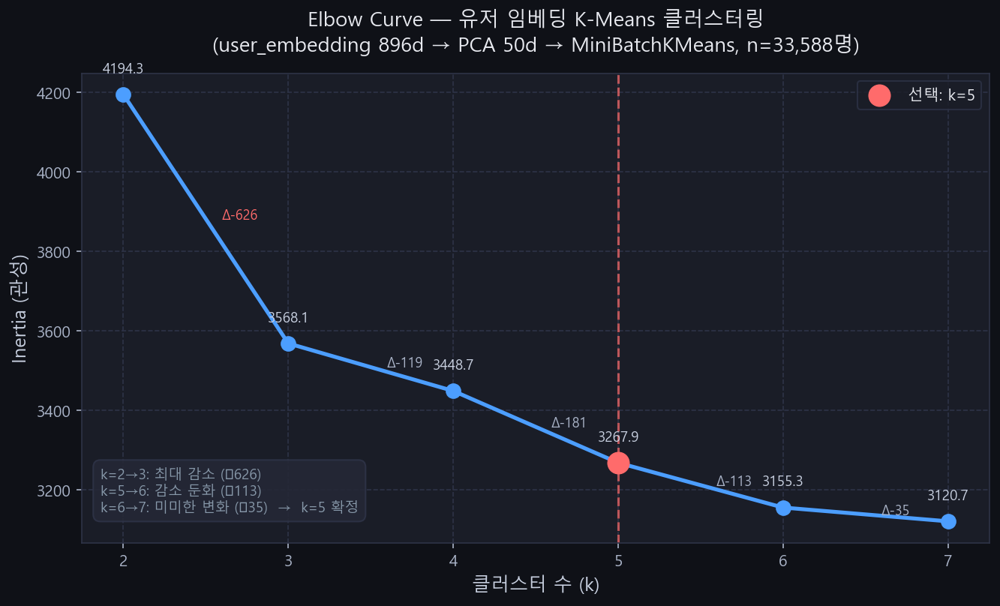
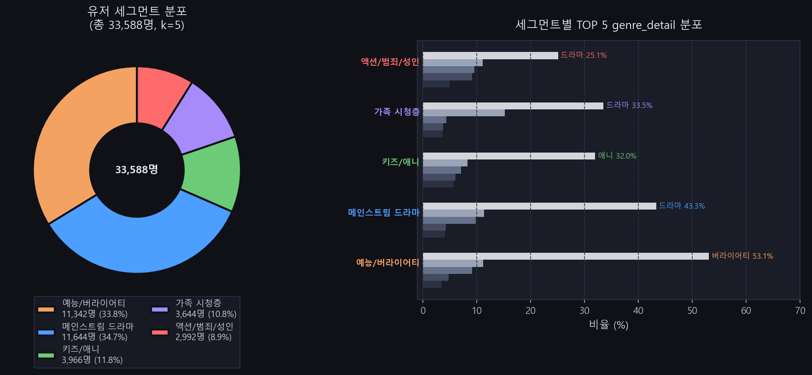

# gen_rec_sentence 탐색 과정 기록

> **목적**: LLM 기반 VOD 감성 카피(rec_sentence) 생성 파이프라인 구축 과정의
> 의사결정·실험·품질 개선 전 과정을 보고서 제출용으로 기록한다.

---

## 목차

1. [프로젝트 배경 및 목표](#1-프로젝트-배경-및-목표)
2. [Phase 0 — 베이스 모델 선정](#2-phase-0--베이스-모델-선정)
3. [Phase 1 — Seed 데이터 생성 파이프라인 구축](#3-phase-1--seed-데이터-생성-파이프라인-구축)
4. [품질 필터 설계 및 반복 개선](#4-품질-필터-설계-및-반복-개선)
5. [CLIP 시각 키워드 추출 도입](#5-clip-시각-키워드-추출-도입)
6. [배치 실행 결과 및 품질 추이](#6-배치-실행-결과-및-품질-추이)
7. [Seed 데이터 편향 발견 및 층화 추출 도입](#7-seed-데이터-편향-발견-및-층화-추출-도입)
8. [Phase 2 — 유저 세그먼트 기반 맞춤 카피 설계](#8-phase-2--유저-세그먼트-기반-맞춤-카피-설계)
9. [K-Means 클러스터링 탐색 및 결과](#9-k-means-클러스터링-탐색-및-결과)
10. [세그먼트 확정 및 톤 게이팅 설계](#10-세그먼트-확정-및-톤-게이팅-설계)
11. [프롬프트 최적화: Verbose vs Minimal Few-shot](#11-프롬프트-최적화-verbose-vs-minimal-few-shot)
12. [모델 업그레이드 탐색: gemma2:9b → gemma3:12b](#12-모델-업그레이드-탐색-gemma29b--gemma312b)
13. [3-Way 모델 비교 결과 및 최종 선정](#13-3-way-모델-비교-결과-및-최종-선정)
14. [세그먼트 분화 검증](#14-세그먼트-분화-검증)
15. [API 서빙 레이어 버그 수정](#15-api-서빙-레이어-버그-수정)
16. [프로덕션 배치 계획 및 사후검증 설계](#16-프로덕션-배치-계획-및-사후검증-설계)
17. [Colab 배치 실행 및 품질 필터 튜닝](#17-colab-배치-실행-및-품질-필터-튜닝)
18. [미결 과제 및 다음 단계](#18-미결-과제-및-다음-단계)

---

## 1. 프로젝트 배경 및 목표

### 비즈니스 문제

유저가 VOD 시리즈 상세 페이지에 진입하여 줄거리·스틸샷을 확인한 뒤 결제를 결정하면
**구매 전환율이 낮아진다.** 홈 배너 포스터만으로 시청 결정을 유도하는 것이 목표다.

### rec_sentence의 역할

| 조건 | 내용 |
|------|------|
| 노출 위치 | 홈 배너 포스터 하단 |
| 길이 제약 | 20~80자 (UI 고정 공간) |
| 톤 | 감성 카피 — 장면 시각화 + 기대감 형성 |
| 입력 | VOD 메타데이터 + CLIP 영상 임베딩 |
| 출력 단위 | VOD 1건당 1건 (초기) → 유저 세그먼트별 N건 (목표) |

### pattern_reason과의 차이

| 항목 | pattern_reason | rec_sentence |
|------|----------------|--------------|
| 성격 | 추천 사유 설명 | VOD 감성 카피 |
| 입력 | 시청 이력 + 태그 | VOD 메타 + CLIP 임베딩 |
| 유저 의존 | O | X → 세그먼트 의존으로 발전 |

---

## 2. Phase 0 — 베이스 모델 선정

### 비교 실험 (Ollama 로컬, zero-shot)

| 모델 | 결과 | 탈락 사유 |
|------|------|----------|
| **Gemma 2 9B** | **채택** | 장면 시각화 우수, 영상 분위기를 떠올리게 하는 톤 |
| EXAONE 3.5 7.8B | 탈락 | "감독의 독보적인~" 식 인물 홍보 톤, 영상 기대감 약함 |
| Qwen 2.5 7B | 탈락 | 영어 혼입("wager"), 사실 오류, 추상적 표현 |

**결정**: `gemma2:9b` (Ollama 로컬 추론)

---

## 3. Phase 1 — Seed 데이터 생성 파이프라인 구축

### 파이프라인 구성

```
[context_builder.py]
  DB → VOD 메타데이터 + CLIP 영상 임베딩(512d) 조합
        ↓
[visual_extractor.py]  ← 신규 추가
  CLIP text probing → 영상 시각 키워드 5개 추출
        ↓
[sentence_generator.py]
  Ollama gemma2:9b → rec_sentence 생성 (JSON 응답)
        ↓
[quality_filter.py]
  길이 / 금칙어 / 어미 / 제목 반복 / smry 복붙 검증
        ↓
[fill_seed_sentences.py]
  seed_examples.jsonl 업데이트 (5건마다 중간 저장)
```

### 초기 프롬프트 설계 원칙

```
- 정확히 2문장 (줄바꿈 1개로 구분)
- 총 20자 이상 80자 이하
- 장면·분위기·감정 시각적 묘사 — 줄거리 요약 금지
- 감독명·배우명이 한국어면 적극 활용, 영문이면 사용 금지
- 제목·회차 번호 문구 안에 반복 금지
```

---

## 4. 품질 필터 설계 및 반복 개선

품질 필터는 배치 실행 결과를 보며 **발견된 문제를 즉시 반영**하는 방식으로 반복 개선했다.

### 4.1 최초 설계 (v1)

| 검증 항목 | 기준 |
|----------|------|
| 길이 | 20~80자 (초기 120자 → UI 제약 확인 후 80자로 강화) |
| 금칙어 | `최고의`, `역대급`, `지금 바로`, `보세요` 등 |
| smry 복붙 | n-gram Jaccard 유사도 > 0.3 |

### 4.2 배치 1 결과 분석 후 추가 (v2)

**발견된 문제:**
- 영문 감독명(`Lee Jang-hoon`)이 LLM 출력에 그대로 등장
- `보세요` 변형(`엿보세요`, `지켜보세요`)이 정규식에서 누락

**수정:**
- `_normalize_director()`: 영문 감독명 입력 전 빈 문자열로 치환
  - 정규식 버그 수정: `Lee Jang-hoon` 패턴(하이픈 뒤 소문자) 미처리 → `^[A-Z][a-z]+(\s[A-Z][a-z]+(-[a-z]+)*)+$`
- 금칙어 확장: `느껴보세요`, `빠져보세요`, `만나보세요`, `경험하세요` 등 12개 추가
- `[가-힣]보세요` 정규식 추가 (변형 전부 차단)
- 제목 반복 감지 추가 (회차 번호 제거 후 3자 이상 제목이 문구에 포함되면 차단)
- 영문 감독명 출력 감지: `[A-Z][a-z]+ [A-Z][a-z]+` 정규식

### 4.3 배치 2 결과 분석 후 추가 (v3)

**발견된 문제:**
- `있습니다`, `합니다` 등 합쇼체 어미 → 설명문 톤, 카피라이팅 불적합
  - 예: "마법처럼 반짝이는 공룡의 세계 속에서, 불길한 폭탄이 터지며 미래가 뒤흔들리고 **있습니다**."
- `<br>` HTML 태그가 문구에 포함되는 케이스 발생

**수정:**
- `[습ㅂ]니다` 정규식 추가 → `formal_ending` 플래그
- `<[^>]+>` 정규식 추가 → `html_tag` 플래그
- 프롬프트 규칙 추가:
  - "~있습니다, ~합니다 등 합쇼체 어미 금지 — 서술형(~다/~네/~지) 또는 명사형 종결"
  - "HTML 태그(<br> 등) 사용 금지"

### 4.4 품질 필터 최종 구성

```python
검증 순서:
1. 빈 문자열 체크
2. 길이 (20~80자)
3. 금칙어 (22개)
4. ~보세요 정규식
5. 합쇼체 정규식 [습ㅂ]니다  ← v3 추가
6. HTML 태그 정규식          ← v3 추가
7. smry n-gram 복붙 (Jaccard > 0.3)
8. 제목 반복 감지
9. 영문 감독명 감지
```

### 4.5 재시도 로직 도입

품질 실패 시 LLM을 재호출하도록 `fill_seed_sentences.py` 수정:
- 최대 3회 시도 (temperature +0.1씩 증가: 0.7 → 0.8 → 0.9)
- 첫 시도 실패 시 temperature를 높여 다양성 증가 유도

---

## 5. CLIP 시각 키워드 추출 도입

### 동기

배치 1 품질 검토 시 **"문구가 메타데이터(장르, 줄거리)만 반영하고 실제 영상의 시각적 특성이 없음"** 이 확인되었다.

`vod_embedding` 테이블에 CLIP ViT-B/32 영상 임베딩(512d)이 이미 적재되어 있으므로,
이를 CLIP 텍스트 임베딩과 비교해 **영상에서 강하게 나타나는 시각 패턴**을 추출할 수 있다.

### CLIP text probing 원리

```
[사전 정의된 시각 묘사어 29개]
  한국어 레이블   ←→   영어 CLIP query
  "격렬한 액션·전투"  →  "intense action fight battle"
  "눈물·슬픔"        →  "tears sadness crying"
  "도시 야경"        →  "city night skyline"
  ...

[추출 과정]
  1. 29개 쿼리를 CLIP 텍스트 인코더로 인코딩 (최초 1회, 캐시)
  2. VOD의 영상 임베딩(512d)과 29개 텍스트 임베딩의 코사인 유사도 계산
  3. 상위 top-k (기본 5개) 한국어 레이블 반환
```

### 시각 묘사어 분류 체계 (29개)

| 카테고리 | 키워드 예시 |
|---------|-----------|
| 조명·색감 | 어두운 조명, 밝고 화사한 화면, 따뜻한 색조, 차갑고 푸른 색조, 흑백 화면 |
| 배경·장소 | 도시 야경, 자연 속 광활한 풍경, 우주·SF 배경, 역사적 시대 배경, 해변·바다 |
| 장면 유형 | 격렬한 액션·전투, 고속 추격전, 폭발·불꽃, 눈물·슬픔, 로맨틱한 순간 |
| 인물 | 강렬한 눈빛 클로즈업, 어린이·가족, 고독한 인물, 군중·집회 |

### 프롬프트 주입 방식

```
VOD 정보:
- 영상 시각 패턴: 격렬한 액션·전투, 눈물·슬픔, 긴장감 넘치는 대치, 마법·환상 효과, 폭발·불꽃

규칙:
- [영상 시각 패턴]이 있으면 해당 분위기를 문구에 반드시 반영할 것
```

### 효과 검증 (dry-run)

```
[트리거 02회]
  [시각] 마법·환상 효과, 눈물·슬픔, 긴장감 넘치는 대치, 폭발·불꽃, 어두운 조명
  → "어둠 속에서 번쩍이는 불꽃, 슬픔이 가득한 눈빛 뒤로 감춰진 진실."

[미키 17]
  [시각] 마법·환상 효과, 눈물·슬픔, 격렬한 액션·전투
  → "차가운 얼음행성에서 마법처럼 변하는 미키의 모습에 눈물이 고아.
     봉준호 감독의 전설적인 비전이 당신을 절정의 스릴로 데려갈 것이다."
```

CLIP 임베딩이 **"폭발·불꽃", "어두운 조명"** 등 구체적 시각 단어로 문구에 반영됨을 확인.

---

## 6. 배치 실행 결과 및 품질 추이

| 배치 | 범위 | 통과 | 실패 | 통과율 | 주요 실패 원인 |
|------|------|------|------|--------|---------------|
| 1차 실행 | 0~29 | 13 | 17 | **43%** | 영문 감독명, 보세요 변형 미필터 |
| 2차 실행 | 30~59 | 20 | 10 | **67%** | 보세요 여전히 발생, too_long |
| 3차 실행 (정규식 수정 + 재시도) | 0~29 re | 22 | 8 | **73%** | 하이픈 감독명 버그 잔존 |
| 4차 실행 (버그 수정 + 3회 재시도) | 0~29 re | 29 | 1 | **97%** | too_long 1건 (3회 모두 초과) |
| 배치 2 | 30~59 | 30 | 0 | **100%** | — |

**개선 흐름**: 43% → 67% → 73% → 97% → 100%

---

## 7. Seed 데이터 편향 발견 및 층화 추출 도입

### 문제 발견

배치 실행 중 생성된 문구를 검토하다 **"애니메이션이 너무 많다"** 는 점을 발견.

원인 분석:
- `build_seed_data.py`가 `ORDER BY v.full_asset_id` + `LIMIT 100`으로 단순 추출
- `full_asset_id` 알파벳순 앞쪽이 특정 콘텐츠(애니/SF)에 편중

### 실제 seed 분포 (편향 상태)

```
Action & Adventure: 10건  /  Kids: 10건  /  SF: 10건
SF/메카: 10건  /  SF/환타지: 10건  /  Reality: 10건
Talk: 10건  /  가족: 10건  /  골프: 6건  /  ...
→ 드라마·영화·예능: 0건 (!)
```

### 실제 DB 분포 (watch_history 기준)

```
TV드라마 / 드라마: 35,029건
TV드라마 / 외화 시리즈: 26,277건
TV 연예/오락 / 연예/오락: 12,163건
TV애니메이션 / 액션/모험: 7,173건
영화 / 액션/어드벤쳐: 4,139건
```

→ 실제 DB는 드라마가 압도적이나 seed는 완전 역전.

### 수정: 층화 추출 (Stratified Sampling)

`context_builder.py`에 `stratify_by_ct_cl` 옵션 추가:

```python
target_ct_cls = ["TV드라마", "영화", "TV 연예/오락", "TV애니메이션", "키즈"]
# 각 유형에서 RANDOM() 샘플링으로 균등 추출
```

### 신규 seed_examples_v2.jsonl 분포

```
드라마: 18건  /  연예/오락: 19건  /  애니메이션: 17건
액션/어드벤쳐: 5건  /  공포/스릴러: 6건  /  외화 시리즈: 3건  /  ...
```

→ 드라마·영화·예능·애니가 고르게 포함.

---

## 8. Phase 2 — 유저 세그먼트 기반 맞춤 카피 설계

### 문제 인식

현재 rec_sentence는 **전체 고객층을 대상으로 한 일반적 광고 문구**다.
동일한 VOD라도 유저 취향에 따라 강조할 포인트가 다르다.

예시 (미키 17):
- 액션/SF 마니아: "얼음행성을 배경으로 펼쳐지는 폭발적 생존 게임"
- 감성 드라마 선호: "죽고 또 살아나며, 그가 지키려 한 단 하나의 진심"
- 봉준호 팬: "봉준호 감독이 그려낸 인간 복제의 아이러니"

### 현재 가용 데이터

| 테이블 | 내용 | 규모 |
|--------|------|------|
| `public.user_embedding` | 896d 벡터 (CLIP 512 + 텍스트 384, weighted mean) | 225,260명 |
| `public.watch_history` | vod_id, completion_rate, satisfaction | 3,993,008건 |
| `public.vod` | genre_detail (드라마, 버라이어티, 범죄 등 상세 분류) | — |

### 설계 방향

```
[기존]
  VOD → rec_sentence 1건 (모든 유저 동일)

[목표]
  VOD × 유저 세그먼트 → rec_sentence N건 (세그먼트별 맞춤)

  서빙 시: 유저가 속한 세그먼트 확인 → 해당 문구 노출
```

### watch_history 기준 genre_detail 분포 (상위)

```
드라마: 991,318건 (24.8%)
버라이어티: 770,848건 (19.3%)
애니: 311,492건 (7.8%)
코믹: 197,250건 (4.9%)
음악_예능: 160,008건 (4.0%)
범죄: 133,183건 (3.3%)
다큐교양: 104,890건 (2.6%)
액션: 95,766건 (2.4%)
SF: 72,333건 (1.8%)
스릴러: 60,472건 (1.5%)
멜로로맨스: 28,293건 (0.7%)
...
```

---

## 9. K-Means 클러스터링 탐색

### 방법론 선택 과정

**옵션 A: K-Means 클러스터링** (탐색적)
- user_embedding 896d → PCA 50d → MiniBatchKMeans
- 실제 시청 패턴 기반의 데이터 주도 세그먼트
- 단점: 클러스터가 장르 경계와 정확히 일치하지 않을 수 있음 — 사후 레이블링 필요

**옵션 B: Rule-based 세그먼트** (빠르고 통제 가능)
- watch_history genre_detail 집계 → 유저별 dominant 장르로 세그먼트 결정
- 단점: 다중 취향 유저 처리 어려움

**결정**: A 먼저 실행 → 클러스터 의미가 불명확하면 B로 fallback

### 클러스터링 파이프라인

```python
# 1. 대상 유저: vod_count >= 20인 유저 (~33K명)
# 2. PCA: 896d → 50d
# 3. MiniBatchKMeans: k=2~7 Elbow curve 탐색
# 4. 최적 k로 최종 클러스터링
# 5. 각 클러스터 × watch_history JOIN vod.genre_detail → 분포 분석
# 6. user_segments.json 저장 (label 필드는 사람이 직접 결정)
```

### K-Means 사전 기대치 vs 실제 결과

사전에 "클러스터가 장르 경계와 일치하지 않을 수 있다"고 예상했으나,
**실제 결과는 예상보다 훨씬 명확하게 분리**되었다.

#### Elbow Curve 결과



```
k=2 → 3: inertia -626  ← 가장 큰 감소
k=3 → 4: inertia -119
k=4 → 5: inertia -181  ← 두 번째 의미 있는 감소
k=5 → 6: inertia -113
k=6 → 7: inertia  -35  ← 거의 이득 없음
→ k=5 선택
```

#### 실제 클러스터 결과 (k=5)



| 클러스터 | 유저 수 | 비중 | 상위 genre_detail |
|---------|---------|------|-----------------|
| 0 | 3,966명 | 11.8% | 애니 32%, 동요-동화 8%, 아이들나라 7%, 액션모험 6% |
| 1 | 11,342명 | 33.8% | **버라이어티 53%**, 음악_예능 11%, 드라마 9% |
| 2 | 2,992명 | 8.9% | 드라마 25%, 캐치온디맨드 11%, 액션 10%, 레드무비 9%, 범죄 5% |
| 3 | 3,644명 | 10.8% | 드라마 33%, **애니 15%**, 코믹 4%, 액션모험 4% |
| 4 | 11,644명 | 34.7% | **드라마 43%**, 코믹 11%, 버라이어티 10% |

#### 특이 발견

- **Cluster 2**: `캐치온디맨드`, `레드무비`는 성인 유료 채널명으로, 장르명이 아님.
  드라마·액션·범죄 비중을 합산하면 이 세그먼트는 장르물 + 성인 콘텐츠 혼합 소비층.
- **Cluster 3**: 드라마와 애니가 공존 → 어린 자녀를 둔 부모층. 본인은 드라마를 시청하고
  자녀와 함께 애니/키즈 콘텐츠를 시청하는 패턴으로 해석됨.

---

## 10. 세그먼트 확정 및 톤 게이팅 설계

### 10.1 세그먼트 레이블 확정

K-Means 결과와 도메인 해석을 결합해 다음과 같이 확정:

| cluster_id | 레이블 | 유저 수 | 비중 | 해석 근거 |
|-----------|--------|---------|------|----------|
| 0 | **키즈/애니** | 3,966명 | 11.8% | 애니·키즈 콘텐츠 집중 소비 |
| 1 | **예능/버라이어티** | 11,342명 | 33.8% | 버라이어티 53%로 압도적 |
| 2 | **액션/범죄/성인** | 2,992명 | 8.9% | 액션·범죄 장르 + 성인 채널 소비 혼합 |
| 3 | **가족 시청층** | 3,644명 | 10.8% | 부모(드라마) + 자녀(애니) 혼합 시청 패턴 |
| 4 | **메인스트림 드라마** | 11,644명 | 34.7% | 드라마 43% 주도, 코믹·예능 보조 |

### 10.2 선정성 문제 검토 및 결론

**우려**: Cluster 2(액션/범죄/성인) 세그먼트 페르소나를 LLM에 주입하면 성인 취향 문구가 생성될 수 있음.

**논의 과정**:
1. 예상 문구 시뮬레이션:
   - 위험 케이스: "얼음행성에서 벌거벗겨진 채 마주하는 원초적 생존 본능..."
   - 적절 케이스: "복제인간의 몸으로 반복되는 죽음, 그 끝에서 터지는 분노"
2. **재검토**: 성인 영화(미키 17, 청불 등)에 성인 취향의 강렬한 문구는 오히려 적합.
   문제는 선정성 자체가 아니라 **VOD 등급과 문구 톤의 불일치**.

**결론**: 선정성 일괄 금지 대신 **VOD `rating` 필드 기반 톤 게이팅** 적용.

### 10.3 톤 게이팅 설계

```
VOD rating     세그먼트 페르소나 적용     허용 톤
──────────────────────────────────────────────────────
전체가 / 7세    세그먼트 무관 안전 톤 강제  가족·감성
12세 / 15세     세그먼트 페르소나 반영      장르별 맞춤
청불 (성인)     세그먼트 페르소나 완전 반영  강렬·성인 허용
```

구현 방식:
- `fill_seed_sentences.py`에서 `ctx["rating"]`을 확인
- rating이 `전체가` / `7세`이면 세그먼트 페르소나 주입 없이 범용 프롬프트 사용
- rating이 `청불`이고 세그먼트가 `액션/범죄/성인`이면 강렬한 톤 허용 페르소나 주입

### 10.4 세그먼트별 프롬프트 페르소나 설계 (확정)

| 세그먼트 | 페르소나 설명 (프롬프트 주입용) |
|---------|-------------------------------|
| 키즈/애니 | 어린이와 함께 시청하는 가족 대상. 밝고 경쾌한 톤, 모험·신비·우정 강조 |
| 예능/버라이어티 | 웃음·공감·현실 리액션을 즐기는 시청자. 유머·반전·에너지감 강조 |
| 액션/범죄/성인 | 장르물과 강렬한 서사를 선호하는 성인 시청자. 긴장감·아드레날린·반전 강조 |
| 가족 시청층 | 가족 단위 시청, 감동·따뜻함·성장 서사를 선호. 정서적 공감 강조 |
| 메인스트림 드라마 | 드라마 감성과 캐릭터 서사를 즐기는 주류 시청자. 감정선·관계·몰입감 강조 |

---

## 11. 2026-03-29 품질 개선 세션

### 11.1 seed_examples.jsonl 1차 생성 결과 (구 프롬프트)

배치 0-99 전체 생성 완료 후 품질 분석:

| 항목 | 건수 |
|------|------|
| 총 | 100건 |
| 통과 | 97건 (97%) |
| 실패 (too_long / title_repeat / cliche) | 3건 |

**문제 발견**: 통과된 97건 중 다수가 어디에나 붙일 수 있는 추상적 감성 문구.

```
❌ "열망이 가슴을 벅차게 한다. 시간과 공간을 초월하는 전투에서 인간 존재의 감성이 불타오르네"
❌ "눈물이 끊이지 않는 슬픔 속에서도 매력은 멈추지 않는다"
→ 어떤 VOD인지 문구만 보고 알 수 없음
```

### 11.2 프롬프트 방향 재설계 (핵심 의사결정)

**문제 원인 분석**:

| 기존 프롬프트 규칙 | 부작용 |
|-------------------|--------|
| "감성 카피라이터" 역할 | 추상적·시적 언어 유도 |
| "장면·분위기·감정을 시각적으로 묘사 — 줄거리 요약 금지" | 내용을 드러내지 말라는 신호로 해석 → generic 문구 양산 |

**이상적인 문구 방향** (EXPLORATION_LOG 기존 기록 기반):
```
액션/SF 마니아 대상 (미키 17):
  ✅ "얼음행성을 배경으로 한 폭발적 생존 게임.
      죽고 또 살아나며, 그가 지키려 한 단 하나의 진심"
  → 문구만 읽어도 SF·생존·감정선이 즉시 떠오름
```

**결론**: "감성 카피라이터" → "콘텐츠 소개 작가"로 역할 전환. 핵심 목표를 *콘텐츠 정체성 즉시 전달*로 변경.

### 11.3 프롬프트 변경 내용

**변경 파일**: `sentence_generator.py` / `batch_generate.py` 두 곳 동일 적용

| 항목 | 이전 | 이후 |
|------|------|------|
| 역할 | "감성 카피라이터" | "콘텐츠 소개 작가" |
| 핵심 지시 | "장면·분위기·감정 시각적 묘사 — 줄거리 요약 금지" | "시청자가 문구만 읽어도 세계관·상황·핵심 갈등을 즉시 떠올릴 수 있어야 함" |
| 줄거리 규칙 | "줄거리 요약 금지" | "줄거리를 그대로 옮기지 말 것 — 핵심 배경·상황·갈등만 압축" |
| 시각 패턴 | "반드시 반영할 것" | "분위기 참고로만 활용" |
| few-shot 예시 | 없음 | 좋은 예시 3개 + 나쁜 예시 2개 추가 |

**few-shot 좋은 예시 (프롬프트에 포함)**:
```
- SF/생존: "얼음행성을 배경으로 한 폭발적 생존 게임.\n죽고 또 살아나며, 그가 지키려 한 단 하나의 진심"
- 전쟁/액션: "총알이 빗발치는 해변, 탈출을 위한 필사적인 항해.\n하늘을 덮은 적의 그림자, 절망 속에서 피어나는 인간의 의지"
- 범죄/스릴러: "도시 뒷골목을 배경으로 한 두 형사의 숨막히는 추격.\n진실에 가까워질수록 위험도 커진다"
```

### 11.4 quality_filter 클리셰 패턴 필터 추가

**배경**: `_FORBIDDEN_WORDS` (exact match)만으로는 어미 변형 차단 불가.
- "선사하다" 금지 → "선사합니다" / "선사해" 통과
- "펼쳐지다" 금지 → "펼쳐지는" / "펼쳐져" 통과

**추가 내용** (`quality_filter.py`):
```python
_CLICHE_PATTERNS = [
    r"선사하",    # 선사하다/선사합니다/선사해
    r"펼쳐지",    # 펼쳐지다/펼쳐지는/펼쳐지며
    r"불꽃",      # 불꽃처럼/불꽃이/불꽃의
]
```
→ `validate()` 내 정규식 검사로 어미 변형까지 이중 차단.

### 11.5 sentence_generator.py ct_cl 분기 제거 (설계 오류 수정)

**오류 경위**: `_NON_VISUAL_PROMPT_TEMPLATE` + `select_prompt_template()` 추가 — ct_cl 기반 프롬프트 자동 분기 구현.

**수정 근거**: 기존 설계 재확인 결과 —
- `ct_cl` 역할: 세그먼트별 생성 대상 결정 (`_CT_CL_SEGMENT_MAP`) — 어떤 세그먼트를 생성할지 결정
- 프롬프트 분기 기준: `segment_id` (페르소나 주입) + `rating` (톤 게이팅) — **ct_cl이 아님**
- `sentence_generator.py` 스코프: **seed data 전용** — 프로덕션 배치(`batch_generate.py`)는 자체 프롬프트 사용

→ `_NON_VISUAL_PROMPT_TEMPLATE` / `select_prompt_template()` 전부 제거. 단일 `_DEFAULT_PROMPT_TEMPLATE` 유지.

### 11.6 로컬 배치 생성 인프라 문제 및 대응

**환경**: GTX 1650 Ti (VRAM 4GB) — gemma2:9b (5.4GB) VRAM 초과 → CPU 오프로딩

**발생 문제**: CLIP(VisualExtractor)와 Ollama가 동시에 CUDA Host 메모리 요청 → 충돌
```
ERROR: llama runner process has terminated:
       error loading model: unable to allocate CUDA_Host buffer
```

**대응 방안**:
1. `fill_seed_sentences.py --no-visual` 플래그로 CLIP 로드 제거
2. Windows 시스템 레벨 환경변수 설정: `CUDA_VISIBLE_DEVICES=-1`, `OLLAMA_NUM_GPU=0`
3. `monitor_batch.sh` 자동 재시작 스크립트 작성 — Ollama 다운/fill_seed 비정상 종료 시 자동 복구

**근본 해결**: Colab A100 환경에서 프로덕션 배치 실행 예정 (로컬 ~34일 → A100 ~2-3시간)

### 11.7 품질 피드백 반영 (사람 검토)

100건 생성 후 사람 검토에서 발견된 추가 문제:

| 문제 유형 | 예시 | 조치 |
|----------|------|------|
| 존재하지 않는 단어 | "공부생" | 모델 한국어 어휘력 한계 — 모델 업그레이드 검토 |
| 어색한 외래어 사용 | "하트를 훔치는" | 프롬프트 규칙 추가: "한글 문맥에 영어 혼입 금지" |
| 시청자 평 톤 | "기대된다" | `_FORBIDDEN_WORDS`에 "기대된다/기대가 된다/기대를 모은다" 추가 |
| 허공에 뜬 줄임 | "만난 후..." | `_DANGLING_ELLIPSIS_RE` 정규식 추가 |
| 훅 문장 중복 | 1문장에서 흥미 유발 후 2문장도 반복 | 프롬프트 규칙: "둘째 문장은 핵심 정보를 깔끔하게 전달" |

**quality_filter.py 추가 검증 항목**:
- `english_in_korean`: 한글 문맥 내 영어 3자 이상 삽입 감지 (`[가-힣]\s+[a-zA-Z]{3,}\s+[가-힣]`)
- `dangling_ellipsis`: "만난 후..." 스타일 방향성 없는 줄임 감지

---

## 12. 프롬프트 최적화: Verbose vs Minimal Few-shot

### 12.1 문제 발견

11.3의 프롬프트 재설계(콘텐츠 소개 작가) 적용 후, **few-shot 예시를 늘리면 오히려 품질이 하락**하는 현상 발견.

**Verbose 프롬프트 (v2)**: 11개 규칙 + 좋은 예시 5개 + 나쁜 예시 5개
**Minimal 프롬프트 (v3)**: 5개 규칙 + 좋은 예시 2개 + 나쁜 예시 1개

### 12.2 Verbose vs Minimal 비교 (gemma2:9b, 동일 100건)

| 지표 | Verbose (v2) | Minimal (v3) | 판정 |
|------|-------------|-------------|------|
| 80자 초과 | **21건** | **1건** | v3 압승 |
| 평균 길이 | 72.3자 | 60.1자 | v3 적정 |
| "마주한 진실은..." 패턴 반복 | **5건** | **0건** | v3 압승 |
| 품질 실패 | 11건 | 7건 | v3 우위 |

### 12.3 원인 분석

9B 급 소형 모델에서 과도한 few-shot은 **패턴 모방(pattern mimicry)** 유발:
- 예시의 특정 표현("마주한 진실은...")을 다른 VOD에도 반복 적용
- 많은 규칙이 서로 충돌 신호로 작용 → 길이 제약 무시 경향 증가
- 소형 모델의 context window 내 attention 분산 → 핵심 규칙 준수율 하락

### 12.4 결론

**소형 모델(9B)에서는 프롬프트를 최소화하는 것이 최적**:
- 규칙: 5개 이하 (핵심만)
- Few-shot: 좋은 예시 2개 + 나쁜 예시 1개 (대비용)
- 상세 지시는 프롬프트가 아닌 **quality_filter 사후 검증**으로 이관

**최종 프롬프트 (v3)**:
```
역할: IPTV VOD 콘텐츠 소개 작가
규칙 5개:
  1. 1~2문장, 20~80자
  2. 핵심 배경·상황·갈등 구체적으로 — 시적·추상적 금지
  3. 감독명·배우명 네임밸류 활용 (영문 제외)
  4. 제목 반복 금지, 권유형/합쇼체 금지
  5. JSON: {"rec_sentence": "..."}
좋은 예 2개 / 나쁜 예 1개
```

---

## 13. 모델 업그레이드 탐색: gemma2:9b → gemma3:12b

### 13.1 동기

Minimal 프롬프트(v3)로 품질 안정성은 확보했으나, **한국어 문장 자연스러움**에 한계:
- "경험적 팀워크" (부자연스러운 한자어 조합)
- "첫 전회가 온다" (비문)
- "공부생" (존재하지 않는 단어)

→ 모델 자체의 한국어 능력 향상이 필요.

### 13.2 후보 모델

| 모델 | 크기 | 양자화 | 특성 |
|------|------|--------|------|
| gemma2:9b | 5.4GB | Q4 (Ollama 기본) | 현행 — 장면 시각화 우수, 한국어 가끔 어색 |
| gemma3:12b | 8.1GB | Q4_K_M (post-training 양자화) | 파라미터 증가 + Gemma 3 한국어 개선 |
| gemma3:12b-it-qat | 8.9GB | QAT (학습 시 양자화 반영) | BF16급 품질 유지하면서 Q4 크기 |

**QAT (Quantization Aware Training) vs Q4_K_M**:
- Q4_K_M: 학습 완료된 BF16 모델을 사후(post-training) 양자화 → 양자화 과정에서 정보 손실
- QAT: 학습 단계에서부터 양자화를 시뮬레이션 → 모델이 양자화 오차에 적응하며 학습 → BF16 수준 품질 유지

> 참고: 프로젝트에서 설계한 DoRA + QLoRA는 LoRA 파인튜닝용이며, 베이스 모델 양자화와는 별개.

### 13.3 실행 환경

- GPU: GTX 1650 Ti (VRAM 4GB) — 3개 모델 모두 VRAM 초과 → **CPU 오프로딩**
- gemma3:12b (8.1GB): 1건당 ~45초 (CPU)
- gemma3:12b-it-qat (8.9GB): 1건당 ~45초 (CPU, QAT이지만 동일 파라미터 수)
- 100건 생성: ~75분

### 13.4 3-Way 비교 결과

동일 100건 VOD, 동일 Minimal 프롬프트(v3) 적용.

#### 수치 비교

| 지표 | gemma2:9b | gemma3:12b Q4_K_M | gemma3:12b QAT |
|------|-----------|-------------------|----------------|
| 평균 길이 | 60.1자 | 65.0자 | 61.6자 |
| 80자 초과 | 1건 | 3건 | 1건 |
| 20자 미만 | 0건 | 0건 | 0건 |
| 품질 실패 | 7건 | 7건 | 8건 |
| 느낌표(!) 사용 | 47건 | 96건 | 98건 |
| 클리셰/금칙어 | 0건 | 3건 | 3건 |

#### 문장 스타일 비교

| 패턴 | gemma2:9b | Q4_K_M | QAT |
|------|-----------|--------|-----|
| `~다` 종결 | 49건 | 48건 | 49건 |
| 명사형 종결 | 16건 | 0건 | 1건 |
| 느낌표(!) | 47건 | 96건 | 98건 |

#### 동일 VOD 문장 품질 비교 (샘플)

**[캐셔로 07회]** — 초능력 사용 시 돈이 줄어드는 남자
```
gemma2  : 초능력자 이준호, 지갑도 날리는 '돈' 문제에 시달리며 김혜준 등과 함께 싸우는 재밌는 모험!
Q4_K_M  : 초능력은 있지만 돈이 줄어드는 남자! 이준호가 펼치는 좌충우돌 코믹 액션 판타지.
QAT     : 이준호, 초능력 사용하면 돈이 줄어드는 저주에! 돈 때문에 마음 편히 싸울 수 없는 남자의 코믹 액션 활약기!
```
→ QAT가 설정의 아이러니("돈 때문에 마음 편히 싸울 수 없는")를 가장 잘 포착.

**[프리 폴]** — 태양 폭발, 우주 고립 생존 SF
```
gemma2  : 태양의 파괴적인 폭발로 고립된 우주정거장, 막심은 AI 안야와 함께 생존 확률 1%를 걸고 귀환을 위한 치열한 전투를 시작한다.
Q4_K_M  : 태양 폭발로 동료를 잃고 우주에 고립된 '막심', AI '안야'와 함께 생존 확률 1%의 귀환을 위한 사투를 벌인다!
QAT     : 태양 폭발로 우주에 고립된 생존자, AI와 함께 1%의 생존 가능성을 겨우 붙잡고 탈출을 위한 사투를 벌인다.
```
→ QAT가 가장 간결하면서 핵심 정보 전달.

**[개와 늑대의 시간]** — 반려견 행동 교정 예능
```
gemma2  : 이준기·남상미 MC! 반려견이 다시 늑대로 돌아간다는 신기한 현상에 '개 전문가' 강형욱, '사람 전문가' 김성주가 개선 프로젝트를 진행한다.
Q4_K_M  : 반려견이 늑대로?! 이준기·남상미·정경호·김갑수 라인, 개통령 강형욱과 김성주가 '우리 집 늑대' 가족의 좌충우돌 일상을 관찰한다!
QAT     : 반려견의 숨겨진 본능! 늑대로 돌아간 강아지들, 김성주·강형욱이 좌충우돌 견생·인생 개선에 나선다!
```
→ QAT의 "견생·인생"이 예능 톤에 가장 적합.

### 13.5 최종 모델 선정

**gemma3:12b-it-qat 확정**.

| 기준 | gemma2:9b | gemma3:12b Q4_K_M | **gemma3:12b QAT** |
|------|-----------|-------------------|--------------------|
| 한국어 자연스러움 | △ (비문 간혹) | ○ | **◎** |
| 길이 제어 | ◎ (avg 60.1) | △ (avg 65.0, 3건 초과) | **◎ (avg 61.6, 1건 초과)** |
| 콘텐츠 특이성 | ○ | ○ | **◎** (설정 아이러니, 톤 매칭) |
| 느낌표 남발 | ○ (47건) | × (96건) | **× (98건) → 프롬프트 규칙 추가로 해결** |
| 추론 속도 (CPU) | ~30초/건 | ~45초/건 | ~45초/건 |

**느낌표 남발 문제 대응**:
- 프롬프트 규칙 추가: "느낌표(!) 최대 1개 — 남발 금지"
- quality_filter 검증 추가: `sentence.count("!") > 1` → `too_many_exclamation` 플래그

---

## 14. 세그먼트 분화 검증

### 목적

파인튜닝 없이 프롬프트 페르소나 주입만으로 5개 세그먼트 간 문구 분화가 충분한지 검증.

### 실험 설계

- **대상**: 주요 4개 장르 × 3개 VOD = 12건
  - 영화: 덩케르크, 파묘, 인터스텔라
  - TV 드라마: 재벌집 막내아들, 트리거, 소방서 옆 경찰서
  - TV 연예/오락: 나는 솔로, 놀면 뭐하니, 신서유기
  - TV 애니메이션: 짱구는 못말려, 원피스, 명탐정 코난
- **세그먼트**: 5개 K-Means 클러스터 (segment 0~4)
- **모델**: gemma3:12b-it-qat
- **총 생성**: 12 × 5 = 60문장
- **저장**: `gen_rec_sentence/data/segment_diff_test.jsonl`

### 결과 분석

**영화·드라마**: 세그먼트별 톤 분화 명확
- segment 1 (영화마니아): 연출·영상미 강조 ("크리스토퍼 놀란의 긴장감 넘치는 연출")
- segment 2 (드라마 집중형): 인물 관계·서사 강조 ("가문의 비밀과 복수극")
- segment 4 (성인 콘텐츠 선호): 강렬하고 직접적 표현

**예능·애니메이션**: 분화 약함 (예상 범위 내)
- 장르 특성상 "웃음", "모험" 등 공통 키워드로 수렴
- 허용 가능 — 예능/애니는 감성적 분화보다 콘텐츠 설명이 중요

### 품질 이슈 발견

| VOD | 문제 | 원인 |
|-----|------|------|
| 재벌집 막내아들 (seg 4) | "reincarnate" 영어 혼입 | QAT 모델의 간헐적 영어 토큰 생성 |
| 소방서 옆 경찰서 (seg 1) | "뜨거운 사제" — 소방관 문맥에 부적합 | LLM 환각 (hallucination) |

- 영어 혼입: `quality_filter.py` 정규식 강화로 대응 완료 (`[가-힣]\s+[a-z]{4,}`)
- 환각("뜨거운 사제"): regex로 불가 → **사후검증 파이프라인** 설계 필요 (§16 참조)

### 결론

> **파인튜닝 불필요**. 프롬프트 페르소나 주입만으로 영화·드라마 장르에서 충분한 분화 확인.
> 예능·애니 수렴은 장르 특성상 자연스러운 결과. 프로덕션 배치 진행 가능.

---

## 15. API 서빙 레이어 버그 수정

### 15.1 히어로 배너 rec_sentence 제거

**문제**: `get_banner()`에 rec_sentence 조회 로직이 포함되어 있었으나,
rec_sentence는 **홈 TOP10 배너에만 노출**하는 것이 기획 의도.

**수정**: `API_Server/app/services/home_service.py`
- `get_banner()` 매개변수에서 `user_id` 제거
- rec_sentence 벌크 조회 로직 삭제
- 응답 dict에서 `rec_sentence`, `rec_reason` 필드 제거

`API_Server/app/routers/home.py`
- `home_service.get_banner(user_id=current_user)` → `home_service.get_banner()`

### 15.2 TOP10 배너 JOIN 버그 (Critical)

**문제**: `serving.rec_sentence` 테이블에는 `user_id_fk` 컬럼이 **존재하지 않음**.
PK는 `(vod_id_fk, segment_id)`. 기존 쿼리가 `rs.user_id_fk = tr.user_id_fk`로
JOIN하여 **항상 NULL 반환** (LEFT JOIN이므로 오류 없이 조용히 실패).

```sql
-- BEFORE (버그 — rec_sentence 항상 NULL)
LEFT JOIN serving.rec_sentence rs
    ON rs.user_id_fk = tr.user_id_fk AND rs.vod_id_fk = tr.vod_id_fk

-- AFTER (수정)
-- 1단계: user_id → segment_id 조회 (get_segment_id)
-- 2단계:
LEFT JOIN serving.rec_sentence rs
    ON rs.vod_id_fk = tr.vod_id_fk AND rs.segment_id = $2
```

**수정 파일**: `API_Server/app/services/home_service.py`
- `from app.services.rec_sentence_service import get_segment_id` 추가
- TOP10 쿼리에서 segment_id 매개변수화

---

## 16. 프로덕션 배치 계획 및 사후검증 설계

### 16.1 배치 생성 (Colab A100 — 오프라인 모드)

```
┌─────────────────────────────────────────────────┐
│  로컬                                            │
│  export_for_colab.py → vod_contexts.parquet      │
│  → Google Drive 업로드                            │
├─────────────────────────────────────────────────┤
│  Google Colab (A100 GPU)                         │
│  1. Ollama 설치 + gemma3:27b-it-qat              │
│  2. Drive 마운트 (parquet 읽기 + 결과 저장)       │
│  3. batch_generate.py --offline 실행             │
│     - 대상: 13,183 VOD × 5 segments = ~65K쌍     │
│     - 200건마다 자동 저장 (세션 끊김 대비)         │
│  4. 결과 → results.parquet (Drive 저장)           │
├─────────────────────────────────────────────────┤
│  로컬                                            │
│  results.parquet 다운로드                         │
│  ingest_results.py → serving.rec_sentence UPSERT │
└─────────────────────────────────────────────────┘
```

### 16.2 사후검증 파이프라인 (로컬)

Colab 배치 완료 후, 로컬에서 3단계 자동 검증 실행:

```
┌──────────────────────────────────────────────────────┐
│  Stage 1: quality_filter (기존 규칙)                  │
│  - 길이 / 금칙어 / 클리셰 / 느낌표 / 합쇼체 / HTML   │
│  - 영어 혼입 / 줄거리 복붙 / 제목 반복                │
│  → PASS / FAIL 분류                                  │
├──────────────────────────────────────────────────────┤
│  Stage 2: 메타데이터 교차검증 (신규)                   │
│  - konlpy 명사 추출 → VOD 메타(genre, cast, smry)와   │
│    대조하여 메타에 없는 고유명사 플래그                 │
│  - 환각 후보 자동 추출 ("뜨거운 사제" 류)              │
│  → FLAG / CLEAN 분류                                 │
├──────────────────────────────────────────────────────┤
│  Stage 3: 플래그 건만 수동/LLM 리뷰                   │
│  - Stage 2에서 FLAG된 건만 (예상 5~10%)               │
│  - 사람 검토 또는 Claude/GPT-4로 자동 판정            │
│  → APPROVE / REJECT                                  │
└──────────────────────────────────────────────────────┘
```

**핵심 원리**: 65K건 전수 검토 불가 → Stage 1(regex)·Stage 2(명사 교차검증)로
자동 필터링, 의심 건만 Stage 3에서 집중 검토.

### 16.3 전체 작업 흐름

```
1. 로컬: export_for_colab.py → parquet 추출 → Drive 업로드
2. Colab: batch_generate.py --offline → results.parquet (Drive 저장)
3. 로컬: results.parquet 다운로드 → ingest_results.py → DB UPSERT
4. 로컬: Stage 1 quality_filter → FAIL 건 재생성 또는 제거
5. 로컬: Stage 2 konlpy 교차검증 → FLAG 건 추출
6. 로컬: Stage 3 FLAG 건 수동/LLM 리뷰 → REJECT 건 재생성
7. DB: 최종 UPSERT (검증 통과분만)
8. API: 테스터 12명 segment_id 할당 완료 → 즉시 서빙 가능
```

---

## 17. Colab 배치 실행 및 품질 필터 튜닝

### 17.1 오프라인 모드 전환 (VPC 방화벽 제약)

VPC PostgreSQL이 Colab IP 대역을 허용하지 않아 **DB 직접 접속 불가**.
parquet 기반 오프라인 워크플로우로 전환:

```
로컬: export_for_colab.py → colab_data/vod_contexts.parquet (13,183 VOD, 1.4MB)
  ↓ Google Drive에 parquet + 소스코드 업로드
Colab: batch_generate.py --offline → results.parquet
  ↓ Google Drive에서 다운로드
로컬: ingest_results.py → serving.rec_sentence UPSERT
```

- `export_for_colab.py` (신규): hybrid_recommendation UNION popular_by_age → DISTINCT vod_id → smry 있는 VOD만 추출
- `ingest_results.py` (신규): results.parquet → DB UPSERT (500건 배치)
- `batch_generate.py` 리팩터: `--offline <dir>` 모드 추가, 200건마다 자동 저장 + resume 지원

### 17.2 Colab 노트북 구성

`colab_batch_generate.ipynb` — GPU 런타임(A100/T4) 기준:

| 셀 | 내용 |
|----|------|
| 1 | zstd + Ollama 설치 + Drive 마운트 |
| 2 | Ollama 서버 시작 + Drive 모델 캐시 복원 |
| 3 | 모델 다운로드 + Drive 캐시 저장 (최초 1회) |
| 4 | 의존성 설치 + 데이터 경로 설정 |
| 5 | 데이터 확인 (VOD 건수, ct_cl 분포) |
| 6 | 12B vs 27B 품질 비교 (선택) |
| 7 | 배치 생성 (소규모 테스트 → 전체) |
| 8 | 결과 확인 |

**세션 대응**: Ollama 모델을 Drive에 캐싱하여 재다운로드 생략 (~8분 절약).

### 17.3 gemma3:12b-it-qat 품질 문제 발견

10건 × 5seg = 50쌍 소규모 테스트 결과 **성공률 57% (27/47)**. 분석 결과:

| 실패 사유 | 건수 | 비율 |
|-----------|------|------|
| too_long (80자 초과) | 16 | 76% |
| title_repeat | 4 | 19% |
| forbidden/imperative (보세요, 만나보세요) | 6 | 29% |
| cliche (펼쳐지) | 3 | 14% |
| html_tag 오탐 (`<뽕>`) | 1 | 5% |
| too_many_exclamation | 2 | 10% |

**핵심 문제**: 12B 모델이 프롬프트의 길이 지시("70자 이내", "50자 내외")를 일관되게 무시.
프롬프트를 강화할수록 규칙 과부하로 할루시네이션 증가 — 어떤 문장을 생성해야 할지 모르는 상태.

### 17.4 품질 필터 및 후처리 개선

**1단계 — 프롬프트 길이 지시 강화**:
- "1~2문장, 20자 이상 80자 이하" → "반드시 50자 내외, 절대 80자 초과 금지"
- 효과 미미: 12B가 여전히 80~120자 생성

**2단계 — `_trim_to_limit()` 후처리 추가**:
```python
def _trim_to_limit(sentence, limit=80):
    if len(sentence) <= limit:
        return sentence
    # 첫 문장 추출 (.!?다네 기준), 20~80자이면 채택
    # 안 되면 80자 이내 마지막 자연 종결점에서 자름
```

**3단계 — quality_filter 개선**:
- html_tag 오탐 수정: `<뽕>` 같은 한글 꺾쇠 허용, `<div>` 같은 실제 HTML만 차단
- title_repeat 완화: 회차 VOD(선덕여왕 05회)는 제목 언급 허용, 회차 번호 반복만 차단
- quality_filter 실패 시 temperature 올려서 최대 5회 재시도 (0.7 → 0.8 → ... → 1.1)

### 17.5 모델 변경: gemma3:12b-it-qat → gemma3:27b-it-qat

후처리 + 필터 개선 후에도 12B의 근본 문제 해결 불가:
- 규칙이 많아질수록 **규칙 과부하** → 문장 품질 저하 + 할루시네이션 증가
- 길이 제어, 금칙어 회피, 페르소나 톤 조절을 **동시에** 처리하는 능력 부족

**gemma3:27b-it-qat로 변경** — 더 큰 모델이 복합 지시를 안정적으로 처리.
Colab A100 (40GB VRAM) 기준 27B (17GB) 충분히 적재 가능.

| 항목 | 12B | 27B |
|------|-----|-----|
| 모델 크기 | 8.9GB | 17GB |
| 길이 지시 준수 | × (일관 무시) | ○ |
| 복합 규칙 처리 | × (과부하) | ○ |
| A100 VRAM 여유 | 31GB | 23GB |
| 예상 배치 시간 | ~2-3h | ~5-7h |

---

## 18. 미결 과제 및 다음 단계

| 항목 | 상태 | 내용 |
|------|------|------|
| 프로덕션 배치 실행 | **실행 중** | Colab A100, gemma3:27b-it-qat, ~65K × 5 seg |
| 사후검증 Stage 2 구현 | 대기 | konlpy 명사 추출 + 메타데이터 교차검증 스크립트 |
| 테스터 확인 | 대기 | 12명 segment_id 할당 완료, segment 0 (키즈/애니) 테스터 없음 |
| 콜드스타트 유저 처리 | 결정됨 | segment_id 없는 유저 → 기본 세그먼트(2: 드라마 집중형) 할당 |
| LoRA 파인튜닝 | **보류** | 세그먼트 분화 검증 통과 — 현재 품질로 충분 |

---

## 변경 이력

| 날짜 | 파일 | 변경 내용 |
|------|------|----------|
| 2026-03-28 | `visual_extractor.py` | 신규 생성 — CLIP text probing 29개 시각 묘사어 |
| 2026-03-28 | `quality_filter.py` | _MAX_LEN 120→80, 금칙어 확장, 제목반복·영문감독명·합쇼체·HTML 검증 추가 |
| 2026-03-28 | `sentence_generator.py` | visual_keywords 프롬프트 주입, 합쇼체/HTML 금지 규칙 추가 |
| 2026-03-28 | `fill_seed_sentences.py` | 배치·재시도(3회)·VisualExtractor·임베딩 조회 통합 |
| 2026-03-28 | `context_builder.py` | stratify_by_ct_cl 층화 추출 옵션 추가 |
| 2026-03-28 | `build_seed_data.py` | --stratify 옵션, ct_cl 필드 저장 추가 |
| 2026-03-28 | `cluster_users.py` | 신규 생성 — 유저 K-Means 클러스터링 (PCA+MiniBatchKMeans) |
| 2026-03-28 | `seed_examples_v2.jsonl` | 장르 균형 층화 추출 버전 생성 (드라마18·예능19·애니17·영화류~20·키즈17) |
| 2026-03-28 | `user_segments.json` | K-Means k=5 결과 + 레이블 확정 저장 |
| 2026-03-28 | `cluster_assignments.parquet` | 유저 33K명 → cluster_id 매핑 저장 |
| 2026-03-29 | `quality_filter.py` | `_CLICHE_PATTERNS` 정규식 목록 추가 — 어미 변형 클리셰 이중 차단 |
| 2026-03-29 | `sentence_generator.py` | 프롬프트 재설계(감성 카피라이터→콘텐츠 소개 작가), ct_cl 분기 제거, few-shot 예시 추가 |
| 2026-03-29 | `batch_generate.py` | 프롬프트 재설계 동일 적용 (페르소나 주입 구조 유지) |
| 2026-03-29 | `monitor_batch.sh` | 신규 생성 — Ollama + fill_seed 자동 재시작 모니터링 스크립트 |
| 2026-03-29 | `seed_examples.jsonl` | 신규 프롬프트로 100건 전체 재생성 |
| 2026-03-29 | `quality_filter.py` | `english_in_korean`, `dangling_ellipsis` 검증 추가 / "기대된다" 금칙어 추가 |
| 2026-03-29 | `sentence_generator.py` | Verbose→Minimal 프롬프트 전환 (11규칙+5+5 → 5규칙+2+1) |
| 2026-03-29 | `seed_examples_v2_verbose.jsonl` | gemma2:9b + Verbose 프롬프트 결과 백업 |
| 2026-03-29 | `seed_examples_v3_gemma2.jsonl` | gemma2:9b + Minimal 프롬프트 결과 백업 |
| 2026-03-29 | `seed_examples_v4_gemma3_q4km.jsonl` | gemma3:12b Q4_K_M + Minimal 프롬프트 결과 백업 |
| 2026-03-29 | `seed_examples.jsonl` | gemma3:12b-it-qat + Minimal 프롬프트 100건 생성 (최종) |
| 2026-03-29 | `sentence_generator.py` | 기본 모델 gemma2:9b → gemma3:12b-it-qat 변경, "느낌표 최대 1개" 규칙 추가 |
| 2026-03-29 | `batch_generate.py` | "느낌표 최대 1개" 규칙 추가 |
| 2026-03-29 | `quality_filter.py` | `too_many_exclamation` 검증 추가 (느낌표 2개 이상 차단) |
| 2026-03-29 | `quality_filter.py` | `english_in_korean` 정규식 강화: `[가-힣]\s+[a-z]{4,}` (한글 뒤 소문자 4자+) |
| 2026-03-29 | `segment_diff_test.jsonl` | 신규 — 4장르 × 3 VOD × 5 세그먼트 = 60문장 분화 검증 |
| 2026-03-29 | `home_service.py` | 히어로 배너에서 rec_sentence 제거 (TOP10 전용) |
| 2026-03-29 | `home_service.py` | TOP10 JOIN 버그 수정: user_id_fk → segment_id 기반 |
| 2026-03-29 | `home.py` | get_banner() 호출에서 user_id 매개변수 제거 |
| 2026-03-29 | `export_for_colab.py` | 신규 — 추천 풀 VOD 메타데이터 parquet 추출 (오프라인 모드용) |
| 2026-03-29 | `ingest_results.py` | 신규 — Colab 결과 parquet → DB UPSERT (500건 배치) |
| 2026-03-29 | `batch_generate.py` | --offline 모드 추가, VisualExtractor 제거, 200건 자동 저장 + resume |
| 2026-03-29 | `batch_generate.py` | `_trim_to_limit()` 후처리 추가 — 80자 초과 시 첫 문장 추출 |
| 2026-03-29 | `batch_generate.py` | quality_filter 실패 시 최대 5회 재시도 (temperature +0.1/회) |
| 2026-03-29 | `batch_generate.py` | 프롬프트 길이 지시: "50자 내외, 절대 80자 초과 금지" |
| 2026-03-29 | `quality_filter.py` | html_tag 오탐 수정: 한글 꺾쇠(`<뽕>`) 허용, 실제 HTML만 차단 |
| 2026-03-29 | `quality_filter.py` | title_repeat 완화: 회차 VOD 제목 허용, 회차 번호 반복만 차단 |
| 2026-03-29 | `colab_batch_generate.ipynb` | 오프라인 모드 전환, 모델 캐시(Drive), zstd 설치 추가 |
| 2026-03-29 | `COLAB_GUIDE.md` | 신규 — Colab 오프라인 배치 실행 상세 가이드 |

## 주요 의사결정 로그

| 날짜 | 결정 사항 | 근거 |
|------|----------|------|
| 2026-03-28 | Gemma 2 9B 채택 | zero-shot 3종 비교 — 장면 시각화 톤 우수 |
| 2026-03-28 | 길이 제한 80자 확정 | 프론트엔드 포스터 하단 UI 고정 공간 |
| 2026-03-28 | CLIP text probing 도입 | 메타데이터만으로는 영상 시각 패턴 미반영 확인 |
| 2026-03-28 | 층화 추출 도입 | ORDER BY full_asset_id → 애니 편중 발견 |
| 2026-03-28 | K-Means A안 선택 | rule-based보다 데이터 기반 근거 확보 우선 |
| 2026-03-28 | k=5 확정 | Elbow curve: k=5→6 감소폭 -113, k=6→7은 -35로 급감 |
| 2026-03-28 | 선정성 일괄 금지 → rating 게이팅으로 변경 | 성인 VOD에는 강렬한 톤이 오히려 적합, VOD 등급 기반 제어가 정확 |
| 2026-03-28 | Cluster 3 레이블 "가족 시청층" | 드라마+애니 공존 = 어린 자녀 둔 부모의 혼합 시청 패턴 |
| 2026-03-29 | ct_cl 기반 프롬프트 분기 제거 | 설계 오류 — 프롬프트 분기는 segment_id+rating 기준이며 ct_cl은 생성 대상 결정에만 사용 |
| 2026-03-29 | 프롬프트 역할 "감성 카피라이터" → "콘텐츠 소개 작가" | seed 97건 분석 결과 generic 감성 문구 양산 확인 — 콘텐츠 정체성 즉시 전달로 목표 전환 |
| 2026-03-29 | "줄거리 요약 금지" 삭제 | 이 규칙이 내용 노출 자체를 차단해 generic 문구 유발 — "그대로 복붙 금지"로 대체 |
| 2026-03-29 | few-shot 예시 프롬프트 포함 | 모델이 추상적 감성어로 가는 경향 차단, 구체적 배경+상황 조합 패턴 예시로 유도 |
| 2026-03-29 | 로컬 배치: --no-visual 강제 | CLIP + Ollama CUDA Host 메모리 충돌 → VisualExtractor 비활성화로 대응 |
| 2026-03-29 | Verbose→Minimal 프롬프트 전환 | 9B 모델에서 과도한 few-shot → 패턴 모방(80초과 21건, "마주한 진실은..." 5건) 확인 → 5규칙+2+1로 최소화 |
| 2026-03-29 | gemma3:12b-it-qat 최종 모델 확정 | 3-Way 비교: 한국어 자연스러움 ◎, 길이 제어 ◎ (avg 61.6자), 콘텐츠 특이성 ◎ — 느낌표 남발은 프롬프트+필터로 해결 |
| 2026-03-29 | 느낌표(!) 최대 1개 규칙 도입 | QAT 모델 98/100건 느낌표 사용 → 프롬프트 규칙 + quality_filter 이중 차단 |
| 2026-03-29 | LoRA 파인튜닝 보류 | 세그먼트 분화 검증 60건 — 영화·드라마 분화 충분, 예능·애니 수렴은 장르 특성 |
| 2026-03-29 | 사후검증 3단계 설계 | 65K건 전수 검토 불가 → quality_filter + konlpy 교차검증 + FLAG 건만 리뷰 |
| 2026-03-29 | 히어로 배너 rec_sentence 제거 | 기획 의도: rec_sentence는 홈 TOP10 배너 전용 |
| 2026-03-29 | TOP10 JOIN key 변경 | serving.rec_sentence PK는 (vod_id_fk, segment_id) — user_id_fk 컬럼 없음 |
| 2026-03-29 | 콜드스타트 유저 기본 세그먼트 | segment_id 없는 유저 → segment 2 (드라마 집중형) 자동 할당 |
| 2026-03-29 | VPC 방화벽 → 오프라인 모드 | Colab → VPC DB 접속 불가 → parquet 기반 오프라인 워크플로우로 전환 |
| 2026-03-29 | VisualExtractor 배치에서 제거 | 시각 키워드 없이도 품질 충분 — 배치 의존성 최소화 |
| 2026-03-29 | `_trim_to_limit()` 후처리 도입 | 12B 모델이 길이 지시를 일관 무시 → 후처리로 80자 이내 강제 자름 |
| 2026-03-29 | 회차 VOD title_repeat 허용 | "선덕여왕 05회"에서 "선덕여왕"은 주제 자체 → 회차 VOD 제목 언급 불가피 |
| 2026-03-29 | gemma3:12b → 27b 변경 | 12B의 규칙 과부하 문제: 길이+금칙어+페르소나 동시 처리 불가 → 할루시네이션 증가 → 27B로 변경 |
| 2026-03-29 | Drive 모델 캐싱 도입 | Colab 세션 재시작 시 모델 재다운로드(~8분) 절약 |
